# P18：厄尼斯特·W·杜尔宾三世 - 欢迎和会议事务 - PyCon 2019 - leosan - BV1qt411g7JH

早上好。我非常兴奋地欢迎你们来到 2019 年 PyCon。PyCon 2019。

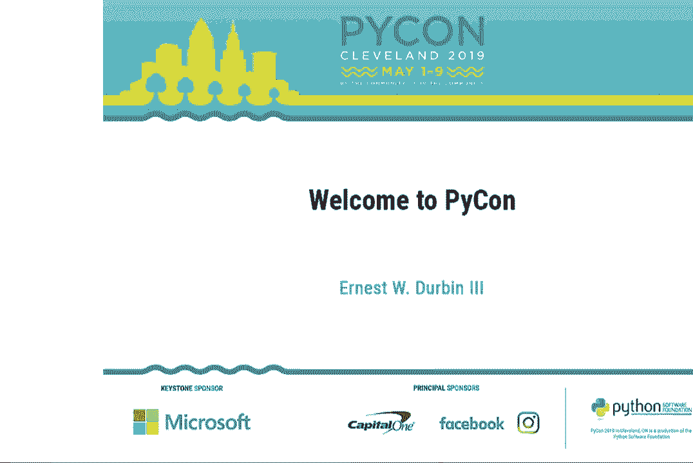

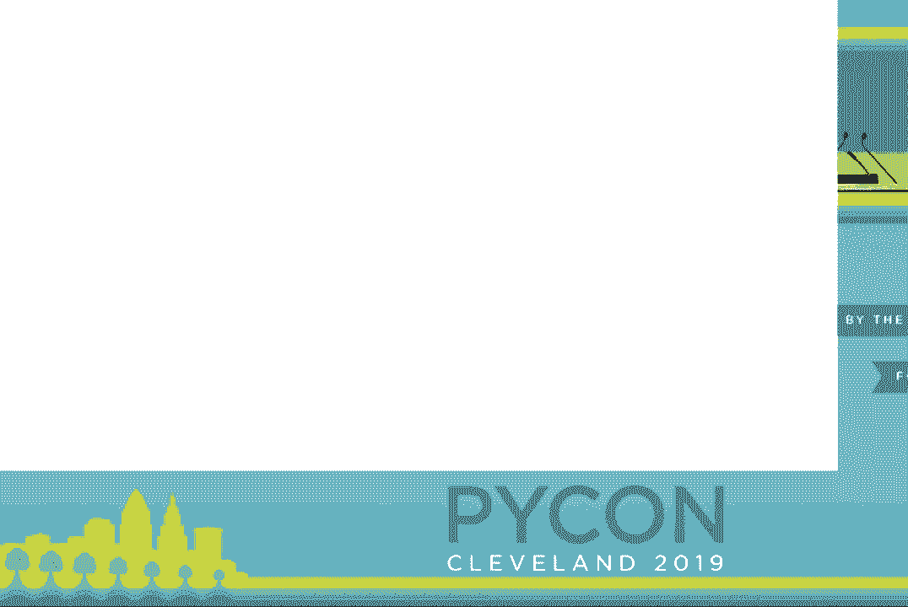

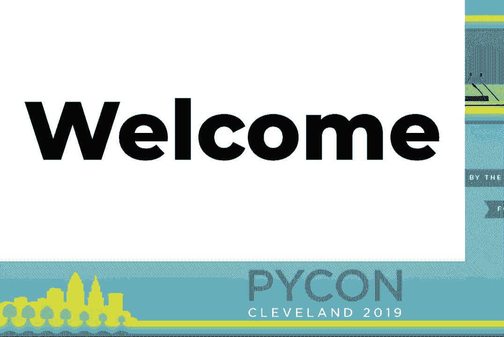

这里是俄亥俄州的克利夫兰。代表 PyCon 2019 的工作人员，我想先说声感谢。感谢所有让这次会议成为可能的志愿者。感谢 Python 软件基金会承担此次会议的财政责任。没有 PSF 的董事会和工作人员，我们不会在这里。我想感谢所有的演讲者。

前来分享他们工作的嘉宾们。我也要感谢支持这次会议的赞助商。当然，没有你们，这次会议也没有意义。所以我想感谢你们，并为所有这些人热烈鼓掌。我想说的第一件事是，PyCon 致力于提供一个安全的环境。

为每个人创造一个积极的体验。这与我们可能存在的任何差异无关。为了确保这一点，所有工作人员、与会者、演讲者、赞助商和志愿者在任何 PyCon 活动中都必须遵守我们的行为准则。请熟悉该 URL 上的行为准则以及处理事件的程序。

这些文件都在这里链接。你可以在 us.pycon.org 的“关于”部分找到这些文件，查看行为准则。如果在会议期间你担心有人。

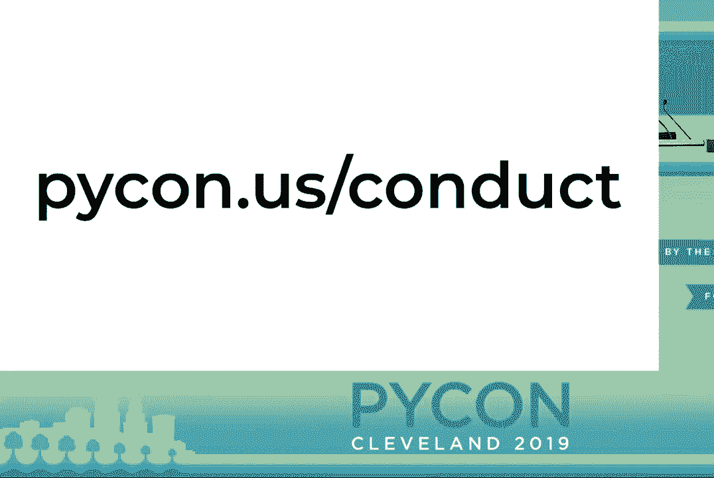

如果你认为有违反 PyCon 行为准则的行为，鼓励你进行报告。如果你不确定该事件是否属于违规行为，或者发生的地方是否受到该行为准则的保护，我们仍然鼓励你进行报告。组织者乐于接受那些不采取行动的报告，以创造一个更安全的空间。

在任何时候，你都可以通过电子邮件向 picon us report at picon.org、短信或电话 121862-8572 进行报告。或者在会议期间，你可以找到穿着特定制服的事件响应者。

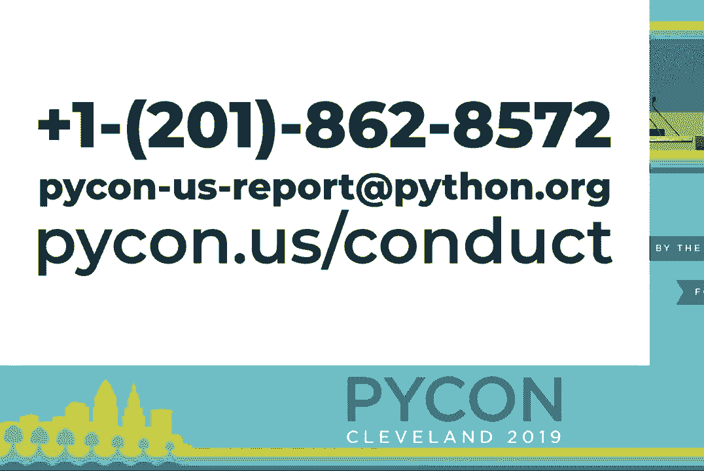

一件像这样的明亮颜色的 T 恤。再一次，这就是屏幕上的联系信息。

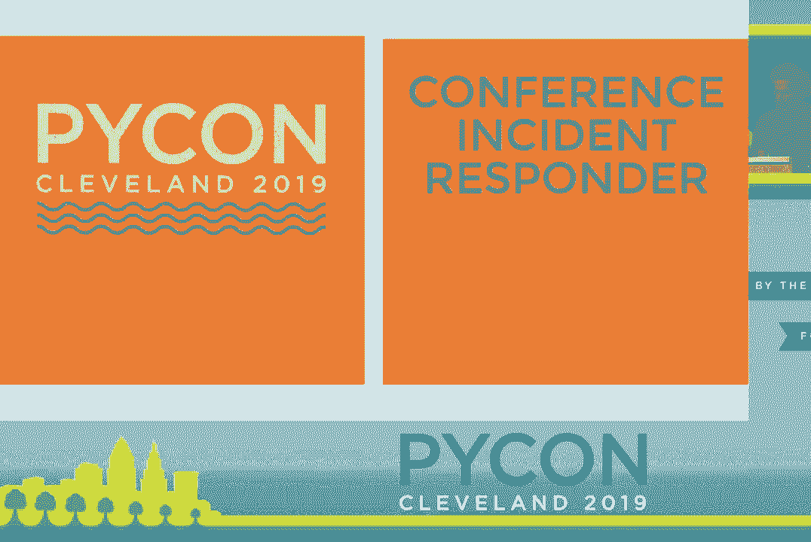

我鼓励你拍张照片、写下来或以某种方式保存在手机中。明白了吗？很棒。所以，快速介绍一下。再次欢迎来到 PyCon。你在这里。

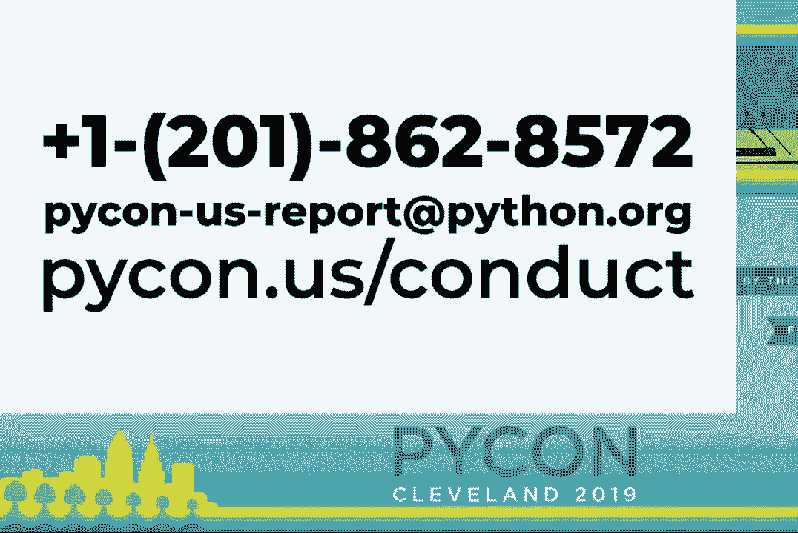

如果这是你第一次参加 PyCon，我想表示歉意。PyCon 已经成长到需要详细说明会议的每一个部分，而这几乎已经变得不可承受。然而，如果这是你第一次参加 PyCon，我希望你听说过或参加过我们的新人介绍会。

昨天的时间是 4:45。如果你没能参加，也没关系。今天在这个网址上，那个迎新会的视频会上传，你可以去观看 Adrian 分享会议的每一个细节，包括已经过去的内容。

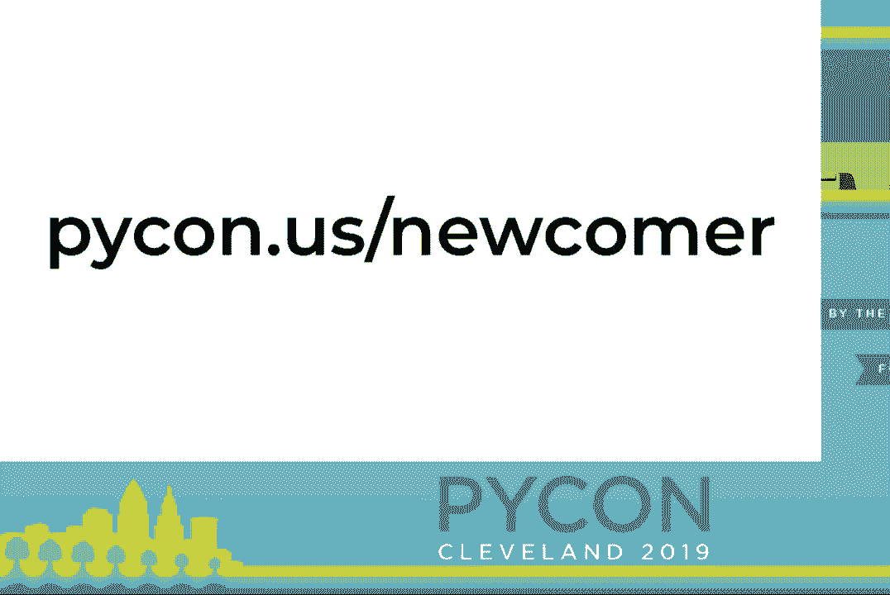

现在更一般地说，你在这个会议中心。它相当大，所以我们将逐步走过。首先，我想谈谈一些无障碍设施。

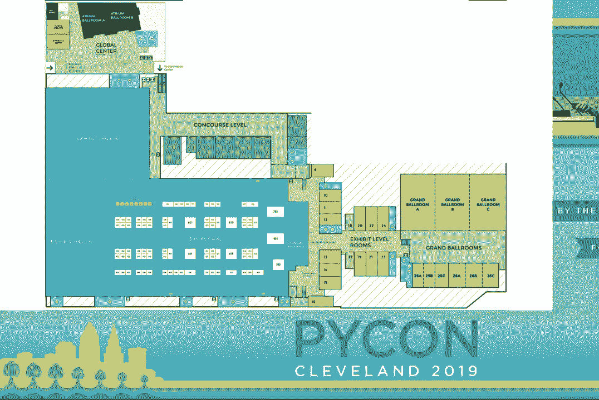

我们将为今年所有的演讲提供实时字幕，类似于你在我左边和右边看到的。此外，每个演讲室的中央区域保留了轮椅通道。会议符合 ADA 标准。然而，如果你有任何顾虑或需要额外的便利，请告诉工作人员。

我们将尽一切可能支持你。你在这里。这是展览厅 A。

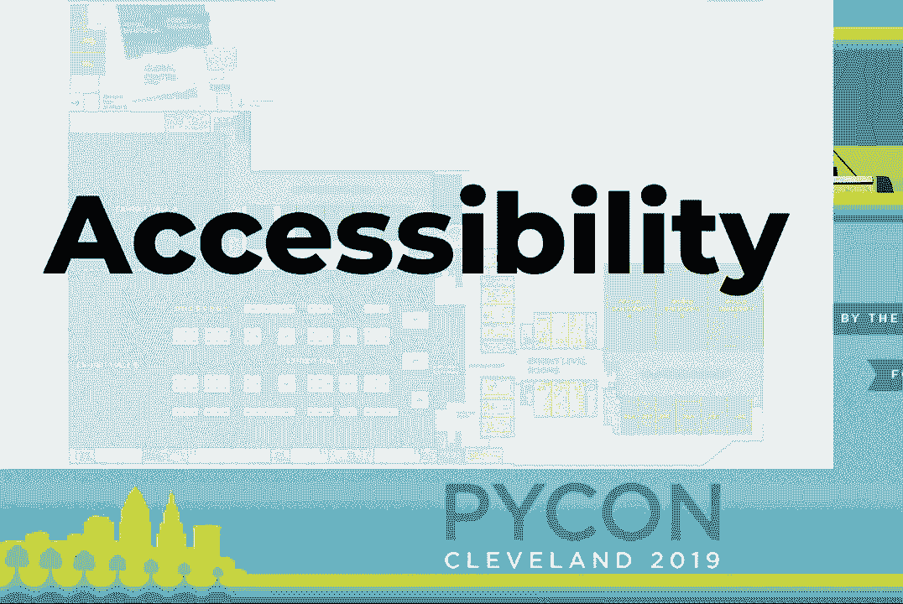

在接下来的三天里，我们将举行全体会议。在这些全体会议上，我们将很快有一些主题演讲。我们邀请了 Shah、Jessica，周日还有 PyCon 指导委员会小组和 Nina。此外，在这个房间里，这些座位上，你将找到快速演讲，日期是 5 月 40 日，周六早上，周日早上，以及周六明天的演讲。

到了今天结束时，考虑腾出一些时间参加快速演讲。你永远不知道会看到什么。如果你有兴趣进行快速演讲，这是一场非常短的五分钟演讲，你可以在注册处附近找到报名信息。你左边是展览厅。这位于 B 和 C 展览厅。你可能已经找到了，因为就是在那里。

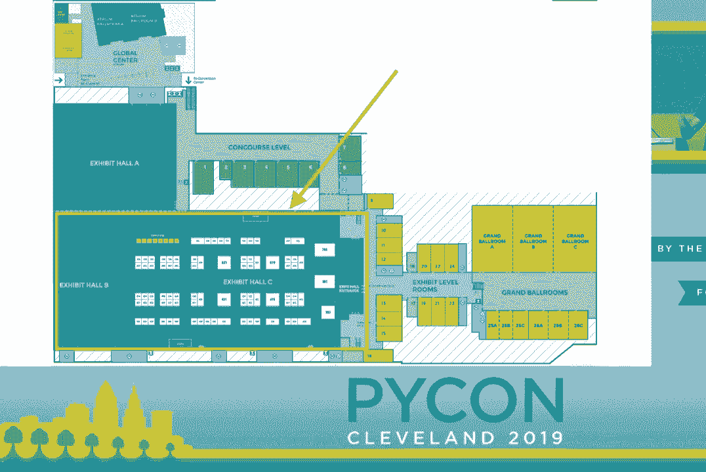

今年我们将提供餐饮。周日之前的所有餐饮将在展览厅内。你可以在屏幕上的网址找到这些餐饮的菜单和成分。如果你在注册时表明需要考虑犹太洁食或过敏，请寻找。

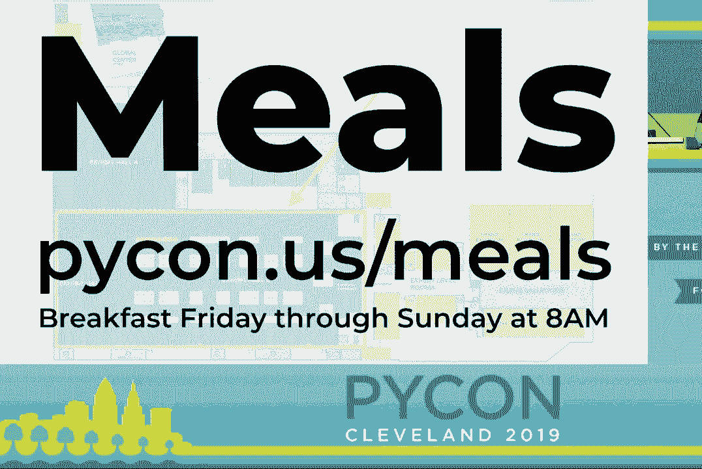

大厅里有标志来指引你找到餐饮。展览厅也是所有赞助商展位所在的地方。我鼓励你去我们的赞助商展位，了解他们如何使用 Python，为什么他们选择支持 PyCon 和 Python 社区。我们的赞助商让 PyCon 成为可能，我们依赖他们来维持 PyCon 的注册。

控制成本。他们在这里的存在代表着对我们社区和这次会议的巨大投资，同时也使得与 Python 软件基金会的运作成为可能。他们在这里是为了与你会面，鼓励你了解他们的项目和产品，甚至可能会雇用你。提醒一下，赞助商展位今天仅开放一天。

以及明天。周日，整个空间将重新配置。除了赞助商。

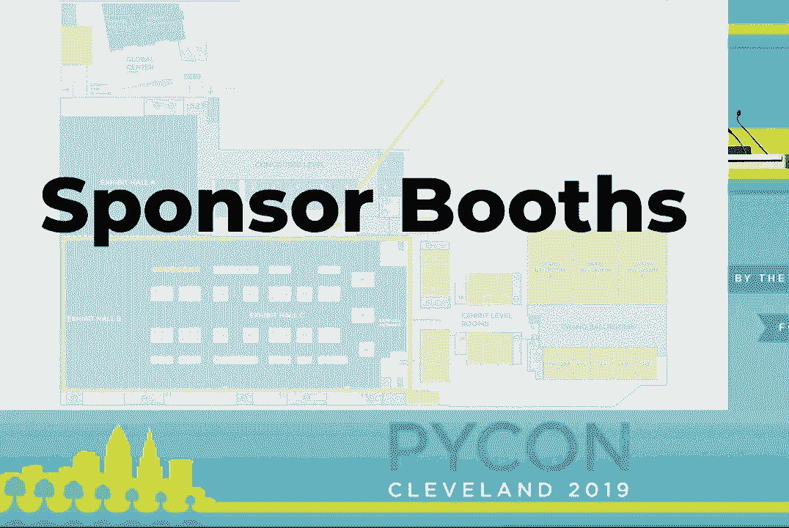

我想花一点时间来简单展示所有参与 PyCon 的企业公司名称。这些企业注册帮助抵消个人和爱好者注册的费用，我很抱歉，学生和爱好者的注册费用也用于支持 Python 软件基金会的工作。在展览大厅里，依然。

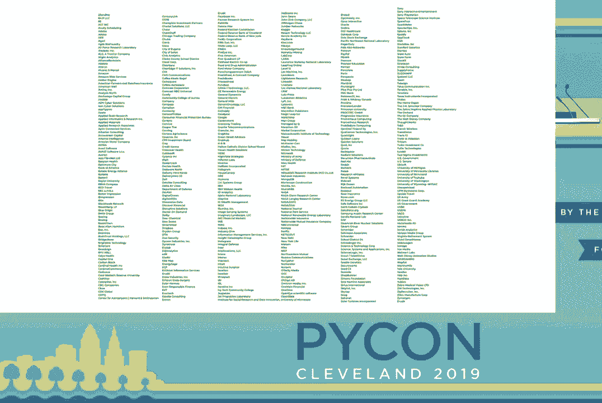

一个大房间，我们会做很多事情的地方，就是创业者展位。今天和明天会有一些桌子，届时会有一些竞争并赢得创业者展位的公司。这些是新的公司，它们正在用 Python 做一些可能是新颖且有趣的事情。去看看吧。请注意，这些公司会更换，因此今天在那里的人员明天不会在。

人员将会被其他公司替代。你想在有机会的时候去创业者展位停留两次。周日，整个房间将重新配置为我们的海报和招聘会。那将在周日早上进行。屏幕上是我们的分组讨论室。请注意。

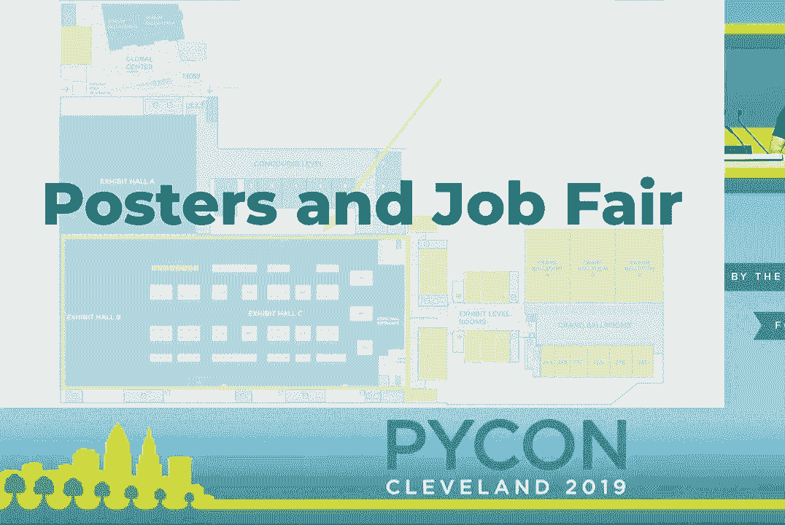

这些房间与我们现在所处的地方有一些距离。那些是 H 室，舞厅，它们就在那边。如果你能到这里来，你只需上那部电梯或者穿过这个大厅就能找到它们。它们离其他演讲房间稍微有些距离。如果你计划去那里参加演讲，做好一些。

时间的考虑。我们今年再次有五个主题，共有 95 场会议。你。

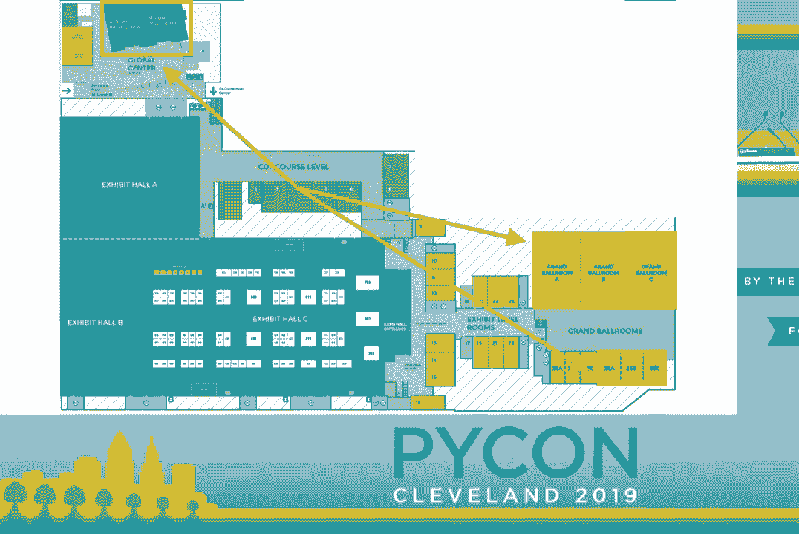

你有 19 次机会观看这些演讲。但是别担心，大多数演讲将会被录制，并在会议后在线提供。当你面临两场演讲冲突时。

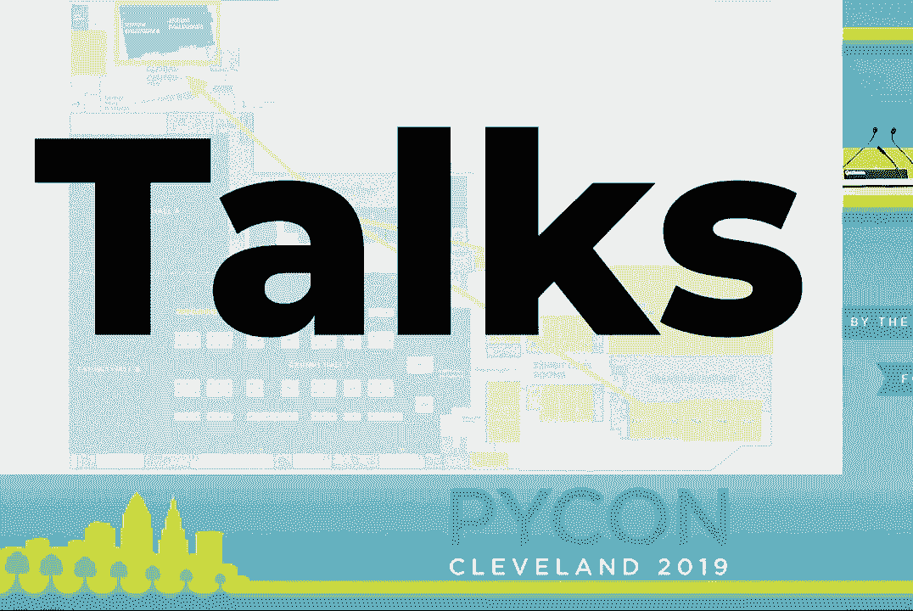

如果你想看看，就听从你的直觉。如果你参加了一场还有时间的演讲，并且讲者允许提问并决定要提问，记住要用问题的形式来表达你的问题，引用 PyConcher 荣誉会长布兰登·罗兹的经典话语。我们有一支真正的开放空间房间队伍。今天整天都有。

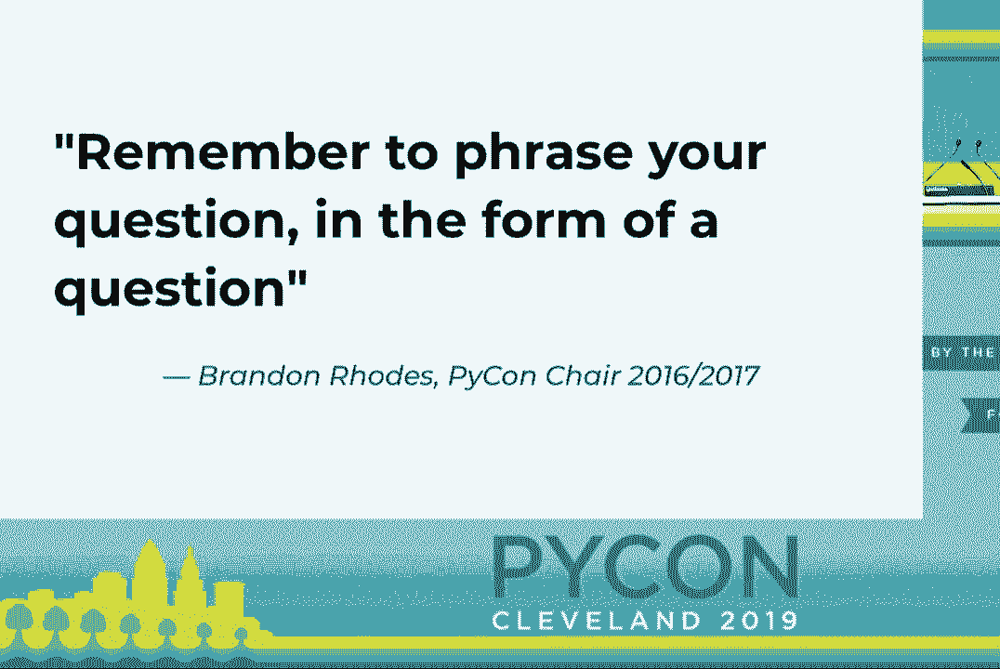

星期六和星期日，这些房间将分配给任何人自行组织一个小时的聚会式活动，并且将从早上 8 点开放到晚上 11 点。这是一个很好的机会，可以连接并深入讨论某些事情，或者寻找有共同兴趣或目标的人。我希望鼓励你考虑通过组织来塑造会议。

你可以发布自己的开放空间。可以到注册旁边的公告板上发布自己的开放空间，或查看已有的内容。今年的新变化是，你可以访问屏幕上的 URL，在那里你会找到当天公告板的照片，可以进行缩放以查看已发布的内容。因此，你不必一直。

大家聚集在公告板周围。这些房间对我们来说意义重大。

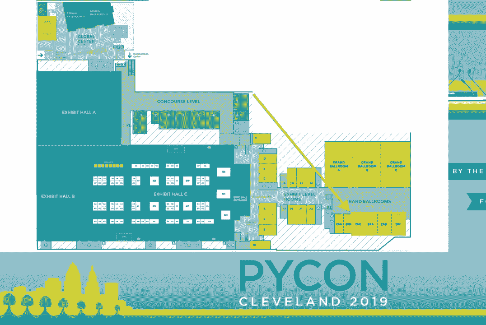

对我来说，这些房间 25C 和 26 A/B/C 是 PyCon 孵化器项目的家。PyCon 是一个经过志愿者、董事会和工作人员的引导，逐渐成长和演变的会议。去年我们启动了孵化器项目，旨在为任何人提供在 PyCon 上实现其创意的机会。无论目的是什么。

无论是会议的永久性组成部分，还是仅限于某一年临时性和专题性的内容，孵化器项目为 PyCon 提供空间和资源以实现这一想法。今年我们很高兴首次孵化器项目回归。

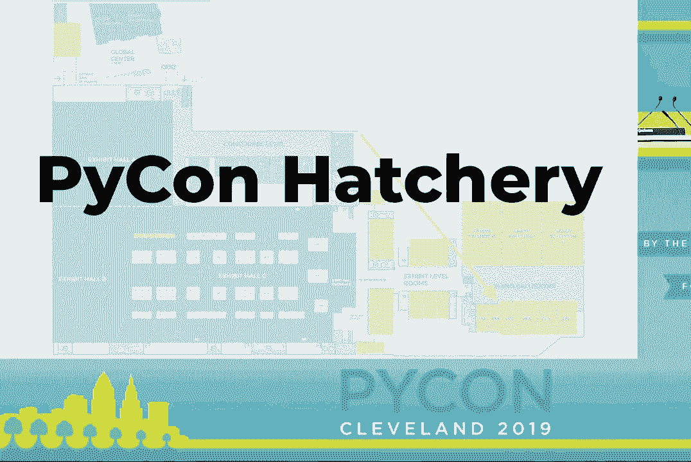

还有三个新概念加入我们 2019 年的活动。今天全天仅此一天，你可以参加 Laus Park。Laus PyCon，Charlie 的活动。这是一个全天用西班牙语进行的演讲。将在 25C 房间进行。Charlie 的日程与主要演讲日程相匹配。因此，欢迎并鼓励你仅参加一场演讲或全天留在这里。新的内容。

今年是 Python 艺术年。这是一个迷你艺术节，重点关注叙事、表演和视觉艺术。今晚在 26 A/B/C 房间可以找到这个活动，从晚上 8 点到 10 点。如果你想看表演，可以去那里。PyCon 孵化器。

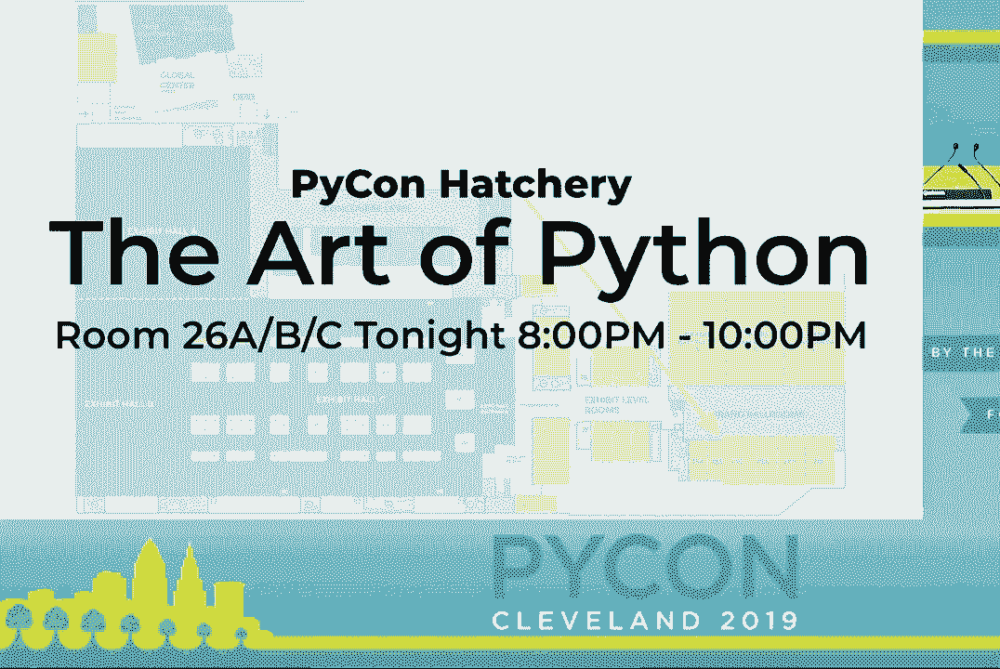

维护者峰会今年也是全新的。它旨在为项目、维护者和关键贡献者建立一个实践社区，目标是帮助 Python 社区维持和发展健康的项目和社区。此次活动将结合闪电演讲和讨论，从上午 10 点 50 分到下午 2 点在 25C 房间进行。也是新的。

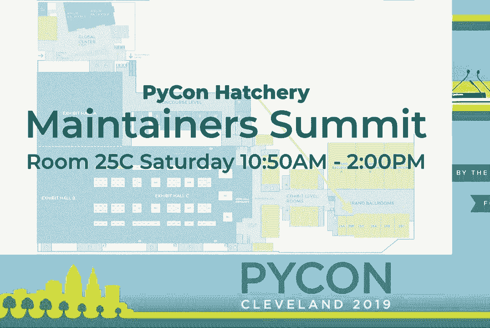

明年的指导冲刺将于明天下午 2:30 至 6:30 在 25C 房间进行。这是一个新手介绍，旨在帮助参与开源项目。在有经验且曾参与过该项目的导师指导下进行。

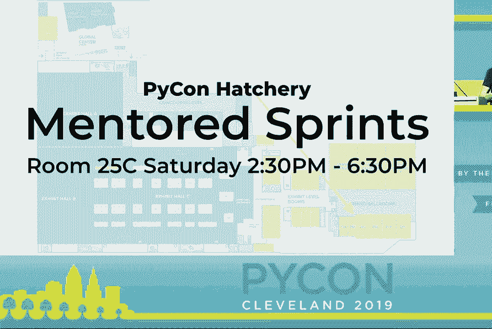

我们专注于为较少经验的开发者提供一个支持性的环境，让他们能够学习、合作，扩展他们的网络，并在结束时庆祝他们的胜利。这就是今年的 PyCon 孵化项目。如果你有一个想法，PyCon 可能会继续。请关注将在某个时间发布的 CFP。

现在和下一个 PyCon。我真的用尽了箭头。我买了太多箭头，所以不得不把它们全部用在幻灯片上。因此，PyCon 几乎占用了这个会议中心的所有空间。在接下来的几天里，所有公共空间都会散布着 Python 爱好者。这不是一个正式的活动，但这是一个我从未见过的盛事。

在 PyCon 上，真的不会错过任何机会。没有规定你必须参加任何特定的活动。也没有规定你必须参加每一个活动，填满你所有的时间。因此，考虑花时间加入一个桌子或小组，结识新朋友，打开笔记本电脑一起探索问题，花时间和某人聊聊天。

你之前从未见过面，或者是一个老朋友。改善体验的一个建议来自 PSF 董事会成员埃里克·霍尔舍。这个建议被称为“吃豆人规则”。当你站在一群人中时，始终留出空间让一个人加入你的团队。这个建议可以帮助创造一个身体上欢迎的空间。

让某人加入你的团队，并让与会者更容易识别他们可以加入的团队。

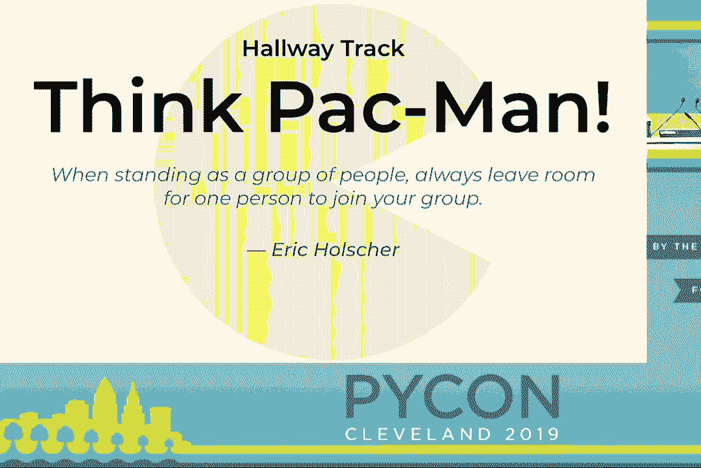

这样可以帮助结识新朋友。在整个空间内，我们有三个性别中立的洗手间。一个在 17 号和 18 号房间附近，一个在 25A、B 和 C 号房间附近，还有一个在展览大厅内，所以当你从注册处进入时，它在你的左侧。这里还有两个母婴室。

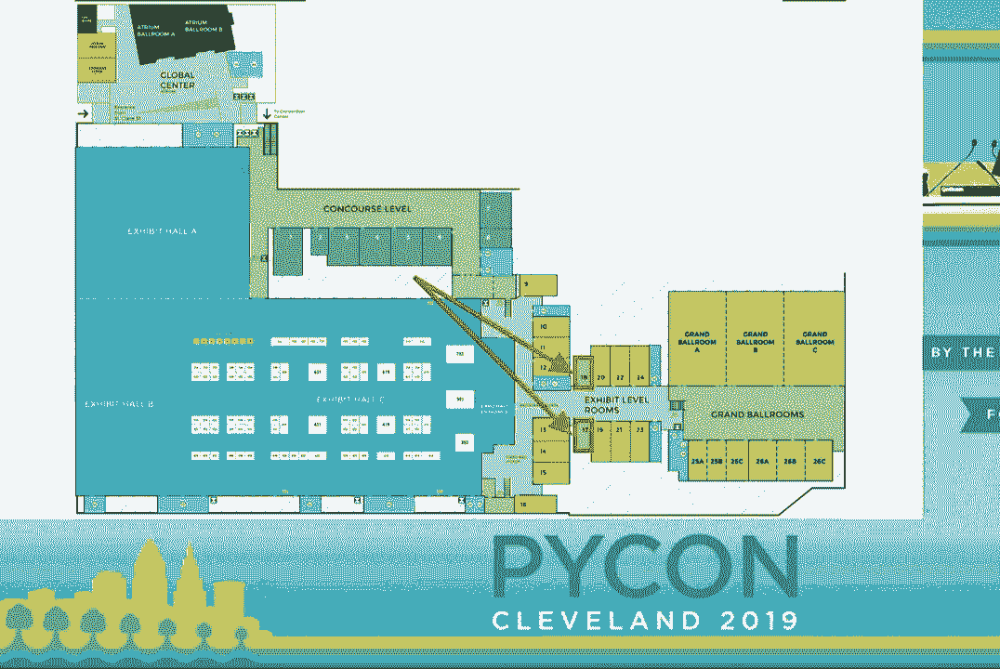

会议中心的房间。这些房间是 17 号和 18 号，进入房间的指示已张贴在外面。如果你需要帮助或需要进入那里，请检查。

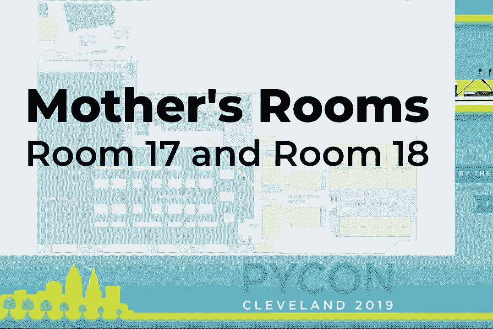

在那里获取指示。如果你发现需要休息一下，专注于某些工作或只是呼吸，我们在 24 号房间有一个安静室。这个房间有特定的用途。

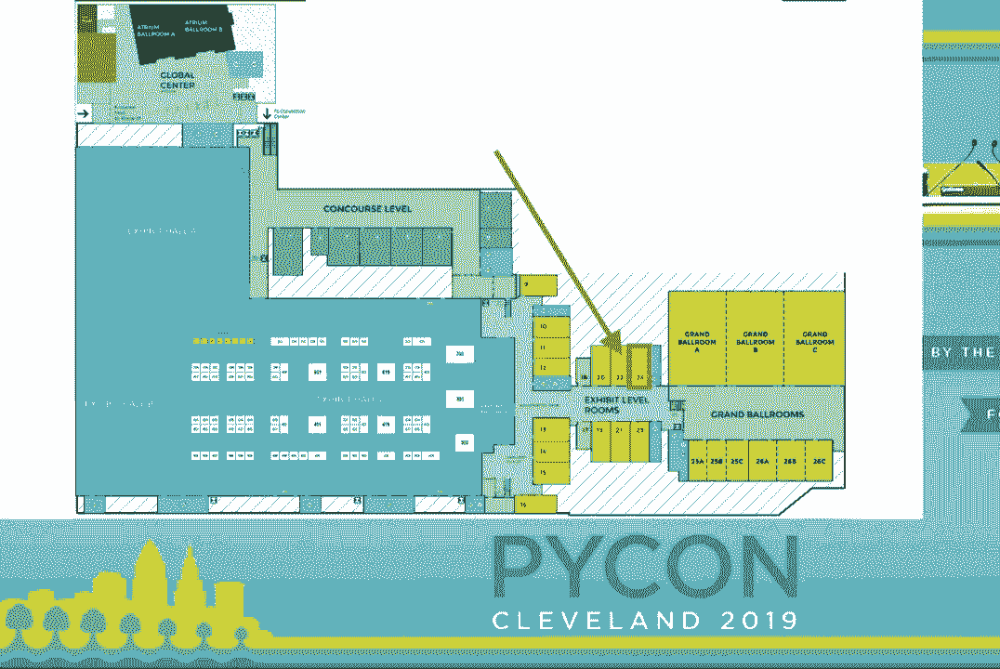

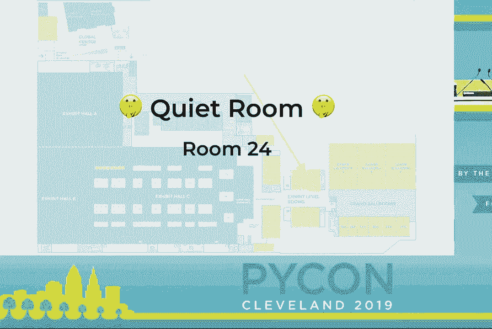

所以请在这个空间内尊重“安静”这个词。而且走出去的时候，克利夫兰总是很美丽。这里从来没有雨或云。我们可以看到我们在克利夫兰市中心公民中心的位置。会场周围有普拉提拍卖会，时间是 5 月 4 日星期六下午 6 点 30 分，地点在连接的希望舞厅。

克利夫兰市中心的希尔顿酒店。所以如果你不想出去，你甚至不必外出，但可以去散步。去年筹集了 30000 美元用于普拉提。对于 5 美元的入场费，这是一个难以击败的好交易。这里可能是我们举办的最有趣的晚上之一。即使你不来竞标和赢得优秀的暂停。就在这里的拐角处。

所以如果你沿着 Lakeside 街走，左转到第九街，然后到码头，你会找到摇滚名人堂和大湖科学中心。这些地方是 PyCon 晚宴的所在地。今晚的晚宴在晚上 6 点 30 分，会议结束后的周日晚上 6 点 30 分还有一场。

这些晚间活动都是需要票的活动。所以当你检查注册时，你应该会有小票。你需要把那些票带到这些活动中。由于食物已经为他们预先分配了，如果你拿到了票却不打算参加，请把你的票转给其他人，随你所愿。

这有助于减少食物浪费，并保持活动有趣而充满活力。那是很多。而。

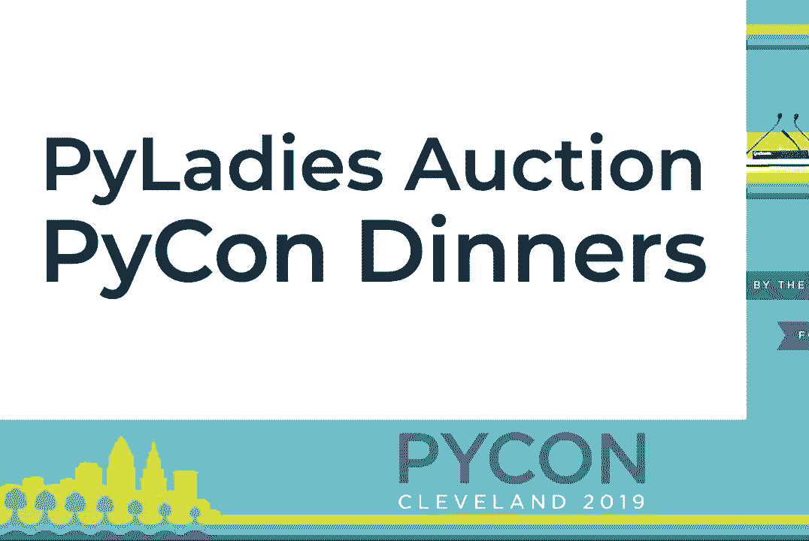

跳过我们已经做过的内容。所以，如果你希望随身带着这些信息，有一个印刷的程序。它看起来像这样。还有一个 ustoppikon.org 网站，可能有点麻烦去导航。今年我们再次有一本指南。这是一个特定的应用程序，里面有所有的日程信息和房间号码等。你可以。

可以在 pikon.us/guidebook 找到。而且，我觉得你正在熟悉。所以是时候进行一些。

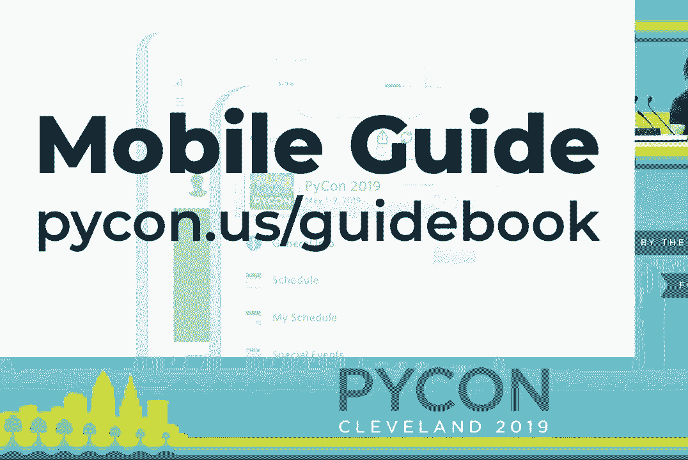

家政服务。首先，负责这次会议财务责任的 Python 软件基金会正在进行筹款活动。没有他们，我们无法做到这一点。所以如果你能的话，请考虑访问这个网址，它将带你到一个页面，上面包含关于那次筹款活动的所有信息，你可以考虑贡献。

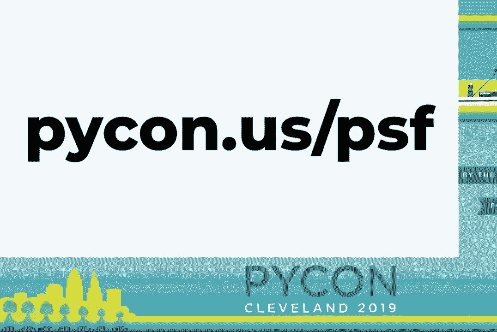

如果你注册了 pikon 趣味跑步和步行，这将在周日早上 7 点开始。巴士在 6 点开始，但最好在 6 点 30 分左右出现，这样你就不会被留下等待。但如果你。

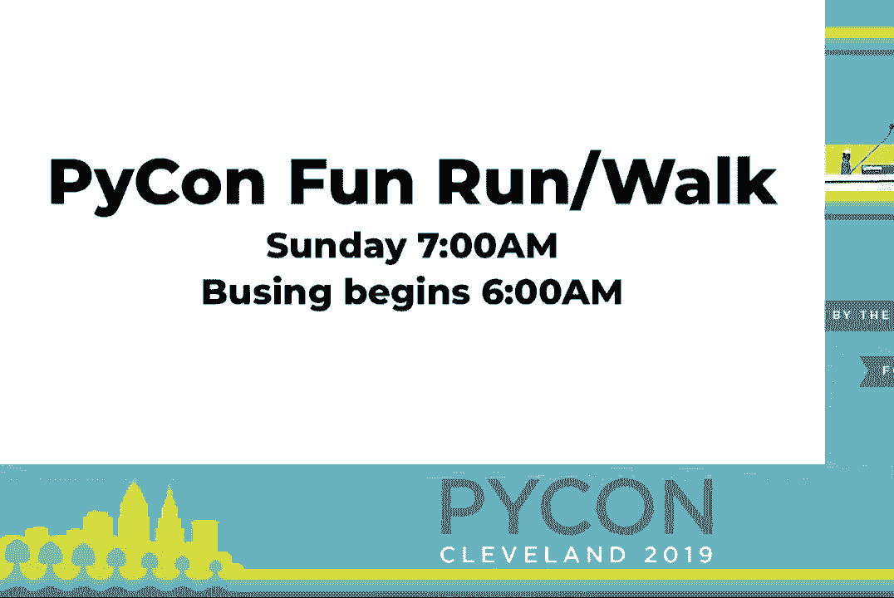

准时，明天早上 6 点。明天早上有不同的跑步活动。这不是我们的。你可以一起跑，我想。但请注意，如果你是特别通过车来 Convention Center，这会造成一些拥堵。如你所见，我们位于路线的正中间。所以，从明天早上 7 点到 11 点，计划一下吧。

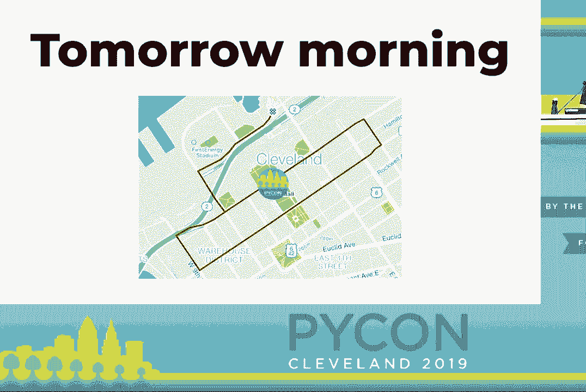

有额外的时间来这里。赠品包可以领取，所以一定要去拿那些。里面你会发现一个小玩意儿。感谢 DigiKey 和 Adafruit，所有。

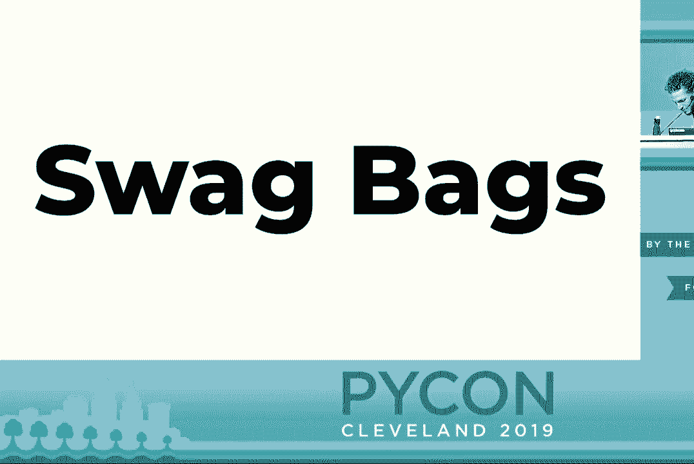

与会者将收到一个能够运行 Python 的 Circuit Playground Express。因此，有两点需要注意。一是，如果你要通过某些安检点旅行，请将这个从包中拿出来，并告诉检查人员这是什么。这会为你和他们节省很多麻烦和询问。仅仅是个小贴士。第二。

一是考虑在周日的闭幕主题演讲中带上这个。到那时，你可能会感到受到启发，立即开始编程，或者甚至跟着一些示例编写代码。所以需要提取的是你的 T 恤。它们看起来像这样。但我想提醒你，由于剪裁和重量。

和去年一样，我们选择的颜色并没有那么多颜料。所以完全透明地说，这些衬衫非常薄透。所以在公众场合穿之前，确保试穿一下你的衬衫并觉得舒适。如果在取到衬衫后有任何顾虑，请告诉我们。最后，我认为，差不多快结束了。

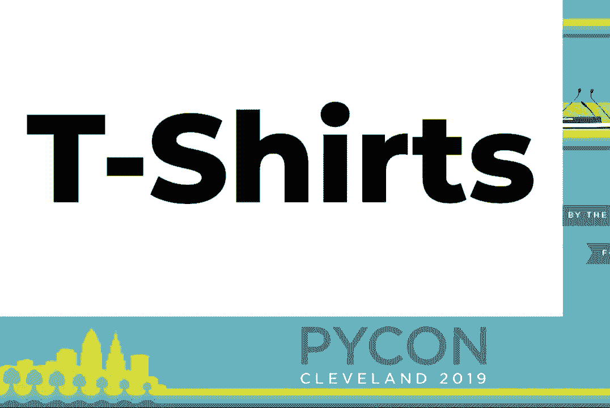

有一些日程变更。US.py。我之前提到的移动指南应用和标识已经更新。你的打印程序没有更新。所以请花一点时间检查 Xbox 前面的公告板。但是长话短说，这里已经有。

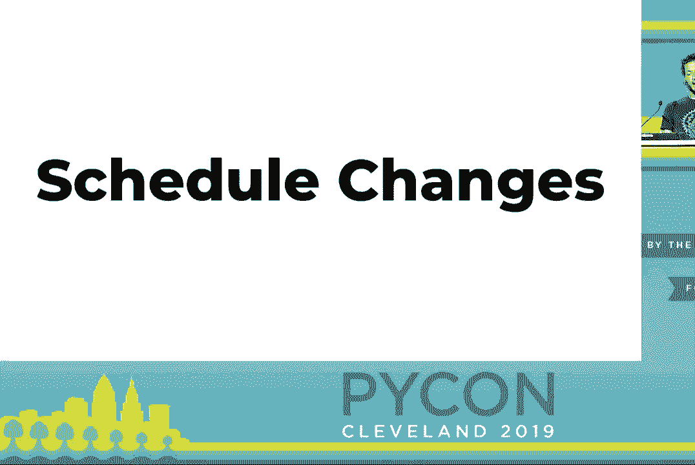

在星期六的格兰德舞厅 B 中进行了一项替换。由菲利普·詹姆斯讲授的使用 Python 的 Mastodon 的“大象与蛇”替代了尼娜的“Pythonista 的代码审查技巧”。

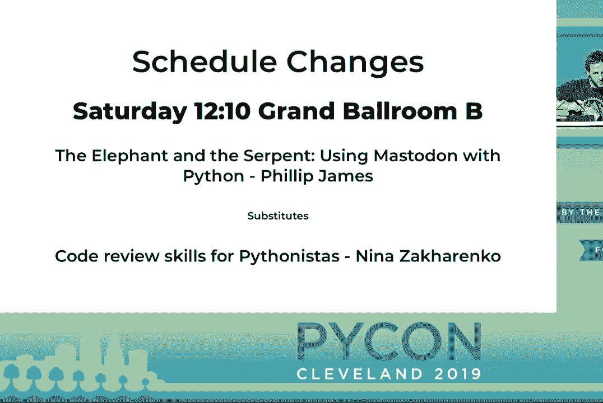

以及克里斯·威尔科克斯的内容，关于发布你的第一个 Python 包和自动化未来的发布。替代代码——使用 Python 的代码阅读器来揭示意想不到的模式和你在格兰德舞厅 B 的 315 号爱的书籍。今年我们现场有专业摄影师。

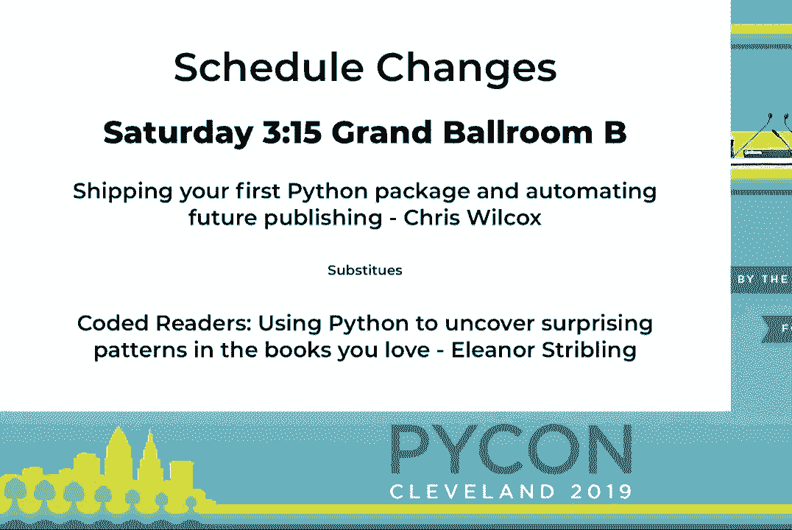

如果你对被拍到感到不舒服，可以去领取一个看起来像这样的证件套，在注册处。将你的证件放入其中，戴上挂绳，摄影师会避免拍到你。但更重要的是，在后期，我们会确保不使用任何佩戴有红色横幅证件的人的照片。

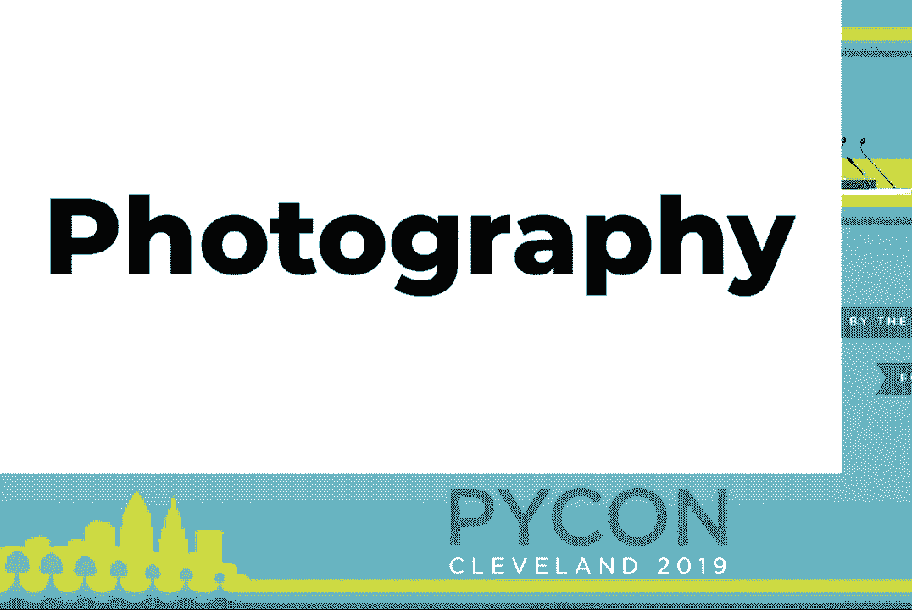

底部。所以最后一件事是关于社交媒体的，这对我来说非常重要。我将和你们一起自拍。这太完美了。好的。如果你想在会议上发推特，这是为了引起工作人员或组织者的注意。发推 @picon。如果你想发布关于会议的信息，我们可以回顾并记住。

在这里发生的一切。使用标签 #picon2019 发推。

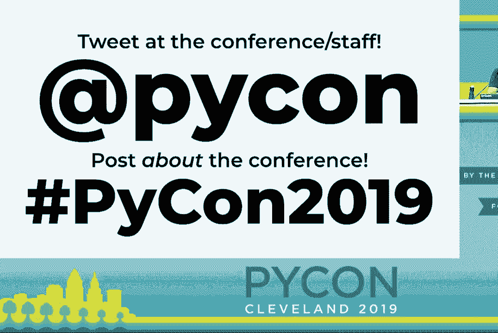
