# P2：摩西·施瓦茨，安迪·卡伦 - 比特中的蛇 - 使用 Python 进行安全自动化 - leosan - BV1qt411g7JH

好吧，我们应该开始吗？早上好。大家怎么样？太棒了。一些简单的事务安排。如果你有会发出噪音的设备，请把它调成静音。请在演讲结束前保持问题。如果有时间，我们会在那时回答问题。如果没有，可以在之后找这些人。

所以请欢迎摩西·施瓦茨和安迪·卡伦。他们将进行演讲《比特中的蛇：使用 Python 进行安全自动化》。谢谢大家。

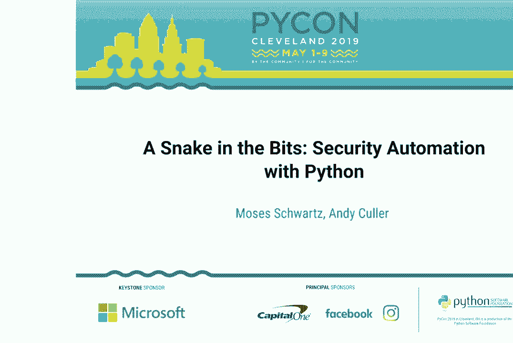

感谢大家的到来。感谢所有的志愿者和组织者。我非常兴奋能在这里。所以我是摩西。这是我的同事安迪。我们的团队还有乔纳森在这里关注我们。我们在 Box 的安全自动化团队工作，这意味着我们基本上编写软件并管理基础设施，以支持我们的事件响应团队和应用安全团队。

甚至还要为合规和其他在安全范围内的团队构建一些东西。因此，我们将讨论一种 DIY 方法，使用 Python 构建自动化以支持这些团队。这不是为了讨论 Box 的工作，而是一个一般性的介绍。但有很多相似之处。

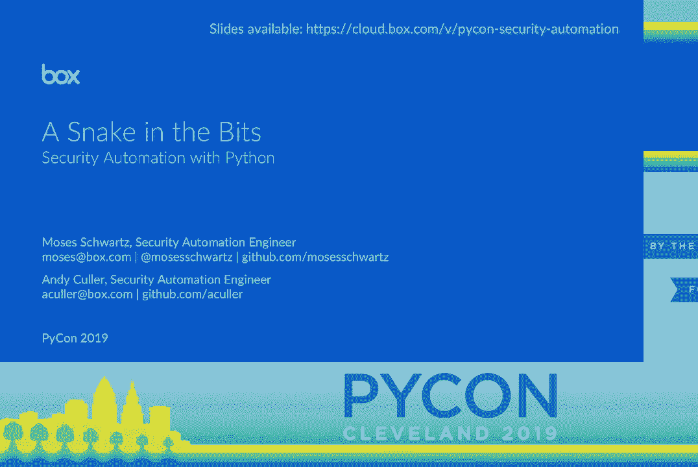

关于我们实际上如何构建基础设施的内容。因此，理解事件响应或安全监控团队（例如你的 SOC）的基础设施是什么样子是非常重要的。所以，基本上，你有所有这些东西。

无论是在个人笔记本电脑、服务器还是网络硬件上创建日志。诸如此类。因此，你需要将所有这些日志输入到某种集中聚合系统中。从那里，大多数这些系统将允许你建立某种警报。当警报触发时，你将创建一个工单。

然后你会有一些分析师需要查看那个工单。因此，在你自动化之前，分析师工作的重要部分就是打开浏览器标签，复制工单中的数据，粘贴到这些基于网络的工具中，获取信息，填写工单。中间有很多重复的来回操作。因此作为工程师。

我们看到了这一点，心想，哦，我们可以对此做些什么。然而，我们必须从头开始。因此，Splunk 是一个非常流行的日志聚合系统的例子，它可以让你创建警报。简单来说，你从搜索开始。然后搜索条件会遍历日志。

并返回任何相关的日志信息。然后我们可以开发一个警报。因此 Splunk 允许你将搜索放入警报中。你设置一个时间。在这种情况下，这是一个 cron 风格的时间。它将每 15 分钟运行一次。然后我们设置一个 15 分钟的回溯时间。因此它只查看最近 15 分钟的日志，以确定是否应该触发警报。

这非常重要，因为否则你会收到重复的警报。因此，在你有了警报之后，你需要实际处理这些数据，它会显示出来，对吧？处理下一步的一个非常流行的方法是向某个 API 发送一个 POST 请求，这样就可以进行工单处理或数据增强，或者任何你需要它做的事情。在这种情况下。

它将指向我们为演示目的使用的可疑的数字海洋 IP 地址。因此，它只会向我们设置的这个 API 发送一个网络钩子。

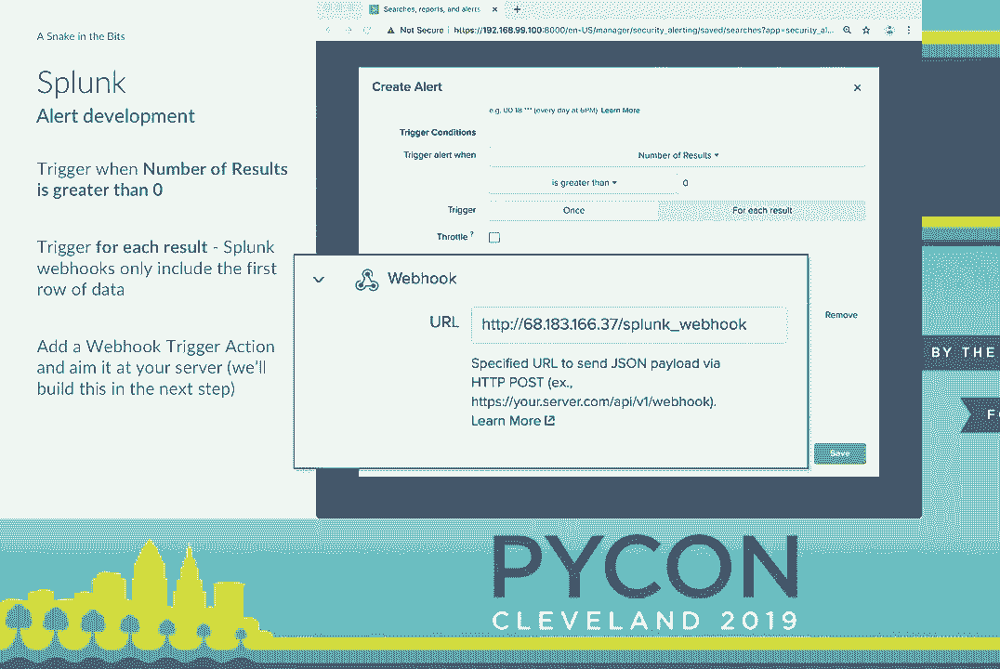

因此，我们将直接开始编写代码，以实际接收那个网络钩子。我们将先写一点代码。我们将使用 Flask，这是一个非常流行的微框架，用于构建 Web 应用，通常用于 API 及其他一些用例。因此我们将导入 Flask，实例化它。

我们要做的第一件事是设置一个状态或健康检查端点。这非常有用。因为首先，我们可以就此停止，运行它，这就像我们的 hello world，确保我们确实做对了这件事情。稍后，这将非常有帮助，因为在我们说完之后，我们可以检查那个端点。

推送一个更新以确保系统恢复正常。这使得将其集成到状态监控系统中变得非常简单，你知道的。他们基本上会进行类似心跳的操作，定期向这个端点发送请求，并让你知道你的服务是否宕机。接下来我们将进入代码部分。

编写 Splunk 网络钩子接收器。因此，在那里。我们将进入 Flask 请求对象，并抓取 JSON 负载。现在，我们只是将其写入一个 JSON 文件。那段代码不会持续到示例的最后。但我想给出一些关于我们如何进行的见解。

关于开发这些东西。所以我将直接 SSH 登录到那台服务器，运行 `Python automation server.py`。这将在 Flask 的开发服务器中启动它。它将静静地等待，直到我们收到那个 Splunk 网络钩子。现在，如果你在实际操作中做这个。

你可能希望每分钟触发一次 Splunk 的警报。你真的不想等 15 分钟来测试你的代码。但是当我们最终得到它时，它会打印出来。

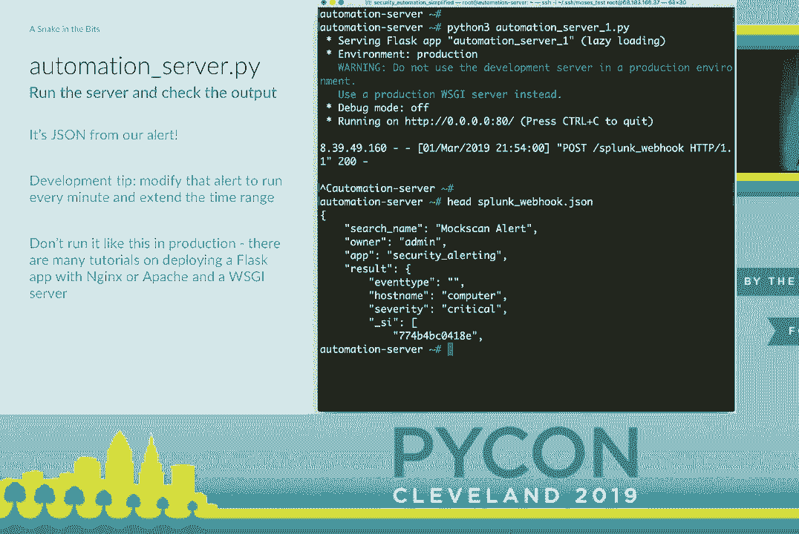

基本上是将日志条目输出到屏幕。我们将收到这个网络钩子。

然后我将简单地按 Control-C 并打印该 JSON 文件的前几行。这样我们就可以看到 Splunk 正在发送给我们的内容。然后我们有一个搜索名称，一些元数据，所有者。然后我们得到了原始结果。因此，我将稍微绕一下。在我们回到 automation server.py 并添加更多功能之前，我们开始需要。

使用用户名和密码以及其他配置项。因此，有一种快速且简便的方法将这些内容保留在我们的代码库之外，而不必深入到秘密管理中，那就是有一个像 settings.py 的文件，而你不将其与代码库一起检查。因此，在接下来的几张幻灯片中，你将看到设置。

用户名和其他类似的东西。这就是它所指的内容。因此，回到那个自动化服务器代码。我们将写一个新的函数来创建一个 Jira 问题。这将是我们的工单系统。因此，我们只会使用 Atlassian 的 SDK。连接到 Jira。你只需要一个网址，使用你的用户名和密码。然后实际上只需一行代码。

尽管被拆分以便可读，但要创建一个问题，只需指定项目名称，想要的摘要或工单名称。然后我们将整个 JSON 结果转储到描述字段中。因此，我们现在可以回到我们的数字海洋 droplets，启动。

这段新代码，并让它保持运行，直到我们获得下一个。

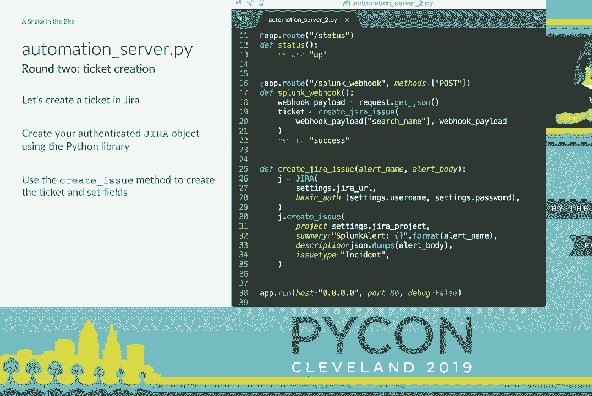

spunk webhook。当它触发时，我们将立即联系 Jira，并创建一个工单。这几乎开始变得有趣了。我们至少有一个工单。我们有一些信息。但这是一团难看的原始 JSON 数据。这实际上是很多 SOC 和响应团队在开始自动化之前的默认状态。

它们根据电子邮件或 webhook 或其他东西创建一个工单。它实际上只包含原始信息。但我们可以做一些事情，使其更有用。因此，我实际上会进入 Jira 配置，设置一个 webhook，当这些工单被创建时会触发。

我们要想一个名字。我们将这个称为假扫描警报，因为我们使用的假数据被称为假扫描。我们还要给它一个网址。再次强调，我们有我们的 IP 地址和非常详细的名称 Jira，假扫描创建的 webhook。然后在底部，我们要指定一个 JQL 或 Jira 查询语言，我想。

查询以让它知道我们希望这个 webhook 在什么类型的工单上触发。因此，你实际上可以根据你在 Jira 中可以搜索的任何内容进行过滤。如果你在页面上向下滚动，你还可以选择在工单创建、关闭或其他情况下触发 webhook。

但现在我们将专注于仅创建。因此，一旦设置完成，下次 Splunk 触发 webhook 并创建工单时，Jira 将会联系到我们的。

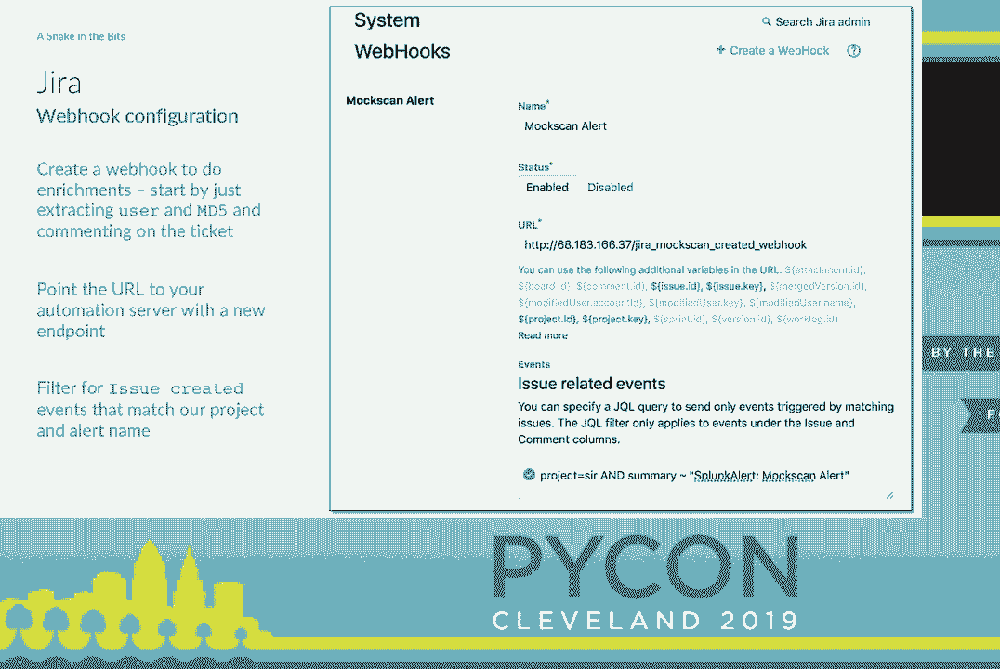

自动化服务器并尝试调用该端点。所以我们现在需要为此编写代码。我们将添加一个新函数，这个 Jira 注释函数。它与创建工单的函数非常相似。只是连接到 Jira，根据密钥抓取问题，然后我们将添加评论。

基本上，只需将字符串放入其中。然后我们将编写端点来实际处理这个 webhook，调用这个模拟扫描创建。我们在上面指定路由，说明我们期待一个 POST 调用。然后，我们将从该请求中提取 JSON。

对象然后进行一些复杂的 JSON 解析。我们可能可以简化这个过程，但最终决定不这样做，因为处理复杂的 JSON 数据块是我们日常工作的半数。所以我们将提取描述字段中的结果，那实际上是我们在其中编写的 JSON，因此是双重编码的。

我们将再次加载 JSON。但最后我们可以提取几个字段。我们将抓取用户和 MD5。然后我们可以调用我们的 Jira 注释函数，使用从 JSON 中提取的信息对该工单进行评论。这并没有比仅仅将其放在 JSON 中更有用。

但是如果我们去进行查找，比如说使用那个用户名在 Active Directory 中查找，那么这就开始变得有用。因此，为了做到这一点，我们将编写另一个脚本，这与 Flask 或应用程序的其他部分没有任何关联。这只是使用 LDAP3 模块的普通 Python。我们将编写一个小函数来搜索 Active Directory。

给定一个用户名，返回一个包含结果的字典。当您查找我的用户名时，它看起来是这样的。然后我们可以返回到我们的自动化服务器，并设置一个新功能，调用我们的新脚本，该函数进行一些字符串格式化。

提取我们认为最有趣的字段，格式化为注释字符串。然后我们将再次调用该 Jira 注释函数，并发布该信息。接着在我们的模拟扫描创建端点中，我们只需添加对该函数的调用。现在，当 Jira 的 webhook 触发时，它将在这里被处理。

我们将进行查找，并将用户信息直接发布到工单。我们可以对 MD5 哈希做完全相同的事情。我们可以去 VirusTotal 查询。它是一个非常流行的服务，基本上对文件运行大量病毒扫描，并将所有内容放入数据库。您可以查询并询问。

对于您上传的这个文件或这个哈希，病毒扫描仪有什么反馈？

这是一个空文件的哈希。因此，它实际上在60个扫描器中得到了零个正面结果。我们还获得了一个永久链接，可以将你带到他们的网页，在那里你可以查看更多细节。我认为这些是最有用的字段。因此，这里实际调用病毒总览的代码基本上是从他们的公开文档中复制和粘贴的。

这非常快，只需一个简单的GET请求，然后我们将返回那个JSON。

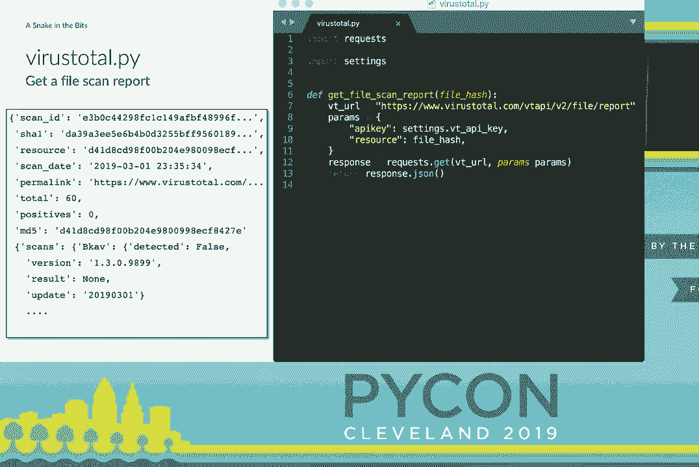

现在要将这个集成到我们的自动化服务器代码中，我们只需回去做与我们刚刚为Active Directory所做的完全相同的事情。我们将编写一个新函数来处理评论格式。我们会调用病毒总览，提取有用字段，并将它们放入一个字符串中，然后再次调用你的评论函数。

然后我们将在Active Directory查找后调用病毒总览文件扫描丰富功能。这几乎就是所有需要的。下次我们创建工单时，它将提取并发布所有这些信息。因此，如果你再次查看我们在开始时展示的这个图形，我们的SOC分析师。

Freddie Mercury在这里查看工单，复制粘贴，将你的名字和哈希输入其他系统，然后决定这是否是恶意的，或者他需要怎么做。现在对他来说情况看起来好转了一些。我们所有这些信息都自动发布到。

工单并回顾它的工作方式，因为这有点像一个奇怪的Web Hook循环。Spongfire是我们自动化服务器的一个Web Hook。我们创建一个工单。当工单被创建时，Jira会调用一个Web Hook回到我们的自动化服务器，然后我们开始进行这些丰富处理并直接添加信息。这实际上是一个非常简单但也非常酷的过程。

模型，因为现在我们可以在创建工单时运行任何任意代码。所以，只要你能写出程序去做的任何事情，我们都可以在工单到达时自动启动。这其中有一些简单易做的低优先级任务，适合IT或安全运营团队。很多时候，打开工单后你要做的第一件事就是。

关闭工单的过程是花一分钟去设置适当的字段，以便你的指标看起来良好。这些事情非常容易自动化。我们还可以更深入一点。我们可以运行另一个Splunk搜索并发布结果。你甚至可以做一些像启动Ansible剧本的事情。

如果你想做一些更复杂的事情并构建工作流。实际上，任何有API或任何类型程序接口的事情我们都能做到。我一直在寻找用例，实际上想要在我们有特定工单类型时做点什么。这是梦想。[笑声]。

>> 所以现在我们已经开始构建这个自动化服务器及其所有端点，我们需要开始考虑它将如何扩展？它的未来是什么？

你知道，当你有两个端点时很好，但当你开始写10、20、100、200个时，你会看到所有Flask端点代码中重复了很多相同的模式。所以作为开发者，我们也想让工作变得更轻松。我们希望有某种框架或中间件来为我们处理这些。

我们可能希望对所有内容进行身份验证。显然，我们希望有统一的日志记录，以便知道我们的自动化是否正常工作。输入验证是构建API时最大的样板代码，因为你想确保如果有人给你不良数据。

你告诉他们这个，而不是直接中断。在中断方面，你也不想将堆栈跟踪发送回你的API客户端。你可能会暴露敏感信息。对普通API用户来说，这通常并不是很有用。那我们如何改进呢？

好吧，最简单的方法就是去获取一个开源的Flask插件。在这个实例中，我们使用了广为人知的Flask Rest Plus。它的功能与Flask非常相似。所以如你所见，我们仍在构建一个Flask应用。然后我们将其传递给Rest Plus API对象。

而且你仍然像以前使用Flask那样设置路由。只不过现在你是在操作类，而这些类定义的函数直接对应你要提供的HTTP方法，比如GET或POST。但如你所见，我们基本上仍然有相同的内容。

在端点内部处理基础代码。这给你提供了——我们会深入讨论，但它给你带来了很好的错误消息。但它做的一个非常酷的事情是自动生成Swagger文档或端点的Swagger规范。对于那些不熟悉的人，Swagger或Open API是API的JSON或YAML定义。

很多人会编写规范，然后使用生成器来生成他们的代码。这是反向的，你编写代码，它生成规范。

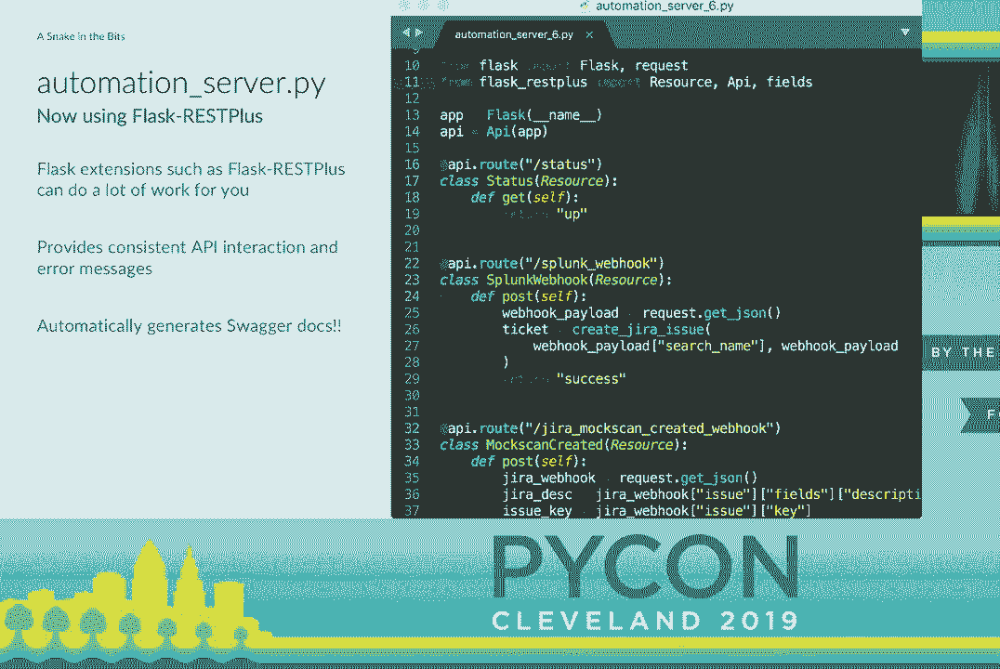

为你提供规范。这真的很棒，因为有JavaScript库，或者我知道的一个库叫做Swagger UI，它可以解析该规范并为你构建一个酷网站。这很好，因为现在你不必再构建其他文档。

你有根据你的代码为你构建的文档。如果你是一名优秀的开发者，为你所有的函数编写文档字符串，这些也会被拉入规范中。所以你的代码文档实际上是在为你记录端点。这太棒了。它还允许你通过浏览器与API进行交互。

你实际上可以下降到这些端点，并向你的端点发送测试数据，它会实际发送并向你展示。

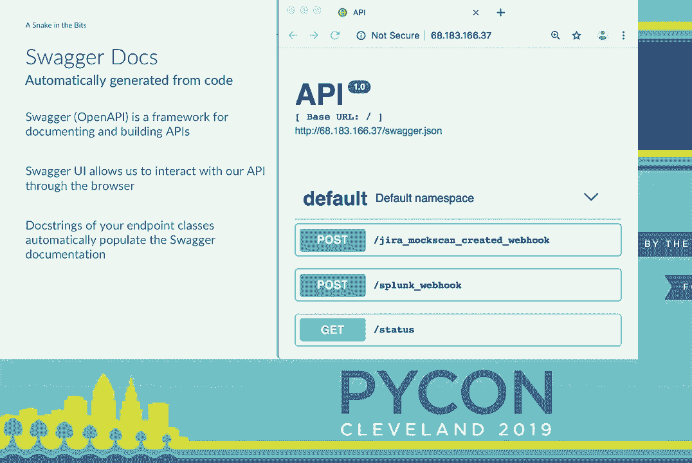

curl 请求在命令行中执行相同的操作，这真是太棒了。因此，我们提到的想要提升 RESTful API 的一项功能是，我们希望进行输入验证。而这正是 Flask REST Plus 内置的功能。

所以你可以在这里看到，我们在端点添加了一段代码，这定义了 API 模型。在这种情况下，我们说我们有一个搜索名称，它需要是一个字符串，结果将只是一个原始的 JSON blob。因此，如果我们获得数据而那些字段不符合要求，它将会起作用。

一旦存在，它将向用户返回一个有用的错误消息，我们完全不需要在代码中担心这个。我们的代码知道，一旦我们进入实际的 post 函数，我们将会在结果中拥有那些字段。所以我们提到了 swagger 文档。

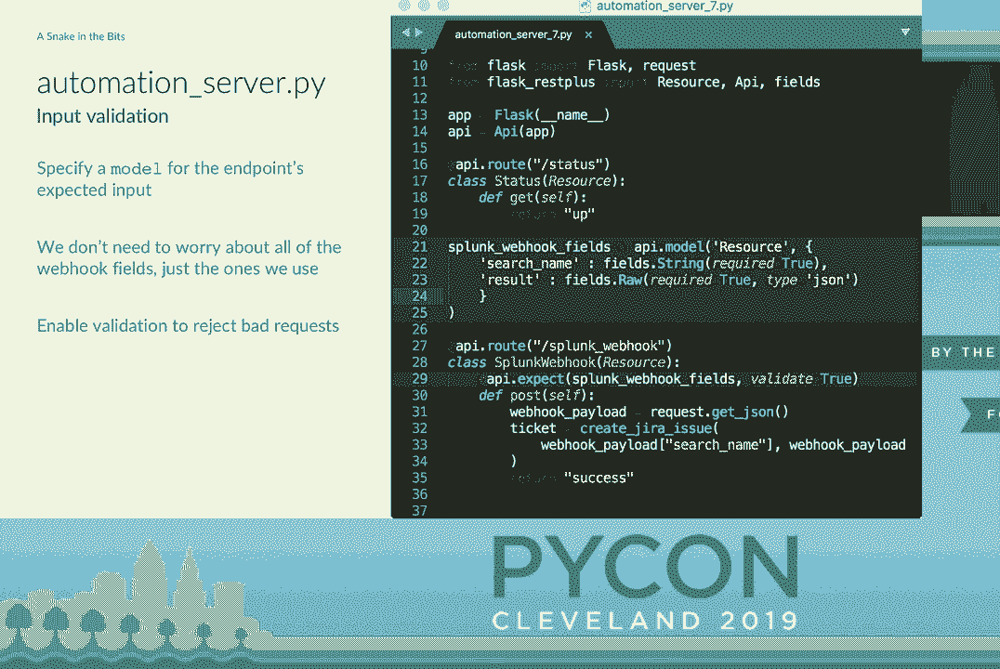

定义这些模型的另一个好处是，它也会影响我们的文档。因为我们已经告诉代码我们期望的输入，现在我们得到了文档，说明如果你想获得良好的结果，你需要发送什么到终端。所以这就是一个很好的互动过程，帮助彼此了解。

从代码生成文档，因此我们不必去编写文档，并确保在进行更改时，所有内容都仍然是最新的，这些都是开发者们的乐趣所在。

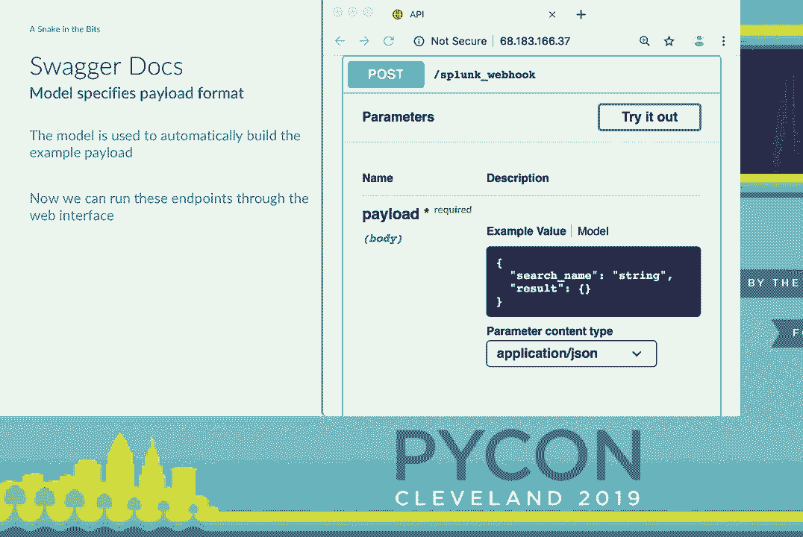

我们一直在谈论这些错误消息。这只是一个简短的示例。我们的第一个 curl 请求是当我们仅使用 Flask 时。因此，当你请求某些不存在的内容时，你会收到那个可怕的 500 错误，或者说内部服务器错误，你知道，你的代码崩溃了。

对于最终用户来说，这并没有帮助。如果你是以编程方式调用 API，这并没有帮助。如果你在浏览器中可能有帮助，但仍然没有任何帮助。Flask 的情况也是如此。加上你会收到一个带有内部服务器错误的漂亮 JSON 消息。对最终用户来说仍然不是特别有用，但他们可以很容易地解析它。

然后正如我们提到的输入输出验证的内容。你可以在底部看到，他们调用了 web hook，但他们的输入不正确，得到了一个详细的错误消息，告诉他们，你不能为此发送非类型的数据。这就是现成的解决方案。

但作为开发者，很多时候我们会说：“哦，我们来构建一个框架。”为了辩护，我们是在 Flask REST Plus 最初推出时开始构建这个的。所以我们并不是在重新发明轮子，但可能确实有一点。

我们构建了一个框架，称之为 funnel，因为它是将东西放入 Flask，开发者们非常聪明。我们正在努力使其开源，不过，您知道，为此需要经历很多环节。但它完成了许多与 Flask REST Plus 相同的事情。

以稍微不同的方式。你仍然定义允许的HTTP方法。这一切都基于一个端点类。然后你有输入和输出的属性类。你以相同的方式定义它们。对于字符串和整数等都有内置的支持。还有用于处理正则表达式类型、枚举类型、日期的基本类。

所有这些事情。我们还进行输出验证，这很好，因为它会剔除额外的字段，这样你就不会返回大量你不必要或不想要的数据。然后当然，标准化日志记录。但我们想要的一个重要方面是代码定义的API。

正如我之前提到的那样。我们是开发者。我们不想整天编写JSON规范。我们更愿意写一个类让它为我们生成。因此，就像rest plus一样，funnel会为你生成开放API规范，然后你可以用swagger UI或其他处理这些规范的开源工具来摄取它。

还可以进行所有的异常屏蔽，这很好。因此，对我们来说，主要的区别是我们不使用装饰器。如果你看到底部的注册函数，那就是我们如何将路由映射到类的方式。然后之前和之后的插件，大多数人可能都能看到。

它有点靠近底部而且比较暗。但它允许你指定插件列表。例如，在这个例子中，有一个列出的认证函数，用于进行身份验证，以及之前的插件。之后的插件也很酷。如果你处理的是潜在的敏感数据。

你可能想要清除像信用卡号码或社会安全号码这样的东西。这些插件获取完整的请求对象，因此它们可以根据请求中的任何内容做出判断。如果它们抛出异常或其他情况，它就会终止，不会返回数据。

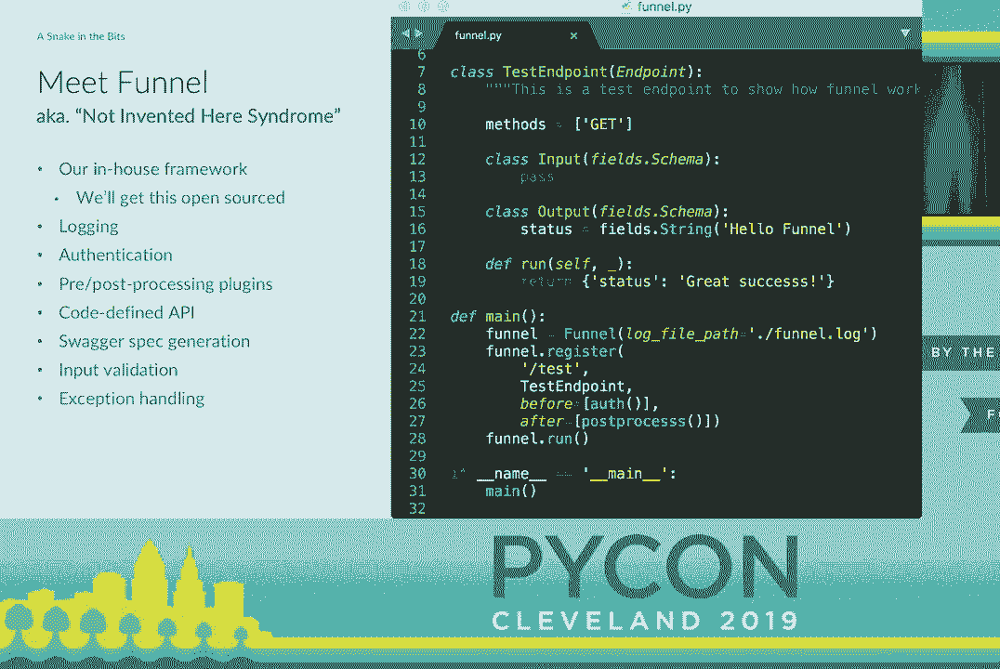

所以是的。>> 当你真正去构建这些东西并部署以支持团队时，首先你必须处理的是墨菲定律。一切都会崩溃。你会遇到短暂的错误，各种各样的事情。

因此，我们想谈谈一些保持事务可管理的小技巧。首先，我总是想提醒大家，维护状态是困难的。有些人看到问题就会想，我需要一个数据库。我认为那样他们就有了两个问题。我的意思是。

数据库绝对是许多事情的正确方法，但你需要维护数据。但是如果你不需要，完全无状态的做一些事情，那你为什么还想在代码更新的基础上管理数据库迁移呢？如果你觉得你不需要数据库，但我可以写一些东西到本地文件之类的。

嗯，这就是你如何产生竞争条件。因此，任何完全无状态的东西都要比需要维护任何外部状态的事情简单得多。错误几乎总是无缘无故地出现。比如那些完全无法解释的网络波动，发生的频率让人震惊。事情的基线错误率真的很惊人。

在互联网上。只需为你的函数添加一个小的等待和重试装饰器，就能消除许多错误，我始终强烈建议每个人都这样做。然后，你知道的，谈到这个，在我们的代码中，我们调用了Active Directory查找，接着是病毒总库查找。

如果我们由于任何原因无法访问那个Active Directory服务器，整个系统将抛出异常并崩溃，我们将永远不会调用病毒总库。所以，实际上，如果你在进行所有这些各种丰富化，你希望它们是异步的，并彼此独立运行。

所以你可以为每个设置单独的JIRA Webhooks。这种做法似乎合理，但最终可能需要管理很多东西。或者我们可以进入Python，使用Celery和RabbitMQ，或者，如果你愿意全心投入并在各处使用AsyncIO，我认为AsyncIO会非常棒。还有很多DevOps工具基本上就是为这个目的而构建的，比如Stackstorm。

Jenkins，RunDeck。这正是我们想强调的一个关键点。尽管这些DevOps工具并未专门为安全营销，但你仍然可以重新利用很多工具，它们的表现真的非常出色。如果你是云原生的，你可以使用类似AWS Lambda的东西。或者如果你有很多资金，你也可以购买一些这些工具。

商业安全自动化平台称为SOAR，它们具有类似的功能。它们实际上在各个方面都具有相似的功能。但你也可以编写自己的代码与它们互操作。但归根结底，启动和运行一个项目并不断迭代总是最佳的选择。

完成总比完美好。因此，我们希望你能从这次演讲中获得一些收获。首先，安全自动化并不是魔法。它实际上是一系列的Webhooks和Python代码。这对我们刚刚展示的代码是正确的，也适用于所有商业平台。这就是你如何将这些系统连接在一起，很多时候。

但是如果你真的实现了这样的东西，如果你正在组建一个团队，你可以做很多工作。如果你正在组建一个团队，你可以做很多工作。如果你正在组建一个团队，你可以做很多工作。如果你正在组建一个团队，你可以做很多工作。如果你正在组建一个团队，你可以做很多工作。

如果你在组建团队，你可以做很多工作。如果你在组建团队，你可以做很多工作。如果你在组建团队，你可以做很多工作。如果你在组建团队，你可以做很多工作。如果你在组建团队，你可以做很多工作。如果你在组建团队，你可以做很多工作。

如果你在组建团队，你可以做很多工作。如果你在组建团队，你可以做很多工作。如果你在组建团队，你可以做很多工作。如果你在组建团队，你可以做很多工作。如果你在组建团队，你可以做很多工作。如果你在组建团队，你可以做很多工作。

如果你在组建团队，你可以做很多工作。如果你在组建团队，你可以做很多工作。如果你在组建团队，你可以做很多工作。如果你在组建团队，你可以做很多工作。你可以应用于任何以工单为导向的IT或开发工作流程。

即使你只是纯粹的开发，我们一直在设置GitHub webhook，以便当我们创建一个拉取请求时，也会创建一个代码审查工单。诸如此类。所以这些自动化并不是一次性构建就能忘记的事情。

而且你也无法替代人。并不是像工厂那样试图自动化并完全接管人的工作。在这个领域，我们有安全分析师、IT分析师和开发者，我们只是试图消除那些占用他们时间的琐碎工作，这样他们才能真正投入精力去做其他事情。

他们的时间用于安全或开发工作。有很多简单易做的事情。例如填写工单字段、添加链接到拉取请求，这类事情。这个过程非常简单，确实能够带来很大的价值。然后在最后，我想大致为我们的工作做一个宣传。

安全自动化是一个非常不错的领域。我不想去其他地方。我们的工作是与团队的其他成员合作。客户也在我们身边。我们为他们编写代码，开发软件。他们可以在第二天使用这些软件，并给我们即时反馈。这真的是软件开发和其他操作工作的一种很酷的结合。

如果有开发者想进入安全领域，这也是一个非常有趣的细分市场。下次你找工作时，考虑一下安全工程师职位。很多职位实际上都有很重的开发成分。顺便说一下，和其他人一样，我们正在招聘。

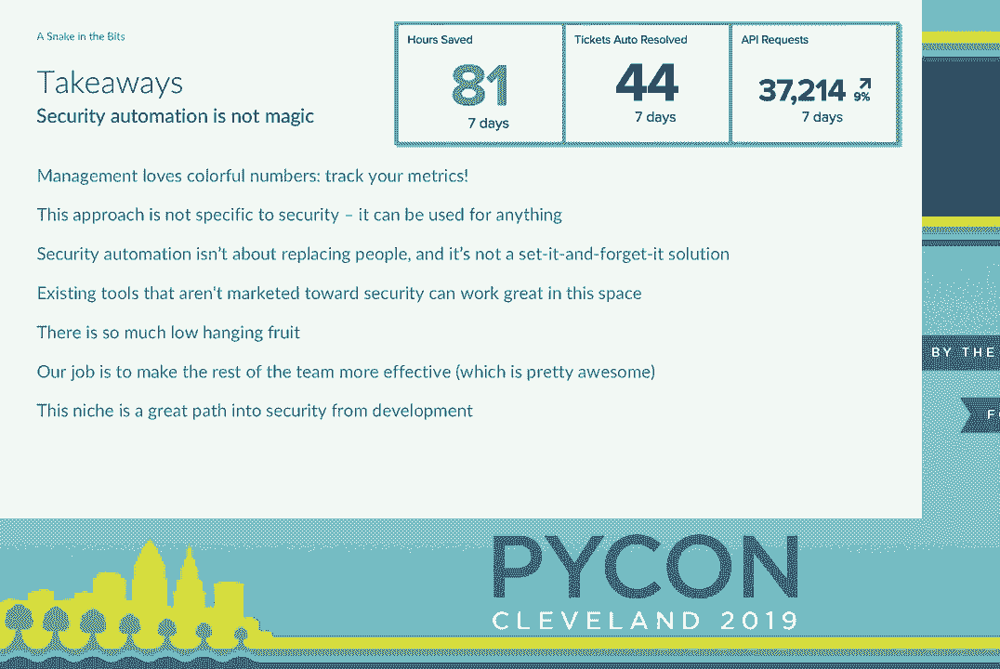

这就是一切，我想我们也到时间了。感谢大家的关注，非常感谢。[掌声]。

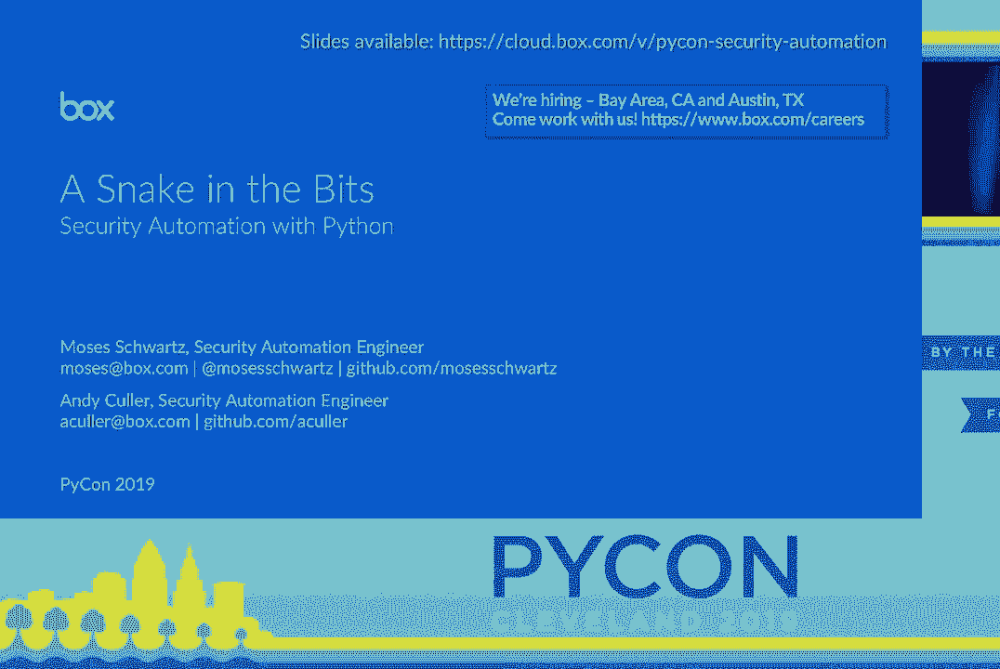
