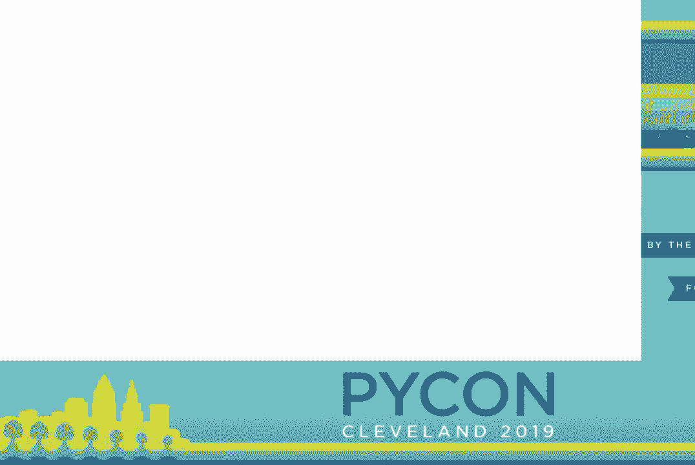
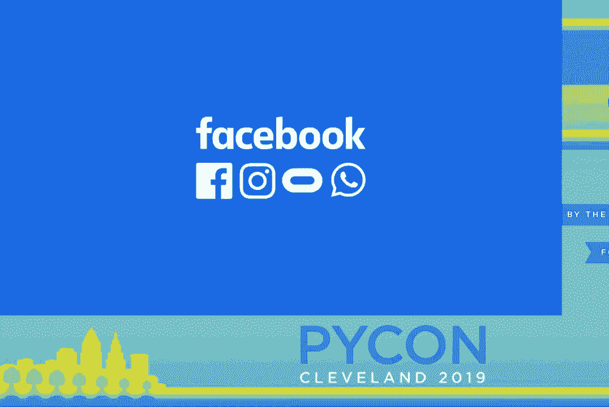
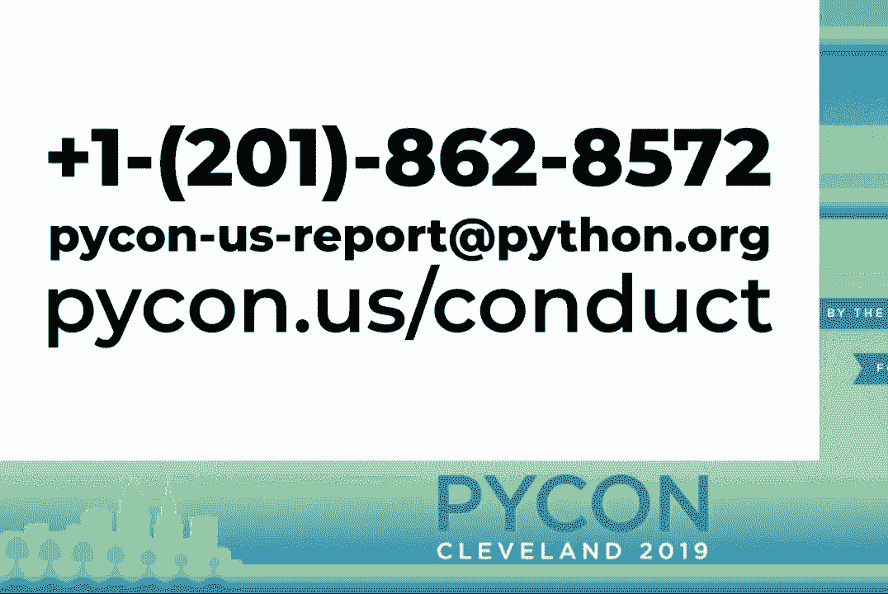
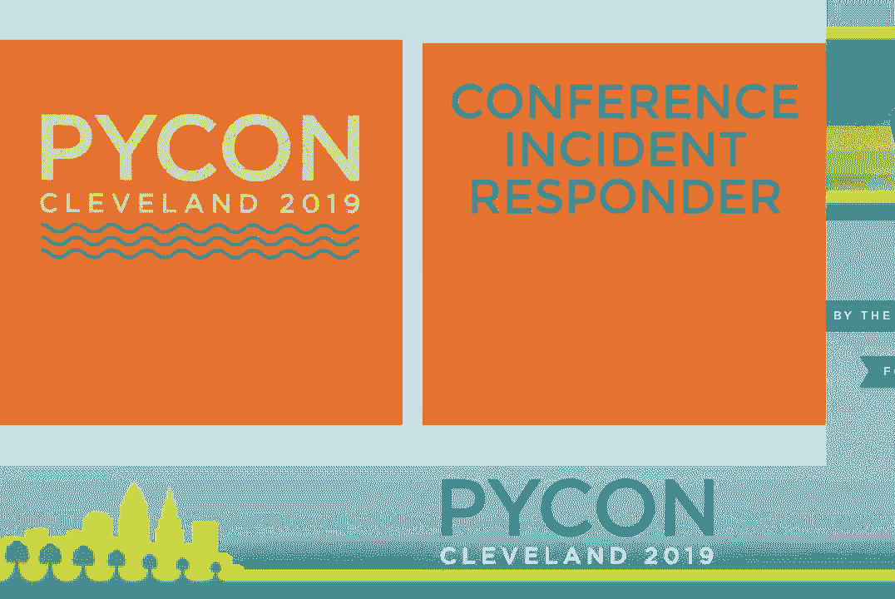
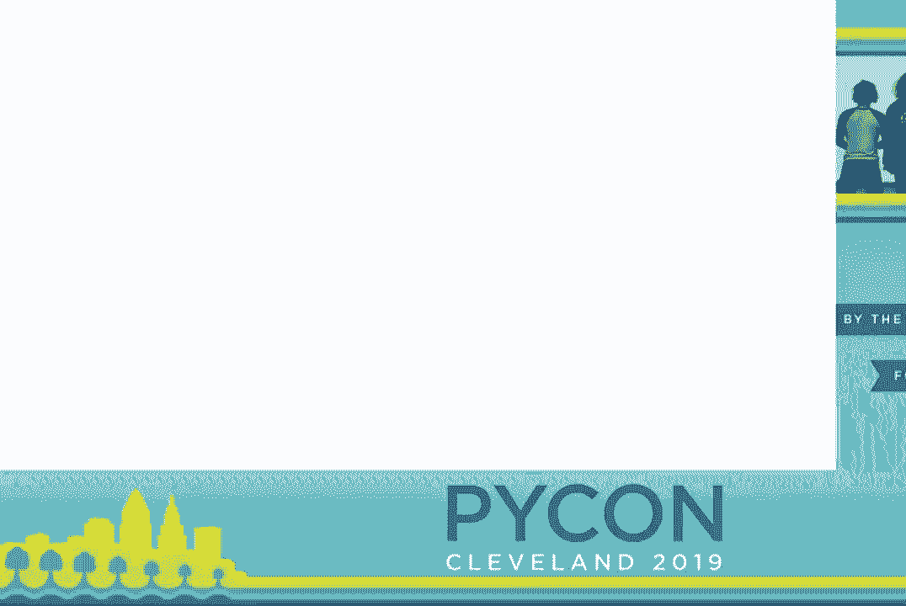
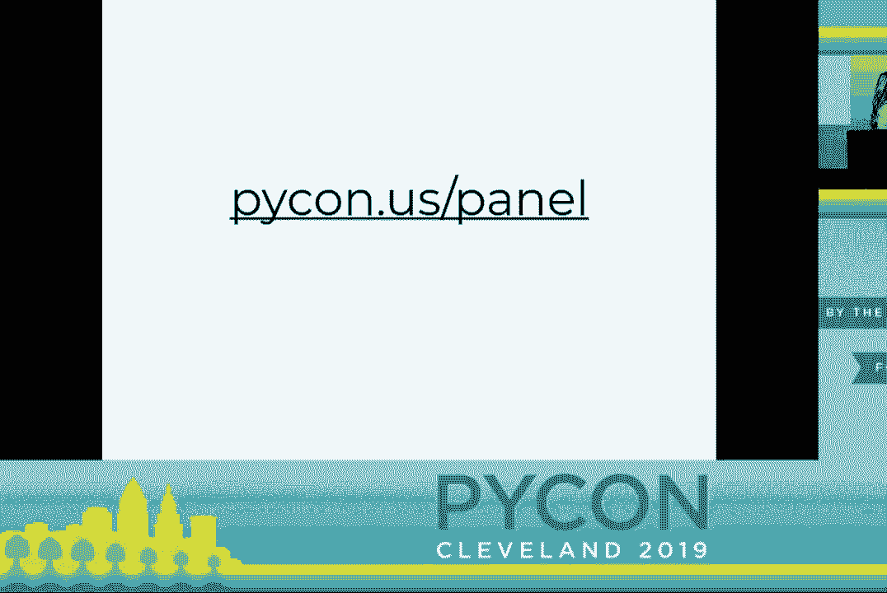
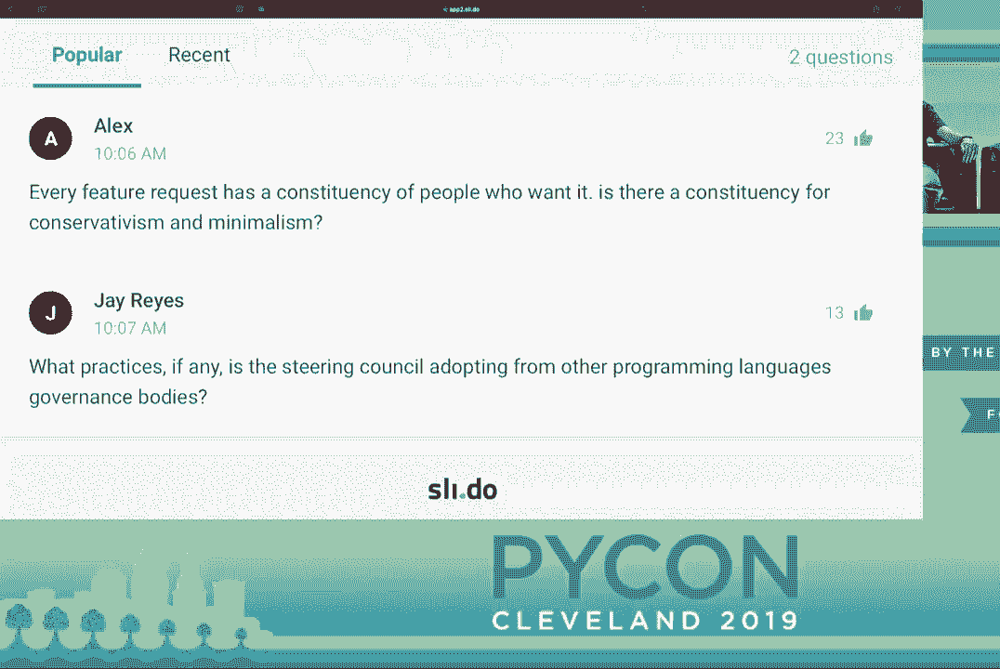

# Python 指导委员会主题演讲：P23：PyCon 2019 小组讨论 🐍

在本节课中，我们将学习 PyCon 2019 上 Python 指导委员会小组讨论的核心内容。我们将了解 Python 治理模式的转变、指导委员会的职责，以及社区成员如何参与 Python 的未来发展。

---

## 开场与介绍 👋

大家好，我是 Nryk Fake，来自 Facebook 西雅图的生产工程师。Facebook 是 Python 和 PSF 的白金赞助商。我们大量使用 Python，不仅用于配置管理，也用于像 Instagram 这样的产品。我们很自豪能赞助 PyTorch、Pyre 和 Monkey Type 等开源项目，它们分别提升了性能、类型检查和代码分析能力。感谢 Python 组织者和 PSF 让这次会议如此成功。

---

## 会议与社区公告 📢

上一节我们介绍了演讲者，本节中我们来看看会议的组织者宣布的重要事项。

以下是本次 PyCon 2019 的一些关键提醒：
*   行为守则：如需举报，可使用提供的联系信息或寻找穿着特定衬衫的工作人员。
*   特殊房间：母亲休息室在 17 号和 18 号房间；安静房间是 24 号房间。
*   展览大厅：已重新配置为海报展示和招聘会，会议结束后立即开始。
*   演讲安排：下午有三场演讲；开放空间开放至晚上 11 点。
*   闭幕会议：包含 PSF 社区更新、颁奖和最终主题演讲，于下午 3:10 在本房间举行。
*   冲刺开发（Sprint）：将在会议结束后持续数日，闭幕会议后将举行 Sprint 介绍会。
*   PSF 筹款：可通过 `picon.us/psf` 参与。

---

## 指导委员会成员介绍 🧑‍💻

现在，让我们欢迎首届 Python 指导委员会上台。这个小组负责 Python 语言和解释器的治理。本次讨论由 PSF 执行董事 Eva 主持。

以下是各位成员的自我介绍：

*   **Barry Warsaw**：我因 Guido 1994 年的世界巡回演讲而爱上 Python。见证这门语言和社区过去 25 年的发展堪称奇迹，它改变了技术格局和许多人的生活。
*   **Brett Cannon**：我因改进一个不完美的“Python 食谱”配方而开始贡献，并于 2002 年加入。我常说我“为语言而来，为社区而留”，并从社区成员那里学到了很多。
*   **Carol Willing**：我认为 Python 是人民的编程语言。我参与社区是为了从技术角度学习，并帮助核心团队更好地反映现实世界中 Python 的多样用户。
*   **Guido van Rossum**：我创造了 Python 并将其开源。在担任了近 30 年的 **BDFL**（终身仁慈独裁者）后，我经历了倦怠，决定让社区建立新的治理结构。现在，我作为指导委员会成员之一继续参与。
*   **Nick Coghlan**：我最初使用 Python 来测试 C++ 硬件驱动。这门语言让我能专注于解决问题而非琐碎细节。参与核心开发是关于连接人们思考方式与计算机能力的迷人过程。

---

## 治理模式的转变 🔄

上一节我们认识了委员会成员，本节中我们来看看 Python 治理模式的核心变化。

Guido 对比了 **BDFL** 模式与指导委员会模式的不同：
*   **BDFL 模式**：最终决策和责任集中于一人，压力巨大。每个 **PEP**（Python 增强提案）都需要其批准。
*   **指导委员会模式**：决策责任分散给五位经社区投票选出的受信任专家。指导委员会将大多数决策委托给特定领域的专家（**PEP** 委托人），自身则负责监督和必要时进行干预。这建立了不同的责任关系，并有助于培养下一代领导者。

---

## 指导委员会的关注领域 🎯

新的治理模式已经确立，本节中我们来看看指导委员会当前关注的一些具体领域。

*   **PEP 581 与问题追踪器迁移**：该 **PEP** 提议将问题追踪器从 Roundup 迁移到 GitHub。指导委员会对此持开放态度，但尚未做出正式决定。他们正在评估可行性，并探讨与 PSF 合作引入项目经理以确保平稳迁移。
*   **打包生态系统的改进**：指导委员会希望澄清 Python 打包权威机构、打包工作组和 PSF 之间的角色。未来的改进重点可能包括发布者体验（如提供发布暂存区）以及持续的安全性、可访问性增强。
*   **PEP 流程的演进**：**PEP** 流程旨在以结构化文档辅助决策。在新模式下，“委托决策”成为首选方式，旨在让社区专家更多地塑造 Python 的未来，保持语言和社区的活力。
*   **Python 2 的退休**：Python 2 将在 2020 年后停止维护。指导委员会计划可能聘请项目经理来处理沟通和细节（如文档更新），并分享从大公司迁移中学习到的最佳实践。商业支持选项将会存在，但免费支持将终止。
*   **促进核心开发的多样性**：指导委员会鼓励所有人参与贡献。成为核心开发者无需是 C 语言专家，关键是关心 Python 并愿意学习。社区应创造包容的流程和工具，降低贡献门槛，并通过第三方库生态吸引新人。

---

## 问答与社区互动 ❓

在小组讨论的最后，委员会成员回答了现场和在线提问。

以下是部分问答摘要：
*   **语言最大的缺口？** 成员们认为语言本身很健全，但解释器性能（如何让 **Python 更快**）和现代化（如引入类似 JavaScript 的源映射以改进调试）是未来重点。
*   **如何应对核心开发者倦怠？** 改善工具（如迁移问题追踪器）可以减轻负担。社区能做的最大帮助是**保持友善，提供建设性反馈**。网络上的负面言论会被看到并影响开发者。
*   **如何开始成为核心开发者？** 访问 `devguide.python.org` 查看开发指南，了解流程。找到感兴趣的领域，积极寻求社区导师的帮助。

---

## 总结 🏁

本节课中我们一起学习了 PyCon 2019 上 Python 指导委员会的关键讨论。我们了解到 Python 的治理已从 **BDFL** 模式转变为由五人指导委员会领导的社区驱动模式。委员会关注于基础设施改进（如问题追踪器）、打包生态、**PEP** 流程优化，并积极推动 Python 2 的退休计划。他们强调社区包容、友善沟通对项目健康至关重要，并鼓励所有人，无论背景如何，都能参与到 Python 的未来建设中来。Python 的成功依赖于每一个社区成员。