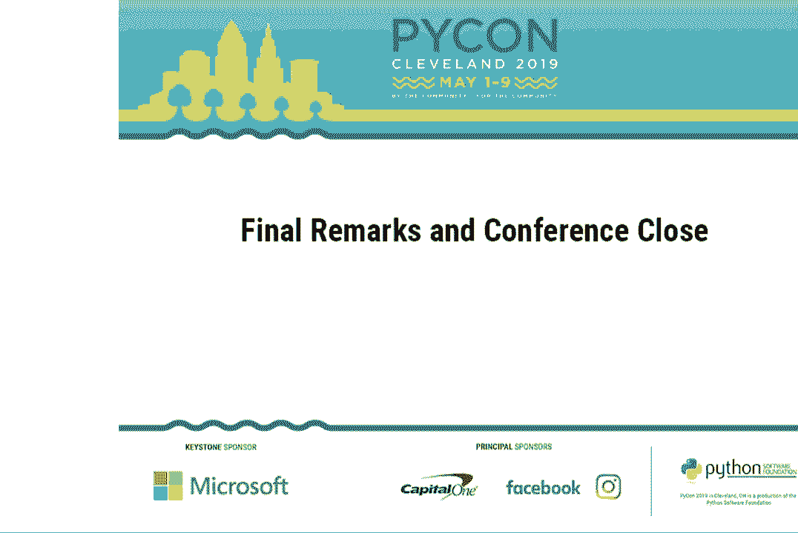
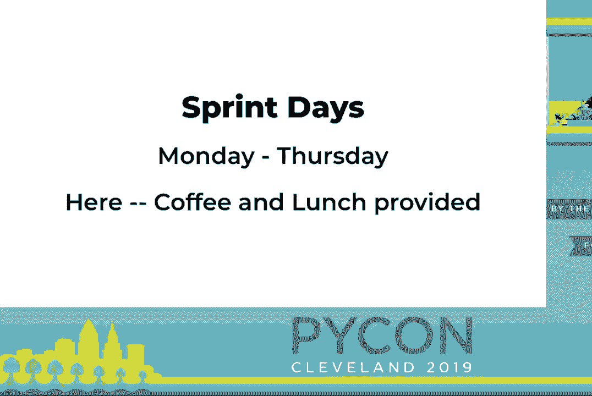
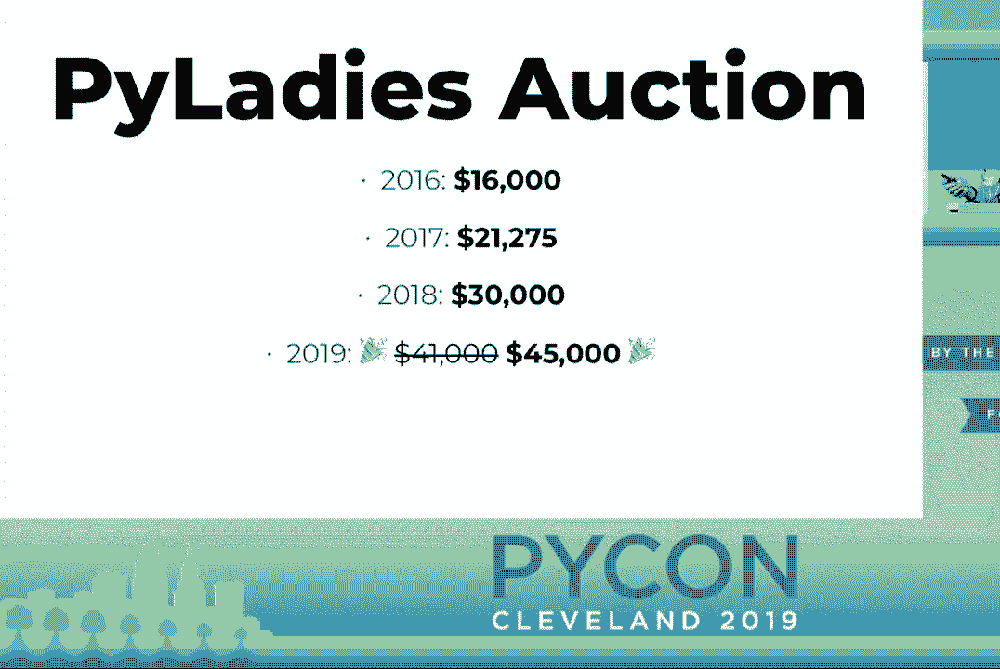
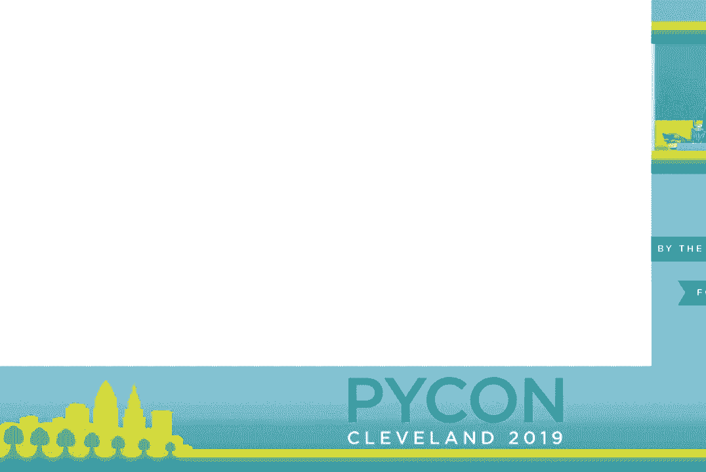
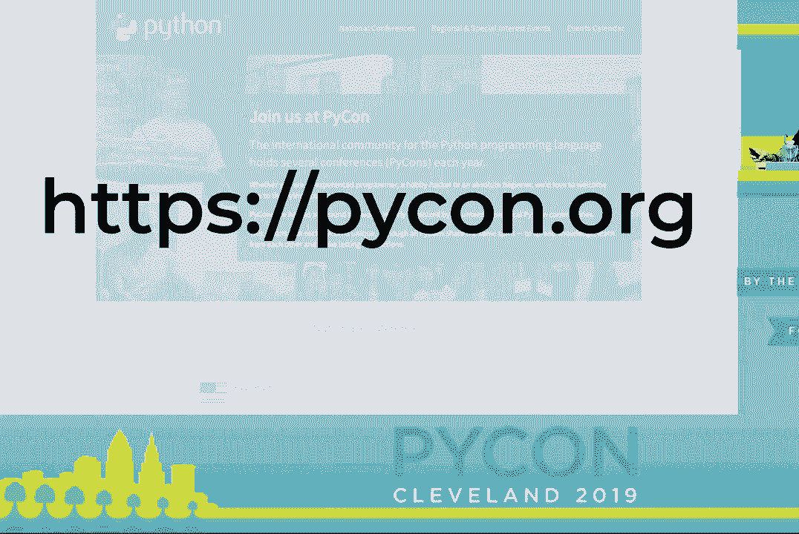
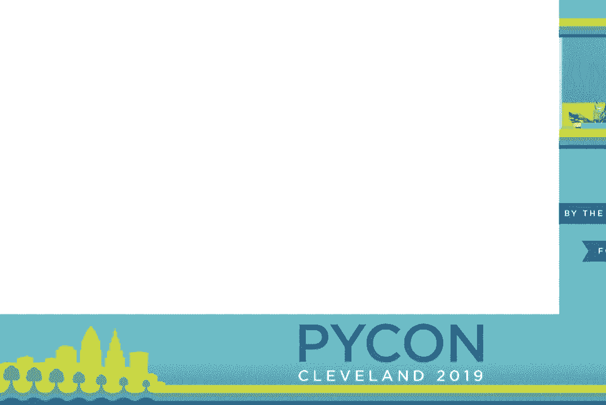
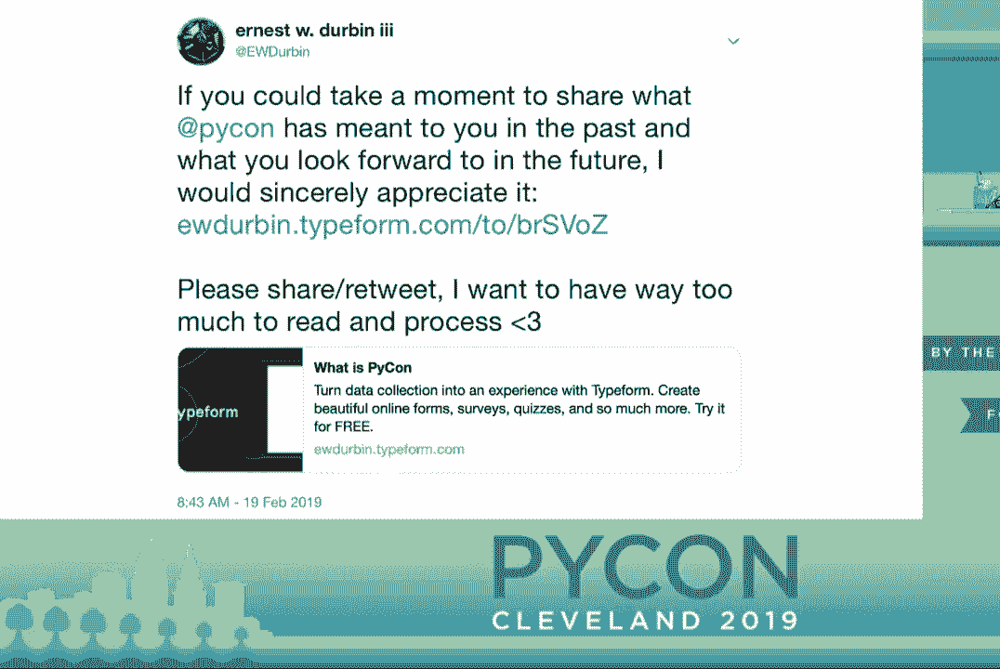
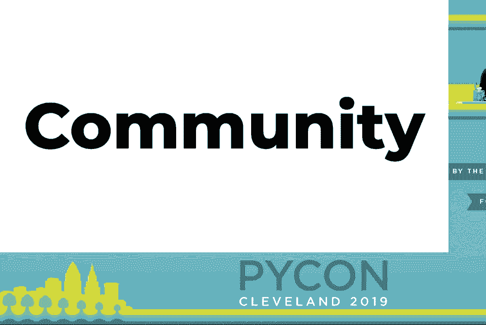
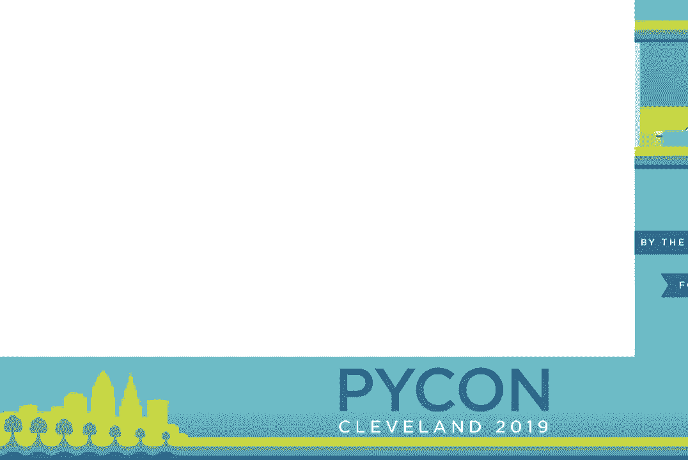
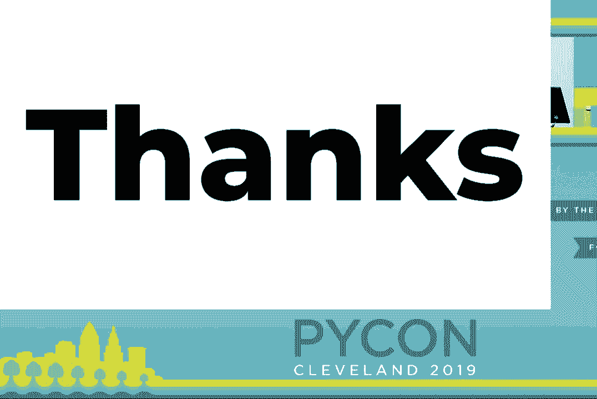

# P24：最终发言与会议结束 - PyCon 2019 - leosan - BV1qt411g7JH

好吧，有些事情需要赶上。

PyCon 正处于最后时刻。但它不会结束。你应该了解一些事情。你可能已经报名了。或者也许你将会了解到这些事情并参与其中。今晚，6 点 30 分，在大湖科学中心是 PyCon 的最后闭幕晚宴。如果你有票。

请出席。如果你不再想使用你的票，请转给其他人。食物已经准备好。这将有助于减少浪费。在这之后，我的发言将是冲刺公告。因此，我们将给大厅大约 15 分钟的时间清空。然后 Cushal 会来这里主持冲刺环节，我喜欢称之为“冲刺行”。

这是领导冲刺项目的人可以稍微停下来介绍他们项目的地方。那些对冲刺感兴趣的人可以倾听并选择他们将要或考虑参与的项目。因此，如果你正在进行冲刺并想要做公告，请留下来等 Cushal 的指示。下午 5 点，25C。

你可以参加冲刺入门研讨会，这将为你提供冲刺的基本概述以及它们的工作方式。冲刺日是从周一到周四，将提供咖啡和午餐。

关于昨晚 PyLadies 拍卖的一些公告。结果已经统计完毕。为了回顾，2016 年为 16,000，2017 年为 21,000，去年为 30,000。今年为 PyLadies 筹集了$41,000。（掌声）此外，Python 软件基金会已同意将其增加到$45,000。（掌声）。

所以开始储蓄并考虑你可能为明年的拍卖捐赠的物品可能是明智的，因为数字只会继续上涨。

哦，还有一个最后的公告。我很高兴分享一下 Python 软件基金会推出的东西。

这是全新的 PyCon。org。因此，这个资源可以帮助你找到离你更近的 PyCon，并在下次活动之前很好地满足你的需求。你可以在 PyCon。org 找到它。不要去 www。pyCon。org，因为我没有意识到 GitHub 页面在 TLS 上无法覆盖。（笑声）我想这可能是我明天开始冲刺的内容。（掌声）。

对于组织者，如果你在场是组织者，我真的希望你访问这个网址，分享给其他组织的朋友。这个网址将带你到一个仓库，你可以在 CSV 文件中添加你的活动。最终，这个 CSV 文件将为这个网站提供内容。这将帮助我们更直接地拥有一个中央位置。

要找到所有这些活动。每年都有越来越多的活动。所以现在是时候进行我在任何时候都不确定自己是否准备好的事情。我们将慢慢来，并一起度过这一切。好吗？（叹气）所以，2019 年的 PyCon，如我们大多数人所知，已进入最后时刻。

能担任 PyCon 的主席是一种特权，我感激你们每一个人都在这里。就我个人而言，这是一段变革性的经历。我永远感激能在这项工作中获得信任和支持。在我担任主席期间，人们常常问我，“厄尼斯特，PyCon 是什么？”（笑声）。

随着时间的推移，我对这个问题的回答几乎变成了机械的回应。只是日期、事件名称和数字一遍又一遍地重复。感觉开始变得空洞。它与我每次想到过去在 PyCon 的经历时的感受不符。因此，我倾向于发推，于是我发了推。

我问你，我请求你分享它，以便其他人可以回答，然后你回答了。调查的回应是我甚至无法考虑读给你的内容。在屏幕上分享，或者老实说，甚至不想花太多时间思考。结果总是我，沉浸在自己的眼泪中，情感从我心的每个角落涌出。但我在想。

我想，我可以分享几乎每个回应中一致的主题。

（掌声）与我们社区中的其他人面对面共度这段时间加深了、拓宽了，并常常创造出支持 Python 及 Python 社区的个人和专业关系网络。这些互动的发生方式或样子没有正确的方式。这也是为什么 PyCon 有这么多活动且时间如此长的一个因素。

这也是为什么 Hatchery 项目对我如此重要的一个大原因。支持 PyCon 随着时间的演变，支持并发展我们的社区。我想花点时间来认识我们共同分享的特权，能够在这个房间里，接触到今天存在的这个社区的一个子集。

无论我们是如何来到这里的，Python 社区远远超过过去几天在克利夫兰聚集的 3200 人。仅在 2018 年的 Python 开发者调查中，就有来自 150 多个国家的 18000 人作出了回应。很难说我们的社区究竟有多大，或者将来会有多大。

但我们可以在脑中做一些粗略的估算。由于没有计划大幅增加 PyCon 的规模，我们如何确保其他人能够访问这个社区？

在这个会议上，绝不能成为我们社区增长和维持的瓶颈。

当你回到家时，我几乎可以肯定你附近有国家或地区的 PyCon、聚会小组或其他形式的社区活动。虽然可能规模较小，但它们代表着相同的联系和成长机会。你可以在这些网站上找到资源，访问这些网址，了解全球各地的会议和活动，它们很可能离你更近。

我鼓励你们参加、支持并在这些活动中志愿服务。甚至可以考虑组织一个。这些活动帮助提供我们社区在这一年一度的活动中无法持续的机会。说到明年，我想现在向你们介绍 PyCon 的新任主席，2020 年和 2021 年在匹兹堡的 Emily。

好消息是，我们距离下一个 PyCon 活动不到一年。接下来的两年，我们将在 2020 年 4 月 15 日至 23 日和 2021 年 5 月 12 日至 20 日在匹兹堡举行。希望在未来的几年里再次见到大家。[掌声] 好的。现在我想花点时间来感谢所有为这个活动付出努力的人。

许多人齐心协力使这个活动成为可能。如果你听到一个你曾参与的团体的名字，请站起来并保持站立，以便得到认可。我们有一份相当长的名单，所以我不会在中间停顿，但请不要因此而停止从一开始就热烈鼓掌。

不再赘言，我们要感谢 PSF 的工作人员，他们是本次会议的基石。我们的多样性与外展主席，我们的宣传主席和博客团队，我们的无障碍主席，我们的程序委员会主席和评审人员，我们的志愿者应急响应人员，我们的教程主席，我们的海报主席，以及所有负责闪电演讲的人，我们的经济援助团队。

我们的会议工作人员和休息室工作人员，我们的冲刺协调员，我们的开放空间团队，PICON 孵化委员会，PICON Charla 团队，PICON 艺术组织者，维护者峰会组织者，指导冲刺组织者，各个慈善拍卖协调员和志愿者，教育峰会主席及团队。

语言峰会协调员，我们的初创企业专区协调员，我们的字幕协调员和字幕工作人员，技术音频和视频工作人员，年轻编程者的教育者，5K 跑步和步行协调员，我们的移动指南协调员，以及我们的礼品袋负责人 Paul Hillbrandt。我们要感谢所有的发言者。

我们的教程讲师，我们的海报展示者，我们的教育峰会发言者，我们的 Charla 发言者，以及所有现场志愿帮助分发礼品袋的人，帮助年轻编程者的人，负责休息室的人，演讲者的跑腿，主持会议的人，拍卖物品的运营，注册摊位的工作人员和教程的迎接人员。[掌声] 

在我们散会之前，我想最后感谢大家，因为没有你们，我们的社区就不可能存在。所以谢谢你们。我们将在 2020 年匹兹堡见。[掌声]

