# 降低失败风险：事前评估与事后评估教程 🛡️

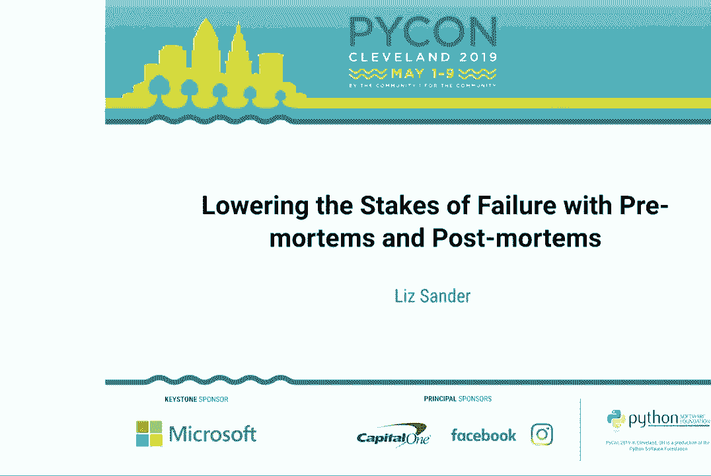

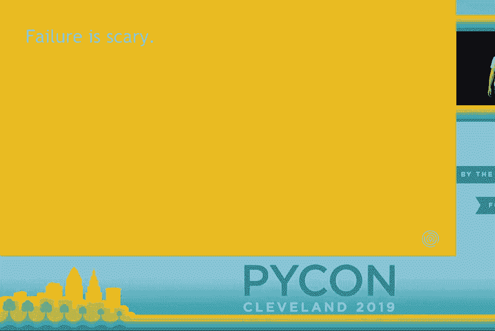

在本教程中，我们将学习两种强大的工具——**事后评估**和**事前评估**。它们能帮助我们系统性地处理项目中的失败，将令人恐惧的“事故”转化为宝贵的学习机会，从而降低未来风险。无论你是工程师、数据科学家还是项目经理，这些方法都能为你所用。

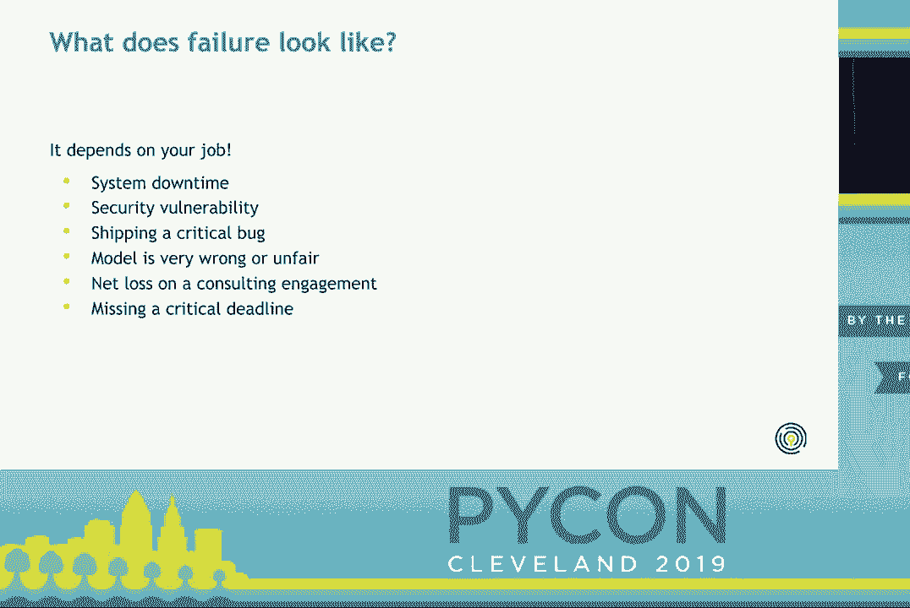

## 为什么失败如此可怕？😨

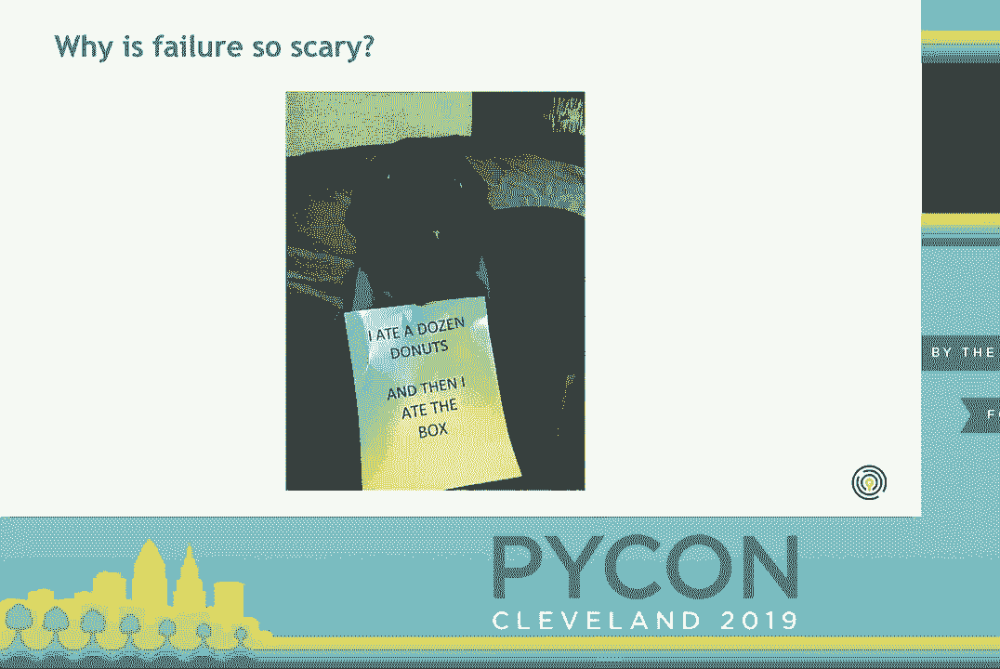

失败之所以可怕，有几个显而易见的原因。它会让公司损失金钱，占用你和团队的时间。外部用户也可能受到影响，耗费他们的时间和金钱，导致他们不满。此外，失败还带有巨大的情感负担。如果你觉得自己对失败负有责任，很容易感到尴尬和羞愧，觉得自己辜负了团队、公司或用户。这种情感负担使得公开谈论失败变得非常困难。

然而，失败并不完全是个人的责任。错误总是在特定的环境中发生。接下来，我们将探讨导致失败的系统性因素。

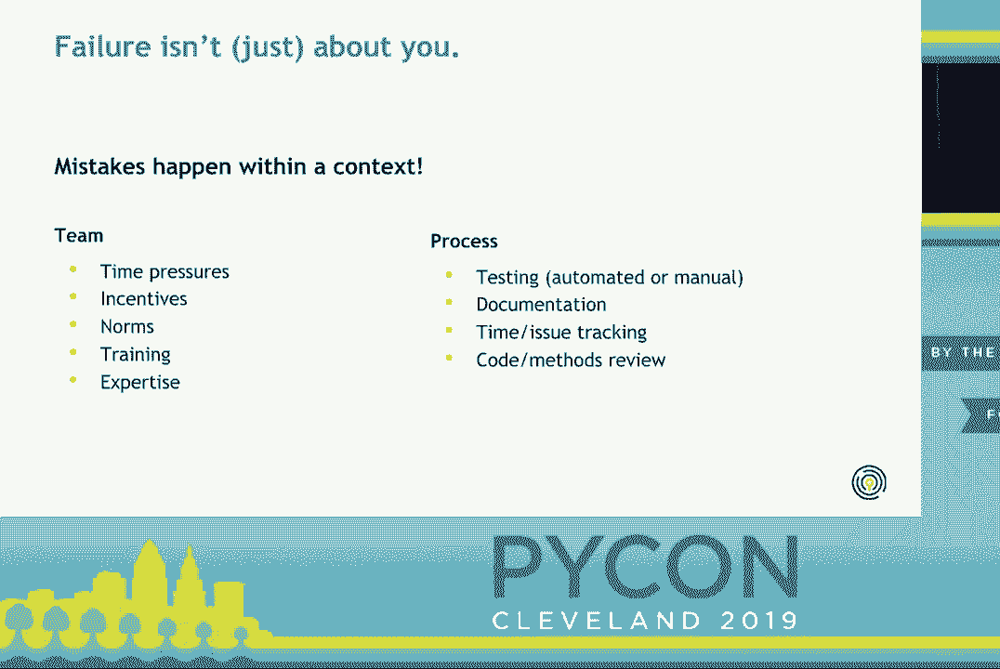

## 理解失败的系统性根源 🔍

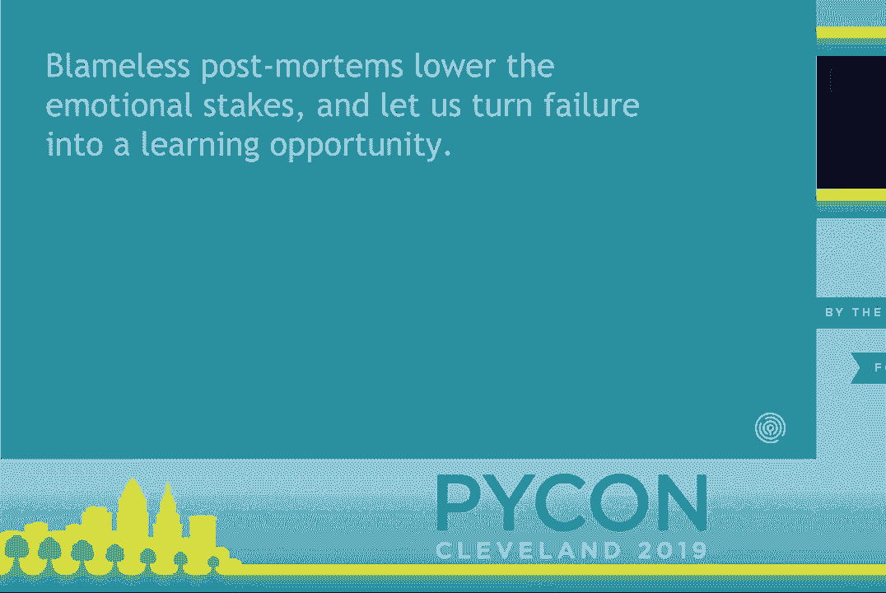

失败的发生与个人所处的环境密切相关。如果你在一个团队中工作，可能会面临时间压力。团队中存在正式或非正式的激励与规范，影响着你的工作重点和节奏。此外，团队是否具备成功所需的专业知识也至关重要。

还有一些流程元素值得关注，这些是你可以施加一定控制的部分。例如：
*   **测试**：在代码上线前，你们进行何种测试？
*   **自动化**：流程的自动化程度如何？是否存在容易跳过或出错的手动步骤？
*   **文档**：代码和发布流程是否有良好的文档？糟糕的文档是否容易引入Bug？
*   **项目管理**：是否有时间管理或问题追踪？你是否清楚项目进度？
*   **审查**：代码或方法在上线前是否有人审查？

认识到这些系统性因素，是迈向“无责”文化、共同改进的第一步。

## 事后评估：从失败中学习 📝

上一节我们探讨了失败的环境因素，本节中我们来看看如何通过**事后评估**来系统性地从失败中学习。

事后评估的核心理念是：**个人会犯错，特别是在高压环境下。** 因此，我们需要以团队的方式思考，建立能够捕捉和缓解问题的系统。无责的事后评估正是这样一个工具，它能降低情感风险，让我们将事件视为学习机会。

### 什么是事后评估？

广义上说，事后评估是一个结构化流程，用于：
1.  **记录**事件经过。
2.  **识别**根本原因。
3.  **找出**未来应采取的预防或缓解措施。

尽管它常见于站点可靠性工程（SRE），但同样适用于数据科学、咨询或任何可能“失败”的领域。其交付成果是一份详细描述事件、根本原因和后续行动的文档。

### “无责”原则至关重要

“无责”意味着会议的重点是理解事件的**系统性根本原因**，而不是指责个人。目标是让团队能够改进，而不是追究责任。每个人都对帮助团队良好运作负责，但没有人需要对具体事件负责。

即使看似是“一个人的错”，也应考虑其行动背后的信息、培训和背景。个人的持续表现问题应与经理单独讨论，而非事后评估会议的重点。

### 一个具体案例：发布有缺陷的代码

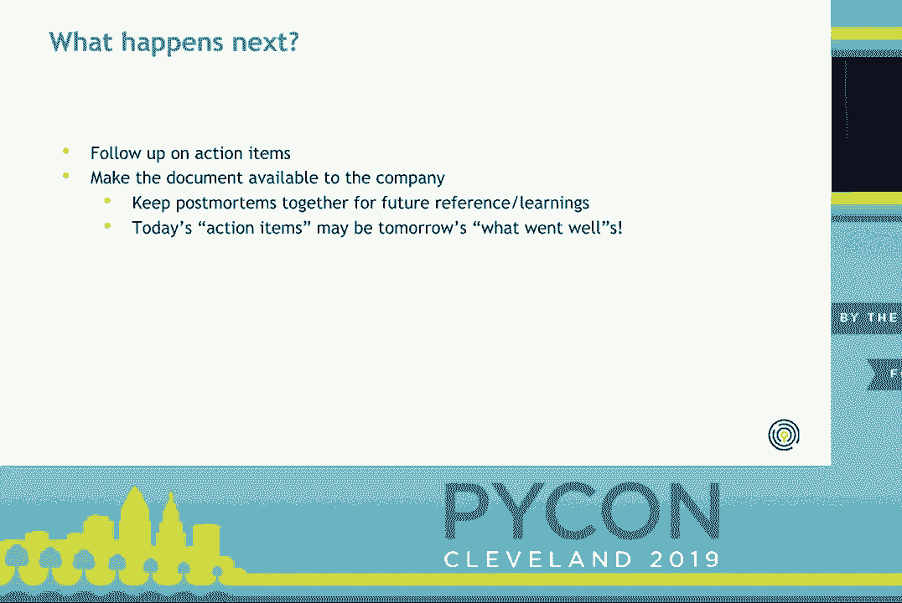

为了让概念更具体，我们来看一个数据科学领域的案例：发布了一个有缺陷的代码库，导致内部所有相关工作失败。

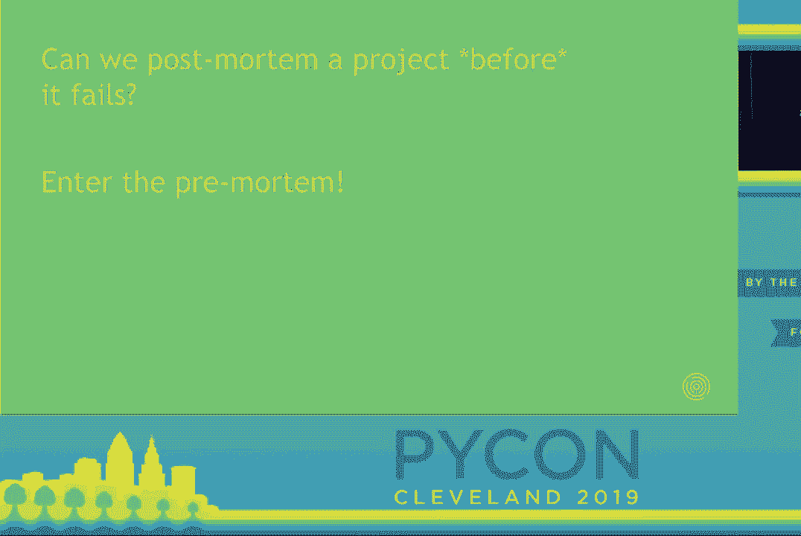

**会议流程如下：**

1.  **确定参会者**：邀请直接参与事件的小团队（如开发者、协助者），必要时可包括受影响方代表（如客户成功经理）。
2.  **使用模板**：会前填写事后评估模板的主要部分。
3.  **指定协调者**：由未直接参与事件的人主持会议，确保讨论高效、聚焦。
4.  **确认时间线**：所有人就事件的基本事实达成一致。
    *   **时间**：事件发生和持续的时间段。
    *   **摘要**：事件如何发生、如何被检测到。
    *   **影响**：对用户造成了何种影响。
    *   **解决方案**：如何解决的，包括尝试过但未成功的方法。
5.  **分析根本原因**：讨论并确认导致事件的深层系统性问题。在上述案例中，根本原因是**没有在与生产环境匹配的环境中进行充分测试**。
6.  **总结优点**：肯定团队在事件处理中做得好的地方（如快速沟通、提供临时解决方案），这有助于降低情绪温度。
7.  **识别改进点**：明确哪些环节出了问题，需要重点关注。
8.  **反思“幸运”之处**：思考这次侥幸避免但未来可能引发更严重问题的环节。例如，案例中幸运的是这仅是内部发布，且有一位备用维护者可协助。
9.  **制定行动项**：针对根本原因和改进点，制定具体的、可执行的改进措施，并**分配负责人**。
    *   案例中的行动项：更新发布清单，确保在匹配生产环境的环境中测试；规定必须有至少两位维护者可用时才可发布。
10. **提炼经验教训**：总结可应用于本项目及其他项目的一般性经验。
11. **跟进与分享**：跟进行动项，并将文档分享给团队甚至公司，作为知识积累。

通过这样的流程，团队不仅能解决当前问题，还能建立应对未来类似事件的流程（如“遇严重Bug立即回滚”），实现持续改进。

## 事前评估：在失败发生前预防 🚀

上一节我们学习了如何在失败发生后进行复盘，本节中我们来看看如何主动出击，在项目开始前就识别并预防潜在风险，这就是**事前评估**。

事前评估的核心思想是：**在项目启动或早期阶段，主动预测可能出错的地方，并制定应对策略。** 这就像为项目进行一次“预演式”的风险排查。

### 为什么要进行事前评估？

当领导层对项目热情高涨时，团队成员可能不敢提出潜在的担忧。事前评估会议的目的就是**鼓励大家公开讨论这些担忧**，将其转化为团队的宝贵资产。这样做可以：
*   降低团队焦虑，增强提出问题的信心。
*   揭示跨职能团队中特有的盲点（如技术人员不了解产品顾虑，反之亦然）。
*   确保团队在构建“正确的东西”，并为成功做好准备。

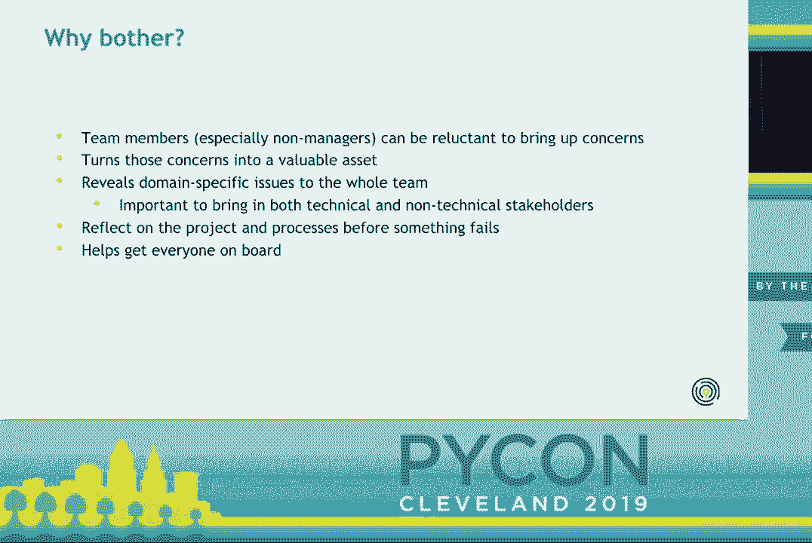

### 一个具体案例：复杂的Flask数据应用

以一个涉及工程师、数据科学家、产品经理的跨职能Flask应用项目为例，团队面临不确定性、时间压力和沟通挑战。

**会议流程如下：**

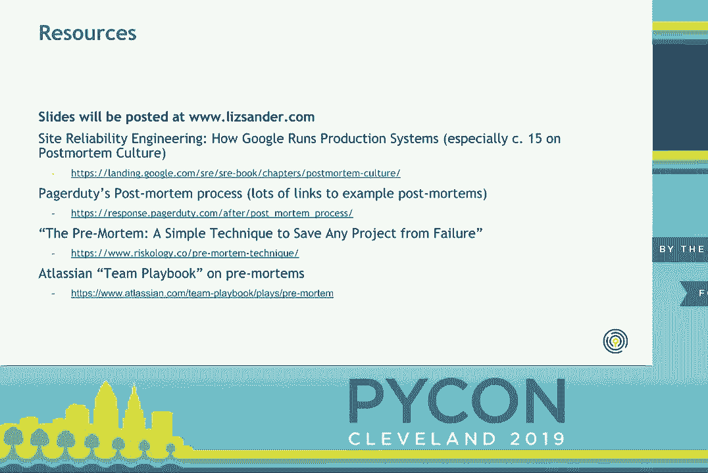

1.  **确定参会者**：邀请来自不同部门的广泛利益相关者（工程师、数据科学家、产品、销售等）。
2.  **头脑风暴风险（20-30分钟）**：鼓励大家畅所欲言，提出项目可能失败的各种方式。
    *   工程师可能担心：应用性能慢、部署困难。
    *   数据科学家可能担心：ETL流程问题、模型效果差。
    *   产品/销售可能担心：没人想用这个工具。
3.  **归类风险**：将大量想法归纳为少数几个（如5个）主要风险类别。
    *   例如：应用性能、安全漏洞、时间表延误、主要功能缺口、用户采纳度低。
4.  **评估风险**：与会者对每个风险类别从1到3打分，评估其**发生可能性（P）**和**影响严重程度（I）**。
5.  **计算优先级**：计算每个风险的平均可能性与平均影响的乘积：`风险值 = P * I`。按风险值从高到低排序。
    *   例如：“功能缺口”可能被评为高风险（可能性高、影响大），而“安全漏洞”可能因被认为可能性低而总分不高。
6.  **制定缓解措施**：从最高风险开始，讨论团队可以采取哪些具体行动来避免或减轻该风险。
    *   针对“用户采纳度低”的风险，团队决定进行持续的用户访谈和客户沟通。
7.  **文档化与跟进**：将讨论结果整理成文档并分享。这是一个“活文档”，应在项目周期内（如每次冲刺回顾时）定期回顾和更新，并检查行动项进展。

## 总结与资源 📚

在本教程中，我们一起学习了两种降低失败风险的核心方法：

*   **事后评估**：用于在**失败发生后**进行结构化复盘，聚焦于系统性根本原因（而非个人追责），旨在从错误中学习并制定改进措施。
*   **事前评估**：用于在**项目开始前**主动预测风险，通过跨职能头脑风暴识别潜在问题，并提前规划缓解策略，旨在预防失败。

这两种方法共同创造了一种开放、学习型的团队文化，让人们能够安全地讨论失败和担忧。关键在于**关注团队、系统和流程的改进，而不是指责个人**。

**拓展资源：**
*   **谷歌《网站可靠性工程》**：书中关于事后评估和文化的章节极具启发性，即使非SRE角色也值得一读。可在线免费获取。
*   **PagerDuty事后评估示例**：提供大量真实的事后评估文档范例，可供参考。
*   **事前评估相关文章**：事前评估的结构多样，建议阅读不同文章，找到适合自己团队的模式。

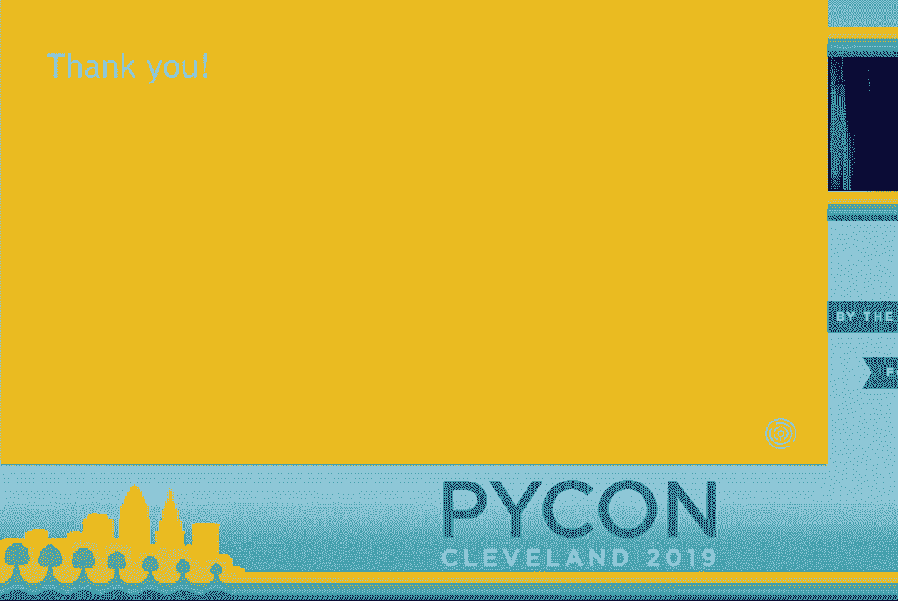

通过实践事前与事后评估，你和你的团队将能更从容地面对挑战，将每一次挫折都转化为迈向成功的阶梯。