# P26：Erin Allard - 使用Python成功通过技术面试 - PyCon 2019 - leosan - BV1qt411g7JH

大家好。大家好。接下来是Aaron Allard。他是Heroku的一名平台支持工程师，将为我们呈现ACI。我们的使用Python的技术面试。

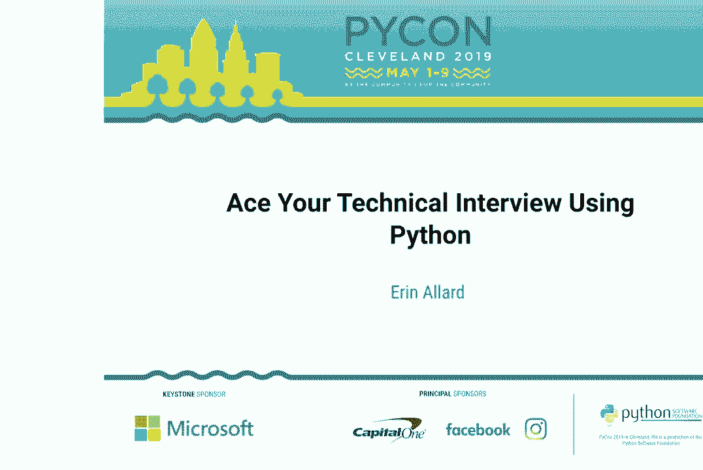

[掌声]。

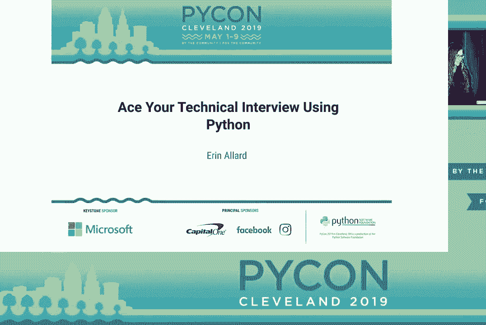

[掌声]，大家好，我是Aaron Allard，我是一个，Heroku的专业学生，我是一个。Heroku的专业学生，我是一个，Heroku的专业学生，我是一个。Heroku的专业学生，我是一个，Heroku的专业学生，我是一个。Heroku的专业学生，我是一个，Heroku的专业学生，我是一个。

Heroku的专业学生，我是一个，Heroku的专业学生，我是一个。Heroku的专业学生，我是一个，Heroku的专业学生，我是一个。Heroku的专业学生，我是一个，Heroku的专业学生，我是一个。Heroku的专业学生，我是一个，Heroku的专业学生，我是一个。

Heroku的专业学生，我是一个，Heroku的专业学生，我是一个。Heroku的专业学生，我是一个，Heroku的专业学生，我是一个。Heroku的专业学生，我是一个，Heroku的专业学生，我是一个。Heroku的专业学生，我是一个，Heroku的专业学生，我是一个。

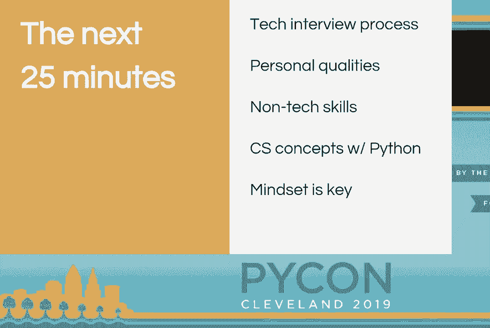

Heroku的专业学生，我是一个，Heroku的专业学生，我是一个。Heroku的专业学生，我是一个，Heroku的专业学生，我是一个。Heroku的专业学生，我是一个，Heroku的专业学生，我是一个。Heroku的专业学生，我是一个，Heroku的专业学生，我是一个。

Heroku的专业学生，我是一个，Heroku的专业学生，我是一个。Heroku的专业学生，我是一个，Heroku的专业学生，我是一个。

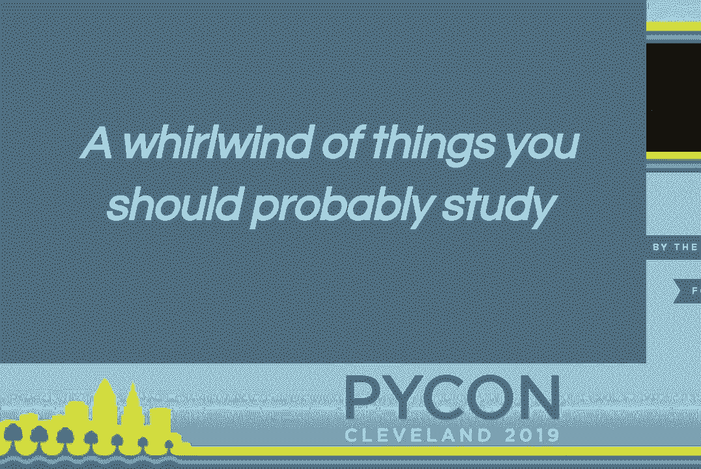

Heroku的专业学生，我是一个，Heroku的专业学生，我是一个。Heroku的专业学生，我是一个，Heroku的专业学生，我是一个。Heroku的专业学生，我是一个，Heroku的专业学生，我是一个。Heroku的专业学生，我是一个，Heroku的专业学生，我是一个。

我是Heroku的专业学生，我是一个，Heroku的专业学生，我是一个。我是Heroku的专业学生，我是一个，Heroku的专业学生，我是一个。Heroku的专业学生，我是一个，Heroku的专业学生，我是一个。Heroku的专业学生，我是一个，Heroku的专业学生，我是一个。

我是Heroku的专业学生，我是一个，Heroku的专业学生，我是一个。Heroku的专业学生，我是一个，Heroku的专业学生，我是一个。Heroku的专业学生，我是一个，Heroku的专业学生，我是一个。Heroku的专业学生，我是一个，Heroku的专业学生，我是一个。

很多指导那些也在转行的人，所以很多经验影响了这个演示。这也是我第一次在PyCon上发言，所以再次，非常感谢你们的到来。[掌声] 好的。这显然是一个填字游戏。我想给你们几秒钟的时间。

有人能想到这个填字游戏为什么重要吗？好吧，我告诉你。所以这个填字游戏出现在1942年1月的《每日电讯报》中，这是一份在英国出版的报纸。我半开玩笑地提议这是我见过的第一次，我真的很兴奋能够。

我提议这是计算机科学历史上第一次技术面试。我这样说的原因是，这个填字游戏是布莱奇利公园的人们最初用来寻找密码分析师和善于解决问题的人来加入他们的工作。

破解恩igma密码。我昨晚看了《模仿游戏》，是第五次，意识到这与我的演讲非常契合，所以在最后时刻添加了它。自那以后，我们在技术面试上真的走了很远。我把这个放在这里只是提醒你保持视角。我们将要讨论。

关于一些非常技术性的话题，但其实它回溯到填字游戏本质上想帮助布莱奇利公园的人们找到的东西：你能解决问题吗？你能识别模式吗？你能坚持做一件事直到完成吗？

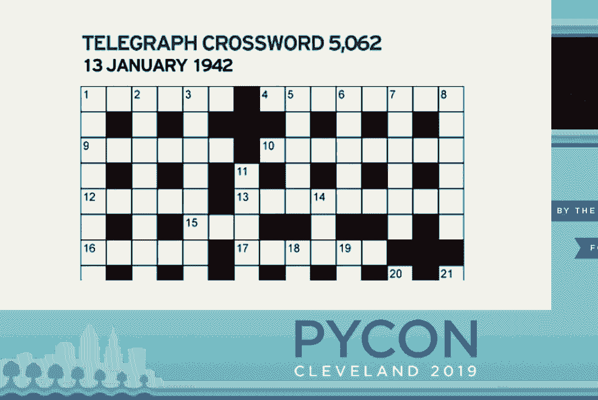

所以这是技术面试流程的简要概述，以防你们中的一些人。

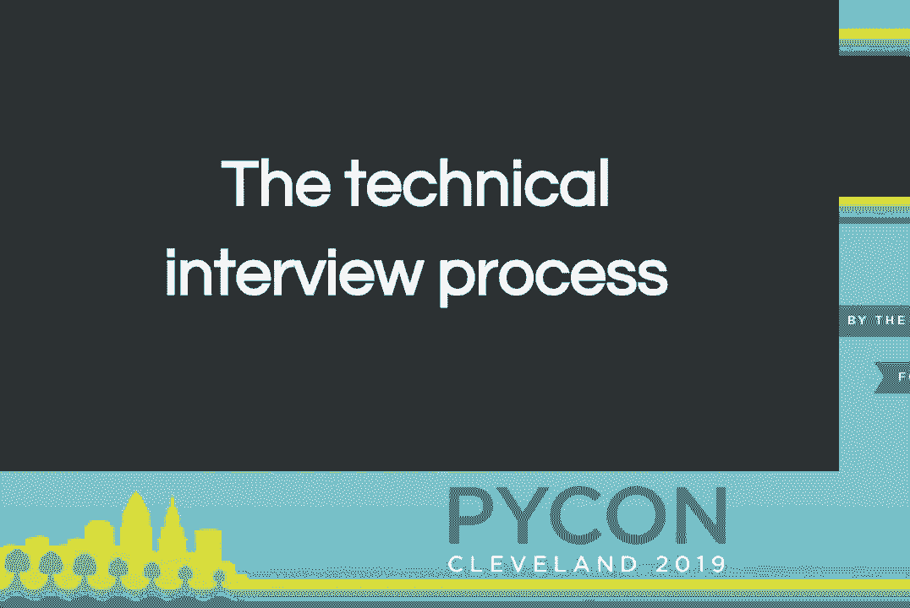

还没有进行技术面试。通常以招聘人员的电话筛选开始。我称之为脉搏检查。招聘人员会与你交谈20或30分钟，问你所有一般性的问题，比如：“你为什么申请这个职位？你对公司了解多少？”

"在过去的一年或两年里你在做什么？"，如果进展顺利，如果你能说服他们与你谈20分钟很有趣，他们就会把你推进下一步，通常是与工程师的技术电话筛选。我忘了提到，所有这些都会有一些变动。

在不同公司之间的步骤，但通常这是流程。技术电话筛选。与工程师的交流可能会有或没有网页协作编码的环节，但通常持续30到60分钟，他们会问你一些关于你喜欢的编程语言的问题。他们可能会稍微探讨一下。

你对该语言中不同概念的理解。而根据角色的不同，他们可能会问你一些特定领域的问题。如果你申请的是后端 Django 的职位，他们可能会问你一些关于 Django 的问题。大致就是这样。如果这个电话进展顺利，下一步通常是一个叫做 COM 评估的环节。

这就是一个迷你自包含的项目，招聘人员可能会给你发一些指示。而你在接下来的两到七天里要做的，就是针对任何提示提供一些响应或解决方案。关于这些项目是否有效或公平有一些争论。不幸的是，一些公司。

利用这些项目从人们那里获取一些免费的劳动，这是不对的。但如果做得好，结构合理，企业可以很好地评估候选人在团队中的技能适配度。最后一步通常是现场面试。这部分我总是特别紧张。通常。

至少有四个小时你会见到三到十个不等的人，大多数人将是你的团队成员。很多面试都是技术性质的，你会进行白板讨论或者对练编程。我稍后会解释这些是什么。此外，还有很多行为问题，人们会问你一些你可能之前听过的问题。

他们会问你如果发生某种情况你会怎么做，或者你如何处理冲突之类的问题。白板讨论，你可能知道，是指你和面试官站在一个大白板前，而不是电脑屏幕前，共同解决问题。对练编程是你们在解决同样的问题，但实际上是在编码。

关于两者的利弊我就不深入探讨了，争论哪一个更好也不重要。但有很多值得关注的内容。

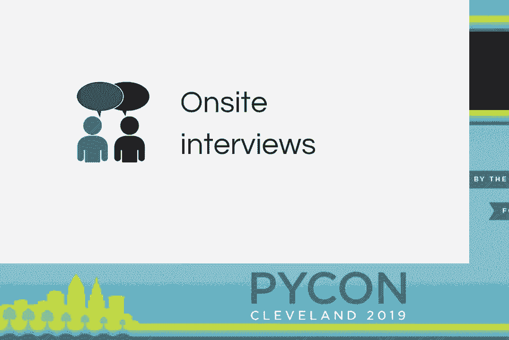

在网上关于这个的讨论。因此，我们接下来谈谈技能部分。首先，我想谈谈非技术技能。人们通常称这些为软技能。我不喜欢称之为软技能，因为非技术技能对人们来说非常重要。

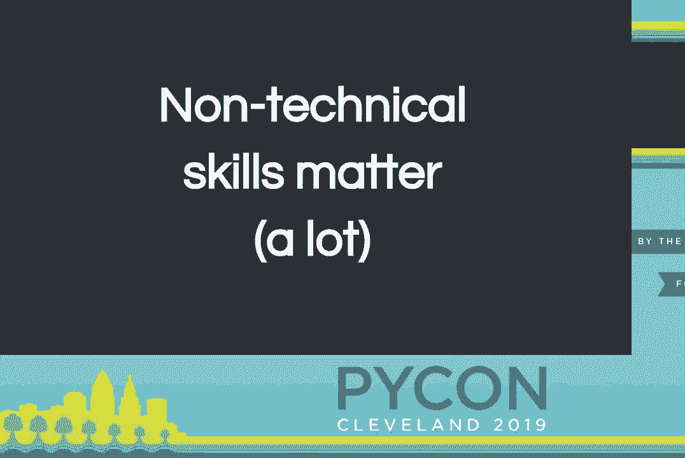

而个人方面的内容可能真的很困难，但非常重要。其中一个就是解决问题的能力。我们作为软件工程师经常听到这个词。每个人都想和擅长解决问题的人一起工作。在我看来，“解决问题者”这个词实际上是更长描述的简写。对我来说。

这意味着利用你已经知道的东西去解决一个可能没有明确定义的具体问题。对于那些有些经验的人来说，你知道，这在你的工作中时常发生。所以这是一项技能。

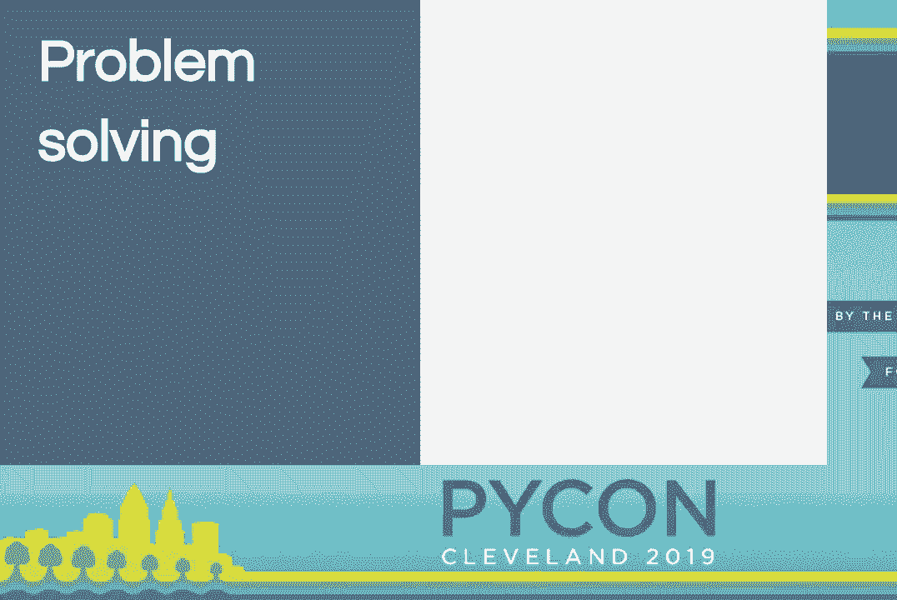

你的面试官将筛选的另一个非技术技能，在我职业发展中非常重要的是提出好问题的能力。我在这里链接了一篇由Julia Evans写的博客文章，名为“如何提出好问题”。这是我在与任何早期阶段的人交谈时都会提到的一篇精彩文章。

我从中提取出的主要内容是一个框架，关于如何构建问题，使其对你和你问的人都最有用。这类似于：我试图做这件事情，但其他事情正在发生。我已经尝试了X和Y。

你能给我指明正确的方向吗？对我来说，当我使用这个格式时，它非常有效，因为我能够表明我已经尝试过自己做某事。它没有成功，所以我尝试了其他事情。我可以为我所问的人设定一个知识基准，然后我做出具体的求助请求。

我还想补充的是，问一个好问题应该针对合适的人。对我来说，合适的人通常是对这个话题了解最多、最不忙的人。通常你，嗯，实际上，算了。我本来想开始谈论Slack，但我不会深入那个话题。第三个非技术技能是。

我想强调的是理解假设，这适用于代码和人。我们可能对这两者都非常熟悉，但当谈到工程团队时，我们可以稍微不同地讨论。我们知道理解一个问题的假设，但我想更深入一点。

我考虑的是关于这个问题的假设。我认为哪些事情是事实，但实际上我没有花时间去证明或询问。里面也可能包括偏见或期望。因此，当招聘经理面试候选人时，这可能是他们在寻找的东西。对人也一样，招聘经理可能非常关注他们的职业生涯或面试过程。

我有兴趣知道候选人是否能深入思考，减少对同事的假设，通过提问的方式。例如，可以说：“嘿，当你在会议上说这个时，我不太确定你的意思。你能再解释一下吗？”检查对人假设的正确性。

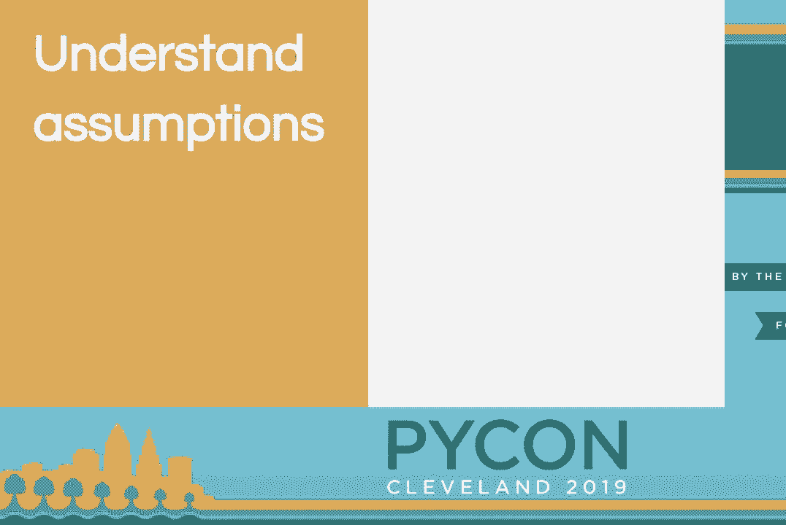

有助于你的团队更顺利地运作。现在我们将转向代码部分。代码显然在技术面试中非常重要。

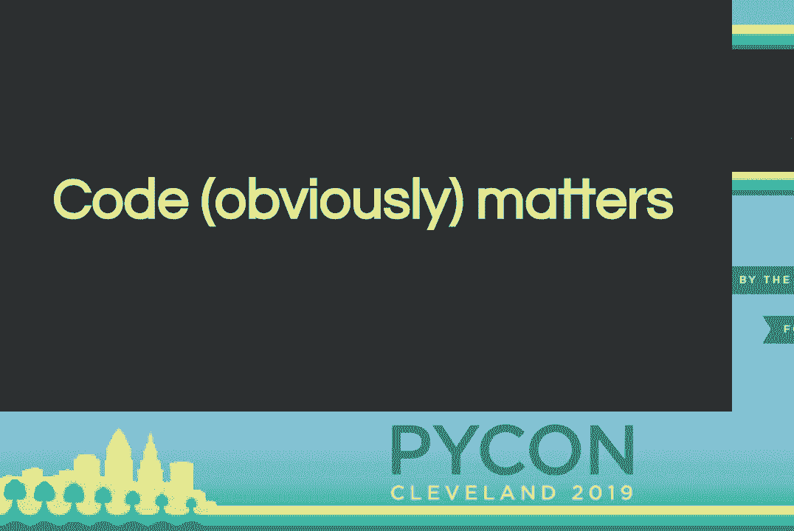

我想先谈谈集合。因此，当我考虑如何处理一个编码挑战时，比如说，我喜欢牢记我在编程中拥有的所有工具，这些工具可以帮助我解决问题。在我看来，集合是最强大的工具，因为。

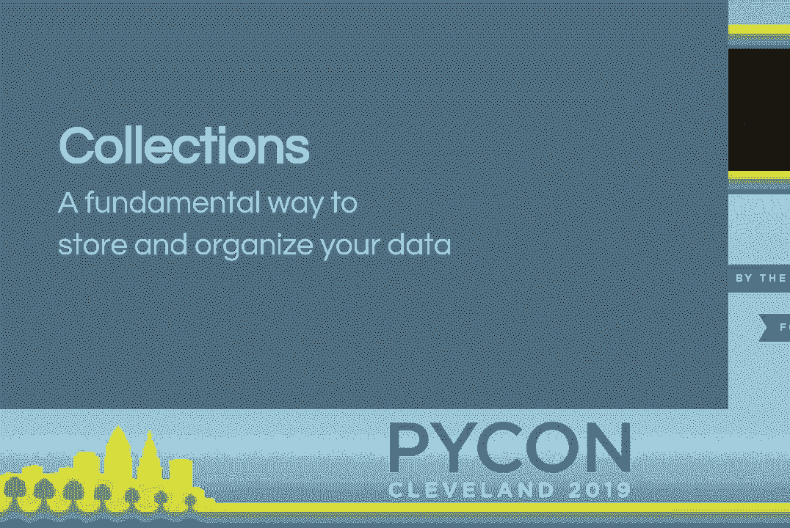

它们帮助我存储和组织数据。这些可以是元组、列表、字典和集合。我故意不讨论语法或方法之类的事情，因为我知道你们都可以去查看文档。但熟悉这些工具会在编码挑战中节省你大量时间。如果你能立即识别。

使用哪个集合将节省你的时间。如果你能记住与这些集合相关的一些非常有用的方法，那会节省你很多时间。例如，对于字典，如果你能记住，哦，有一个键的值和一个项目方法或iter items方法，那会为你节省很多时间。

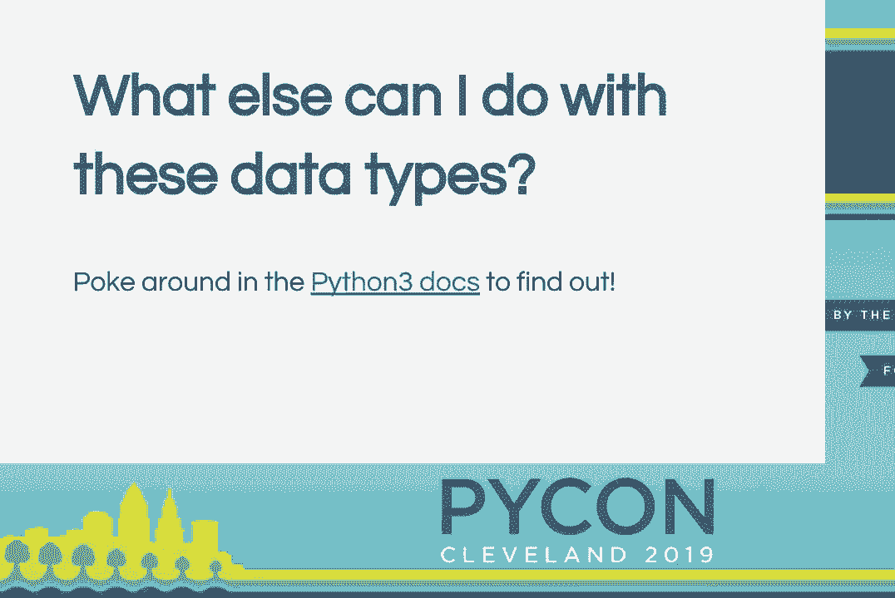

这是指向Python 3文档的链接。因此，基于我的经验，时间复杂度几乎在每个编码挑战的最后出现。像许多你们一样，我起初对此感到困惑。现在我觉得我好多了。但基本上，时间复杂度是指所需的时间。

算法在最坏情况下运行所需的时间与输入大小的关系。所以我想在这里，如果你需要的话。

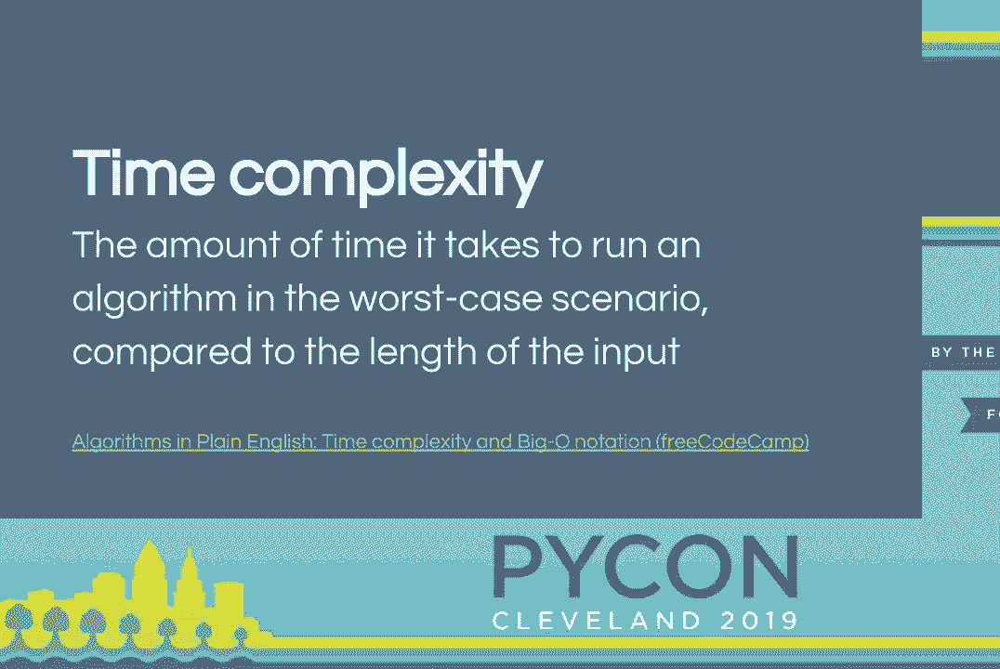

复习，这指向一个免费的编程营博客文章。大多数人可能见过这个展示各种时间复杂度的普遍图表。我想指出的是，这是一个对数尺度。因此，O(log n)是你在x轴上看到的红线。从这个图中提取的重要信息是。

越靠近y轴的线，越是你想避免接近y轴的运行时间。在我作为一个职业初期者的经历中，最常见的运行时间是这四种。当我为面试进行编码挑战时。

线性时间，即O(n)和O(n log n)，我们刚刚讨论过，这通常与二分搜索有关，还有O(n²)。所以我将有时间深入讲解这些的含义及其获取方式。但再说一次，如果你需要复习，请查看我在第一页提供的链接。实际上，还有几个其他的，所以了解这些会很好。

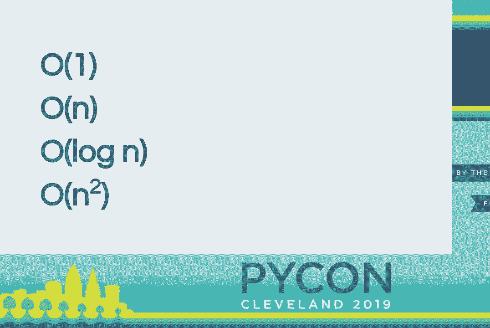

它们是如何工作的。但这些是我最常遇到的。好吧。递归。有多少人曾经害怕递归？递归本质上是一种优雅的方法，解决一个问题的解依赖于对该问题更小的发生的解。而递归，当你。

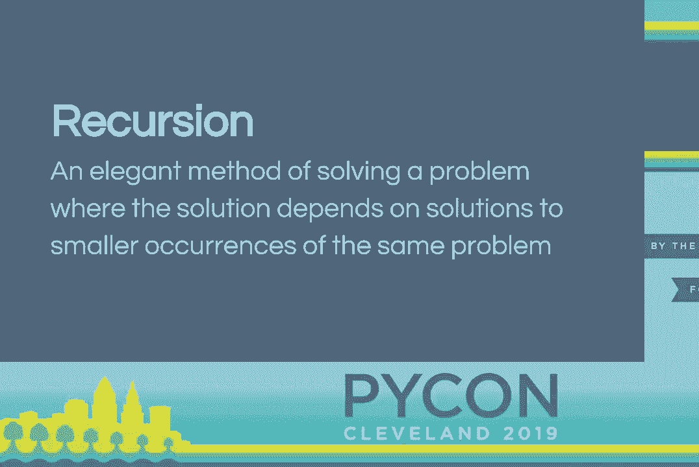

编写递归函数，它必须包含两个部分，基例和进展。基例的意思是，我怎么知道何时完成递归，或者我的函数如何知道何时可以停止调用自己。进展部分是不断减少问题，直到你回到基例。我在此发言。

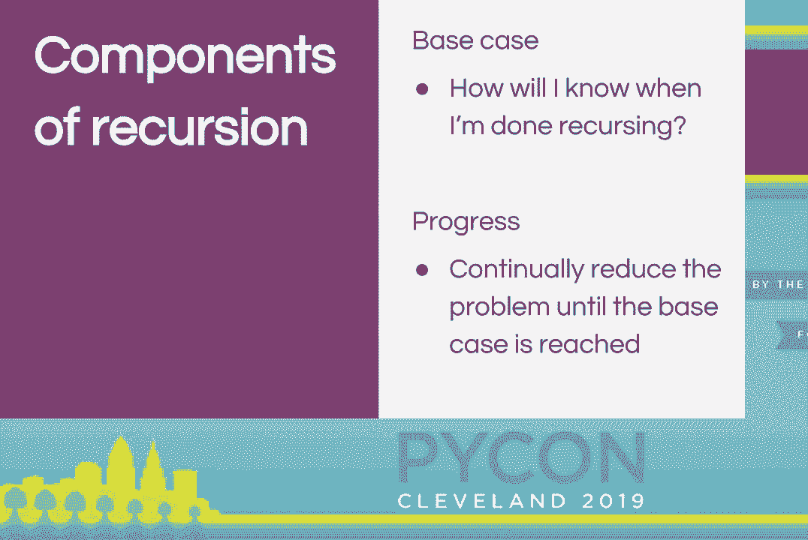

去年我在北湾Python上做了一个关于递归的精彩演讲。我希望三年前刚开始时我能听到或观看这个演讲。我真的，非常鼓励你去看。再次，你将获得这些幻灯片的bitly链接。我认为这大约是20或30分钟。他把它讲解得非常好。

也为**阿尔**的精彩演讲高五。

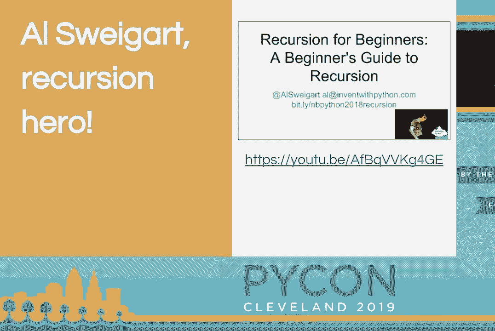

递归。面向对象编程在面试中经常出现，因为Python是一种面向对象的语言。类和对象在生产代码中无处不在，至少根据我的经验和我辅导的大多数人。我再次链接了一个外部资源。

这篇来自realpython.com。如果你需要OOP的复习，我强烈推荐查看。

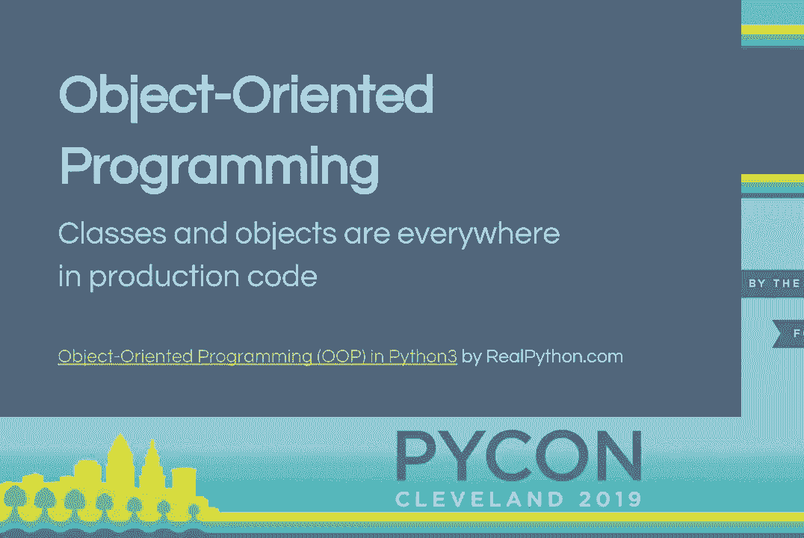

这个资源。真正从本质上讲，你需要了解如何定义类和属性，以及了解类属性和方法属性之间的区别。同样，了解类方法和实例方法之间的区别。如果在面试中提到OOP，你很可能会被问到，但为什么我们。

像OOP？你的答案应该包含这三个关键词。封装、继承和多态。再一次，我们不会在这里详细讨论，但我在开头提供的链接是一个很好的资源。

所以我真的非常推荐，了解如何谈论这三件事。数据结构和算法。有一本免费的书，在线名为《用Python解决问题的算法与数据结构》。我在接下来的幻灯片中缩短为piece ads up。这本书由**布拉德·米勒**和**大卫·兰南**撰写。我非常，非常。

强烈推荐，从现在开始几乎每一张幻灯片。我不会告诉你我已链接到幻灯片。此时你可以自己阅读。但我将在接下来的十分钟中展示的所有数据结构和算法，都在那本书中。因此虽然我们没有时间在这次演讲中逐步分析 Python 代码。

所有的 Python 代码都在这里。

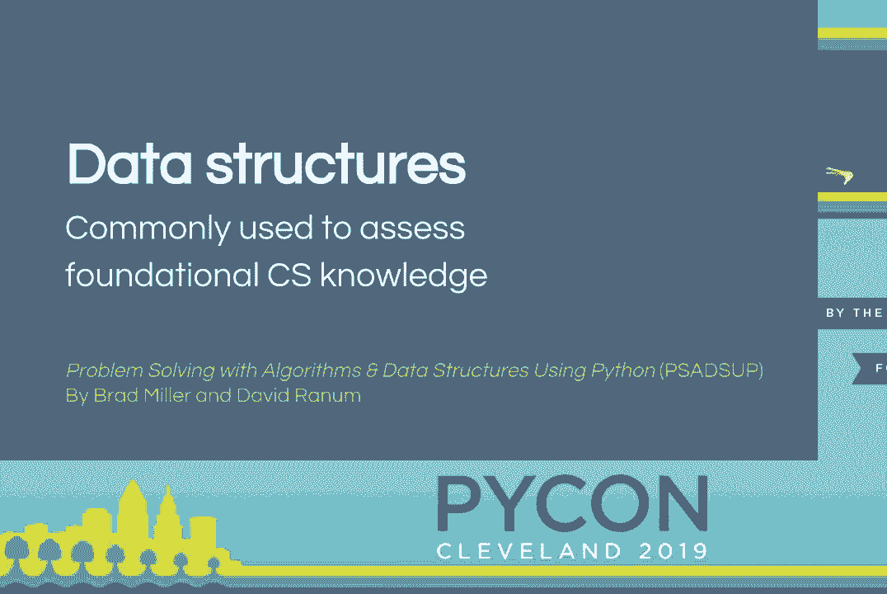

等待你的到来。所以我们先从线性开始。

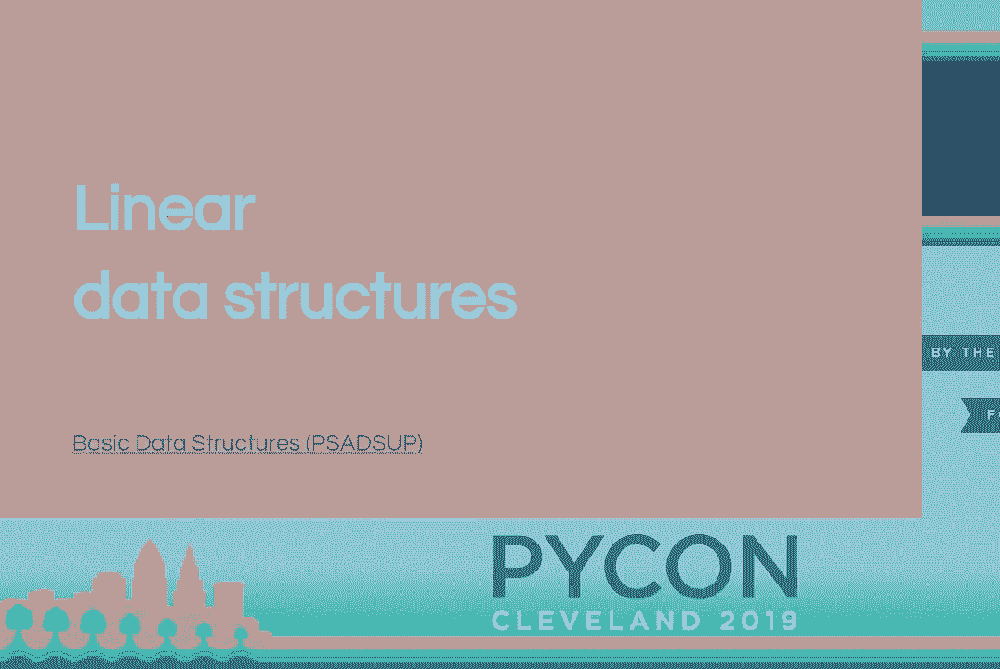

数据结构栈，你可以把它想象成一堆塑料。所以我们要进行栈的操作，我们要进行栈的操作，我们要进行栈的操作。我们要进行栈的操作，我们要进行栈的操作，我们要进行栈的操作。我们要进行栈的操作，我们要进行栈的操作，我们要进行栈的操作。

我们要进行栈的操作，我们要进行栈的操作，我们要进行栈的操作。我们要进行栈的操作，我们要进行栈的操作，我们要进行栈的操作。我们要进行栈的操作，我们要进行栈的操作，我们要进行栈的操作。我们要进行栈的操作，我们要进行栈的操作，我们要进行栈的操作。

我们要进行栈的操作，我们要进行栈的操作，我们要进行栈的操作。我们要进行栈的操作，我们要进行栈的操作，我们要进行栈的操作。我们要进行栈的操作，我们要进行栈的操作，我们要进行栈的操作。我们要进行栈的操作，我们要进行栈的操作，我们要进行栈的操作。

我们要进行栈的操作，我们要进行栈的操作，我们要进行栈的操作。我们要进行栈的操作，我们要进行栈的操作，我们要进行栈的操作。我们要进行栈的操作，我们要进行栈的操作，我们要进行栈的操作。我们要进行栈的操作，我们要进行栈的操作，我们要进行栈的操作。

我们要进行栈的操作，我们要进行栈的操作，我们要进行栈的操作。我们要进行栈的操作，我们要进行栈的操作，我们要进行栈的操作。我们要进行栈的操作，我们要进行栈的操作，我们要进行栈的操作。我们要进行栈的操作。

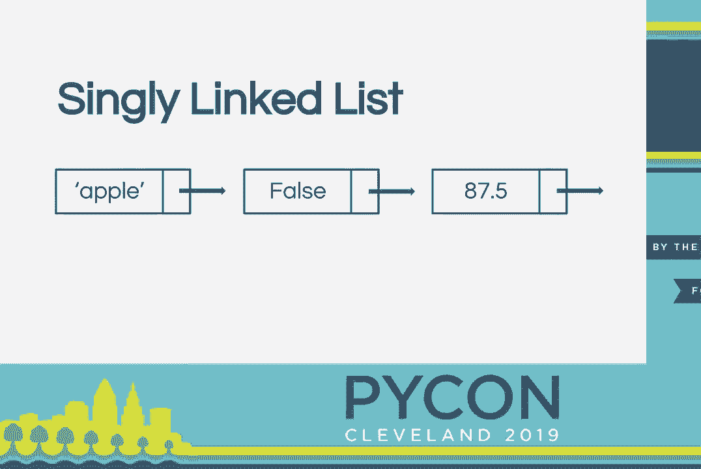

我们要进行栈的操作，我们要进行栈的操作，我们要进行栈的操作。我们要进行栈的操作，我们要进行栈的操作，我们要进行栈的操作。我们要进行栈的操作，我们要进行栈的操作，我们要进行栈的操作。我们要进行栈的操作。

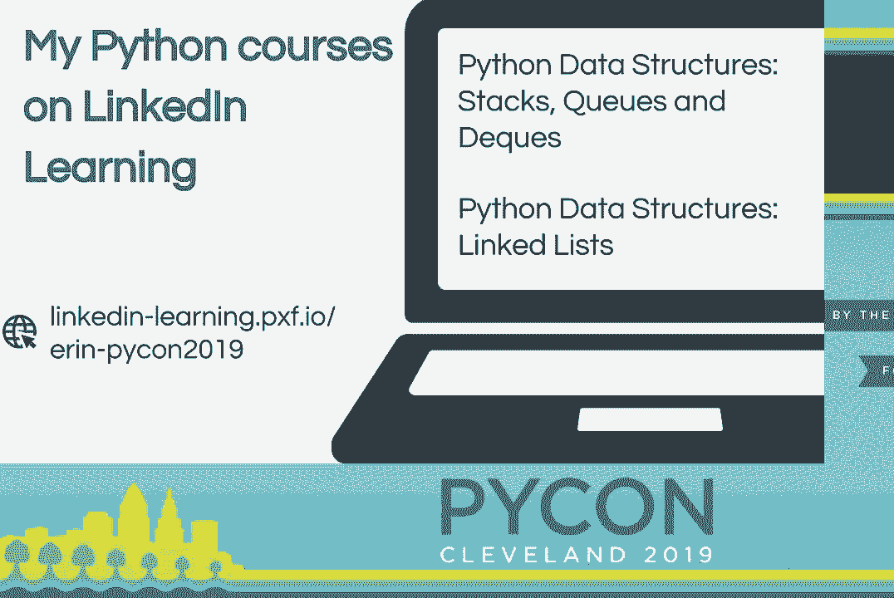

我们要进行栈的操作，我们要进行栈的操作。

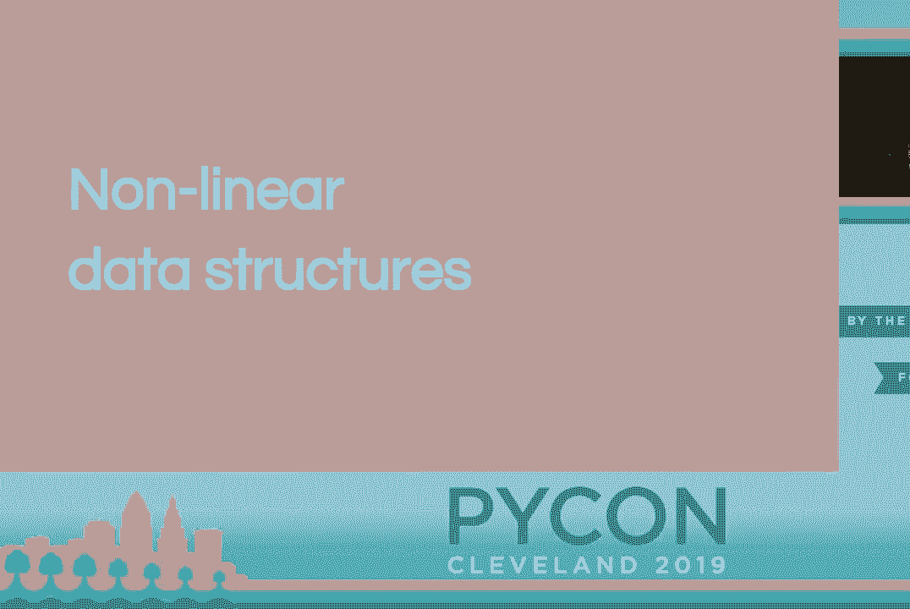

我们要来一个栈，我们要来一个栈，我们要来一个栈。我们要来一个栈，我们要来一个栈，我们要来一个栈。我们要来一个栈，我们要来一个栈，我们要来一个栈。我们要来一个栈，我们要来一个栈，我们要来一个栈。

我们要来一个栈，我们要来一个栈，我们要来一个栈。我们要来一个栈，我们要来一个栈，我们要来一个栈。我们要来一个栈，我们要来一个栈，我们要来一个栈。我们要来一个栈，我们要来一个栈，我们要来一个栈。

我们要来一个栈，我们要来一个栈，我们要来一个栈。我们要来一个栈。

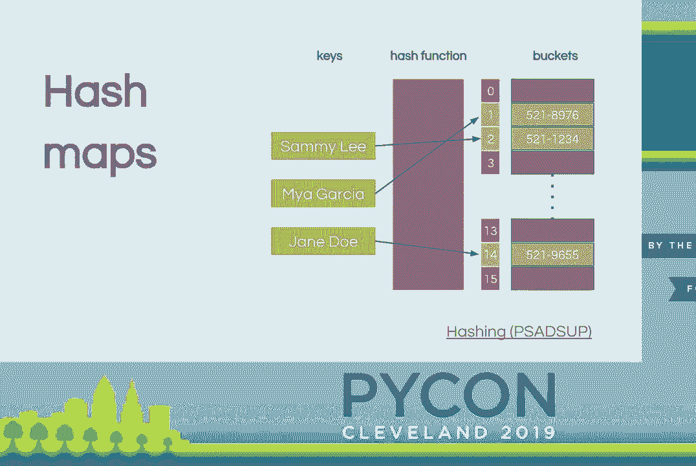

我们要来一个栈，我们要来一个栈，我们要来一个栈。我们要来一个栈，我们要来一个栈，我们要来一个栈。我们要来一个栈，我们要来一个栈，我们要来一个栈。我们要来一个栈，我们要来一个栈，我们要来一个栈。

我们要来一个栈，我们要来一个栈，我们要来一个栈。我们要来一个栈，我们要来一个栈，我们要来一个栈。

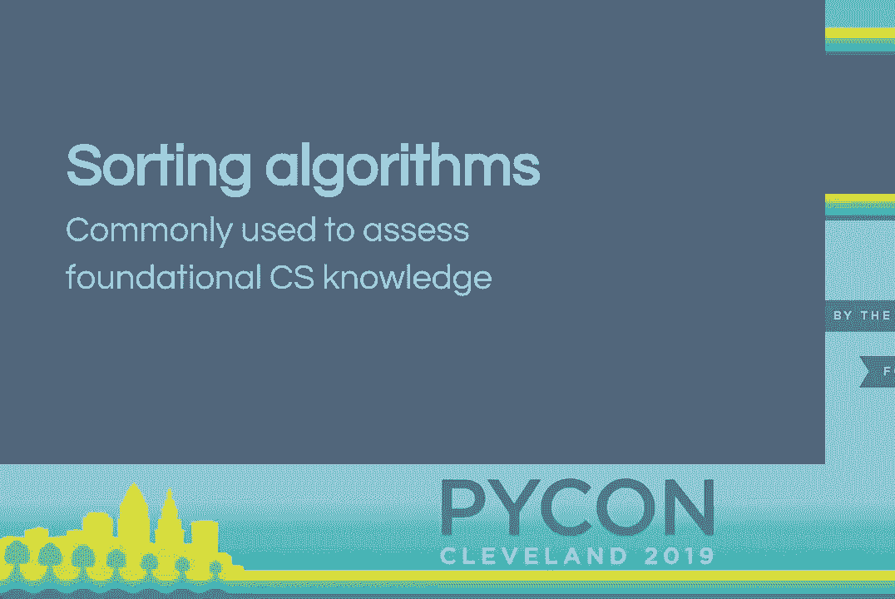

我们要来一个栈，我们要来一个栈，我们要来一个栈。我们要来一个栈，我们要来一个栈，我们要来一个栈。我们要来一个栈，我们要来一个栈，我们要来一个栈。我们要来一个栈，我们要来一个栈，我们要来一个栈。

我们要来一个栈，我们要来一个栈，我们要来一个栈。

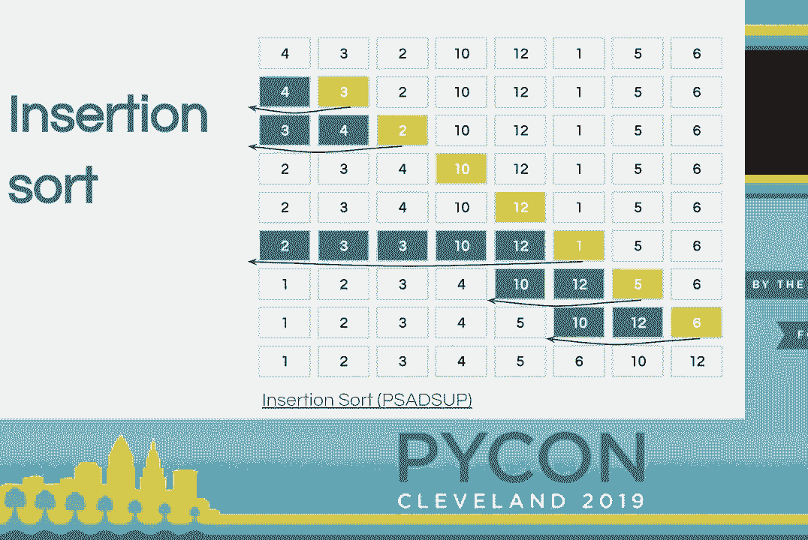

我们要来一个栈，我们要来一个栈，我们要来一个栈。我们要来一个栈，我们要来一个栈，我们要来一个栈。我们要来一个栈，我们要来一个栈，我们要来一个栈。我们要来一个栈，我们要来一个栈，我们要来一个栈。

我们要来一个栈。

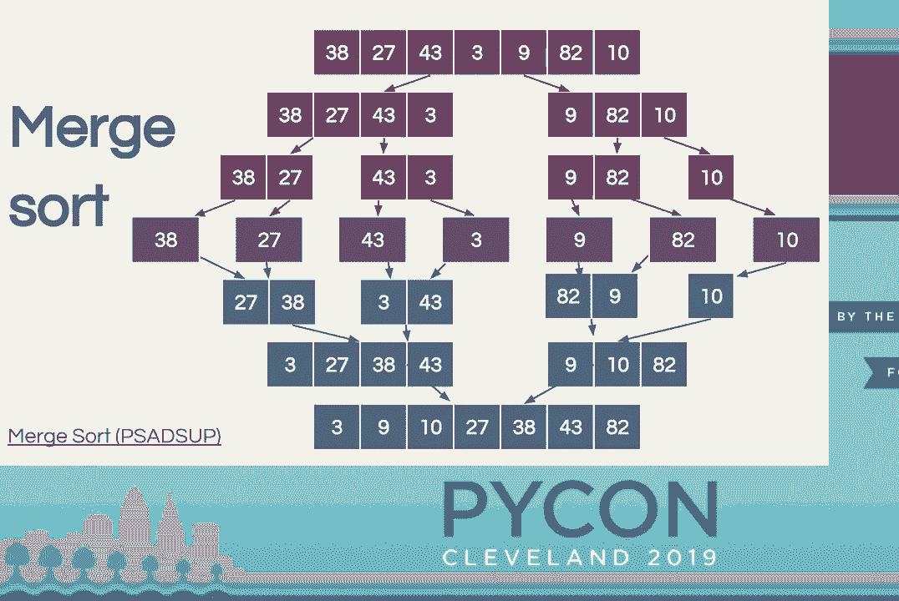

我们要来一个栈，我们要来一个栈，我们要来一个栈。我们要来一个栈，我们要来一个栈，我们要来一个栈。我们要来一个栈，我们要来一个栈，我们要来一个栈。我们要来一个栈。

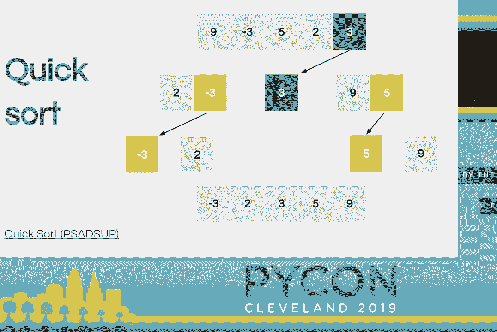

我们要拿一个堆栈，我们要拿一个堆栈，我们要拿一个堆栈。

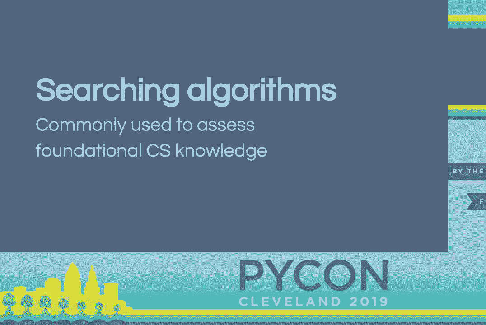

我们要拿一个堆栈，我们要拿一个堆栈，我们要拿一个堆栈。我们要拿一个堆栈，我们要拿一个堆栈，我们要拿一个堆栈。我们要拿一个堆栈，我们要拿一个堆栈，我们要拿一个堆栈。我们要拿一个堆栈，我们要拿一个堆栈，我们要拿一个堆栈。

我们要拿一个堆栈，我们要拿一个堆栈，我们要拿一个堆栈。我们要拿一个堆栈，我们要拿一个堆栈，我们要拿一个堆栈。我们要拿一个堆栈，我们要拿一个堆栈，我们要拿一个堆栈。我们要拿一个堆栈，我们要拿一个堆栈，我们要拿一个堆栈。

我们要拿一个堆栈，我们要拿一个堆栈，我们要拿一个堆栈。我们要拿一个堆栈，我们要拿一个堆栈，我们要拿一个堆栈。我们要拿一个堆栈，我们要拿一个堆栈，我们要拿一个堆栈。我们要拿一个堆栈，我们要拿一个堆栈，我们要拿一个堆栈。

我们要拿一个堆栈，我们要拿一个堆栈，我们要拿一个堆栈。我们要拿一个堆栈。

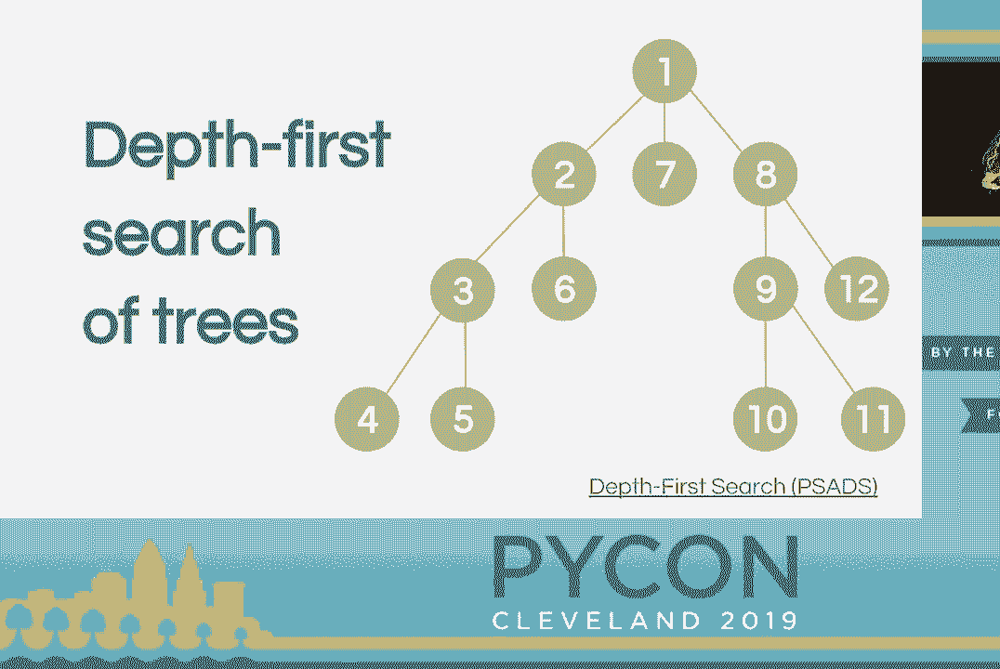

我们要拿一个堆栈，我们要拿一个堆栈，我们要拿一个堆栈。我们要拿一个堆栈，我们要拿一个堆栈，我们要拿一个堆栈。我们要拿一个堆栈，我们要拿一个堆栈，我们要拿一个堆栈。我们要拿一个堆栈，我们要拿一个堆栈，我们要拿一个堆栈。

我们要拿一个堆栈，我们要拿一个堆栈，我们要拿一个堆栈。

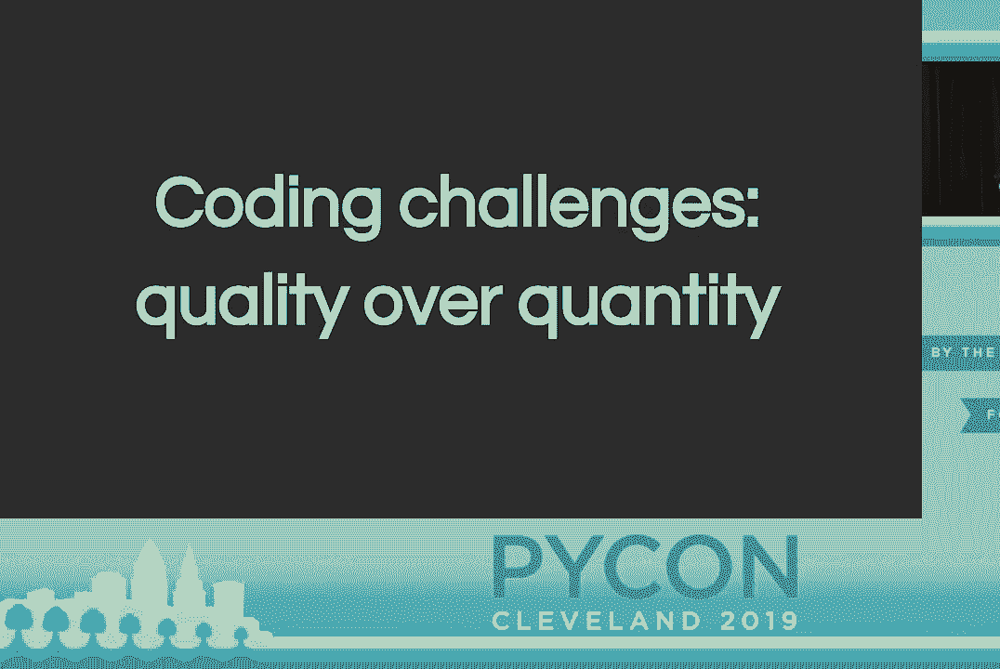

我们要拿一个堆栈，我们要拿一个堆栈，我们要拿一个堆栈。我们要拿一个堆栈，我们要拿一个堆栈，我们要拿一个堆栈。我们要拿一个堆栈，我们要拿一个堆栈。

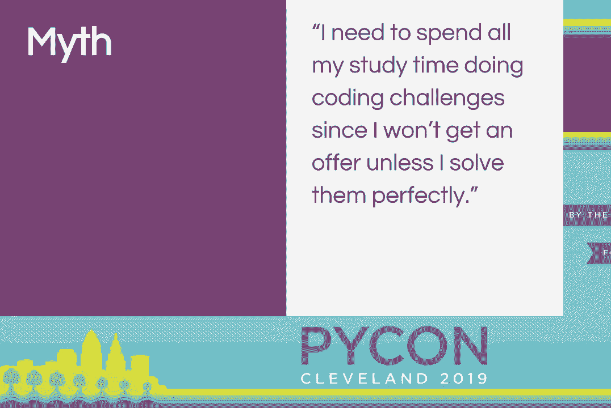

我们要拿一个堆栈，我们要拿一个堆栈，我们要拿一个堆栈。我们要拿一个堆栈，我们要拿一个堆栈，我们要拿一个堆栈。我们要拿一个堆栈，我们要拿一个堆栈，我们要拿一个堆栈。我们要拿一个堆栈，我们要拿一个堆栈，我们要拿一个堆栈。

我们将要取一个栈，我们将要取一个栈，我们将要取一个栈。 我们将要取一个栈，我们将要取一个栈，我们将要取一个栈。 我们将要取一个栈，我们将要取一个栈，我们将要取一个栈。 我们将要取一个栈，我们将要取一个栈，我们将要取一个栈。

我们将要取一个栈，我们将要取一个栈，我们将要取一个栈。 我们将要取一个栈，我们将要取一个栈，我们将要取一个栈。 我们将要取一个栈，我们将要取一个栈，我们将要取一个栈。 我们将要取一个栈，我们将要取一个栈，我们将要取一个栈。

我们将要取一个栈，我们将要取一个栈，我们将要取一个栈。 我们将要取一个栈。

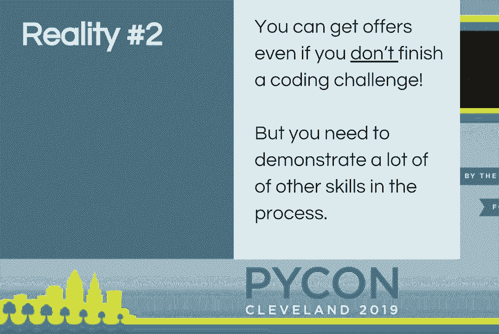

我们将要取一个栈，我们将要取一个栈，我们将要取一个栈。 我们将要取一个栈，我们将要取一个栈，我们将要取一个栈。 我们将要取一个栈，我们将要取一个栈，我们将要取一个栈。 我们将要取一个栈，我们将要取一个栈，我们将要取一个栈。

我们将要取一个栈，我们将要取一个栈，我们将要取一个栈。 我们将要取一个栈，我们将要取一个栈，我们将要取一个栈。 我们将要取一个栈，我们将要取一个栈，我们将要取一个栈。

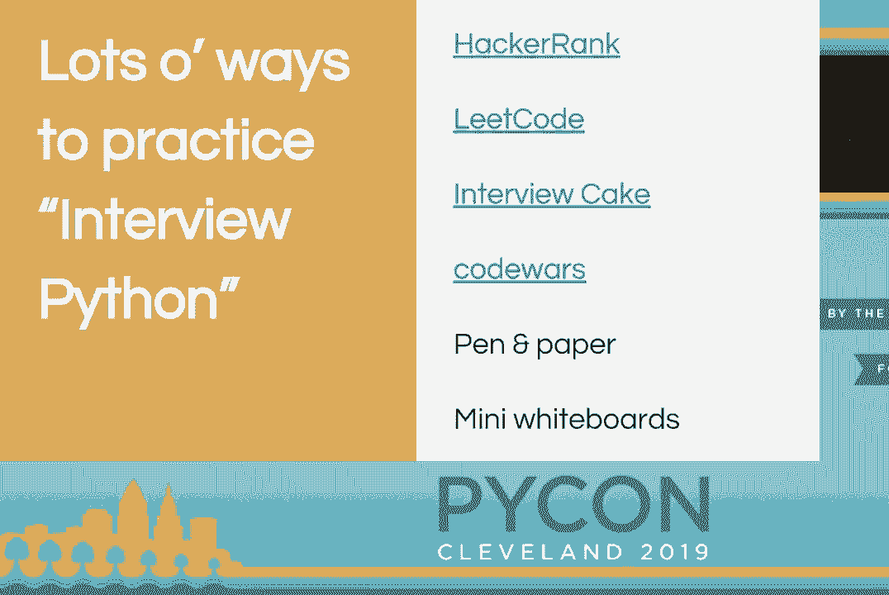

我们将要取一个栈，我们将要取一个栈，我们将要取一个栈。 我们将要取一个栈，我们将要取一个栈，我们将要取一个栈。 我们将要取一个栈，我们将要取一个栈，我们将要取一个栈。 我们将要取一个栈，我们将要取一个栈，我们将要取一个栈。

我们将要取一个栈，我们将要取一个栈，我们将要取一个栈。 我们将要取一个栈，我们将要取一个栈，我们将要取一个栈。 我们将要取一个栈，我们将要取一个栈，我们将要取一个栈。 我们将要取一个栈，我们将要取一个栈，我们将要取一个栈。

我们将要取一个栈。

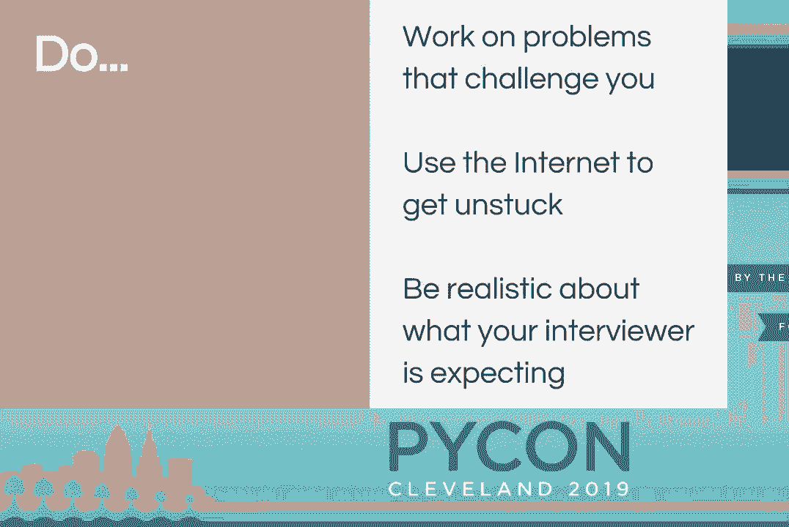

我们将要取一个栈，我们将要取一个栈，我们将要取一个栈。

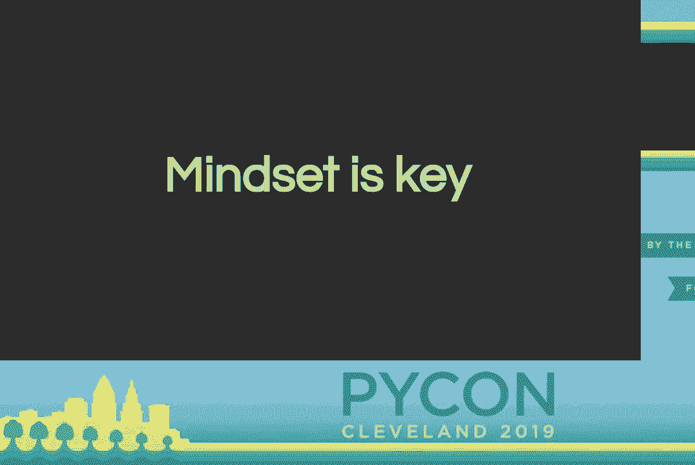

我们要进行多次尝试，我们要进行多次尝试，我们要进行多次尝试。我们要进行多次尝试，我们要进行多次尝试，我们要进行多次尝试。我们要进行多次尝试，我们要进行多次尝试，我们要进行多次尝试。我们要进行多次尝试，我们要进行多次尝试，我们要进行多次尝试。

我们要进行多次尝试，我们要进行多次尝试，我们要进行多次尝试。我们要进行多次尝试，我们要进行多次尝试，我们要进行多次尝试。我们要进行多次尝试，直到我最终得到一个工作邀请，所以我有点要扭转局面。

稍微思考一下，是的，因为这是过程的一部分。我鼓励你在准备好之前就去申请工作。尽可能多地进行电话筛选，失败并再次失败，然后将从这些失败中学到的知识运用到你的下一次面试中。

你的下一次面试，下一个，我喜欢这个，我是自己想出来的。每个公司都想雇佣你，如果每个公司都想雇佣你，感觉很好。也许对一小部分人来说，每个公司确实想雇佣他们。但大多数人不在这个范围内，你只需要一个公司想雇佣你。

为了获得一份新工作，并希望是合适的公司，但如果事实如此。你不需要自责，如果一家公司决定不继续与您合作。这只是意味着，出于某种原因，他们当时并不是合适的公司。

我想回到1942年的填字游戏。只是想提醒你，我们走过了很长一段路，而当想到学习数据结构和算法时，可能会感到非常压倒。但同时也要记得，要做一个好人。

归根结底，这些问题解决和识别模式的基本要素，以及保持好奇心。

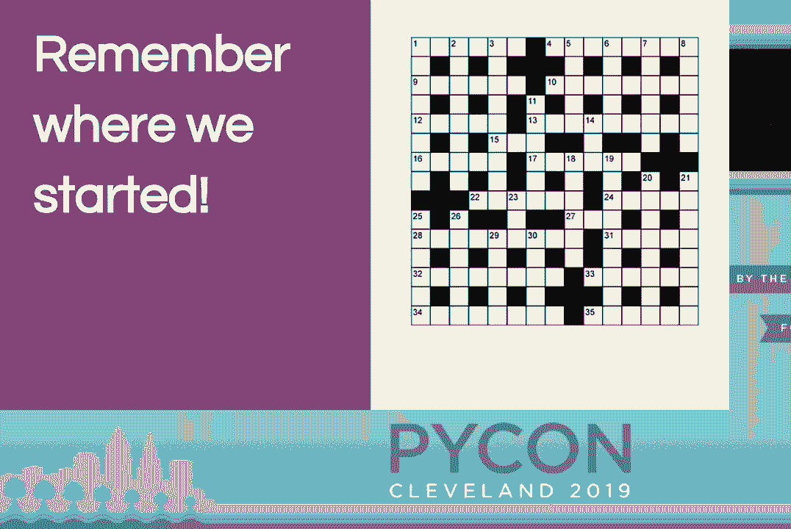

你也得到了这个，继续前进，面试，获得工作邀请，接受工作邀请，这里是我的电子邮件地址。如果你没有在开始时得到幻灯片链接，欢迎给我发邮件。我可以把链接发给你，随时联系并分享你可能取得的任何成功。再次感谢你的到来，我真的很感激， [鼓掌]。
