# P28：劳伦·谢弗 - 远程工作真的有效吗 - PyCon 2019 - leosan - BV1qt411g7JH

>> 嘿，大家好。

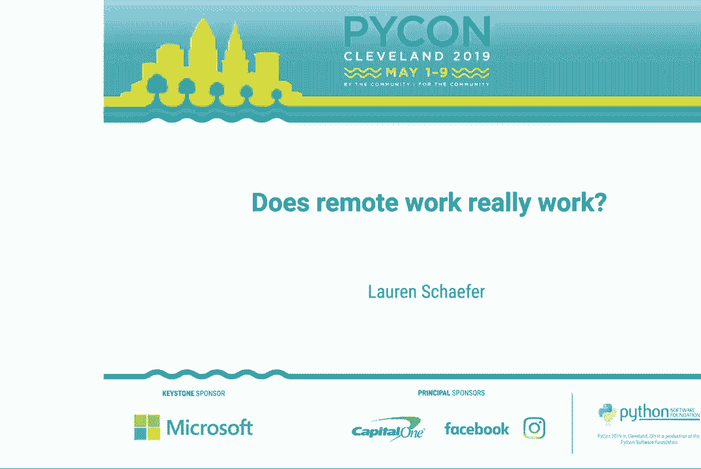

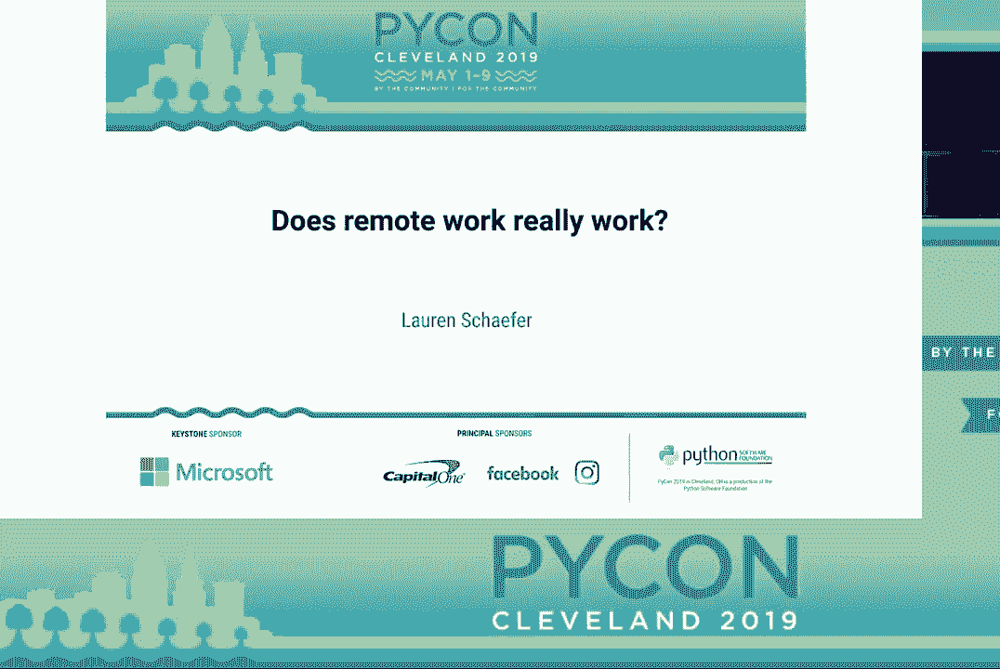

让我们开始吧。现在的演讲者是劳伦·谢弗，她的主题是远程工作真的有效吗？[掌声]。

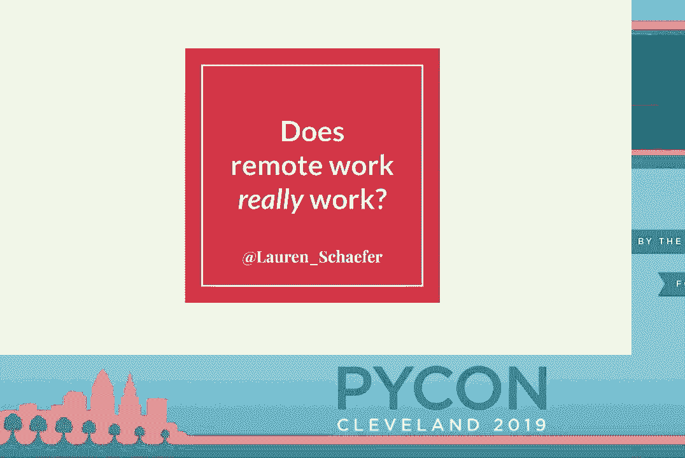

>> 嘿，欢迎大家。我想先请你们想一想你们曾经超级高效的一个时刻。我是说，你们处于最佳状态。也许你坐在办公室的桌子前，耳机戴着，工作做得特别好。我是说，代码从你的脑海直接流到你的指尖。

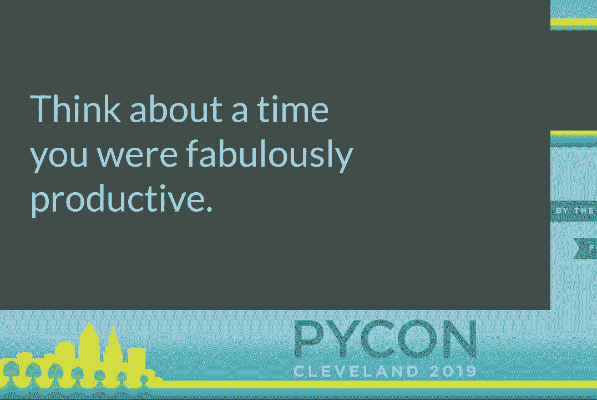

也许你感觉自己像个流行明星。然后你得到了令人恐惧的肩膀轻拍。有人说，我要让你结束。但首先，我得问你一个问题。也许这是个重要的问题，对吧？也许生产线上一切都崩溃了，而你是唯一能解决它的人。或者他们只是想讨论他们最新的《权力的游戏》剧集理论。我是说，像这样。

也许这其实并没有那么重要。无论如何，你回答了他们的问题。他们离开了，而你坐在那里，心想，什么？我刚才在哪儿？

我在做什么？也许你会试图重新进入状态。或者也许你还有 25 分钟就要开会，所以根本不值得努力再回到那个状态。你失去了大量的生产力。

这就是为什么开放式办公室空间可能是最糟糕的，对吧？你会受到那些突然的干扰。哦，是的，谢谢你。谢谢。我没有给他钱，虽然我很感激。对吧？

你会受到这些突然的干扰。你几乎没有任何隐私。这可能很困难。而且“立方体空间”也可能是最糟糕的。你有那种隐私的错觉，但你仍然得保持安静。如果你吵闹，人们会瞪你。这可能是个问题。现在，我是远程工作的坚定支持者。

在这次演讲中你会发现这一点。但公平地说，远程工作有时也可能是最糟糕的。我不知道你们是否记得，几年前，有个家伙在家里的办公室里接受了 BBC 的采访。你们记得吧？好吧，对于那些不记得的人，这就是发生的事情。

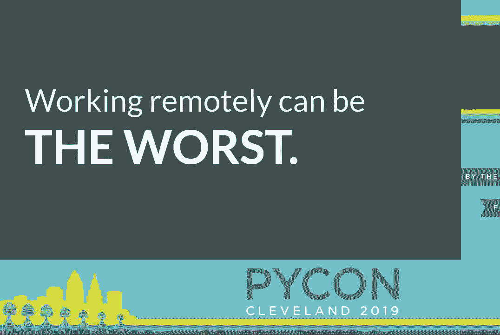

丑闻时常发生。问题是，民主国家如何应对这些丑闻？

这对更广泛的地区意味着什么？我想你的一个孩子刚刚走进来了。我是说，你认为与北方的关系会改变吗？

如果他们真的这样做，我会很惊讶。对不起。对不起。我的错。这是关于这个地区的什么？我是生物学家。北。抱歉。北朝鲜。南朝鲜对北朝鲜的政策选择在过去六个月中受到严重限制。每年。好的，那个妈妈有多伟大呢？好吧。

所以我想我们都可以同意，在那个特定的时刻，那家伙在远程工作方面失败了。对吧？所以今天我们要回答的问题是：远程工作真的有效吗？你们中有些人可能对此持怀疑态度。我是说，你们见过这样的影片，或许你们觉得人们不可能如此高效。

或者在远程工作时不够合作或创新。所以我们将对此进行研究，并看看研究结果如何。有些人可能对远程工作感兴趣，但你的公司没有远程工作政策，而你认为你的老板绝对不会让我远程工作。所以我们将讨论如何说服你的老板远程工作是一个不错的选择。最后，坐在这里的你们中有些人可能想尝试远程工作，或者你可能已经尝试过但失败了，或者你是想要远程工作的员工的经理。

但你不确定如何才能成功。所以我们将讨论一些非常实际的步骤，帮助你成为一名成功的远程员工。我的希望是，在会议结束时，你能为自己解答：远程工作真的有效吗？所以开始之前，我想和你分享我为什么选择远程工作的故事。

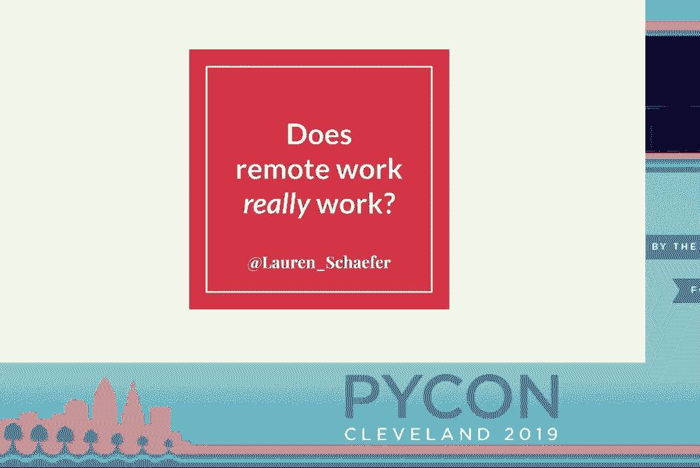

为了做到这一点，我们要回到 2008 年。

那是一个简单的时代。蒂娜·菲用她对萨拉·佩林的模仿逗乐了我们大家。我们都觉得 Rick Rowling 那种事太搞笑了。

而碧昂斯则鼓励男人给她戴上戒指。那年夏天，我当时的男朋友确实做到了。

他求婚了。我答应了，我们年轻、相爱，生活美好。我们决定想要结婚。显然，我们想要同居。问题是，我是计算机科学家，而他是核工程师。这显然不是问题，但最终确实成了问题。所以我们相处得还不错。

所以那年夏天我们进行了实习，生活很好。我们回来后，我和曾经实习过的 IBM 进行了面试。最后我收到了 IBM 的三个工作邀请，这真是一个令人羡慕的问题。没有任何抱怨。问题是，核工程的招聘周期要到第二年春天才开始。

核工程师的工作选择并不多。而他们少数的工作选择又集中在非常特定的城市。你必须生活在核电站所在的地方。因此，我发现自己处于一个尴尬的境地，最终不得不说。

我想和我的丈夫住在一起，对吧？但是我不知道他能在哪里找到工作。也许他能在我们以前住的罗利找到工作。我得到了这些工作邀请，但也许不会。所以我决定把我的卡片摊在桌面上，我给这些招聘经理打了电话，我说，你知道，我可以承诺在办公室工作一年。但之后呢。

我真的不知道。也许我能留在罗利。也许我会搬走。我有哪些选择？

你会让我在家工作吗？其中一个经理说，不，这不可能。另一个经理说，也许要看你的表现和团队领导的感受。而另一个经理说，是的，这根本不是问题。所以这是个很简单的决定。我不在乎技术。我不在乎团队。

我只想要一个能让我远程工作的经理。所以我接受了工作邀请。生活很好。我的未婚夫在马里兰得到了工作邀请。所以我们都为他感到非常兴奋，并意识到，好的，我们会让这件事成真的。

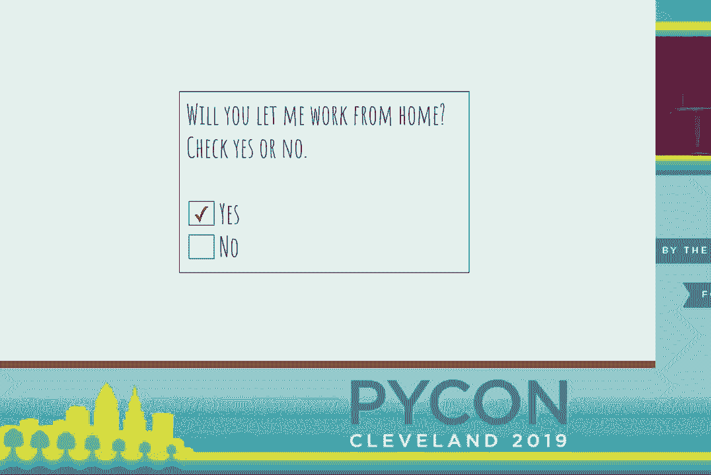

所以我们回到学校，获得了研究生学位。生活很好。然后我们分开了。所以我留在了罗利。我们并没有永远分开。我们只是物理上分开了。好的，你们在这里聊聊，看看你们的话是怎么说出来的。好的。所以我留在了罗利。他去了马里兰，我在办公室工作了一年。说实话。

办公室的环境不适合我。墙壁非常灰暗。感觉有点沉闷。我没有阳光。办公室里有一些人。有时我会跟他们交谈，有时则不会。如果我在走廊对朋友大喊，别人会用异样的眼光瞪着我。这种感觉很糟糕。所以，办公室的环境并不好。在经历了一年的办公室生活后。

我很期待能出去。所以我们结婚了。我们都很兴奋。我准备好远程工作了。但是前六个月，远程工作是最糟糕的。这对我来说真是一场挣扎。生活中有很多调整同时发生。我从与人共处的办公室，突然变成了几乎不见任何人。

我从有很多本地朋友变成了只有一对朋友。我从忙碌和兴奋的婚礼筹备中转变为生活中几乎没有重大事件。我的生活发生了巨大的变化，我对此并不太满意。在我远程工作时参与的前两个团队里。

我是少数远程员工之一，其他人都在同一地点。我们团队在瑞士，因此有很大的时区问题。我每周会和两个团队负责人见面一次，聊一个小时。这是我与他们的全部交流。我知道自己错过了很多对话。

我知道自己没有在产品最重要的部分工作。我处理的都是他们可以轻松隔离给我的事情。这很痛苦。我白天几乎不和人交流。当杰森回家时，我会喋喋不休。在我参与的另一个团队中。

我负责运行构建验证测试，负责构建、管理和运行它们。这是在 DevOps 成为常态之前。因此，我们有我们的夜间构建。我会在早上 6 点 30 分上班运行测试，希望能够成功。

我在团队 9 点上线之前就完成了任务。大多数日子生活很好。但你们知道，夜间构建并不总是通过，对吧？

所以在那些日子里，团队会不断修复它们，而我必须整天检查构建是否通过。在那些日子里，我会跳过健身房，只是不断查看。我发现自己感到精疲力竭，实际上对工作毫无热情。

我曾经梦想有一个孩子，这样就可以社会上接受地辞职。虽然不是很好，但经过六个月，我找到了成功的远程员工之道，远程工作变得很棒。随着时间推移，我的职业开始获得动能。我开始换团队，以便学习新技能和参与新项目。我开始在像这样的会议上发言。几年前，我在这里发言。

我参加了一个四位远程员工的同类聚会。一位 IBM 高管走到我面前说：“我认为你应该为 IBM 员工创建一个居家办公网络小组。”当时这让我有些害怕，但我还是去做了。

在我的领导下，团队最终壮大到 11,000 人。这是一个巨大的领导机会，否则我根本得不到。我甚至能够参加 IBM 企业服务团，在肯尼亚待了四周。为当地学校工作是如此酷的机会。

我开始获得职业动能，八年后在 IBM 担任软件工程师。我转到 SugarCRM，在那里担任开发者倡导者一年多。然后在去年 11 月，我转到 MongoDB，成为这里的开发者倡导者。我很喜欢这份工作。我自 2010 年以来一直在远程工作，不打算再回到办公室。

我真的很喜欢远程工作。所以你们可能想知道我是如何从最差转变为最好的。我们会深入探讨这个话题，谈谈如何成为成功的远程员工。但首先，我想谈谈你们。

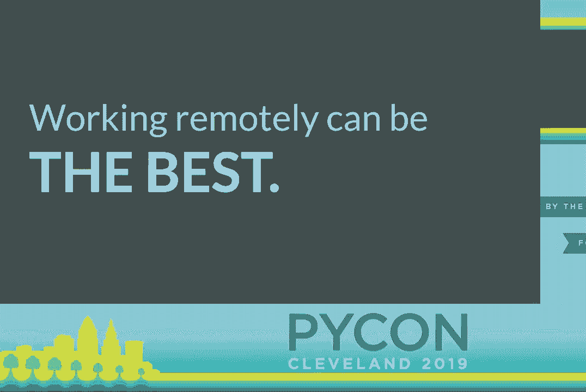

所以这里的你们中的一些人，可能想远程工作，或者你有朋友或同事在远程工作，或者你管理的人员想远程工作。我想谈谈这些动机是什么。人们为什么会想远程工作呢？

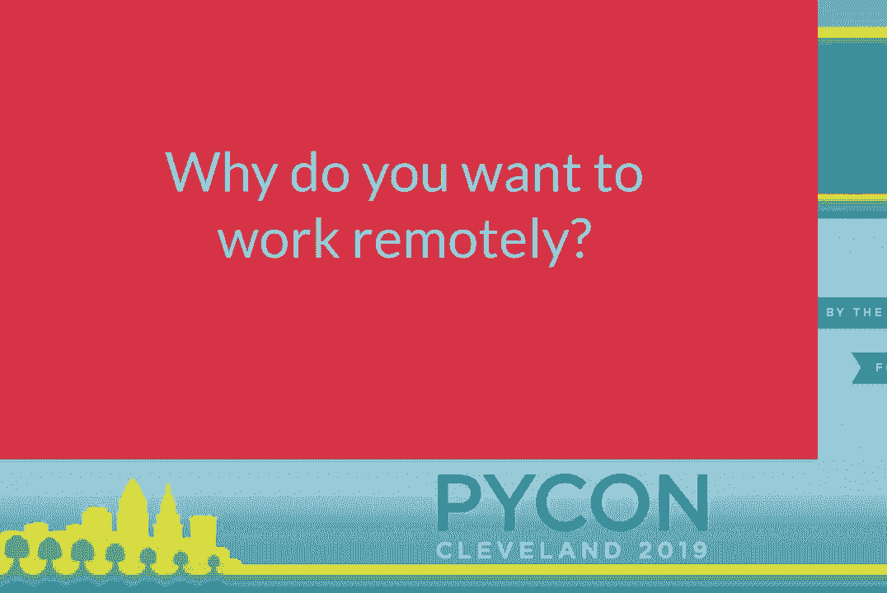

有些人像我一样可能因为配偶的工作而无法搬迁，或者他们只是不想让孩子从高中转学。有些人想要避免长时间的通勤。我是说，45 分钟到一个小时的堵车真的很糟糕。你不花在通勤上的时间就是可以用来陪伴家人、发展爱好或是睡觉的时间。

对吧？谁不需要更多的睡眠呢？所以有些人希望能在孩子或年迈的父母身边。他们并不一定需要亲自照顾他们，只需要在同一个地方，以防发生紧急情况。有些人像我一样觉得开放式办公环境非常令人分心。

而这个最后的理由是我最喜欢的。我认识的人中，有些人实际上出租或出售了他们的房子，边旅行边继续赚取全职薪水。现在实际上有一些项目可以促进这一点。你可以报名参加为期六个月或一年的项目，并继续保持同样的工作，但该项目会为你处理所有的旅行安排。

所以他们会处理你的住宿、交通，甚至你在那里的活动。这样你就可以继续工作，保持你那份出色的工作，同时体验这个世界。这太酷了。所以这就是一些员工想要远程工作的原因。

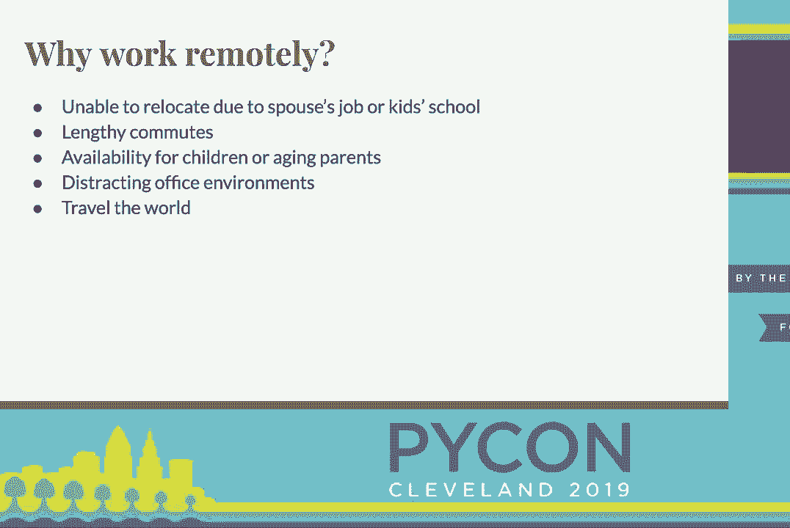

但雇主为什么想要提供这些选项呢，对吧？

似乎如果你每天都能亲眼看到员工，管理起来会更容易。我这里有几个原因，会快速讲过。

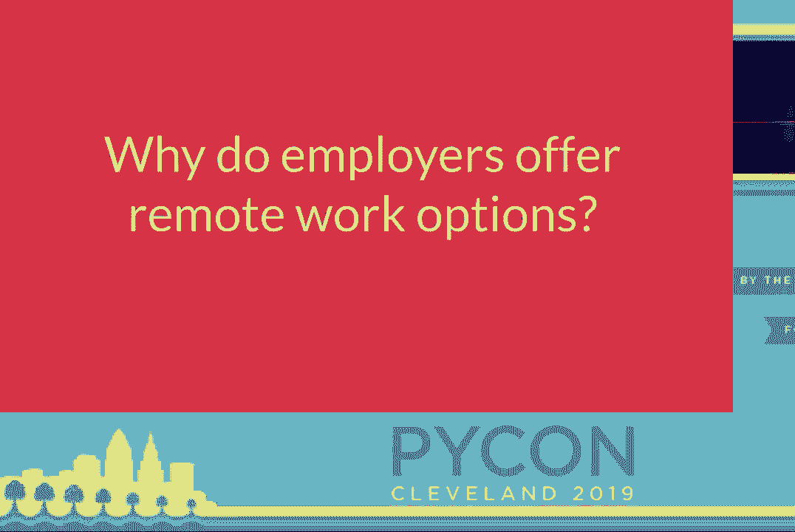

其中一个最大的原因是，你可以从世界任何地方吸引和留住顶尖人才。如果你试图让人们来你的办公室，局限于一个地方或几个地方，你的人才库就很有限，对吧？你必须找到那些已经住在那里或愿意搬去的人。但当你向全球人才库开放时，你有了更多的选择。

你可以提高员工的士气。员工喜欢有选择工作地点的选项。你还可以节省开支，对吧？雇主们喜欢省钱。所以你可以减少或不需要办公空间。你也不必支付搬迁员工的费用。最后，你可以提高员工的生产力。这可能看起来有点违反直觉。我们稍后会讨论相关研究。

但这里有几个原因。首先，你的病假天数更少。如果你感觉不太好，走到自己的家庭办公室要比打扮好去办公室容易得多。坦白说，今年我得过粉红眼，不是一两次，而是三次。因为我不用担心传染给其他人，所以我没有缺任何工作日。

远程员工休息时间较短。我们不会被旁边的闲聊分散注意力。干扰也少得多。

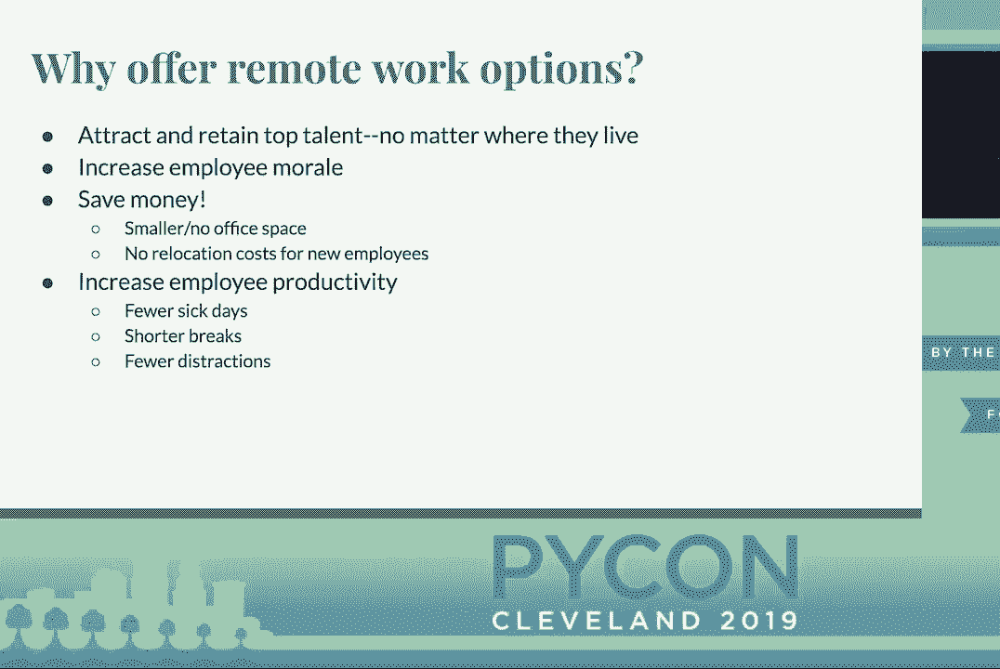

好吧，你们中的一些人可能在想，这听起来不错。我知道我正在和一群工程师交谈，而你们可能想，好的，来看数据。研究说了什么？我为你们准备好了。好的，我们将从 2019 年的 Stack Overflow 开发者调查开始。

我猜你们中的许多人已经填写了问卷。如果你不熟悉，这是由管理 Stack Overflow 的人发起的一项调查。他们试图从世界各地的开发者中挑选出多样化的样本。他们问了很多问题，比如你喜欢哪些语言？

你最想使用什么数据库？答案是 MongoDB。好的，我得把这个放进来。他们询问了很多工作场所的选项。让我们突出一些这些工作场所的问题。

首先，他们问开发者想在哪里工作？好吧，大约 60%的开发者想在办公室工作。但大约 40%的人想在家或其他地方工作，比如共享办公空间或咖啡馆。因此，有相当大一部分开发者希望有远程工作的选择。接下来。

他们问开发者，你希望多长时间远程工作一次？在顶部，我们看到几乎从未远程工作的人的数据。在中间是偶尔，最下面是全职远程工作。因此，你可以看到，在顶部，有 43%的开发者从未能远程工作。

在底部，我们看到有 12%的人能够全职远程工作。他们提出的一个有趣的统计数据是，全职远程工作的开发者，平均拥有比那些从未远程工作的人多出约 60%的专业编码经验。所以我们可以猜测原因，如果你拥有更多的编码经验。

你可能拥有更多的杠杆，或者你与团队之间建立了更多的信任。因此，无论是什么原因，经验越丰富，能够远程工作的可能性就越大。接下来我要回答的最后一个问题来自这项调查。他们要求开发者识别出生产力的三个最大挑战。

每个人可以选择三个。我将为你突出两个。在顶部，41%的开发人员认为，生产力最大的挑战是分心的工作环境。我想你们都体验过。我知道你们经历过。我们讨论过开放式办公室是最糟糕的，对吧？太糟糕了。

然后我们看到通勤时间在底部。夏季模式的员工确实会通勤，但这可以通过远程工作完全消除。好吧，让我们深入研究一项研究。2014 年，经济学季刊发布了一项研究。这是一篇期刊论文，通常比会议论文更高。

这是一个很受欢迎的同行评审研究。研究人员与携程合作，携程是一家有 16,000 名员工的中国旅行社。他们关注的是呼叫中心员工。他们问：“你们谁想远程工作？”对于那些说是的人，他们将其分为两组。

他们说，半数员工必须留在办公室，半数可以在家工作。这个研究的伟大之处在于这是一个实际的对照研究，对吧？

每个人都有相同的动机，所有参与者都希望远程工作。因此，我们能清楚地看到他们发现的结果与工作地点相关。结果显示，居家员工的表现提高了 13%。这很不错，对吧？那是为什么呢？其中 9%来自于每班工作的时间更多。

如果你像我一样，可能会想，“好吧，班次是固定的时间。你如何能在每班工作中多花时间？”他们说远程员工休息和请病假的时间更少。我们谈到过这一点，对吧？他们实际上坐在那儿，作为远程员工，他们获得了更多的工作时间。

在这 13%中，另外 4%来自于每分钟接听更多电话。这些是呼叫中心员工。能够听清楚对方是非常重要的。因此，他们有一个更安静的工作环境，更有利于完成工作。他们发现这带来了显著的提高，也发现了统计学上的显著性。

在居家员工中工作满意度更高。这很好，对吧？快乐的员工，快乐的生活。与此相关，他们发现居家员工的流失率降低了 50%。这非常重要，流失是一个大问题。当人们离开时，他们带走了部落知识，招聘和雇佣新员工要花钱。

如果你能将流失率降低 50%，那是巨大的成本节约。他们发现的一个缺点是，在绩效条件下，居家员工的晋升率降低了 50%。所以居家员工晋升得不够快。那是为什么呢？

他们提出了三个主要原因。首先，老生常谈，眼不见为净。你不会被考虑晋升。其次，在工程领域，我们通常有个人贡献者一、个人贡献者二，你可以这样逐步晋升。但在这里并非如此。

如果你是一个呼叫中心员工，并且想要晋升，甚至被提升为团队负责人或管理职位。那么他们指出，在家工作的员工缺乏发展人际交往技能的机会，而这对晋升至关重要。他们还发现晋升。

由于需要返回办公室，许多在家工作的员工可能对晋升并不感兴趣，因此他们可能没有积极争取晋升。好吧，这是最后一个统计数据。这是一个非常酷的数据。我提到过，他们一开始有 13%的表现提升。

所以九个月后，他们说：“是的，这行得通。我们将允许人们在任何地方工作。”一些在家工作的员工回到了办公室，一些办公室员工决定在家工作。他们在三个月后再次测量生产力。他们发现允许员工选择工作地点后，表现提升了 22%。22%。这相当于仅通过给人们选择工作地点的权利而增加了一个工作日。这太惊人了。好吧，我还有几项研究要更快地介绍。

所以在 2009 年，思科进行了远程工作者调查，让员工在家工作一年。这是他们发现的。他们发现生产力、工作生活灵活性和工作满意度显著提高。这对员工来说非常棒。他们发现生产力节省了 2.77 亿美元。这对公司也很棒。

他们发现，由于远程工作，$47,320 公吨的温室气体排放在一年内没有释放。这对环境非常好。如果你每天不通勤，你就大幅减少了自己的碳足迹。好吧，再谈一项关于倡导远程工作的研究。

一些研究人员聚在一起，做了文献综述。他们说：“让我们看看所有远程工作研究，看看我们能发现什么。”所以他们审查了 46 项研究，跨度 20 年。

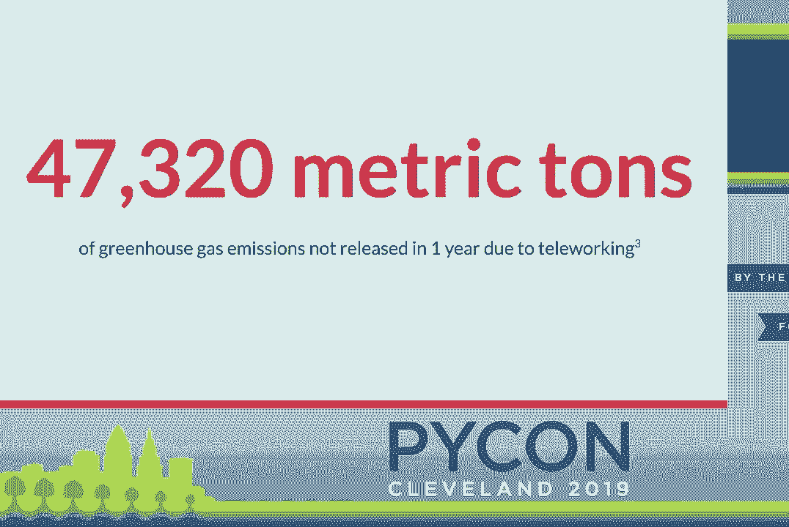

我知道你不该阅读幻灯片，但我会读，因为我喜欢他们在论文中写的内容。开始吧。远程工作有明显的好处。对感知自主权、工作与家庭冲突、工作满意度、表现和离职意图有小但有利的影响。

这是我们一直在讨论的流失率和压力。与学术界和实践文献中的预期相反，远程办公在工作关系质量或职业前景的感知上也没有直接的负面影响。因此这太惊人了，对吧？

这就是我们一直在谈论的。所以他们发现这对员工很好，对吧？

这对工作满意度很有帮助。这对公司也很好，对吧？

你没有降低员工流失意图。然后我喜欢的是，他们说，“你知道吗？

与我们所想的相反，我们实际上没有发现职业前景的问题。“所以我们在第一次呼叫中心研究中看到这一点，但当他们在 20 年内审查研究时，他们没有发现这是个问题。这太棒了。现在你们中的一些人可能在想，“好吧，她支持远程工作。

她只是向我们展示了好的东西。

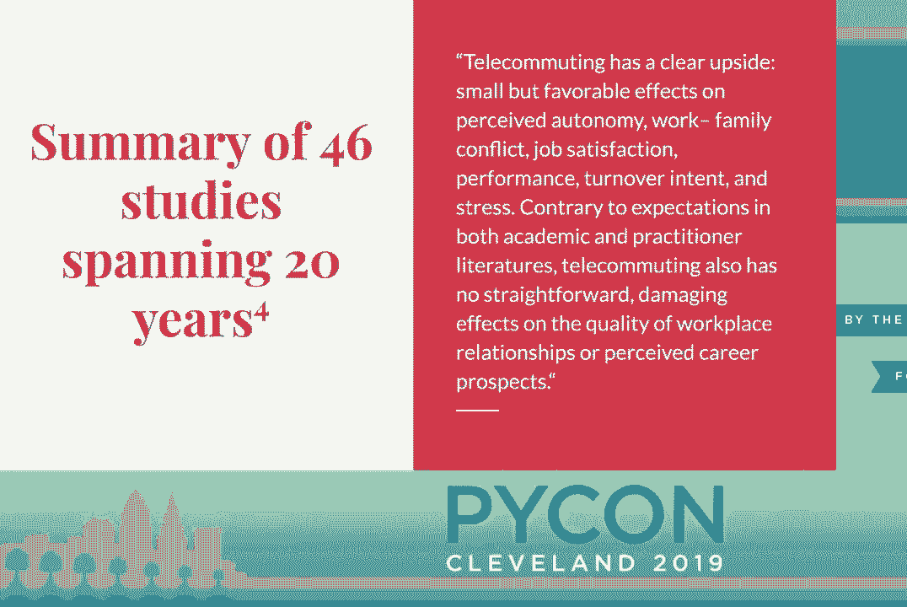

好吧。那么根据研究，我将向你展示一些远程工作的缺点。首先，专业孤立对工作表现产生负面影响。是的，这是真的，对吧？但无论你是远程工作还是在办公室工作，这都是如此。你需要确保你没有专业孤立。

你必须非常主动地与同事沟通，与你上面和下面的人沟通，这样你才能做好工作。另一项研究说：“也许我工作的地点并不重要。也许我经理工作的地点更重要。”因此，他们发现拥有一个远程经理实际上可能会对你产生负面影响。

我认为这有点相关，对吧？所以如果你的经理在专业上孤立，那也会影响到你。因此，你需要确保你的经理非常关注正在发生的事情，并会为你辩护。好吧，第三个。远程员工、同事的职业停滞、孤立、干扰，以及工作与家庭生活之间模糊的界限。这是真的。这些是我曾经害怕的事情。

但我在担任远程员工近八年，几乎九年的经验是，你可以积极地努力去对抗这些。这些不是我现在仍然害怕的事情。这些是我努力改进的事情，我的职业生涯也在持续发展。最后，这一点让人有些惊讶。远程工作鼓励员工过度工作，并让他们的工作侵占家庭角色。

所以很多人认为，“好吧，如果你在家工作，那就是在偷懒。”实际上并非如此。远程工作的员工通常非常担心会给人留下这样的印象。因此我们每次都要表现出色。我们准备好了。如果我们在一个冲刺会议上，我们会谈论我们正在做什么，对吧？我们确保我们完成了自己的部分。

过度工作也很容易，对吧？比如你的工作快结束了，而你有一个 bug。你会想，“哦，我就坐在这里解决这个问题。”三小时后，你还在工作。或者如果你的伴侣晚上外出，你会想，“好吧，我的工作有点落后。”然后你花额外五个小时在工作上，对吧？

所以远程员工必须积极防止疲惫。

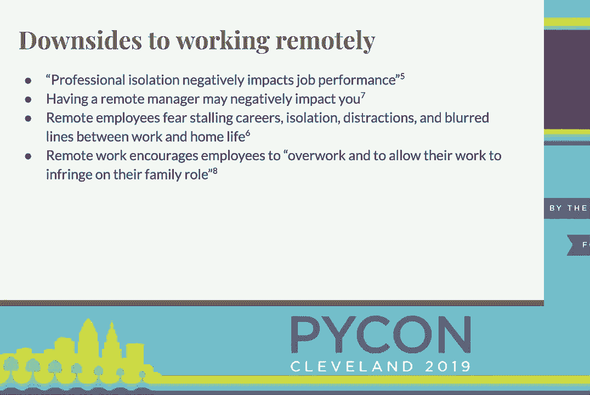

好的，我们现在到哪里了？我们一直在讨论“远程工作真的有效吗？”这个问题。

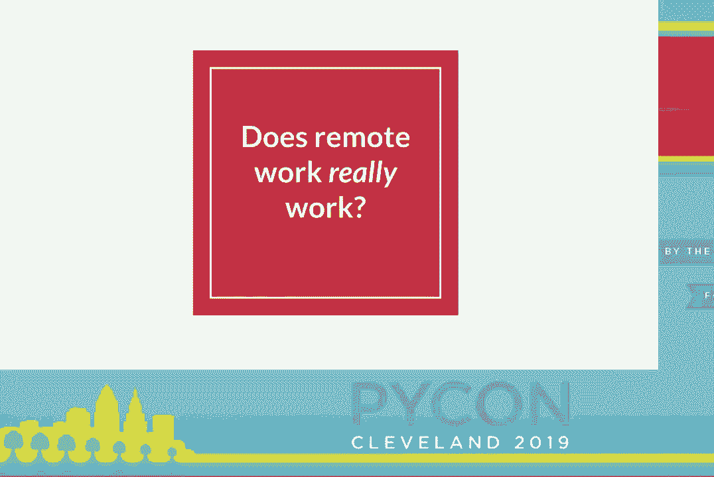

是的，对吧？我们的研究都表明，远程工作对员工有效。它对生产力很好。对工作满意度也很好。它对公司有益，对吧？生产力带来更多利润。对环境也很好，对吧？如果你每天不通勤，你就会大幅减少你的碳足迹。好吧，希望我说服了你，对吧？

我已经说服你远程工作很棒。而你们中的一些人会说，“好的，但现在我得说服我的老板。我们该怎么做呢？”

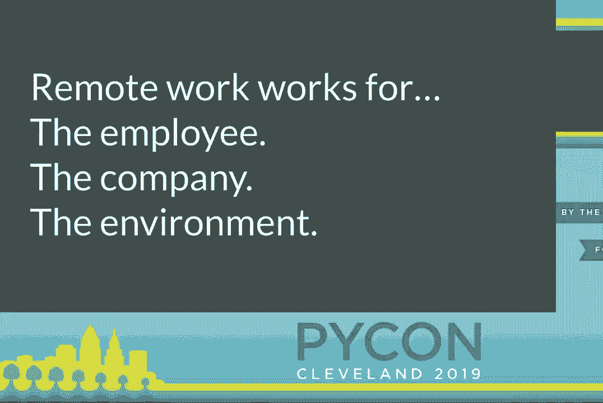

我们该如何说服你的老板让你远程工作？”所以有一本很棒的书叫做《不需要远程办公室》。他们建议提议一个实验。去找你的老板，解释你想远程工作的原因。也许这很重要。

就像你的岳母刚搬进来，她在衰老，你需要照顾她。或者可能是一些轻松有趣的事情，比如你想能够环游世界。诚实地解释你为什么想远程工作，并提议一个实验。比如接下来的三个月。

你将全职在家工作。或者你每周在家工作两天。或者你只是下午在家工作。但谈谈你认为实验应该是什么，然后讨论你将如何评估结果，对吧？因为你需要知道。

明确地说，是或否，这个实验是否通过或失败。然后向所有团队成员提议这个实验。所以你在进行公平的操作，对吧？

你想成为那个在大家都被困在办公室时仍能远程工作的孩子。因此，一些经理会说，“好的，没问题。这很合理。你很冷静。我明白了。”但有些经理会问，“合作怎么办？水冷器的对话怎么办？”

你将如何复制这个？”，好吧，有些人用像 Slack 这样的工具来复制。我的公司在 Slack 中有一个实际的水冷器频道。你会看到人们，即使他们坐在彼此旁边的桌子旁，也会在水冷器频道中输入信息，对吧？所以你可以在网上重现这一点。

但对于很多人来说，远程协作或创新的想法真的很难推广。他们不关心数据。他们不关心生产力。他们有一种直觉，觉得这根本行不通。所以我又要提到那本书，《远程办公室不必要》。

他们会问你停下来思考，“你的团队能够同时处理和实施多少个极具创新的想法？”

“，认真想一想。你能实施多少个项目？也许两个，也许三个。所以建议大家每隔几个月聚在一起，可能每季度一次。进行极具创新性的头脑风暴。把大家聚在一起，分享想法。然后分散到各自的远程地点，完成工作。对吧？因为我们看到，当你允许人们远程工作时，他们的生产力会提高。

当所有其他方法都失败时，谈谈**底线**。谈谈你如何能为公司节省办公室的开支。谈谈公司如何能够在不支付搬迁费用的情况下，从世界各地聘用顶尖人才。谈谈你如何能降低员工流失率。但要注意，不要以威胁的方式进行，比如说你要辞职，因为没人喜欢那样。要谈谈降低的员工流失率。

最后，谈谈生产力的提升。对吧？这将带来更多的利润。好的，我说服你了。你也说服了你的老板。现在你需要成功。你究竟如何才能在远程工作中取得成功？对吧？

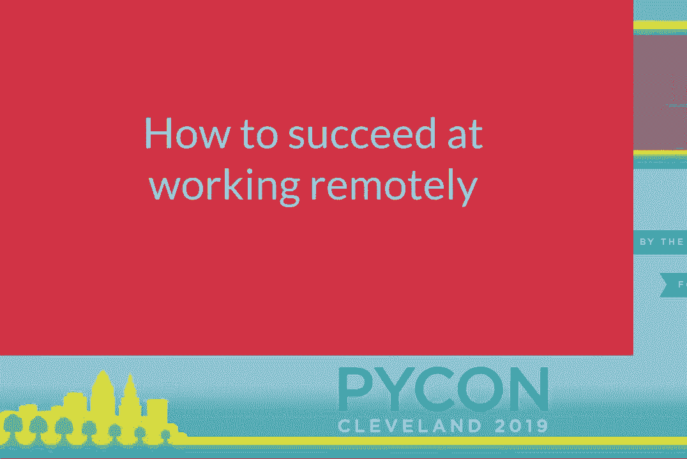

因为你不想像这个家伙一样失败。你不想成为那样的人。你想成为远程工作的流行明星，对吧？好的。我给你五个建议。第五个，加入合适的团队。如果可能的话，我强烈建议你加入一个完全分布式的团队。好的，为什么呢？好吧，想象一下场景。某人遇到一个问题。

他们坐在桌子旁，搞不清楚发生了什么。他们在努力调试。所以他们走向同事，进行交流。他们说，“哦，你知道吗？

我想萨莉上周刚解决了那个问题。我们来聊聊吧。“所以他们把萨莉叫过来，然后他们一起去白板上画出解决方案。他们解决了这个问题。每个人都回到自己的办公桌，实施它。他们可能完全忘记告诉你那次对话发生过。

我的经验是，分布式团队对这种情况的意识要强得多。首先，他们会安排时间开会，并让每个人都参与进来。如果他们忘记了，如果这确实是一场偶然的对话，他们会告知团队。因此，分布式团队，完全分布式团队更容易合作。此外，还要考虑沟通风格。

现在很多团队都在使用视频聊天，这样更容易看到彼此的面孔。但作为一名远程员工，你必须非常主动。你必须舒适地表达自己的感受，说明何时遇到困难，何时不同意，因为人们无法从你的面部表情中判断。

因此，考虑团队的沟通风格，确保你能舒适地与这些个性合作。最后，这可能会让人感到有些尴尬，但当你找到合适的团队时，我强烈建议你与每位团队成员安排一对一的交流。我多年前有位导师向我建议过这个，起初确实有些尴尬，但效果很好。

安排 15 分钟的一对一交流。打电话说：“嗨，我叫 Lauren。这是我的角色。我很兴奋能加入这个团队。这是我一些工作经历。”然后请他们也做同样的事情。接着分享一张你的照片，也许是和家人一起的，或者是你在某个爱好中的，或者是度假时的。很有可能你不需要再问。

很有可能，他们会回传一张照片。在那一刻，你打破了隔阂。事情变得更加个人化。向他们寻求帮助变得更容易，他们与你沟通也更轻松，因为你变成了一个真实的人。好吧，第五，加入合适的团队。确保它是分散的，确保你能舒适地与这些人交谈。第四。

要高效。做好你的工作。好吧，这显而易见，对吧？那么，你打算如何做到呢？

每天，我强烈建议你设定每日目标。你知道，每天我都会查看我的待办事项列表，然后问自己：“今天我需要完成的两到三件最重要的事情是什么？”我没有其他人来监督我，必须自己负责。

这帮助我专注于任务，确保我不会推迟那些困难或令人生畏的任务，而是专注于最重要的事情。同时，创建一个你喜欢的工作空间。这是我几年前的办公室。屏幕上看起来有点暗，但我喜欢这个办公室，因为它充满了粉色，有很多阳光，我可以播放我的音乐。

这让我进到那里时感到开心。所以，创建一个你喜欢工作的空间。不要在沙发上工作，对吧？保持符合人体工学。你知道，调整你的键盘托盘之类的。但要创建一个能让你高效工作的空间。第三，与你的团队沟通。首先，你必须在场。

当你说自己在场时，确保你真的在场。不同的团队有不同的沟通方式，所以确保你意识到团队中重要的事项。有些团队使用 Slack 频繁，有些则很依赖电子邮件。确保当人们与你沟通时，你能迅速以同样的方式回应他们。要真诚，你知道。

我们谈过一对一的会议。大多数时候，和你的同事谈谈你的工作，对吧？你希望他们知道你在忙碌。但是每个人都有，所以要问问他们的情况，问问他们的孩子，问问他们的假期。确保像在办公室一样保持个人化的交流。

最后我要说的是，我几年前参加了格蕾丝·霍普女性计算机节，诺拉·登泽尔做了精彩的主题演讲。我在幻灯片的最后有一个链接。她提到的一点是要为自己做好公关。要非常小心你用来描述自己的语言。这在办公室里是非常重要的。

但我认为当你是远程员工时，这一点更加重要。要非常注意你使用的语言。如果某件事很困难，告诉别人这很难，并且你解决了它，对吧？为自己的工作感到骄傲。以非常积极的方式谈论它。不要说：“哦……”

“我被这个问题困扰了三天，对吧？”

要非常注意你如何展现自己。人们只知道你所告诉他们的内容。所以要为自己做好公关。第二点，旅行。你们大多数人今天来到这里时已经这样做了，所以你们已经在做这件事。干得好。所以去旅行。离开你的家庭办公室。如果有机会去见一位同事，我强烈推荐你去做。

去吧，争取面对面的交流。我之前在一家公司工作，那里的旅行批准非常困难。你不能轻易获得旅行批准去见你的队友。我有些经理至今未曾见过面，这真是疯狂。所以有时候你需要找到其他办法。也许你和你的队友安排一个客户拜访。

也许你们一起提交一个会议提案，以便一起发言。但每当有机会时，去见你的队友。因为一旦建立了关系，在线沟通就容易多了。好了，最后一个建议。我的首要建议是，让远程员工成功，主动防止职业倦怠。

我们谈过远程工作的一个大缺点就是你实际上会过度工作，对吧？

那么，你打算如何防止职业倦怠？因为你的公司希望你成功，对吧？

他们花了很多钱来培训你，让你达到能够高效工作的水平。他们不想失去你。所以有几种不同的方法。首先，休个午餐吧。我的丈夫总是说：“你为什么不跳过午餐，这样你可以提前 30 分钟完成工作？”

“而且午餐时间非常重要。你知道的。我喜欢坐下来看电视吃午饭，但有些人喜欢出去散步或读书。所以做一些与桌子无关的事情。当你在办公室时，自然会有休息。人们会过来和你聊天，但作为远程员工，你必须主动休息。”

在会议前伸展一下。好吧，这听起来有点疯狂，但出于某种原因，办公室员工从不准时参加会议。因此，如果你提前两分钟到达，你可以在家里走动，或者关掉摄像头伸展一分钟。花一分钟时间，清理一下你的思绪。对吧？作为远程员工，你不必做任何事情。

你只需登录。你可以继续坐着。所以在会议前休息一下，确保你专注并准备好。最后一点，我想说的是，工作后关掉你的电脑。审视自己，问问：“我通常的工作时间是什么？在正常的一天，我觉得舒适的工作时间是什么？”

“并坚持这个时间表。事情总会发生，这完全没问题，对吧？你可以有例外，但大多数情况下，当你的工作日结束时，关掉你的电脑。这也包括关闭手机上的通知，比如 Slack、电子邮件或你团队使用的其他工具，但你必须抽出时间离开，因为很容易感到倦怠。”

所以，认真点，关掉你的电脑。好吧，对于那些喜欢拍摄幻灯片的人，我为你准备了这个。让我们回顾一下。远程工作真正有效的五个关键技巧。第五，选择合适的团队，对吧？确保团队是分布式的。确保你能和这些人坦诚地讨论问题。第四，保持高效。

做好你的工作，但确保你有一个真正能让你高效的工作空间。第三，和你的团队沟通。确保你说的在场。迅速回复他人。第二，旅行。你在做这件事。第一，积极防止倦怠。关掉你的电脑。

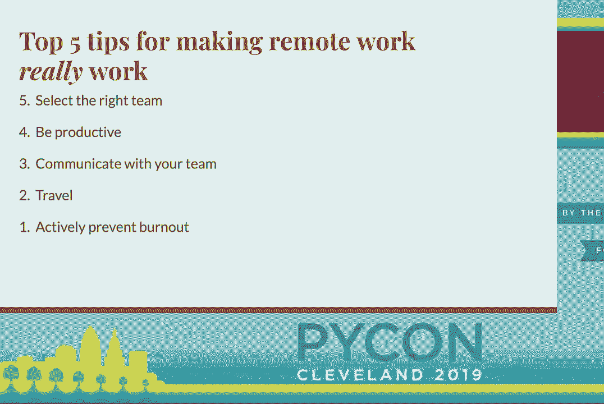

好吧，我们来总结一下。今天我们一直在问这个问题：远程工作真的有效吗？远程工作可能是最糟糕的，对吧？

你可以失败得如此彻底，以至于人们会为你的失败做动画。

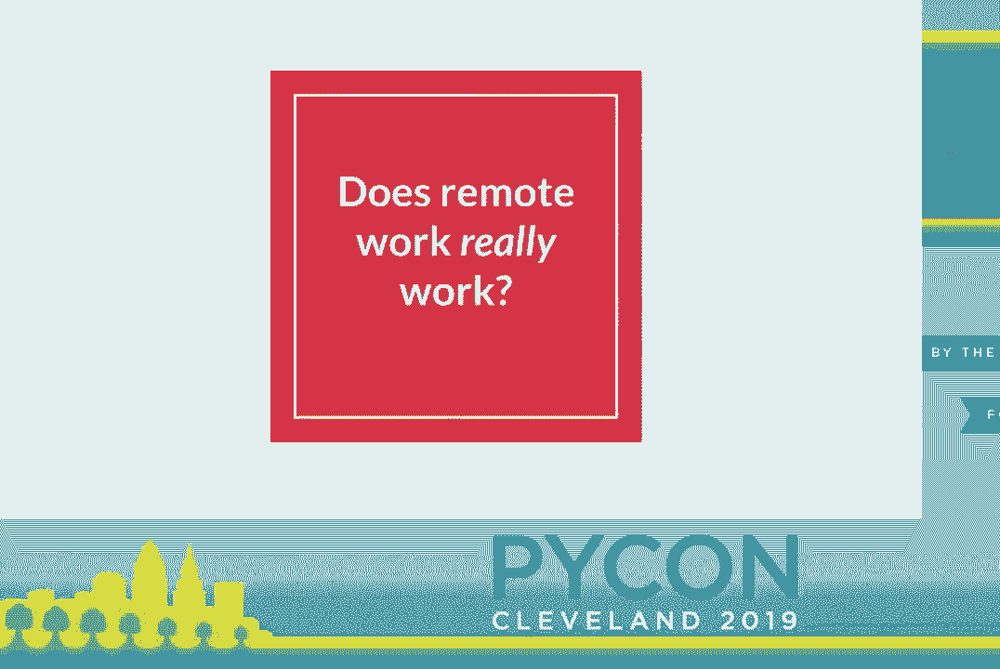

但是，远程工作可以是最好的。你可以成为远程工作的明星。

是的，研究、调查和轶事证据都表明远程工作确实有效。我并不是说远程工作适合每个人，它并不适合。但它对某些人来说是一个很棒的选择。

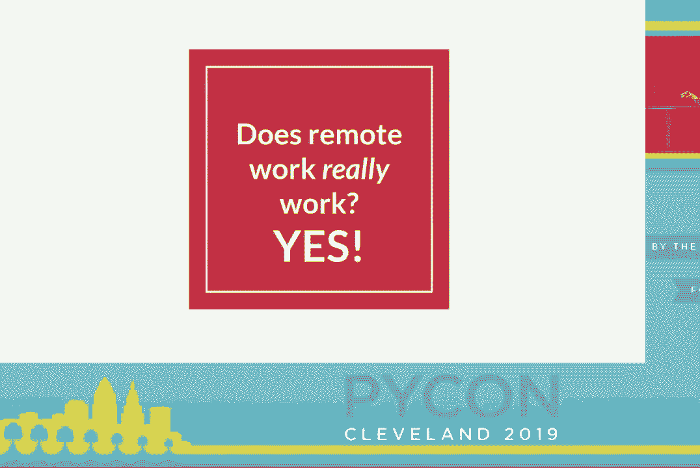

远程工作对员工有益。对公司有益，也对环境有益。

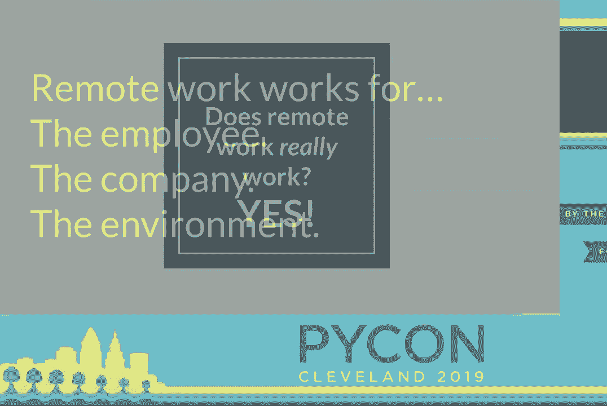

我想给你留下最后一句话。在格蕾丝·霍普计算机女性庆典上，telewittany 在一次主题演讲小组中被问到，如果可以改变一件事，她会改变什么。她的回答很简单。如果我能改变任何事情，那就是每一个人都应该勇敢地去争取自己想要的。

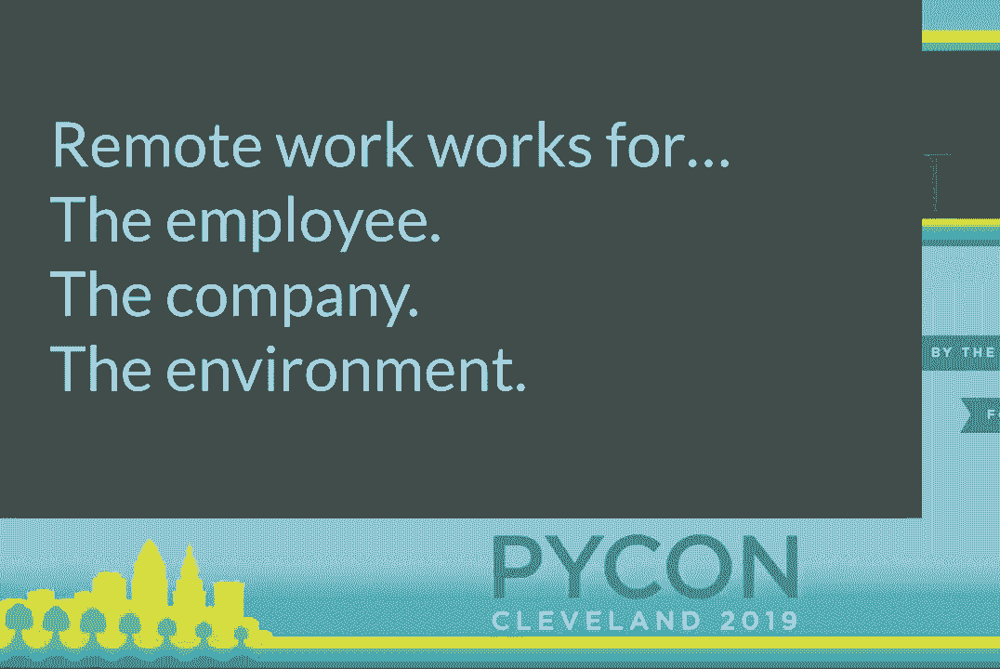

这是我今天对你们的期望。无论你想要的是什么，是更灵活的工作时间，改变角色，承担更多责任，还是远程工作。我希望你们每个人都能主动提出自己的需求。所以，是的，远程工作确实有效。因此我鼓励你们，请为远程工作的选项发声。

为自己发声，并为那些希望提升职业生涯但无法亲自到办公室的人发声。谢谢你们。快速的 housekeeping 事情。我知道我给我的 AVI 人员带来了麻烦。你们可以在我的 Twitter 页面上获取幻灯片。它们目前固定在我页面的顶部。我是 Lauren underscore Shafer。在幻灯片的最后。

你会发现有一个附录，里面包含我今天提到的所有研究的链接。

还有其他一些研究我没有时间详细介绍。然后是诺拉·登泽尔的主题演讲，你真的应该去看一下。

此外，我想我没有时间回答问题了。所以在这次演讲结束后，我会在 MongoDB 展台待到展台关闭，我想是今天下午 5 点。所以来吧，我很想和你们聊聊远程工作，也很想和你们讨论 MongoDB。请来找我。最后，我们将在今天下午 5 点在 21 号房间举办与 MongoDB Python 团队的问我任何事情。

他们很乐意和你聊天，回答你关于 MongoDB 或 Python 的问题，或者你可以，嗯，我不知道，其他的事情。我不知道。所以我就这些，谢谢你们。祝你们的 Python 学习愉快。[掌声]，(applause)。

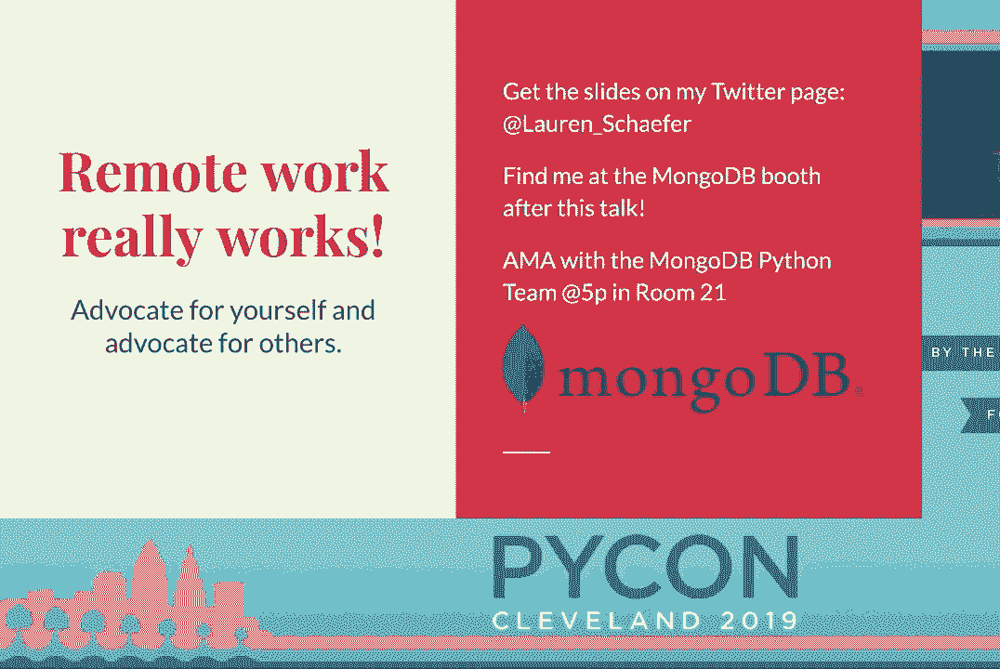
