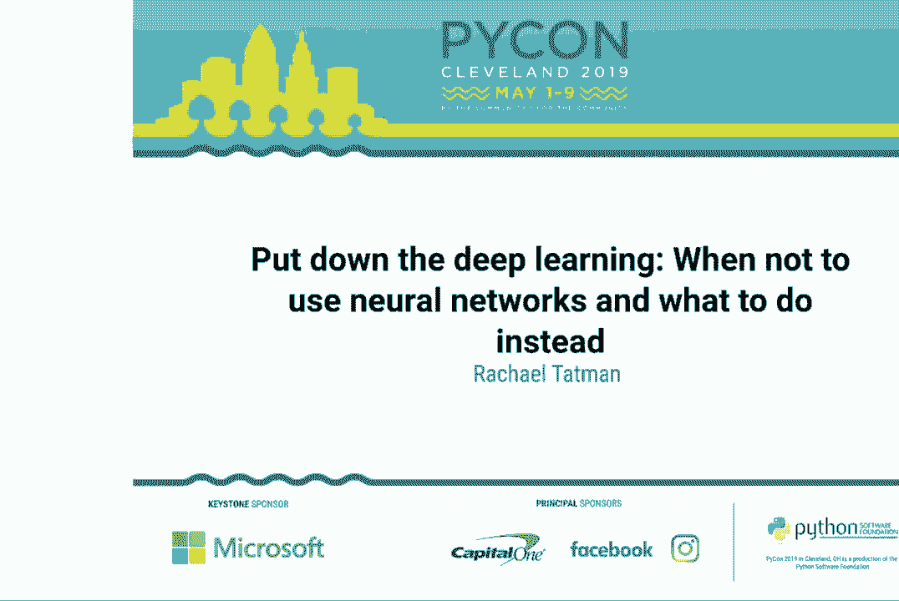
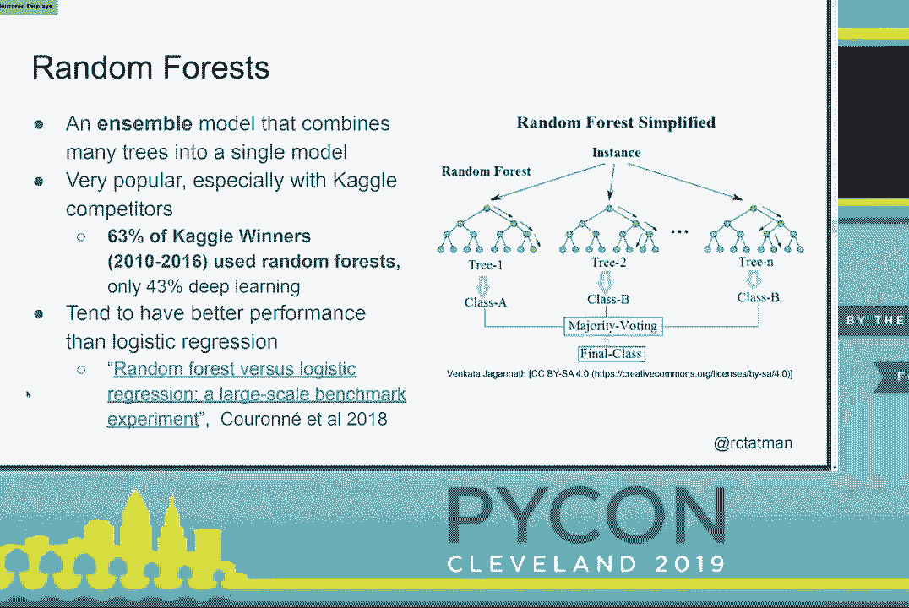
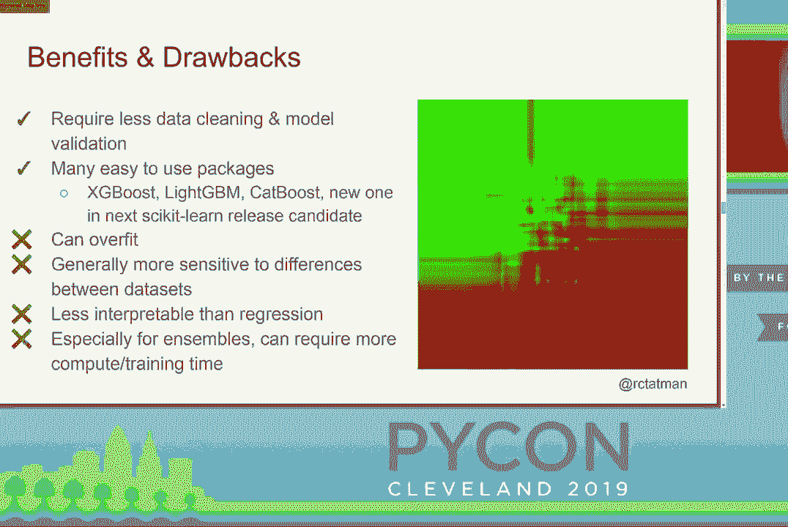

# 机器学习模型选择指南：P29：放下深度学习 - 何时不该使用神经网络



## 概述

在本教程中，我们将学习如何根据实际项目需求选择合适的机器学习模型。深度学习虽然强大，但并非适用于所有场景。我们将探讨回归、基于树的模型和基于距离的模型等替代方案，并分析它们各自的优缺点、适用条件以及实现成本。通过本教程，你将能够为你的问题选择最合适、最高效的解决方案。

---

## 深度学习的现状与挑战

深度学习是一套强大的技术，近年来取得了令人瞩目的成就，例如在游戏（如Dota 2、围棋）和机器人操作等领域的突破。然而，构建深度学习模型的过程通常是缓慢、乏味、费力且昂贵的。模型的有效性、参数选择和架构设计往往依赖于大量的猜测和测试，缺乏坚实的理论指导。此外，训练大型模型（如GPT-2、BigGAN）的计算成本可能高达数万美元甚至更多。

因此，在决定使用深度学习之前，需要仔细评估项目条件。

---

## 何时考虑使用深度学习？

在以下情况下，可以考虑使用深度学习：

1.  **任务复杂度**：任务本身是复杂的，如果一个人完成该任务需要超过一秒钟的思考时间。
2.  **错误容忍度高**：能够接受模型产生一些奇怪或难以解释的错误。神经网络的工作原理与人类认知不同。
3.  **无需模型解释**：项目不要求对模型的决策过程进行解释或审计。例如，在金融风控等需要高度可解释性的领域，神经网络目前并非最佳选择。
4.  **拥有海量标注数据**：通常每个类别需要超过5000个标注样本。如果使用迁移学习，数据量要求可以适当降低。
5.  **拥有充足的时间和资金**：具备足够的资源用于模型训练、超参数调优、数据标注和计算开销。

如果以上条件不能全部满足，那么我们应该考虑其他机器学习方法。

---

## 深度学习替代方案（一）：回归模型

上一节我们介绍了深度学习的适用场景，本节中我们来看看第一种经典且强大的替代方案：回归模型。

回归模型要求我们手动为数据关系选择一个函数族（例如线性关系）。与神经网络不同，我们对何种回归模型适用于何种问题有更原则性的理解。

以下是回归模型的主要特点：

*   **优点**：
    *   **训练速度快**：尤其是在使用优化良好的库时。
    *   **小数据集表现好**：在数千个数据点上也能获得有意义的结果。
    *   **易于解释**：可以清晰地理解每个特征对结果的影响。

*   **缺点**：
    *   **需要更多数据准备**：例如，需要处理特征间的多重共线性问题。
    *   **需要模型验证**：必须检查数据是否满足模型的基本假设（如误差分布），否则结果可能无效。

**一个强大的回归示例：混合效应回归**

混合效应回归能很好地处理分组数据中的复杂模式，例如“辛普森悖论”——在整体数据中呈现一种趋势，但在各子组内呈现相反趋势的现象。

以下是使用Python `statsmodels` 库实现混合效应回归的示例代码：

```python
import statsmodels.api as sm
import statsmodels.formula.api as smf

# 假设 df 是一个包含 ‘admit‘（是否录取）， ‘gre‘， ‘toefl‘， ‘university_rating‘ 的 DataFrame
model = smf.mixedlm(“admit ~ gre + toefl“, df, groups=df[“university_rating“])
result = model.fit()
print(result.summary())
```

通过查看模型输出的系数，我们可以做出可操作的建议。例如，如果`TOEFL`分数的系数比`GRE`分数更高，那么建议学生优先提高`TOEFL`成绩。

**小结**：回归建模需要更多手动干预和验证，但它成本低、计算需求小、能处理较小数据集，并且具有无与伦比的可解释性。

---

## 深度学习替代方案（二）：基于树的模型

回归模型在可解释性上优势明显，但有时我们需要更“自动化”的、对复杂关系捕捉能力更强的工具。本节我们来看看基于树的模型，特别是集成方法。

决策树通过递归地根据特征值划分数据来做出决策。在实践中，单独使用决策树容易过拟合，因此更常用的是集成方法，如**随机森林**。

以下是基于树的模型的主要特点：



*   **优点**：
    *   **所需数据预处理少**：可以处理数值和类别型特征，无需大量转换。
    *   **用户友好**：有大量优秀且易用的库（如XGBoost, LightGBM）。
    *   **性能强大**：在众多数据科学竞赛中表现出色。

*   **缺点**：
    *   **容易过拟合**：需要通过剪枝、设置树深度等参数来控制。
    *   **可解释性低于回归**：虽然可以得到特征重要性排序，但难以进行“如果…那么…”的精确推理。
    *   **计算成本高于回归**：集成多棵树需要更多的训练时间。

以下是使用 `XGBoost` 库的简单示例：

```python
import xgboost as xgb
from sklearn.model_selection import train_test_split



# 准备数据
X_train, X_test, y_train, y_test = train_test_split(X, y, test_size=0.2)
# 创建并训练模型
model = xgb.XGBRegressor() # 对于回归任务
model.fit(X_train, y_train)
# 进行预测
predictions = model.predict(X_test)
```

**小结**：基于树的方法在分类问题上通常表现优异且易于上手，但需要更多计算资源和数据来防止过拟合，其可解释性介于回归和深度学习之间。

---

## 深度学习替代方案（三）：基于距离的模型

当项目时间非常紧迫，或者数据量极少时，我们需要更轻量级的解决方案。本节介绍基于距离的模型，例如支持向量机（SVM）和K近邻（KNN）。

这类模型的核心思想是：在特征空间中，距离越近的样本越可能属于同一类别或具有相似的值。

以下是基于距离的模型的主要特点：

*   **优点**：
    *   **极其轻量快速**：训练和预测速度通常很快。
    *   **适用于极小数据集**：例如SVM只需少量样本即可工作。
    *   **良好的初步探索工具**：可以快速验证某个问题是否具有可预测性。

*   **缺点**：
    *   **整体精度通常较低**：在拥有足够数据时，性能往往不如树模型或深度学习。
    *   **可解释性一般**：虽然比深度学习好，但不如回归模型清晰。

以下是使用 `scikit-learn` 实现支持向量回归（SVR）的示例：

```python
from sklearn.svm import SVR
from sklearn.preprocessing import StandardScaler

# 数据标准化（对SVM很重要）
scaler = StandardScaler()
X_train_scaled = scaler.fit_transform(X_train)
X_test_scaled = scaler.transform(X_test)

# 创建并训练模型
model = SVR(kernel=‘rbf‘)
model.fit(X_train_scaled, y_train)
# 进行预测
predictions = model.predict(X_test_scaled)
```

**小结**：基于距离的模型是快速原型设计和处理小数据集的利器，所需时间、金钱和数据都最少，但性能天花板也相对较低。

---

## 如何选择模型？总结与建议

本节课中我们一起学习了四种主要的机器学习模型类型。选择哪一种，取决于你的具体约束条件和目标。

以下是决策参考框架：

1.  **资源维度**：评估你拥有的**时间、资金和数据**量。
    *   如果三者都极其充裕，可以优先尝试**深度学习**以追求极致性能。
    *   如果资源有限，依次考虑**基于树的模型**、**回归模型**或**基于距离的模型**。


2.  **性能与特性维度**：
    *   **最强大、最灵活**：深度学习。
    *   **最易解释**：回归模型。适合需要因果推断或回答“如果…会怎样”的场景。
    *   **最用户友好**：基于树的模型。特别适合分类任务的入门和实践。
    *   **最轻量快速**：基于距离的模型。适合快速验证或资源极度受限的环境。


**核心结论**：数据科学不等于深度学习。优秀的从业者应像拥有一个完整的工具箱，根据问题的具体情况（钉子的大小、材质）选择合适的工具（锤子、螺丝刀、扳手），而不是盲目使用最炫酷的那一把。


避免成为“手里只有锤子，看什么都像钉子”的人。理解并掌握多种模型，将使你能够更高效、更可靠地解决现实世界中的问题。