# PyCon 2019 主旨演讲教程：第1章：欢迎与会议指南

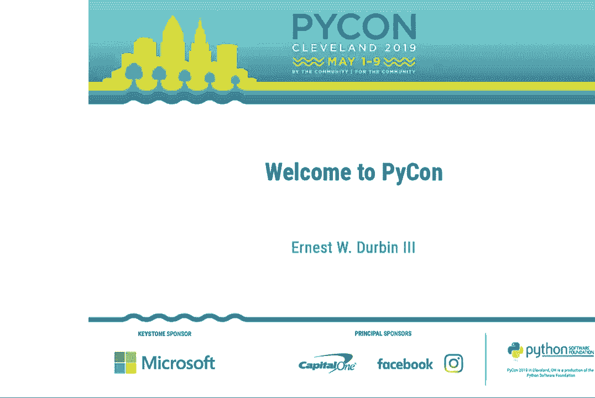

在本教程中，我们将学习 PyCon 2019 开幕主旨演讲的核心内容。演讲者首先介绍了会议的基本信息、行为准则和各项设施，随后深入探讨了 Python 社区面临的挑战与未来机遇。我们将内容整理为清晰的教程，帮助你理解演讲的要点。

## 会议欢迎与行为准则

早上好。欢迎来到 2019 年 PyCon。本次会议在俄亥俄州克利夫兰举行。我代表 PyCon 2019 工作人员，感谢所有志愿者、演讲者、赞助商和与会者。

PyCon 致力于为每个人提供安全的环境和积极的体验。这与我们之间的任何差异无关。为确保这一点，所有工作人员、与会者、演讲者、赞助商和志愿者都必须遵守我们的行为准则。

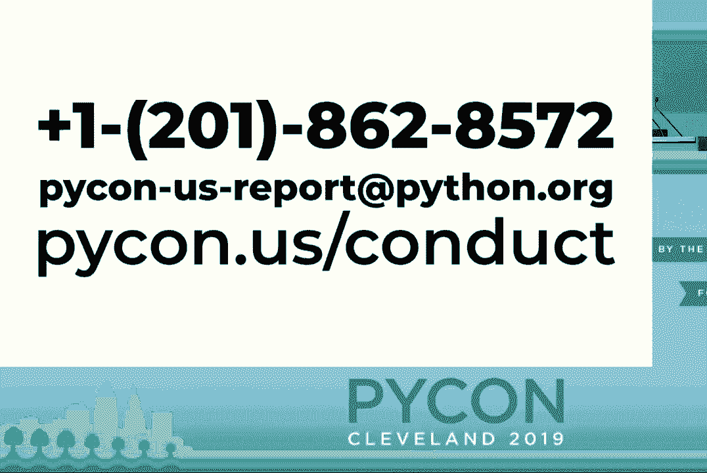

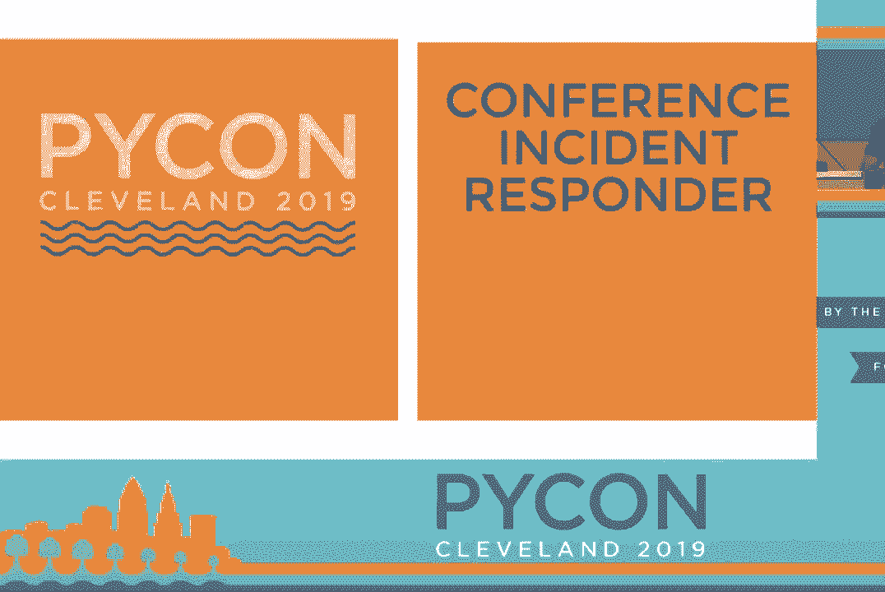

请务必熟悉行为准则。你可以在指定 URL 上找到该准则及其链接的事件处理程序，或访问 `us.pycon.org` 网站，在“关于行为准则”部分查看。

如果在会议期间，你担心有人可能违反了行为准则，鼓励你进行举报。即使你不确定事件是否违反准则，或发生场所是否在准则范围内，也鼓励你提交报告。组织者欢迎所有报告，即使不采取行动，也能帮助创造更安全的空间。

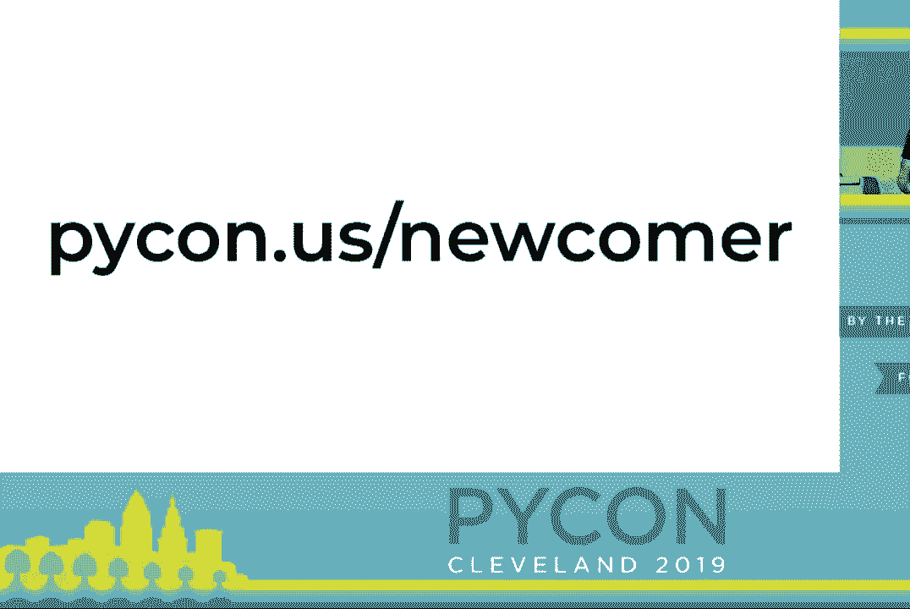

你可以通过电子邮件 `pyconusreport@pycon.org` 提交报告，或通过短信/电话联系 `12018628572`。

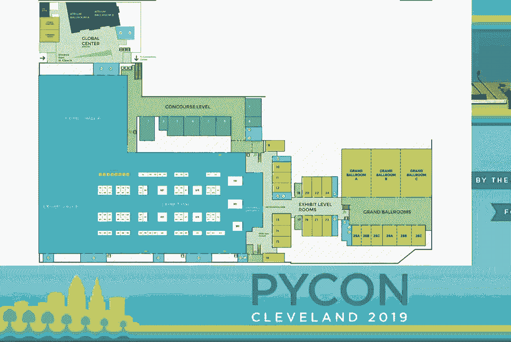

在会议期间，你可以找到穿着颜色鲜艳 T 恤的事件响应者。

屏幕上是联系信息。鼓励你拍照、记录或以其他方式保存在手机中。

## 会议设施与日程安排

如果你是第一次参加 PyCon，我们努力详细说明会议的每一个部分。如果你错过了昨天的新人介绍会，相关视频将在指定 URL 发布，你可以观看 Adrian 分享会议的每一个细节。

你现在位于会议中心。它相当大，我们将逐步介绍。

首先，我们提供了一些无障碍措施。今年所有演讲都将提供实时字幕。在每个演讲房间的中央保留了无障碍通道的空间。会议符合 ADA 标准。如果你有任何顾虑或需要额外便利，请告诉工作人员。

你现在位于展览大厅 A。在接下来的三天中，这里将举行全体会议，包括主题演讲和闪电演讲。闪电演讲的时间是今天下午 5:40，以及周六和周日早上。考虑腾出时间参加闪电演讲。如果你有兴趣进行闪电演讲，可以在注册处附近找到报名表。

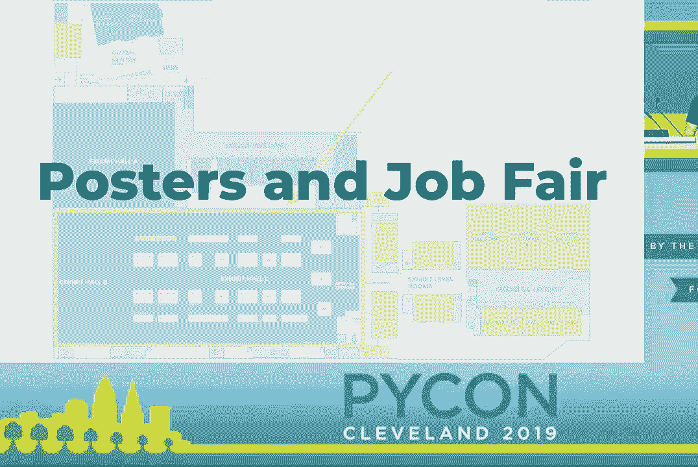

你左边是博览会大厅，位于展览大厅 B 和 C。所有餐饮将在这里进行，直到周日。你可以在屏幕上的 URL 找到餐饮菜单和成分信息。如果你在注册时表示需要特殊餐饮，请查看大厅中的标志。

博览会大厅也是所有赞助商展位所在地。鼓励你拜访赞助商展位，了解他们使用 Python 的情况以及他们支持社区的原因。赞助商使得 PyCon 成为可能，并帮助我们控制注册费用。他们的到来代表了对我们社区和本次会议的巨大投资。

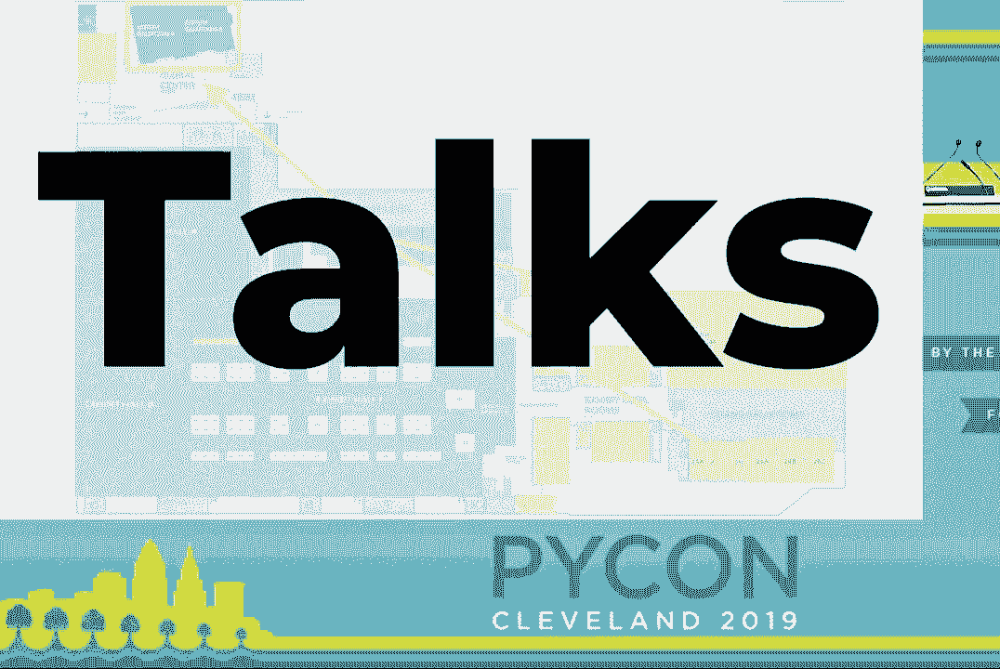

提醒一下，赞助商展位仅在今天和明天开放。到周日，整个空间将重新配置。

除了赞助商，创业区也位于博览会大厅。今天和明天会有一些新公司展示与 Python 相关的新鲜且有趣的事情。请注意，这些展示会有所变化，因此今天在那里的人员明天可能不在。如果有机会，你可以去创业区两次。

到周日，整个房间将重新配置为我们的海报和招聘会。

屏幕上是我们的分组讨论室。请注意，这些房间（H 室的宴会厅）距离主会场有一些距离。如果你打算在那里参加讲座，请考虑时间安排。

今年我们有五条讲座轨道和 95 场会议。大多数讲座会被录制，并在会议后在线提供。所以当你面临两个想看的讲座冲突时，听从你的直觉。

如果你参加一个讲座，时间还剩下，演讲者允许提问时，请记住以问题的形式表达你的问题。

我们有很多房间可供开放空间使用，今天、周六和周日全天都有。这些房间分配给任何人自组织一小时的聚会风格活动，并将开放从早上 8 点到晚上 11 点。这是一个很好的机会，可以深入讨论某个主题，或者找到有共同兴趣的人。

鼓励你考虑通过举办自己的开放空间来塑造会议。你可以去公告板发布自己的开放空间或查看现有内容。今年新推出的功能是，你可以访问屏幕上的网址，查看当天公告板的照片。

这些房间（25C 和 26ABC）是 PyCon 孵化器计划的所在地。PyCon 是一场通过志愿者的指导逐年增长和发展的会议。去年我们推出了孵化器计划，旨在为任何人提供机会，在 PyCon 上实现他们的想法。

我们很高兴今年能迎来首届孵化器计划，并有三个新概念加入。今天全天，你可以参加 Lust PyCon，这是一天的西班牙语演讲活动，将在 25C 房间进行。欢迎并鼓励你参加单场演讲或整天活动。

今年的新活动是 PyCon 艺术展。这是一个小型艺术节，将集中于叙事、表演和视觉艺术。今晚 8 点到 10 点，你可以在 26ABC 房间找到该活动。

PyCon 孵化器维护者峰会也是今年的新活动，旨在为项目和维护者建立一个实践社区。这将是闪电演讲和讨论的混合，时间是从上午 10 点到下午 2 点在 25C 房间进行。

今年的新活动还有指导冲刺，明天从下午 2:30 到 6:30 在 25C 房间进行。这是新手参与开源项目的介绍，在有经验的人指导下进行。

这些活动专注于为经验较少的开发者提供支持环境，让他们学习、合作，扩展网络并庆祝他们的胜利。这些是今年的 PyCon 孵化器计划。如果你有一个想法，PyCon 孵化器计划很可能会继续，请留意 CFP。

PyCon 在接下来的几天内几乎占用了整个会议中心。在此期间，所有公共空间将被 PyCon 相关的活动覆盖。没有规定说你必须参加任何特定的活动。考虑花些时间加入一张桌子或一个小组，结识新朋友。

一个改善走廊活动和 PyCon 整体体验的建议来自 PSF 董事会成员 Eric Holscher。这是“吃豆人规则”。在一群人中站着时，总是留出空间让一个人加入你的团队。这个建议有助于为某人加入你的团队创造一个身体上欢迎的空间。

在整个空间中，我们有三个性别中立的卫生间。一个在 17 号和 18 号房间附近，一个在 25 A、B 和 C 号房间附近，另一个在博览会大厅内。会议中心还有两个母亲室，分别是 17 号和 18 号房间。房间的访问说明贴在外面。

如果你需要帮助或需要进入那里，请查看并获取说明。如果你发现自己需要休息，专注于一些工作或只是深呼吸，我们在 24 号房间有一个安静的房间。请在使用时尊重“安静”这个词。

一步走出门外，克利夫兰总是美丽的。场馆附近是普拉提拍卖活动，定于 5 月 4 日星期六晚上 6:30 在希望宴会厅举行。去年筹集了 30,000 美元用于普拉提活动。5 美元的入场费是一个好交易。

即使你不来竞标，这也可能是我们这里最有趣的一个晚上。就在这里拐角处，如果你沿着湖边走，左转进入第九街，再走到码头，你会发现摇滚与流行音乐名人堂和大湖科学中心。这些地方是 PyCon 晚宴的主办地，一个在今晚 6:30，另一个在会议结束后的周日 6:30。

这两个晚间活动都是需要票的活动。当你在登记时签到时，你应该拿到小票。你需要把那些票带到这些活动上。如果你拿到了票但不打算参加，请将你的票转给其他人。这有助于减少食品浪费。

如果你希望随身携带这些信息，有印刷的程序。还有 `pycon.org` 网站。今年我们又有一本指南。这是一个特定的应用程序，里面包含了所有的日程信息和房间号码等。你可以在 `pycon.us/guidebook` 找到它。

## 事务提醒与日程变动

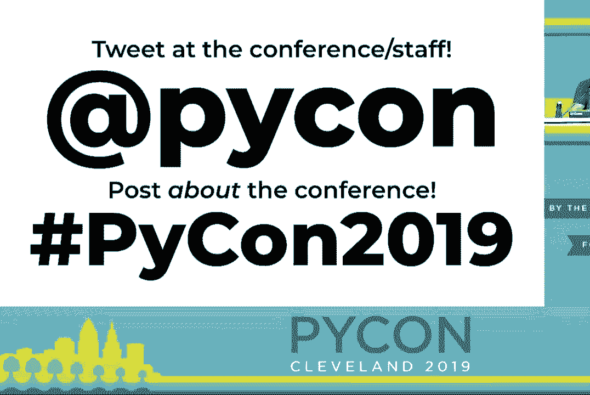

负责本次会议财政责任的 Python 软件基金会目前正在进行筹款活动。如果你能够，请考虑访问屏幕上的这个网址，它会带你到一个页面，上面有关于那个筹款活动的所有信息。

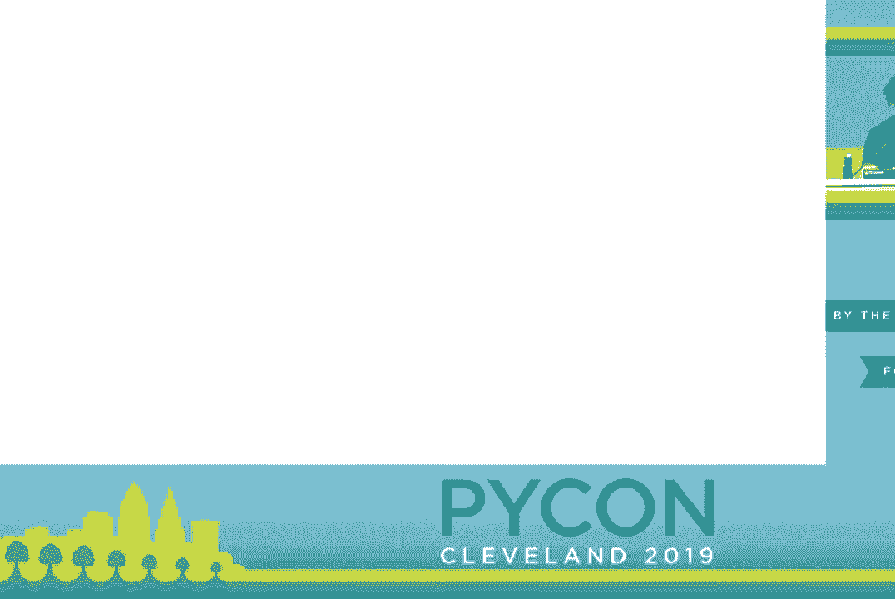

如果你注册了 PyCon 乐跑和步行活动，那将在周日 7 点开始。巴士将于 6 点开始运行。但是大概会在 6 点 30 分左右到。明天早上有一个不同的活动，不是我们的。不过请注意，如果你是开车来会议中心，这会造成一些拥堵。从明天早上 7 点到 11 点，计划多留一点时间到达这里。

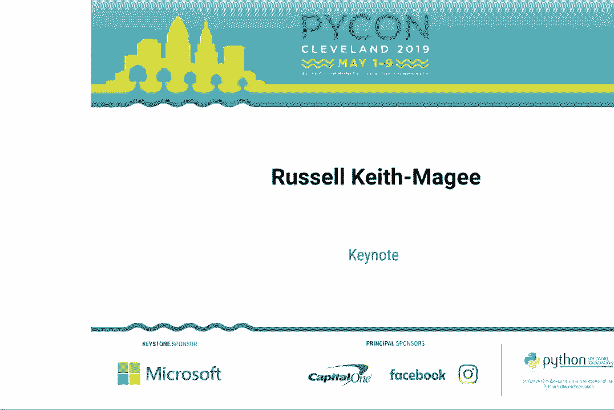

赠品包可以领取。里面你会找到一个小设备。感谢 DigiKey 和 Adafruit，所有与会者将获得一个可以运行 Python 的 Circuit Playground Express。因此对此有两个注意事项。第一，如果你要经过某些需要安检的地方，请提前将这个从包里拿出来，并告诉安检员它是什么。第二个建议是考虑周日把这个带到我们的闭幕主题演讲。

你需要领取的是你的 T 恤。由于剪裁和重量，与去年相同，我们选择的颜色似乎没有那么多颜料。这些 T 恤非常薄。因此在公共场合穿之前，确保你试穿一下。如果你在取 T 恤后对其有疑虑，请告诉我们。

最后，有一些日程变动。我之前提到的移动指南应用程序和标识已经更新。你的打印程序没有更新。所以请花点时间检查博览会大厅前的公告板，以查看替代信息。

但总的来说，在周六，大宴会厅 B 发生了替换。由 Philip James 讲授的《大象与蛇：使用 Mastodon 与 Python》替代了由 Nina 讲授的《Pythonista 的代码审查技能》。通过 Chris Wilcox 发布您的第一个 Python 包并自动化未来的发布，替代了使用 Python 的代码阅读器。

今年我们有专业摄影师在现场。如果你不想被偷拍，你可以去注册处领取一个徽章夹。把你的徽章换进去，把挂绳放上，摄影师会避免拍到你。在后期制作中，我们会确保不使用任何佩戴有红色横幅徽章的人的照片。

最后一点，关于社交媒体。如果你想在会议上发推文，可以这样吸引工作人员或组织者的注意，推特 `@PyCon`。如果你想发布有关会议的内容，用标签 `#pycon2019` 发推文。

## 主题演讲：Russell Keith-Magee 博士

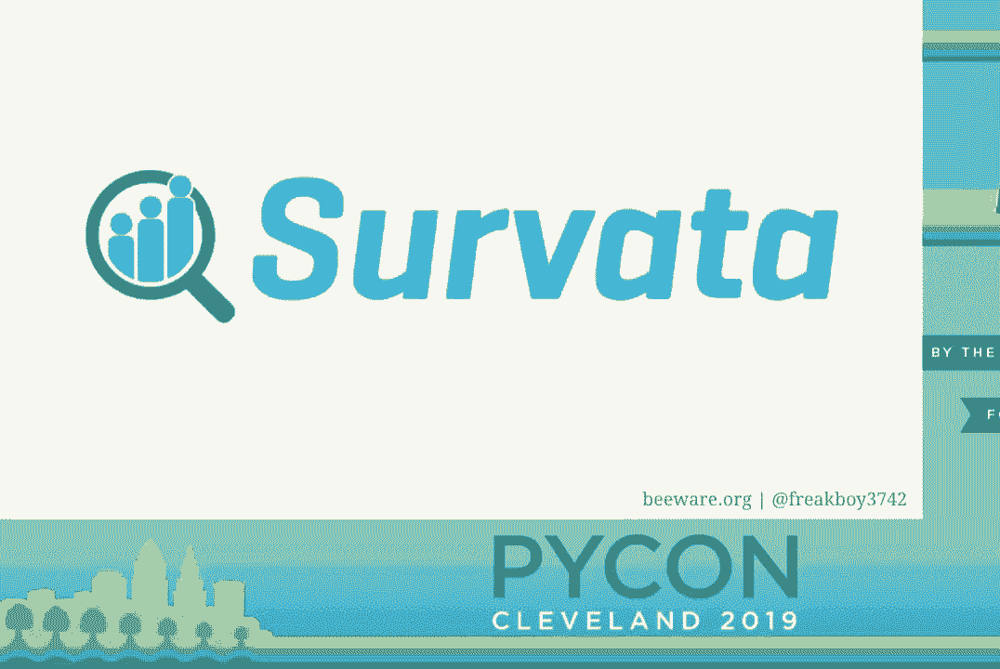

现在，我非常兴奋地介绍我们的第一位主题演讲者，Russell Keith-Magee 博士。他是 BeeWare 项目的创始人，长期以来一直是社区成员，该项目将 Python 带入移动设备。他也是 Django 的长期贡献者。

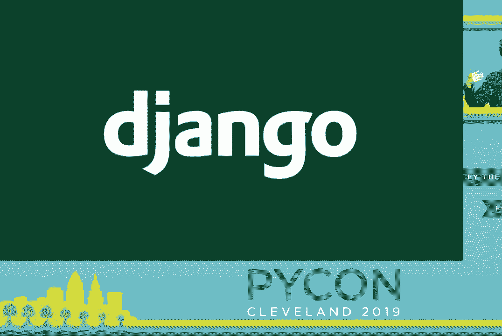

非常感谢，Ernest。你好，克利夫兰。我是 Russell Keith-Magee。今天能在这里我感到非常荣幸。我在 Python 社区活跃并显眼地参与了超过 13 年。我出生并至今生活在珀斯，西澳大利亚。

珀斯有着迷人的历史，对世界的影响超出许多人所意识到的。有些故事是便于比喻的，所以今天我想向大家讲述珀斯的故事。也许我们可以在这个过程中学到一些关于生活的宝贵教训。

首先，一些术语。来自西澳大利亚的人叫沙地虫。沙地虫有一个关于如何开始大型公共活动的传统。为了承认土著人民的历史，从 1970 年代开始，澳大利亚的公共聚会逐渐开始承认聚会发生的土地并不总是白人的土地。这被称为“土地承认”。

因此，我想承认我来自 Wajuk Nung Aabuja。我想承认 Erie Honan 和 Haudenosaunee 人民，今天我们聚会所在土地的传统拥有者。承认他们与土地、水域和文化的持续联系，并向他们的过去、现在和未来的长者表示敬意。

此外，作为内容警告。我将在本次演讲的后面讨论抑郁和自残的问题。如果这对你有影响，请做你需要做的自我照顾。我会在进入这一部分之前再给出一个警告。

在我的日常工作中，我为 Savada 做数据工程。Savada 是一家市场研究公司。他们使用 Python 和数据科学来帮助品牌了解他们的客户。Savada 让我有灵活性，可以在全球各地游走。但有了像 Savada 这样出色公司的支持，真是太好了。

我通过在 Django 上的工作参与了 Python 社区，并为人所知。我早在 2006 年就加入了 Django 核心团队。由于我住在珀斯，直到 2008 年我才见到 Django 核心团队的另一位成员。Django 是 Python 生态系统的重要组成部分，但并不是唯一的部分。

在我目前的日常工作中，我并不使用 Django。但是我广泛使用 NumPy、Jupyter 和 Pandas 及其相关工具生态系统。此外，Python 还有许多其他用途。它被用作操作系统自动化的脚本语言，并作为教语言的 DevOps 控制语言。

这些都不是一夜之间发生的。Python 作为一种语言已经 28 岁了。大约花了 10 年时间 Python 才在我们行业获得任何显著的关注，再过 10 年才获得广泛支持。因此，我们得到了这个：3 个聚会。有 500 人从世界各地组织前来，汇聚到克利夫兰，讨论一种编程语言，为期几天。

值得花点时间反思 28 年前 Guido 所说的意义，以及我们作为一个社区自那时以来所做的努力。这应该得到庆祝，因为这不是一项小成就。并且因为这是 Python 社区的大舞台，我们在这里有真正的机会展望未来。

在这个周末以及下周的冲刺中，我们有机会畅想伟大的创意。我们需要解决哪些问题，集体关注哪些方向，接下来的几周、几个月和几年。所以，为了启动这个对话，我想向在座的每个人提出一个问题：你们认为 10 年后的 Python 会是怎样的？

我唯一确定的是，在座的每个人对这个问题的回答都会不同。当一个语言被这么多人用于如此多不同的事情时，这种情况是不可避免的。但如果你今天在这里，可能可以合理地假设你对 Python 有一定的喜爱。而在 10 年后，你可能希望看到 Python 至少保持如今的活力。

我相信在座的没有人希望重写 PyPI 上的所有库，或重建 Python 生态系统中的所有社区和用户组，或在新社区中重新建立我们的生态系统规范，仅仅因为 Python 不再是新项目的可行语言。因此，这个问题：“你怎么看待 10 年后的 Python？”实际上是在询问我们今天需要做些什么，才能确保 Python 仍然是一个充满活力、相关且健康的社区。

## 黑天鹅事件与 Python 的未来

现在是时候分享一些更有趣的事实了。西澳大利亚州的州鸟是黑天鹅。它出现在西澳大利亚州的旗帜上以及珀斯市的徽章上。穿过珀斯中部的河流被称为天鹅河。但是，黑天鹅也是一个隐喻。在 17 世纪之前，所有天鹅都是白色的这一点是众所周知的。其他颜色的天鹅被认为不存在。

然后在 1697 年，荷兰探险家威廉·德·弗拉明意外地访问了西澳大利亚，并发现天鹅也可以是黑色的。这彻底改变了人们对天鹅的认识。在 2001 年，SAS 和统计学家纳西·M·尼古拉斯·塔勒布将此作为更广泛的隐喻。

塔勒布将黑天鹅事件定义为对观察者来说是意外的事件，具有重大影响。但事后来看，这可以很容易地解释。回想起来，很明显天鹅可以是黑色的。但在有人访问西澳大利亚并看到了它之前，没有人想到要挑战这一假设。

黑天鹅事件不一定是即时发生的。其影响可以随着时间逐渐显现。个人计算机的崛起就是一个黑天鹅事件。1947 年，IBM 的首席执行官托马斯·沃森曾著名地说，全球市场可能只需要五台计算机。如今，几乎在座的每个人都携带着五台计算机。回顾往昔，沃森的评论听起来只是天真的。但在当时，这并不具争议性。

在我看来，当我们思考 Python 的未来时，我们需要考虑 Python 的黑天鹅事件。Python 现在是一种流行的语言。我们希望它保持受欢迎。那么有什么可能影响这种受欢迎程度的因素呢？行业内、硬件上、社区中可能发生什么变化，会影响 Python 的受欢迎程度？

黑天鹅事件在事后看来才显而易见。但避免这些事件的最佳方法是积极挑战你的假设。而问题是：“如果这些假设被证明是错误的，会发生什么？”我认为我们可能已经让人们对此感到担忧。

你在哪里运行 Python？在 Python 存在的几乎整个时间里，一台计算机是一个坐在你桌子上的大盒子。在过去的 10 年里，我们看到了全新类别计算设备的出现，它们体积更小，通常是便携式的。手机、平板、手表、机顶盒。这些设备正变得无处不在。它们正在取代笔记本电脑，成为主要的计算设备。

如果你访问 Python.org，平板电脑、手机、机顶盒、手表甚至没有提及。对我来说，这似乎是对过去 10 年日常计算体验变化的相当大忽视。手机和平板电脑的市场渗透率是桌面和笔记本电脑从未见过的。然而作为一个社区，我们并没有一个故事来讲述如何在这些设备上使用 Python。

如果笔记本电脑不存在，会发生什么？有些小众设备。在我的平板电脑上没有 Python 的安装程序。我为什么要学习 Python？

并非所有的 Python 都在笔记本电脑上运行。你在服务器上安装了 Python。你确保用户没有启用 JavaScript。如今，祝好运，找一个在没有启用 JavaScript 的情况下正常工作的网站。与移动设备一样，过去 10 年，代码执行的位置发生了显著变化。越来越多的代码在浏览器中运行。

JavaScript 已经从可选的客户端附加组件演变为在浏览器中实现关键业务逻辑的语言，甚至成为取代服务器上 Python 的语言。再说，如果我是一个初学者程序员，面对 JavaScript，这是一种我可以用来在浏览器中获得原生体验的语言，并且可以将其过渡到服务器上。另一方面，有 Python，这是一种仅在服务器上工作的语言。我为什么要学习 Python？

就算面对这两个问题，我仍然坚持学习 Python，并且我达到需要安装一个包的地步。我已经使用 Python 20 年，在这段时间里，我认为没有曾经有一段时间，我会将 Python 的包装故事描述为稳定的。这是因为信息在互联网上永远存在。过时的建议在被认为是正确答案后仍会持续存在，而出于好意的错误信息也在 Stack Overflow 上传播，从而加剧了这个问题。

这种情况糟糕到足以成为漫画的笑话。XKCD 1987，兰德尔·门罗讽刺的 Python 环境体验已经下降到使他的笔记本电脑变成有毒废物的地步。布雷特·卡农对此漫画进行了非常出色的撰写，试图诊断布兰登电脑上发生了什么。这是一次非常有启发性的尸检，值得阅读。

但布雷特指出的一件事，从我寻找黑天鹅的角度来看，这一点让我最担忧。为什么这个笑话可以被提出？好笑话总是包含真理的元素，你对此真理的反应很重要。这个笑话是关于 Python 是什么的叙述的一部分。如果这个图景不是积极的，从长远来看，那就是一种生存威胁。

而且我甚至还没有涉及到如何将我的应用程序分发给其他人的问题。无论你是在分发 Django 应用程序还是用户空间应用程序，Python 在如何将我的代码交给他人方面一直没有一个一致的故事，尤其是当那个他人不是开发者而只是想使用我的应用程序时。与之形成对比的是，例如，PHP，其发布故事是使用 FTP 上传所有文件，或是 go 故事就是在这里，提供这个可执行文件。

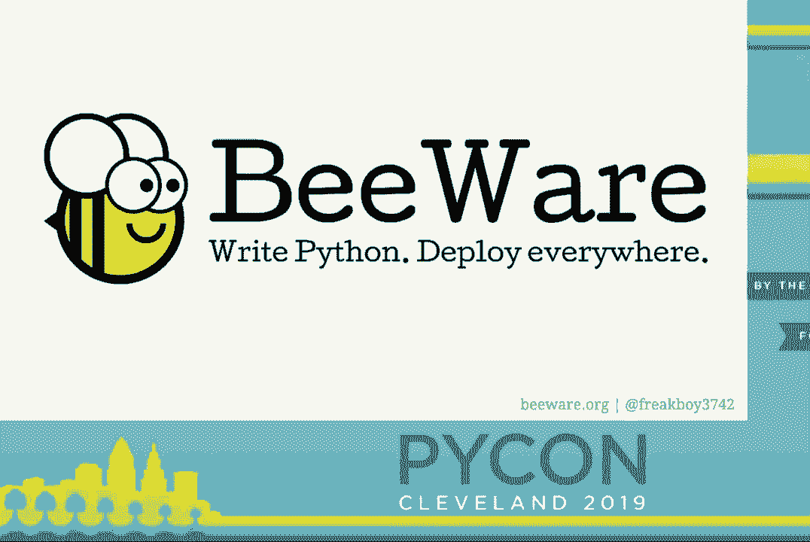

现在，我并不是说 PHP 或 go 解决方案是万灵药，它们并不是。我也不是说 Python 的故事能像那些一样简单。但我们完全没有故事。而我们正在与那些有故事的语言竞争。而且，我为什么要学习 Python，如果我无法清楚地回答如何将我的代码交给非程序员朋友的这个基本问题呢？

现在，我刚刚识别出四个可能的黑天鹅。也许问题会是别的什么。我知道在这个房间里有些人会声称 Python 的 C API 是一个潜在的问题，或者是 Gill，或者缺乏好的前端故事，或是将重点放在 Unix 和 Mac 上而忽视 Windows。也许问题根本不在技术上。也许它将是文化上的。

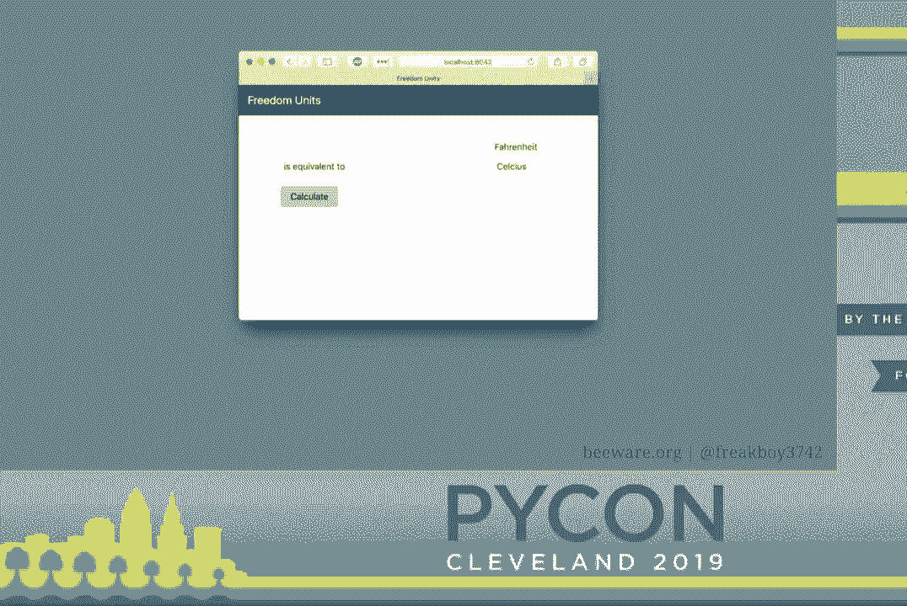

Python 社区或开发过程中的某些方面可能会驱逐某些用户群体。或潜在贡献者因为感知到的敌意、冲突或利益不合而退缩。也许根本不会是这些问题。关键是我们无法预测未来，但我们可以挑战我们的假设。我们可以批判性地审视自己作为一个社区。我们可以检查行业和社会的趋势，并根据这些评估制定计划。

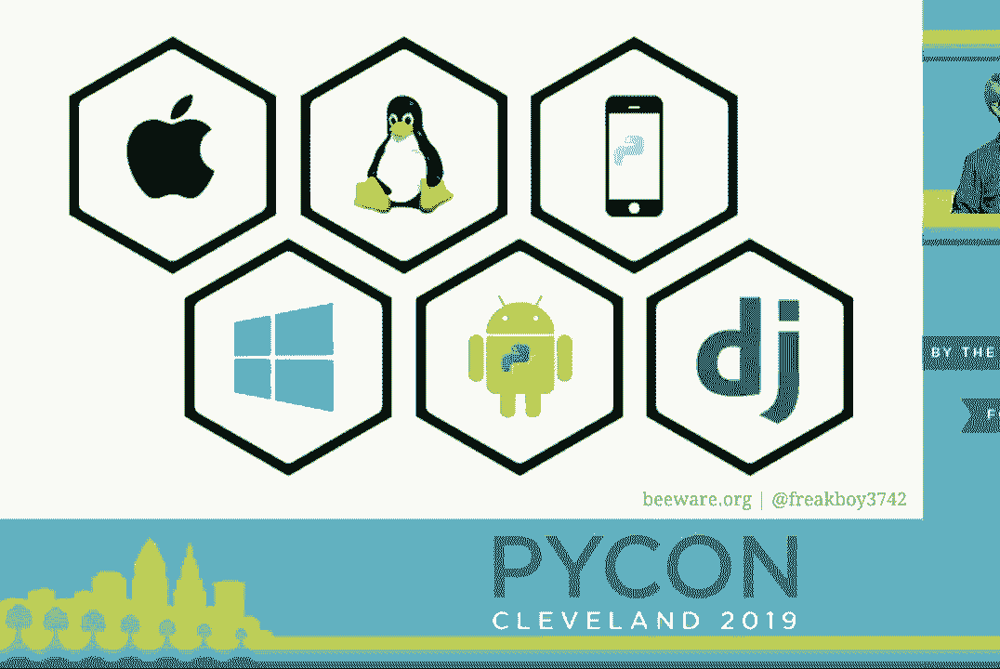

## BeeWare 项目与创新

这些生存问题是我几年前改变开源贡献焦点的原因之一。正如我之前所说，我在 Django 上建立了自己的声誉。但现在，我将大部分志愿时间用于 BeeWare 项目。

对于那些之前未接触过的人，BeeWare 是一个用于在 Python 中创建本地用户界面的开源工具和库的集合。它适用于桌面，也适用于 iOS、Android、单页网页应用和其他新硬件平台。这个工作的一个关键部分是让 Python 在手机和平板上运行。

如何在 iOS 的浏览器上运行 Python 代码，连接到本地 API 和那些平台。将这些 API 封装在一个跨平台层中。另一个重要部分是开发分发方案，搞清楚如何与本地平台工具集成，以将用 Python 编写的应用程序封装成带安装程序的应用，或上传到应用商店或 Play 商店。

BeeWare 仍在开发中。目前的状态是一个引人注目的概念验证。它不是一个可以开始用来开发关键任务应用程序的第一个版本产品。但我已经能够证明，用 Python 编写跨平台的本地应用程序是可行的。我并不是唯一一个在解决这个问题的人，例如 Kivy 项目具有相似的目标，但在其基础方法上有所不同。

就 BeeWare 而言，大约 18 个月前，我在 2017 年的 PyCon Australia 上进行了一个现场演示，我编写了一个华氏度转摄氏度的应用程序，大约 50 行 Python 代码。然后将其部署在 MacOS 上作为 MacOS 应用，在 Linux 上作为 Linux 应用，在 Windows 上作为 Windows 应用，在 iOS 上作为 iOS 应用，在 Android 上作为 Android 应用，以及作为单页网页应用，所有这些我在 17 分钟内完成了。

当我说部署时，我并不是说我在 Mac 上运行了代码。你所拥有的是一个独立的 `.app` 文件。在 Windows 上，是一个 MSI 安装程序。在 iOS 和 Android 上，是一个打包的应用程序，运行在设备模拟器上，但可以轻松上传到应用商店。而且它是在浏览器中运行，完全在客户端，包括在浏览器中进行华氏度到摄氏度的转换。

现在，正如你可能想象的，这是一项大工程。我已经在 BeeWare 上工作了几年，有些时候我确实感觉这就像是在推一块巨石上山。不幸的是，自从我进行那个演示以来，显著的进展并不多。甚至还有一些回退。目前 Android 和网页支持由于某些原因出现了问题。这是因为这不是我的日常工作。我正在利用我称之为“闲暇时间”的时间来进行尝试。因此，进展很慢。

## 美洲杯的启示

但尽管如此，我对 Python 的未来实际上感到乐观。接下来我会解释原因。我需要告诉你关于 Sangerpah 历史的另一部分，关于美洲杯比赛。我需要告诉你关于美洲杯的事情。美洲杯是世界上最古老的国际体育奖杯。美洲杯比赛大约每四年举行一次。

你们来自旧金山的人可能还记得 2013 年在旧金山湾举行的美洲杯比赛。从 1851 年第一场比赛到 1980 年，获胜者是纽约游艇俱乐部。在 1983 年，纽约输给了皇家珀斯游艇俱乐部，游艇澳大利亚也打破了 132 年的获胜纪录。我无法夸大这一事件在澳大利亚的重要性，尤其是在珀斯。这是将珀斯首次推向世界舞台的事件。

今天的许多人可能在不知道原因的情况下也知道 1983 年美洲杯的事。有些人可能听过我提到“我来自南半球”这句歌词。这是澳大利亚摇滚乐队 Men at Work 的一首歌中的一句。这首歌也是澳大利亚的非官方主题曲。它在美国流行主要是因为 1983 年美洲杯挑战。

电影《鳄鱼邓迪》的构思和融资部分得益于澳大利亚在美洲杯中获得的曝光。需要明确的是，Outback Steakhouse 与此无关。

除了珀斯的联系，美洲杯和澳大利亚为什么重要呢？首先，让我们谈谈纽约的获胜纪录。1983 年比赛中的游艇被称为 12 米游艇。尽管名字如此，实际上与船的长度无关。它描述了一套复杂的游艇设计规则，包括帆面积、水线长度等等。

然而，美洲杯并不总是在 12 米级游艇上进行比赛。在 1956 年之前，使用了不同类别的游艇。根据奖杯的契约，卫冕俱乐部必须接受常规挑战。但他们可以设定这些挑战的规则。因此多年来一直如此。纽约游艇俱乐部会施加规则，比如“挑战者必须来自海洋游艇俱乐部，并必须独自航行到比赛现场。”

也就是说，来自英格兰的挑战者必须跨越大西洋，而卫冕者只需从纽波特港出发。令人惊讶的是，在这些条件下，纽约的游艇通常更轻、更快。所以，关于美洲杯的第一课是，仅仅遵循规则是不够的。你必须确保竞争是公平的。纽约游艇俱乐部并没有违反任何规则。他们并不是为奖杯制定契约的人。他们只是打了手中牌。

但在这样的情况下，没人会认为竞争是公平的。你有选择。你可以继续赢得对你有利的竞争，或者你可以改变你能控制的事情，使其成为公平的竞争。但你不能声称你是在凭借实力赢得的世界最佳，除非你先平衡了竞争环境。这是否可以作为 IT 行业的隐喻？你知道，我想这可能是。

但是值得称赞的是，纽约游艇俱乐部在 1958 年采用了 12 米规则。因此，从那时起，竞争一直是公平的。那么为什么没有其他人赢呢？好吧，一只黑天鹅出现了。帆船是一项竞争非常激烈的活动，而纽约游艇俱乐部总是提供强有力的防守，配备设计良好的游艇和高效能的船员。

当你加入主场优势，了解纽波特港的当地海域和盛行风时，继续获胜就更容易了。而 12 米游艇的设计本质上是在对一个成熟设计进行微调。船只之间存在一些变体，但它们都是对基本设计的相对成熟的调整。

澳大利亚二号是一只黑天鹅。当澳大利亚二号抵达美国时，船的下半部分笼罩在秘密之中。这引发了各种疯狂的理论，尤其是当它开始赢得比赛时。在两次不同的情况下，澳大利亚团队抓住了潜水员试图偷看。各种指控称，无论那条覆盖物下有什么，它肯定是非法的。

但是，这支敏锐的团队一直将秘密保持到胜利庆祝会上。当球队老板站在码头上，呼叫将船抬到空中让大家观看时，揭示了带翅膀的龙骨。在大多数船只上，龙骨是一个简单的平面，用于降低船体的重心，以抵消帆力。澳大利亚二号的设计师本·莱辛对此有不同的看法。

他认为龙骨是一个水动力表面，所以我们就像对待一个水动力表面一样来处理它。他在龙骨的底部添加了一对小翼。这些小翼的作用类似于喷气式飞机机翼上的小翼。飞机上的小翼使机翼产生更多升力和更少阻力。龙骨上也是如此。小翼使龙骨在保持船只直立方面更有效，这意味着帆也更有效，因此船速更快。

蓝色涂料是伪装，因此如果你真的拍到船在水中的照片，你会看到传统龙骨形状的轮廓。快进到 1987 年。澳大利亚防御队。每艘游艇都有一些秘密。它们是玻璃纤维船体，各种龙骨形状，动态龙骨。这样的创新持续到今天，碳纤维船体、坚固的帆和更多。

美洲杯现在不再在 12 米游艇上进行。2021 年的下一届美洲杯将以所谓的 AC 75 游艇进行比赛，这些游艇可以说是飞行的船只。它们轻得惊人，帆产生的推力如此之大，以至于能够使用它们的龙骨作为一个水上飞行者，从水中升起。这些船以惊人的速度航行。

所有这些创新都是因为一个团队决定挑战 12 米游艇设计的假设。这是有争议的，风险很大，但它奏效了。自此以后，游艇比赛再也不是同样的样子。为了强调这个隐喻，澳大利亚 2 号的救生艇被命名为黑天鹅。

## WebAssembly (Wasm) 的机遇

这与 Python 有什么关系呢？好吧，我认为我们已经看到了为我们行业所展示的风翼龙，那就是 Wasm。对于那些尚未接触到它的人，Wasm 是 WebAssembly。它的起源是一个研究项目，旨在确定一组可以在现代 JavaScript 引擎中快速执行的原始 JavaScript 操作。

这组原始操作非常接近汇编语言的能力，分配内存、简单的整数浮点运算等等。因此，您可以使用这组原始操作并将 C 代码编译为这个汇编语言目标。Wasm 是这项工作的扩展，定义了一种用于传输汇编内容的二进制格式，而不是将 JavaScript 作为要被解析和解释的内容进行传输。

这使得 Wasm 代码更小，更快处理，但其可移植性并不比 JavaScript 差。因为归根结底，它就是 JavaScript。实际上，它将 JavaScript 分成了两个部分。一个快速的沙箱运行时，几乎在所有浏览器中都可用，以及一种针对该运行时的语言。

对于我们行业的目的，这意味着规则已经改变。您不再需要采用 JavaScript 语言来采用 JavaScript 运行时。这意味着 Python 和其他语言有机会成为可用于浏览器客户端逻辑的语言。

Wasm 仍处于相对早期的阶段。仍然有一些问题正在解决，其中一个大问题是 DOM 与 Wasm 之间的交互。而制作一个可行的基于 Wasm 的 Python 将需要一些工作。不过，在这个领域已经进行了一些实验，但风翼龙已经被揭示出来。我们如何利用这些知识则取决于我们。

我们是否将深入技术，发挥创造力，确定如何利用这些规则为我们所用，并驶向一个飞行的船只？还是我们将继续在平底 12 米游艇上比赛，并且想知道为什么我们不再赢得比赛？

## 团队合作与资源投入

但我们还可以从澳大利亚学习更多。Ben Lexen 是一位非常有才华的游艇设计师。当他在澳大利亚 2 号的龙骨底部添加翼尖时，他做了一件了不起的事情。但他并不是一名竞技帆船手。John Bertrand 是一位出色的船长，却无法设计游艇。他和船上的其他 14 个人以及在救生艇上和港口的整个支持团队一起，展示那 15 名水手的竞争能力。

帆船是一项团队运动。你不仅需要顶尖的工程师或船长。你需要广泛的技能。只有当这些技能结合在一起，形成一个运转良好的团队时，你才能取得成功。软件的情况也是如此。尽管有关于伟大的软件开发是由独自在地下室敲打代码的黑客完成的历史叙述，这几乎从来不是事实。

我们今天所看到的 Python 社区是无数小时努力的结果，来自无数人。而且由于主要是软件工程师，代码往往获得最多的关注。没错，编写优秀软件需要大量的努力，做到这一点需要时间和技能。但这仅考虑代码。任何项目，尤其是像 Python 这样的大型项目，远不止代码。

项目和团队管理是一项技能。图形设计和用户界面管理是一项技能。开发者关系是一项技能。技术写作是一种技能。好吧，这些技能可以广泛认为是全面软件工程师的职责。但那些甚至与软件毫不相关的事情呢？谁来组织社区活动？谁提供法律建议？谁负责沟通和公共关系？

谁与潜在捐赠者建立关系并管理筹款？谁与谷歌、微软和亚马逊等公司的战略交易？确保 Python 在产品路线图上得到支持。事实证明，世界上有些人无法编程，但他们有非常有用的卓越技能。

澳大利亚在这里也有另一个教训。本·莱克斯顿和他的团队并不是出于良心而做所有这些工程工作。竞技帆船被形容为在冷水淋浴中撕掉百元钞票的能力。澳大利亚 2 挑战由一位名叫艾伦·邦德的绅士资助。1993 年的挑战是邦德资助的第三次挑战，总共吸收了数亿资金。

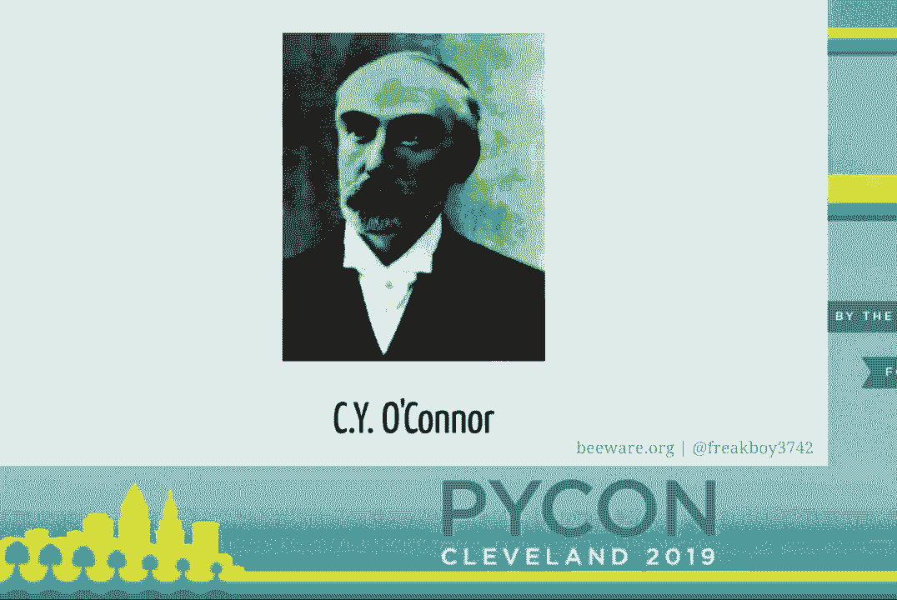

如果没有邦德的资金，澳大利亚 2 挑战是不可能实现的。如果没有对多个杯赛的承诺，设计团队就无法深入了解所有游艇设计。资助研究工作，最终也不会取得有翼龙骨的成果。无论是竞技帆船还是软件，都需要专业知识。但专家们通常期望得到报酬。

在开放源代码软件开发的泡沫内部，很容易忽视一些文化规范在其他行业并不正常的事实。开放源代码软件是一个行业，显然期待你在完成 9 到 5 的日常工作后，回家继续做一些免费的事情，并鼓励一个数十亿美元的组织从你的努力中获益。

在大多数行业，如果你擅长某件事，你就会获得报酬。而软件以外的人也有非常有用的技能，这些技能是许多开源项目急需的。但写软件也是如此。人们为编写软件获得良好的报酬，但有很多软件是应该被编写的，但并不是。或者不是及时完成，因为我们在等待志愿者来完成这项工作。

Django 是一个网络框架，DSF 协调其网站最近的 redesign 花了超过三年。为什么？因为如果你需要志愿者，你立即限制了任何人可以投入到工作的时间和精力。我不想贬低志愿者对 Python 和 Python 社区所做出的重大贡献。但我确实想挑战这样的观念：志愿服务是 Python 或开源进步的唯一途径。

如果你为人们的时间付费，他们更有可能保持对问题的关注，直到设计完善或后果被考虑，而工作就完成了。我们在 Python 社区看到这个令人惊叹的例子，PyPI 的重写。PyPI 已经存在了 15 年，几乎一半的时间都急需重写。每个人都同意需要重写，但工作从未完成。为什么？因为没有人被支付去做这项工作。

然后 Mozilla 给了 PSF 一笔 170,000 美元的拨款，工作在六个月内完成。为什么？因为几个人能够专注于完成任务，而不是在周末的孩子足球比赛之间抽时间修复 bug，或者试图说服他们的老板，“哦，改善 PyPI 在下一个季度不会为我们带来任何收益。这对社区来说是值得的活动。”

PyPI 是一个不幸的稀有例子。我们还留下了哪些机会，或者我们是否面临着因为没有为其提供资源而无法把机会转化为现实的风险？我们对自身增长施加了哪些限制？是因为没有人热心地自愿花时间来解决某个空白或利用某个机会吗？

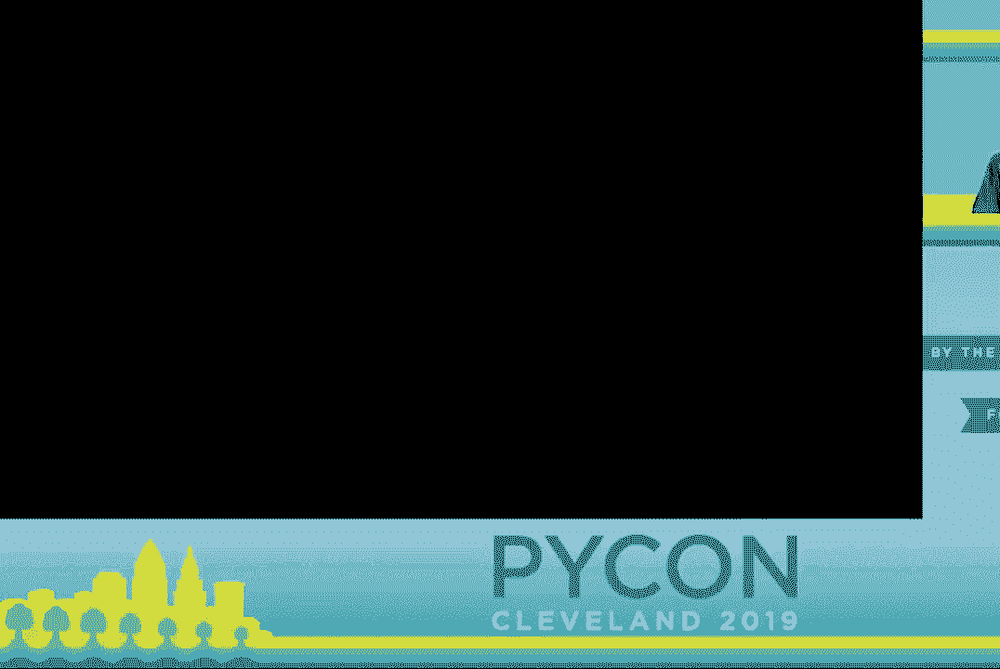

我们排除了哪些人参与开发过程，因为他们有其他生活承诺或无法合理解释将所有空闲时间投入到志愿者工作中？或者因为他们不能接受短期的拨款合同，因为他们住在美国并需要医疗保险？

这不仅仅是关于维护和现有基础设施。历史证明，研究与开发是确保长期成功的方法，而不进行研发的团队最终会被淘汰。澳大利亚 II 对研发的投资导致了风鳍的出现，并推动了整整一代游艇设计的进步。

我之前识别的黑天鹅问题不是简单修复就能解决的。这将需要集中努力，可能在过程中会遇到许多死胡同。我在利用 BeeWare 方面尽力而为，但实际上我只在周末做这些。大部分 Python 及其生态系统也是如此。我们今天拥有的 Python 是在志愿者的闲暇时间开发的，或者是工程师从雇主那里挤出的时间片段。

如果不必如此呢？如果 Python 拥有一个研发部门，一个专注于 Python 生态系统战略任务的常驻工程团队呢？当贝尔电话公司给予一群工程师战略性工程的资源时，我们得到了 Unix。当施乐在帕洛阿尔托资助一个团队进行战略性工程时，我们得到了施乐园，这为我们提供了图形用户界面、以太网和激光打印机。

当你给予有才华的人思考大问题的资源时，惊人的事情会发生。Python 社区有很多有才华的人。我们只需给予他们思考大问题的资源，去做大事情，而不必证明工作将在下个季度产生利润，或者不必将一半的时间花在为下个资助撰写提案上。这也可能为在开源开发中历史上代表性不足的群体提供高调的有薪职业机会。

然而，我们面临的根本问题是，我们如何为此支付费用？开源是一种出色的工程方式，但它不是商业模式。我们需要找到如何在不妥协社会目标的情况下为开源工程目标提供资金的方法。然而，这个问题属于学术经济研究领域。

埃莉诺·奥斯特罗姆因对共同池资源的首次研究而获得 2009 年诺贝尔经济学奖。共同池资源的现实世界例子包括森林或牧场。这些是任何人都可以访问的资源。最佳个人策略是尽可能多地从资源中获取，但最佳共同策略是合作，限制你的获取，为了维护资源以最大化其长期健康和生产力，必须回馈。

奥斯特罗姆的研究考察了现实世界中管理的共同池资源示例。其中一些资源已经集体运营和维护了数百年。奥斯特罗姆研究的关键发现之一是可持续共同池资源所需的条件。而其中一个条件是排除。为了维持共同池资源，你必须能够限制对资源的访问，仅限于那些致力于遵守社区原则的人。

问题在于这与自由软件指南直接对立，后者指出不能限制人们重新分发软件的能力。我不知道我们如何调和这两种立场。这可能需要对我们长期以来认为神圣的一些观点进行非常严肃的考虑，或者至少要明确区分软件和其周围社区。但我们无法避免这些讨论。这种差异的后果对我们社区中的人们产生了深远的影响。

## 心理健康与社区支持

为此，我有最后一段关于桑格拉帕历史的分享，作为预告，我们即将进入我之前提到的敏感话题。这位绅士是查尔斯·耶尔维丁·奥康纳，CYO·康纳。他出生于 1843 年，1891 年成为西澳大利亚公共工程部的工程主管。他负责的领域很广泛，但他因两个重大公共工程而被人们铭记。

第一个是弗里曼特尔港。实际上，珀斯是一个不适合大城市的地方。没错，离一切都很远，但海上的城市需要港口。珀斯没有天然的深水港，所以他们建造了一个。他们通过疏浚斯旺河的河口来实现这一点。这一切是在 1890 年代的 CYO·康纳的指导和监督下完成的。

但这并不是 O'Connor 唯一的成就。他的另一个成就是更大的“金矿水方案”。1890 年代初，库尔加迪和卡尔古利镇附近发现了黄金。这引发了西澳大利亚的淘金热。你可以从地图中注意到这些城镇。他们处在沙漠的中央。那里的自然水源稀缺，但人们需要水。因此，他们愿意支付每加仑五先令的费用，将水从珀斯用马车运送过来。

经过通货膨胀调整，这相当于每加仑 100 美元。黄金如此丰厚，人们还是愿意支付。1890 年代的金矿热潮使西澳大利亚的人口在四年内翻了一番。但人们仍然死于首次疾病，所以政府想采取行动。CYO·康纳的解决方案是修建一条 530 公里（330 英里）的管道，从珀斯山的蒙达灵水库到卡尔古利，沿途设有八个泵站以将水送到目的地。

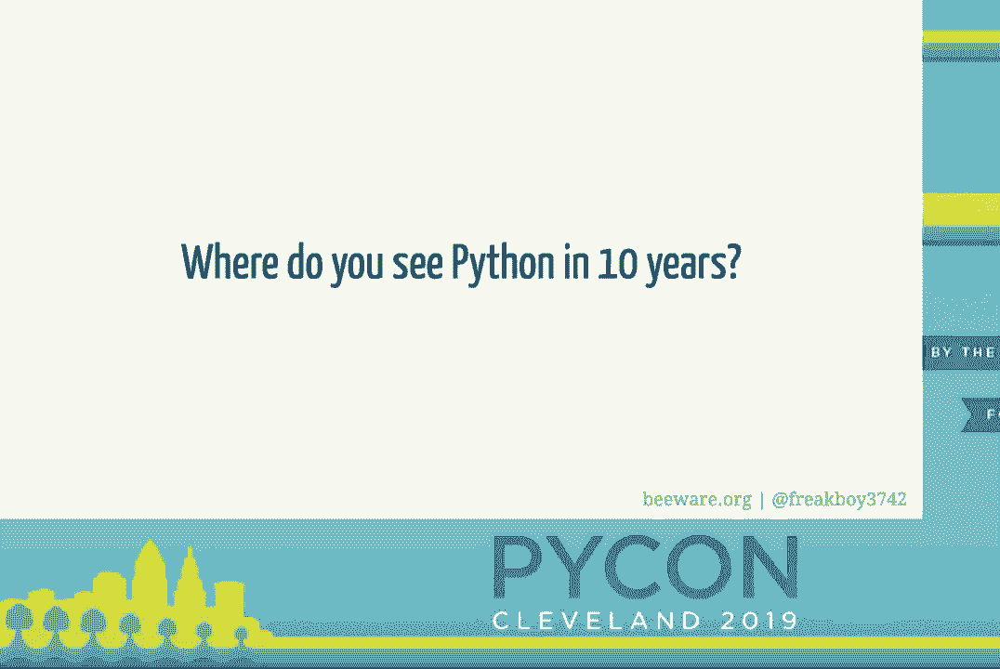

将水提升 340 米的高度，水滴从蒙达灵到卡尔古利需要五天时间。而且，这一切是在 1890 年代建成的。弗里曼特尔港和金矿管道在马车和蒸汽机时代构思、规划并交付。这两个项目都是巨大的 undertaking。它们的实现需要当时政府的相当财务投入。

但和所有雄心勃勃的计划一样，它们并不总是受欢迎。对这两个项目的批评非常普遍。那些被拒绝的替代方案的提出者纷纷通过媒体表达他们的不满。珀斯《周日时报》的两位连续主编将追责 O'Connor 作为他们的个人使命，被追究他浪费公共资金的方式。

他们在社论中抓住每一个机会指责他腐败、无能，并呼吁对他的活动进行皇家委员会调查。所有这些公众的批评和压力都对 O'Connor 产生了影响。在 1902 年一个清晨，他选择了结束自己的生命。

这两个项目，弗里梅特港和金矿管道，它们雄心勃勃，但并不是轻率的。它们设计精良，工程