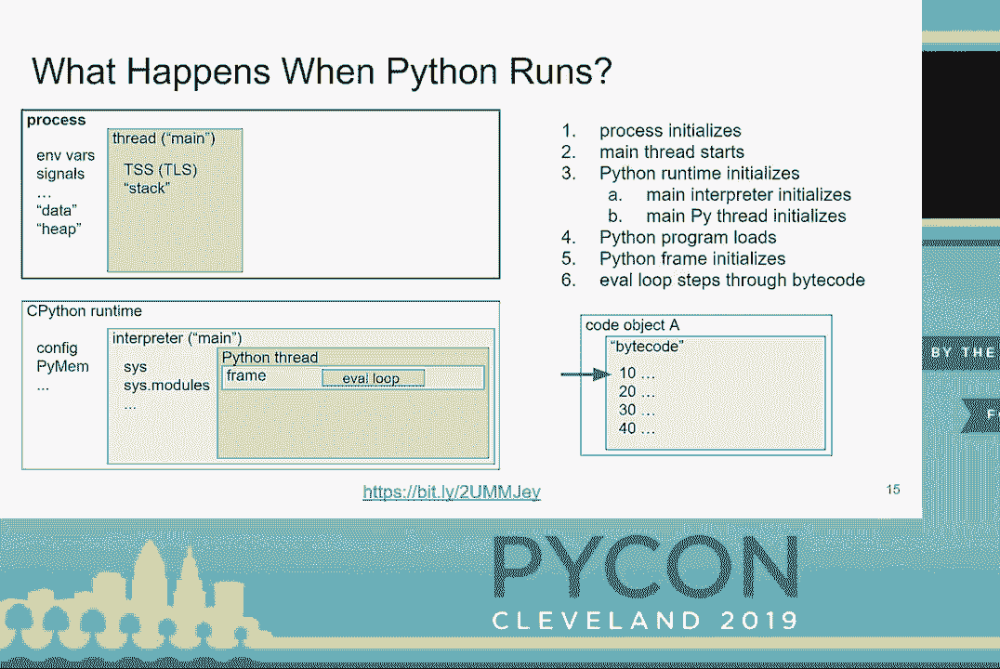
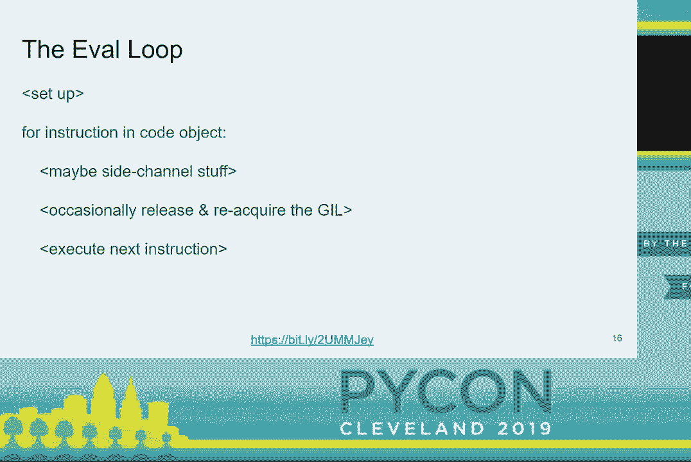
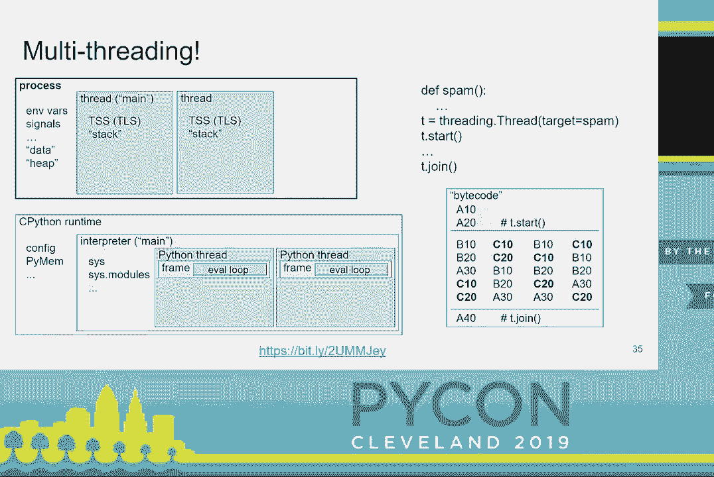
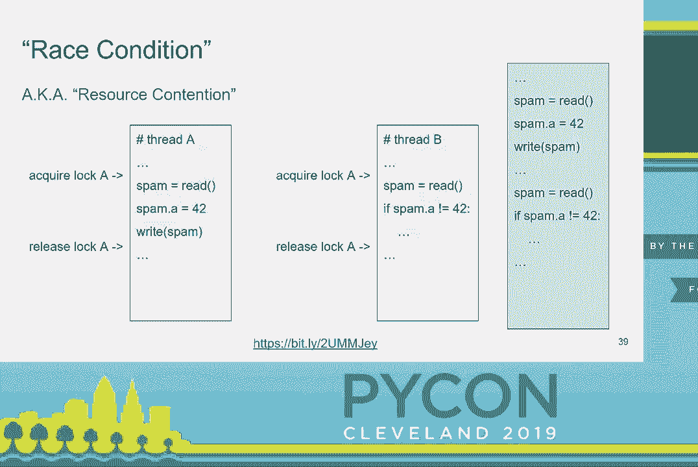
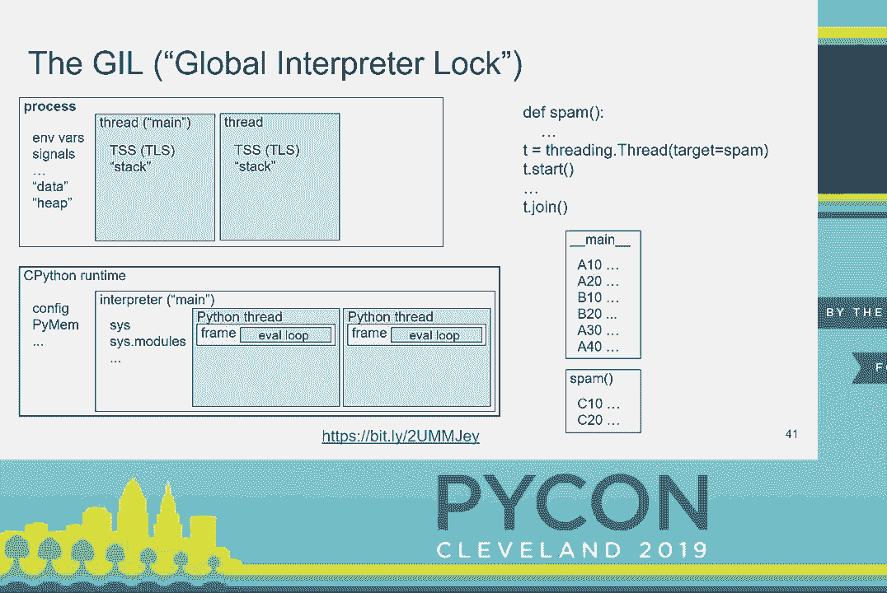
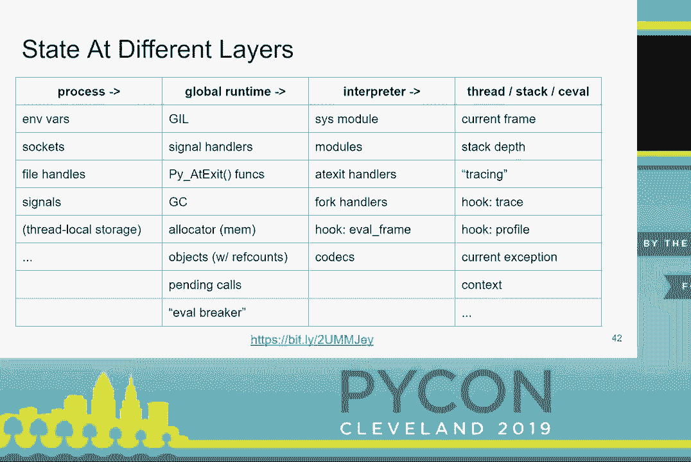
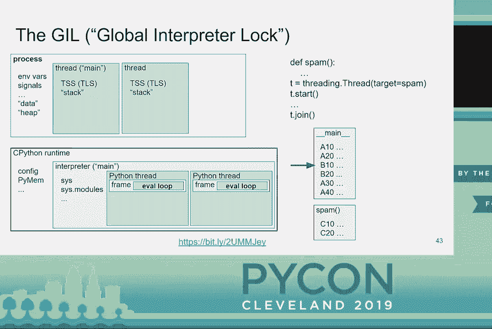
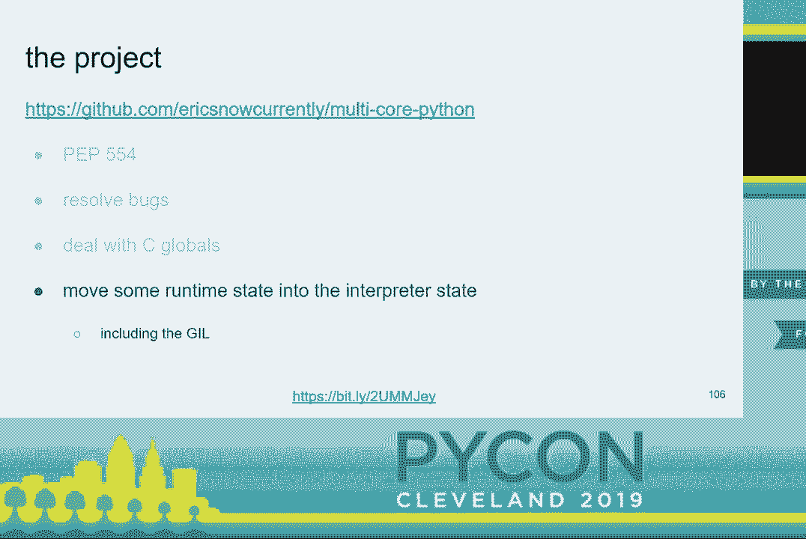
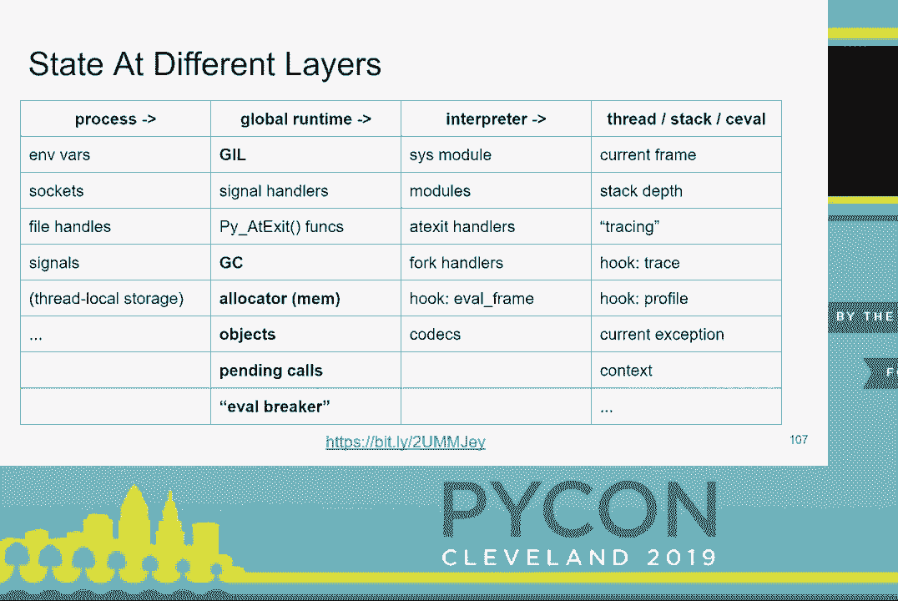
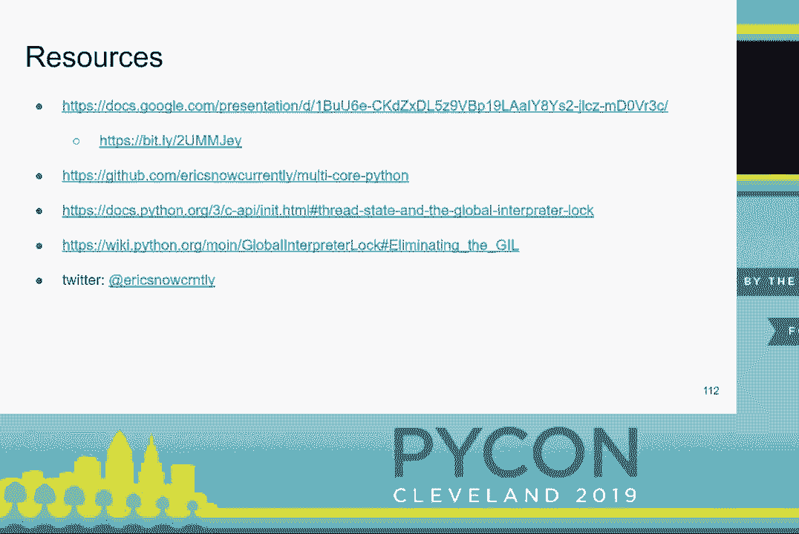

# P31：Eric Snow - 是否使用 GIL - 多核 (C)Python 的未来 - PyCon 20 - leosan - BV1qt411g7JH

大家好。欢迎来到我们的下一个演讲。今天的演讲者是 Eric Snow。他是 CPython 的核心贡献者和核心开发者，今天将与我们讨论是否使用 GIL，以及多核 CPython 的未来。谢谢你，Eric。

[掌声] 好的。谢谢大家。今天我们将讨论 CPython 的 GIL，以及我们如何超越它。我会尽量不讲得太快，否则这可能会是一个简短的演讲。所以请访问那个 URL 获取幻灯片的更新信息，或者在 Twitter 上获取其他资源。你可能会或可能不会认出我所提到的一些内容。

作为一名 Python 核心开发者所做的事情。那么为什么 GIL 话题会引起我的兴趣呢？

在2014年末，我经历了一件事，这促使我致力于修复 Python 的多核问题。所以已经过去一段时间了。沿着这个思路，我们将努力理解现状以及如何改变它。但让我明确一下。在开始之前，我并不打算在这个描述中做到完美，而且我没有时间去讨论每一个细节。这里有很多细节。

如果我们有时间提问，我猜我们会有时间。好的，大家准备好吧。接下来会有很多内容要讲。我们将快速浏览这些即将到来的幻灯片。但到最后，我们应该能有一个相当不错的理解。这些实际上是 C Python 的各层。因此，进程中只有一个运行时，然后。

运行时中有一个或多个解释器。每个解释器有一个或多个 Python 线程，每个 Python 线程有一个调用栈。此外，每个调用栈中的每一帧都有一个 eval 循环。那么让我们看看这在实践中的应用。这一组幻灯片的表现可能不够精确，但足够用了。

当一个进程启动时，它具有一些对该进程全局的资源。同样，每个操作系统线程也有一些专属资源。运行时实际上是与该进程中所有 Python 相关的内容。一个解释器是所有 Python 线程共同共享的运行时状态。我们通常会更广泛地使用这个术语，但对于。

在这个演讲中，我们将使用更具体的含义。Python 线程与操作系统线程相关联，并保持线程特定的运行时状态。因此，当加载脚本、模块、函数、类以及其他一些东西时，会编译成代码对象。因此，当你的 Python 程序运行时，它会被加载，我们最终得到那个代码对象，其中的一个关键部分。

是要由 Python 解释器执行的字节码指令序列。为了简单起见，假设我们的虚构 Python 程序仅编译为少数几条指令。当加载时，真实的程序会有更多的指令。所以这里的框架保存了正在运行的代码对象的执行状态。框架中的 eval 循环，每次通过时执行一条指令。

所以在我们逐步执行程序时，我们将这样做。观察我们如何以确定性的顺序访问每条指令。这有点像。

单线程的性质。以下是 eval 循环中发生的粗略示意图。从高层来看，这非常简单，但其中确实包含了很多细节。在这里，你可以先窥见一下这次演讲的驱动者，Gill。在此。

在我们的代码中，假设有一个函数调用。同样，在真实的字节码序列中将涉及更多指令。因此，对于调用，我们在线程的调用栈上推送另一个框架。然后我们逐步执行调用函数的代码。在这里，我们到达最后一条指令，然后返回到原始代码对象。

然后我们从栈中弹出该框架。接着我们在这里结束原始代码对象。现在，我们完成了。一切在此时被清理，进程结束。正如我之前暗示的那样，我们可以将所有执行确定性地扁平化为一个单一的线性列表，就像我们看到的那样。但如果有多个线程会发生什么呢？所以再次。

我们有一个简化的伪程序，类似于第一个。我们假装该程序与这里显示的两组指令相匹配。一旦第二个线程运行，我们将在进程和 Python 运行时状态中看到它。每个 Python 线程将与其自己的操作系统线程关联。在我们的代码中，新的线程将在 A20 处分裂。

标记的指令。我们将在 A40 再次等待线程。那么现在让我们一起走过这个执行过程。在此过程中，尽量想象我们如何可能在代码执行时将其扁平化。在这一点上，新的线程被创建。现在，每个 Python 线程中的 eval 循环正在运行不同的代码。在多核处理器上，它们可能会。

将以并行而不仅仅是并发的方式运行。所以我们可以看到我们有两个 eval 循环，我在那儿放了箭头，但这就是我们在 eval 循环中运行的方式。因此，我们可以同时遍历两个指令序列。在这里，第二个线程即将完成。所以第二个线程完成并被清理，但。

原始线程继续运行，而新线程已经完成。所以当我们到达这一点时，我们正在绘图，没有什么可做的。所以现在我们结束了。如果我们回顾执行的展开情况，我们会发现两个事情同时发生。你知道，你无法像之前那样确定性地扁平化代码。为什么？

因为线程是非确定性并发。因此，有许多不同的指令排列方式。在这里，我只是展示这些排列。有一个与此密切相关的重要问题，与我们正在讨论的内容相当重要。

今天讨论的是竞争条件。由于一个线程中的非确定性代码可能意外修改另一个线程中的代码或修改该代码所依赖的数据。这被称为竞争条件。注意，线程 A 有可能使线程 B 的假设在这里失效。如果你进入那个 if 块，你会期待，那个垃圾邮件。

A 的值仍然可能是 42 或不是 42。但这被破坏了。所以我们主要通过在代码的关键部分周围使用称为锁或互斥锁的东西来解决这个问题。锁允许你在两个线程之间同步，从而为被锁定的代码提供确定性的顺序。一次只能有一个线程持有锁，这段时间是。

直到锁被释放，它才会被获取。如果另一个线程尝试获取锁，而它正在被持有，那么该线程将被锁定并释放。因此，我们不会让这两个线程同时在这些部分运行。如果假设线程 A 首先获取了锁，我们最终得到右侧的执行顺序。所以你。

会注意到线程 A 的逻辑不再干扰线程 B 的逻辑。如果线程 B 首先获得了锁，那么该部分将首先运行，但同样的保护机制也会生效。好的，这有很多细节。喘口气吧。你。

必须找到它。好的，够了。所以 gill 是保护 C Python 运行时资源免受竞争的锁。如果没有 gill，那么 C Python 在大多数情况下就不会是线程安全的。你会遇到一些相当严重的问题。所以这里有一个很多的视角。

gill 正在保护免受竞争的状态。我们在这里看到的 eval 循环是主要驱动程序。

关于 gill 如何保护这些资源。一次只运行一个 eval 循环。所以当我们进行多线程时，我们的状态就是这样。我们有一个箭头，而不是之前的两个。

之前，Python 线程轮流执行它们值中的几条字节码指令。这在我们简化的 eval 循环中是处于这种状态。gill 在一些其他阻塞情况下也会被释放。现在我们知道了什么是 gill，让我们谈谈我们为什么关心它。

可能还有一些，甚至比这更多，但这确实是我能想到的关于 gill 成本的最佳总结。但当我思考其好处时，这些是我能想到的几个。如果你仔细想想，gill 带来的收益有很多人没有考虑到。

除了技术考虑之外，还有一种不公平的看法，认为 gill 伤害了每个人。我不想低估那些需要进行一些 CPU 密集型 Python 代码的人的痛苦。但除此之外，gill 真的是个问题吗？那么，为什么它不是像许多人所说的那样严重的问题呢？其中一个主要原因是。

gill 在很多关键情况下会被释放。因此，除非你在纯 Python 代码中进行一些复杂计算，否则 gill 实际上不会对你造成太大伤害。但只要 gill 存在，人们就会抱怨。这就是现实。因此，人们有几种方式来应对 gill。在 C 扩展模块中，你可以利用各种功能在不真正接触 Python 的情况下释放 gill——在 Python 状态中的不同资源。

随着时间的推移，已经有很多尝试去移除 gill，每次都遇到与单线程代码性能相关的自身问题。我想指出，Larry 的工作。

Hastings 在 Gilectomy 上做的工作虽然目前暂停，但肯定有机会解决一些阻碍问题。然后，完全可以设想这可能会真正移除 gill，这会非常有趣。我知道他会说他已经移除了 gill，这是正确的。但这关乎于。

性能逐步提升。值得一提的是，Python 最好的一点是人们可以面对面交谈。因此，有一些令人兴奋的发展正在进行，我真的希望在这方面能有所成果。所以我们可能会看到更多来自 Gilectomy 的进展，也可能不会。我们会看看事情如何发展。但这确实是很有趣的内容。我推荐大家了解 Gilectomy 和 Larry 的工作。

过去关于它的讨论。而且，CPython 并不是唯一的 Python 实现。有时我们会忘记这一点。其他一些实现没有 gill。它们已经支持多核 Python 代码。是的，它们可能还没有达到你想要的 Python 版本，但你总是可以提供帮助。有时深入研究一下，看看你能做什么是值得的。

帮助这些工具。然后你可以利用它们。所以值得一看。如果你真的感兴趣，那里有机会。好的。我们成功了。现在让我们谈谈我们在处理Gile方面的工作。对CPI的更改是处理Gile的一种主要方式。CPI是一件好事。但它也有一些问题，其中一些我们已经在解决。

在解决这些问题上，我们仍在努力。而且这些问题对我们有一定的成本。在很大程度上，CPI是移除gill的主要障碍之一。困难在于我们不能随意更改CPI。向后兼容性对于Python的核心开发始终非常重要。值得注意的是，同样的问题也影响着性能改进的努力。

CPython的性能。那么，我们为什么会有这些问题呢？嗯，并不是说有人搞砸了。只是很难预测20年后的情况。但让我们看看可能的解决方案。要明确的是，任何事情都不会自行改变。Python是完全依靠志愿者的。所以，完成的工作量有限，取决于人们花时间来做的事情。

自由去做这些事情。但这就是开源的本质，你知道吗？我们对此负责。两个有助于改善的因素是我们目前正在努力改善的东西。具体来说，我们正在尝试对CPI进行分层，以便事物不会轻易泄露到不同的层中。这是问题的一部分，泄漏是问题的一部分。

这里有一些我们可能解决CPI问题的方法，特别是为了gill的利益。还有很多其他的解决方案。这些只是其中的一部分。因此，参与修复CPI问题的工作的人很多。这里是我最熟悉或参与的一些项目。所以这些。

-- 你可以关注这些链接。稍后可以查看我的幻灯片，看看这些事情。真的是一些有趣的项目正在进行中。这里有很多讨论，在CAPI SIG和Python开发邮件列表上也有很多讨论。那么还有什么呢？所以，如果你们中有任何人曾经跟我谈过这些事情，那么你应该对此有所预期。我们在讨论什么。

你可能会问子解释器？好吧，记住我们说过我们以更具体的方式使用解释器。子解释器是在进程中，主要解释器之外的额外解释器。我们从一个解释器开始，就像在我们的图示中，然后我们添加更多。每个额外的都是一个子解释器。所以如果我们看一下之前的图示，这里。

我们有三个解释器。一个主要解释器和两个子解释器。它们都在做不同的事情。每个解释器都有多个线程。它们基本上都是相同的。它们各自有自己的状态。所有解释器大多有效地相互隔离。我们正在修复一些边缘案例。但在大多数情况下，它们是隔离的。

这确实是目标。值得注意的是，并不是所有的 C 扩展模块目前都能够在子解释器中运行，原因有很多。但我们也在为此努力。最后，子解释器并不是一个新特性，它们已经存在很长时间了。现在的新进展是我们正在努力将它们暴露在标准库中。

我的 PEP，即 PEP 554，专注于以有用但最小的方式暴露现有的子解释器 C API。该提案仍在考虑中，适用于 Python 3.9。并不能保证会被接受，但我对此抱有希望。首先，通过这个 PEP，我们正在向标准库添加一个新模块。

暴露来自 CPI 的基本功能。这是一个在子解释器中执行代码的简单示例。首先，我们创建一个新的解释器，这就是那个调用的作用。但还没有执行任何内容。然后我们执行一些代码。所以目前，我们只执行文本字符串。我们将在某个时候再看看。

执行其他东西的可能性，比如代码对象、函数等。但我们从最小开始，然后再扩展。还要注意，当代码在子解释器中运行时，它在主模块下的子解释器中运行。子解释器与线程结合使用时最为有用。这是另一个例子，同样的内容。

只是在线程中运行。这是另一个使用相同子解释器多次的例子。有趣的是，状态在主模块的运行之间得以保留。因此我们会看看这个。这可以非常有用。在第一次运行中，我们设置了一些状态，然后在第二次运行中使用它。所以好的一点是，如果你有一堆其他东西。

在子解释器中设置的工作进程，可以提前在解释器中初始化，然后处理进入的请求，您的子解释器已经预先填充并准备就绪。所以 CAPI 只涵盖创建子解释器和在其中运行代码等内容。最初，PEP 暴露了这个功能，仅此而已。

我很快发现这还不够。因此，孤立的解释器并不真正有用。它们有用，但远不如在可以安全地在它们之间传递数据时有用。因此，PEP 增加了一种我称之为基于通道的最小机制，基于现有的前沿技术。目前，仅支持简单的可变内置类型和单例。

在通道中。还有，目前我们在解释器之间传递序列化的原始数据，而不是实际对象。最后，通道当前是无缓冲的。还有一些其他细节。但基本上，我们是从最小开始，然后将其扩展。因此，我们确实有计划来解决这些限制。

未来的迭代。这是一个示例，在子解释器下生成一些数据，并在主解释器中处理这些数据。因此，首先，我们在通道中创建解释器，并返回通道的两个端点，类型明显不同的对象。然后，当我们启动一个线程，在我们的子解释器中执行一些简单代码时。就在这里。

注意，当我们调用运行时，我们指定了要注入子解释器的通道端。在主模块下。然后我们在执行的代码中使用该通道端。在这种情况下，我们正在发送数据。最后，我们在主解释器中从通道中取出数据，以便在那里处理。通道的一个重要特性是发送。

发送和接收都是阻塞操作。这是解释器可以同步的主要方式。对我来说，异步等待并不适合我的思维。这对我来说就是不工作。我怀疑我不是唯一一个这样的人。因此，我很高兴地说，子解释器促进了一种我认为非常适合我的思维的替代并发模型。这个模型相当。

描述得很好。很多研究，有个叫托尼·霍尔的家伙，CSP，称为通讯顺序过程。所以这里的关键是，与传统线程的无限数据共享不同，子解释器实现的是选择性共享。接下来，尽管它并不完美，我们正在变得更好。我喜欢这个比喻。在很多情况下，它确实很重要。

让我们谈谈这个与全局解释器锁交叉的部分。子解释器是我们摆脱全局解释器锁的一种方式。但怎么做呢？我们将停止共享全局解释器锁。目前，子解释器之间仍然共享全局解释器锁。这样，你就能获得所有。

全局解释器锁的缺点。如果你记得这张图表，其中有我们需要处理的所有状态，目前全局解释器锁是Python全局运行时状态的一部分。如果我们将其移动到每个解释器的状态，那么我们就可以实现多核并行处理。因此，我在这里有点含糊不清。我承认。但实现这一点不应该是一个太具侵入性的变化。实际上。

这是我正在研究的一个重要要求。我不想做出大的改变。所以这一切听起来太好了，令人难以置信。还没有人做到这一点。但为什么呢？因为，可能他们不知道子解释器，或者子解释器对那些人来说并不重要。但无论如何，我现在正在进行这项工作。我来了。

我正在努力实现这一点。关于阻塞因素，有一些阻塞因素是直接而相对简单的。我们正在处理这些问题。我们必须弄清楚该怎么办。如果我们不再有全局解释器锁来保护全局状态，那么我们必须最小化全局运行时状态，并用更细粒度的锁来保护其余部分。但这并不完全。

将会影响Python代码的执行。现在，我的项目进展得有点慢。我最近没有太多时间。但我相对较早地加入了微软，他们很善良地每周给我时间来处理这个项目。所以我希望我们能有更多进展。还有一个阻碍，确实是个严重的痛点。

我们必须处理这个问题。各种各样的事情，尤其是在C扩展模块中。我们可以处理C-Python部分，但C扩展模块是个问题。我们在努力寻找解决方案，或者多种解决方案。这将会很重要。因此，最重要的是我正在处理这个问题。这是一个活跃的项目，我真的很希望它能够实现。

我总是在寻找愿意帮忙的人。所以如果你想帮忙，告诉我。很多我对这个项目的基本需求与其他核心开发者和其他项目的需求是一致的，甚至在很多企业用例中。因此，我间接得到了很多支持。我的项目包括这三个方面。

其中最重要的一点是将gill移到解释器级别。这里是。

我们可能会移动的所有状态。然后这些东西都是好主意，无论我的项目最终结果如何。我做的90%的工作都是值得的。因此，我对此不觉得浪费时间，无论结果如何。不过我仍然充满希望。所以这是我的计划。相当简单，对吧？

就是这样。所以我想我们几乎没有时间提问。如果你有任何问题，稍后我会在走廊待几分钟，或者你可以在会议期间找到我，或与我联系。谢谢。 \>\> 我们有大约三分钟时间提问。如果你有问题，可以上前。

各位请使用麦克风提问。请将问题简短，并直接针对发言者。如果你有更长的问题，可以在走廊里问。 \>\> 是的。那么子解释器与多进程的区别和好处是什么？

我们实际上没有讨论过这个。 \>\> 多进程有多种方面，会对系统施加更大负担，单个进程中你是在各个线程之间共享这些系统级资源。但在多进程情况下，你必须为每个进程分配这套资源，这在大规模时可能是个真正的问题。

在小规模上不是很明显，但这确实使处理变得容易得多。你不必处理进程间通信以及多进程的其他各种方面。你获得了线程的许多好处，同时又有很好的多进程隔离。 \>\> 你提到的其他Python解释器，Python，所有这些。

那些没有gill的，可以解释一下为什么它们没有吗？

\>\> Jython和我都是建立在其他运行时之上的。这些运行时没有gill。这是大部分原因。 \>\> 它们可能在内部有一些类似gill的东西来保护它们的状态。 \>\> 也许。 \>\> 但是JVM和Iron Python的CLR，实际上并没有。 \>\> 很好。谢谢。 \>\> 所以gill中的g代表全局。根据这个提案，它将不再是全局的。

\>\> 它不会是进程级的。它将是解释器级的。是的，我们想，也许叫它“lil”之类的。 \>\> 好的，谢谢。 \>\> 酷。感谢你的PEP，以及你在gill上的所有工作，Python中会支持原子变量或像Java的util.concurrent这样的持久数据结构吗？

将来会有库吗？ \>\> 我认为真的没有任何严肃的计划，嗯，我不知道。我没有听说过这样的事情。 \>\> 好的。 \>\> 每个人都有各种各样的想法。我们总是在讨论一些事情。 \>\> 酷。 \>\> 谢谢。 \>\> 好的。 \>\> 绝对可以。请再给Eric热烈的掌声。谢谢。

(掌声)。
