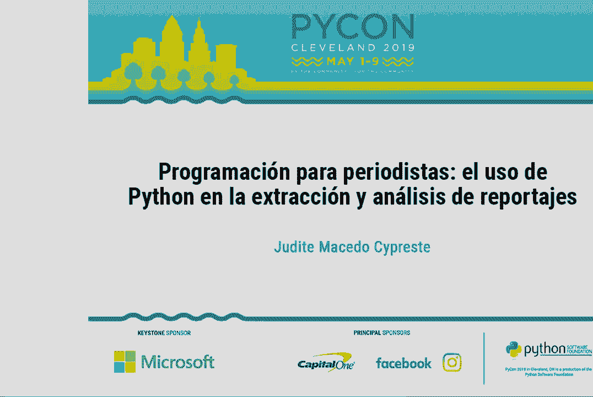
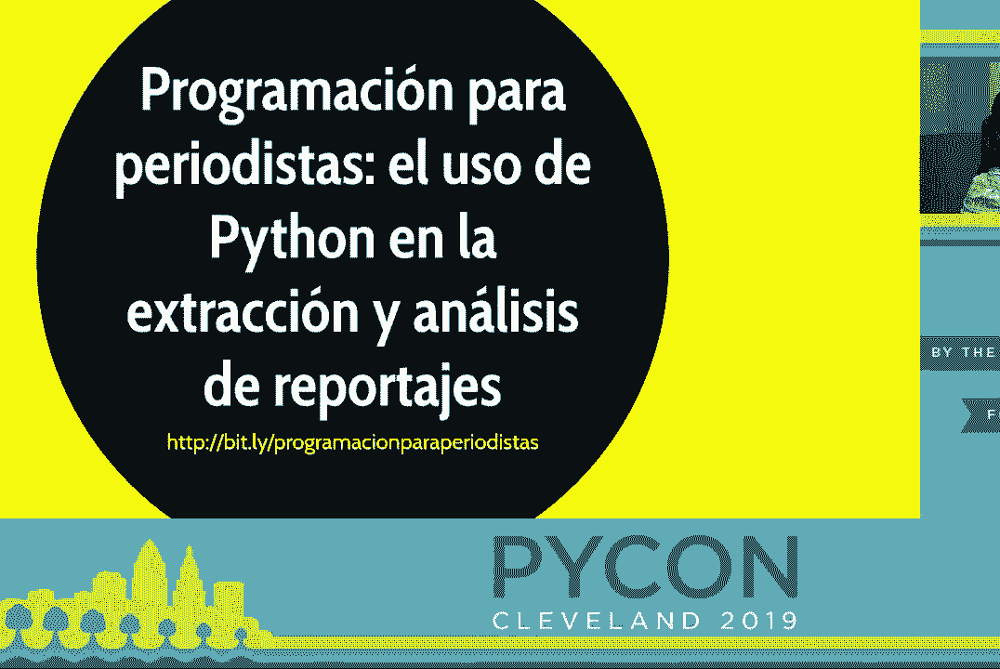
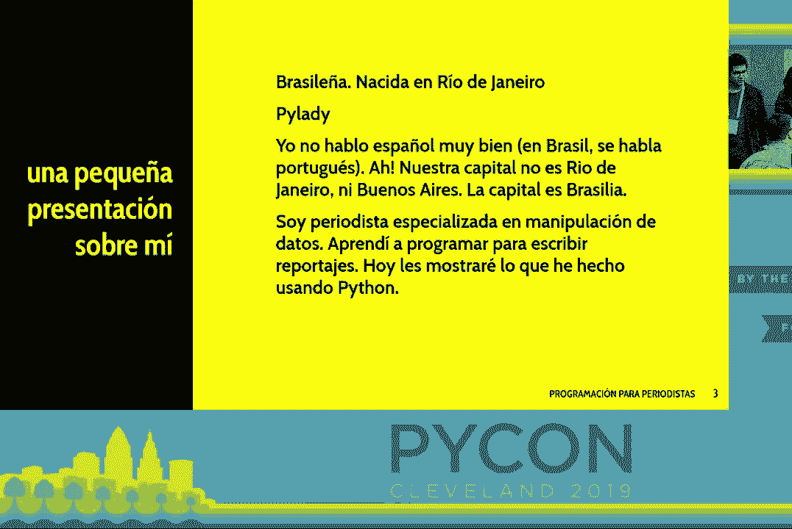
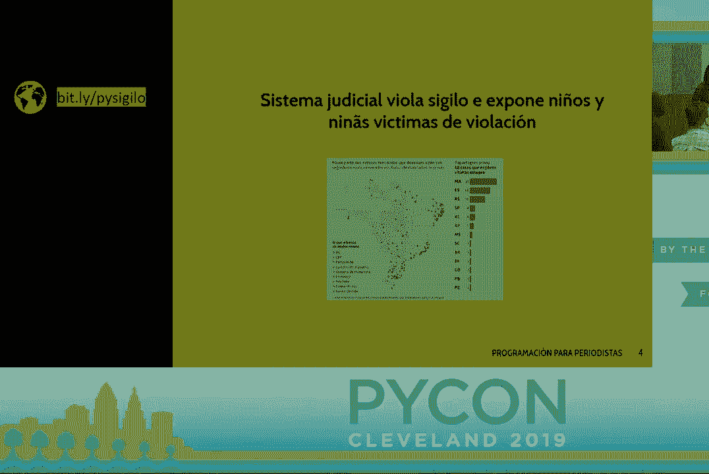
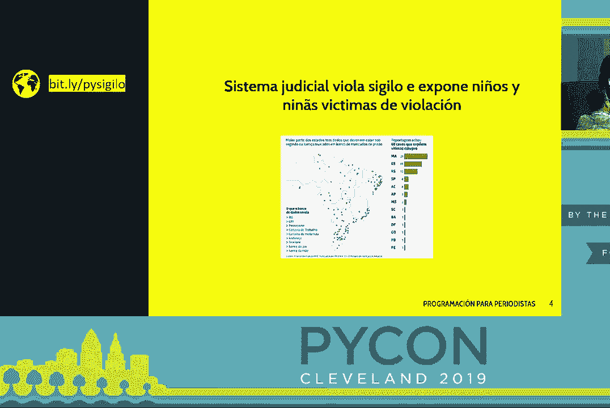
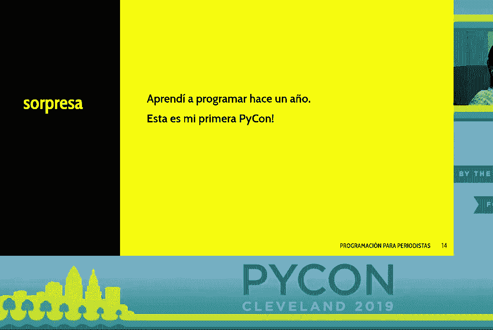
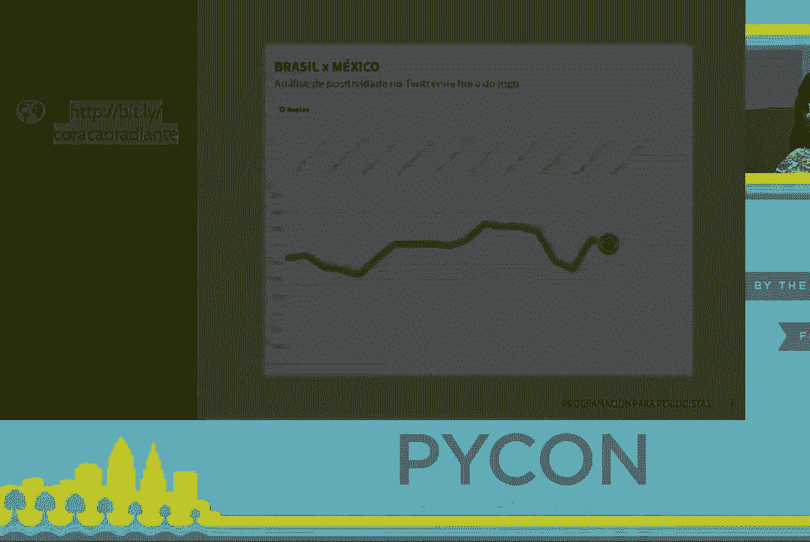
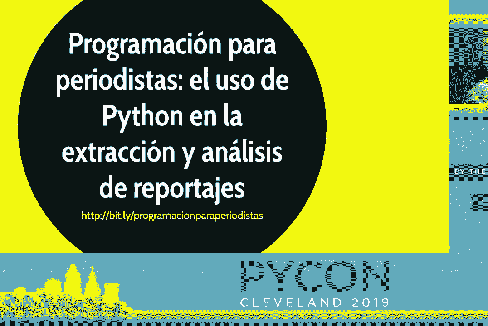

# P32：记者的编程 - Python 在数据提取和分析中的应用 - leosan - BV1qt411g7JH

[听不清]。

[听不清]， [听不清]， [听不清]， [听不清]， [听不清]。

[听不清]， [听不清]。

[听不清]， [听不清]， [听不清]， [听不清]， [听不清]， [听不清]。 [听不清]， [听不清]。

[听不清]， [听不清]， [听不清]， [听不清]， [听不清]， [听不清]。 [听不清]。

[听不清]， [听不清]， [听不清]， [听不清]， [听不清]， [听不清]。 [听不清]， [听不清]， [听不清]， [听不清]， [听不清]， [听不清]。 [听不清]。

[听不清]， [听不清]， [听不清]， [听不清]。

[听不清]， [听不清]， [听不清]， [听不清]， [听不清]， [听不清]。 [听不清]， [听不清]。

[听不清]， [听不清]， [听不清]， [听不清]， [听不清]， [听不清]。 [听不清]， [听不清]， [听不清]， [听不清]， [听不清]， [听不清]。

[听不清]， [听不清]， [听不清]。

[听不清]， [听不清]， [听不清]， [听不清]， [听不清]， [听不清]。 [听不清]， [听不清]， [听不清]， [听不清]， [听不清]， [听不清]。 [听不清]， [听不清]， [听不清]， [听不清]， [听不清]， [听不清]。

[听不清]，（鼓掌）。

[好的]。
