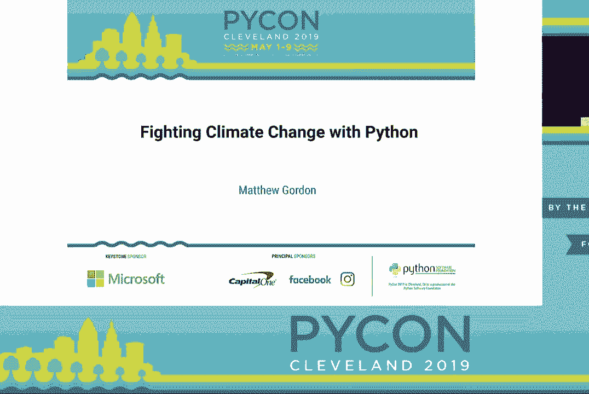
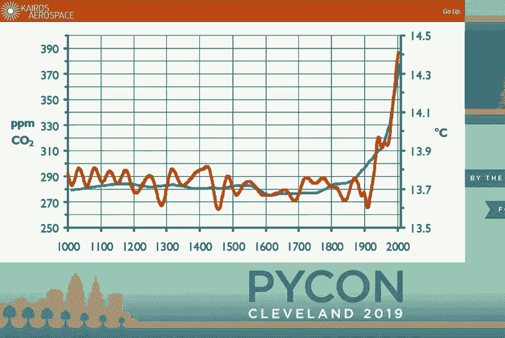
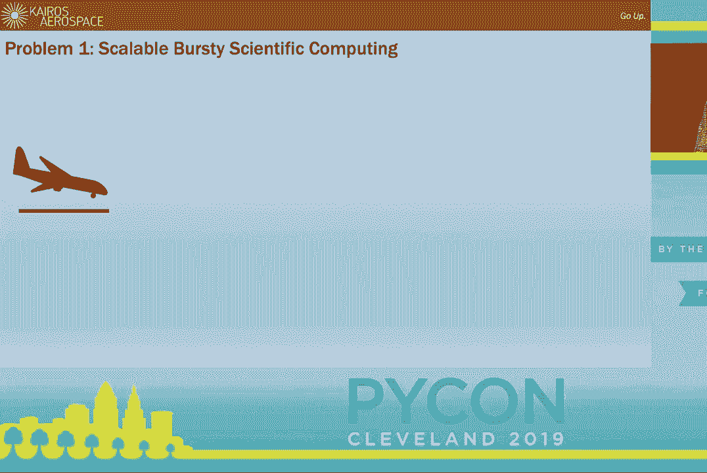
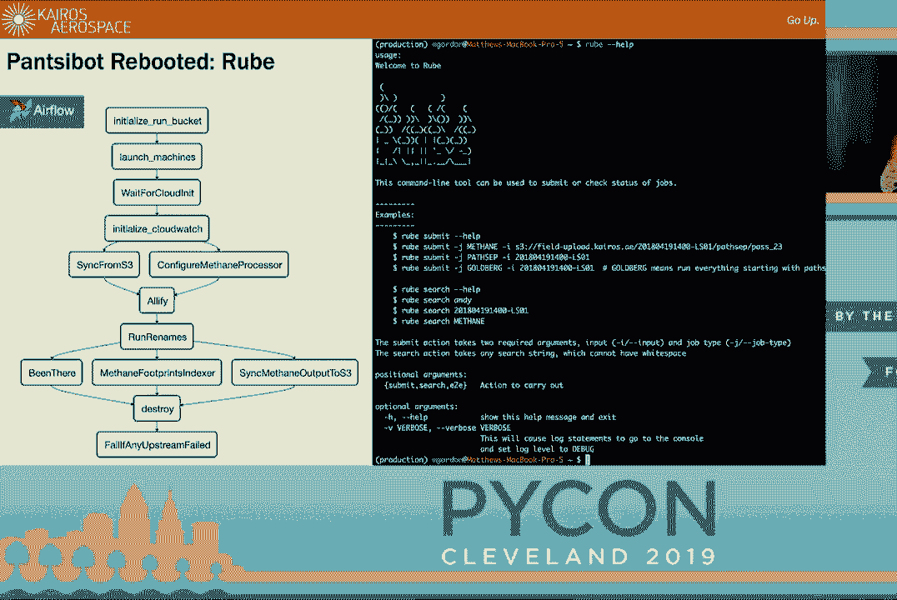
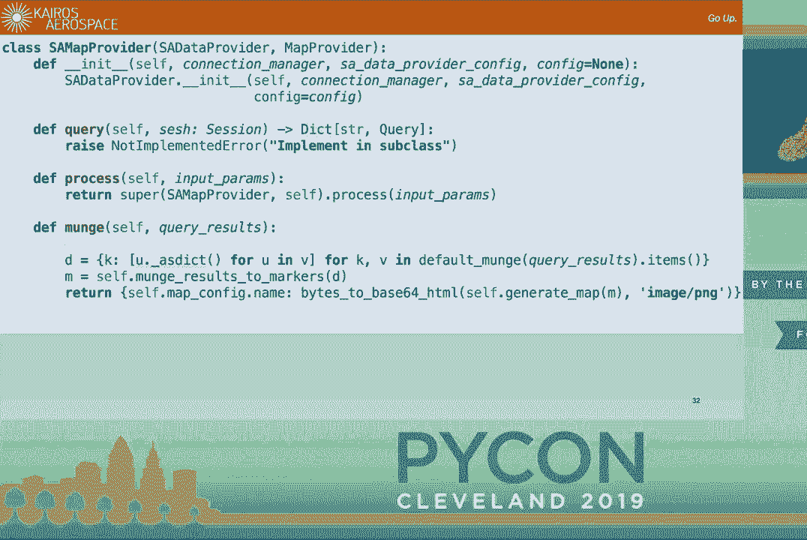
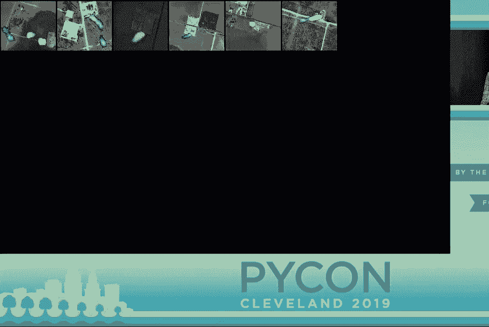
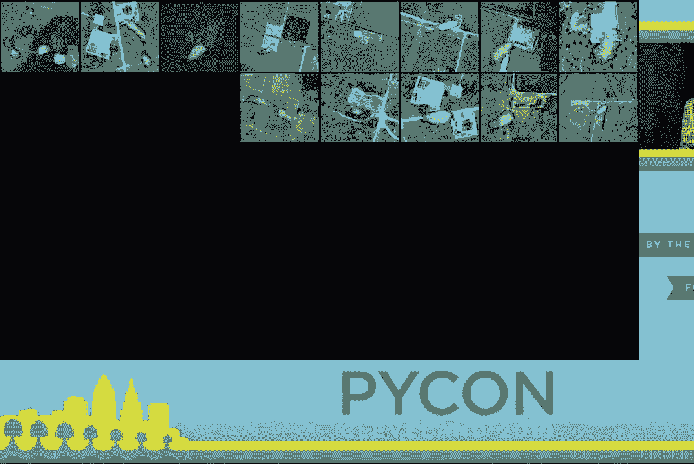

# Python 应对气候变化：P33：从传感器数据到泄漏修复的完整流程 🛰️➡️💻




在本教程中，我们将跟随马修·戈登在 PyCon 2019 的演讲，学习如何利用 Python 技术栈构建一个端到端的系统，用于探测和定位甲烷气体泄漏，从而为应对气候变化做出实际贡献。我们将涵盖从数据采集、云端处理、机器学习分类到生成可操作报告的全过程。



---

## 概述：气候变化与甲烷问题 🌍

气候变化是一个严峻的全球性问题。按照当前轨迹，到2050年全球气温可能上升2到2.5摄氏度，导致大规模人口迁移。造成这一问题的主要原因中，约57%来自化石燃料燃烧产生的二氧化碳，另有约14%-15%来自甲烷。甲烷是天然气的主要成分，其温室效应是二氧化碳的**60倍**。它是一种廉价、清洁的燃料，但由于水力压裂技术的普及，泄漏问题严重。甲烷本身无色无味，难以探测，因此开发有效的监测技术至关重要。

上一节我们介绍了问题的背景，本节中我们来看看解决这一问题的技术方案是如何设计和实现的。



---

## 硬件平台：机载泄漏调查仪 ✈️

为了解决大规模甲烷泄漏探测的难题，我们开发了名为“泄漏调查仪”的机载设备。该设备的核心是一个安装在塞斯纳飞机底部的传感器舱。

其核心组件包括：
*   **光谱仪**：用于检测大气中甲烷的特定吸收波长。
*   **6轴GPS**：精确记录飞机的**位置（经度、纬度、高度）** 和**姿态（滚转、俯仰、偏航）**。
*   **光学相机**：提供视觉背景，确认观测目标。

飞机以“割草机”模式飞行，扫描地面区域。传感器数据结合位置和姿态信息，通过专有算法可以生成显示地面甲烷浓度的地图。然而，硬件只是起点，真正的挑战在于数据的处理与转化。

---

## 云端数据处理：可扩展的突发科学计算 ☁️



数据采集后，首要任务是将大量数据（约100GB）从德克萨斯州的机场上传到云端进行处理。我们构建了一个基于AWS的云编排系统。

整个流程如下：
1.  原始数据上传至 **Amazon S3** 存储。
2.  S3事件触发一个 **Amazon SQS** 消息。
3.  云编排系统接收消息，启动一批高性能EC2服务器集群。
4.  服务器处理数据，并将结果输出回S3。
5.  处理后的数据被推送到 **PostGIS**（空间数据库）并供分析应用程序使用。
6.  处理完成后，所有服务器被终止，以控制成本。

这种“突发计算”模式将服务器视为可随时创建和销毁的“牛”，而非需要精心维护的“宠物”，实现了高度的可扩展性和成本效益。

为了实现流程自动化，我们最初构建了一个名为 **Pantsabout** 的作业调度器（MVP）。它基于Ansible，并具有以下优点：
*   简单的REST API和SQS接口。
*   集成的端到端测试套件，能自动测试整个管道。
*   失败作业监控与自动终止，避免资源浪费。

然而，Pantsabout也存在缺点，主要是滥用Ansible进行控制流管理导致逻辑复杂，且缺乏作业依赖关系的全局视图。这引出了“软件Jank生命周期”的概念：软件在达到“最大Jank”峰值（用户抱怨最多）后，经过修复会趋于稳定，但随着新功能请求，开发者会意识到最初架构的缺陷，最终到达一个重构与重写成本相等的“Jank拉格朗日点”。

在达到这个点后，我们开发了第二代系统 **Rube**。它基于 **Apache Airflow**，用Python编写可单元测试的操作符，保留了端到端测试，并提供了优秀的作业调度、重试和日志查看界面。这大大降低了管道维护的负担。

---

## 数据分割：从飞行路径到独立多边形 🧩

飞机飞行时，传感器持续采集数据。我们需要将连续的扫描数据分割成有意义的独立片段（多边形），以便后续分析。这本质上是一个分类问题：区分有效的直线扫描“通过”和无效的“转弯”数据。

我们首先使用 **Scikit-learn** 库中的 **K-Means聚类算法** 进行无监督学习。选择的特征变量包括：
*   偏航角的时间导数（`d(yaw)/dt`）
*   速度的时间导数（`d(velocity)/dt`）
*   飞机的滚转角（`roll`）
*   飞机的俯仰角（`pitch`）

```python
# 示例：使用Scikit-learn进行K-Means聚类
from sklearn.cluster import KMeans
# features 是一个包含上述变量的数组
kmeans = KMeans(n_clusters=2) # 假设分为两类：通过和转弯
labels = kmeans.fit_predict(features)
```

首次运行就达到了约90%的准确率。我们将结果可视化在一个单页Web应用中，供工程师手动检查和修正错误标签（例如，转弯时传感器指向地平线产生的异常数据）。经过约一年的人工修正，我们积累了一个高质量的标注数据集。



随后，我们改用监督学习算法——**Scikit-learn的多层感知器（MLP）神经网络**。关键步骤是对输入特征进行正确的归一化和白化处理。





```python
from sklearn.neural_network import MLPClassifier
from sklearn.preprocessing import StandardScaler

scaler = StandardScaler()
X_train_scaled = scaler.fit_transform(X_train)
mlp = MLPClassifier(hidden_layer_sizes=(100,), max_iter=500)
mlp.fit(X_train_scaled, y_train)
```

神经网络能够自动学习复杂模式，最终实现了“设置后即忘”的高精度自动分类，不再需要人工干预。

---

## 报告生成：从数据到可操作的指令 📄

处理数据的最终目的是指导现场人员修复泄漏。我们意识到，对于驾驶皮卡车的现场工程师来说，一个复杂的数据门户并非最佳选择；他们更需要简洁明了的行动指令。

因此，我们构建了一个报告生成系统，其核心设计是 **“抽象数据提供者（Abstract Data Provider）”** 模式。该模式基于 **SQLAlchemy ORM** 和 **Jinja2模板引擎**。

流程如下：
1.  **SQLAlchemy** 执行定义好的查询，从PostGIS数据库获取数据。
2.  数据通过“munch”方法转换为适合模板的格式（如字典列表）。
3.  转换后的数据与部分元数据一起被写回数据库，用于追踪报告状态。
4.  数据被送入 **Jinja2** HTML模板。
5.  渲染后的HTML通过 **DocRaptor** 服务（支持分页）转换为PDF报告。

该系统的优势在于其**可组合性**和**一致性**。例如，同一个用于查询泄漏点的SQLAlchemy查询对象，可以被不同的“数据提供者”复用，一个用于生成泄漏清单表格，另一个用于生成地图图像。这确保了所有输出报告中的数据都是自我一致的。

我们为简单的报告创建了“默认数据提供者”，允许将SQL查询和参数直接写入HTML模板的元数据注释中，极大提升了开发效率。

---

## 成效与总结 🎯

通过上述Python技术栈构建的系统，我们能够高效地处理甲烷泄漏探测数据。在我们的第一次大规模调查中，历时三个月，所减少的甲烷排放量相当于抵消了**2000个人一年的二氧化碳排放当量**。目前，我们正在进行规模扩大十倍的新调查。

**本节课中我们一起学习了：**
1.  **问题背景**：甲烷泄漏对气候变化的重大影响。
2.  **硬件基础**：机载光谱仪与GPS如何采集原始数据。
3.  **云端架构**：如何利用AWS服务构建可扩展的突发计算管道，并迭代作业调度系统（从Pantsabout到Rube）。
4.  **机器学习应用**：如何使用Scikit-learn（从K-Means到MLP神经网络）对飞行数据进行自动分类和分割。
5.  **软件工程实践**：如何设计可维护、可复用的报告生成系统，将数据转化为现场人员可执行的指令。


整个流程展示了Python生态中的强大工具（如Airflow, Scikit-learn, SQLAlchemy, Jinja2）如何整合起来，解决一个具有重大现实意义的复杂环境问题。从天空中的传感器到地面维修人员手中的PDF报告，Python在每一个环节都发挥着核心作用。