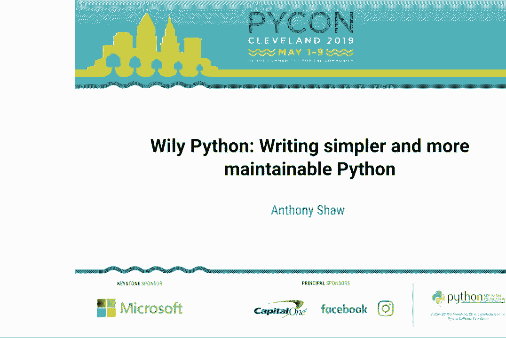
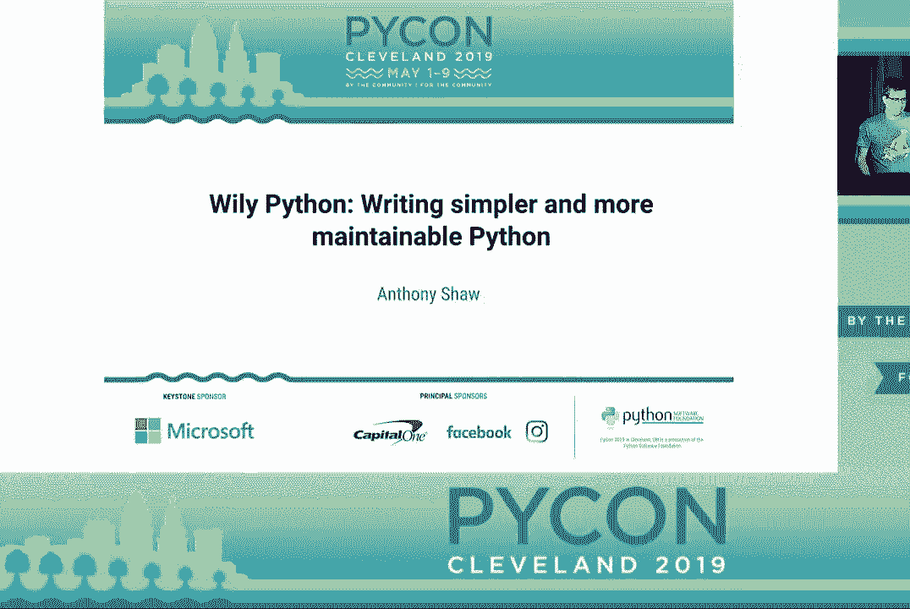
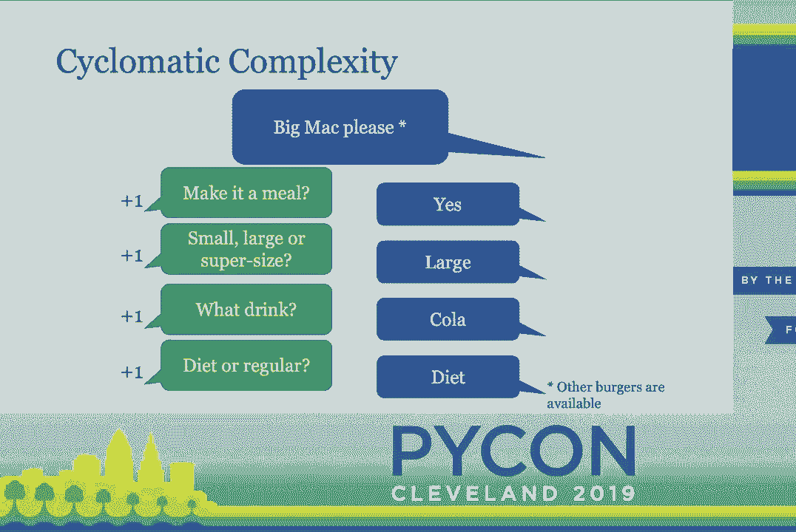
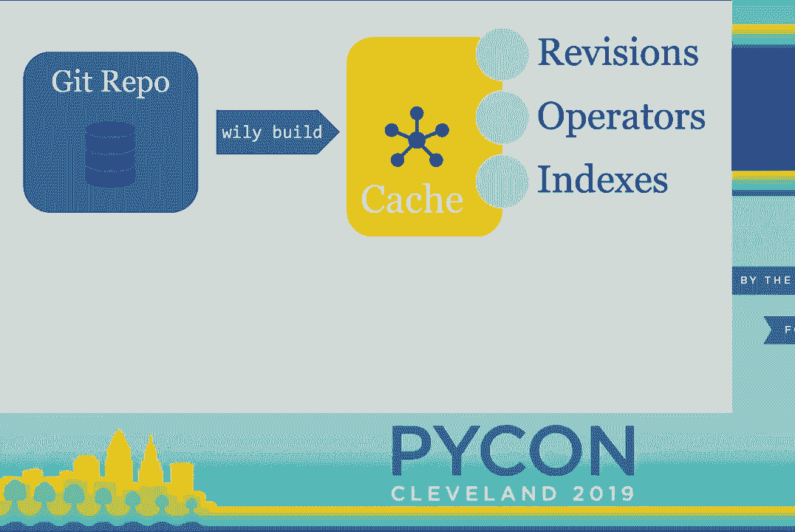
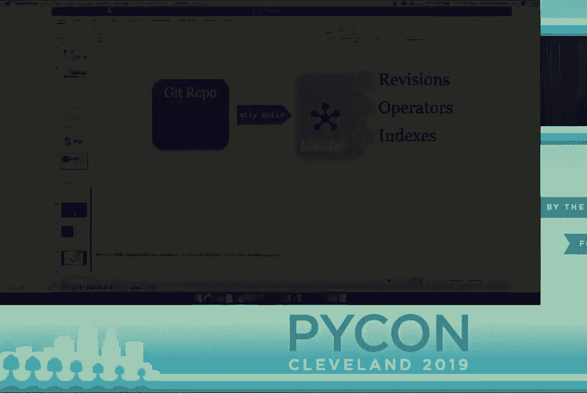
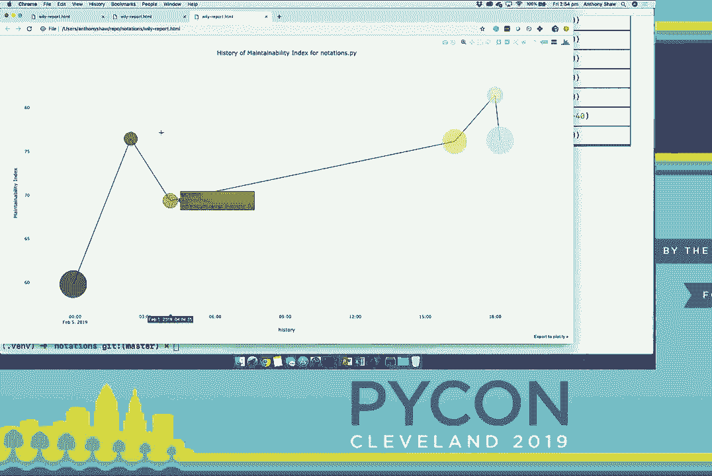
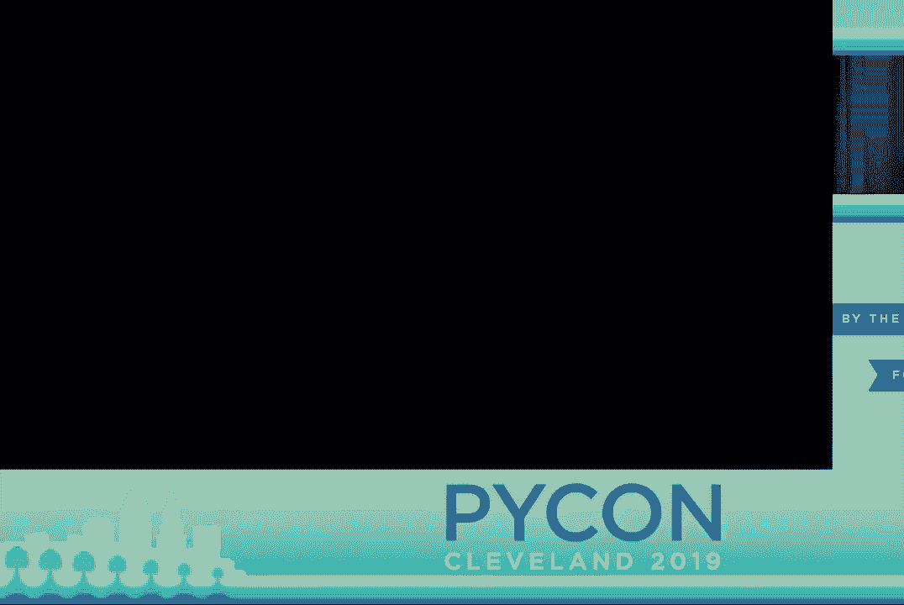
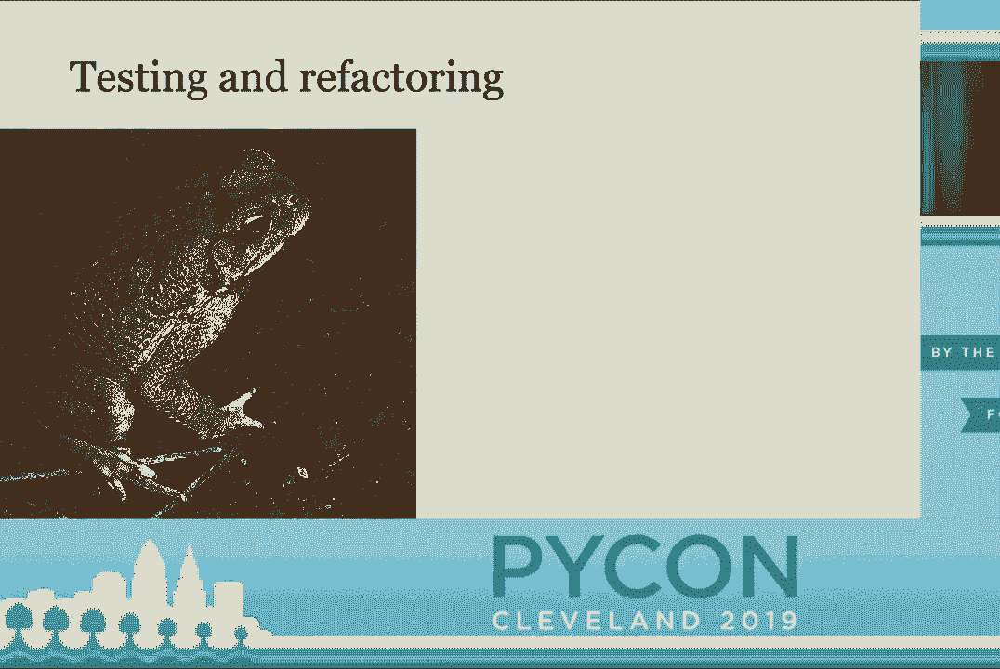
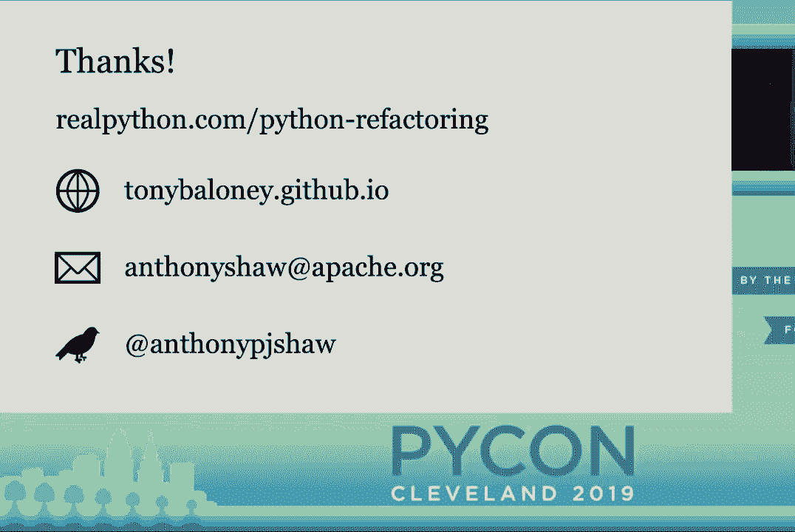

# P34：安东尼·肖 - 精妙的 Python - 编写更简单且易于维护的 Python - PyCo - leosan - BV1qt411g7JH

大家好。接下来的演讲是“狂野的 Python，编写更简单且易于维护的 Python”。

作者：安东尼·肖。[掌声]大家好，我叫安东尼·肖，我要讲关于简洁性和尝试。

编写更简单的 Python。这是我第一次在 PyCon 上发言。我非常紧张，我正在研究一些关于公共演讲的技巧。我找到了三个规则。规则第一是要经常停顿。规则第二是绝不要以道歉开始。然后规则第三是绝不要感谢人们来参加你的演讲。

演讲并假设他们在这里听。所以谢谢你们的到来。我们有很多内容要讲，所以我会快点，所以对此我表示歉意。今天我们将讨论代码复杂性。那么，这意味着什么呢？

你如何检查你的代码是否复杂？然后我们将不仅仅关注你的代码如何复杂，而是你如何实际衡量这一点？因为每个人都认为他们编写的代码是简单的，因为它对你来说是有意义的。但更重要的是与他人沟通，分享你的代码和想法。因此，我们。

我将讨论代码度量，然后我们可以谈谈如何简化代码，一旦你意识到它是否复杂。演讲的标题是关于“精妙的 Python”。所以我要介绍一个我写的演讲，叫做“精妙”，它基本上帮助你管理这个过程，了解你的代码是否复杂。

你如何衡量并简化它，然后基本上在循环中执行。我知道，今天可能有相当混合的听众，所以就演讲的复杂性而言，这确实是一个问题。第一部分真的比较适合初学者，然后第二部分是中级到高级。如果有人有任何问题，请提出来。

事后请来和我交谈，如果在演讲中有时间，我们可以进行问答。此外，我在 RealPython.com 上写了一篇详尽的文章，大约需要一个半小时阅读，所以这可能是我较短的文章之一。我鼓励你们去阅读，因为那篇文章中有很多更多的细节。我现在需要说服大家。

简单的代码是好的，那么如果你的代码复杂或简单，你为什么要在意呢？记住，你的代码不仅是为计算机编写的，它也是为人类编写的，Python 尤其几乎是用一种人们易于理解的语言编写的。当你用代码编写应用程序时，你是在为计算机留下指令，也为。

你的同事开发者。因此，不仅仅是在代码注释中，而是在实际代码中。在你命名函数、类、变量的方式，以及结构方面，应该为人们提供一套指示。因此，应该清楚你想要实现什么，以及你想用代码做什么，这就是为什么你需要简单的代码。

而不是更复杂的代码。此外，代码是一个活的事物，常常会变化。因此，如果你的代码难以理解，当人们想要对其进行更改时，他们更有可能误解你原本想要做的事情，从而引入错误。因此，你需要简单的代码，因为它更容易维护，更易于适应。

来增加更多功能。最后，复杂的代码难以测试，而测试是好的，希望我们都能对此达成共识。因此，你希望代码简单，以便可以测试，方便他人理解，并且能随时间进行适应。那么，如何衡量代码是否复杂呢？这个非常简单的示例使用了最粗糙的方法。

衡量代码大小的指标就是代码行数。计算我们在这个应用中的代码行数非常简单，理论上你希望代码更少，所以你希望代码行数更少。但我可以用更少的代码行表示同样的代码示例，但这个例子有一个巨大的问题。因此，我在这里使用了一些奇怪的 Python 语法。

它基本上与这个完全相同，但它只用了三行，因此代码更少，这应该是好事。但正如蒂姆·彼得斯所说，可读性很重要。因此，代码行数并不是衡量复杂性的标准，而更多的是关于体积，你真正要关注的是应用的大小，以及鼓励人们。

写更少的代码实际上可能会导致错误的行为，因为人们最终会将内容压缩到不易阅读的地步。因此，代码行数并不能真正反映复杂性，它仅仅是关于数量，还有其他衡量复杂性的指标。其中一个指标称为圈复杂度，我想用在麦当劳点汉堡时的例子来解释。

你首先做出一个决定，就是你到底想吃什么。假设你想吃一个巨无霸，而其他餐厅也有其他汉堡可供选择。所以你开始时的圈复杂度是 1，你做出了一个决定。然后他们问你是否想将其做成套餐。

这会增加复杂性。然后他们问你想要什么样的？再来一个，你想喝什么饮料？如果你想要的是低糖可乐还是普通可乐。那么，从麦当劳点一个巨无霸的圈复杂度是五。所以想象一下，你去麦当劳，他们问你 16 个不同的问题，到底是在哪个点。

你会说它变得非常复杂。所以循环复杂度就是这样，因为当你尝试阅读一段代码时，你必须理解所有的决策及其。

get made。然后我选了这个代码示例，如果它有点小我表示歉意。这实际上来自 Python 标准库中的一个模块 local.py。所以在 Python 中每当有 if、else 或 for、try 语句时，它都会使循环复杂度增加 1，因为这是代码中必须做出的决策。

关于复杂性，当你阅读这个代码示例时，如果我让你表述这段代码的作用，你并不是仅仅在阅读一系列语句，而是在看每个 if 块并思考“如果这个变量是这样，那么会发生什么”。你需要在脑海中存储这些基本的信息，就像你的。

拥有自己的值栈并开始评估代码，而如果它只是一个平面的语句序列，你可以逐一看到每段代码的作用。所以这是一个复杂的代码片段，它具有较高的循环复杂度，确实需要一些时间去阅读和理解，但我认为还有一种更简单的方式来看待循环复杂度。如果你把代码横过来看看。

然后拿个笔在空白处画一条线，你会看到这个。所以我想说的是，与其仅仅计算循环复杂度，如果你的代码在侧面看起来像山脉，那么它的复杂度就很高，另一个引述来自 Tim Peters，扁平优于嵌套，因此扁平代码更容易理解。

更容易处理，这个示例的复杂性很高，因此你可能会走进来看“好吧，让我们让它更扁平、更简单”，但我认为你遗漏了一个原则，那就是复杂代码中其实有智慧，我也会谈论这一点。所以大多数 IDE 都有 Git blame 工具，如果你曾经使用过 Git blame，我已在。

在同一个模块中，只是再往下几行，你可以看到每段代码的修改者、时间和原因，我们有来自 19 年前、15 年和 12 年的修改。每当有人添加或修复问题、修复边缘案例时，他们都会进入并进行修改，通常以 if 语句或小修改的形式出现。

因此，代码的复杂性增加了，所以如果你试图直截了当地说“让我们简单一点”，实际上你需要理解代码之所以如此的所有原因。你可能会错过的另一件事是，如果不引入这个，你可能会重新引入已经解决的错误，这会让用户不安。

简单来说，当你开始一个新的应用程序时，通常功能很少且用户也不多，所以代码量和认知复杂性都应该较小。随着你添加更多功能，代码量往往会增加，因此代码行数的度量会提升。随着用户增加，你需要支持。

更多的边缘情况、更多的平台、更多的场景，代码的认知复杂性也往往会增加，然后当你有很多用户和很多功能时，会形成双重打击。因此，CPython 是一个很好的例子，它被数百万人使用，具有大量的用户和功能，因此它的复杂性很高。

对于大型应用程序，代码行数和认知复杂性并不能真正作为度量，那么你可以使用什么呢？我将讨论 Stedmetrics。我需要提醒的是，这一部分有点数学内容，如果你觉得数学部分太复杂或者超出你的舒适区，请不用担心，还有工具可以为你计算这些内容。

这个度量实际上自 1977 年以来就存在，早于 Python，背后的研究也非常古老，到现在已经有 50 年了，所以这个研究实际上已经超过 50 年。好吧，让我们介绍两个东西。有一个称为操作数的值。操作数是你所用值的总和。

你使用的变量总和，比如数字一或字符串常量将计为一个值，而名称将计为一个变量，因此，如果你把所有这些相加，就得到操作数。如果你加上你在应用程序中使用的内置语法数量，这被称为操作符。如果你把使用过的操作符和操作数相加，你会得到。

最终得到一个称为长度的度量，如果你计算一下你使用过的唯一操作符和唯一操作数，你会得到一个称为词汇量的度量。因此，这听起来可能比代码行数复杂得多，而代码行数是一个相对简单的度量方式，但这背后有原因。如果有人熟悉抽象的话。

语法树基本上是你的代码编译后转变为树的过程，然后被解释为树。因此，我这里有一个简单的代码示例，包含一个函数和三个语句，我将把值一赋给一个名为 A 的变量，接着将其加一并赋给一个名为 B 的变量，然后返回 B。

在树结构中，你有两个赋值操作，然后是返回语句。在第一个赋值中，变量是 A，值是数字一。因此，绿色部分的所有内容都会相加，然后黄色部分也会相加，得到操作符和操作数，这里开始变得稍微复杂一些。

不幸的是，这变得更加复杂。我们还有体量和难度，所以你需要将长度乘以词汇的对数，以获得体量，这比代码行数更好。这个让我困惑了一段时间，但基本上它试图计算你如何重用代码，以及为了实现某个功能你使用了多少代码，然后给出结果。

你可以将其视为一个难度变量。最后你得到的努力是这两者的乘积。所以所有这些都是非常理论化的，但基本上有更好的方法来衡量应用程序中的代码量、使用的变量数量以及使用的语法数量。这些基本上是为了达到一个单一的数字。

其实有比这更好的衡量代码量的方法。不要太担心这个公式。这个公式有不同的版本，但被称为可维护性指数，输出值是从零到一百的数字，形成一个比例。因此，如果你运行代码的可维护性指数，它会给你一个数字。

如果这个数字在零到二十五之间，意味着你的代码是不可维护的，稍显混乱。如果在二十五到五十之间，像我的高中老师说的那样，值得关注。如果在五十到七十五之间，那就是现实中大多数应用程序的位置，但你仍然可以看到改善的空间。

如果超过七十五，我就不相信你了。实际上，这个指标在微软的应用程序、Java 应用程序以及 Python 中都被使用。这是我们在 Wiley 中用于计算指数的公式。如果你不想坐下来手动计算，基本上它就是在计算死亡体量。

循环复杂度和代码行数。因此，如果你使用了大量的代码、变量、语法和嵌套来实现某个功能，你的可维护性指数就会降低。这时你就会发现代码位于红色区域。而如果你的代码简单扁平，就会位于绿色区域。

代码中有太多功能和变量，而代码量并不多，所以这就是它将位于绿色区域的原因。因此，你不必手动计算这些内容，可以使用一个叫做 radon 的包。在命令行中，你可以运行 radon，然后使用你想要的算法，CC 是循环复杂度，接着给出文件名。

你想运行的内容，它会基本上为你计算这个数字并给出输出。你也可以做 MI，即我刚才提到的可维护性指数，它显示我的应用程序是 87.42，这相当不错，但只有四行代码，所以这是可以理解的。最后你可以运行如何算法，它会给你所有的度量。

它还输出了另一个我从图像中裁剪下来的结果，实际上是它在你的代码中发现的错误数量。理论上你可以根据代码的量计算错误的数量，但这个理论已经有 50 年的历史了。因此，你得到了这些数字，你查看这些数字并想，好吧，这个。

有趣。我有一个九个的词汇量和一个计算长度为 20.26 的词汇量。那么，这是否告诉你你的代码是否可维护？

所以我确实在研究这个问题，这就是我想出了 Wiley。Wiley 是一个工具，它基本上观察你的代码的维护性和复杂性是如何随时间变化的。因此，它假设你的代码在一个 Git 仓库中，它会回溯 Git 历史，基本上对每个修订版本运行复杂性度量，然后将其存储在一个平面文件中。

文件数据库，它允许你查询并查看你代码应用程序中的维护性和复杂性的趋势。所以我将给你演示这个。因为我没有。

相信现场演示，我要进行魔术表演。运行 Wiley 的方式是你运行 Wiley build，然后给它你的应用程序的路径。它会检查 Git 中的所有修订版本，然后基本上对它们运行度量。所以这些度量，包括环形复杂度、代码行数等所有这些，并将其放入数据库中。

所以开始使用 Wiley 是相当简单的。它对于测试应用程序也非常有用，我稍后会谈到。你只需输入 Wiley index，它会给你一个它已检查过的所有 Git 修订版本的列表。然后当你运行 Wiley report 并指定一个文件名时，它会给你一个包含一些度量的表格。

每一行都是一个 Git 修订版本，如果因为某种原因复杂性发生变化，维护性指数就会下降。在这里你可以看到它下降的幅度，以及环形复杂度是如何增加的。因此，这对于查看特定文件并观察它们随时间的趋势非常有用。你也可以将其作为一个预提交钩子使用。因此，当你对代码进行更改时。

如果你运行 Wiley diff，它实际上会显示该特定文件的代码复杂性是如何变化的。因此，如果你将其用作预提交钩子，当你运行 Git commit 时，它会查看你在代码中所做的所有更改，并在屏幕上打印出你是否使应用程序的维护性变得更差。

循环复杂度，它会将复杂性细分到函数级别。因此，在这个例子中，我只是添加了一个名为 test8 的测试函数，它仅添加了几行。代码和另一个测试案例，所以它会为我打印信息。然后最后，你可以对这些指标进行图形化，所以如果我对我的测试文件进行图形化，想要。

随着时间推移查看可维护性指数，那么它会为我打印出一个交互式图形，图上的每个点实际上都是 Git 修订版。及其原因，还有 Git 提交的作者。所以这是一个小玩具演示，但对于一个大型应用程序，你可以尝试另一个示例。所以我可以看到。

每次 Git 提交后我的代码的可维护性指数是如何变化的，最后。你可以将多个指标结合在一起，所以如果你想查看可维护性指数和。代码行数，可以给出多个度量，它会将第二个度量作为气泡。大小添加，因此我基本上可以查看我的代码随时间变化的情况。

好的，使用 Wiley 你可以跟踪代码的复杂性，然后你可以开始重构。

使其变得更简单。我还想指出的是，当你开始关注应用程序中的复杂性时，你会发现一些模块。一些文件的复杂性远高于其他文件，其原因在于复杂性有其自身的引力。因此，如果你有一个函数。

你开始为应用程序添加边界情况，随着应用程序的发展，你会发现自己。越来越多地为那个函数添加边界情况。如果你有一个所谓的“上帝类”或某种模块，基本上会处理所有情况，那么这将。带来越来越多的复杂性。所以我想指出这个原则，因为我认为。

在开始重构时重要的一点是，你需要开始做的是将复杂性分散到你的代码中，拆分它，并遵循一种称为。单一责任原则。单一责任原则是指任何函数或任何代码片段应具有一个责任。你不应该有一段代码。

正在尝试实现所有功能，因为那样就变得不可维护。它的特性太多，测试起来非常困难。这个可爱的生物是红蟾蜍，这里有来自澳大利亚的人吗？后面有一个。你可能认得它。所以有毒的红蟾蜍是。

1935 年引入澳大利亚，希望能够控制破坏性的甘蔗甲虫种群。那么我为什么要谈论这个呢？它们在控制甲虫方面表现得很糟糕，但在繁殖方面却异常成功。它们在澳大利亚没有天敌。因此，基本上它们已经感染了昆士兰州这个北部州。我提到这个的原因是。

当你考虑重构代码时，如果没有一个好的测试套件，因为我认为甘蔗甲虫种群的测试覆盖率相当差，实际上并没有很好地理解实际环境的复杂性。人们只是认为这会。

这是一个快速解决方案，我们可以解决这个问题。因此，应该给予高测试覆盖率。重构任何应用程序之前，必须注意。然而，高测试覆盖率并不意味着你已经检查了所有行为。因此，当你考虑重构应用程序时，需要了解应用程序可能的所有行为，以便新代码能够表现得正确。

以与旧代码相同的方式进行测试。测试是一种方法。另一种方法是帮助你的用户为你发现 bug。最后，你可能会遇到的一个困难情况是，当你重构时遇到一个 bug。而不仅仅是一个 bug，而是一个已知的 bug 和一个预期的 bug。所以如果有人曾经遇到过这种情况。

这是重构中最有趣和挑战性的事情之一。你重构了一个代码库，遇到了这个问题，想怎么可能会这样工作？然后你意识到它并不工作，并且有一个副作用使其他东西能够工作。而重构它的唯一方法是要么在你的新代码中重现这个 bug，要么解决这个。

问题并向所有用户解释为什么你会破坏兼容性。还有第三个选项，但我不知道是什么。所以这是一个需要注意的棘手问题，但正如我所说，测试至关重要。因此，我想总结一下，Wily 可以帮助你跟踪代码库的复杂性，并随着时间的推移进行测量，原则是你将会这样做。

复杂度度量是长期的。仅仅计算应用程序的复杂度是有趣的，但重点在于你希望它能够改进。并确保你有良好的行为或测试覆盖率。有一些工具可以用来实现这一点。Pytest 显然是一个很好的测试套件，还有一些覆盖工具适用于 Pytest，但它们。

只查看行覆盖率。它们实际上并没有查看你测试不同行为的方式。有一些自动化工具可以做到这一点，但最好的方式是查看功能和特性来描述它们，并确保你对每个特性进行测试。经常重构，这不应该是一个年度事件。

坐下来并说让我们清理一下我们的代码库。这应该是一个经常进行的事情。如果你经常重构代码，你会发现你需要重构的数量、你需要处理的琐事和边缘情况都要小得多。因此，如果你考虑使用像 Wiley 这样的工具来衡量复杂性。

你可以看到每个冲刺或每天代码的复杂性是如何增加或减少的。这应该鼓励你的团队进行重构。最后，分而治之。如果你要重构任何重要的代码库，一开始可能会很令人畏惧。我的一些建议是从小的东西开始，先从有良好测试的代码入手。

覆盖率和一些你可以理解的内容，先重构那个模块，然后再从那里扩展。不要试图一次性重写整个代码库以改善简单性。每个人一开始都是怀着最好意图，但你可能会发现自己在处理一堆蝾螈。所以这实际上总结了我的演讲。

如果你想了解更多关于重构技术的细节，我在 realpython.com 上写了一篇文章来解释这个。如果你想查看我的网站，可以在 GitHub 上找到。如果你有任何问题想给我发邮件，这是我的电子邮件地址。如果你想在推特上联系我，这是我的账号。我们还有五分钟。

有问题的话。非常感谢。有任何问题的人，请到这个麦克风前。那边也有一个麦克风。所以可以去任何一个麦克风。 \>\> Wiley 是什么？

你如何获取它？这是一个产品还是？ \>\> 这是一个 PIPI 上的包。所以只需运行`pip install Wiley`，你就可以在命令行上使用它。 \>\> 太好了。谢谢。 \>\> 嗨。关于 Halsted 的公式。我记不得它叫什么了。里面有一个常数。大约是 171。那是什么？ \>\> 我不知道。

\>\> 你展示的 Wiley 示例似乎是在单个文件上操作。能否在整个项目上运行？ \>\> 是的。我玩过这个。但答案是可以。你通常只需给它你整个项目的路径。如果你想对一个文件夹运行报告，它将为你提供每个文件的指标，或者你可以将它们汇总成一个指标。

这是为大型应用程序设计的。但我只是用它处理了一个小示例。否则，编译将花费太长时间。谢谢。 \>\> 很棒的演讲。我喜欢一切。我同意你说的每一句话。你是如何让团队达成共识的？

\>\> 我认为如果你看看人们需要做出改变的时刻，他们会意识到，复杂性使得更改更难。如果你在那个时候让他们明白，看看这就是为什么我们需要更简单的代码。我认为这可能是一个机会。如果你把它说成是让我们对代码库进行一次大规模重构，你实际上就是在。

把自己置于会产生不可用代码或无法编译的分支的境地，或者你如何为多个冲刺进行衡量，这真的是一个很难的推销。因此，它需要是一个小的工作量。 \>\> 太好了。谢谢。 \>\> 太好了。 \>\> 好的。谢谢。谢谢。谢谢。谢谢。谢谢。谢谢。

