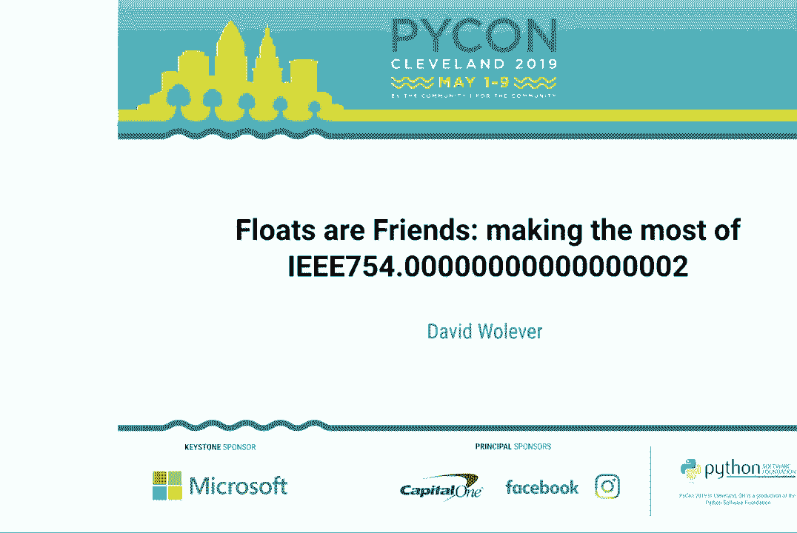

# P4：大卫·沃利弗 - 浮点数是朋友 - 最大化使用 IEEE754.0000000000000000 - leosan - BV1qt411g7JH

大家早上好。我们要开始了。所以今天我们有大卫，沃利弗。他是 PyCon Canada 的创始人。他将讲述浮点数是朋友，最大化使用 IEEE 754。如果你有问题，我们将不进行问答。他在演讲结束后会在门外。请热烈欢迎大卫。

嗨，大家好。我是大卫·沃利弗，我非常兴奋今天能在这里和大家谈谈浮点数。不过，我很好奇，你们到底在这里做什么？

还有很多其他精彩的演讲。你为什么想听关于浮点数的内容？

如果你不介意发个推特告诉我是什么让你来到这个演讲的，而不是其他精彩的演讲，我非常想听听。第二个小请求，前面的朋友们，如果你不介意给我拍一两张照片，我会很高兴有一些东西给我妈妈看看。谢谢。最后，我需要道歉。

对于我在演讲标题中所采取的艺术许可。754 可以在浮点数中精确表示。抱歉。所以，在这次演讲中，我想多告诉你一些关于浮点数是什么，它们是如何工作的，以及它们为何会做出奇怪的事情，因为它们绝对不是最好的。但同时，它们也不是绝对最糟的。

不管怎样，我们绝对是要面对它们。所以，希望在这次演讲结束时，我并不期望你会喜欢它们。但至少，希望你能稍微更好地理解它们。因此，要理解浮点数，我们需要后退一步，看看浮点数存在的原因。为了理解这一点，我们需要了解数字是如何的。

在计算机中表示的。所以，整数，这些相当直接。我们取一块内存，在那块内存中，二进制数和我们日常处理的整数之间有一个很好的一对一映射。我们的 1 是 2，我们的 5 等等。而这个方式。

我们所做的表示法或多或少是你如果有任何阅读经验的话，所习惯的。关于二进制表示法。有一点你会注意到的是，在这个例子中，我没有包括任何负数。负数是用一种叫做二的补码的表示法来表示的。二的补码，在我看来，是一种绝对的美。真心建议你。

演讲后去查一下。但不幸的是，这里讲的是浮点数，所以我们不能深入讨论。总之，整数和计算机的整个数字表现得相当好。使用 32 位整数，我们可以表示大约 20 亿到负 20 亿之间的数字。如果我们将其提升到 64 位长整数，能表示高达 9 千万亿。

事实证明，对于我们处理的数据的整数，即实际数字，那个范围实际上是相当足够的。我们通常不需要比这更大或更小。然而，当我们开始处理分数数字时，事情就变得有点困难了。想要理解原因。

想象一下你如何实现分数数字。我们可以说我们取这块内存，将其一分为二，第一半将是整数部分，第二半将是小数部分。这看起来可能像这样。如果我们有一个 1。

在小数部分中，这是 2 的 8 次方分之一，所以是 0.125。如果我们在小数部分有一个 2，那将给我们 1/4，0.25，依此类推。但你会注意到，这种表示方式下，我们实际上无法处理很大的数字范围。如果我们只使用 32 位，最小的数字是。

可以表示的是 1.5 乘以 10 的负 5 次方，所以这就像小数点前有 4 个 0 和一个 1 和一个 5。而最大的数字只是 131,000。我们可以使用，比如说，64 位，而不是之前的小数点前 32 位和小数点后 32 位。这将给我们带来更多的空间。我们可以降低到 10 位小数。

精度大约，我们可以处理的数字可以达到大约 40 亿。但是，我的意思是，第一个警告是这完全忽略了负数。第二个警告是，在现实世界中，事实证明，当我们用实数来表示事物时，我们表示的东西往往是在一个更大的范围内。你知道的。

我们必须处理像到冥王星的距离，这是 75 亿公里。我们可能想表示一些非常小的东西，比如水分子的大小。三分之一个纳米。在这个我们刚刚讨论的简单系统中，这个系统是我们使用一定数量的位来固定位置。

小数点，固定点数，如果你愿意。我们会遇到一些问题，因为我们可以表示的范围是固定的。实际上，这不能处理我们在现实世界中必须处理的很多数字。所以，我相信你们都是聪明的程序员，你们的大脑正在思考如何解决这个问题。

你可能想到的是一个系统，稍微像这样。我们说，“好吧，我们有这个数字。”在这个数字旁边，我们存储一个缩放因子。所以，对于到冥王星的距离，这将是 7.5，而我们的缩放因子是 10，这会将 7.5 推到左侧。然后对于非常小的数字。

比如水分子的大小，我们会使用一个负的比例因子，将它向右推。因此，这可以说是一个系统，这样就可以移动小数点的位置。小数点在浮动。这几乎就像我们有一个浮动点。结果果然是，这就是浮动所做的。在计算机内部。

浮点数有三个不同的组成部分。第一个位是符号位，控制它们是正数还是负数。第二组位是指数。基本上就是我们刚刚讨论的位移或缩放因子。最后，第三部分是小数部分。这是实际的数字部分。它也是。

如果你想要听起来高大上的话，称之为尾数（mantissa）。所以，你通过取符号，乘以指数的 2 的幂，然后乘以小数部分，来计算浮点数的值。如果你之前接触过科学计数法，这和二进制的情况是完全一样的。这就是二进制科学计数法。

为了具体举个例子，假设我们想表示 0.5。0.5。这是一个非常好且容易表示的分数，因为它是 1/2，或者是 2 的负 1 次方。因此，我们将有一个符号为 0，因为它是正数。指数为 4。现在，4 的指数有点奇怪。这是因为指数是所谓的偏置。

由于我们需要表示正负指数，因此引入了一个固定的偏置。在这种情况下，我们将使用 3，哦，是的，这样显示得很好。我们从偏置中减去存储在数字中的指数，以获得实际值。最后，我们只想要一半，因此乘以 1。几次。

其他例子：3.25。这是 2 的负 2 次方。因此，0.25 乘以 13。或者，对于负数，我们在符号位上有 1。我们想表示负 88。因此，指数是 4，也就是 2 的 4 次方，8。然后乘以 11。抱歉，2 的 3 次方。抱歉，4。但这很糟糕。不管怎样，我们有很多更多。不管怎样。

这很不错。所以，我们有这个数字系统。你可以看到我们如何缩放来表示非常小或非常大的数字。为了给你一个关于该系统实际范围的概念，32 位浮点数。这些是过去系统使用的那种较旧的浮点数。它们有一个指数。

它的长度是 8 位，分数部分的长度是 23 位。64 位浮点数，双精度。这是你在几乎所有现代计算机或编程语言中使用浮点数时的默认设置。它们有 11 位指数和 52 位的分数部分。因此，它们可以表示像小数点后有 300 个零那么小的数字。

还有一个后面有 300 个零的数字。所以，这个范围相当不错。我们可以表示一个相当大的数字范围。但是，正如一切事物一样，这里也有取舍。浮点数的取舍在于精度，即我们的数字可以变得多小和数量级。如何。

数字可以变得多大呢？例如，我们可以测量到冥王星的距离。但是，这个测量不一定精确到米。而且我们也可以非常精确地测量水分子的大小。但是如果我们需要同时测量十亿个水分子，就会遇到一些麻烦。因此，给你一个。

精度误差的具体例子可能是什么样的。假设我们有一个小数字 0.1 或 0.1。还有一个非常大的数字 1E20。仅仅是指数表示法，1E20 意味着 1 后面跟着 19 个零。如果我们尝试将 1 加到后面有 19 个零的 1 上。你会注意到这个大数字的数量级完全。

它掩盖了小数字的精度。而这个 1 完全消失了。实际上，仿佛它从未存在过。那么，作为普通程序员的你，不想专门去学习数值分析只为了一起加数字，你该如何处理这个问题？所以，我希望你记住的第一个经验法则是，对于一个。

双精度浮点数（64 位浮点数），你可以获得 15 位有效数字。这意味着浮点数中的 15 位数字通常是可靠的。但是，如果你尝试加减不同数量级的数字，你会失去精度。例如，假设我想将 1、2、3、4、5 加到 1E15。

1E15 有 15 位数字。这是安全的。你会注意到我们得到一个确切的结果。但是当我们移动到 16 位有效数字时，我们会开始失去一些精度。这个问题随着大数字的增加而只会变得更糟。值得注意的是，乘法和除法没有问题。它们不受影响。

最后，如果你真的遇到不幸的情况，需要将很多浮点数相加，有一些非常好的库可以做到这一点。为了说明它们的作用，首先考虑这个简单的求和。所以，我们将取一个非常小的数字，比如一个非常大的负数，添加 1，然后再添加一个非常大的正数。理想情况下，我们应该得到 1。

但由于浮点数舍入误差，使用 Python 内置的 sum，我们得到 0。然而，如果我们使用 math.fsum，我们将得到确切的结果。这是因为 math.fsum 在内部做了一些非常巧妙的事情。每次执行加法时，它都会跟踪丢失的精度。

四舍五入误差，并将其存储在一个单独的列表中。一旦我们将主列表中的所有数字求和后，我们再去求和这个四舍五入列表中的所有数字，然后将其加上。因此，它会变得非常精确。当然，这里的权衡是运行时的。你需要进行更多的加法运算，而且计算成本更高。

另一个有趣的内容是 NumPy 的 sum。现在，在这个例子中，NumPy 的 sum 实际上是错误的。这是因为它使用了一种叫做分块加法的算法，它会将列表分成块并逐个求和，然后再对这些和进行求和，类似于一种分治算法。

它没有 Python 的 fsum 那样强大的保证，但它的效率要高得多，这就是他们默认使用它的原因。最后，如果你确实需要做很多这样的操作，a，我对你表示同情，b，你可能想看看 AccuPy 库。

他们这样做得非常快且准确。我想谈的第二个权衡是，实际上并不是每个实数都能被浮点数表示。在某些情况下，很明显为什么会有像π或 e 这样的无限实数，显然我们无法在有限的内存中表示无限的数字。

更棘手的数字是，由于浮点数使用二进制分数，并不是所有十进制分数都有二进制分数表示。像常见的十进制分数 0.1 就是一个很好的例子。但我相信这是大家都遇到过的事情。如果你在家中好奇并尝试时。

在展示这些浮点数时，我将它们四舍五入到 20 位小数。这是你可以使用的代码。为了更好地理解这一点，考虑这个数字线。水平线是所有实数的连续线，每条白色竖线代表一个浮点数。

可以被表示。例如，我们可能有 0.51，抱歉，我的比例完全偏差了，但希望你能理解这个概念。当我们得到一个实数并且需要确定哪个浮点数最接近这个数字时，我们就会使用这个最近的浮点数作为近似值。在 0.1 的情况下，我们无法精确表示。

所以我们取最近的浮点数，即 1.005。或者如果我们表示π，那可能需要四舍五入到 1.146。如果你想深入了解这个问题，实数与最近表示的数字之间的差异是通过一种叫做技术来量化的，抱歉，我要说的是。

使用相对误差。你可以查阅这个内容，非常有趣。但再次强调，为了给你一个具体的例子，假设我们有 0.1 和 0.2。当我们将它们相加时，请注意，通过将 0.1 和 0.2 相加得到的浮点数与最接近 0.3 的浮点数不同。同样。

如果我们尝试将 0.1 加到自身 10 次，我们实际上得不到 1。我们得到的是一个非常接近 1 的数字，但绝对不是 1。幸运的是，乘法通常效果稍好。那么，你该如何处理这个问题呢？首先，重要的是记住每次执行浮点操作时。

一些错误正在被引入。你确实会有小的舍入误差，这只是会累积。你能真正做的就是明智地对你的数字进行舍入，这也是我接下来要讨论的内容。第二件你要记住的事情是，在比较浮点数与其他浮点数时要非常小心。

在使用双等于号进行比较时，使用像 numpy 的 close 这样的工具，或者自己编写一个 close。这在比较数字与 0 时尤其相关。例如，如果你计算两个向量的点积以判断它们是否垂直，返回的数字可能不是 0，而是一个非常非常小的数字，但它的。

明确地非零。第三件也是最重要的事情，如果你只从这次演讲中记住一件事，那就是这一点。每当你处理浮点数并显示它们时，在进行计算后，它们需要被舍入。你需要有一些概念，了解在你的应用中多少个小数位是相关的。

所有浮点数都需要舍入到那个小数位数。我昨天午餐时甚至和一个朋友谈到过，他们遇到了一堆缓存错误。他们因为有一个缓存系统而出现了很多缓存未命中。

基于时间码，而时间码被存储为浮点数，这个浮点数正好存在我刚刚谈到的计算错误。这是一些更数学化的部分。现在我想深入探讨一些更奇怪的部分。首先，我想谈的浮点标准的奇怪之处是无穷大。

浮点标准确实定义了无穷大和负无穷大的表示形式。在那里，所有的指数位都被设置，而小数部分为 0。实际上，这个数字非常好用，符合你的预期。无穷大大于任何其他数字。如果我有一个循环需要找到最小值，我实际上用过很多次。

或者列表中的最大项，我需要一个好的默认初始值。无穷大是一个非常好的默认值。如果数字非常大以至于溢出，或者非常大的负数溢出为负数，它也会出现。最后一件令人兴奋的事情是，至少根据标准，如果你除以 0，你会得到无穷大或负无穷大。

幸运的是，Python 在这里保护了我们，它会做一些更合理的事情。但在使用其他语言时，这一点很重要，因为它们在引发异常时并不那么小心。为了理解为什么除以 0 可能会给你无穷大，我想让你考虑一下如果我们正在编写。

一个评估 1/x 的函数。因此，当 x 越来越小的时候，1/x 的值变得越来越大。这在数学上，你可以说它趋向于无穷大。所以如果你想象我们正在计算这个 x 并使其变得越来越小，在某个时候那个 x 的值可能会下溢。

它可能会下溢为 0。而且当你以正确的方式眯眼看时，这种下溢自然会导致无穷大，而不是数学错误。这将我们带到浮点数的第二个有趣部分。我们有负零。所以如果你记得。

浮动的符号位。如果那个符号位被设置，我们会得到负零。它基本上只有在你发生足够小的数的下溢时才会出现。实际上，它在以正确的方式眯眼看待事情时，区分负零和正零可能是相当有用的，因为再次考虑那个 1/x 函数，当 x 接近。

从负侧看，趋向于负无穷大。当它下溢为负零时，得到负无穷大作为结果是有用的，而不是正无穷大或其他东西。除此之外，负零的行为就像我们亲爱的正常零。最后，我想谈谈 nann，这可能是我最喜欢的。

浮点数的一部分。Nann 代表“不是一个数字”。而它是一个数字，就像盒子上写的那样，它不是一个数字。它被定义为数学上未定义操作的结果。所以例如，除以无穷大除以无穷大，你会得到 nann。它还被定义为像负 1 的平方根这样的操作的结果。虽然，再次。

Python 在这里给我们提供了支持。它会做一些可能更有帮助的事情。但了解 nann 是非常重要的，因为它很疯狂。它会打破一切。它是唯一一个不等于自己的值。这在每种编程语言和每个计算机系统中都是正确的。将其与其他东西进行比较没有任何意义。

所以每次比较都会返回假。你尝试用 nann 进行的每个数学操作都会返回 nann。它就像一个传染性的序列 null，如果你熟悉这个概念的话。一个有趣的 Python 小知识是，在某些情况下，测试 nann 是否存在。

带有 nann 的列表将返回真。这留给读者作为练习。实际上，我挺喜欢 nann 的。如果你有一个大型数据集，比如说你从外部系统获取测量值之类的，并且你需要在特定位置有一个值，但没有任何值合适。使用 nann 作为占位符。

类似于 null 的值实际上是有用的。所以在这种情况下，想象一下我们有两个数字列表，我们想将它们相互除以，然后取其平均值。因为其中一个数字将是 nann，它将在我们使用 nann 均值时被忽略。因此，nann 均值类似于均值，只不过它忽略 nann。它也是。

生成 nann 和其他值的原因。因此，了解这一点非常重要。尤其是如果你在构建接受来自 JavaScript 前端值的网络系统。如果你有过 JavaScript 的经验，你知道它会到处输出 nann。现在，你知道这将如何严重破坏你的数值代码。因此，最佳的两种。

测试 nann 的方法，要么使用 math.isnan，要么只是检查一个东西是否不等于它自己。因为如果一个东西不等于它自己，可以保证它是 nann。所以好吧，来个小测验。nann 有多少个？我听说是一个。抱歉，你错了，少了 52 个二进制数量级。实际上有 2 的 52 次方个 nann。这是因为。

它们被定义为任何浮点值，其中指数完全设置，而小数部分则不为零。你知道，有些聪明的程序员曾经意识到这有点浪费。我们有这么多值，毫无作用。那么，为什么不把一些指针放进去呢？这实际上就是。

这种情况在每个现代 JavaScript 实现中都会发生。在后台，当你传递一个对象的指针时，这个指针实际上可以是两种东西。如果你正确地掩码，并且掩码返回真，那么它将被解释为双精度数。另一方面，如果掩码返回假，那么它就是一个指针。这意味着你可以编写非常有趣且高效的代码。

这完全是一个虚构的实现，但足够接近真实。如果我们将两个 JavaScript 对象相加，首先需要做的是，如果我们可以运行这个快速掩码检查它们是否都是双精度数。如果是，我们可以只用一条机器指令将它们相加。所以这效率高得多。

比 Python 更好地处理，因为我们必须去解包这些数字等等。因此，好吧。我们谈到了当不同数量级的数字相加和相减时，精度可能会丢失。我们谈到了将二进制小数数字塞入二进制分数时出现的问题。但我确实想给你一些希望。

小数模块。根据文档，小数模块提供对小数浮点算术的支持。希望你对这些词有一点概念。由于进行小数运算，我们有小数的精确表示。我们仍然会遇到最接近的数字舍入问题。我们仍然不能。

精确表示π。但至少这些表示会更合理。它们会遵循你熟悉的那种小学舍入规则。我们仍然需要指定精度。我们没有无限的内存。但小数的默认精度是 28 位小数。这对大多数人来说可能足够。当然，如果你需要更多，可以随时调整。

切换它。所以，为了给你一个关于小数样子的快速示例，我们可以导入它。我们将创建一个小数值 0.1。注意，当我们将 0.1 加到自身十次时，得到的结果正好是我们期望的一。一个有趣的后果是，当你将浮点数加载到小数中时，它会忠实地。

尝试读取整个数字。但在某个时刻，我不知道你对π了解多少，你会注意到它的确会发散。这是因为浮点数不能精确表示π。当然，这里有一个缺点。小数显著较慢。在我这里做的快速测试中，仅此而已。

将一个数字与自身相乘，比较小数与浮点数时，发现小数大约慢了十个数量级。这慢得多。而且与浮点数不同，浮点数占用的大小始终为 64 位，无论数字大小如何。小数的大小会随着数字的增多而增长。

小数位数或当数字增大时。但话虽如此，小数是很棒的。如果你需要精确计算，比如数学，进行数学运算时需要数字。如果你在做与钱相关的数学时，这绝对是值得使用的东西。感谢大家的到来，听我讲。

你提到了浮点数。如果你有任何问题，我很乐意在这场讲座后在后台和你聊聊。我会在大厅外面等着。谢谢大家。

（掌声），（掌声）。
