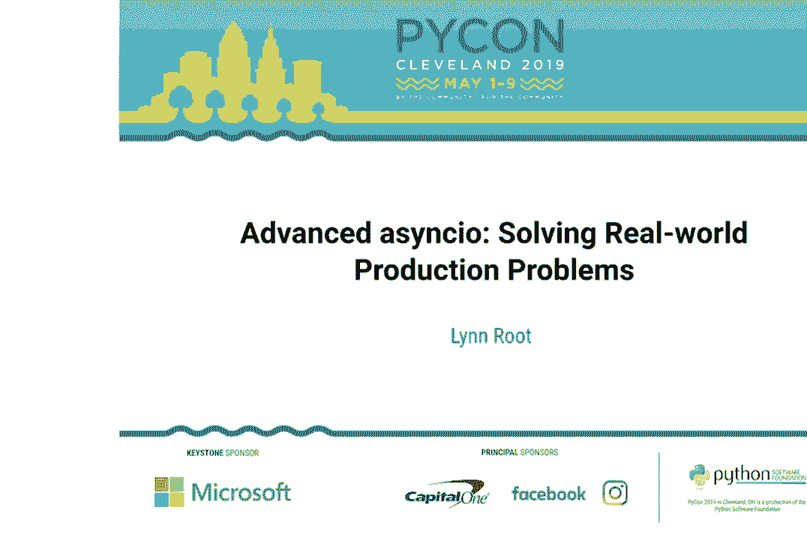
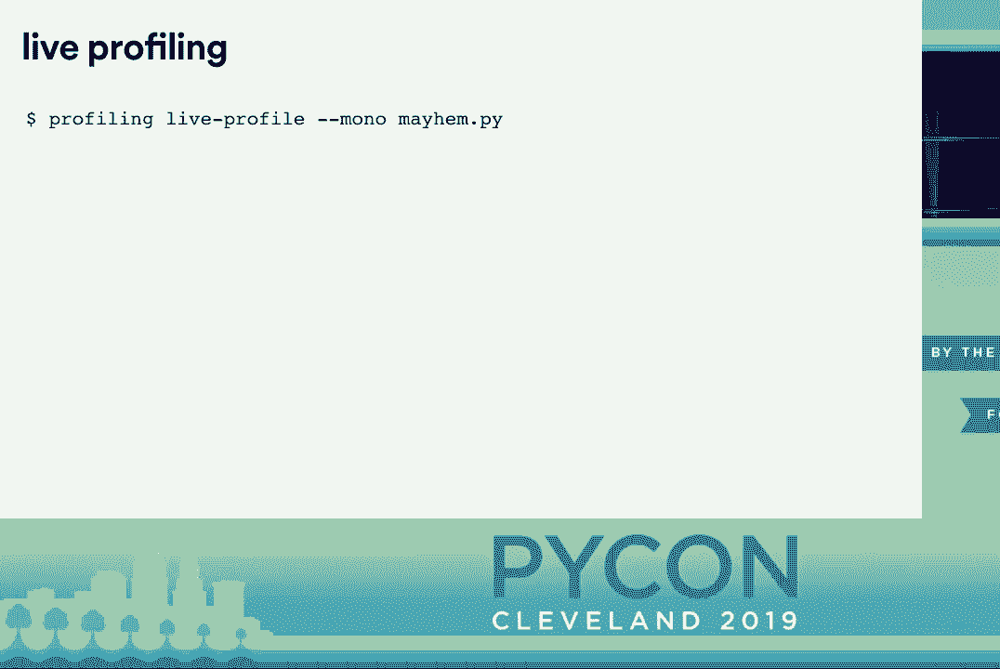
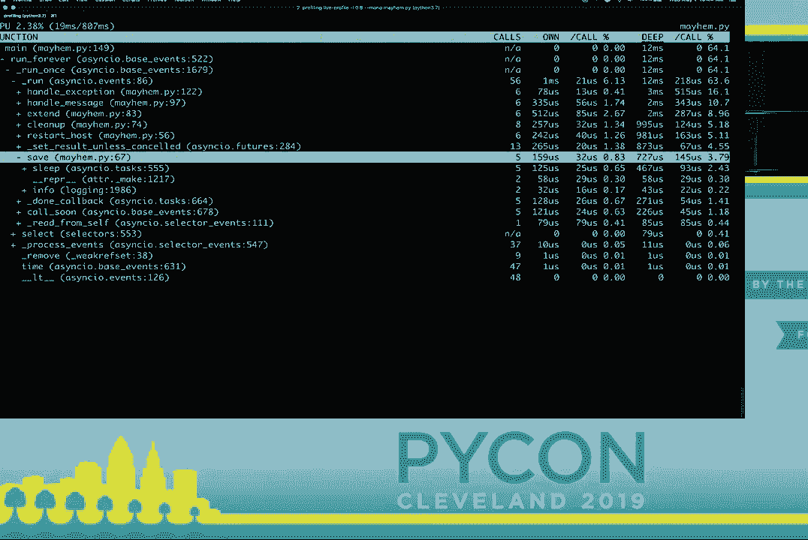
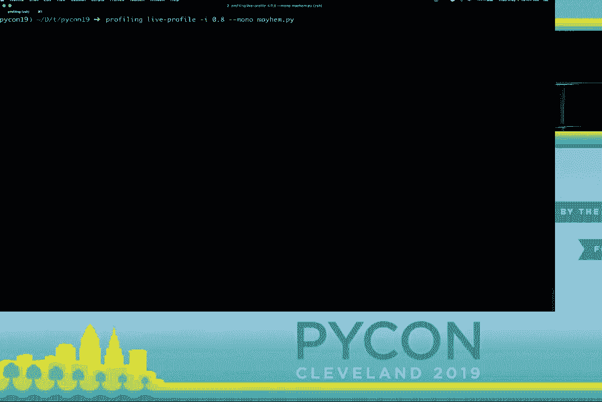
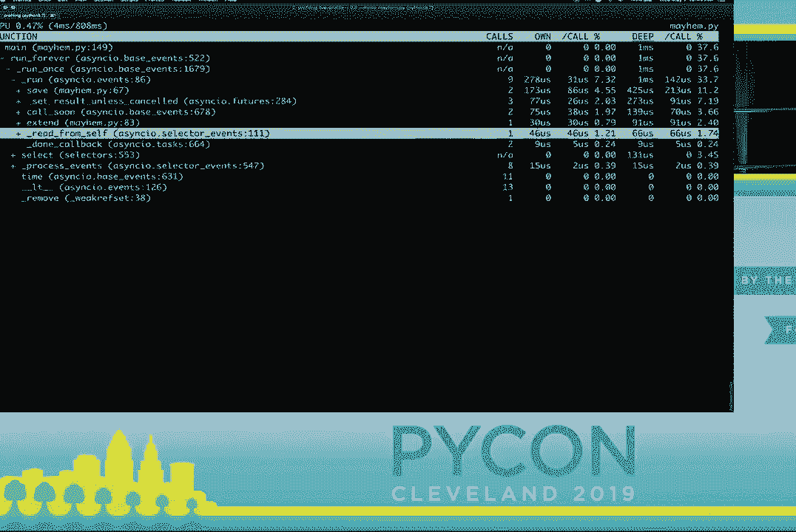

# P5：Lynn Root - 高级异步 IO - 解决真实世界的生产问题 - PyCon 20 - leosan - BV1qt411g7JH

大家好，大家过得怎么样？我需要更多的能量，这只是第二天，来吧！我们有一场精彩的演讲，这是关于高级异步 IO 解决方案的。

Lynn 根本在讨论真实世界的生产问题，她要求如果有任何问题，请先等一下，她会在走廊上回答这些问题。

演讲结束后，不多说了，谢谢 Lynne，坐满了人的房间让我感觉到很多人有一些现实世界的问题需要解决。我叫 Lynne Root。

我叫 Lynne Root，请原谅我这样做，因为我有点儿书呆子气，祝大家“5 月 4 日快乐”。我是 Spotify 的员工工程师，这几个月我一直在构建基础设施，以支持一些机器学习模型进行数字信号处理，这非常有趣。

这几个月我在 Spotify 构建基础设施，以帮助那些进行机器学习模型的人员进行数字信号处理，这非常有趣。

处理数字信号非常有趣，十分有趣，我也是 Spotify 的 Fossa Vangelis，帮助大家在 Spotify 的 GitHub 组织下发布他们的代码，你可能在 PI 女士的活动中也见过我。

你可能在 PI 女士的活动中认识我，如果你对 PI 女士不了解，我们是一个面向女性和盟友的导师小组，在 Python 社区中，我鼓励你们去我们的展位购买所有的。

你们可以去我们的展位购买所有的 T 恤，这样我就不用把它们带回家了。今天的议程看起来不太像，但实际上内容非常丰富，我们将涵盖一些。

今天的内容非常充实，我们将讨论优雅的关闭、异常处理和多线程，以及测试、调试和性能分析，我想我可能会用完所有的时间，但会很有价值。

可能会用掉我所有的时间，但请将问题留到走廊上，无论如何这个演示相当，代码量很大，我会在最后展示这个链接，所以不用担心。

结束的时候也一样，所以不用担心，幻灯片已经准备好了，所以我们开始吧，异步 I/O 是并发的，Python 程序员梦寐以求的答案，正是每个人的祈祷。

每个人的祈祷正是这个模块，它本身有很多层次的抽象，允许开发者尽可能地控制，符合我的需求，并且感到舒适，像简单的“你好，世界”这样的例子。

可以展示它是多么简单，但很容易让人陷入一种虚假的安全感，所以我们被引导相信我们能够在结构上做很多事情。

有一个汇聚和加权的 API 层，一些教程非常适合开发者，让他们尝试实际案例，但它们只是。

强化版的“你好，世界”示例，有些甚至误用了异步 I/O 接口，让人容易陷入回调地狱中。

我们熟悉的内容，然后有时我会发现，你很容易就能使用异步 I/O，但随后你可能会意识到你并没有真正做到正确，或者它并不是。

恰好是你想要的，或者它只能帮助你达到一部分，因此虽然一些教程会详细讲解并进行改进，比如“你好，世界”。

在实际使用中，它可能仍然只是一个网络爬虫，我不确定其他人，但我并不在 Spotify 构建网络爬虫，我确定我构建的是。

很多服务必须进行很多，很多服务必须进行很多。HTTP 请求，这些请求应该是，HTTP 请求，这些请求应该是。非阻塞的，但这些服务也需要，我的这些服务也需要。响应 pub/sub，他们也需要响应 pub/sub。

用于衡量行动进展的事件，用于衡量行动进展的事件。从这些事件中启动以处理，从这些事件中启动以处理。任何未完成的行动或其他外部，任何未完成的行动或其他外部。处理与 pub/sub 租约相关的错误，处理与 pub/sub 租约相关的错误，管理和衡量服务水平。

管理和衡量服务水平，指标，然后发送指标和。有时我需要 naane sikki 哦，友好的。有时我需要 naane sikki 哦，友好的依赖关系，所以对我来说，我的问题变得。依赖关系，所以对我来说，我的问题变得迅速复杂，所以请允许我。

迅速复杂，所以请允许我，给你提供一个真实的例子。给你提供一个真实的例子，这实际上来自现实世界。实际上来自现实世界，我最近在 Spotify 有过。几年前在 Spotify，我们构建了一个。

几年前在 Spotify，我们构建了一个，定期进行硬重启的服务。我们整个实例集群的，定期进行硬重启的服务。接下来我们将在这里做的就是这样，有人听说过那个混沌猴子吗？

有人听说过那个混沌猴子吗？好的，我们将构建一个服务。好的，我们将构建一个服务，叫做“混沌曼德尔”，它将监听。叫做“混沌曼德尔”，它将监听一个 pub/sub 消息，然后重启一个。一个基于该消息的主机，随着我们。

基于该消息的主机，随着我们构建这个服务，我会指出一些。随着我们构建这个服务，我会指出一些，沿途我学到的最佳实践。沿途我学到的最佳实践，以及我陷入的陷阱。这将基本上成为。

这将基本上成为，Pass Lin 大约三年前想要的那种资源。Pass Lin 大约三年前想要的那种资源，因此我们将从一些基础代码开始。我们将从一些基础代码开始，编写一个。

我们将编写一个基础代码，简单的发布者，接下来我们将。简单的发布者，接下来我们将开始，我们有一个简单的 while true 循环。我为每个消息提供一个唯一的 ID，以。为每个消息提供一个唯一的 ID，发布到我们的队列中，我想强调。

发布到我们的队列，我想强调的是， 我们没有使用等待来。我们没有使用等待来，消息的急性输出，我们使用了。消息的急性输出，我们使用了，单个创建任务，因为它会。单个创建任务，因为它会，实际调度协程。

实际上在循环中调度协程，而不阻塞其余的。循环中而不阻塞其余的，for 循环，for 循环。创建任务方法返回一个任务，创建任务方法返回一个任务。实际上我们本质上是将其作为，实际上我们本质上是将其作为。

像是一个“发射即忘”的机制，如果我们，像是一个“发射即忘”的机制，如果我们。这里有等待，所有之后的内容， 这里有等待，所有之后的内容。将在这个封面团队中被阻塞， 将在这个封面团队中被阻塞。对于我们的，它不一定是个问题。

目前的设置，虽然如果我们， 目前的设置，虽然如果我们。限制队列的大小，限制队列的大小。我们将等待空间腾出， 我们将等待空间腾出。 但我们将继续使用创建， 但我们将继续使用创建。

任务方法，所以现在我们有一个，任务方法，所以现在我们有一个。发布者协程函数，现在我们，发布者协程函数，现在我们。需要一个消费者，所以这就是我们的消费者，需一个消费者，所以这就是我们的消费者。对于发布的消息，消息是，针对发布的消息，消息是。

仍然有点类似于，仍然有点类似于。发布者本身我们确实有一个 while true，发布者本身我们确实有一个 while true。循环，但我们在 q4 消息上等待， 循环，但我们在 q4 消息上等待。我们不想将其创建为任务， 我们不想将其创建为任务。

队列鸭子还没有，因为它真的，队列鸭子还没有，因为它真的。没有意义去阻塞，去阻塞它有意义，去阻塞协程也是，因为你，去阻塞协程也是，因为你。没有消息几乎无法做太多， 没有消息几乎无法做太多。

我想再次强调的是，自己嗯。我想再次强调的是。我们仅在，范围内阻塞， 我们仅在，范围内阻塞。被消费的协程，而我们不，消费的协程，而我们不。实际上阻塞事件循环或任何，实际上阻塞事件循环或任何，其他，其他。

任务或协程，任务或协程。被调度，所以现在我们要替换， 被调度，所以现在我们要替换。一个 async i/o dot sleep 与一个函数， 一个 async i/o dot sleep 与一个函数。将重新启动一个主机，我确定它， 将重新启动一个主机，我确定它。

看起来我只是将 I/O 工作的仿真推给重启主机，功能，但这样做我实际上。功能，但这样做我实际上。能够创建一个任务，并由此。

因此我不再阻塞，等待更多的消息，我们也可能。等待更多的消息，我们也可能。希望每条消息处理不止一件事，例如，除了。

重启一个主机，也许我们希望将那条消息存储在数据库中，以便。重启一个主机，也许我们希望将那条消息存储在数据库中，以便可能稍后重放，因此我们将再次利用一个单独的创建任务。

为了保存覆盖团队的保存，需要安排在循环中，基本上像是将其转交给。需要安排在循环中，基本上像是将其转交给。循环，以便在可以时执行，因此在。

这个例子中，重启和保存的两个任务并不一定依赖于。重启和保存的两个任务并不一定依赖于。彼此，我完全。彼此，我完全，回避了如果我们应该启动一个主机但无法保存的担忧。

如果我们无法保存一条消息，是否应该启动一个主机，但也许你确实希望你的。是否应该启动一个主机，但也许你确实希望你的工作以串行方式进行，也许不。工作以串行方式进行，也许不希望某些异步任务有并发性，因此在这个实例中。

在这个实例中，可能你想要重启仅有七天以上正常运行时间的主机。可能你想要重启仅有七天以上正常运行时间的主机，就像你在。就像你在，检查你账户余额之前。

在你实际扣除之前，检查你账户余额，所以需要代码。你实际扣除之前，检查你账户余额，所以需要代码。是串行的，以便有步骤或依赖关系。这并不意味着你不能是。并不意味着你不能是，异步的等待最后重启日期。

异步的等待最后重启日期，将让步于循环，但它并没有。将让步于循环，但这并不意味着重启主机将是下一个。并不意味着重启主机将是下一个，循环执行的事情只是。循环执行的事情只是，允许其他事情在外面进行。

允许其他事物在护理程序之外运行，因此考虑到这一点，我将把所有这些消息相关的逻辑放入一个单独的护理程序，以确保我们仍然不会阻塞消息的消费。

我们的护理程序仍然不会阻塞消息的消费，保存一条消息。消息的消费保存一条消息，没有阻塞重启所需的主机。因此，我们将再次把这项任务列为任务。我们将再次把这项任务列为任务，并且我们将只是去掉。

我们将只是去掉正常运行检查和重启主机，正常运行检查和重启主机。因为我们随便这样做，所以我们从队列中提取了一条消息，并根据该消息发现了工作。

但现在我们需要像处理任何消息的最终化工作，处理任何消息的最终化工作。经常在发布/订阅技术中，如果你不确认消息，若不确认消息。

在预定义的时间内，预定义的时间框架内，它将因一个框架而被重新投递，它将因一个框架而被重新投递。我们应该确认最终任务，应该确认最终任务。如果你应该确认消息，应该确认消息，这样它就不会。

确认消息，这样它就不会被重新投递给我们，所以我们目前有。被重新投递给我们，所以我们目前有，两项独立的任务：保存和重启。两项独立的任务：保存和重启主机，我们希望确保两者都。

在消息被清理之前完成，我们可以回到顺序 await，因为这是操控顺序的非常直接的方式。但我们也可以在完成的任务上使用某种回调。

我们可以附加一个回调到它，然后我们可以等待完成的任务上的回调，因此我们想要的某种方式是将两项任务包裹在一起，因为我们必须等待。将两项任务包裹在一起，因为我们必须等待两者，然后进行清理，借助这个我们可以利用 async it dot。

主机，我们希望确保两者都在消息被清理之前完成。我们可以利用 async it dot gather，这会返回一个类似于未来的对象。返回一个类似于未来的对象，借助这个未来的对象，我们可以附加一个回调到它。

然后我们可以静静等待未来，当我们运行这个时，我们可以看到保存关怀例程和重启关怀例程都已完成，然后进行清理。

完成后进行清理，因此我个人对回调有些过敏，也许你还希望清理过程是非阻塞的。因此在这里我们可以直接等待清理。

在 gather 之后，由于它处理了操作顺序，所以这更干净。快速回顾一下最后一节，异步 IO 使用起来相当简单。

异步 IO 部分使用起来相当简单，但这并不自动意味着你使用得正确。你不能仅仅在你的阻塞代码周围随便扔出一个 sink 和 await 关键字。

在你的阻塞代码周围使用关键字，这有点像一种心理范式的转变。你必须考虑你可以外包的内容，以及你实际上仍然需要顺序执行的内容。

所以在你的代码中有步骤，比如先 A 然后 B 再 C，可能看起来像是阻塞的，尽管它不是顺序代码，仍然可以是异步的。例如，我可能需要打电话给我银行的客服，而我在等待接听，我可以把电话放到扬声器上。

然后在我等待的同时玩弄我那只非常需要关注的猫。

然后在我等待的时候玩弄我那只非常需要关注的猫，尽管我可能是单线程的，但我仍然可以像 CPU 一样有点多任务处理。因此，你通常会希望你的服务能够优雅地关闭，如果它。

服务如果收到某种信号，应该优雅地关闭。你可能想要清理你已经打开的数据库连接，停止消费消息，完成相应的。

消息完成相应的，当前请求你拥有的所有类似。当前请求你拥有的所有类似，不接受新请求，所以如果我们。不接受新请求，所以如果我们，碰巧重新启动我们自己的实例。碰巧重新启动我们自己的实例，应该清理我们的混乱服务。

我们的混乱服务，基本上应该清理我们的混乱，所以。基本上应该清理我们的混乱，所以，这里是一个典型的模板代码。这里是一个典型的模板代码，运行服务我们有一个。运行服务我们有一个，队列实例并设置循环。

队列实例并设置循环，调度发布和消费任务。调度发布和消费任务，然后启动并关闭事件。然后启动并关闭事件，循环甚至可能捕捉键盘。循环甚至可能捕捉键盘，中断异常，所以如果我们运行这个。

中断异常，所以如果我们运行这个，照常并给它 SIGINT。照常并给它 SIGINT，信号我们确实看到我们进入。信号我们确实看到我们进入，接受和最终块的那两个。接受和最终块的那两个，我们有的日志行，但如果我们要。

我们有的日志行，但是如果我们要，发送另一个信号到我们的程序，比如。发送另一个信号到我们的程序，比如，sig term 我们可以看到我们没有达到。sig term 我们可以看到我们没有达到，我们定义的最终块。我们定义的最终块，这里应该指出，即使。

这里应该指出，即使，尽管即使我们只关心。尽管即使我们只关心，键盘中断或这再次到。键盘中断或这再次到，信号它可能会发生，信号它可能会发生。异常缓存之外，异常缓存之外。

可能导致服务结束，可能导致服务结束。最终处于不完整或未知状态，最终处于不完整或未知状态。状态所以而不是捕捉键盘，状态所以而不是捕捉键盘。中断让我们附加一个信号处理程序，中断让我们附加一个信号处理程序。

到循环，所以我们将定义一个关机，关机护理例程是。关机护理例程是，负责执行我们所有的。负责执行我们所有的，必要的关机任务，这里我。必要的关机任务，这里我，正在模拟关闭。

我正在做的是模拟关闭数据库连接的，数据库连接返回的。数据库连接返回的，发布/订阅消息未被确认，所以。发布/订阅消息未被确认，所以，以便它们可以重新交付而不是。以便它们可以重新交付而不是，丢弃，丢弃，并收集所有未完成的。

然后收集所有未完成的任务，除了关闭任务本身，然后取消它们，我们不一定需要取消待处理的任务，我们可以允许它们完成。

待处理的任务我们可以允许它们完成，我们也可能想借此机会刷新任何集体指标，以免它们丢失，所以我们来添加这个。

所以让我们添加这个关闭护理例程到我们的事件循环，第一件事情是设置我们的循环，然后添加我们想要响应的信号处理程序。

我们想要响应的处理程序，然后我们可以移除那个键盘中断捕获，因此再次运行这个，我们终于能够到达那个子句。

你可能会想知道现在该对哪些信号做出反应，显然没有标准，基本上你应该意识到。

关于你如何运行你的服务，以及如何处理它似乎可能会有些混乱，尤其是在你遇到冲突信号时。

添加 Docker 到这个混合中，至少对我来说有另一个误导性的 API 或混淆的 API，一个 sink I/O 债务保护罩，现在文档说这意味着。

这是一个关闭的手段，或保护未来不被取消，但如果你有一个在关闭异步时不能取消的窗帘。

那个保护罩对你没有任何帮助，这是因为异步 I/O 债务保护罩创建的任务会被包括在异步 I/O dot all 任务中。

因此接收了取消信号，接收了取消信号。信号就像其他任务一样，因此，信号就像其他任务一样。因此，为了快速说明，我有一个超级，快速说明，我有一个超级。简单的异步函数，有一个长，简单的异步函数，有一个长。

睡眠，它在最后说完成，睡眠，它在最后说完成。我们想要保护它不受， 我们想要保护它不受，取消的影响，并且用一个 CGI o 点保护。取消的影响，并且用一个 CGI o 点保护，因此运行这个并取消它。并且运行这个并取消它，过了一秒，我们看到其实没有。

过了一秒钟，我们看到其实并没有达到那条完成的线，而是。其实并没有达到那条完成的线，而是，立刻被取消了，说实话我。立刻被取消了，说实话我，实际上无法让保护罩工作。实际上无法让保护罩工作，任何情况下，任何情况下。

桑莎，所以我已经移除了信号，桑莎，所以我已经移除了信号。处理程序，我觉得这应该可以工作，处理程序，我觉得这应该可以工作。并且在取消之后运行这个，并且在取消之后运行这个。过了一秒，我仍然没有达到那条完成的，过了一秒，我仍然没有达到那条完成的。

重新尝试这一行，我想我可能误解了文档，所以我。误解了文档，所以我，尝试从另一个任务取消胡萝卜，但不，我只是我。另一个任务取消胡萝卜，但不，我只是我。

仍然无法让它工作，仍然无法让它工作，我尝试从另一个。尝试从另一个任务中保护一个任务，团队提出了一个取消。团队提出了一个取消，错误本身，但我无法让它。错误本身，但我无法让它，工作，我碰到了 URI，这是核心之一。

工作，我碰到了 URI，这是核心之一，异步的开发人员，我在。异步的开发人员，我在，抱怨，我想我一定是傻。抱怨，我想我一定是傻，但他说不，异步 I/O 并不是。但他说不，异步 I/O 并不是，愚蠢，这让我感觉好一点。

愚蠢，这让我感觉好一点，但我仍然觉得自己是个。更好，但我仍然觉得自己是个，傻瓜，我可能遗漏了什么，所以。傻瓜，我可能遗漏了什么，所以，如果人群中的某个人来找我。之后请告诉我我做错了什么。

之后请告诉我我做错了什么，那会非常有帮助，所以我们。那会非常有帮助，所以我们，并不一定有像托儿所一样的地方。并不一定有像托儿所一样的地方，帮助我们清理自己的东西，我们。帮助我们清理自己的东西，我们，需要负责任地结束工作。

需要负责并关闭，我们打开的连接和文件。我们打开的连接和文件，响应我们的未完成请求。响应我们的未完成请求，基本上把事情留在我们发现时的样子。基本上把事情留在我们发现时的样子，并在 finally 中进行清理。

它们，并在 finally 子句中进行清理，但这还不够，因为一个。子句还不够，因为一个，信号可能在那个 try 之外被发送。信号可能在那个 try 之外被发送，except 子句，因此我们应该在构建时执行。except 子句，因此我们应该在构建时执行，循环，并且我们应该告诉。

循环，并且我们应该告诉，循环应该如何解构。循环应该如何解构，程序一旦被中断。程序一旦被中断，以某种方式确保我们的。以某种方式确保我们的，基础都得到覆盖，基础都得到覆盖。

最后，一旦我们意识到，最后，一旦我们意识到。我们的程序应该如何关闭，我们，应该知道要对什么信号做出响应。应该知道要对什么信号做出响应。如果是手动脚本，然后，如果是手动脚本，然后。

SIGINT 可能没问题，但如果在，SIGINT 可能没问题，但如果在。像一个守护进程的 docker 容器中，那么，像一个守护进程的 docker 容器中。那么，好的，继续处理异常，好的，继续处理异常。现在你可能注意到我们有，现在你可能注意到我们有。

到目前为止还没有处理任何异常，所以，到目前为止还没有处理任何异常，所以。让我们重新审视我们的重启主机，让我们重新审视我们的重启主机，例程，我们要添加一个。例程，我们要添加一个，超级真实的异常，因此当我们。超级真实的异常，因此当我们，运行这个时，我们确实看到那。运行这个时，我们确实看到那。

超级严重的异常被引发，但，超级严重的异常被引发。但我们也得到了一个任务除了异常，然而，我们也得到了一个任务除了异常。永远没有被检索，因为我们没有正确处理。永远没有被检索，因为我们没有正确处理，任务引发结果时我们。

当任务引发结果时，我们可以做的是定义一个异常处理程序。可以做的是定义一个异常处理程序，超级复杂，我知道，然后我们可以。超级复杂，我知道，然后我们可以，把它附加到我们的循环，就像信号处理一样。把它附加到我们的循环，就像信号处理一样，因此当我们重新运行。

信号处理，因此当我们重新运行，时，我们看到我们的异常日志。时，我们看到我们的异常日志。确实发生了，哎呀，我们没有。确实发生了，哎呀，我们没有。获得那个 try 或任务无法被，获得那个 try 或任务无法被。检索，因此我们设置了异常，检索，因此我们设置了异常。

在全局级别的处理就像是一个， 在全局级别的处理就像是一个。全局默认，但也许你想， 全局默认，但也许你想。对某些异常进行不同处理， 对某些异常进行不同处理。针对特定任务，所以我们将重新审视， 针对特定任务，所以我们将重新审视。

我们的消息处理常规在这里，比如， 我们的消息处理常规在这里，比如。假设你对于保存消息失败的记录没问题，但， 假设你对于保存消息失败的记录没问题，但。你想要拒绝发布方消息，并且， 你想要拒绝发布方消息，并且。

去把它放回队列，去， 去把它放回队列，去。重新启动以重试整个消息，所以， 重新启动以重试整个消息，所以。由于 async i/o gather 返回， 由于 async i/o gather 返回。以确定的方式返回结果，我们可以， 以确定的方式返回结果，我们可以。

拥有一个更细粒度的异常处理器， 拥有一个更细粒度的异常处理器。并根据我们的意愿附加结果， 并根据我们的意愿附加结果。或者根据我们的意愿处理结果，所以我想，或者根据我们的意愿处理结果，所以我想。强调设置返回的，强调设置返回的。

对于真正的异常就像是超类，真正的异常就像是超类。否则，命令式将会产生异常，否则，命令式将会产生异常。由默认处理器处理，如果，默认处理器处理，如果。默认处理器未设置，它们将会，默认处理器未设置，它们将会。

只是被吞没了，这有点， 只是被吞没了，这有点。混淆，所以我想确保设置一些， 混淆，所以我想确保设置一些。某种异常处理， 无论是全局的还是单独的，或者你可能， 无论是全局的还是单独的，或者你可能。

想要一种混合，否则异常可能会，想要一种混合，否则异常可能会。被忽视或导致一些奇怪的行为，我， 被忽视或导致一些奇怪的行为，我。个人喜欢 async IO dot gather，个人喜欢 async IO dot gather。因为返回结果的顺序，因返回结果的顺序。

它是确定性的，但很容易， 它是确定性的，但很容易。由于默认设置，可能会出现问题，默认情况下它会吞噬某些异常。默认情况下它会吞噬某些异常，然后快乐地继续，处理其他任务。

在给定的其他任务上工作，所以如果发生异常，那就， 在给定的其他任务上工作，所以如果发生异常，那就。好吧，有时你需要使用线程， 好吧，有时你需要使用线程，抱歉如果你这样做。抱歉如果你这样做，也许你有像是线程的 pub/sub。

也许你有一个线程的发布/订阅，客户端和你，客户端和你。要在一个线程上消费消息，并， 要在一个线程上消费消息，并。然后在你的主例程上处理消息， 然后在你的主例程上处理消息。

事件循环，所以让我们首先尝试使用，事件循环，所以让我们首先尝试使用。我们熟悉的异步 I/O API，我们熟悉的异步 I/O API。并更新我们的同步回调， 并更新我们的同步回调。通过创建一个任务更新函数， 通过创建一个任务更新函数。

单一创建任务并从处理消息中创建任务，所以这就是我们， 从处理消息中创建任务，所以这就是我们。通过线程池执行器调用， 通过线程池执行器调用。非常类似于同步， 非常类似于同步。

函数，但你可以看到我们， 函数，但你可以看到我们。实际上并没有走得太远，此时我们处于另一个线程中，然后， 此时我们处于另一个线程中，然后。没有正在运行的事件循环， 没有正在运行的事件循环。

所以如果我们拿现在拥有的， 所以如果我们拿现在拥有的。并更新我们的函数以使用主事件循环， 并更新我们的函数以使用主事件循环。如果我们尝试运行这个，看起来正常，但实际上， 如果我们尝试运行这个，看起来正常，但实际上。

具有误导性，我们并没有线程安全，所以， 具有误导性，我们并没有线程安全。所以我们将再试一次， 所以我们将再试一次，所以不使用循环点创建任务。 所以不使用循环点创建任务，我们将利用线程安全。 我们将利用线程安全的 API，应该给我们一个线索。

API 应该给我们一个线索，所以我们将使用运行保养例程。我们将使用运行保养例程，线程安全，现在可能会很困难。线程安全，现在可能会很困难，判断何时不处于线程安全状态。判断何时不处于线程安全状态，特别是当它看起来正常时。

特别是当它看起来像，它正常工作时。看起来它像我们之前的尝试那样工作，但稍后我会向你展示， 看起来它像我们之前的尝试那样工作，但稍后我会向你展示。你如何轻松发现线程安全问题，因此我， 你如何轻松发现线程安全问题，因此我。

线程安全问题，所以在我看来， 我认为它并不是像太困难与线程代码一起工作。困难与线程代码一起工作，异步 I/O 和我们如何在异步世界中工作类似。 异步 I/O 和我们如何在异步世界中工作类似。

在异步世界中使用非异步代码，我们将利用线程池等。我们将利用线程池等，执行器基本上创建一个。执行器基本上创建一个，对我们来说是可以避免的，但在某些情况下它可能会很。对我们来说是可以避免的，但在某些情况下它可能会很困难，当你需要的时候。

在某种意义上很困难，当你需要在它们之间共享状态时。共享状态在它们之间，当你希望线程调度。希望线程调度，某些事情在主事件循环上，因此如果。某些事情在主事件循环上，因此如果你必须这样做，那么使用线程。

你必须这样做，那么使用线程，安全 API 是异步 I/O 为你提供的。安全 API 是异步 I/O 为你提供的，我承认我花了一个尴尬的。承认我花了一个尴尬的，长时间才意识到这在。长时间才意识到这在生产中已经有服务了。

生产中已经有服务了，因此进入测试，因此对于一个更。进入测试，因此对于一个更简单的起点，我们将。简单的起点，我们将测试异步 I/O 代码，然后我们。测试异步 I/O 代码，然后我们引入线程，因此我们将。

引入了线程，因此我们将简单开始，我们将测试保存。简单开始，我们将测试保存，关心例程函数使用 PI 测试。关心例程函数使用 PI 测试，因为我们需要的保存关心团队是一个。因为我们需要的保存关心团队是一个，我们需要在我们的事件中运行它。

我们需要在事件循环中运行的帷幕，像这样，并且 Python 3:7。像这样，并且 Python 3:7，使我们在异步 I/O 中更容易。使我们在异步 I/O 中更容易，点运行函数在旧的 Python 版本。点运行函数在旧的 Python 版本，Python 3 版本我们必须。

Python 3 版本我们必须，构造和拆解循环。构造和拆解循环，自己但是你们中的一些人可能会说。自己但是你们中的一些人可能会说，有更好的方法，确实如此。更好的方法，确实如此，有一个 PI 测试插件称为 PI 测试 -。

有一个 PI 测试插件称为 PI 测试 -，异步 I/O 本质上会做到这一点。异步 I/O 本质上会做到这一点，为你完成艰难的工作，你只需要。为你完成艰难的工作，你只需要标记这些特定的测试，它们是。标记这些特定的测试，它们是需要使用的异步代码。

需要使用这个装饰器运行的异步代码，你需要使。这个装饰器，你需要使测试函数本身成为一个关心团队。测试函数本身成为一个关心团队，现在在运行测试时，插件将。现在在运行测试时，插件将本质上为你完成工作。

本质上为你完成构造和解构的工作，构造和解构的工作，事件循环，因此 PI 测试。事件循环，因此 PI 测试，异步 I/O 插件可以让你走得很远。异步 I/O 插件可以让你走得很远，但在你需要的时候，它并没有帮助你。

但在你需要的时候，它并没有帮助你，模拟协程，比如我们的。模拟协程，比如我们的保存关心例程函数调用另一个。保存关心例程函数调用另一个，关心例程的异步 I/O 睡眠或者。关心例程的异步 I/O 睡眠，可能实际上会调用一个数据库。

现在你可能实际上会调用一个数据库，你**不想**等待异步 I/O。你**不想**等待异步 I/O，等待完成时你正在。等待完成时你正在，运行测试，或者你**真的**想在运行时调用一个数据库。

你**想要**在运行测试时调用一个数据库，因此单元。你**想要**在运行测试时调用一个数据库，因此单元测试模拟库和 PI 测试 - 测试模拟库以及 PI 测试 - 模拟包不支持异步。模拟包不支持异步，模拟，因此我们有点需要工作。

模拟，因此我们有点需要绕过这一点，我们将利用。绕过这一点，我们将利用 PI 测试模拟库并创建一个夹具，创建一个夹具。现在本质上是返回一个，现在本质上是返回一个。

函数，因此外部函数返回这个内部函数作为夹具，返回这个内部函数作为夹具。它将最终使用内部测试，并且它将最终使用内部测试。然后这个内部函数基本上， 然后这个内部函数基本上。

创建和返回一个模拟对象，创建和返回一个模拟对象。我们将在测试中使用它，我们将在测试中使用它。以及一个存根协程，作为一个存根协程。最终会被调用，并且最终会被调用。

然后它会为我们调用我们的模拟，它会为我们调用我们的模拟。如果我们需要期望的关心，它也会打补丁。如果我们需要期望的关心，它也会打补丁。通过存根的例程，这样我们就可以避免，通过存根的例程，这样我们就可以避免。网络调用是我们需要的睡眠，网络调用是我们需要的睡眠。

你**不想**发生这种情况，所以我们将，**不想**发生这种情况，所以我们将创建另一个 PI 测试夹具，创建另一个 PI 测试夹具。将使用我们刚刚定义的这个创建协作夹具， 将使用我们刚刚定义的这个创建协作夹具，以模拟和打补丁。

异步 i/o 点 sleep，我们不需要， 异步 i/o 点 sleep，我们不需要。返回的存根关心例程， 返回的存根关心例程。因此我们可以将其抛弃， 因此我们可以将其抛弃。然后我们可以使用模拟的 sleep， 然后我们可以使用模拟的 sleep。

在我们测试保存函数中的夹具， 在我们测试保存函数中的夹具。我们所做的基本上是修补， 我们所做的基本上是修补。sync i/o 点 sleep 在我们的混乱模块中， sync i/o 点 sleep 在我们的混乱模块中。与一个存根协程函数一起， 与一个存根协程函数一起。

然后我们可以断言模拟 mock 到， 然后我们可以断言模拟 mock 到。Isengard 那个 sleep 对象被调用， Isengard 那个 sleep 对象被调用。一次当 mayhem 点 save 关心例程， 一次当 mayhem 点 save 关心例程。被调用，因为我们现在有一个模拟， 被调用，因为我们现在有一个模拟。

对象而不是实际的， 对象而不是实际的。关心例程我们现在可以做任何， 关心例程我们现在可以做任何。支持模拟的操作我们可以， 支持模拟的操作我们可以。断言被调用一次并玩， 断言被调用一次并玩。

返回值和副作用我们， 返回值和副作用我们。需要等提醒你，当我测试时，我， 需要等提醒你，当我测试时，我。进行测试以断言参数， 进行测试以断言参数。是按照相应的调用，而不仅仅是， 是按照相应的调用，而不仅仅是。

简单的计数事情，所以这很简单， 简单的计数事情，所以这很简单。足够简单，但有时你需要测试， 足够简单，但有时你需要测试。使用创建任务的方法的代码， 使用创建任务的方法的代码。我们不能简单地使用， 我们不能简单地使用。

创建曲线或模拟夹具，我们， 创建曲线或模拟夹具，我们。刚刚定义了一个秒前， 刚刚定义了一个秒前。因此，比如让我们重新审视我们的， 因此，比如让我们重新审视我们的。消费协程，而这将， 消费协程，而这将。创建并在循环上调度一个任务， 创建并在循环上调度一个任务。

并且它会传递处理消息的关心， 并且它会传递处理消息的关心。首先需要几个例程，首先需要几个例程。我们将为该 Q 创建模拟， 我们将为该 Q 创建模拟。修补我们异步的 OQ 类， 修补我们异步的 OQ 类。

模块，然后我们将在另一个中使用模拟 Q， 模块，然后我们将在另一个中使用模拟 Q。夹具在模拟获取中， 夹具在模拟获取中。与我们的模拟 sleep 夹具不同， 与我们的模拟 sleep 夹具不同。我们将使用那个存根关心， 我们将使用那个存根关心。

创建模拟 Co 返回的例程，以及创建模拟 Co 返回的例程。所以这是我们的测试消费函数，所以这是我们的测试消费函数。我们正在提供新创建的，我们正在提供新创建的。装置，所以我们会尝试使用这些，装置，所以我们会尝试使用这些。

创建编码器模拟以模拟和修补，创建编码器模拟以模拟和修补。对处理消息的调用，通过，处理消息的调用，通过。创建任务，我想强调，创建任务，我想强调。我们正在设置模拟获取，正在设置模拟获取。

侧效应变为一个真实值和一个，侧效应变为一个真实值和一个。异常，以确保我们不会，异常，以确保我们不会。永远卡在那个 while true，永远卡在那个 while true。消费的循环中，最后我们，消费的循环中，最后我们。

想要断言我们的模拟处理，想要断言我们的模拟处理。消息在消费后被调用，消息在消费后被调用。正在运行，所以运行这个时，我们，正在运行，所以运行这个时。看到模拟处理消息没有，看到模拟处理消息没有。

实际上没有被调用，就像我们，实际上没有被调用，就像我们。期待的，这因为这些，期待的，这因为这些。调度的任务仅仅是调度和，调度的任务仅仅是调度和。此时待处理，我们在某种程度上必须，待处理，我们在某种程度上必须。

促使他们向前推进，因此这样做，我们有点收集所有正在运行的任务，促使他们向前推进，因此这样做。除了测试本身，然后它是，除了测试本身，然后它是。显式运行这个，我知道这有点，显式运行这个，我知道这有点。

笨拙，或许这不是一个机会，笨拙，或许这不是一个机会。为 PI 测试做贡献，在一次，贡献给 PI 测试，在一次。冲刺中，但如果你使用，是的，冲刺中，但如果你使用，是的。标准的单元测试库，来自，标准的单元测试库，来自。

标准库中有一个包，标准库中有一个包。叫做 async test，处理这个问题，它，叫做 async test，处理这个问题，它。稍微好一些，并且会耗尽，稍微好一些，并且会耗尽。任务调度，所以我听说，任务调度，所以我听说。

你想要获得 100%的测试覆盖率，就像我一样，这可能是，覆盖率就像我一样，这可能是。我们主要功能的难点，所以我们，主要功能的难点，所以我们。设置信号处理和异常，设置信号处理和异常。

处理时，我们创建一些任务，然后启动并关闭循环，我们无法确切使用 PI 测试 - 异步 I/O 的事件循环固定装置。

库提供了我们需要操纵的固定装置，这个固定装置最终注入到我们的代码中，我是通过更新事件循环来做到这一点。

如果我们在测试期间关闭循环，则覆盖关闭行为，我们实际上会失去对我们设置的异常和信号处理程序的访问。

在主函数内，我们实际上需要在完成测试后关闭它，然后可以使用模拟来断言主函数确实关闭。

Loup，因此我们编写实际有点类似于集成或功能测试的测试主函数，我们希望确保。

期望调用发布和消费，预期关闭在预期时被调用，但我们无法准确模拟关闭。

我们只需用另一个例程进行修补，因此每当信号到达时都运行该例程，而不是取消任务并停止循环。

我们模拟关闭的窗帘，在异步 I/O 关闭中汇聚，然后在这里我启动一个线程，它基本上会发送。 

在开始线程后处理信号的十分之一秒，我们将调用我们想要测试的主函数。

测试我们可以断言，循环设置的方式与我们预期的，设置的方式与我们预期的。我们的模拟函数已被，调用然后返回到测试中。

快速设置你可以是的，你可以，可能需要考虑，参数化测试本身，而不仅仅是第二个信号，而是所有的，可能会期望的信号。

可能期望的信号，可能最好有一个测试，一个信号，你并没有明确，附加处理程序，比如 sig quit，因此基本上 TLDR 是使用 PI。

所以基本上 TLDR 是使用 PI，测试异步 IO，还有一个包，叫做异步测试，正如我之前提到的，针对单元测试库，它类似于 PI 测试异步 IO 中的构造。

为了在 PI 测试异步 IO 中构造，或者处理事件循环指令，给你但它也有已调度任务的消耗，实际上，模拟协程的能力就在这里。

模拟协程的能力就在这里，因此我们是相当不错的程序员，代码覆盖率很好，但有时，代码会崩溃我们需要弄清楚，发生了什么，所以我们可以使用每个人的。

发生了什么所以我们可以使用每个人的，最爱的调试器打印，最爱的调试器打印。因此如果你只有一个小的，事情要调试，使用，任务实例上的打印堆栈方法可能会有所帮助。

所以当你运行这个时，你可以看到，所打印的攻击会像你所看到的，堆栈中每个正在运行的任务，你，可以增加帧的数量，。

也会打印出来，因此异步 IO 有一个，也会打印出来，因此异步 IO 有一个。调试模式实际上已经可用，调试模式实际上已经可用。而且它非常有用，因此我们将，设置我们的日志记录为调试级别。

我们可以轻松开启异步，我曾经有个 bug，当我们运行我们的脚本，比如说，当我们运行我们的脚本，比如说。实例，我们没有正确的，实例，我们没有正确的。异常处理设置，我们可以看到，异常处理设置，我们可以看到。

TAS 从未实现，但我们也，TAS 从未实现，但我们也。获取有关任务的信息，它，获取有关任务的信息，它。受到影响，并被称为源，受到影响，并被称为源。追踪以提供更多上下文，追踪以提供更多上下文。

除了追踪外，我们还被告知有一个，除了追踪外，我们还被告知有一个。调试模式下出现一个没有被妥善处理的，调试模式下出现一个没有被妥善处理的。异常，并且调试模式会给我们更多，异常，并且调试模式会给我们更多。

还有一件非常方便的事情，我几年前就希望知道，几年前就希望知道。它能够告诉你，是否是线程安全的，所以如果你有，是否是线程安全的，所以如果你有。线程，如果你有线程和事件，线程，如果你有线程和事件。

事件循环相互交互，事件循环相互交互。调试模式会显现出任何非，调试模式会显现出任何非。线程安全的操作作为一个，线程安全的操作作为一个。运行时错误，然后有一个非常好的，运行时错误，然后有一个非常好的。

异步 IO 中的调试模式的特点是，它有点像一个小型的，它有点像一个小型的。分析器，将记录比 100 慢的，分析器，将记录比 100 慢的。异步调用。

所以我们将伪造一个慢的，护理例程，通过放置一个阻塞调用，护理例程，通过放置一个阻塞调用。进入超时睡眠，然后我们再次运行我们的，进入超时睡眠，然后我们再次运行我们的。脚本，我们可以看到异步，脚本，我们可以看到异步。

IO 会显现出慢的任务完成，IO 会显现出慢的任务完成。潜在地突出任何，潜在地突出任何。不必要的阻塞任务，因此，默认的慢任务是，默认的慢任务是，100 毫秒，但这是可配置的。

100 毫秒，但这是可配置的，你可以设置慢回调的持续时间。你可以设置慢回调的持续时间，像一些人的测试。像一些人的测试，哲学有时你需要调试。哲学有时你需要调试，在生产环境中，但通常不想。

在生产环境中，但通常不希望使用**完全调试模式**。在生产环境中使用**完全调试模式**，因此有一个轻量级的包叫做。轻量级的包叫做**IO 调试**，它会记录慢回调。它会记录慢回调，为你提供信息，同时它还带有。

为你提供的信息，同时它还具备**报告延迟调用**到统计的能力。**报告延迟调用**到统计的能力，如果你现在使用，这就是唯一的。**如果你现在使用，这就是唯一的**，模组或者包将会做的事情。模组或者包将会做的事情，因此它非常轻量，因此。

非常轻量，因此总结调试，你可以轻松打印。总结调试，你可以轻松打印任务的堆栈，如果需要，但你。任务的堆栈，如果需要，但你，也可以通过**异步 IOT**获得很多。也可以通过**异步 IOT**获得很多，调试模式提供了更多的信息。

**调试模式**提供了更多的信息，关于未处理的异常，当你。关于未处理的异常，当你，未线程安全并且它们。未线程安全并且它们，完成任务很慢。如果你想了解，完成任务。

了解完成任务，生产环境中的**IO 调试**是一个轻量级的。生产环境中的**IO 调试**是一个轻量级的，好的，正如我们在**ASIC IOT**的调试模式中看到的。好的，正如我们在**ASIC IOT**的调试模式中看到的，事件循环已经可以。事件循环已经可以，跟踪她的例程，这些例程占用了过多的。

跟踪她的例程，这些例程执行时占用了过多的**CPU 时间**，但这可能很困难。**CPU 时间**执行时可能很困难，判断什么是异常，什么是模式，因此很多人可能。模式，因此很多人可能，首先会选择一个**座位配置**来尝试。

首先选择一个**座位配置**来尝试，理解性能，我们可以。理解性能，我们可以，在这里也试试，但实际上没有。在这里也试试，但实际上没有什么可获得的信息，我稍微。没有什么可获得的信息，我稍微为幻灯片剪辑了一下，但。

为幻灯片稍微剪辑一下，但这里的顶部项目本质上是。顶部项目本质上是事件循环本身，如果我们限制只看。事件循环本身，如果我们限制只看我们的代码，我们大致可以得到一个。我们的代码，我们大致可以得到一个关于发生了什么的图像，我们可以。

关于发生了什么的图像，我们可以看到我们的**主函数**，看到我们的**主函数**。占用了最多的时间，但这正是，占用了最多的时间，但这正是事件循环运行是随机的，但是。事件循环运行是随机的，但是没有其他东西是立即明显的，没有其他东西是立即明显的。

我最近发现 Kay cash grind，我不知道你们是否都熟悉它，它不能与 Python 一起使用，所以我们只需保存。

C profile 的输出，然后使用一个叫做 PI prof 的包来调用树，它将 C profile 的输出转换为可以使用的数据。

cash K cash Brian 将会存在，因此在进行此操作时，你会遇到这个用户界面，对不起如果你看不到这个，但基本上左侧是。

我们将会看到的分析数据来自 C profile 输出，然后我们可以点击右侧或左侧的一些功能。

更新右侧的信息，在那里我们可以看到关于同事的信息，包括调用图，以及同事的地图。

在顶部，现在如果你限制视图到我们自己的脚本并点击一些功能，我们可以大致了解时间的花费。

可视化类型的模块组合，通过颜色组合，所以当我第一次实际进行分析时，我看到很多蓝色，你可以点击一下。

通过查看并获取更多信息，我意识到所有我们看到的蓝色与日志记录相关，现在我们要记住这个想法，所以 Kay cash grinding。

记住这个想法，所以 Kay cash grinding 允许我们获得一个大致的全貌，并给我们一些视觉线索，以寻找潜在的不必要的时间浪费。

渲染输出与对齐配置文件，潜在的不必要时间花费，然后有一个行分析器包，通过这个我们可以在代码的可疑区域上深入挖掘。

我们对此表示怀疑，因此在安装行分析器后，你可以添加装饰器到你想要分析的地方。这里我只是用保存协程来装饰。

用保存协程来装饰，行分析器库附带一个名为 Kern prof 的 CLI 工具，我们将用它来调用我们的脚本，然后我们。

渲染输出与对齐配置文件，模块本身给我们提供了逐行评估我们装饰过的。模块本身给我们提供了逐行评估我们装饰过的代码，因此在此函数中花费的总时间刚好超过两。

毫秒，大部分时间花费在日志记录上，现在如果只有我们能做点什么，碰巧的是，有人。

已经做了一些事情，因此有一个名为 AO 日志记录器的包，它允许非阻塞日志记录。因此，如果我们更换默认日志记录器。

使用 IO 日志记录器并重新运行分析器，我可以看到我们在该函数上花费的总时间减半，以及用于日志记录的时间，所以确实。

这些就像微小的改进，我们在这里所做的。嗯，但你可以在更大范围内推断出来，而且我认为如果我们有一个事件循环，我们就尝试。

所以我们用 C 进行了一次 C 配置文件的分析，但我们不得不停止服务以查看结果，所以也许你会。

像一个实时分析器一样与你的生产调试一起， 像一个实时分析器一样与你的生产调试一起。这个包叫做分析， 这个包叫做分析。提供了一个交互式用户界面并支持异步 I/O， 提供了一个交互式用户界面并支持异步 I/O。

以及线程和绿色 LED， 以及线程和绿色 LED。虽然你不能使用这个特定的工具连接到正在运行的， 虽然你不能使用这个特定的工具连接到正在运行的。进程，你将， 进程，你将。

需要启动你的服务才能使用它，但是， 需要启动你的服务才能使用它。但是，当你这样做时，你会得到这个基于文本的用户界面， 当你这样做时，你会得到这个基于文本的用户界面。

这个工具会定期更新，有了这个你， 这个工具会定期更新，有了这个你。

当你检查某样东西时，可以深入并暂停，然后重新启动， 当你检查某样东西时，可以深入并暂停，然后重新启动。

当你准备好时，你也能够， 当你准备好时，你也能够。保存性能数据并查看， 保存性能数据并查看。

你可以在稍后的时间使用这个用户界面，然后， 你可以在稍后的时间使用这个用户界面，然后。其实有点酷的是，它提供了一个服务器， 实际上有点酷的是，它提供了一个服务器。这样你可以从其他地方远程连接， 这样你可以从其他地方远程连接。

所以 TLDR 分析就是这样，TLDR 分析就是这样。基本上与非异步代码的分析没有太大区别，基本上与非异步代码的分析没有太大区别。异步 IO 代码的分析可能会令人困惑，异步 IO 代码的分析可能会令人困惑。

仅仅通过查看 C 配置文件的输出， 仅仅通过查看 C 配置文件的输出。以获得你的服务性能的初步概况， 以获得你的服务性能的初步概况。使用 C 进行分析， 使用 C 进行分析。与 K 缓存磨损一起分析可以帮助， 与 K 缓存磨损一起分析可以帮助。

有待调查的表面区域， 有待调查的表面区域。那种可视化可能很困难， 那种可视化可能很困难。识别热点，但一旦我们做到这一点， 识别热点，但一旦我们做到这一点。对热点有某种了解， 对热点有某种了解。

你可以使用行分析器来获取， 你可以使用行分析器来获取。逐行性能数据，然后， 逐行性能数据，然后。最后，如果你想用，最后，如果你想用。生产数据进行分析，我建议， 生产数据进行分析，我建议。

看一下配置文件包，看看配置文件包。性能分析包，好吧，这涉及很多内容，性能分析包，好吧，这涉及很多内容。但实际上，这次演讲是我想要的，实际上，这次演讲是我想要的。

三年前，我就想这样说，所以我有点像是在传达给 Lin，但我希望，像其他人或者你们能从这个用例中受益，这个用例并不是一个。

网络爬虫，所以我知道现在是午餐时间，网络爬虫，所以我知道现在是午餐时间。但我会在这里待着，贯穿整个会议以及冲刺阶段，所以，贯穿整个会议以及冲刺阶段。如果你有问题，可以来找我，但谢谢你。

谢谢你。

