# P6：Andy Fundinger - 在点上发生的8件事 - 属性访问与描述符 - leosan - BV1qt411g7JH

大家，请和我一起欢迎Andy Funderinger。

[掌声]，>> 谢谢。那么，在点属性访问和描述符上发生的八件事。这个演讲有点回归到我在PyCon Portland与Guido交谈时的对话。我问，Python中哪个部分没有得到足够的关注，他说，也许是描述符。

几个月后，我想，也许我会试着把这个做成一个演讲。现在，几年后，这个演讲终于来了。那么，我是谁呢？我从2.4版本开始就是Python开发者，但描述符自Python 2.2的新增样式类以来并没有改变。今天我们使用的是Python 3，但差别基本上是一些括号对象。

被移除的。而我自己在工业自动化、元宇宙开发和金融行业工作过。我之前在几个地方谈过描述符，包括Py Caribbean、Py Gotham、EuroPython、PyCAS、skates和Py Tennessee。它们似乎总是潜入我的演讲中，我也不知道为什么。

这些是一些不同的演讲。目前，我在Bloomberg的数据许可证组工作。我们的工作是向客户提供大量的金融数据，比如北美的所有抵押贷款及其相关数据。我们使用多种工具来完成这项工作。我列出了一些工具：Flask、celery、PyCAS、VW、Redis、Jenna、Hadoop，甚至一些非Python的工具：Pearl、JavaScript、CC++、Fortran。我们是企业级规模，但非常灵活。Bloomberg还做的一些事情包括在展览大厅的终端，我们提供交易解决方案和交易簿。

企业数据是我的领域。新闻、媒体、法律、新能源金融和政府。

Bloomberg的数字非常庞大。我们有超过5,000名工程师，其中3,000名是Python开发者，还有150名数据科学家，150名以上。其他类别的数字同样惊人，包括世界上最大的私人网络。

今天我们讨论点。通常我们会看看O和X之间的点。我们可以写一堆get add或O、X。那可能就是O的双下划线字典索引为X。在最简单的情况下，当然，当然，它就是O等于我的对象，我们把X的值放入双下划线字典中为3，然后查看双下划线字典。于是就有O点X，值为3，这正是我们所期望的。

但当然这可能是来自类。这发生时我们并不感到惊讶。所以这里有一个类。我们给我的对象一个基类，但我们将下一个使用它。我们在我的对象上设置`Y`，然后查看类字典，这是一个映射代理，但我们看到`Y`在那里，但`O`仍然是我的对象的一个实例，当我们调用`O.dot Y`时，是的。

我们继续找到了类中的`Y`的值。

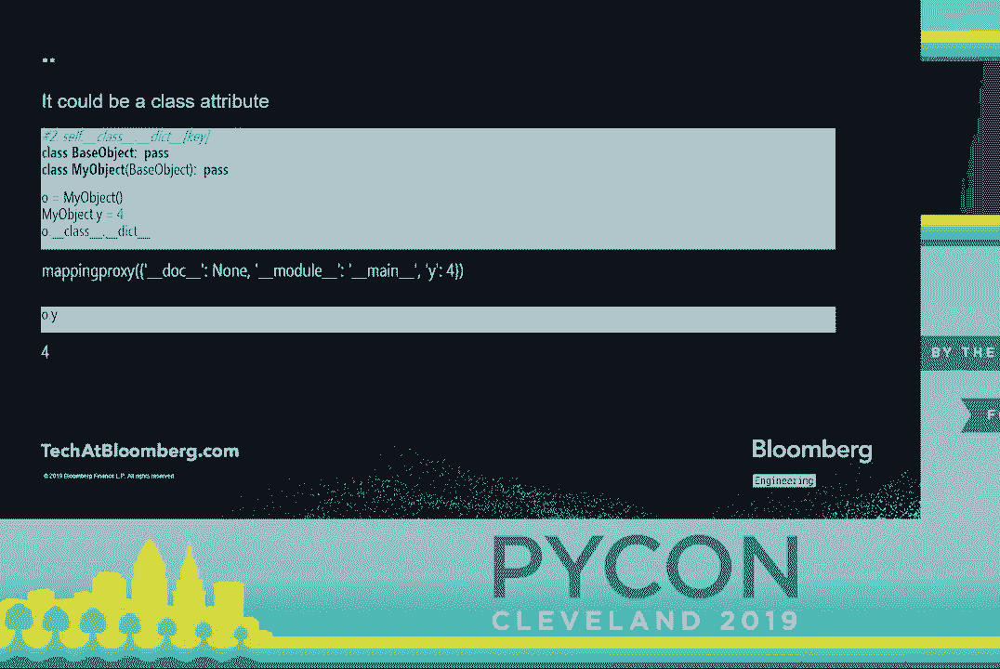

但它也可能来自父类。我们可以在这里查看，我们可以看到`T`不在类字典中，但它在第一个基类的字典中，并且还有越来越多的其他东西，大多数是非，因为我没有声明它们。当我们调用`O.dot T`时，我们得到4。所以太好了。精彩。这一切都相当简单，我们只是摆摆手，假设这能工作。

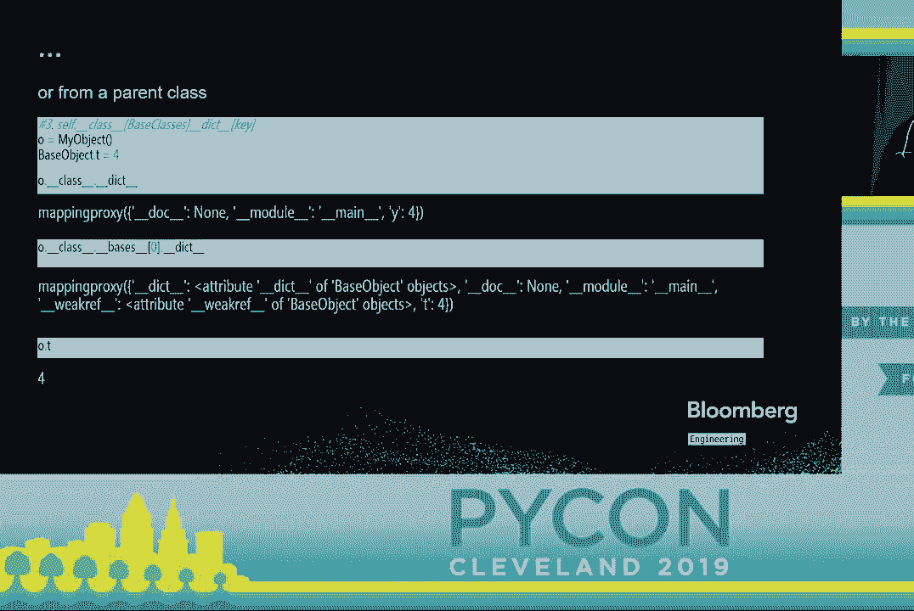

但这是Python，我们知道我们可以做更多的事情。因此我们将选择一些老旧而乏味的东西。`DundergetAdder`已经伴随我们很长时间。我相信这是Python 2.1，甚至在新的对象模型之前。`DundergetAdder`在属性未定义时被调用。

在实例上。我们可以看到这里我声明了`DundergetAdder`并创建了一个名为探针（probe）的类，其中定义了它。如果在设置`R`的值之前调用`P.dot R`，那么我得到返回的值。对不起。它在打印时被调用并返回这个`Rett`值，`getAdder`被调用。

但是在我设置了一个值之后，那条打印语句没有被触发，`DundergetAdder`没有被调用，访问是直接的，整个钩子被跳过。

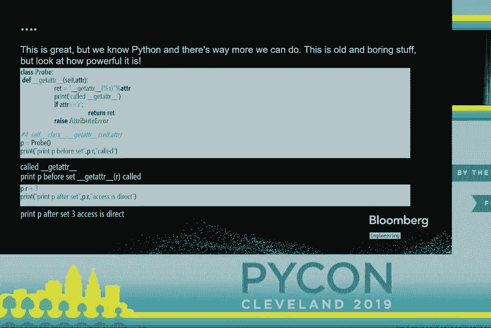

所以在另一边有一个匹配的函数叫做`setAdder`来匹配这个。`setAdder`只是让我们可以说如果我们正在设置一个值，我们将调用这个。我们只会看到这一点以保持一致性。我们在探针上定义了`setAdder`。我们将`P.dot T`设置为3。我们看到那条打印语句被触发。没有任何魔法发生。

字典没有获取这个值，因为我在`setAdder`中没有对字典进行任何更改。现在`getAdder`实际上是通过`get attribute`被调用的。我们可以重写`get attribute`。如果我们这样做，我们就可以控制它，而不管值是否在字典中。因此这里我们有一个探针（probe）。探针上有`get attribute`，在调用`set P`之前和之后。

所以在设置之前的`P`我们得到任何变量，这是来自`get attribute`的返回。在设置之后我们也得到任何变量，这也是来自`get attribute`的返回。`get attribute`实际上管理整个过程。但我们只是略过这一点，因为从概念上讲这很困难。

但让我们深入了解一下`get attribute`究竟在做什么。`get attribute`实际上是在查看类字典中的内容，然后才决定在解析类字典中的内容时该做什么。所以如果我们创建这个类，叫做`probe ND`，并在这里放一个方法，叫做`dunder get`。

`dunder get`仅返回一个小字符串，说明这个方法被调用了。我们将其放入我的对象的类字典中。然后我们有了我的对象的一个实例。当我们访问`o.z`时，我们不会得到`probe ND`对象，而是得到调用`dunder get`的结果。然而。

如果我们在实例字典中放入一个值，这里是`none`，我们就会得到那个值。就像`get add`一样。然而，如果我们添加一个`dunder set`方法，并做同样的操作，行为又会发生变化。所以我们在那个`probe ND`上放一个`dunder set`方法，我们只是继承它并创建`probe dd`，它完全相同但有`dunder set`。

我们将`probe dd`放入我的对象中，创建一个新实例，然后将其放入那个实例字典中，接着访问它，尽管那个字典中有`z`的值，但它仍然被调用。为了完整性，我们在这里看看，确保`dunder set`被称为`set`函数。所以这是同一个`probe dd`，完全相同。

我们继续将`none`作为`z`的值，除了我们将`o.z`设置为某个值。我们可以看到这里的`set`函数终于被调用了，并且它执行了打印命令，输出了“设置我的对象”和它得到的某个值。如果我们调用`o.z`，我们看到`get`函数仍然运行，如果我们检查`dunder dicked`。

我们看到它甚至没有被更改，因为我再次没有写任何东西来更改`dunder dicked`。所以`set`是一个`set`函数。当我们在左侧设置时，它被调用。

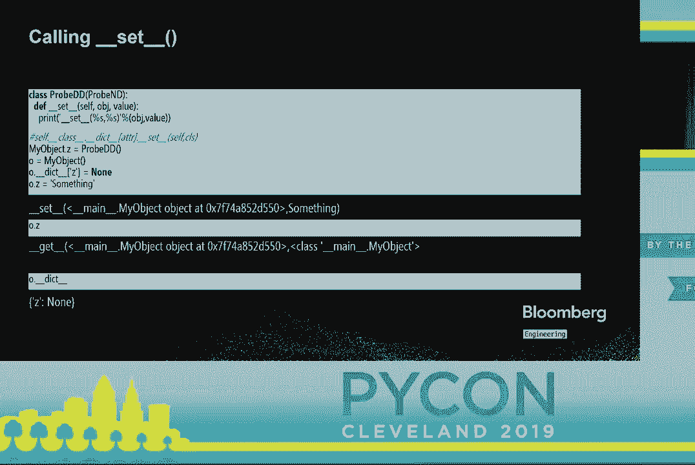

现在我们有了八件事情。前三件是我们使用字典中的`dunder`解析。首先我们查看实例字典，其次是类字典，最后是基类字典。然后第四和第五项是我们的`dunder`方法，`dunder get adder`和`dunder get attribute`。第六和第七项是称为描述符协议的东西。

`dunder get`和`dunder set`以及第八件事是，`dunder get attribute`会引发属性错误。我们肯定见过足够多的这种情况。当然，这并不是优先级顺序。优先级顺序是`get attribute`管理整个过程，正如我们所看到的，是否在那个描述符上有`get`和`set`会产生相当大的差异。

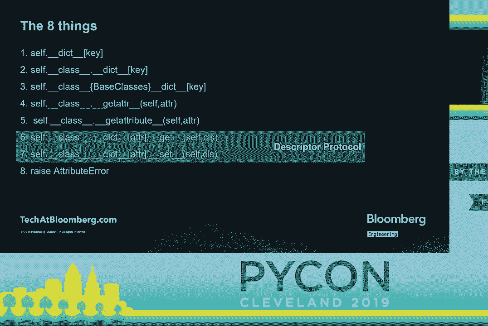

所以让我们看看描述符协议。这最初是与Python 2.2的新样式类一起引入的。在Python 3中我们知道这些是类。描述符有多达四个方法，`dunder get`、`dunder delete`和`dunder set name`，从Python 3.6开始。`dunder get`是在类字典中找到时访问的，并用于检索一个。

右侧的值，`dunder set`是在你为实例的类属性设置值时使用的。当你从实例中删除时调用`dunder delete`，而在Python 3.6中，`dunder set name`在类创建时被使用，以便让描述符知道它被分配给了哪个类和名称。这里的`get`签名。

它获得了一个对象，即正在被调用的实例的对象，而对于`set`类只获取实例和正在设置的值，删除时仅获取实例。这是因为`get`可以在类级别调用，在这种情况下实例将为`none`。其他的只在实例级别。这里有两种子协议。

如果你只定义了双下划线的`get`并可选地设置名称，你就得到了一个非日期描述符。这就是为什么我们有pro-bend的原因。如果你定义了双下划线的`get`和`set`，或者双下划线的`get`和`delete`可选设置，当然你就得到了一个日期描述符。如果有人实际定义了`delete`用于某些目的，请在会后和我聊聊。我想了解那方面的情况。我没有发现除了出于完整性和义务感之外，有人实现这个。

它在那里，并且确实有效。它绝对有效。

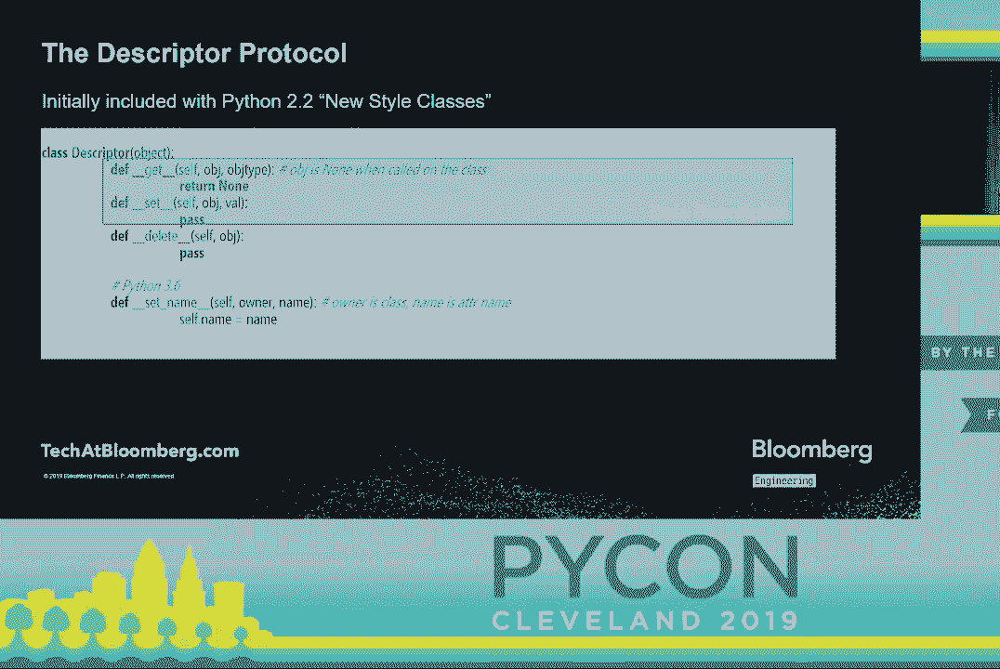

这有什么用？最重要的是要理解，这是实例方法在Python中能工作的唯一原因。网格绑定完全依赖于描述符协议。如果我们定义一个类，把一个方法放在`greeting`上，并让它打印“hi”，然后我们查看`greeting`在类字典中的情况。

我们发现它是一个函数，这并不让我们惊讶。如果我们看看这个，想知道它是否有一个`dunder get`，我们发现它确实有，这可能让我们惊讶，也可能没有。但现在在经过前面的分析后，我们会理解，如果我们创建一个`greeter`的实例并从中访问`greeting`，`dunder get`会被调用，我们得到一个不同的对象。

我们获得了双下划线的`get`的返回值，那是一个方法，我们可以调用它。这正是我们在Python 2和3中绑定方法的方式。在那里它们被称为绑定和未绑定的方法。所以方法绑定使用了它。

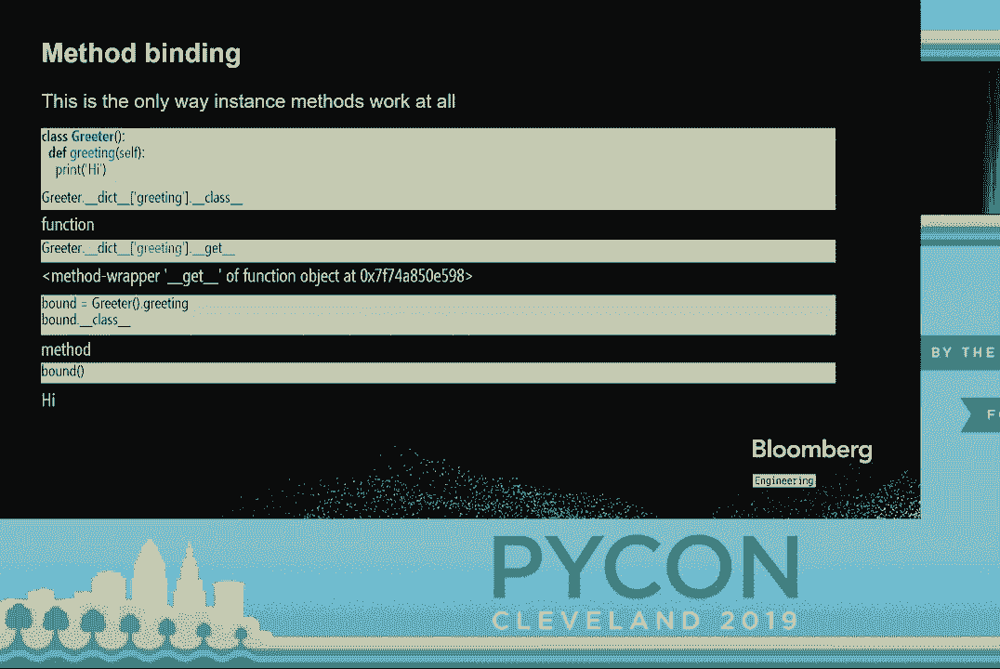

还有什么？显然是普通的方法绑定。变体方法绑定也将使用它。这就是你如何实现静态方法。这就是你如何实现类方法。这就是属性的工作原理。一旦我们进入框架，SQLAlchemy使用它。Flask在它们的配置模块中使用它。如果你开始尝试变得棘手，你很有可能会开始使用描述符。

以及你正在使用的其他任何东西。懒惰执行、代理和监控。运行时类型检查很可能会进入描述符。

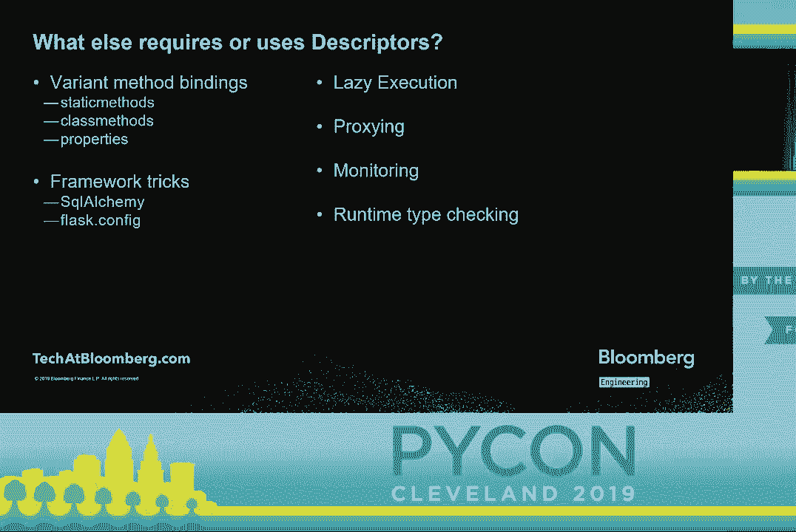

让我们看看一些例子。这是一个别名描述符。你想为一个属性有两个名称吗？当然，谁不想呢？

我写这个作为此次演讲的示例，然后我发现一些代码，我不得不重命名一个属性。没时间逐个检查所有调用站点，所以我把它放在那里。这是一个描述符。当它创建时，我给它另一个属性的名称，该属性应始终具有相同的值。这被存储为 alias two，并在初始化下。在 getter 下。

如果实例为 None，它会执行描述符非常常见的操作。它返回自身，因为它在类级别被访问。否则，它会对实例及其别名的其他属性执行 getter。如果设置了，它会执行 setter 并设置该其他属性的值。

让我们看看一个使用它的类。命名为数据类，而不是新数据类。因此数据 x、数据 y、数据 z，它们都别名遗留 x、遗留 y、遗留 z。构造函数将 x、y 和 z 设置为这些旧属性的值。因此我们将构造一个高 picon 2019 的值。然后检查这些值。因此数据 x 和遗留 x 都是高的。遗留 y 是 picon。

这正是我们设定的。数据 z 和遗留 z 都是 2019。它们通过操作符是相同的。我们更改数据 x 的值。我们看到遗留 x 的值正好匹配。这正如我们所期待的那样。其他一切都保持不变。

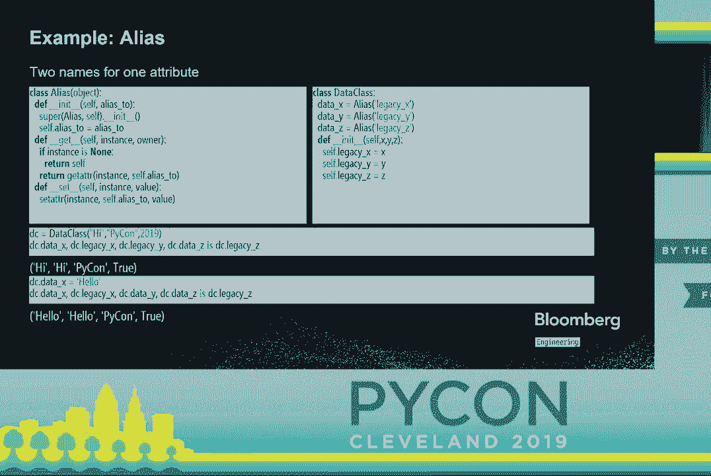

让我们看看一个非数据描述符的例子。我告诉过你，它们在方法绑定方面很有用。所以这是一个描述符和装饰器。这是一种相当常见的模式。因此在这种情况下，这是一个绑定装饰器，因为它将干扰方法绑定。

非常抱歉，不想预览那个。

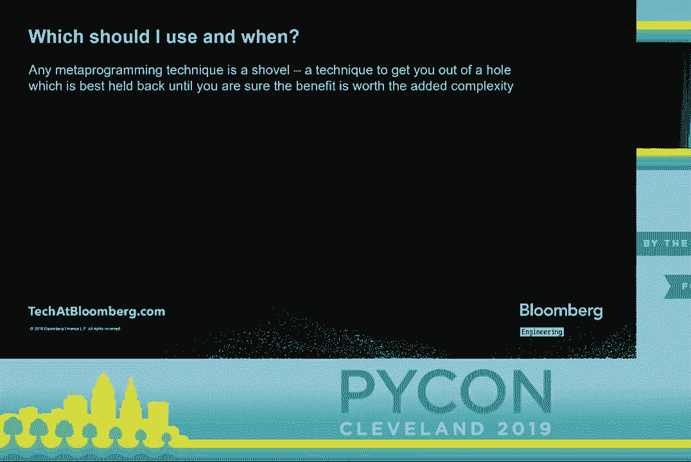

因此在初始化时，我们将获取一个函数，并存储该函数，因为它是一个装饰器。然后当我们执行 getter 时，无论是给我们一个对象还是不。这个函数处理类方法的方式不同。可能不是一种好的方式，但对于这个例子是一个好的方式。它的作用是说，嘿。

如果你没有类的实例，而你仍然调用这个方法。它不会导致错误，而是构造一个实例。使用默认参数并创建一个实例。为什么不呢？好吧，可能有很多原因。为什么不呢？

但这是可行的，在某些情况下可能足以使你的过程工作。再次强调，这是你在做之前应该考虑的事情。所以在对象为 none 的情况下，这意味着它是在类级别被调用的。你可以看到它正在创建一个部分，这相当于绑定，将新创建的类实例绑定到函数上。

将其构造并作为第一个参数传递，当然是 self。在正常情况下，传入一个实例时，它将简单地使用提供的函数正常调用 get，并传入对象和类。因此，name printer 是另一个简单的类。它接受一个名称并具有两个函数。

name print 和 print name 完全相同，除了一个是用默认方法装饰的。默认方法装饰器在前面定义。当我们在 name printer 上放置一个名称时，可以看到它们的工作方式是相同的。Andy.printName 和 Andy.namePrint 都能正常输出，这没问题。但如果我们在类级别调用它，print name 就能正常工作，因为装饰器进入了，对不起。

描述符进入，触发它的 dunder get，注意到它在类级别被调用。构造一个实例，调用 name printer 的初始化器，使用默认的名称值来构造该实例。然后在其上调用 print name，我们得到默认名称，这没问题。

或许效果不是很好，但它是可行的。Name print 是一个普通的实例方法，你不能在类级别调用它们。这是不被允许的。我们会如预期那样收到类型错误。

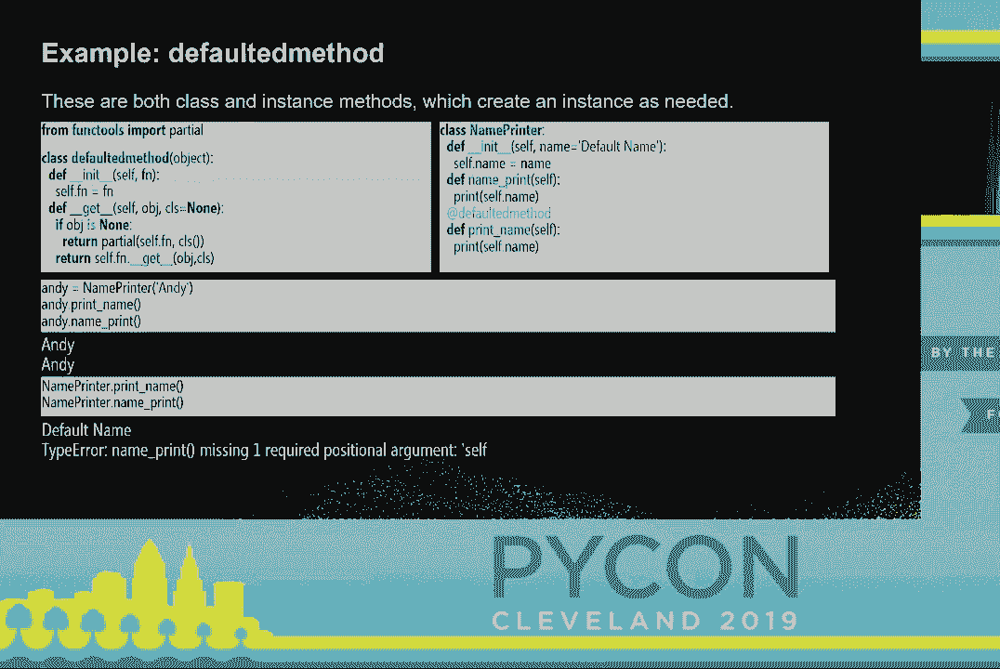

那么，问题是我们应该使用什么以及何时使用？这些就像很多，实际上任何元编程技术，是我称之为铲子的一类东西。它们适合于将你从困境中救出来。但你不想过早使用它们，因为如果你过早使用铲子，你会发现自己在洞底，手里还拿着一把坏铲子。

不要去使用这些，直到你确定好处值得增加的复杂性。

解析显示的技术和访问属性的不同方法。这是我建议的查看方式。正常的属性访问当然是你在可能的情况下应该使用的。而 adder 对于缓存惰性执行特别有用。它之所以有效，是因为一旦你设置了一个值，它就不会再被调用。

然而，如果你在代理访问一些未知的远程 API，可能会需要使用 get attribute，因为你永远不知道那些方法是什么。你只想拦截每一次访问。非数据描述符从根本上是为方法绑定而设计的。而数据描述符的一个很好的使用例子是运行时类型。至此。

我会接受一些问题。在接下来的休息时间，我也会在彭博展台，如果有人想讨论这里提出的主题，请来这个麦克风提问。你好，演讲很好。描述符能否设计成不让底层对象被访问？

让底层对象无法访问。你是什么意思，底层对象？

我是说你正在创建数据描述符对象。在Python中，通常你不能有无法从外部访问的隐藏属性。哦，正确的答案是不能。你可以做一些非常奇怪的黑客行为，检查堆栈的方式，但你永远不应该这样做。除此之外，不，描述符仍然不知道是谁在调用它。

描述符仍然没有任何过滤的方式，所以有些东西可以访问它，而有些则不能。你可以用描述符改变数据的存储位置。所以你可以使用描述符并说这个数据存储在数据库中。这就是SQLAlchemy的工作原理。SQLAlchemy中的字段根本上是在数据库中存储某些东西，而不是。

实际上是在对象上。好的，谢谢。你能告诉我一些好的资源，关于如何在继承混合时使用这个，基本上你想重写描述符的设置吗？

我认为在某些情况下会发生一些奇怪的事情，至少从我的经验来看。我想知道除了文档之外是否有其他好的资源。我想应该没有特别奇怪的事情。描述符会被附加，如果你替换它，就是用新行为替换整个调用栈中的内容。

最大的问题是，如果之前以正常属性访问过某些内容，然后你添加了一些根本不兼容的行为，或者需要初始化才能使用。这确实是一个问题，但这取决于你对描述符的使用。还有其他问题吗？可以上来问吗？

我想这将是最后一个，因为时间不够。我只是想知道，对于数据描述符的实际用例，我看到的例子大多是学术性的，可能用于验证或操纵你提供给属性的值，也许会把它更改为某个你知道的类型。

在某些界限或类似的情况下。有没有其他常见场景我们希望使用数据描述符？

是的，typing的案例是一个很好的例子，但我再次建议SQLAlchemy的案例是另一个很好的例子，在这里你可以说我想做的是将这个值存储在数据库中，或者我可能希望将它放在那里。

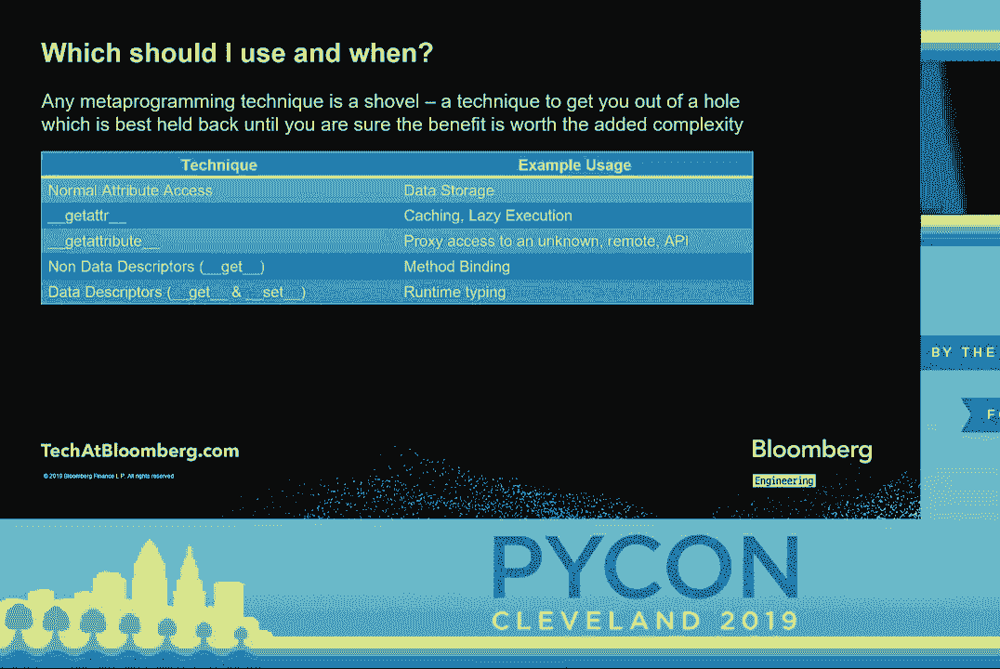

是的，也许我想进行一些额外的监控，这样你可以在关键点插入一个数据描述符，并说我希望每次这个值变化时，都将其写入我的监控系统，这样我就不需要放置日志语句了。我不必依赖任何人记得他们必须记录这个值的更改。再次。

你可以控制数据的去向。这是另一个例子。谢谢你。好的，非常感谢。

[掌声]，（掌声）。
