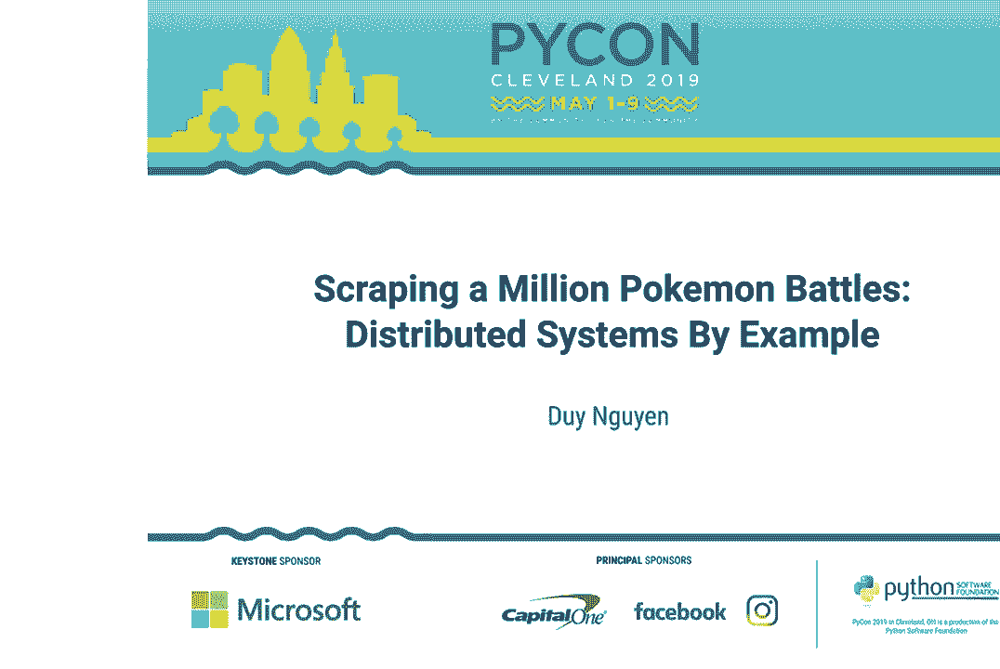
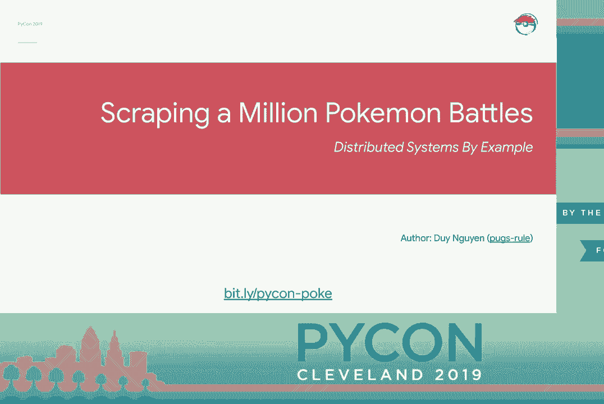
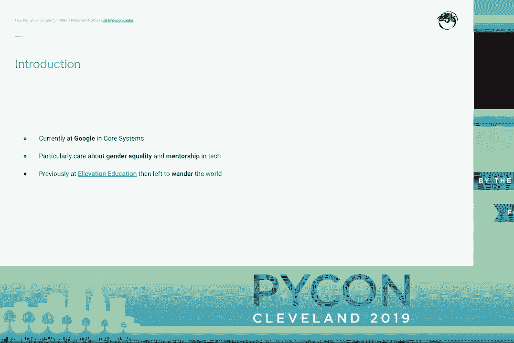
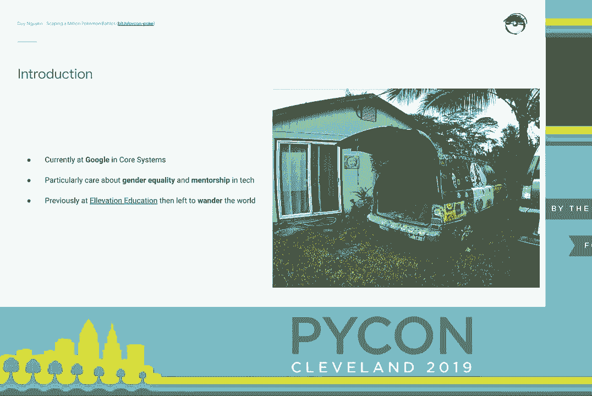
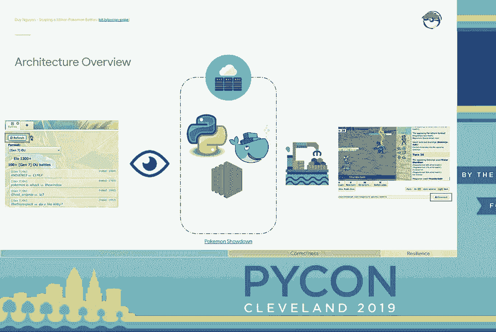
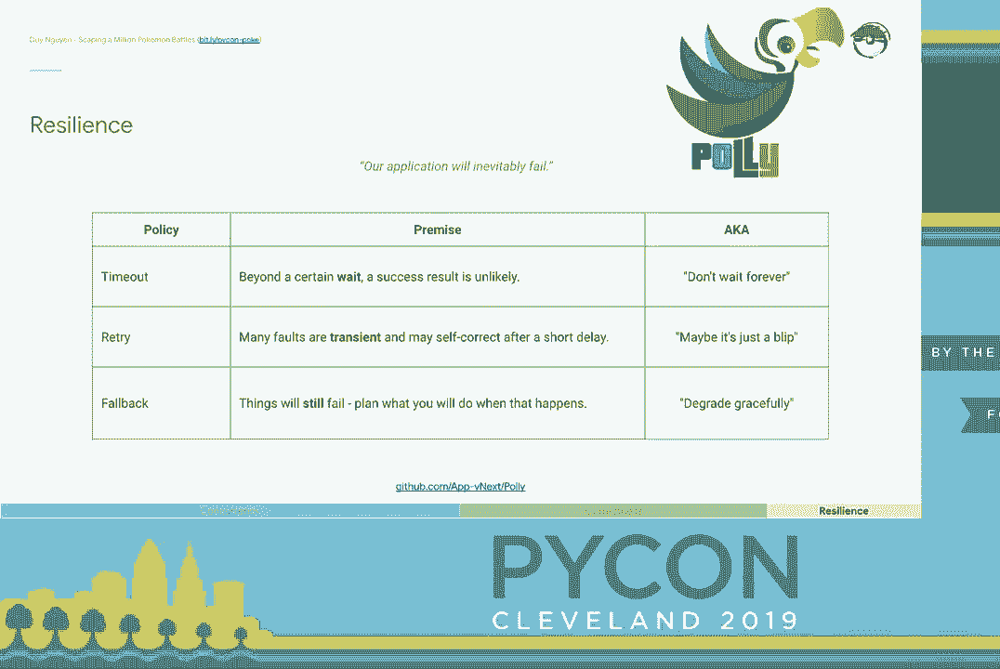
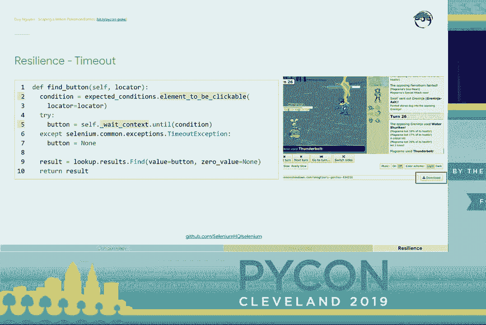
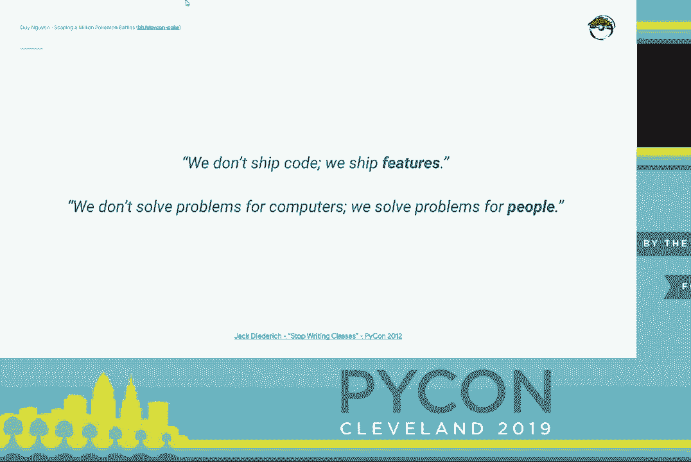

# 分布式系统入门：P7：抓取百万场宝可梦战斗 🎮





在本教程中，我们将跟随 Duy Nguyen 的演讲，学习如何构建一个分布式系统来抓取和分析数百万场在线宝可梦对战。我们将从分析一个简单的单体应用开始，逐步将其重构为可扩展、高可用的分布式架构，并探讨在云环境中处理并发、测试和系统弹性的核心概念。



---



## 概述

本节课我们将学习如何将一个简单的网页抓取脚本，演进为一个能够处理海量数据的分布式系统。我们将重点关注三个核心环节：**通过并发实现扩展**、**确保系统正确性**以及**构建故障恢复能力**。我们将以宝可梦对战数据抓取项目为例，具体讲解如何分析系统特性、划分组件边界，并运用现代云服务和设计模式。

---

## 分布式系统入门：1：项目背景与动机

大家好，我是 Duy Nguyen。我目前是谷歌的一名软件工程师。今天我想分享一个我在环游世界期间完成的个人项目：抓取和分析在线宝可梦对战平台上的所有公开战斗。

我热爱经典的宝可梦掌机游戏。网络上有一个名为“Pokemon Showdown”的网站，玩家可以在此进行在线对战。然而，我发现这个社区对新玩家并不友好，高级玩家的对战策略往往被刻意隐藏。这使得新手难以学习和进步。

我认为这些信息应该被民主化。有一天，我注意到该网站的所有对战记录都可以公开查看，无需认证。于是，我萌生了一个想法：抓取并分析所有的对战数据。这个项目后来成为了我理解分布式系统的一个绝佳案例。

---



## 分布式系统入门：2：从单体应用到分布式架构

最初，我写了一个简单的 Python 脚本。它的工作流程非常直接：
1.  监控网站的主聊天室，获取最近的对战列表。
2.  遍历列表中的每个对战链接。
3.  依次访问每个链接，等待对战结束，然后从网页中抓取对战日志。

代码结构类似于这样：
```python
# 简化的初始版本
def monitor_room():
    battle_urls = get_recent_battle_urls() # 获取URL列表
    for url in battle_urls:
        download_battle_log(url) # 顺序下载每个对战
```
这个方案对于最小可行产品（MVP）来说足够了，但我很快遇到了问题。随着想法的增多，我需要在脑海中同时维护整个应用的逻辑，这变得非常困难。此外，下载对战的速度远远跟不上我发现新对战的速度。

上一节我们介绍了项目的初衷，本节中我们来看看系统演进的第一步。我们需要分析系统的不同部分，找出可以改进的地方。

以下是初始方案面临的核心挑战：
*   **认知负载过高**：应用逻辑变得复杂，难以在脑中整体把握。
*   **吞吐量瓶颈**：不同组件的工作速率差异巨大。
    *   **监控器**：获取对战列表很快（约300毫秒）。
    *   **下载器**：下载一场对战的时间从2秒到45分钟不等，变化极大。
*   **职责混杂**：所有逻辑（监控、下载）和状态（URL列表）都耦合在一个程序中。

这些差异（职责、工作速率）表明，是时候将应用程序分解为更小的、专注的组件了。这个过程通常被称为 **“划分边界”** 或 **“分解单体应用”**。

---

## 分布式系统入门：3：引入并发与消息队列

分析了系统特性后，我们可以进行责任分区。我们将应用拆分为两个主要组件和一个协调中心：
1.  **生产者**：负责监控网站并发现新的对战URL。
2.  **消费者**：负责下载具体的对战日志。
3.  **消息队列**：作为中间协调者，传递URL工作项。

这种“生产者-消费者”模式可以通过并发来提升吞吐量。在单机多线程环境中，我们可以使用Python的 `queue.Queue` 作为线程安全的队列。

计算模型如下：
```
生产者线程 -> (放入URL) -> [线程安全队列] -> (取出URL) -> 消费者线程
```
通过增加消费者（下载器）线程的数量，我们可以近乎线性地提升下载吞吐量。Raymond Hettinger 在 PyCon 2016 Russia 的演讲中强烈建议，在大多数应用场景下，应优先使用像线程安全队列这样的高级并发原语，而不是直接操作锁等底层机制。

然而，这个方案仍有一个致命弱点：**状态（队列）存在于内存中**。如果进程崩溃，队列中所有待处理的工作都会丢失。这对于需要可靠性的系统是不可接受的。

幸运的是，由于我们已经对组件进行了清晰的解耦，替换中间的状态存储变得非常容易。我们可以将内存队列替换为云上的托管消息队列服务，例如 **Amazon SQS**。

这一替换带来了巨大好处：
*   **消息持久化**：即使我们的应用崩溃，任务也不会丢失。
*   **弹性扩展**：SQS可以处理海量消息。
*   **监控与管理**：云服务提供了开箱即用的监控工具。

这个案例表明，通过先分析系统、划分边界，我们可以让核心业务逻辑与具体的实现细节（如使用哪种队列）解耦，从而灵活地利用云服务的强大功能。

---

## 分布式系统入门：4：设计模式的普适性

“生产者-消费者”通过“消息队列”通信的模式是一个通用设计模式。有趣的是，不同的技术栈会不约而同地采用相似的解决方案。

以 Go 语言为例，其并发模型是语言的一等公民。要实现同样的功能：
*   **生产者**和**消费者**可以分别由 `goroutine`（轻量级线程）实现。
*   它们之间的通信则通过 `channel`（通道）进行。

代码如下所示：
```go
// Go语言示例（概念性）
go monitorRoom(battleChan) // 启动生产者goroutine
go downloadBattle(battleChan) // 启动消费者goroutine
// monitorRoom 向 battleChan 发送URL
// downloadBattle 从 battleChan 接收URL
```
无论是 Python 的多线程+Queue、AWS 的微服务+SQS，还是 Go 的 goroutine+channel，其核心架构都是相通的。这告诉我们，在分布式系统设计中，**关注组件如何组合与协调**，比纠结于特定语言或工具的细节更为重要。

---

## 分布式系统入门：5：测试分布式系统

引入并发和外部服务（如SQS）后，系统变得难以预测和测试。我们失去了单体程序的确定性。例如，任务的执行顺序可能错乱，启动外部依赖可能需要很长时间，网络分区和外部服务不可用成为新的故障点。

核心问题变为：**如何测试这些外部依赖？**

通常我们有几种测试替身（Test Double）策略：
1.  **Mock**：模拟对象，用于记录和验证交互。它轻量、快速，但不实现真实逻辑。
2.  **Fake**：伪造对象，实现与真实服务相同的接口，并保证关键不变性（如FIFO顺序），但采用简化实现（如内存存储）。
3.  **真实服务**：直接测试真实的外部服务（如启动一个测试用的SQS队列）。

不同的场景有不同的选择：
*   **在本项目中**：我选择了使用 **Fake**。因为当时我没有稳定收入，需要严格控制AWS开销。Fake 能提供足够的真实感，避免产生云服务费用，虽然需要我投入更多开发时间来实现它。
*   **在谷歌**：倾向于使用 **真实服务**。因为谷歌拥有庞大的基础设施，可以快速、低成本地提供测试所需的真实资源。其首要目标是节省工程师的调试和开发时间。
*   **对Python社区的建议**：我建议从 **Mock** 开始。Mock 最简单、最易学，能让新开发者快速上手。遵循“先做最简单的事”的原则，在大多数情况下，Mock 足以验证逻辑的正确性。

总结来说，选择哪种策略取决于你在**现实性**、**开发成本**和**执行速度**之间的权衡。



---

## 分布式系统入门：6：构建系统弹性



分布式系统总会失败。当我们的系统规模扩大后，故障会从偶然变为必然。因此，我们必须设计弹性策略来应对失败。

.NET 的 Polly 库以一种清晰的方式对弹性策略进行了分类。在我的项目中，我主要应用了以下几种策略：

**1. 超时**
对于下载对战这个可能耗时很长的操作，必须设置超时。我们不能无限期等待。
```python
# 等待页面上的某个元素出现，最多等待45分钟
element = WebDriverWait(driver, 45*60).until(
    EC.element_to_be_clickable((By.ID, “download-button“))
)
```

**2. 重试**
许多故障是暂时的，例如网络闪断、服务器过载。对于这类错误，重试是有效的策略。
以下是项目中针对不同错误的重试逻辑：
*   **连接丢失**：服务器断开连接，重试。
*   **WebDriver错误**：浏览器驱动进入坏状态，重试。
*   **战斗未结束**：检查时对战还未完成，重试。

**3. 后备与放弃**
当重试耗尽后，我们需要一个后备方案。在我的代码中，如果最终失败，则返回一个空列表（一个“零值”对象）。
更激进但有效的策略是 **“放弃”**。如果某个工作单元（如一个下载器）陷入无法恢复的坏状态，最直接的办法是销毁它并创建一个全新的实例。这借鉴了云环境中“不可变基础设施”的思想——与其修复，不如替换。
```python
# 概念性代码：如果重试多次后仍失败，则放弃并重建下载器
if retries_exhausted:
    return [] # 后备：返回空结果
    # 同时，在外层逻辑中，可以考虑销毁并重启这个下载器进程
```

通过组合使用**超时**、**重试**和**后备/放弃**策略，我们为系统注入了应对故障的弹性，使其能够从各种预期内的失败中自动恢复。

---

## 总结

本节课中我们一起学习了如何将一个简单的想法逐步构建成健壮的分布式系统。我们经历了以下关键步骤：

1.  **分析系统特性**：识别出不同组件在职责和工作速率上的差异，为分解系统提供依据。
2.  **划分边界与解耦**：将单体应用拆分为生产者、消费者和消息队列，使各组件职责单一。
3.  **引入并发与云服务**：采用“生产者-消费者”模式提升吞吐量，并用云消息队列（如SQS）替换内存队列，获得持久化和可扩展性。
4.  **保障正确性**：探讨了使用Mock、Fake或真实服务来测试外部依赖的策略，并根据不同场景做出选择。
5.  **构建弹性**：通过实施超时、重试和后备（放弃）策略，使系统能够从容应对网络波动、服务中断等不可避免的故障。



最终，我们不仅成功抓取了海量宝可梦对战数据，更重要的是，通过这个项目实践了分布式系统设计的核心思想：**通过解耦和组合来管理复杂性，并始终为失败做好准备**。记住，我们不只是为计算机编写代码，更是为了解决人的问题。希望这个案例能帮助你在未来设计系统时，找到更清晰、更稳健的架构思路。