# P9：Manojit Nandi - 算法公平性的测量与误测 - PyCon 2019 - leosan - BV1qt411g7JH

大家好，欢迎！今天的演讲者是 Manajit Nandi，他将与我们谈论算法公平性的测量与误测。

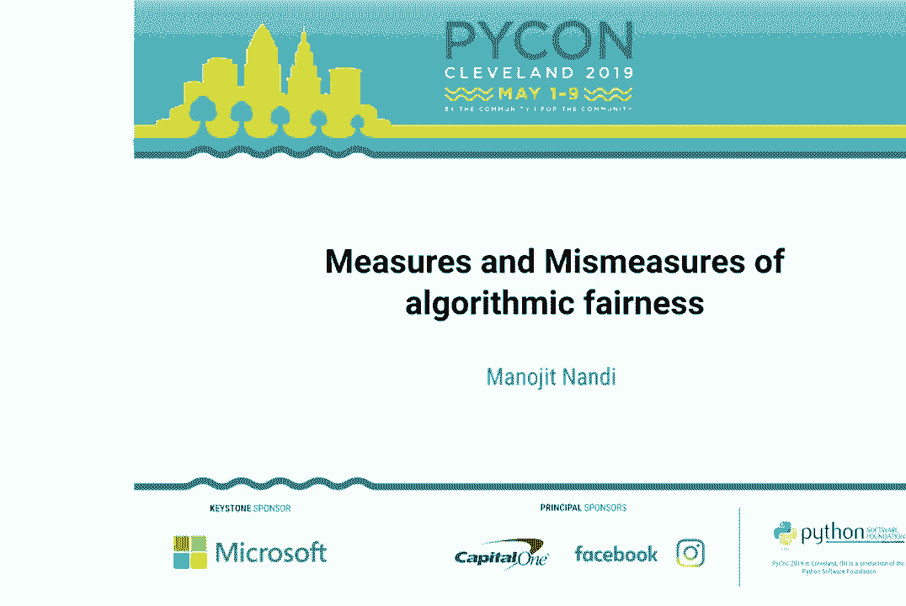

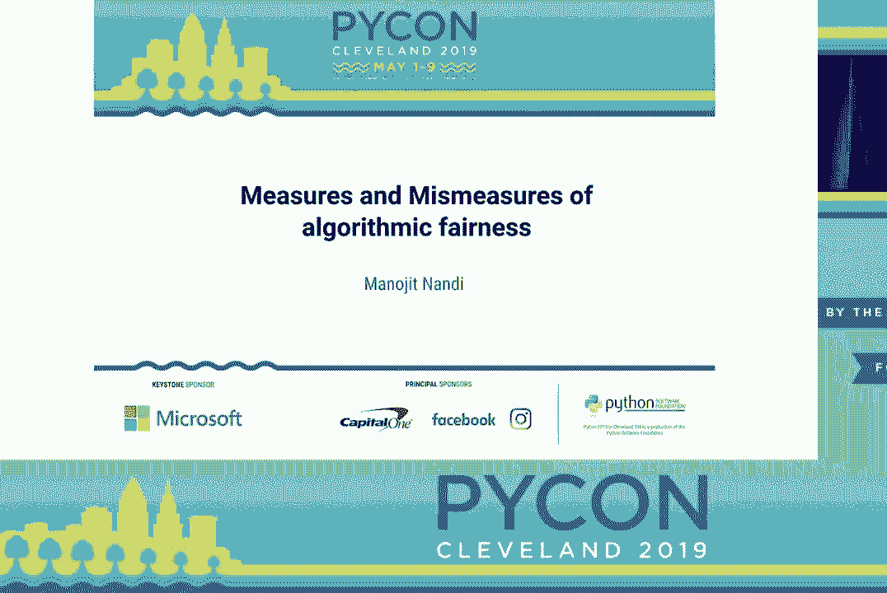

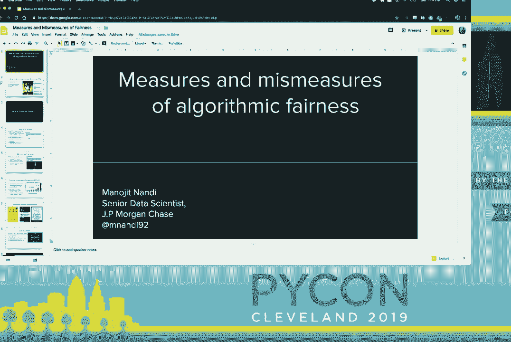

我该如何做事情？好了，这就是事情发生的方式。抱歉，稍等一下。

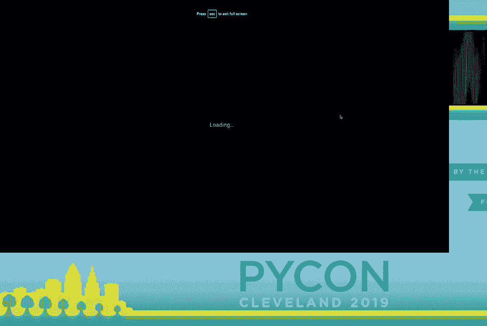

嗨，大家好，感谢大家今天下午来参加我的演讲，主题是算法公平性的测量与误测。我是 Manajit Nandi。

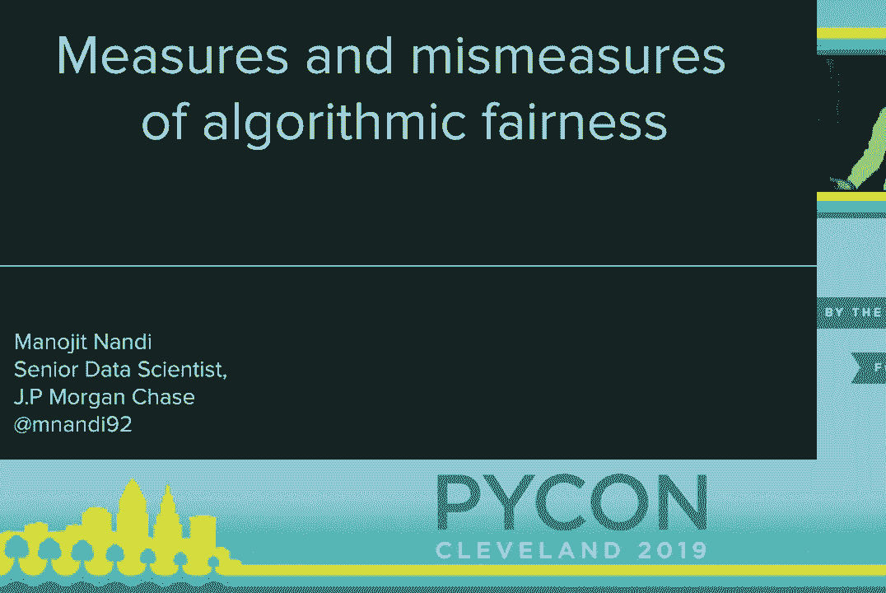

我是一名数据科学家，所以我根据 Google Cloud 计算机视觉 API 快速介绍一下自己。我将自己的照片通过 Google Vision API 处理，生成了一些标签，让我们看看其中的一些标签，以及它们的准确性。我是舞者吗？

是的，我是一名马戏团空中舞者，我每周工作 40 小时作为数据科学家，因为我得以某种方式支付房租。我是，娱乐型的吗？

希望如此，你将和我一起度过接下来的 40 分钟。我有趣吗？

嗯，大多数时候。最后，我是女孩吗？嗯，这个不对，我是一个男性表现的顺性别男性。那么，为什么 Google Vision 会认为我是女孩呢？实际上，不仅仅是 Google Vision，如果我通过微软的视觉 API 来处理，结果也会相似，它会说哦，这是一张。

所以，问题是，当他们说这是一个女孩时，他们到底在寻找什么？他们是在说我与他们理解的女孩有多相似吗？是因为哦，这是一个舞者，而我训练集中的所有舞者都是女孩，所以这也是一个女孩，还是因为某些身体特征。

关于我，让系统认为哦，这可能是一个女孩。虽然这似乎是一个有趣无害的例子，但这种自动性别识别的系统在很多地方都被使用，例如基本上为了向你展示更好的。

广告出现在出租车里，出于某种原因，因为毕竟，数据的真正目的不是为了向你展示更好的广告。想想看，这听起来真的很傻，但实际上相当危险，因为如果你对什么是男性有一些原型性的理解。

这就是女性应该是什么样子。你实际上可能会错误性别化一些人，这确实是一个很大的问题。华盛顿大学的研究者已经做了一项调查，研究了人机系统中对性别和酷儿身份的理解，他们的总体发现是，人机系统中对性别的理解固有地排斥跨性别者。

所以现在，随着我们努力成为以数据驱动的领导者，并使用这些类型的。

我们所使用的系统本质上是排除跨性别者的，我们做出的决策本质上忽视了跨性别社区的存在和生活经验，我希望这个例子能激励我们关注公平和伦理，尤其是在进行数据科学和机器学习时。那么，什么是。

算法公平性是一个旨在缓解不当偏见对人们在机器学习中歧视影响的研究领域。这是一个有点奇怪的事情，因为偏见在数据科学和机器学习中是一个非常广泛的术语，这可能是。

在机器学习中，除了内核之外的第二个最重要的术语有许多不同的定义。目前，这类研究的重点是提出公平性的数学定义。我们有这个公平性的数学定义，我们将找到一些解决方案。

但我们希望这能很好地映射回原始问题，但在过去的一年左右，我们看到了一些反对意见，例如在一篇名为“公平抽象与社会技术系统”的论文中，存在一种形式主义陷阱，我们对此过于关注。

关于数学形式化的问题，即使你解决了数学形式化，它在现实世界中的解决方案也并不容易转化，而关键在于，像费里斯这样本质上是一个社会和伦理的概念，无法通过数学完美捕捉或表现。

定义或统计指标，我们将讨论研究，想必。

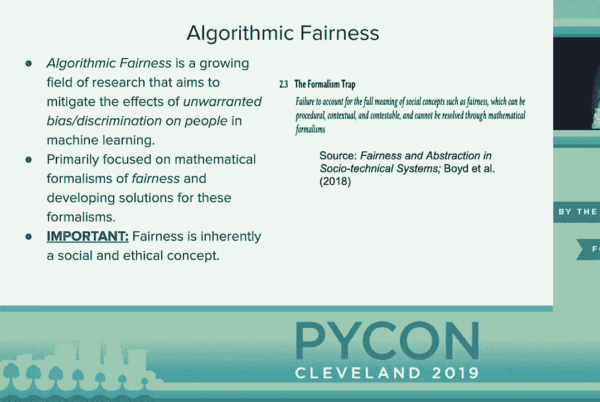

我想稍微谈一下这个问题，也就是说，我们在使用算法和数学，而数学本身不能是种族歧视，这太荒谬了。实际上，这个问题是在一月份提出的，当时一位极右翼记者批评了纽约国会女议员亚历克斯·奥卡西奥·科特斯，她表示这样。

研究表明，算法在不同情况下对黑人和西班牙裔人士存在歧视。因此，当我们说一个算法是种族歧视或性别歧视时，我们并不是说数学本身是种族歧视或性别歧视，我们并不是说质数本身就是种族歧视的。

逻辑回归本身并不是性别歧视的，我们谈论的是我们使用数学、使用算法的方式如何加强社会不平等。你知道，质数本身不是种族歧视的，但我们可以使用质数破解密码系统的方式在现实世界中具有实际影响。

回归分析来决定谁能获得信用贷款或银行贷款，这在现实世界中有实际影响，这是我们在设计这些算法时需要考虑的，它们并不是孤立存在的。

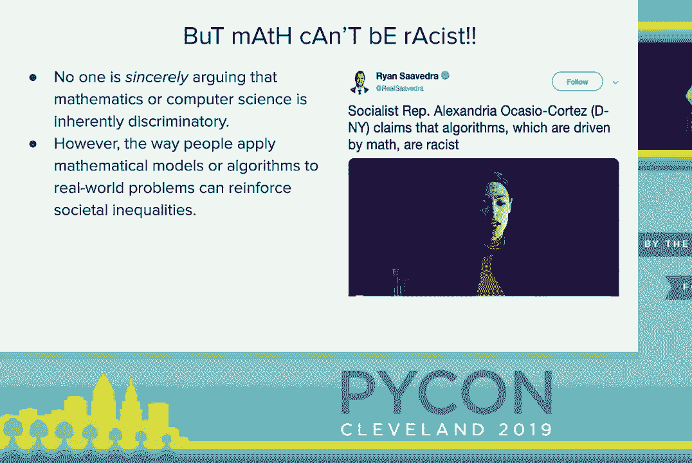

嵌入在人类系统中的算法公平性研究领域。现在让我们揭示所谓的公平性、问责制和透明度。这个跨学科的研究领域探讨如何使机器学习和技术系统关注公平的理念。

在过去几年中，公平、正义和平等的话题得到了迅速发展，你可以看到专门的会议，比如在兰塔举办的 ACM Fast-STAR。我们看到许多关于这方面的开源库，今天我们在会议上还有关于模型公平性的另一个讲座。

如果有兴趣参加的人，我已查看过那场讲座，我相信我们的两场讲座之间有足够的差异，让你参加两场都会有所收获。

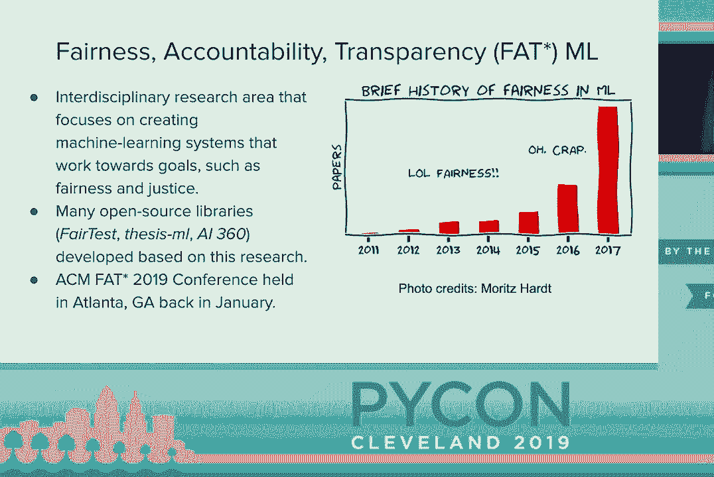

这不仅仅是研究人员在讨论，我们在流行媒体中也谈论这一点，凯西·奥尼尔的《武器与数学毁灭》，维吉尼亚·尤班克斯的《自动化质量》，以及萨法·诺贝尔的《压迫算法》，这三本书都很有趣。

这种方法是，算法如何影响人们，我们作为数据科学家，作为机器学习研究者，与我们工作的下游影响似乎是分开的。

计算机科学家训练时主要是数学和统计，我们并未被训练去思考伦理或公共政策，但我们需要理解我们的工作有下游影响。

伦理学家的角色或公共政策的角色，但我认为深层次上。我们都不想引发 apocalypse，我们都不想对他人造成伤害。没有人想成为这些书中所写的人，我认为他们处理这个问题的方式很有意思。

像这些结果如何伤害人们的视角很有趣，研究中的观点是，好的事情我们可以做，而流行媒体则讨论这些可能如何伤害人们。

关于道德的一面，我不想伤害人，但我可以鼓励你考虑这些问题，通过法律法规。也许你不在乎伤害他人，但你在乎保住工作，因为如果你违反了某些规定，就会触犯法律。

然后你可能会失去工作，因为你的公司将被罚款数百万美元，因此在美国，例如，我们有差异影响法，这些法则基本上规范了如何发放贷款，如何雇佣人，以免伤害他们。此外，在欧盟，我们现在有 GDPR。

一套总体的整体法律和规则，关于我们如何思考使用算法处理个人数据的方式，我们必须考虑。好吧，你能解释一下为什么你的媒体会这样吗？你能解释一下为什么你的神经网络没有给某人贷款，他们能否选择退出。

这也是，咱们来谈谈不同类型的。

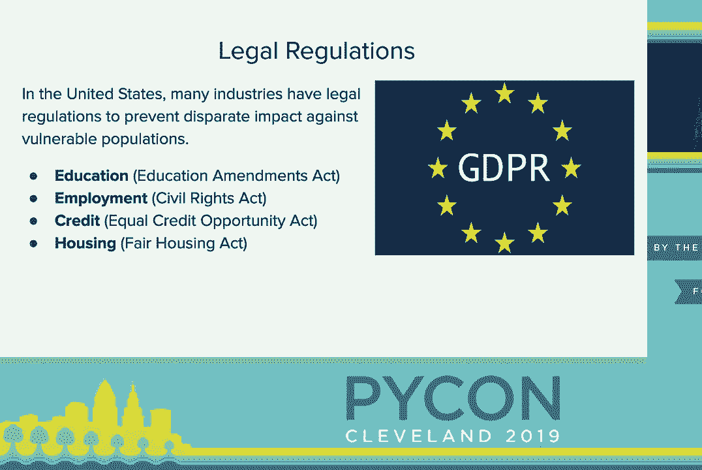

算法偏见，这基于微软和康奈尔大学研究人员的一些工作。这在现在的会议上被展示出来了。有人告诉我，它的发音像欧洲，我不确定这是不是玩笑，但这些研究确实是种。

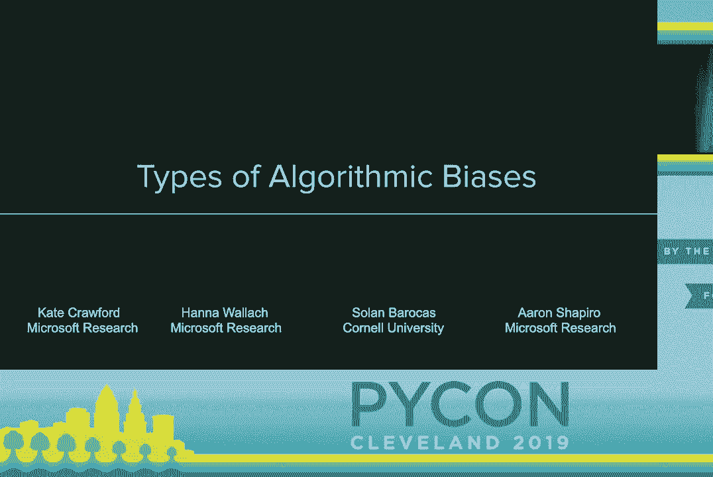

我们确定了思考所有设备的三大类方式，包括我们现在的位置、我们所走的方向以及我们需要达到的目标，首先，让我们谈谈我们现在的位置，很多关于设备的问题集中在贷款或就业分配的问题上。

这些实际上就是二元分类问题，例如男性是否比女性更容易获得软件工程职位，白人是否比非白人更容易获得信用贷款，这实际上是一个二元的“是”或“否”，而这正是大多数研究所集中于的，因为这相对容易形式化。

数学问题且容易解决，因此去年新闻报道中提到，亚马逊不得不停止使用其 AI 招聘工具，因为他们发现它只是对女性有偏见，基本上是关注像“贾里德”这样的名字，或者你曾在长曲棍球队。

回到大学时，你可能更有可能被聘为软件工程师，这真的没有意义，因此这是一种偏见，因为他们意识到，哦，我们在伤害或选择的模型是对女性有偏见的，但如果我们使用。

偏见的表现形式，因此关注的是如何通过机器学习系统传播有害的刻板印象或标签，这通常与语言问题或计算机视觉问题有关，这些都是神经网络的问题，它只是挑选出。

一个解决方案并进行一些黑箱神经网络的魔法，但我们并不关心它所做的内部机制，这些错误与之前的偏见和分配问题相比是比较难以量化的，这也是为什么现在对此的研究较少，但我们开始思考。

这有一个著名的例子，就是当谷歌照片在 2015 年发布时，竟然将一群在毕业派对上的黑人孩子标记为大猩猩。对于那些不熟悉的人来说，这就像美国的历史，我不知道这是否适用于其他西方国家，但。

大猩猩或猿类在历史上曾被用作对美国非裔人士的贬义词，因此这种标签是错误的，但它也。 引发了对非裔美国人的有害刻板印象，而这一点更难量化，因为是的，这确实是一个错误的标签，但与此同时。

此时，谷歌照片永远不会将一群白人孩子标记为大猩猩。这是一个专门给这些孩子的标签，助长了这一有害的刻板印象，而其他一些难以量化的例子就是社交媒体滤镜，例如，当你应用社交媒体的花冠滤镜时。

个体的肤色变亮，为什么呢？因为一些社交媒体滤镜会学习到更亮的肤色与美丽相关，因此当我应用这个滤镜时，会让他们的肤色变亮，所有这些都像是一个。 很难量化的问题，它正在优化过程中。

应该做的事情，但这个解决方案总让人感到不安，另一个例子是谷歌翻译，因此当你翻译一些来自马来语的句子时，马来语没有性别代词，你可以说他们是医生，他们是士兵，他们是教授，他们是。

一名妓女，她是一名护士，但你翻译成英语时，它就会自动赋予性别，他是一名医生，他是一名士兵，他是一名教授。她是一名妓女，她是一名女仆，她是一名护士，同时，谷歌翻译在进行这种数学观察时，这很难。

为什么这是错误的，这对这些句子的翻译是有效的，但总有一些东西让你感到不安，不过值得一提的是，谷歌实际上已经做出了一种临时修复，当你从一种无性别语言翻译成性别语言时，它实际上会显示。

这在性别上是有区别的，因此从“他们是医生”翻译成“她是医生”或“他是医生”，这对这个问题的快速修正来说仍然不可用。在谷歌翻译的 iOS 和 Android 版本中，你仍然会看到一些偏见，当你进行谷歌自动补全时，比如说。

如果你搜索“他是个……”你可能会得到“医生”或“士兵”的结果。如果你搜索“她是个……”在谷歌自动完成中，最后我们需要达到的目标是，最后这个版本被称为机器学习的武器化，因此关键思想是，作为数据科学家，我们被教导去训练模型，产生一些指标，但我们并不真正。

考虑到我们可能如何伤害人们或如何被误用，2017 年，斯坦福大学的一组研究人员试图创建一个基于人脸图像预测人们性取向或性偏好的算法。

有一个尝试预测某人是异性恋还是同性恋的工具。值得注意的是，世界上有些国家将同性恋视为犯罪，如果你作为同性恋者公开出柜，你可能会被国家处决，还有许多地方虽然没有被犯罪化，但。

作为一个公开的同性恋者是非常危险的，因此如果某人使用这个模型，他们可能会把它作为武器对抗那些国家的同性恋者。要考虑的是，没有任何数学衡量标准或单元测试可以告诉你这主意不好，你不应该这样做。

这将要求你在场中有文化人类学家和历史学家来告诉你，“嘿，这可能会伤害人们。”这就是为什么我真的很高兴有这样的讨论开始，数据科学家和机器学习技术专家开始思考伦理培训。

我们需要进行像加州大学伯克利分校或卡内基梅隆大学这样的学位项目，它们开始纳入伦理成分。我认为这确实是培养一种更加关注我们工作对人们下游影响的技术文化的开始。

不像我们那么简单，所以让我们谈谈不同类型的公平性衡量标准。

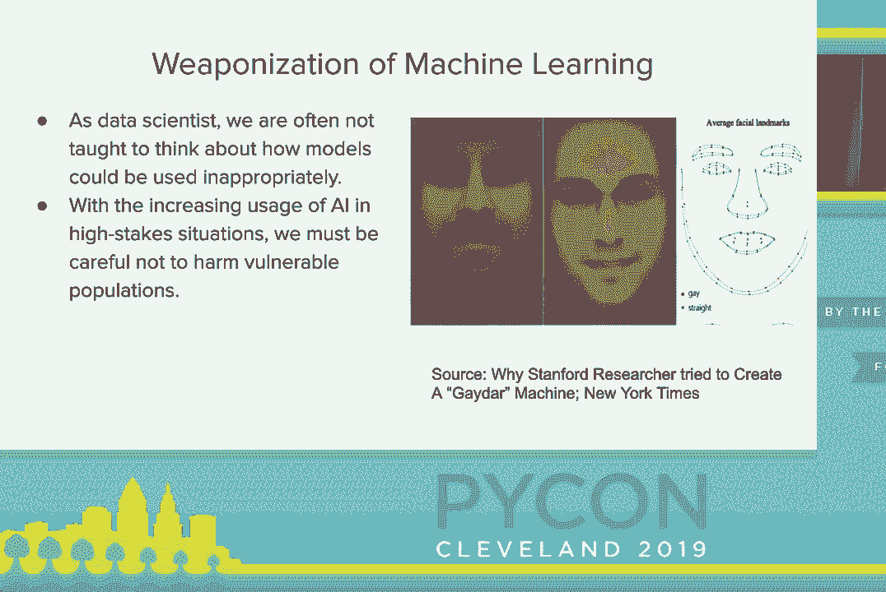

这些就像是数学定义，我将真正讨论它们是什么以及它们的一些主要缺陷，因此这基于斯坦福大学两位研究人员山姆·科贝特·戴维斯和谢罗德·古尔的工作。他们基于这些行为衡量标准和不当衡量标准。

这次演讲的标题就是基于此，因此我们将讨论差异。

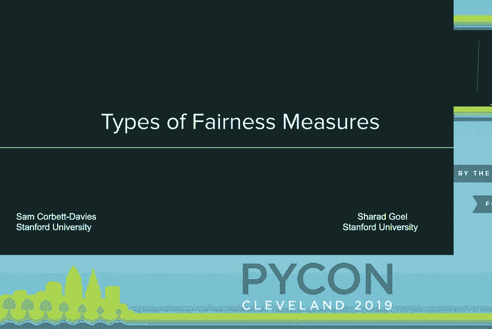

算法公平性的定义，去年阿文德·纳拉扬教授的演讲真正展示了在他演讲时有 21 个算法公平性的定义，现在已经有超过 30 个。

把这件事看作计算机科学家和统计学家，我们会想，好的，有三个定义，肯定有一些比其他的更好。必须有一个真正的公平定义可以使用，但这其实并不真实，为什么？因为公平是社会和文化的产物。

而且，50 年后我们认为公平的事情，与今天认为的公平是不同的，但这些不同的定义可以归纳为三大类反分类。

分类成本、问题平衡，最后是校准，我要给个快速警告，这里谈话的故事变得有些技术性和数学性。首先，这些反分类措施是什么？也就是说，你有这些保护特征，比如种族。

性别、宗教和出生地等特征，你有未保护特征用于模型，而这些反置特征理想情况下是，当你做出决策时，它应该有效地忽略那些人口特征。忽略种族、忽略性别、忽略宗教。

决策或行为的方式，就是这个个体公平的概念，你根据人的品格判断一个人，而不是肤色。两个人如果拥有相同的未保护特征，应该受到平等对待，但这里的事情在于，像是 50 年前被认为公平的概念现在就不再被认为公平。

你不能仅仅从模型或数据中抛弃种族和性别，感觉好像我完成了，因为我们现在开始意识到有一些代理特征，我们需要担心，比如那些并不直接编码种族或性别但与之高度相关的特征。

举个例子，2012 年有个故事，办公用品公司 Staples 推出促销，如果你住在竞争商店 20 英里内，我们将给你特殊优惠券折扣，促使你光顾我们的商店。问题是，那些住在离竞争对手 20 英里的社区，通常是富裕的郊区社区。

住在富裕郊区的人群有特定的种族人口特征，所以，当你的模型基于位置进行歧视或做出决定时，它就是这样的。 

无意中表现得好像是在基于种族做出决定，因此 Staples 因为不同影响而遭到巨额罚款，因此这些特征对于设计关注公平的模型非常有用。那么什么是关注公平的模型呢？这有点像传统的机器学习。

监督模型现在有了这个需要考虑的附加组件，即那些受保护的特征，因此在标准机器学习中，你有特征 X 和标签 Y，你基本上是想将特征 X 映射到标签 Y，而现在使用公平性算法时，你有 X。

你有 Y 和受保护属性，例如种族、性别、宗教、出生地作为声誉类别 Z，你想要的就是学习能够学习标签的特征，所以你想学习给谁贷款，我们不想意外地学习种族或性别。

一个很酷的算法是公平性意识的 GAN，我认为这是一个非常聪明的想法，它与 GAN 的工作原理是将这两个子模型链接在一起，一个是你的标准机器学习分类器，它试图学习特征并预测标签，另一个则在尝试。

处理标签并学习并保护类别，因此你可以考虑一种双重的思维方式：我试图学习一个好的分类器，而你试图通过说哦那个分类器偶然学习了种族或性别来打破我，这就是它真正运作的方式。

在这个红框中的损失函数是说我是一种好的分类器，不是我在学习哪些特征来预测谁能获得贷款，而蓝框中的则是在说，好的，你学习了谁可以获得信用贷款，你是否意外地学习了种族或性别，基本上是谁能获得贷款。

其实只是弄清楚这个人是白人还是非白人，如果你仔细观察，如果你研究机器学习和正规化，比如最初的回归或逻辑回归，如果你仔细看着它并深深注视它，它看起来有点像一个。

正规化，我想成为一个好的分类器，但我不想在这种情况下过于复杂，这种复杂性有点像我不想意外地具有歧视性，这有时被称为准确性与公平性之间的权衡，老实说，我不喜欢这样称呼。

权衡，因为如果你真的思考我们为什么要做这一切，原因在于我们的训练集是有偏的，因为我们的测试集是有偏的，这意味着我们的测试标签是有偏的，就像我们的答案键是错误的，我们不想要完美学习测试的模型。

设置标签，因为它也在学习这些偏见，所以我们预计准确性会下降，我也不喜欢称之为权衡，因为这会与一种有害的想法相关联，即促进多样性需要你参与亚最优性，因此你看到。

这就像科技招聘一样，假如一家软件公司说“嘿，我们的 50%的软件工程师是女性”，这是好事，但总会有人在推特上说：“嘿，我有个绝妙的主意，为什么不根据人才而不是性别来招聘最优秀的人呢？”

这是与一种有害观念有关的，认为为了实现多样性，你必须选择较不理想的候选人或技能较低的候选人，这完全不正确，多样性对科技领域是非常有益的，拥有不同生活经历和不同思维方式的人。

在房间里进行思考是重要的，因为他们可以在你愚蠢的时候指出你，这对于数据科学非常重要。那么，使用这些反分类措施有什么危险呢？听起来好像是个好主意，我们应该根据人们的重要特征来评判他们，而不是。

不小心学习了那些保护特征，通过移除这些保护特征，我们在某种程度上忽视了作用于不同人口群体的潜在过程。这些指标似乎是在努力使结果平等，但实际上，公平是使过程平等，因此有一种方法。

这是一种危险，类似于监狱复犯率，因此，当你是一名囚犯并且在辩护时，你是否可以获得保释，监狱如何运作就是这样，它给你一个分数，范围在一到十之间，这大致表明放你出去的风险有多大。

如果我们释放你，你再犯罪的可能性是什么？问题在于男性被告在同一分数下比女性被告更容易再犯。因此，如果你在这种情况下忽略性别，平均两条线，你就会得到。

平均线高于女性被告的比率，因此如果你把阈值设定在略低于 60%时，而对我来说，如果你仅仅看性别，你会说好吧，我们不会释放女性被告，当她们的分数是八分或以上，而如果你取平均值。

你现在有了那个阈值，如果是七分或以上，我们就不会释放任何人，因此你现在拘留了更多女性，这与之前的情况不同。如果你单独将性别视为一个特征，接下来是分类公平，因此分类公平可以视为一种扩展。

在传统机器学习中，你根据准确率、精确度、召回率或 AUC 等指标来评估你的模型，而现在你需要在不同的人口群体中进行这些指标的评估。例如，这是著名的性别研究案例。

麻省理工学院的学生**乔伊·布洛拉尼**展示了这些商业人脸识别算法（如微软、IBM 以及 Face++）在识别白人男性面孔方面非常优秀，对白人女性面孔也很擅长，对黑人男性面孔的识别也不错，但在种族与性别的交集上。

对于黑人女性面孔的识别效果极差，因此在这些不同的人口群体中，黑人女性的准确性显著低下。乔伊还在 YouTube 上有一段非常酷的视频，作为一首口语诗，讲述了商业计算机视觉的现状。

系统经常错误地识别著名的黑人女性，如**米歇尔·奥巴马**或**奥普拉**，而这些类型的指标或这些成本平衡指标通常用于执行法律法规，因此就像**平等机会**、**平等就业机会法**或类似的东西。

在幕后使用这些分类指标，那么最常见的指标是什么呢？这些指标中最常见的是**人口平衡**，即不同人口群体或受保护群体获得积极结果的频率。

审计模型用于评估不同影响，像是贷款的发放，查看不同人口群体，然后说，白人男性获得贷款的比例与非白人非男性获得贷款的比例之间的差异最多应为**20%**。

这就是**80%**规则的含义，他们的比例必须在彼此的**80%**范围内，而这听起来不错。如果我们是一家银行，你需要平衡向不同人群发放的贷款数量，但问题是你可以满足这一直接要求，但。

可能没有真正考虑到你行为的长期后果。这是加州大学伯克利分校研究人员的一篇论文，讨论了公平机器学习的深远影响，他们展示了如果你进行这种人口平衡。

橙色人群和蓝色人群之间的对比，你向蓝色人群提供了更多贷款，这些人随后可能违约，因此他们的信用评分下降，整体信用评分分布也随之下降，所以如果你考虑满足。

这就是我们必须使积极结果平等的直接约束，然后你可能会在长期内伤害他们，另一种考虑方式是，在招聘时，比如我们需要确保招聘女性的比例与人数相等。

我们在技术职位上雇佣男性的百分比，如果那些女性因为有毒的工作环境在五六个月内离开，你真的值得这个金星吗？我不这么认为，接下来是错误的积极率的平等，这正如名字所示。

现在我们不是在关注积极结果，而是在关注错误的积极率，错误的积极率就像模型说“是”，但实际上“不是”，这有时被称为平等机会，想想看，错误的积极率其实就是错误的积极。

在错误的积极率加上真正的负面率中，如果你想降低错误的积极率，理想情况下你应该专注于减少错误的积极数量，但如果你想想，我可以通过增加系统中的真正负面数量来降低错误的积极率。

警察局长，有人来找你说，哦，你的拘留过于严格，逮捕的黑人男性人数太多，拒绝保释或假释的人数过高，那么你能做些什么来降低这个错误的积极率呢？

理想情况下，你是减少错误的积极率，给予更多本应不被保释的黑人男性保释，但你也可以增加真正负面的数量，真正的负面是什么？真正的负面是一个被逮捕的人，他们被释放，并且没有再次犯罪。

那些人是轻罪的犯人，所以我可以增加系统中的真正负面数量，你逮捕更多轻罪的人并释放他们，哇，错误的积极率就下降了，你被教导过，你达成了平等，这不是很好吗？

你只需逮捕更多的黑人男性，针对轻罪，哦，这太糟糕了。如果你不考虑这一点，只是优化那个指标，而不考虑导致这些数字的社会因素，你最终会伤害我们想要帮助的脆弱群体。

最后一个是校准，校准是一个非常难以用通俗语言解释的事情，它涉及统计校准，真正的思考方式是，任何事件的发生，比如谁赢得了一场政治选举，有一个真实的结果，我们知道谁赢了。

有人没有失去，我们正在弄清楚我们的模型在多大程度上实际预测了这个结果，例如使用再犯率，给人们的评分从 1 到 10，或者儿童保护服务，孩子被给予一个评分。

从一到二十表示孩子在危险中的程度，比如一分表示这个孩子在家庭中并没有真正的危险，而二十分则意味着这个孩子处于严重危险中，必须立即将他们带离家庭。

每当你谈论算法公平性时，必须提到这个 Compass 例子，所以这是不可避免的 Compass 分数，从一到二十，如果得分足够高，那么在某个阈值 t，例如 15 时，他们会把孩子从家庭中带走，因为孩子在那里的危险。

如果你有一个白人孩子和一个黑人孩子，他们的得分都是 15，那么这应该是最重要的，他们应该被认为处于同样的危险水平，他们在那户家庭中受到伤害的机会应该都是 70%或 75%。

考虑统计校准，如果两个人得到了相同的分数，那么种族人口统计学应该没关系，应该只在乎，我们重视这个分数，而这个分数就是最终的依据，我们仅基于这个分数做决定，如果模型校准良好，那么 15 对于两者来说都是界限。

这如何运作呢？CPS 会进入家庭进行评估，并给这个孩子一个从白人家庭到黑人家庭被移除的儿童百分比，我想关键在于得分对于相同的人意味着相同的事情。

我想在我之前的幻灯片中讨论这些指标时，通常底部有一个小要点说危险，这就是为什么这是不好的，但我在这里没有，因为我有一个完整的幻灯片专门讨论校准的问题。

例如，我认为这是一个重要的案例研究，因为关于 Compass 的问题是什么？这就是监狱和再犯算法，2016 年出版的 ProPublica 表示，使用 Compass 来决定谁可以保释时，实际上是在保留。

黑人被拘留的比例更高，拘留那些如果被释放就不会再次犯罪的黑人被告，因此 ProPublica 的 Northpoint（该 Compass 算法的开发小组）争辩说，我们的风险分数是良好校准的，如果你得分 8。

或者是我们拘留你，因此分数模型是良好校准的，但问题在于得分的基础分布并不是，如果我们给黑人男性的分数是 8 或以上，而我们给白人男性的分数则很少，那么很明显，拘留白人男性的机会更高。

评分为八分或以上的黑人男性被拘留的机会很高，因为他们更可能获得更高的分数，因此你的模型并不是种族歧视的。而这一点也展示了使用这些模型的另一个重要方面。

这些指标中，你可能在某些指标上表现很好，例如统计校准，但在另一些指标上（如假阳性率）表现很糟，因此，仅仅盲目优化这些指标将导致实际上并不能产生良好结果的解决方案。

那么我们该怎么办？我打算提出一种低成本的解决方案。

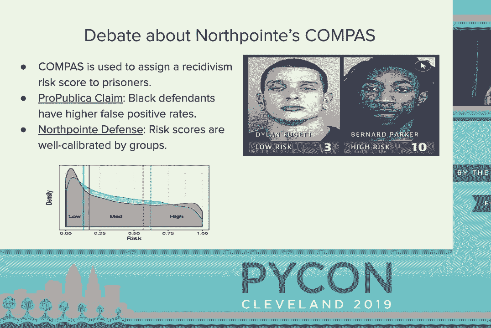

一种定量的低技术解决方案就是撰写更好的文档，这听起来可能很傻，但我认为我们现在在人工智能伦理方面所面临的一部分问题是硅谷有些封闭，硅谷认为这里充满了技术天才，他们相信自己达到了“第十三”的境界。

通过饮用盐水和进入冷冻浴来提高认知水平，他们不需要平民来告诉他们如何做他们的工作，他们会自己处理，不需要政府法规，也不需要外部人士来帮助他们，这完全不是真的。

你可以想象，像汽车测试这样的例子，历史上更好的文档能够更好地传达数据集的构成以及这些模型的工作原理，因此即使你不是文化人类学家或伦理学家，如果你能更好地沟通你工作的结果，也能让人更清楚地理解你的训练和测试过程。

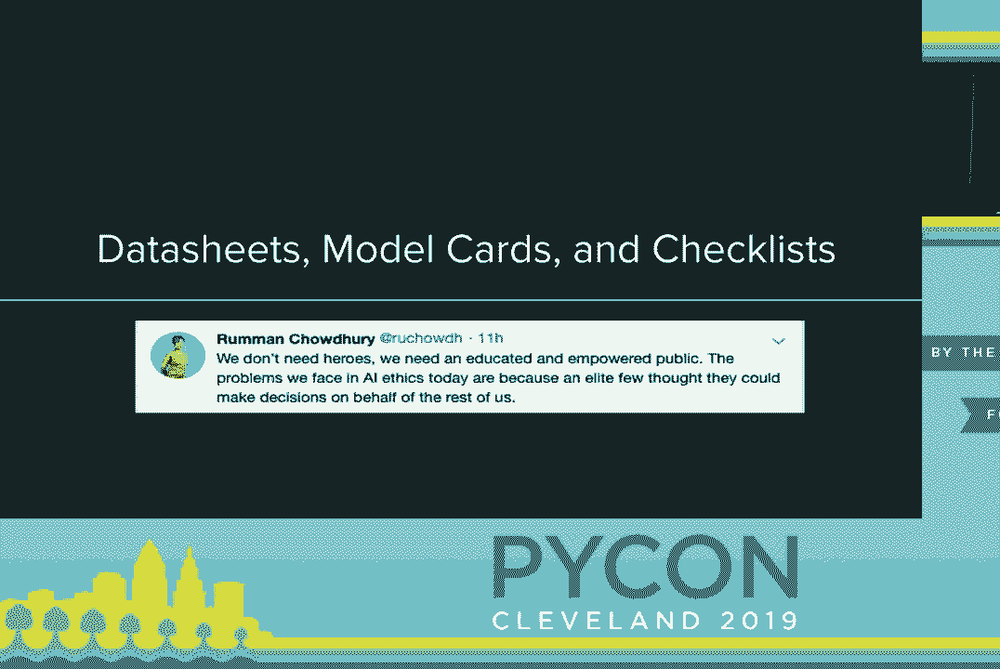

这些人可以评估，比如这会在长期内伤害到某些人群，路易斯可能无意中伤害了那些你没有考虑到的群体。因此，关于数据集的这一很酷的想法来自于蒂姆内特·盖布鲁，她基本上。

提出的建议是，像汽车行业或临床测试等其他行业通常会有标准化的评估模型的方法，我们应该为数据科学数据集采用类似的标准。

这些汽车测试是针对像专业假人碰撞测试而进行的，专业假人通常具备成年男性的特征，因此在现实世界中，当实际的汽车碰撞发生时，女性和儿童受到的伤害极其严重。

现在我们有法律法规规定，必须确保也对专业的成年女性假人和儿童假人进行测试。这份文档我认为能够回答许多问题，比如数据是如何收集的，是否以不排斥个体的方式收集。

我认为这非常重要，因为我确实认为我们关于机器学习的思维方式。是比较集中在模型上，而不是那么关注于。训练集，我们没有考虑到是什么使得一个好的训练集是一个好的。训练集，你可能会想“好吧，是什么使得一个好的训练集”，但不仅仅是。

缺失数据没有异常值，这确实回答了我是否可以进行。统计分析的问题，但并没有回答“我是否排除了我应该关注的个体群体，是否排除了跨性别社区，是否排除了非异性恋个体”。因为我收集数据的方式。

我确实认为这将讨论的重点从模型转向了。我们如何实际收集好的数据，这之前我们真的没有考虑过。因为我们只是有点假设“好吧，这个数据集存在于虚空中，我是从 Kaggle 上获得的，或者从其他网站上获得的”，但我们并没有真正考虑。

比如，那个数据集是否真正适合我的问题，还是仅仅是。方便可用的。接下来，模型也是类似的，这项工作是由谷歌研究的 Meg Mitchell 团队和。谷歌 AI 公平性小组完成的。因此，他们提出的方案有点类似于标准化。

机器学习模型的文档，你记录好这个。模型是如何产生的，以及在部署之前如何训练它，让我们讨论。它应该如何使用，预期的使用场景是什么。它是如何被评估的，而不仅仅是“好吧，是看准确性校准”。

或者是准确度，还包括它如何在不同的人口群体中进行评估。它如何在这些人口群体的交集上进行评估。我们只是把交叉分析引入到我们进行数据科学和机器学习的方式中。我认为关键点还在于，这些。

伦理问题是什么，如果你确实设计了一个性取向分类器，伦理。问题是什么？这可能会如何被用于伤害他人，或者在同性恋是非法的国家被作为武器。关键在于，更多透明的模型报告将使我们能够更好地。

沟通应该如何使用我们的模型，因为现在我们有点像是。就像“好吧，我想做计算机视觉，我们就抓取 YOLO 网或。Alex 网，然后把它应用到所有问题上”，尽管那些模型。并不是专门为你的特定问题设计的，最后还有。

这个工具 Deion 是一个数据科学项目的伦理检查表。Deion 由一个叫 Driven Data 的组织制作，他们为非营利性政府组织提供咨询，同时也。举办数据科学为善的竞赛，所以想象一下 Kaggle 竞赛，但带有。

以明确强调帮助某种社会公益的方式，例如帮助教师、帮助教育、帮助药物治疗等。这项工具可以在你的代码库中创建一个 Markdown 文件，包含一个检查清单，用于检查不同的事项，比如数据是如何收集的，是否以公正的方式收集，是否覆盖了所有人群，是否排除了某个群体，以及人们如何被告知他们的数据集是如何收集的。

在社会科学中，知情同意是非常重要的，你无法获得研究批准，除非你获得了知情同意。

参与者另一方面，在数据科学中，我们能够在不告知用户的情况下对他们进行 A/B 测试，因此你可以对人们进行一些相当糟糕的 A/B 测试，为什么你要这样做而不告知他们，同时也要考虑数据存储，我认为这是。

这很重要，因为我们现在有了被遗忘的权利的概念，如果有人不想让他们的数据集被用于算法中，他们应该能够说我不想让我的数据被使用，从你的记录中删除它，并且你应该能够轻松做到这一点。

应该能够遵守这一点，这也是 GDPR 的一部分，当你部署模型时，你如何看待如果模型出现问题该如何下架？有个新闻说你的模型正在伤害这些群体的人，你如何将模型从生产环境中移除，我认为这很重要。

提前考虑这些问题，我想说这些模型、数据表和检查清单并不是万无一失的，这并不能完全防止你伤害那些你不想伤害的群体，但我认为这算是一个好的第一步，有助于。

让我们在进行数据科学时稍微聪明一些，最后我想特别提到 AI Now 研究所，这是纽约大学的一个研究机构，关注 AI 的文化和社会影响，因此他们每年举办关于伦理、组织和问责的研讨会。

他们最近也发表了一篇关于 AI 多样性危机的论文，所以与 AI 相关的许多问题，如我们缺乏多样性、缺乏不同的声音或意见在场，这导致很多临时解决方案。

如果你讨论的是算法的偏见，而不是仅仅依赖于一个自动化算法，而是让一个人来参与检查决策，那么如果你参与检查的大多数人都是白人男性，他们并不了解非白人群体的生活经历。

与男性在一起，他们将无法检查你的算法所做的决策。他们没有意识到这是其他不同人群的问题。因此，我认为这很重要，因为它也涉及到一些。没有多样性的长期技术后果。

在人工智能、机器学习和数据科学中缺乏多样性，这真的很。

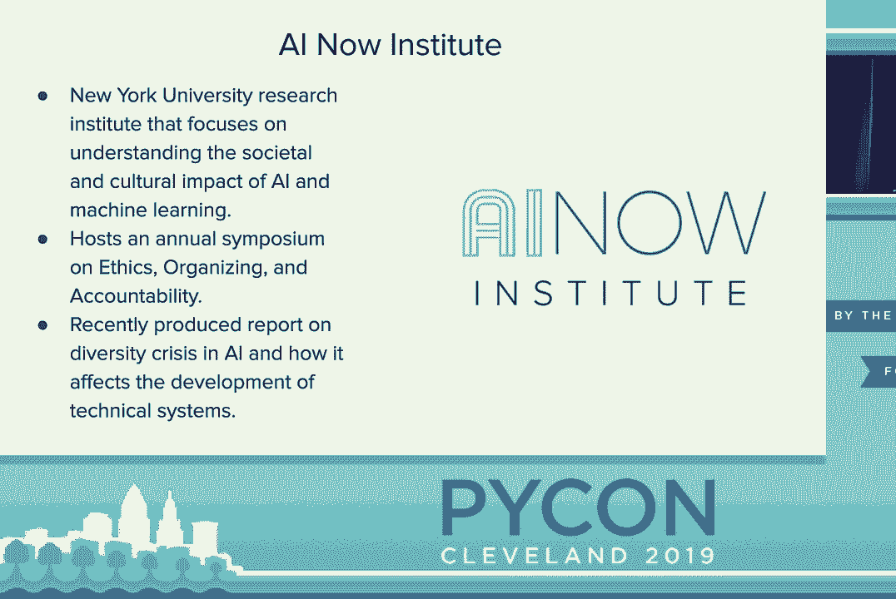

这里是我在演讲中提到的所有论文，如果你想要的话，可以在之后查看。是的，我希望这次演讲能引人入胜，希望你们都能学到一些东西。如果有时间，我希望你们去看看关于衡量模型公平性的另一场演讲，你们，（掌声），[掌声]。
