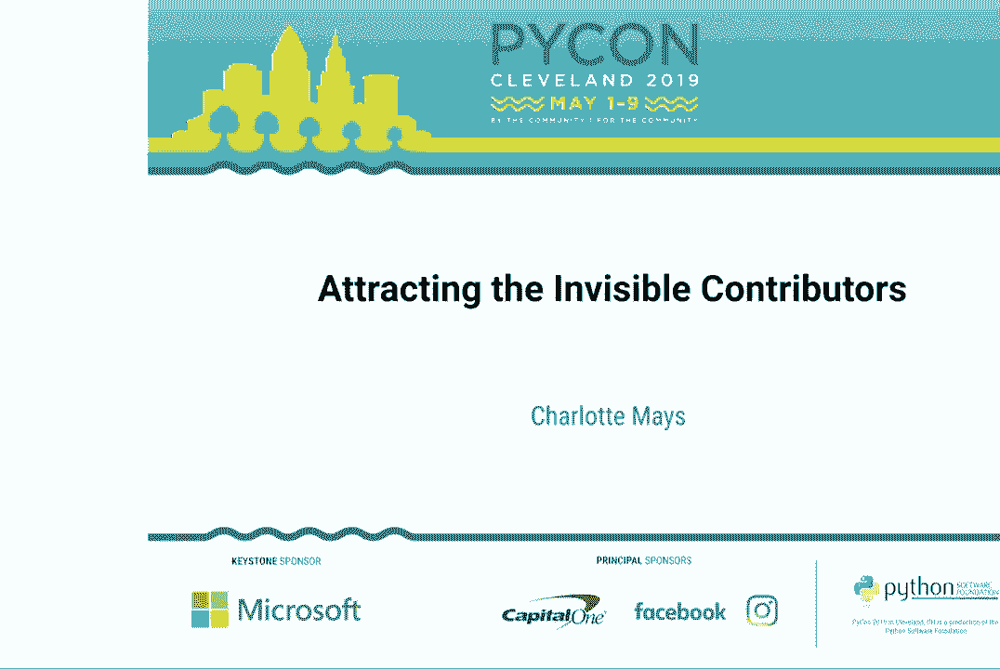
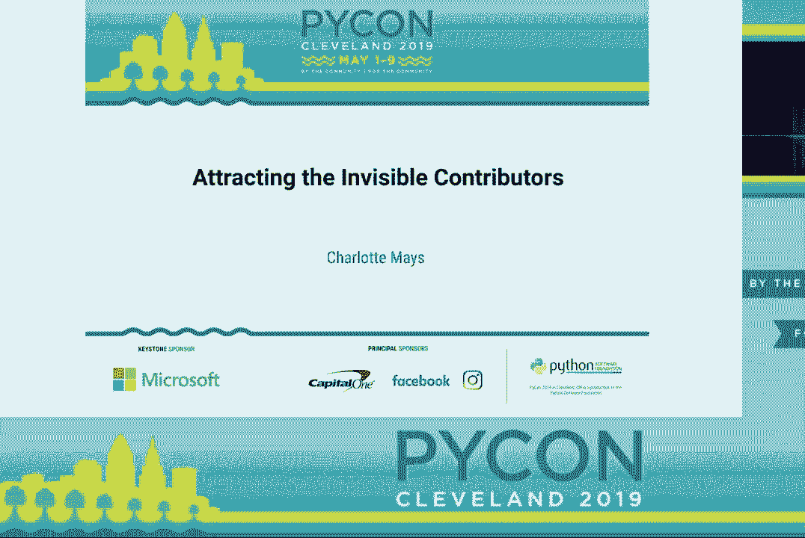
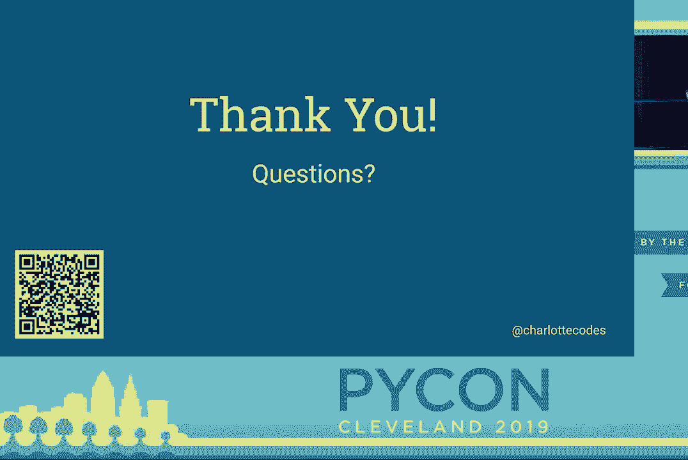

# 003：吸引隐形贡献者 🎯

在本节课中，我们将学习如何让开源项目对“隐形贡献者”更具吸引力。这些贡献者可能是有热情但缺乏经验的新手，他们常常因为各种障碍而望而却步。我们将探讨如何通过改善沟通、文档、友善度、术语和行为准则，将项目从“滑动”状态转变为“粘性”状态，从而建立一个更繁荣和包容的社区。

## 概述与背景

大家好。今天我们将探讨由**夏洛特·梅斯**分享的关于吸引隐形贡献者的主题。

在开始之前，我想提供一些背景信息。我是本地普拉提小组的共同组织者，因此我花了很多时间与参与者交流，了解他们的期望和目标。我经常听到人们说：“我想要一个能真正参与编码的地方。”同时，作为一个开源项目的核心贡献者，我看到了项目维护者和潜在贡献者之间存在的许多未被察觉的障碍，这些障碍实际上正在驱赶一些人。

那么，我所说的“隐形贡献者”是谁呢？他们通常是学生、自学成才的程序员，或是项目的普通用户。他们可能对开源社区不熟悉，不了解社区默认的假设和流程。当他们查看一个项目时，可能会觉得“这看起来太复杂了”，然后选择离开。

接下来的内容将是一个信息密集的分享。这些见解基于多样化的观点，旨在帮助你理解不同类型的潜在贡献者。如果你是开源项目的维护者或参与者，那么你就是我的目标受众。

面对大量信息时，请不要感到绝望并忽视它。相反，请以适当的节奏进行小的改变。挑选几件可以改进的事情，逐步实施。只要你持续改进，就会不断接近吸引更多贡献者的目标。

如果你想基于这些建议做出改变，请记住，现有贡献者的意见也很重要。如果有人反对，可以询问他们是否有替代方案来解决你希望解决的问题。目标是让现有贡献者和新人都感到受欢迎，共同建设一个繁荣的开源项目。

最后，这些原则不仅适用于开源项目，也可以作为框架，帮助公司吸引更多样化的候选人。在思考如何使公司环境更具包容性时，这些原则同样值得考虑。

## 核心概念：项目的“粘性”与“滑动”

首先，我将定义两个在本演讲中使用的核心术语：项目的“粘性”与“滑动”。这不是一个非此即彼的二元概念，而是一个光谱。

*   **粘性项目**：拥有多个长期贡献者。潜在贡献者查看项目时能看到活跃的沟通，即使他们最终没有贡献，也至少会尝试询问：“嘿，我感兴趣，能告诉我更多吗？”
*   **滑动项目**：可能只有少数长期贡献者（如维护者），偶尔有零星的贡献。几乎没有来自外部查看者的沟通，没有人会说：“嘿，我想帮助这个项目。”

**本演讲的目标是帮助你的项目从“滑动”的一端向“粘性”的一端移动。**

那么，是什么决定了一个项目在光谱上的位置呢？我将从以下五个方面进行详细阐述：
1.  沟通
2.  文档
3.  友善
4.  术语
5.  行为准则

上一节我们定义了项目的“粘性”与“滑动”，本节中我们来看看第一个关键因素：沟通。

## 1. 沟通 💬

你需要确保人们能够轻松地与你的团队沟通。许多项目仅通过邮件列表或 IRC 频道进行沟通，这些方式各有优缺点。

*   **邮件列表**：有利于存档互动，方便后人查阅历史对话，但不适合实时交流。
*   **IRC**：适合实时交流，但通常缺乏存档，新加入者无法查看之前的对话。

对于新程序员来说，这两种方式都可能带来不便。因此，在考虑沟通渠道时，你需要思考以下几点：

*   **显而易见**：沟通方式应在每个用户可能访问的地方（如文档首页、GitHub 仓库）明确标出。
*   **易于访问**：渠道应对非技术人员友好。
*   **存档互动**：这非常重要，因为它让新人能看到社区的互动风格，判断自己提出“新手问题”时是否会得到友好对待。
*   **减少摩擦**：尽量使用人们已安装或无需安装即可使用的工具（例如，Slack 有网页版）。这能降低第一次尝试沟通的门槛。

## 2. 文档 📖

我们都知道文档很重要，但这里需要明确区分**用户导向文档**和**开发者导向文档**。

用户文档说明“如何使用项目”，而为了吸引隐形贡献者，你必须提供**以开发者为中心的文档**。

以下是开发者文档应包含的内容：

*   **环境设置**：详细说明如何设置开发环境、虚拟环境、运行测试等。应为所有主流操作系统提供步骤。
*   **PR 提交流程**：说明提交 PR 后，多久能得到回复、审核标准是什么。可以链接外部通用指南（如 GitHub 使用教程），但也要说明项目特有的流程。
*   **提交后期望**：说明测试是否会自动运行、贡献者能否自行查看测试结果并开始修复。

核心原则是：**任何你觉得是“常识”或“假设”的事情，都应该记录下来或提供链接。**

## 3. 友善 🤝

友善意味着对所有问题和提交保持礼貌，即使是在拒绝的时候。

项目维护者常会遇到滥用和过高期望，很容易产生不耐烦的情绪。但请记住，隐形贡献者会阅读你所有的回复。如果你对他人尖酸刻薄，新手会担心自己受到同样对待，从而不敢参与。

**你可以拒绝而不失友善。** 例如：
*   对于不兼容的功能 PR，可以说：“感谢你的工作，但这个功能与项目方向不符。也许你可以考虑分叉并自行维护。”
*   对于代码质量不佳的 PR，可以说：“这不符合我们的代码标准（附上文档链接）。也许你可以先在沟通渠道里找人讨论一下如何改进。”

此外，如果你感到疲惫，不必立即回复。可以稍后处理，或请团队其他成员帮忙。关键是避免留下刻薄、轻蔑的公开记录。

## 4. 术语 🗣️

术语的使用直接影响新人的第一印象。

*   **减少行话**：只使用必要的专业术语以确保清晰。不必要的行话会让新人觉得项目高不可攀。
*   **避免冒犯性语言**：有些术语可能具有冒犯性。例如，“主从”（master/slave）一词历史悠久，但会让部分人感到不适。可以考虑使用“主要/副本”、“领导者/跟随者”等替代词。将这些视为可以逐步解决的技术债务。
*   **注意隐含偏见**：避免使用如“简单到你妈妈也能做到”这类带有性别或年龄偏见的短语。
*   **尊重心理健康**：不要滥用“强迫症”（OCD）等描述心理健康状况的词语来形容对代码风格的严格要求。

如果有人指出术语问题，请认真对待。不必立即改变，但应慎重考虑。

## 5. 行为准则 ⚖️

行为准则是社区健康的基石，但实施起来需要技巧。

*   **不要重新发明轮子**：直接采用一个成熟、经过审查的行为准则（如贡献者公约），只需进行微调。
*   **澄清误解**：行为准则不限制你讨论技术内容，而是规范讨论的方式。它要求你在项目官方渠道中保持专业。
*   **执行至关重要**：仅仅张贴行为准则而不执行是无效的。人们需要看到它被认真对待，才会感到安全。
*   **妥善处理违规**：第一次处理违规可能会很棘手。关键是要公正，关注具体事件，区分“指控”和“人身攻击”。
    *   **指控**：“B 说的 X 让我不舒服。”——应调查处理。
    *   **攻击**：“B 总是说谎。”——不应容忍。
*   **必要时采取行动**：如果某人持续制造问题，可能需要禁止其使用沟通渠道，甚至禁止贡献。虽然痛苦，但移除一个骚扰者可能会为多个新贡献者打开大门。

## 总结与资源

本节课中，我们一起学习了如何通过改善**沟通**、**文档**、**友善度**、**术语**和**行为准则**这五个方面，来吸引“隐形贡献者”，使你的开源项目变得更“粘性”。

记住，改变无需一步到位。从小处着手，持续改进。现有贡献者和新人同样重要，目标是建立一个繁荣、包容的社区。

这里有一个包含幻灯片和更多示例材料（如沟通工具对比、文档示例、行为准则链接）的二维码，供你进一步参考。如果你有任何问题，我很乐意在会议期间交流。

感谢大家。

[掌声]