# 008：统计性能分析与sys模块

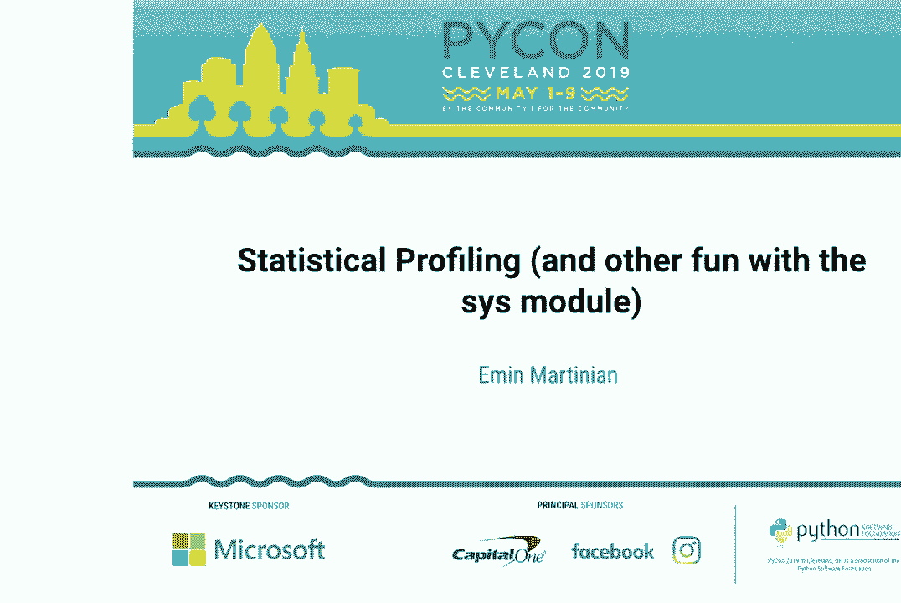

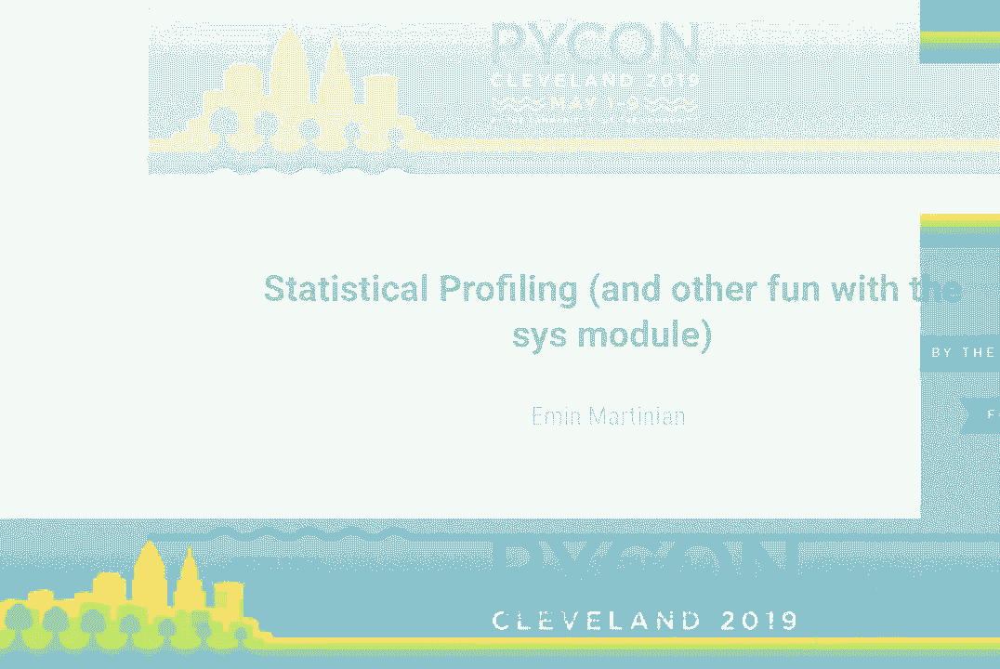

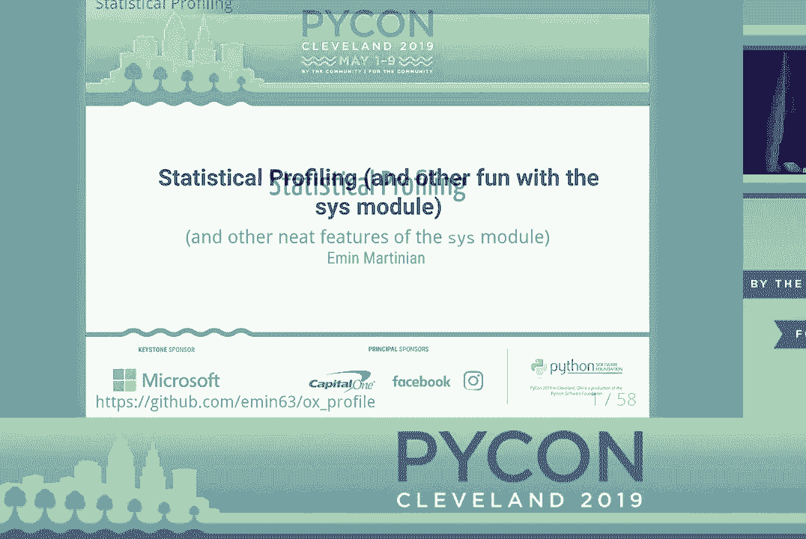

在本节课中，我们将要学习Python性能分析的核心概念，特别是统计性能分析（Statistical Profiling）的原理、优势以及如何利用`sys`模块中的强大工具来实现它。我们还将对比确定性分析（Deterministic Profiling），并了解如何编写自己的、适用于生产环境的低开销分析器。

---

## 什么是性能分析？📊

根据Python官方定义，性能分析（Profiling）是一组统计数据，用于描述程序的各个部分执行的频率和持续时间。性能分析的主要目的是找出程序中运行缓慢的部分，以便开发者可以集中精力优化这些部分，编写出更高效的代码。

在Python中，程序的各个部分（如函数）会映射到这些统计数据中。

---

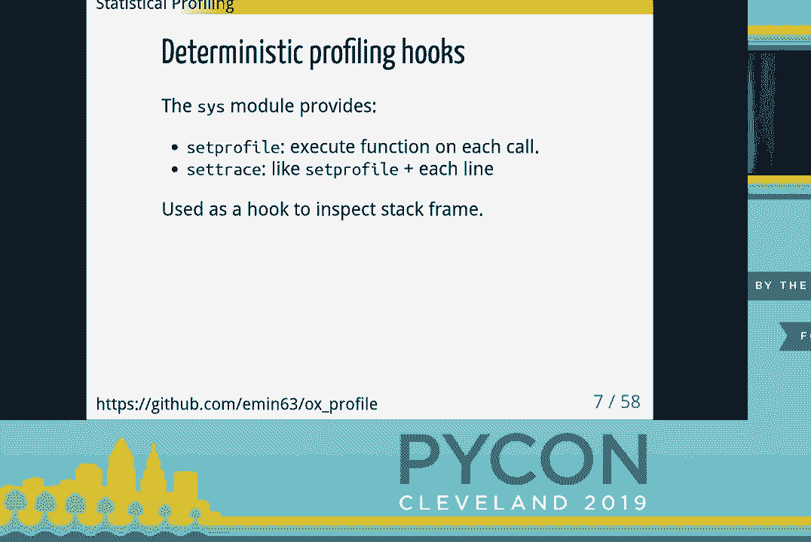

## 确定性性能分析 🛠️

上一节我们介绍了性能分析的基本概念，本节中我们来看看一种常见的分析类型：确定性性能分析。

确定性分析会精确记录每一个函数调用的开始和结束时间。Python内置的`cProfile`模块就是一个易于使用的确定性分析器。

以下是使用`cProfile`的基本方法：
```python
import cProfile
cProfile.run(‘your_function()‘)
```
运行代码后，`cProfile`会返回一份分析报告，其中包含：
*   函数调用次数
*   每个函数的调用频率
*   总时间、每次调用平均时间、累积时间
*   按耗时排序的函数列表

通过查看这份报告，你可以清晰地识别出程序中哪些部分运行缓慢或耗时超出预期，从而进行针对性优化。

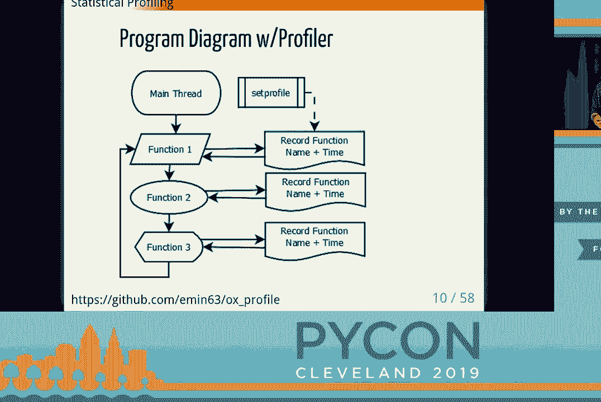

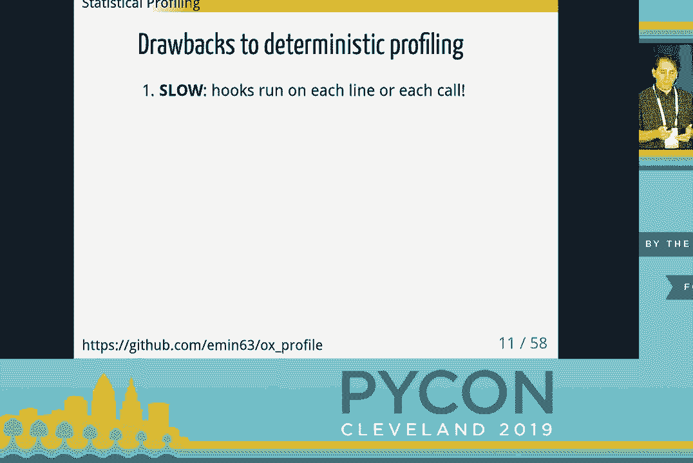

### 确定性分析的工作原理

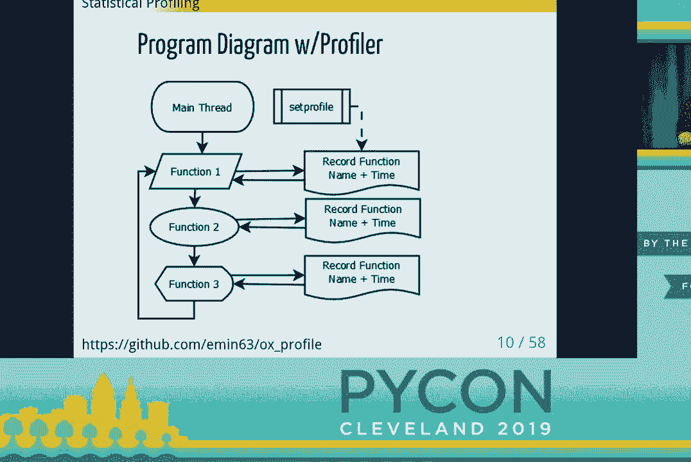

确定性分析之所以能精确追踪，是因为`sys`模块提供了强大的钩子（hooks）。

*   调用`sys.setprofile()`可以设置一个分析函数。此后，解释器将在**每次函数调用**时执行这个函数。
*   调用`sys.settrace()`可以设置一个跟踪函数。此后，解释器将在执行程序的**每一行代码**时调用这个函数。这可以用于代码覆盖率分析或其他精细控制。

设置这些钩子后，分析器就能检查栈帧（Stack Frame）。

### 理解栈帧（Stack Frame）

Python解释器通过栈帧来跟踪函数调用链的状态。例如，函数`foo`调用`bar`，`bar`调用`baz`。每个栈帧都包含许多信息：
*   `f_back`：指向调用者的栈帧。
*   `f_globals`：该帧可访问的全局变量。
*   `f_code`：一个代码对象，包含关于正在执行的代码的信息。其中，`co_name`属性给出了当前正在执行的函数名称。

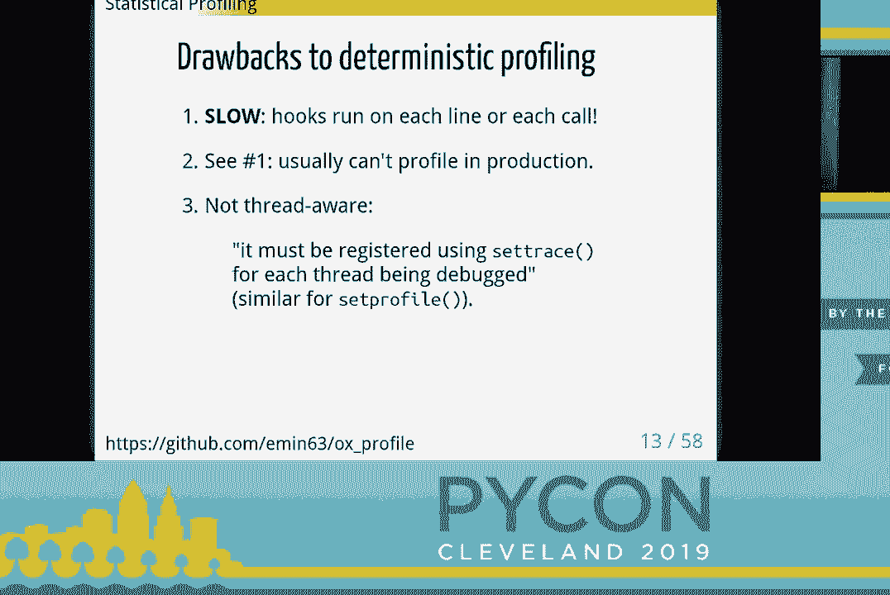

分析器通过检查当前栈帧的`f_code.co_name`，就能知道正在执行的是哪个函数，并进行记录。

### 确定性分析的工作流程图示

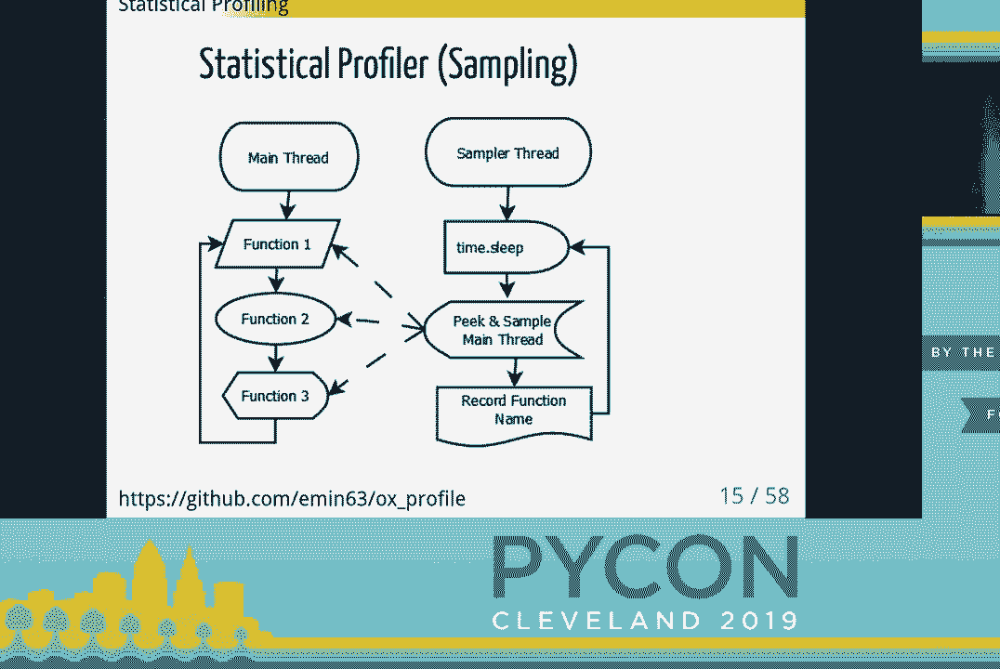

假设主程序依次执行`function1`、`function2`、`function3`：
1.  解释器进入`function1`，立即调用你通过`sys.setprofile`设置的分析函数。分析函数记录函数名和开始时间，然后将控制权交回解释器。
2.  解释器执行`function1`。
3.  `function1`执行完毕，系统再次调用你的分析函数。分析函数记录函数名和结束时间，然后返回。
4.  解释器继续执行`function2`和`function3`，过程同上。

**关键在于，对于每个函数调用（或每一行代码，如果使用`settrace`），你的分析函数都会被调用。**

### 确定性分析的优缺点

**优点**：提供极其详细和精确的执行信息，是开发和测试阶段优化代码的利器。

**缺点**：
1.  **速度慢**：为每个调用或每行代码都运行钩子函数会带来显著开销，难以在生产环境中使用。
2.  **难以捕捉生产环境行为**：用户的使用模式可能与开发者不同，确定性分析在生产部署中难以实施。
3.  **线程处理复杂**：默认的确定性分析不是线程感知的。如果一个函数在执行过程中被线程切换中断，分析器记录的时间可能会包含其他线程的执行时间，导致数据失真。

---

## 统计性能分析 ⏱️

上一节我们探讨了确定性分析的优缺点，本节中我们来看看它的替代方案：统计性能分析。


统计性能分析器通过**周期性采样**来了解程序的运行状态，而不是监控每一次调用。其核心思想是：让一个独立的采样线程大部分时间在休眠，定期醒来“窥视”一下主程序正在执行哪个函数，并记录下来。

### 统计分析的工作流程图示

主线程依然执行`function1`、`function2`、`function3`。与此同时，一个采样线程在运行：
1.  采样线程通过`time.sleep()`休眠一段时间。
2.  采样线程醒来，查看主线程当前的调用栈，记录下正在执行的函数名。
3.  采样线程再次休眠，重复此过程。

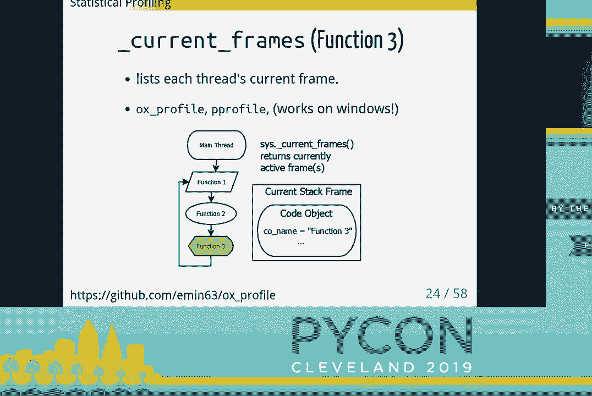

通过这种方式，统计分析器能以极低的开销获得程序在各函数中时间分布的估计。

### 统计分析的实现方法

有多种技术可以实现统计分析器：

1.  **使用POSIX定时器**：设置系统定时器中断进程，在中断处理程序中检查调用栈。例如`statprof`和`plop`包。**缺点：不支持Windows系统。**
2.  **使用Ptrace系统调用**：允许一个进程检查和控制另一个进程。例如`PyFlame`分析器。**缺点：同样不支持Windows，且较为复杂。**
3.  **使用Python内置功能**：利用`sys`模块的纯Python函数，实现跨平台。例如`pyprofile`和本教程将重点介绍的`oxprofile`。

### 为什么需要跨平台的纯Python实现？

1.  **可移植性**：使分析器能在Windows、Linux等多种环境下工作。
2.  **易于理解和调试**：纯Python实现对我们Python开发者更友好，便于理解内部机制，确保其在生产环境中稳定可靠。
3.  **实际需求**：许多应用（如游戏、消费软件）运行在Windows上。在这些场景中使用高开销的确定性分析会严重影响用户体验（如降低帧率），使得性能问题难以复现和诊断。

---

## 核心武器：`sys._current_frames()` 🎯

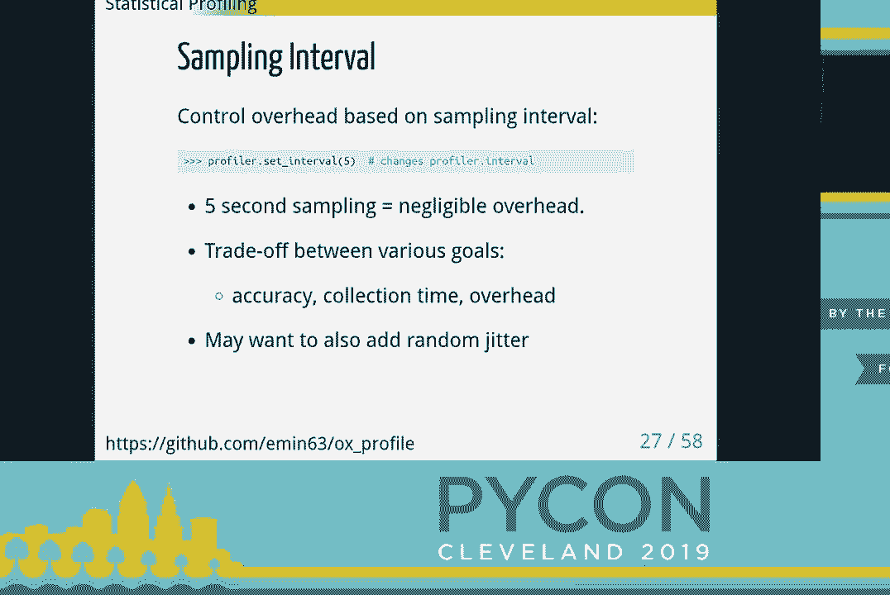

上一节我们了解了统计分析的多种实现路径，本节中我们聚焦于最通用、最Pythonic的方法：使用`sys._current_frames()`。

`sys._current_frames()`函数返回一个字典，映射了每个线程ID到其当前正在执行的栈帧。通过它，我们可以在不干扰目标线程的情况下，直接窥视其调用栈。

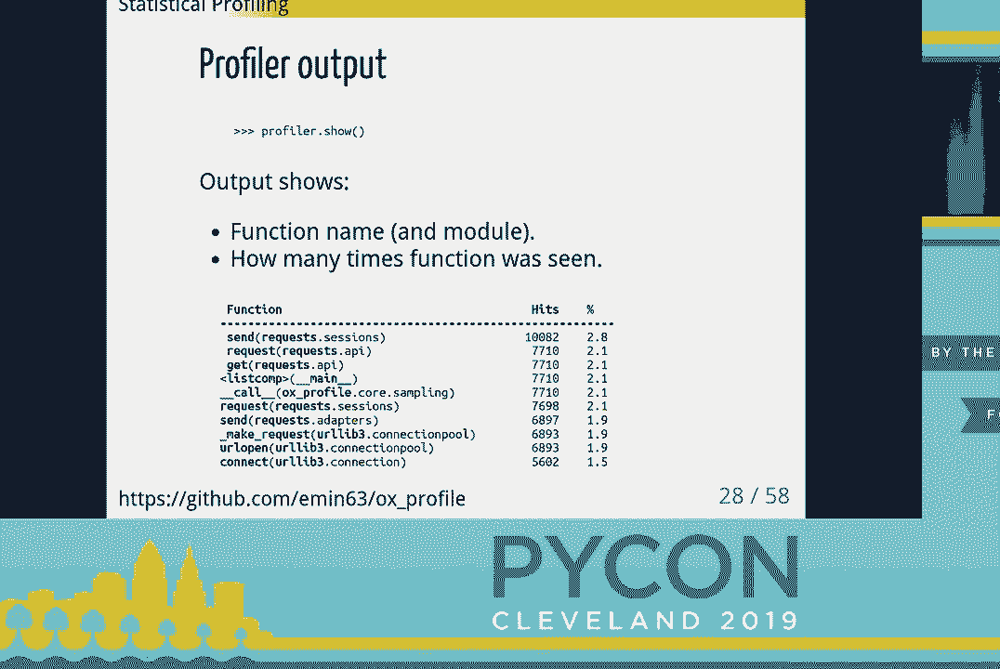

### 基于 `sys._current_frames()` 的采样器原理

1.  启动一个独立的采样线程。
2.  在该线程中循环：休眠 -> 调用`sys._current_frames()` -> 遍历结果，从栈帧中获取函数名(`frame.f_code.co_name`) -> 记录（如增加计数器）-> 继续休眠。
3.  主程序完全不受影响地运行。

一个极简的采样器循环代码如下：
```python
import sys, time

def sampler_thread():
    while True:
        time.sleep(0.1)  # 采样间隔
        for thread_id, frame in sys._current_frames().items():
            function_name = frame.f_code.co_name
            # 在字典中增加该函数名的计数
            counts[function_name] = counts.get(function_name, 0) + 1
```
**控制开销的关键**在于采样间隔。间隔越长，开销越小，但需要更长的运行时间来获得准确数据；间隔越短，数据越准确，但开销会增大。理论上，当间隔趋近于零时，统计分析就趋近于确定性分析。

### 统计分析的输出

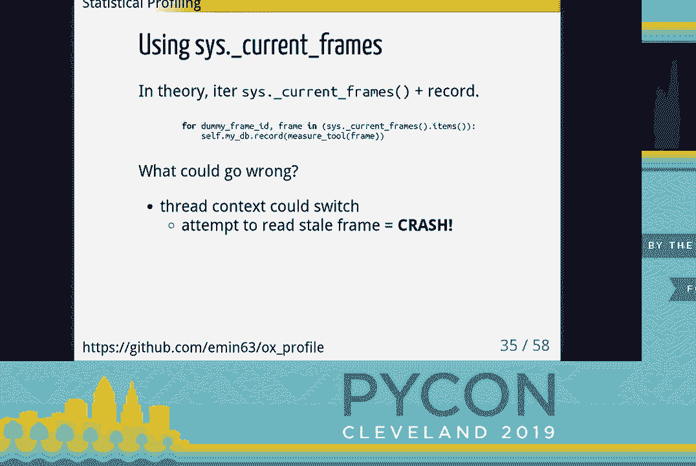

调用分析器的`show()`方法，你会得到一个列表，通常包含：
*   函数名
*   所在模块
*   命中次数（采样时看到该函数正在执行的次数）
*   占总命中次数的百分比

这个百分比**近似代表了该函数消耗的CPU时间比例**。你可以据此判断优化重点。例如，如果`send`函数占了28%的命中，那么优化它很可能带来显著的性能提升。

---

## 从理论到实践：编写健壮的统计分析器 🛡️

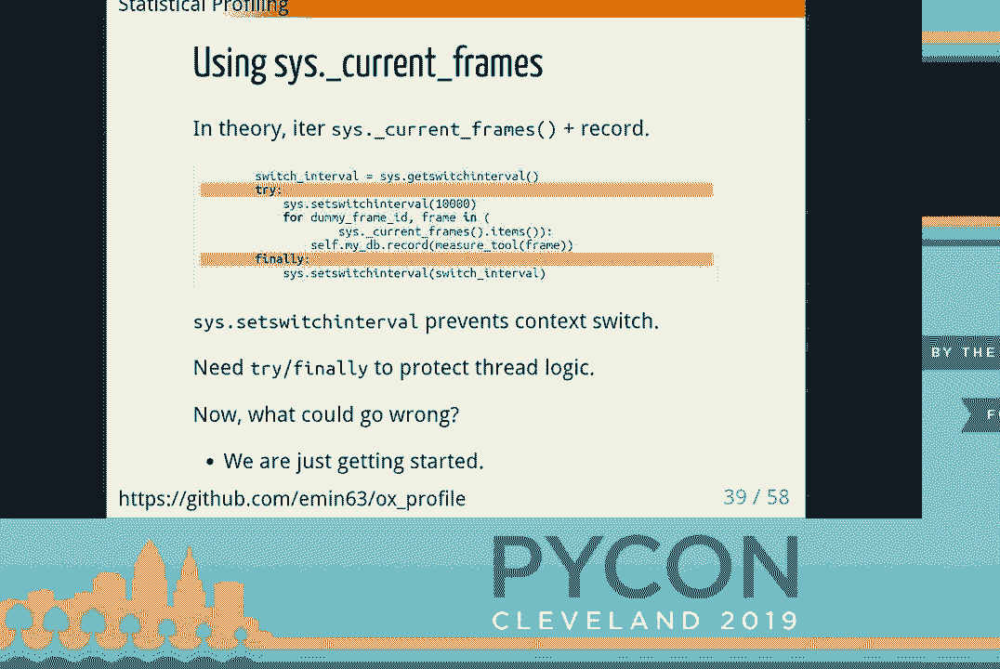

上一节我们看到了一个简单的四行代码采样器，但在实际编写多线程程序时，我们需要考虑更多边界情况以保证其健壮性。本节中我们来看看如何加固我们的分析器。

以下是构建健壮采样器需要注意的几个核心问题及其解决方案：

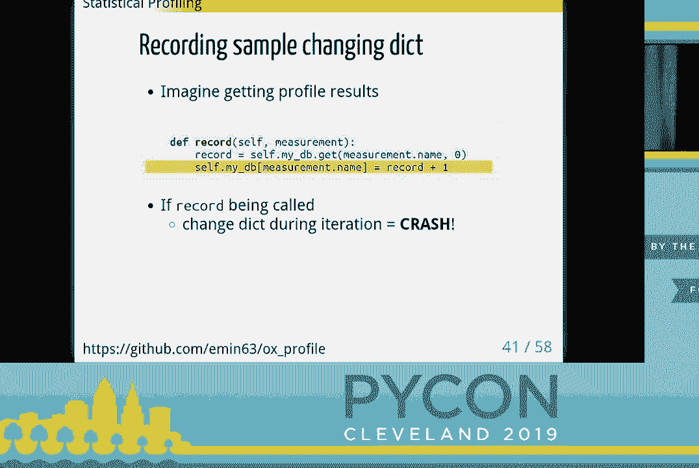

### 1. 处理线程上下文切换

**问题**：采样线程在迭代`sys._current_frames()`返回的帧字典时，解释器可能切换到另一个线程。等切换回来时，之前获取的栈帧可能已经失效（函数已执行完），导致访问过期内存而引发错误。

**解决方案**：使用`sys.setswitchinterval()`临时增大解释器的线程切换间隔，在采样期间尽可能阻止切换。
```python
import sys

old_interval = sys.getswitchinterval()
sys.setswitchinterval(10)  # 临时设置为10秒内不切换
try:
    # 快速迭代并记录帧信息
    for thread_id, frame in sys._current_frames().items():
        # ... 记录逻辑 ...
finally:
    sys.setswitchinterval(old_interval)  # 确保恢复原间隔
```
使用`try...finally`块确保无论是否发生异常，线程切换间隔都能被恢复。

### 2. 处理并发数据访问

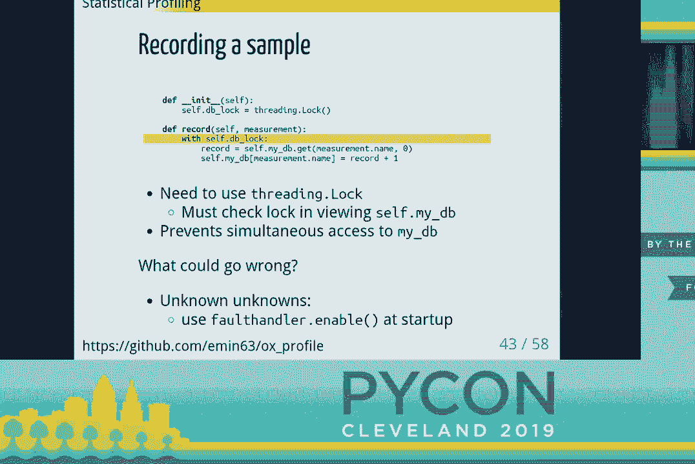

**问题**：采样线程在修改记录命中次数的字典时，主线程或其他线程可能同时调用`show()`方法来读取这个字典。在遍历时修改字典会导致Python解释器崩溃或产生不可预知的行为。

**解决方案**：使用线程锁（`threading.Lock`）来同步对共享数据（字典）的访问。
```python
import threading

class Profiler:
    def __init__(self):
        self._counts = {}
        self._lock = threading.Lock()

    def _record_sample(self, function_name):
        with self._lock:  # 获取锁
            self._counts[function_name] = self._counts.get(function_name, 0) + 1

    def show(self):
        with self._lock:  # 获取锁
            # 安全地读取和返回 self._counts 的数据
            return sorted(self._counts.items(), ...)
```

### 3. 应对底层崩溃

**问题**：在多线程编程中，如果发生内存损坏等严重错误，可能无法产生正常的异常堆栈跟踪，给调试带来极大困难。

**解决方案**：启用`faulthandler`模块。它能在程序崩溃（即使内存损坏）时，尽量打印出一些基本的调试信息。
```python
import faulthandler
faulthandler.enable()  # 在程序启动时调用
```

### 4. 其他实用技巧

*   **将采样线程设为守护线程**：设置`thread.daemon = True`，这样当主程序退出时，采样线程会自动终止，避免程序无法正常退出。
*   **注意`time.sleep`的最小粒度**：在大多数系统上，`time.sleep`的精度在1-10毫秒左右，这限制了最短的有效采样间隔。

---

## 实战：使用OX Profile与Web集成 🌐

理论已经完备，本节我们来看一个具体的统计性能分析器实现——`oxprofile`，并了解如何将其集成到Web应用（如Flask）中。

### 使用OX Profile

安装和使用非常简单：
1.  `pip install oxprofile`
2.  在代码中导入并启动分析器。
```python
from oxprofile import Profiler
profiler = Profiler().start()  # 启动分析器
# ... 运行你的程序 ...
profiler.show()  # 显示分析结果
profiler.cancel()  # 停止分析器
```

### 集成到Flask应用

`oxprofile`提供了Flask蓝图，可以轻松集成：
```python
from flask import Flask
from oxprofile.contrib.flask import oxprofile_bp

app = Flask(__name__)
app.config[‘OXPROFILE_USERS‘] = {‘admin‘: ‘password‘}  # 配置访问凭证
app.register_blueprint(oxprofile_bp)  # 注册蓝图
```
集成后，你的Flask应用会新增几个端点：
*   `/oxprofile/unpause`: 开启分析器。
*   `/oxprofile/pause`: 暂停分析器。
*   `/oxprofile/status`: 查看当前分析状态和结果。
*   `/oxprofile/set_interval`: 调整采样间隔。

这种集成方式使得在生产环境中对Web服务进行实时性能采样变得非常方便，而且开销可控。

---

## `sys._current_frames()` 的创意应用 💡

`sys._current_frames()`的功能远不止于性能分析。本节我们来探索一些其他有趣的用途，展示其强大能力。

*   **数据快照与调试**：定期快照活动帧的局部变量(`frame.f_locals`)，帮助理解复杂第三方库的行为或程序状态，而无需修改其源码。
*   **混沌测试**：在测试环境中，随机修改`frame.f_locals`中的值（例如，给所有整数加一），以测试程序的健壮性和异常处理能力。
*   **统计调试器**：在程序崩溃时，自动保存最近若干次采样的完整堆栈跟踪和局部变量快照，为事后分析提供宝贵线索。
*   **统计代码覆盖率**：以较低的开销，周期性开启采样并记录执行到的代码行，来了解生产环境实际运行的代码路径。

---

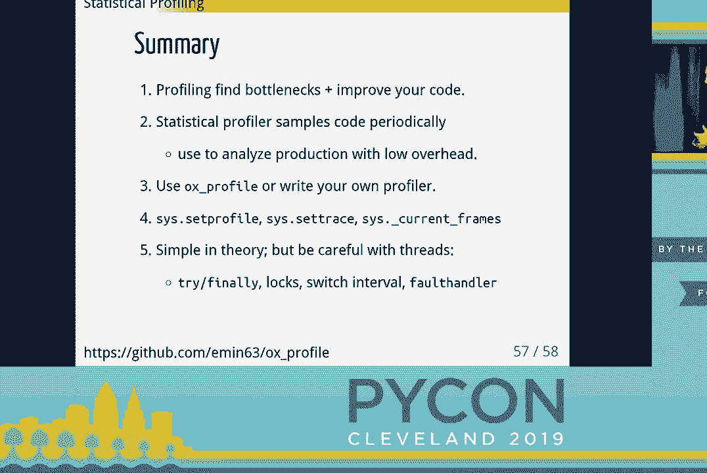

## 总结 📝

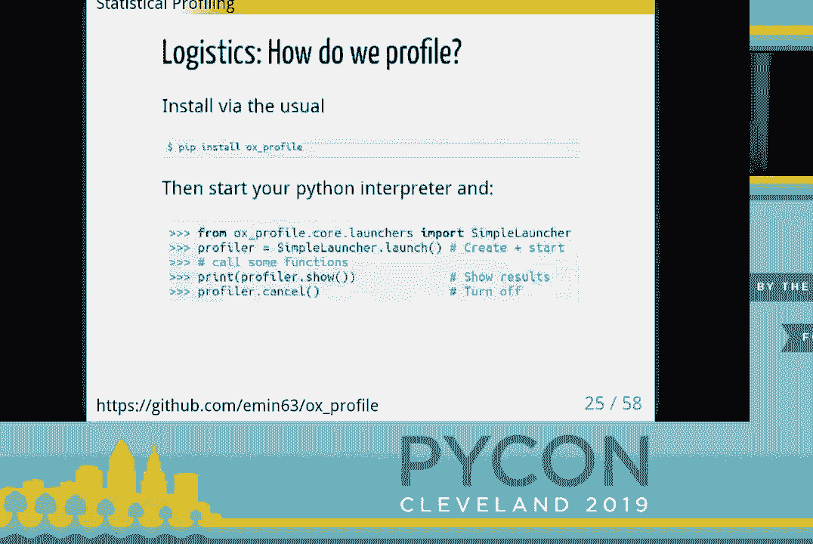

本节课中我们一起学习了Python性能分析的方方面面：

1.  **性能分析的目的**是发现程序瓶颈，指导优化方向。
2.  **确定性分析**（如`cProfile`）精度高但开销大，适用于开发测试。
3.  **统计性能分析**通过周期性采样来估算时间分布，开销极低，适用于生产环境。
4.  利用`sys`模块的`setprofile`、`settrace`和`_current_frames`等函数，我们可以深入解释器内部，实现各种分析工具。
5.  实现一个健壮的统计分析器需要注意**线程安全**（使用锁）、**上下文切换**（调整切换间隔）和**异常处理**（使用`try...finally`和`faulthandler`）。
6.  `oxprofile`是一个基于`sys._current_frames()`的、跨平台的统计分析器实例，并可方便地集成到Web框架中。
7.  `sys._current_frames()`是一个强大的调试和自省工具，其应用范围远超性能分析本身。

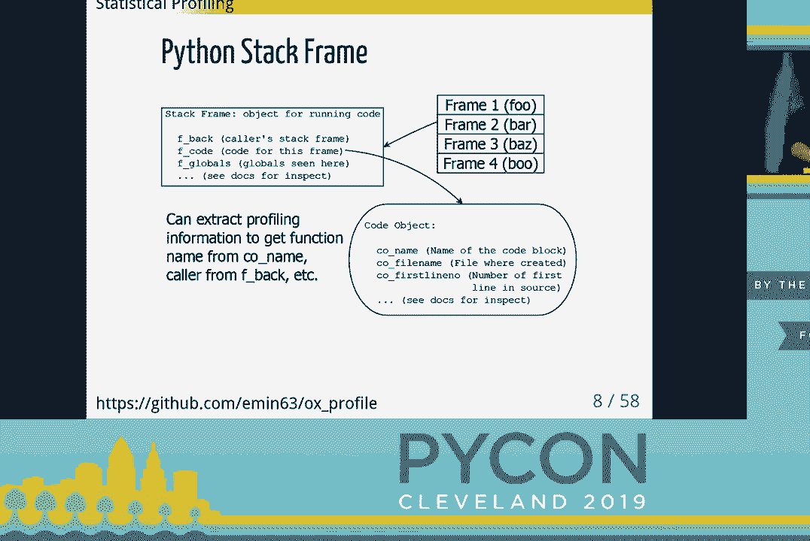

希望本教程能帮助你理解Python性能分析的核心，并激发你探索`sys`模块更多潜能的兴趣。