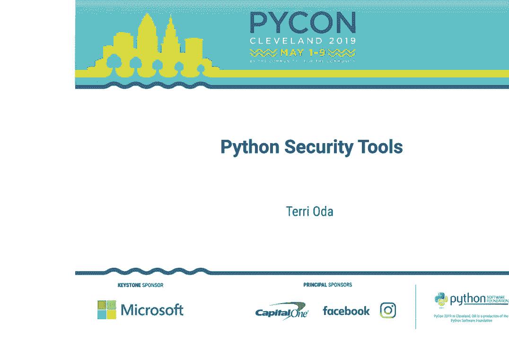
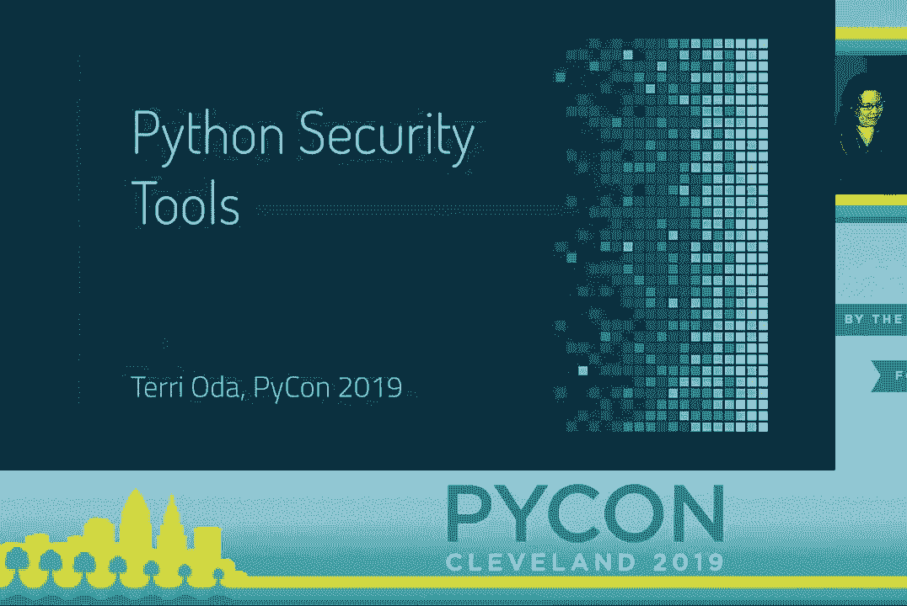
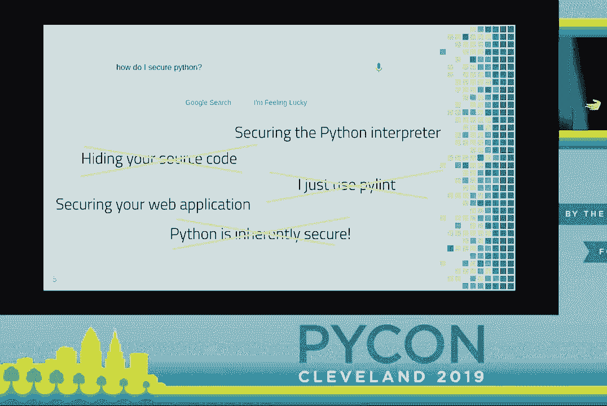
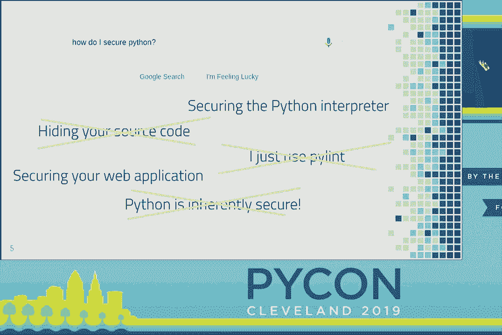
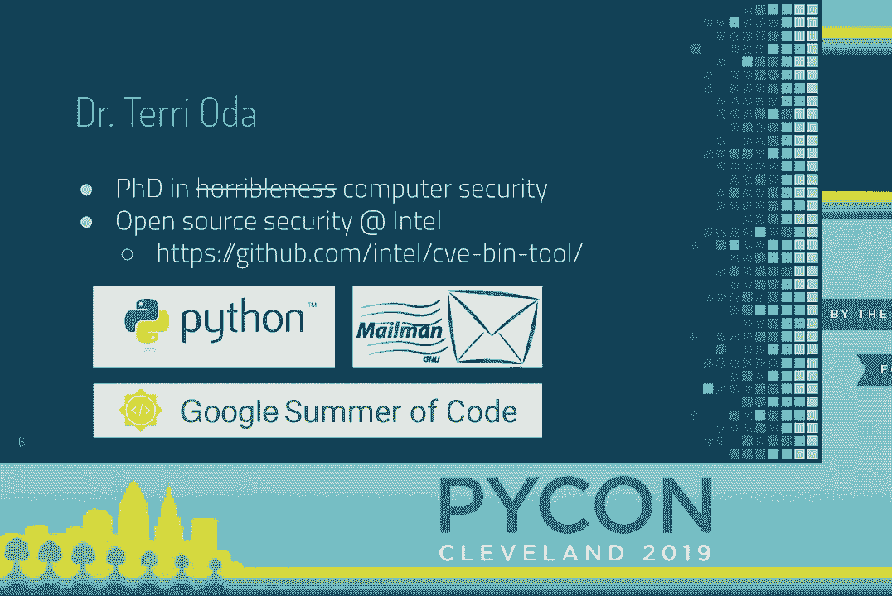
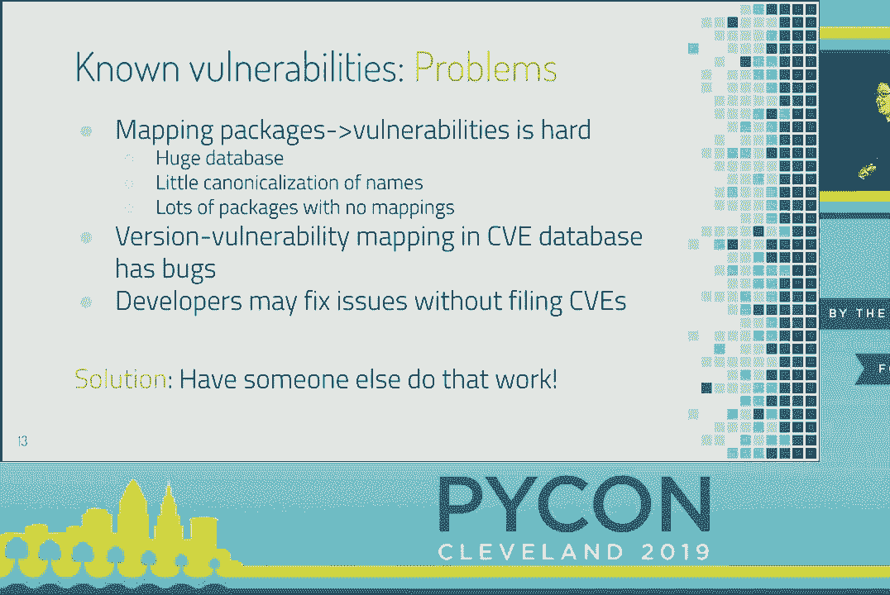
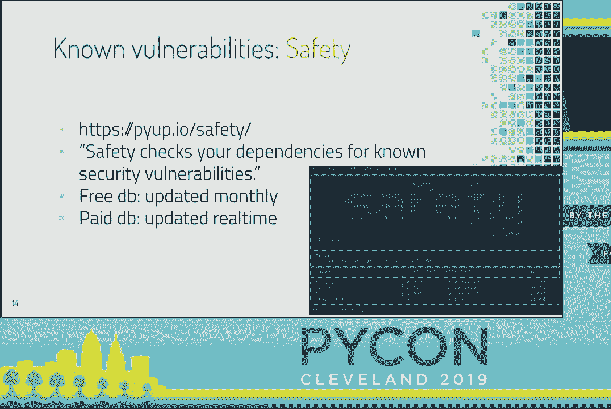
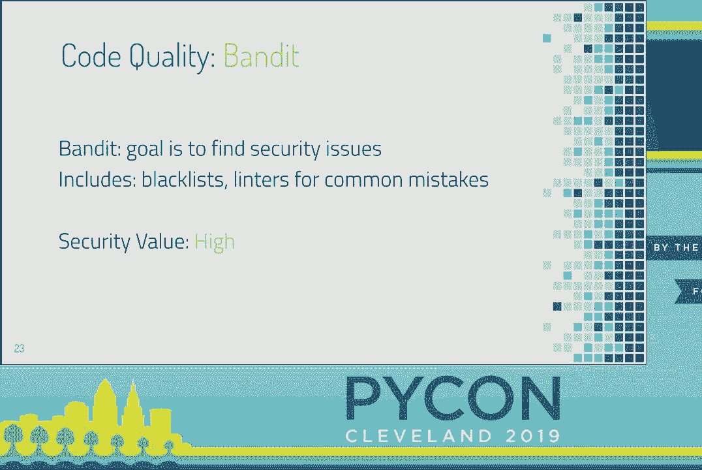
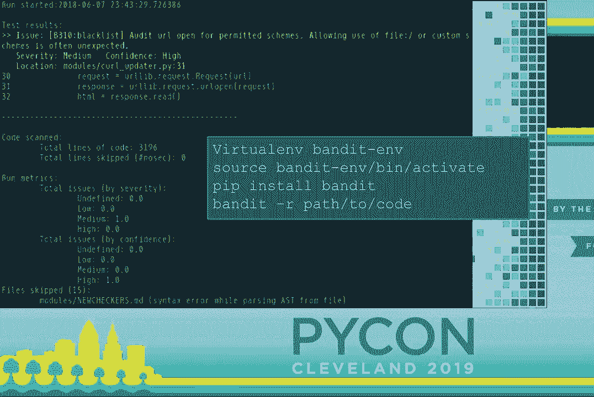
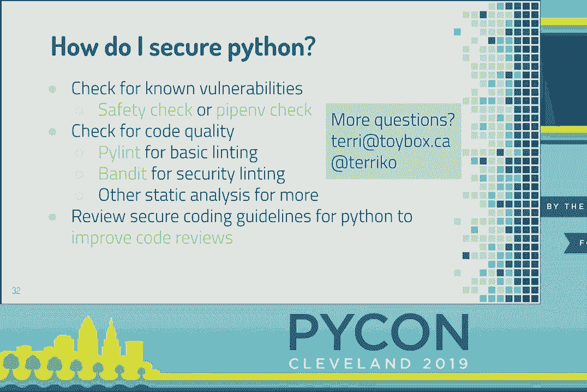

# 010：提升Python项目安全性的实用指南





在本节课中，我们将学习如何为Python项目选择和使用有效的安全工具。我们将从检测已知漏洞开始，然后探讨如何通过代码分析提升代码质量，最后总结一套实用的安全实践流程。





## 概述：为何需要Python安全工具？

许多开发者认为Python“本质上是安全的”，或者仅靠代码风格检查工具（如Pylint）就足够了。然而，这种想法可能导致项目暴露在过时依赖、代码缺陷等安全风险之下。本教程将介绍一系列专门用于提升Python项目安全性的工具和实践。

## 检测已知漏洞

上一节我们指出了对Python安全性的常见误解，本节中我们来看看如何系统地检测项目中已知的安全漏洞。



使用通用漏洞数据库（如CVE）手动检查依赖项非常困难，原因包括：包名映射不准确、数据不完整、以及许多漏洞未被正式记录。

值得庆幸的是，已有成熟的工具可以自动化完成这项工作。

以下是两款推荐的漏洞检测工具：

*   **Safety**：检查项目依赖是否存在已知漏洞。它维护着一个定期更新的漏洞数据库，并支持命令行和Web界面。
*   **Pipenv Check**：Pipenv套件中的工具，同样能检查依赖漏洞，并提供CVE的简要描述和建议。

**核心建议**：选择其中一款工具并将其集成到你的工作流程中。它们能有效发现因依赖未更新而引入的漏洞。



## 使用Bandit进行代码安全分析



解决了已知漏洞问题后，我们需要关注代码本身的质量。本节中我们来看看如何使用静态分析工具发现潜在的安全缺陷。

Pylint等工具主要关注代码风格和一致性，附带的安全收益有限。**Bandit**则是一个专门为发现Python代码安全问题而设计的工具。

安装与运行Bandit非常简单：
```bash
pip install bandit
bandit -r path/to/your/code/
```

Bandit会扫描代码，识别如使用`assert`语句进行安全验证、不安全的反序列化（`pickle`）、弱加密等常见问题。



以下是使用Bandit时需要注意的关键点：



*   **避免扫描虚拟环境**：不要对包含虚拟环境（`venv/`）的目录运行Bandit，否则会产生大量无关警报。
*   **理解而非盲从**：Bandit会报告“危险模式”，但并非所有报告都是必须修复的“错误”。你需要根据上下文判断。
*   **利用文档**：Bandit为每个问题提供了详细说明和修复建议的链接，是很好的学习资源。

**核心概念**：将Bandit作为代码审查的辅助工具，帮助团队聚焦于潜在的安全风险点。

## 构建安全开发流程

拥有了检测漏洞和分析代码的工具后，我们需要将其融入开发流程。本节我们将总结如何系统地应用这些工具。

安全不仅仅是工具，更是一种实践。除了上述工具，还可以考虑更高级的静态分析工具（如对开源项目免费的Coverity Scan），但以下是最低限度的核心实践：

1.  **集成到持续集成（CI）**：在CI流水线中自动运行漏洞检查和代码安全扫描。
2.  **在发布前进行检查**：确保每次发布前都执行了安全检查。
3.  **开展安全导向的代码审查**：学习并实践针对Python的安全代码审查，警惕如硬编码密钥、输入验证不足等通用问题。

大多数安全问题是跨语言通用的。OWASP Top 10、SANS Top 25等资源中的原则同样适用于Python，关键在于寻找并理解Python语境下的具体案例。

## 总结

本节课中我们一起学习了提升Python项目安全性的系统方法：

1.  **使用Safety或Pipenv Check**来自动化检测依赖项中的已知漏洞。
2.  **使用Bandit进行静态代码分析**，发现代码中的潜在安全缺陷，并理解其报告。
3.  **将安全工具集成到CI/CD流程**中，并在发布前强制执行检查。
4.  **培养安全代码审查习惯**，认识到许多安全问题是跨语言存在的。



记住，没有“绝对安全”的语言，主动采用这些工具和实践能显著提升你的Python项目的安全基线。