# 011：为安全环境构建可重现的Python应用程序 🛡️

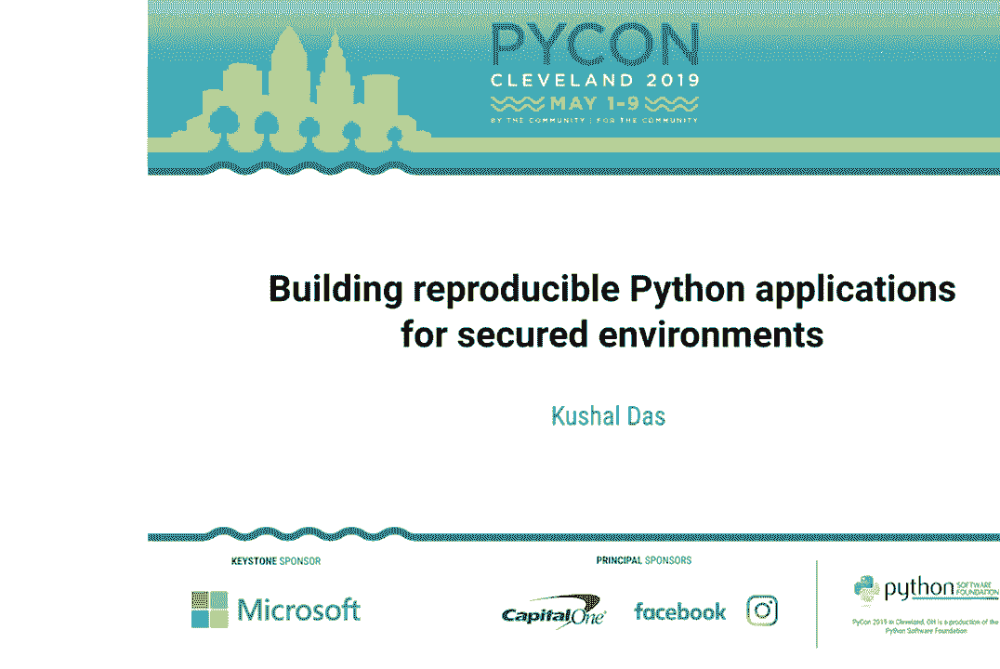

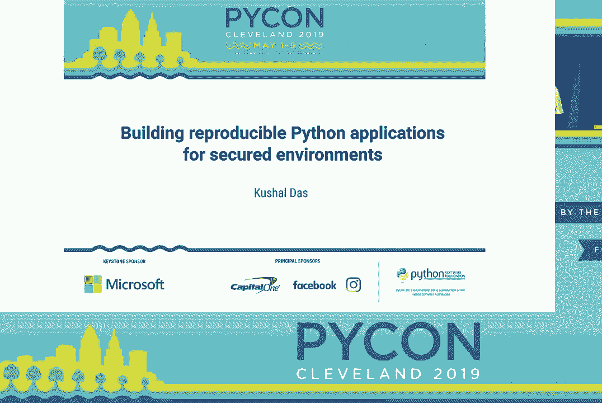

在本节课中，我们将学习如何为高安全需求的环境构建可重现的Python应用程序。我们将探讨从源代码管理到最终部署的整个流程，并重点介绍如何通过现有工具和最佳实践来确保应用的安全性、真实性和可审计性。

## 概述与背景

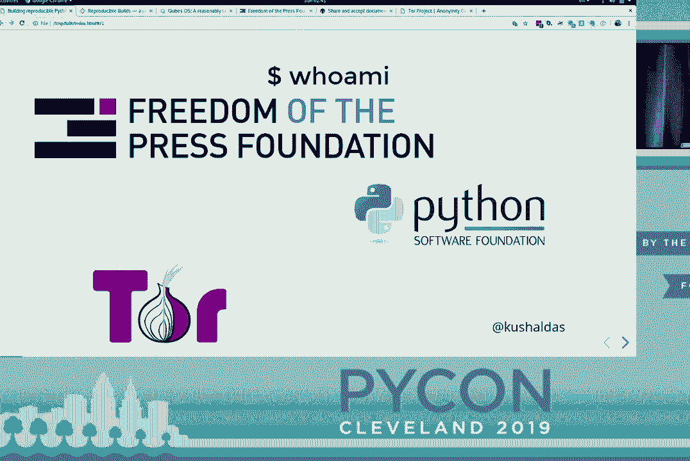

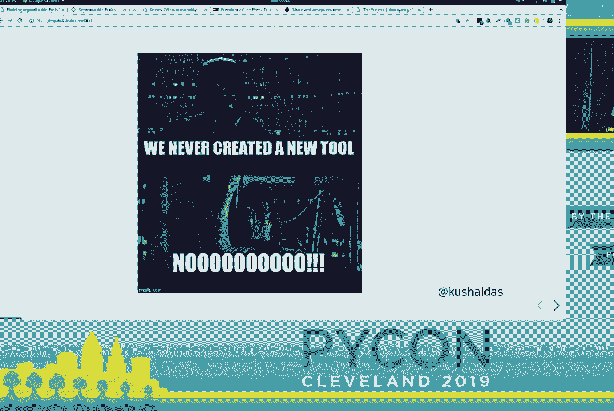

上一节我们介绍了课程的主题和目标。本节中，我们来看看演讲者Kushal Das的背景以及他所面临的实际安全挑战。

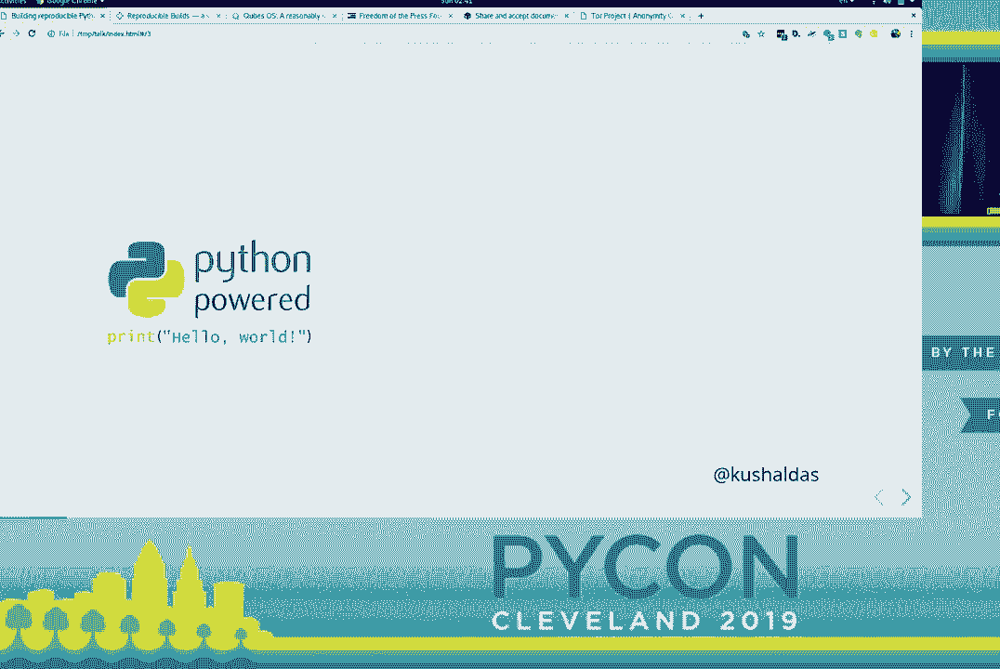

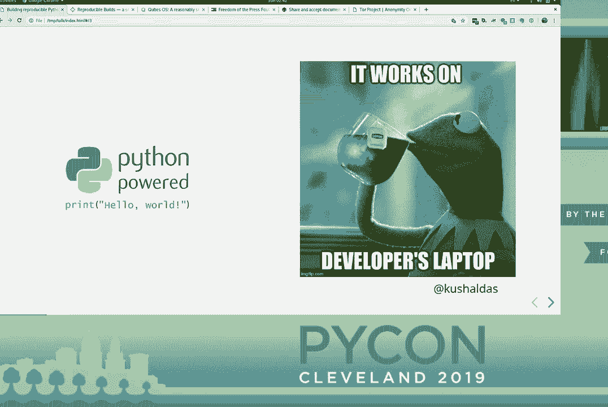

Kushal Das是一位公共利益技术人员，服务于新闻自由基金会。该组织致力于保护、捍卫和赋能公共利益新闻。他的工作包括与媒体组织合作，进行数字安全培训、编写软件以及提升系统安全性。

此外，Kushal还是Python软件基金会的董事、CPython核心开发者以及Tor项目的核心成员。这些经历让他深刻理解在高风险环境中构建安全软件的重要性。

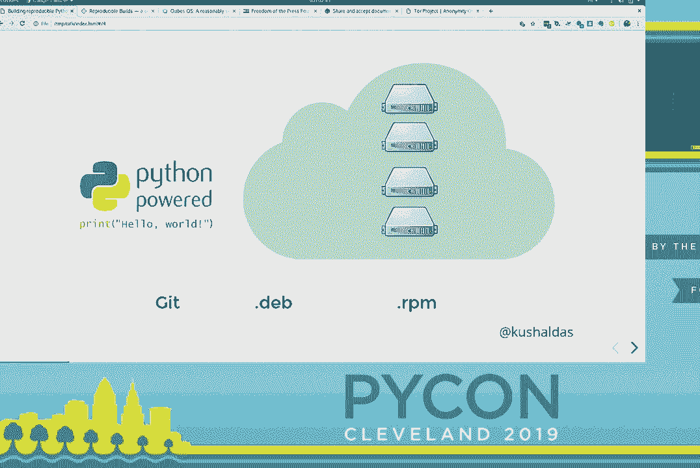

## 面临的挑战：安全性与可用性

上一节我们了解了项目背景，本节中我们来看看在安全环境中开发应用时遇到的核心矛盾。

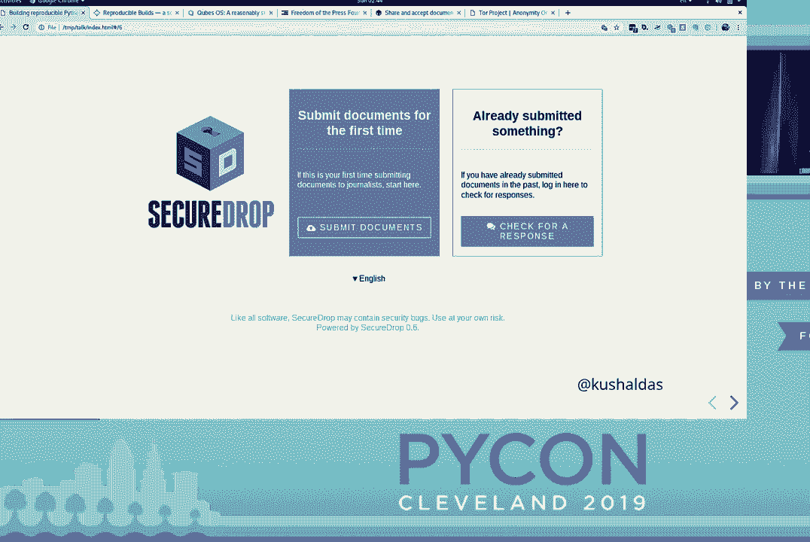

Kushal维护着一个名为SecureDrop的开源举报者平台。该平台已在超过75家媒体机构中部署。举报者通过该平台提交信息时，记者需要在一个物理隔离的、运行特定操作系统的计算机上查看加密文件。解密密钥存储在另一台隔离的计算机中，记者需要通过USB等物理介质传递文件进行解密。整个过程耗时约40-45分钟。

这引发了安全性与可用性之间的权衡问题。对于SecureDrop这类处理敏感信息的项目，始终面临国家级攻击者的威胁。因此，必须在两者之间做出选择，并寻求专业的安全建议。

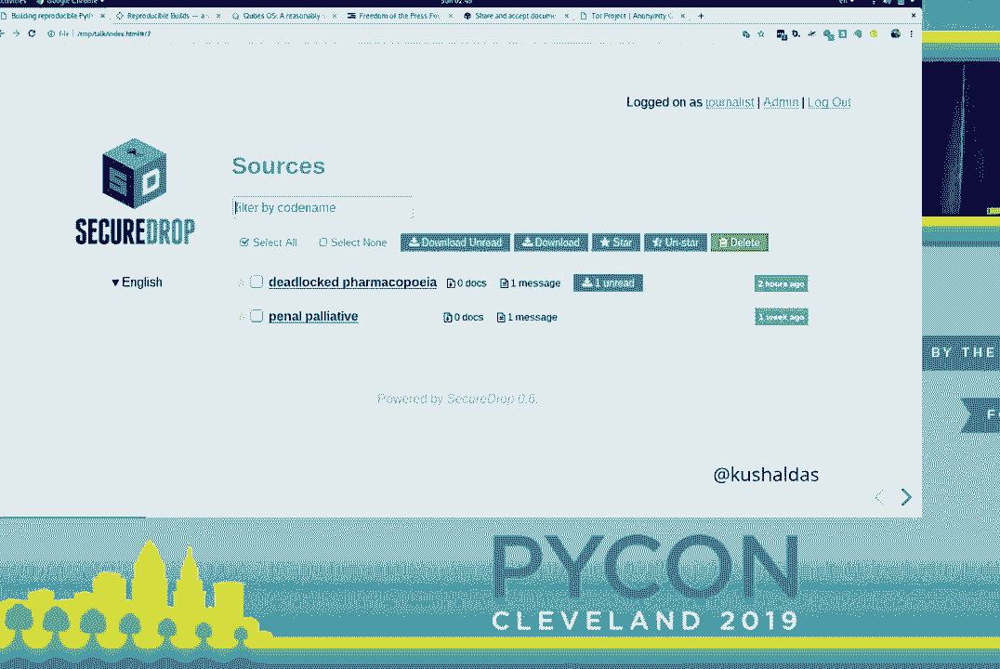

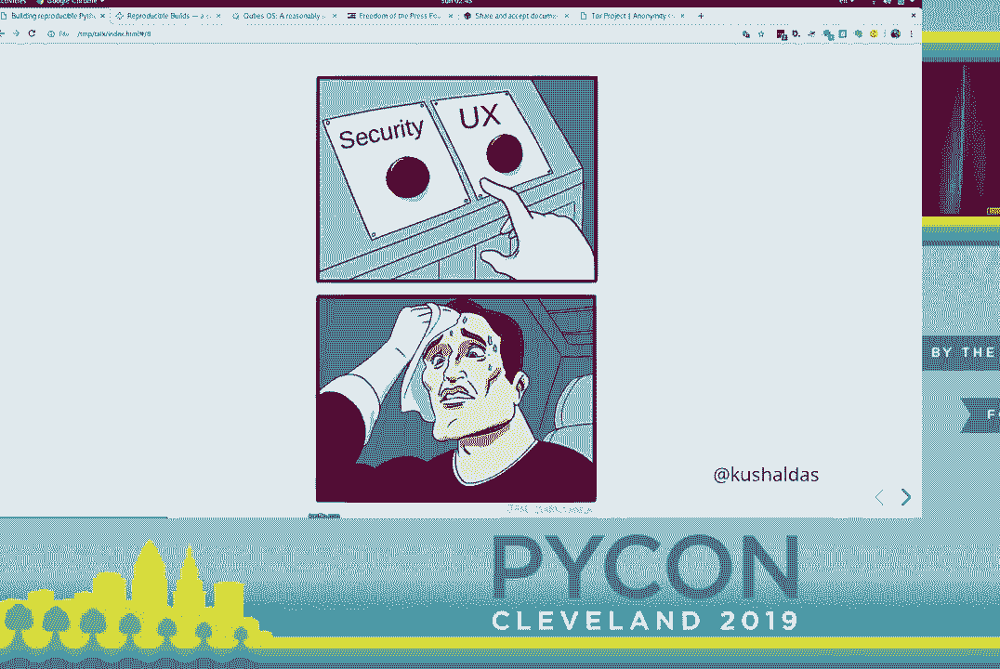

## 解决方案：Cubes OS与桌面应用

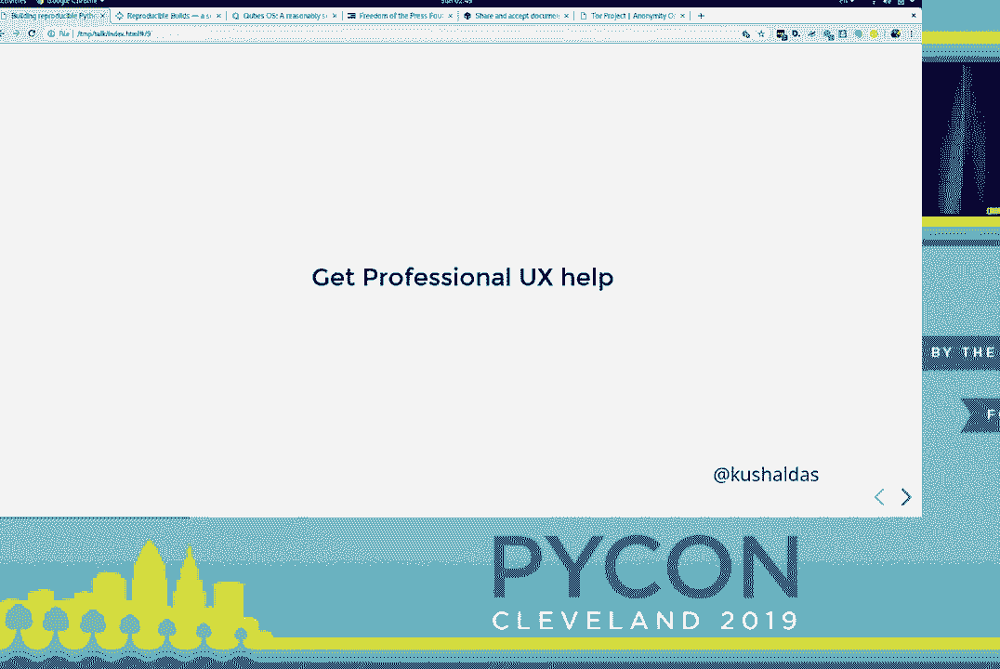

上一节我们讨论了安全与可用性的矛盾，本节中我们来看看他们是如何通过技术创新来拉近这两者距离的。

团队开发了一款为记者设计的桌面应用程序，目前处于Alpha阶段。该应用部署在一个名为Cubes OS的特殊操作系统上。Cubes OS是一个基于Qubes/Xen构建的安全操作系统，其特点是每个应用程序可能运行在独立的虚拟机中，从而实现类似“气隙”的隔离效果。私钥等敏感信息可以存储在独立的虚拟机中。

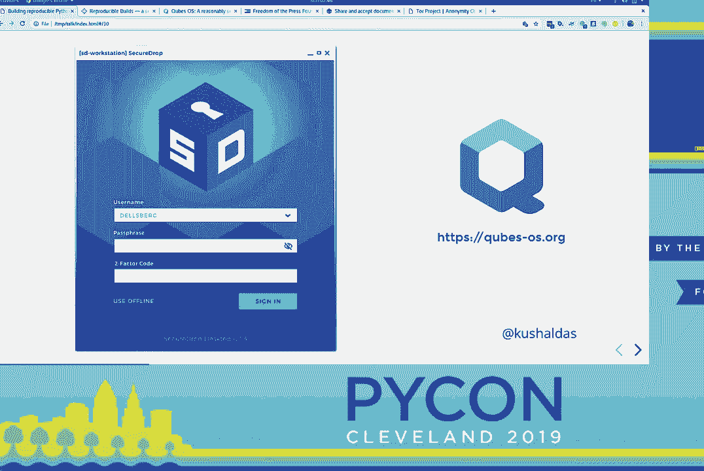

这种方法显著提升了安全环境下的应用可用性。该桌面应用使用Debian软件包进行部署，这意味着它运行在Cubes OS内部的一个Debian虚拟机中。

## 潜在的安全威胁

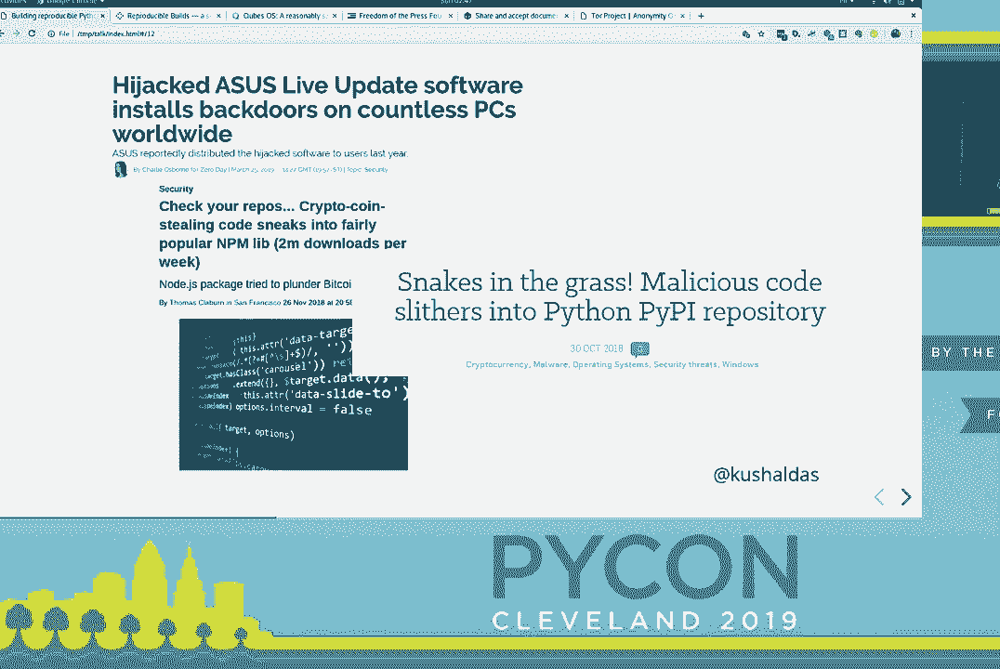

上一节我们介绍了提升安全性的技术方案，本节中我们来系统地看看在软件供应链中可能存在的各类安全威胁。

以下是几个现实世界中的安全事件示例，它们揭示了不同环节的脆弱性：
*   **供应链攻击**：华硕公司的签名密钥曾被攻击者窃取，用于签署并分发恶意软件。
*   **依赖库投毒**：在其他编程语言生态中，出现过核心库被植入恶意软件的情况。在Python生态中，2018年也发生过攻击者发布与知名项目名称相似的恶意包，试图窃取比特币钱包信息。
*   **人员威胁**：根据爱德华·斯诺登披露的信息，政府人员会通过参加技术会议等方式，尝试获取关键基础设施的访问凭证。

我们可以将这些威胁总结为以下四个主要方面：
1.  **源代码可能包含恶意软件**：攻击者可能入侵开发者电脑并篡改代码。
2.  **依赖项或源代码被完全替换**：强大的攻击者可能替换整个依赖包。
3.  **二进制文件被恶意软件替换**：在下载过程中可能遭遇中间人攻击。
4.  **网络存储或基础设施被攻陷**：托管包的平台服务器本身可能被入侵。

## 缓解策略：从依赖项检查开始

上一节我们梳理了主要的安全威胁，本节中我们开始探讨如何构建防御体系。首要的一步是严格管理项目依赖。

对于Python项目，通常使用`pip`和`requirements.txt`文件管理依赖。一个普通的`requirements.txt`文件格式如下：
```txt
SomeProject==1.4
AnotherProject==1.0.2
```
然而，为了安全，我们需要更严格的控制。目标是只使用自己构建的二进制包（wheels）。因此，我们使用一个包含哈希校验和的`requirements.txt`文件：
```txt
SomeProject==1.4 \
    --hash=sha256:2cf24dba5fb0a30e26e83b2ac5b9e29e1b161e5c1fa7425e73043362938b9824
```
这确保了所安装的包必须与指定的SHA-256哈希值匹配。

## 构建可验证的依赖包流程

上一节我们确定了使用哈希校验来确保依赖完整性，本节中我们深入看看如何自动化地构建和验证这些依赖包。

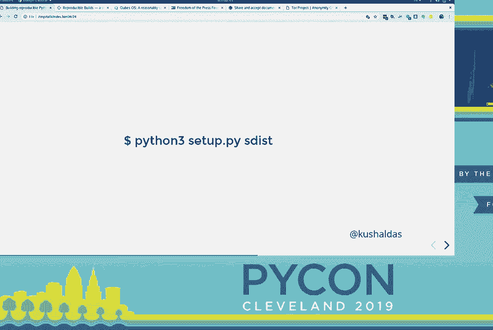

整个流程通过一个`Makefile`和几个Python脚本来实现，遵循“不创造新工具”的原则。核心步骤是一个名为`build-wheels`的构建任务。

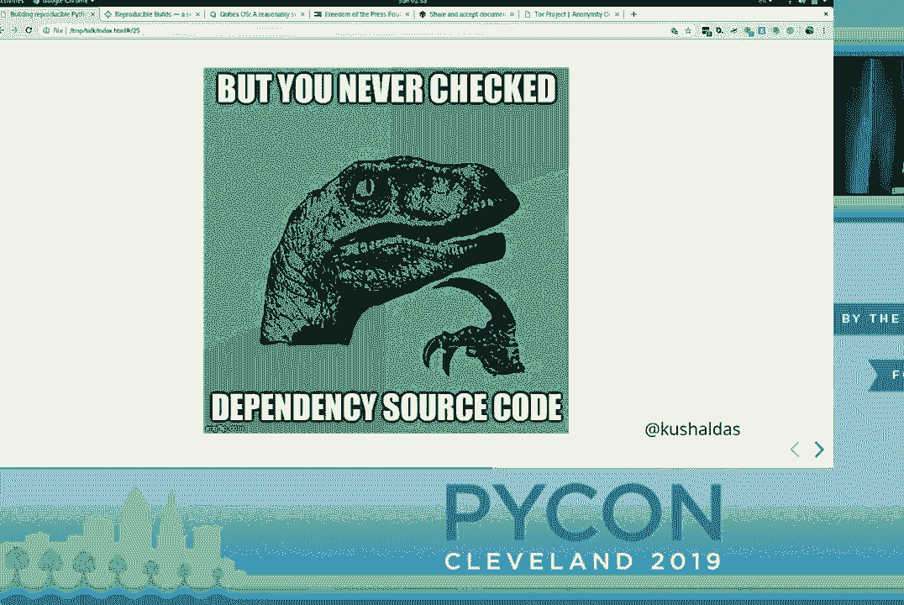

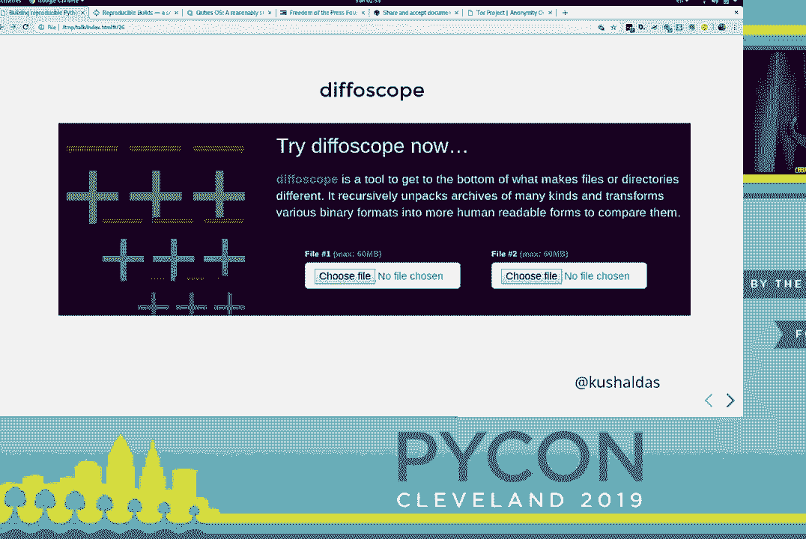

以下是构建和同步依赖包的关键步骤：
1.  **验证签名与哈希**：首先运行脚本验证源代码压缩包的GPG签名和SHA-256哈希值是否与预期匹配。
2.  **下载源代码**：使用一个临时的`requirements.txt`文件（仅包含源代码压缩包），通过`pip`命令下载所有依赖的源代码，并强制进行哈希验证。
    ```bash
    pip download --no-binary :all: --require-hashes -r requirements.txt
    ```
3.  **构建二进制包**：将下载的所有源代码压缩包在本地构建成wheel文件。
    ```bash
    pip wheel --no-index --wheel-dir wheels/ --find-links wheels/ -r requirements.txt
    ```
4.  **生成最终需求文件**：基于新构建的wheels，生成包含对应哈希值的最终`requirements.txt`文件。
5.  **打包项目**：创建项目自身的源代码分发包，其中将包含最终的`requirements.txt`文件以及项目维护者的GPG签名。

## 人工审计源代码

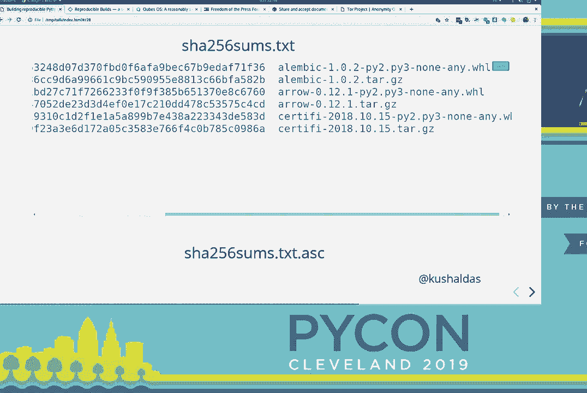

上一节我们自动化了依赖包的构建，但自动化无法判断代码意图。本节中我们来看看如何通过人工审计来确保源代码本身是干净的。

上述流程假设从PyPI获取的源代码是可信的，但这并非绝对。为了确保依赖项源代码没有恶意，SecureDrop项目制定了一条规则：**所有依赖项的更新都必须经过人工审计**。

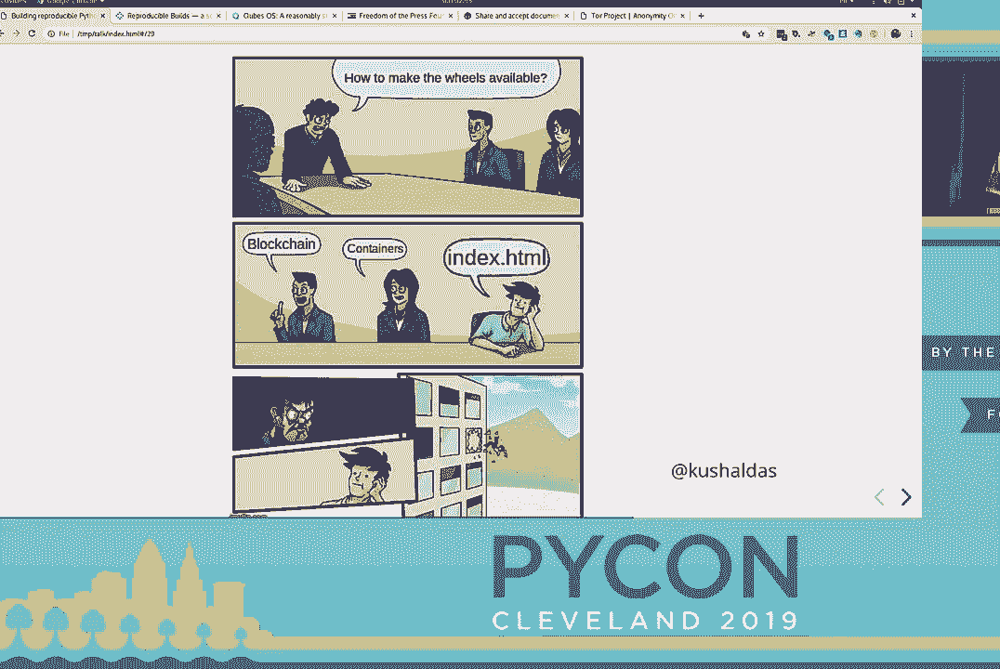

他们使用`diffoscope`工具来对比新版本和旧版本源代码之间的差异。由两位开发者手动审查变更内容，检查其中是否包含：
*   可疑的网络连接代码。
*   不应存在的Base64编码数据。
*   任何可能的后门或恶意逻辑。

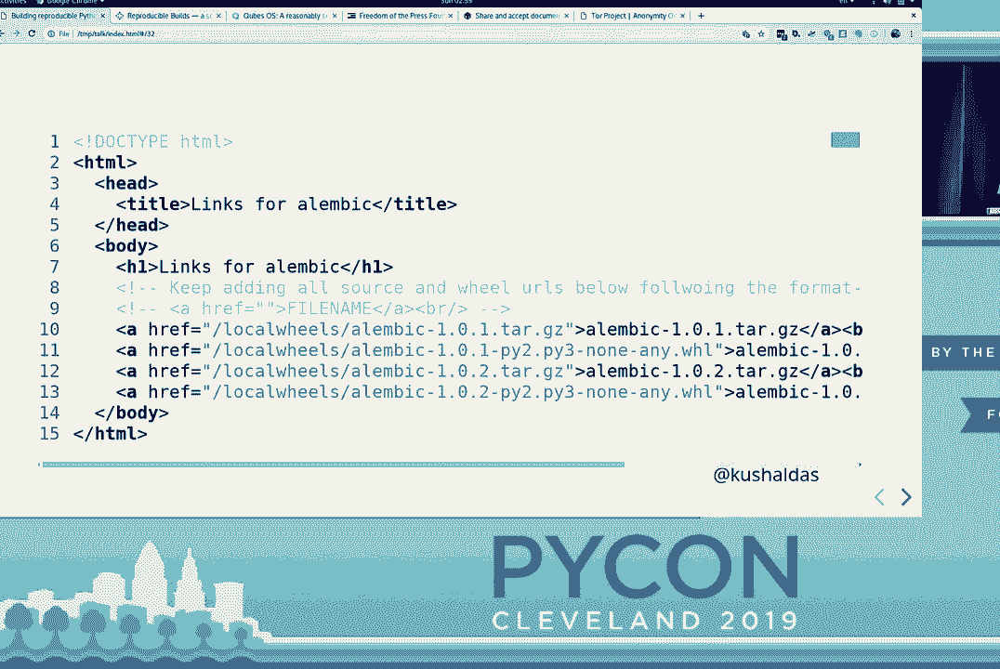

只有通过审计的依赖项更新才会被允许。所有依赖项的源代码压缩包和wheel文件的SHA-256哈希值都被记录在一个名为`sha256sums.txt`的文件中，并使用GPG密钥对该文件进行签名，以供任何人验证。

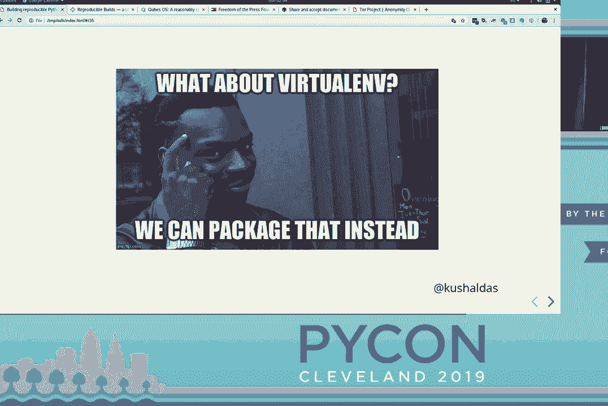

## 创建私有包仓库

上一节我们确保了依赖包的安全，本节中我们来看看如何安全地存储和分发这些包。

拥有源代码压缩包和wheel文件后，需要一种方式来托管它们以供使用。在Python生态中，可以简单地使用静态HTTP服务器创建一个私有仓库。

根据PEP 503规范，仓库的结构非常简单：
*   一个顶级的`index.html`作为索引页，列出所有项目链接。
*   每个项目目录下有一个`index.html`，列出该项目所有版本的文件链接。

例如，项目索引页可能包含：
```html
<a href="/project/SomeProject/">SomeProject</a>
```
而项目页面则包含具体文件的链接：
```html
<a href="SomeProject-1.4.tar.gz">SomeProject-1.4.tar.gz</a>
<a href="SomeProject-1.4-py3-none-any.whl">SomeProject-1.4-py3-none-any.whl</a>
```
这些静态文件可以提交到Git仓库，并部署在任何支持HTTPS的静态文件服务器上，从而创建一个受控的、可审计的包源。

## 打包与部署：虚拟环境与系统包

上一节我们创建了安全的包源，本节中我们来看看如何将整个应用及其依赖打包，以便于在目标系统上安全部署。

直接使用`pip`安装到系统Python环境是危险的。常见的解决方案是使用虚拟环境。为了部署，可以将整个虚拟环境打包。

SecureDrop项目使用`dh-virtualenv`工具（一个来自Spotify的开源项目）。它能够将Python虚拟环境打包到Debian软件包中。这样，应用程序的所有Python依赖都被封装在包内，与系统Python环境隔离，并且可以通过系统包管理器进行安装和管理。

一个简化的`debian/rules`文件配置示例如下：
```make
%:
    dh $@ --with python-virtualenv

override_dh_virtualenv:
    dh_virtualenv --python /usr/bin/python3.5 \
                  --setuptools \
                  --pip-tool pip \
                  --extra-index-url https://your.private.pypi/simple
```

## 实现可重现构建

上一节我们完成了应用打包，本节中我们探讨构建安全的最后一块拼图：可重现构建。

可重现构建意味着从相同的源代码，在任何时间、任何机器上，都能产生完全相同的构建产物（如二进制文件、软件包）。这是验证软件未被篡改的终极手段。

Debian从Stretch版本开始支持可重现构建。通过结合之前的所有步骤——使用哈希校验的依赖、私有仓库、`dh-virtualenv`打包，并确保构建环境的一致性（如固定的工具链版本），SecureDrop项目实现了可重现的Debian软件包构建。

## 安全威胁与缓解措施对应总结

在本节课中，我们一起学习了为安全环境构建Python应用的完整方法论。现在，我们来总结一下所讨论的安全威胁及其对应的缓解措施：

| 威胁 | 缓解措施 |
| :--- | :--- |
| **源代码包含恶意软件** | 对**所有依赖项更新进行人工源代码审计**。 |
| **二进制文件被替换** | 存储并GPG签名所有依赖的**SHA-256哈希值文件**；在构建过程中多次校验。 |
| **中间人攻击** | 全程使用**HTTPS**；配合**SHA-256哈希校验**确保下载内容完整性。 |
| **基础设施被攻陷** | **签名密钥离线保存**（不接触网络）；**自托管私有PyPI仓库**；实现**可重现构建**，使任何篡改都无法通过重建验证。 |

这套组合方案提供了**真实性**（通过GPG签名）、**可审计性**（所有材料公开可查）和**可重现性**，共同确保了在安全环境中部署的软件正是开发者所构建的版本，没有掺杂任何恶意内容。

## 资源与问答

*   **项目链接**：
    *   新闻自由基金会：`freedom.press`
    *   SecureDrop项目：`securedrop.org`
    *   示例脚本与Makefile可在相关GitHub仓库找到。
*   **问答环节要点**：
    *   **选择Debian包而非Nix/区块链**：基于团队现有技术栈和“使用成熟工具”的原则。
    *   **私有仓库是公开的**：为了透明和可审计，但最终用户直接安装的是打包好的Debian包。
    *   **为不同系统打包**：需要为不同发行版（如Debian和Ubuntu）分别构建软件包。
    *   **处理C扩展**：将必要的C库列为构建依赖，目前未遇到重大问题。
    *   **审计疲劳**：承认人工审计压力大，希望社区能探索协作审计的信任模型。

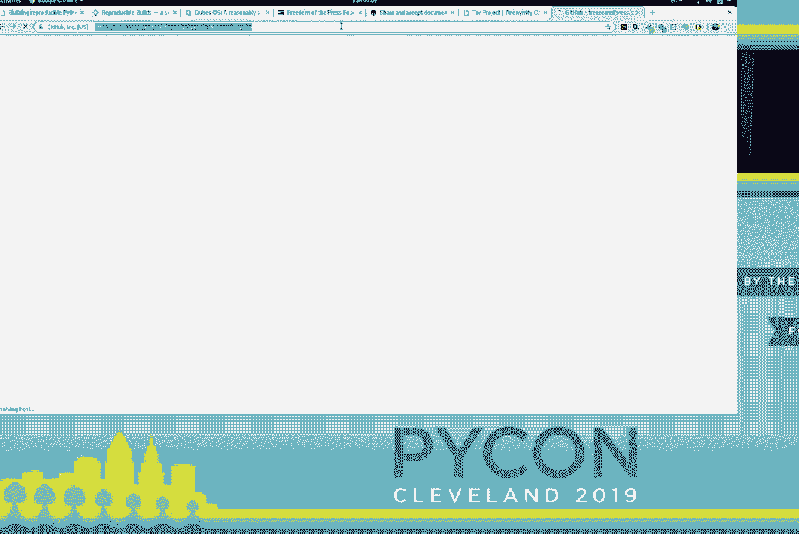

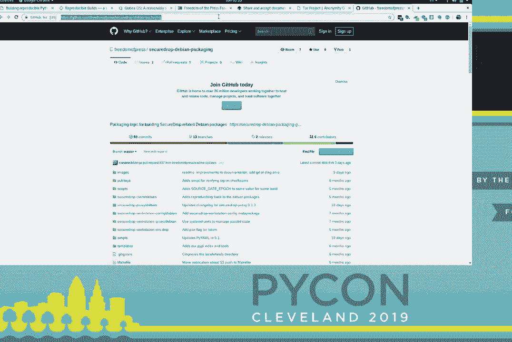

**本节课总结**：我们深入探讨了在高安全要求下构建Python应用程序的全套实践。核心在于**不引入新工具**，而是通过**严格的人工审计**、**哈希校验与签名**、**私有包管理**、**虚拟环境打包**以及追求**可重现构建**，来层层加固软件供应链的每一个环节。这套方法虽然步骤繁多，但能有效抵御多种高级威胁，为安全关键型应用提供了坚实的保障。