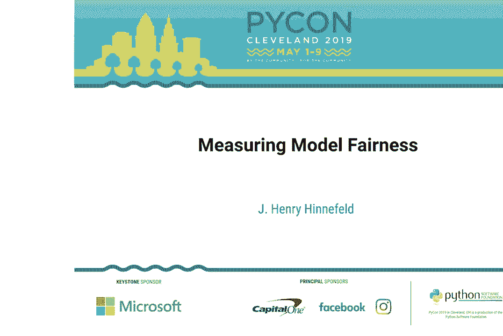
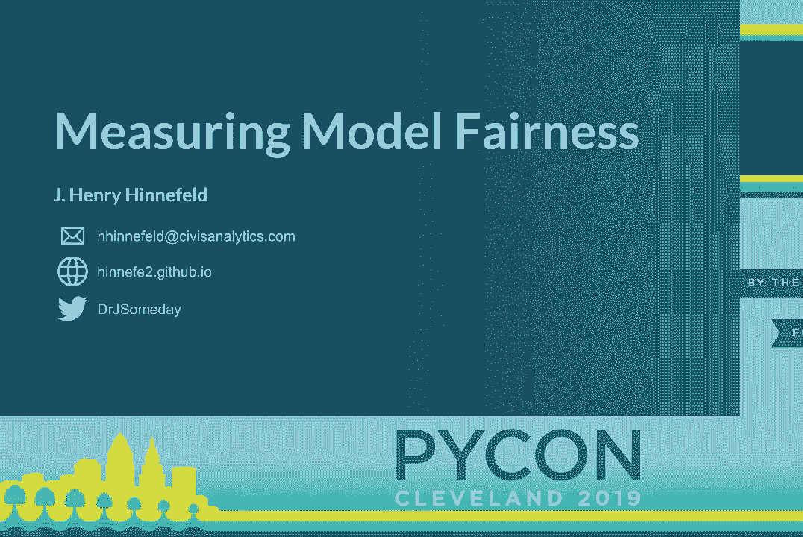
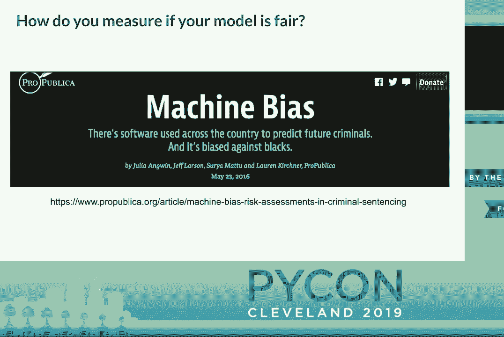
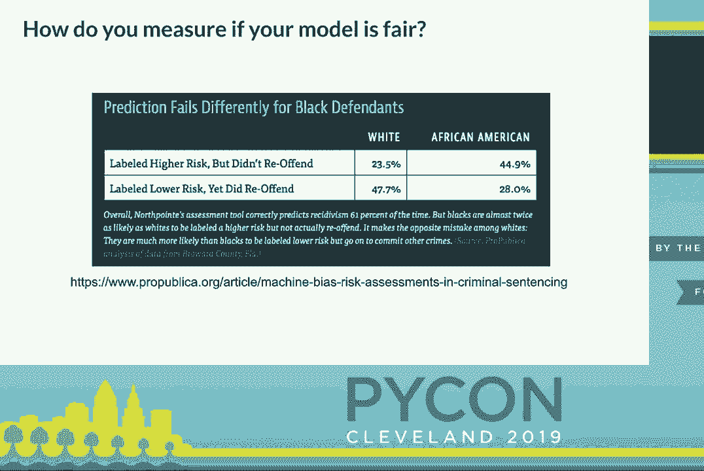
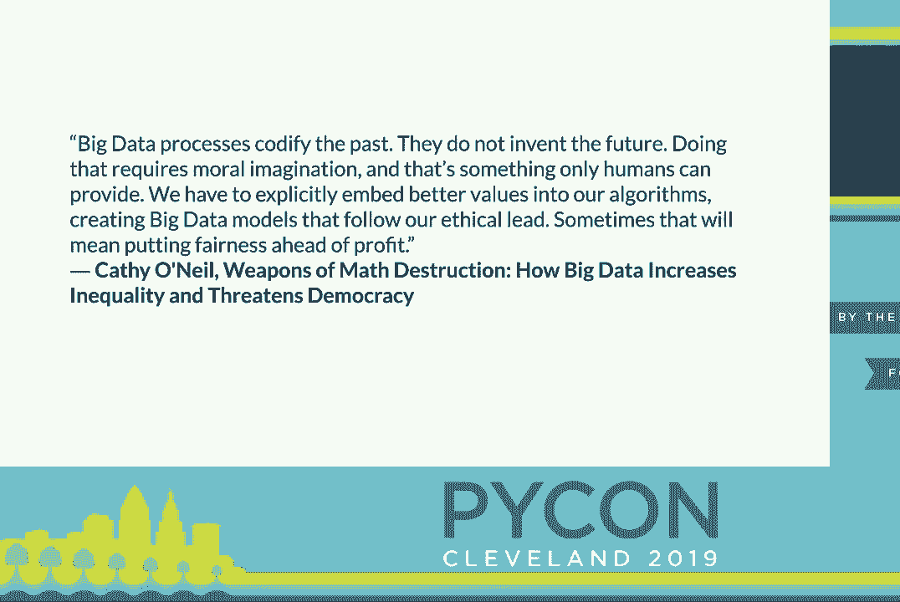

# 013：衡量模型公平性 📊

在本节课中，我们将学习如何衡量机器学习模型的公平性。我们将探讨为什么这是一个复杂的问题，理解影响公平性评估的关键因素，并通过一个案例研究了解这些因素在实践中的体现。最后，我们将介绍一些可用于评估公平性的Python工具。

---

## 动机与概述 🎯

机器学习模型可以对人们的生活产生重大影响。信用评分模型可以决定一个人能否购买房屋。广告模型可以影响一个人接收到的工作机会类型。模型甚至可以影响一个人在监狱中待多久。

随着机器学习模型进入这些具有社会影响力的领域，确保模型预测的公平性变得非常重要。然而，定义“公平”的方式有很多种，这使得衡量公平性成为一个棘手的问题。

## 公平性定义的挑战：COMPAS案例 🤔

一个著名的案例是**COMPAS**再犯预测模型。该模型用于预测被定罪者获释后再次犯罪的可能性，并广泛用于假释决定。

一个名为**ProPublica**的新闻机构分析数据后发现，该模型在不同种族群体间的错误率不同。
*   对于白人被告，**假阳性率**（被错误标记为高风险）约为24%。
*   对于黑人被告，**假阳性率**约为45%。
*   对于白人被告，**假阴性率**（被错误标记为低风险）约为48%。
*   对于黑人被告，**假阴性率**约为28%。

ProPublica据此得出结论，该模型对黑人被告存在偏见。

然而，模型制造商**Northpointe**公司反驳称，该模型的**总体准确率**在白人和黑人被告中非常相似，都约为63%。

这就引出了一个问题：这个模型公平吗？哪种衡量方式才是正确的？

随后的学术研究证明，除非模型完美无缺，否则同时满足“错误率平衡”和“总体准确率平衡”这两个公平性定义在数学上是不可能的。

因此，核心问题在于：如何为你的具体问题定义“公平”？这涉及许多细微之处。

## 影响公平性衡量的三个关键因素 🔍

上一节我们介绍了定义公平性的挑战，本节中我们来看看使问题复杂化的三个关键因素。

### 1. 不同群体的真实阳性率可能存在合法差异

在某些问题中，不同群体间的真实结果分布本就不同。例如，在预测乳腺癌的诊断时：
*   女性终生患病率约为12.5%。
*   男性终生患病率约为0.1%。

这种真实的、合法的差异会使某些公平性指标失效。一个流行的指标是**不同影响**，它衡量的是不同群体间被预测为“正面”结果的概率之比。

**公式**：`P(预测=‘是’ | 群体=A) / P(预测=‘是’ | 群体=B)`

该比值越接近1，被认为越公平。但在乳腺癌的例子中，由于真实患病率差异巨大，强行让预测概率之比接近1是不合理且不现实的。

### 2. 数据是对真实世界的有偏呈现

你的数据并非对真实情况的完美反映。数据偏差主要有两种形式：

**标签偏差**：受保护属性影响了数据标签的分配方式。
例如，一项研究发现，在类似行为问题上，非裔和拉丁裔学生比白人学生更容易被停学或开除。如果使用“是否被停学”作为预测学生问题行为的标签，那么这个标签本身就带有偏见。优化模型与这些有偏标签的一致性，只会延续数据中的偏见。

一个受此影响的指标是**机会平等**，它比较的是不同群体间的**真正率**。

**公式**：`TPR(群体=A) - TPR(群体=B)`
（其中，TPR = 真正例数 / 实际正例数）

**样本偏差**：不同群体以不同方式被抽样进入数据集。
例如，对纽约警察局“拦截盘查”政策的分析发现，非裔和西班牙裔被拦截的比例远高于白人。如果基于此数据构建模型，那么数据集中就存在样本偏差，因为个体是否出现在数据中与其群体属性相关。

这会影响像**不同影响**这类比较分类比率的指标，因为不同群体的抽样基础不同，比较变得不公正。

### 3. 模型的后果至关重要

模型的用途决定了我们应优先关注哪种错误。
*   **惩罚性模型**（如量刑辅助）：后果是施加惩罚。我们可能更关心**假阳性**（错误地施加惩罚）。
*   **辅助性模型**（如福利分配）：后果是提供帮助。我们可能更关心**假阴性**（错误地拒绝帮助）。

## 核心观点：数学无法替代人的思考 💡

综合以上因素，本教程的核心观点是：**你不能仅仅依靠数学公式来确保公平，必须有人来思考模型的伦理影响和具体情境。**

最初，人们可能认为“模型是数学，所以它自然是公平的”。这种观点已被驳斥。但现在有一种新的诱惑，认为“我为模型添加一个数学约束（公平性指标），它就会自动变得公平”。这同样不成立。

在应用任何公平性约束或指标之前，你需要思考：在你的具体问题中，公平意味着什么？模型的后果是什么？你的数据反映了怎样的现实？

## 案例研究：理论在实践中如何体现 📈

前面我们讨论了许多理论上的细微差别，本节中我们通过一个模拟案例来看看它们如何在实践中发挥作用。

该案例使用来自真实咨询项目的数据，特征包括人口统计和社会经济指标，目标是预测个人注册某项国家服务的可能性。我们关注白人和黑人群体间的公平性。

我们通过以下步骤构建实验：
1.  创建两个“假设世界”：
    *   **基础真实值平衡**：仅使用原始数据中的白人样本，并随机重新分配种族标签。
    *   **基础真实值不平衡**：使用原始数据，其中白人的注册概率本就更高。
2.  在每个“假设世界”中，生成带有已知偏见的数据集：
    *   **注入样本偏差**：对白人和黑人采用不同的抽样概率。
    *   **注入标签偏差**：对白人和黑人使用不同的阈值将概率转化为二元标签。
3.  在这些数据集上训练模型，并应用两个公平性指标进行评估：
    *   **不同影响**（比值，理想值为1）
    *   **机会平等**（差值，理想值为0）

**实验结果如下：**

在**基础真实值平衡**的假设世界中，结果符合预期。当数据无偏见时，两个指标均未检测到不公平。当注入样本或标签偏差后，指标正确地报告了检测到的不公平。

然而，在**基础真实值不平衡**的假设世界中，情况变得复杂。即使在没有注入任何偏见、仅反映真实世界差异的数据上，两个指标也检测到了“显著的不公平”。此外，标签偏差在这种情境下更难被准确检测。

**案例研究的启示：**
在实践中，你只会看到自己数据集上的一个结果（类似于上图中的一个条形）。要解读公平性指标给出的数字，你必须主动思考：
*   你试图建模的问题中，真实结果在不同群体间是否可能存在合法差异？（因素1）
*   你的数据生成过程是否存在标签偏差或样本偏差？（因素2）
*   脱离这些背景，单纯一个“不公平”的指标数值是没有意义的。

## 衡量公平性的Python工具 🛠️

了解理论后，以下是一些可以帮助你实施公平性评估的Python工具。

**1. Equitas**
*   **描述**：由芝加哥大学开发，包含Python库和Web界面。
*   **用法**：提供数据、指定受保护属性、选择公平性指标，工具会评估你的模型。
*   **优点**：易于使用。
*   **注意**：采用非标准的学术许可协议。

**2. AI Fairness 360 (AIF360)**
*   **描述**：IBM开发的开源工具包。
*   **用法**：提供了大量公平性指标、算法和详细的教程笔记本。
*   **优点**：非常全面，文档丰富。
*   **注意**：可能过于庞大，依赖较多，生产部署需考虑开销。

**3. 模型解释工具**
理解模型“为何”做出特定预测，也是评估其公平性的重要部分。你可以探索以下工具：
*   **LIME**
*   **SHAP**
它们有助于识别模型是否依赖于不恰当的特征进行决策。

## 总结与建议 📝

本节课中我们一起学习了衡量机器学习模型公平性的复杂性。我们了解到：

1.  **没有放之四海而皆准的解决方案**：公平的定义取决于具体情境。
2.  **必须进行情境化思考**：认真考虑你的输入数据、输出结果、模型后果以及你所建模的世界。
3.  **利用多样化团队**：在模型开发和伦理审查中，多样化的视角有助于发现盲点。
4.  **理解数据并承担责任**：数据并非“真相”，即使是，它也是你想要在世界上促成的“真相”吗？构建模型的人需要承担起思考这些伦理问题的责任。

最后记住：公平性指标是强大的辅助工具，但它们不能替代人类的批判性思考。你需要将这些工具与对问题背景的深刻理解结合起来，才能负责任地衡量和管理模型的公平性。

---
**本节课中我们一起学习了**：衡量模型公平性的动机与挑战、影响评估的三个关键因素（真实率差异、数据偏差、模型后果）、通过案例研究理解了理论在实践中的应用，并介绍了几种实用的Python评估工具。核心在于认识到，确保公平不仅是一个技术问题，更是一个需要深入情境化思考的伦理与实践问题。