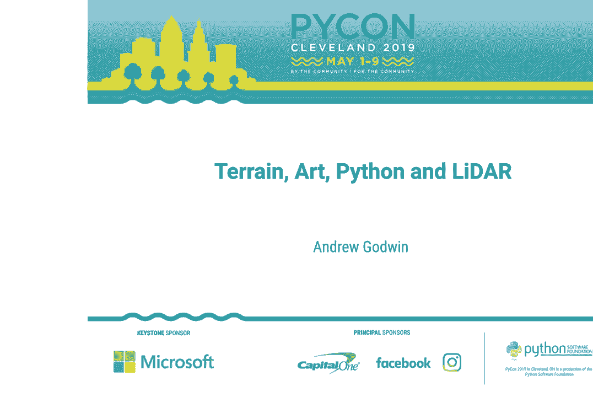
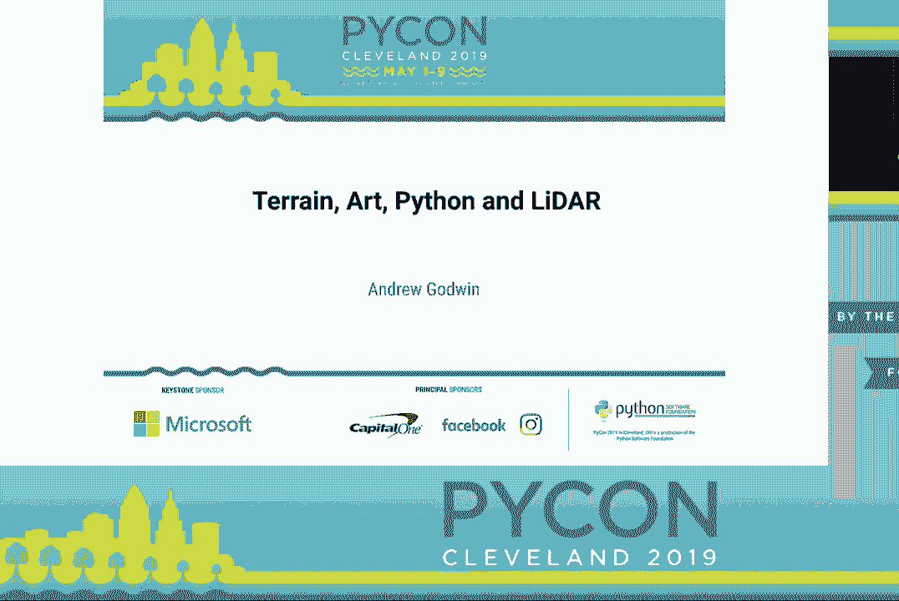
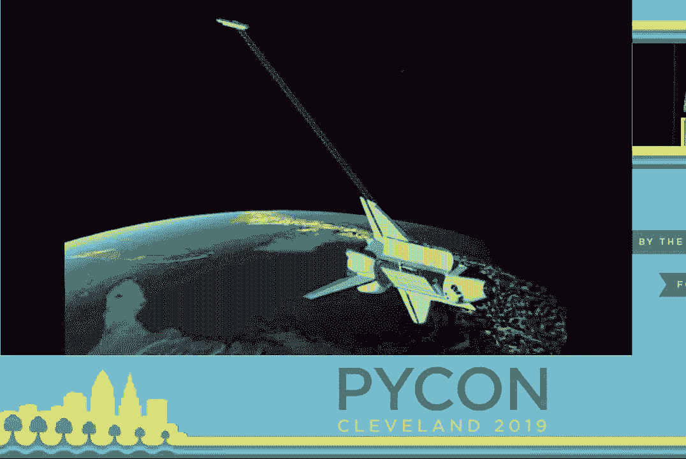
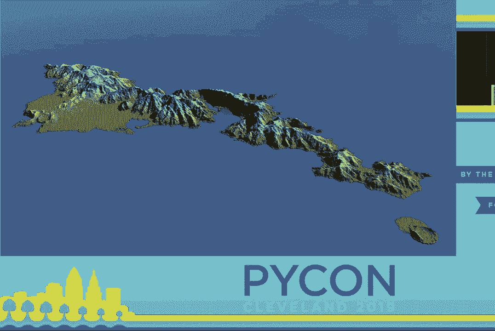
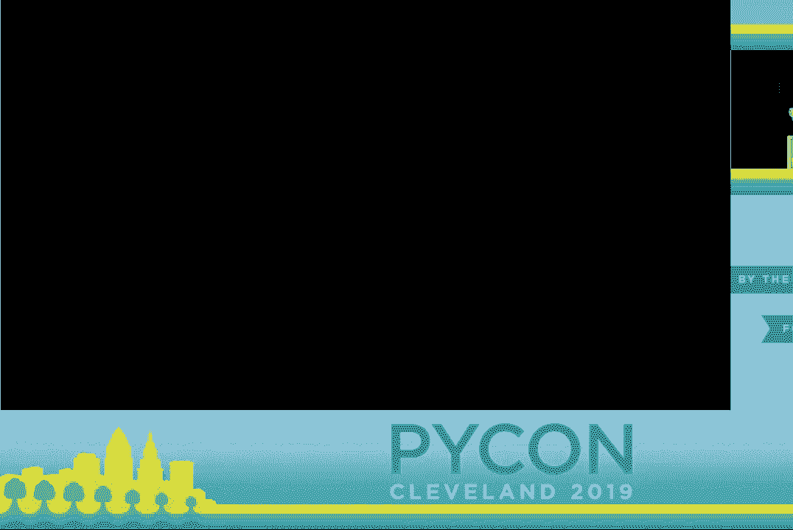
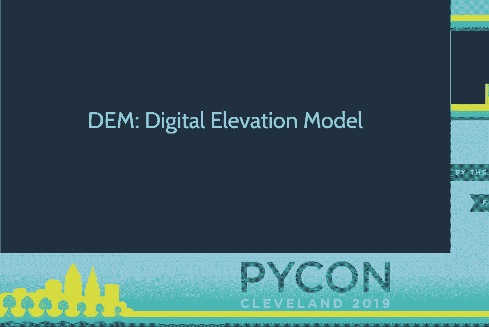
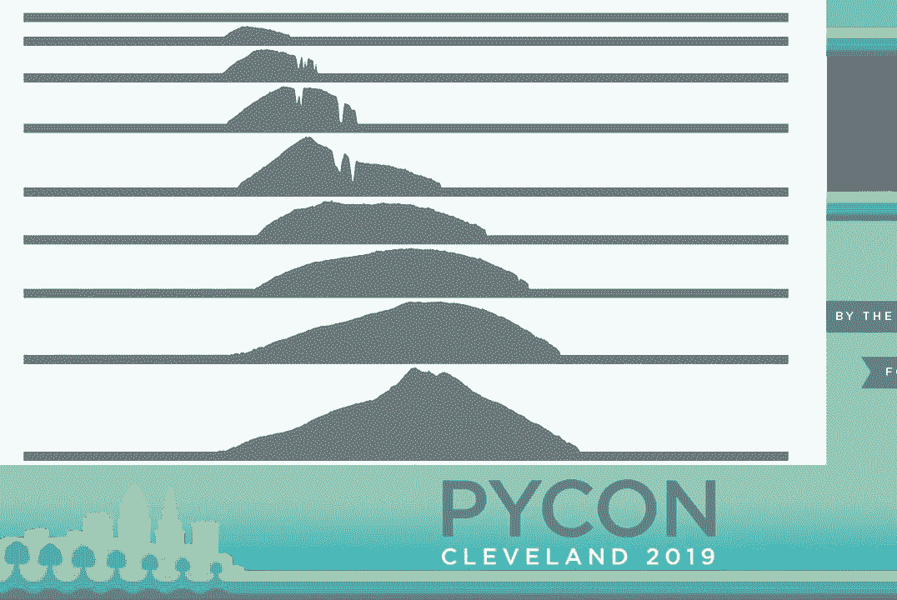
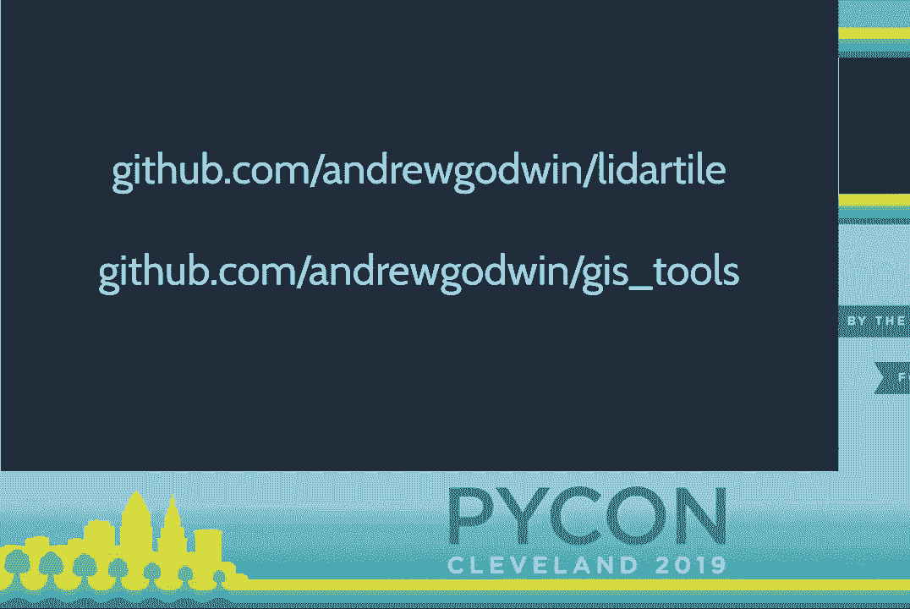

# 016：安德鲁·戈德温 - 地形、艺术、Python 和 LIDAR





## 📖 概述
在本教程中，我们将跟随安德鲁·戈德温在 PyCon 2019 的演讲，学习如何利用 Python 处理地形数据（如数字高程模型和激光雷达点云），并将其转化为实体艺术品。我们将涵盖从数据获取、处理到通过激光切割、3D打印和数控铣削进行制造的完整流程。本教程旨在让初学者理解核心概念，并看到 Python 在数字艺术和地理空间数据处理中的强大应用。

---



## 🗺️ 1：地形数据简介
几个世纪以来，人类一直试图以越来越高的精度绘制我们的世界。从最初的粗略测量到现代的激光技术，我们获取地形数据的方式发生了巨大变化。



### 航天飞机雷达地形任务
在20世纪90年代，航天飞机雷达地形任务通过航天飞机上的雷达天线，首次获得了覆盖全球的完整地球表面地图。它提供了地球上几乎所有地方的高度值，精度大约为30米。这种数据在宏观尺度上表现良好，能显示岛屿、山脉和山谷。



**公式：** `数据精度 ≈ 30米`

### 激光雷达技术
如今，我们使用激光雷达技术。激光雷达通过光进行探测和测距，其精度可以达到厘米级。这些数据通常由飞机搭载的设备采集，能够构建极其详细的地图，尤其适用于城市等区域的精确测绘。



**核心概念：** 激光雷达点云是原始数据，由一系列三维坐标点构成。
**代码表示：**
```python
# 一个简化的点云数据结构示例
point_cloud = [
    (x1, y1, z1, intensity1),
    (x2, y2, z2, intensity2),
    # ... 数百万个这样的点
]
```

---

## 🖼️ 2：数字高程模型
上一节我们介绍了原始地形数据的来源，本节中我们来看看最常用的数据形式——数字高程模型。

数字高程模型（DEM），在游戏领域常被称为高度图，本质上是一个大型的二维数组或位图。图中的每个像素（或数组中的每个单元格）代表该地理位置的海拔高度。




*上图中，左侧是伦敦的DEM，右侧是火山湖的DEM。白色代表最高点，黑色代表最低点。*

在Python中，我们可以将DEM视为一个二维数值数组进行处理，这为后续的数据操作和艺术创作奠定了基础。

---

## 🔨 3：制造技术概述
获取并理解了地形数据后，下一步就是利用这些数据制造实体模型。以下是几种主要的制造方法。

### 激光切割
激光切割是最简单的制造方法之一。激光切割机通常只需要一个定义切割路径的SVG文件。制作流程是：将DEM数据转换为等高线，生成SVG文件，然后送入激光切割机进行切割，最后将切割出的部件组装粘合。

### 3D打印
3D打印可以创建出细节更丰富的实体模型。然而，3D打印机需要完全密封的三维模型文件（如STL格式），而不能直接打印二维的高度图表面。因此，需要将DEM数据转换为具有厚度和封闭底部的三维网格。

### 数控铣削
数控铣削是一种减材制造工艺，通过旋转的刀具从一块原材料（如铝块）上切削出模型。它同样需要三维模型文件来生成刀具路径。这种方法适合制作坚固、精致的金属模型。

---

## 🐍 4：Python数据处理流程
现在，我们来看看如何用Python将原始数据转化为可用于制造的模型文件。整个过程涉及多个关键步骤。

以下是处理激光雷达点云数据并生成3D打印模型的主要步骤：

1.  **数据获取与转换**：获取原始的点云数据（`.las`等格式），并使用专业工具（如`lastools`或`PDAL`库）将其处理并转换为规则网格的数字高程模型（DEM）。
2.  **数据清洗与调整**：
    *   **剔除异常值**：去除因水面、玻璃反射造成的错误高点。
    *   **高度裁剪**：将模型底部统一裁剪到某个基准面（如海平面），以避免过深的凹陷导致打印问题。
    *   **垂直夸张**：为了艺术效果和视觉清晰度，通常会将高度（Z轴）放大1.5到2倍。
    *   **平滑处理**：对数据进行平滑，消除激光雷达数据固有的微小噪点。
3.  **生成三维网格**：将二维的DEM数组转换为三维三角形网格。这包括：
    *   为每个数据点生成顶面多边形。
    *   创建侧面墙壁，使模型具有厚度。
    *   生成底部平面，封闭整个模型。
4.  **输出模型文件**：将生成的三维网格写入标准3D打印格式，如STL文件。

**代码示例（概念性）：**
```python
# 伪代码，展示流程
dem_array = load_dem(‘dem_data.tif’) # 加载DEM数据
cleaned_array = clean_data(dem_array) # 清洗数据
exaggerated_array = exaggerate_height(cleaned_array, factor=2.0) # 高度夸张
smoothed_array = smooth_data(exaggerated_array) # 平滑

stl_model = convert_to_3d_mesh(smoothed_array, thickness=10.0) # 转为3D网格
write_stl_file(stl_model, ‘output_model.stl’) # 写入STL文件
```

**性能建议：** 在处理大型数值数组时，强烈建议使用 **NumPy** 库，它可以极大地提升运算效率，比使用纯Python列表快得多。

---

## 🧩 5：处理不规则形状
在为国家公园制作模型时，我们遇到了新挑战：模型边界不再是简单的正方形，而是不规则的多边形轮廓。

这需要结合地理信息系统（GIS）技术。我们可以使用QGIS等工具，将国家公园的矢量边界轮廓叠加到全国的DEM数据上，从而“裁剪”出只属于公园范围的高度数据。

在数据处理代码中，需要修改算法以识别这些不规则边界，并沿着真实轮廓生成模型的侧壁，而不是默认的正方形边框。这涉及到处理DEM中的“无数据”区域（通常用如`-99.99`的值填充）。

---

## ⚠️ 6：挑战与注意事项
在将地形数据转化为艺术品的实践中，会遇到一些技术挑战和需要权衡的地方。

### 地图投影问题
地球是球体，而地图是平面。将球面地图投影到平面时必然会产生扭曲。不同的投影方式适用于不同地区。在艺术创作中，我们可以选择视觉上更美观的投影，而非追求绝对的地理精度。

### 模型优化
由DEM直接生成的三维网格可能包含数百万个多边形，导致文件巨大，许多3D软件难以处理。通常需要在Blender等软件中进行网格简化优化。理想情况下，这个优化步骤可以集成到Python处理流程中。

### 制造限制
不同的制造工艺有其限制。例如，数控铣削使用的微小刀具非常脆弱，容易折断；3D打印大型模型需要很长时间。在项目规划时需要考虑这些实际约束。

---

## 🚀 7：未来展望
地形数据艺术创作领域仍有广阔的发展空间，未来的可能性令人兴奋。

*   **更易得的激光雷达**：随着自动驾驶技术的发展，个人用、低成本激光雷达扫描仪可能变得普及，这将允许我们扫描和创建室内、洞穴等更复杂空间的精细模型。
*   **流程自动化**：将模型优化、刀具路径（G-code）生成等步骤更深入地集成到Python脚本中，实现从数据到制造指令的更自动化流程。
*   **探索新形式**：结合更多样的数据源（如卫星影像、地质数据）和制造技术，创造出信息更丰富、形式更多样的地形艺术作品。

---

## ✅ 总结
本节课中我们一起学习了如何利用Python桥接地理数据与实体艺术。我们从地形数据（DEM和激光雷达点云）的基础知识出发，逐步讲解了数据清洗、转换、三维网格生成的完整流程，并探讨了激光切割、3D打印和数控铣削等不同制造技术的应用。我们还了解了处理不规则边界、地图投影等挑战，并展望了该领域未来的发展方向。希望本教程能启发你利用Python探索数据可视化和数字制造的世界。

**相关资源：**
*   演讲中提到的项目代码和链接可在原演讲视频末尾找到。
*   用于处理地理空间数据的Python库推荐：`rasterio`, `geopandas`, `PDAL`, `laspy`。
*   用于3D模型处理的库：`numpy-stl`, `trimesh`。



