# 017：什么是PLC以及如何用Python与之通信

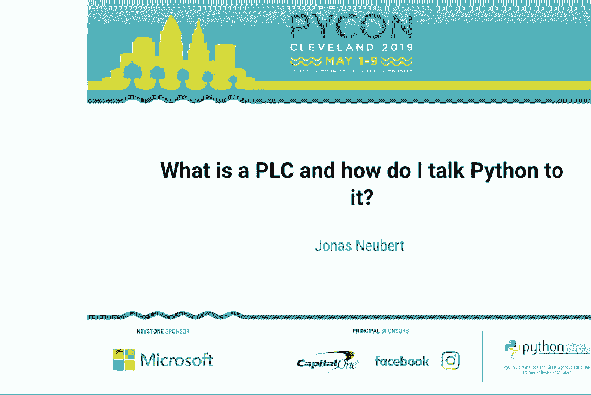

在本节课中，我们将学习可编程逻辑控制器（PLC）的基本概念，了解它在工业自动化中的核心作用，并探索如何使用Python与PLC进行通信。课程内容基于PyCon 2019的演讲，旨在为初学者提供一个清晰、实用的入门指南。

## P17：1：什么是PLC？ 🏭

上一节我们概述了课程内容，本节中我们来看看PLC究竟是什么。

PLC，全称可编程逻辑控制器，是一种专门为工业环境设计的数字计算机。它们被用于控制各种机械和生产线，例如工厂中的机器人、风力涡轮机的叶片角度调节、建筑机械、主题公园设施、洗车场以及公共交通系统。可以说，在现代城市中，你距离一个PLC通常不会超过50英尺。

PLC的核心作用是作为软件世界（比特和字节）与物理世界（原子和电子）之间的接口。它通过电线连接到“现场设备”，这些设备包括传感器（将物理现象转化为电信号）和执行器（将电信号转化为物理动作）。

PLC的工作遵循一个基本的“输入-处理-输出”循环：
1.  **读取输入**：PLC从连接的传感器读取电信号，并将其转化为变量，存储在一个称为“过程映像”的内存区域中。
2.  **执行逻辑**：PLC运行用户编写的程序（逻辑），根据输入变量计算并生成输出变量。
3.  **写入输出**：PLC将输出变量从过程映像转化为电信号，发送给执行器（如电机、风扇），从而影响物理世界。

对我们而言，第二步——即可编程逻辑部分——是最有趣的，因为这是我们能够施加影响的地方。

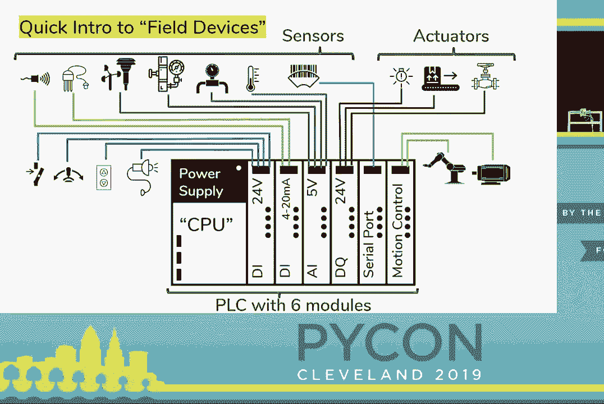

## P17：2：PLC编程入门 ⚙️

上一节我们介绍了PLC的基本功能，本节中我们来看看如何为PLC编程。

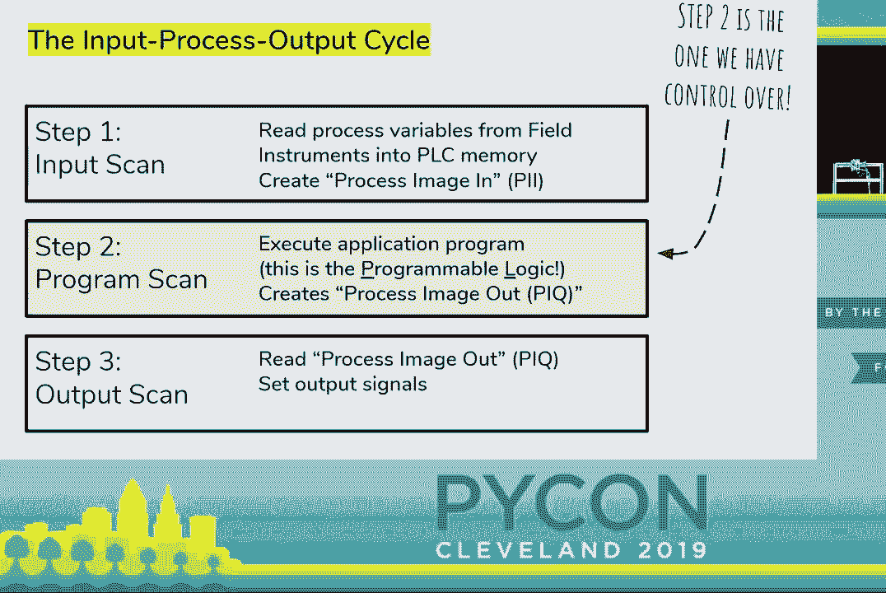

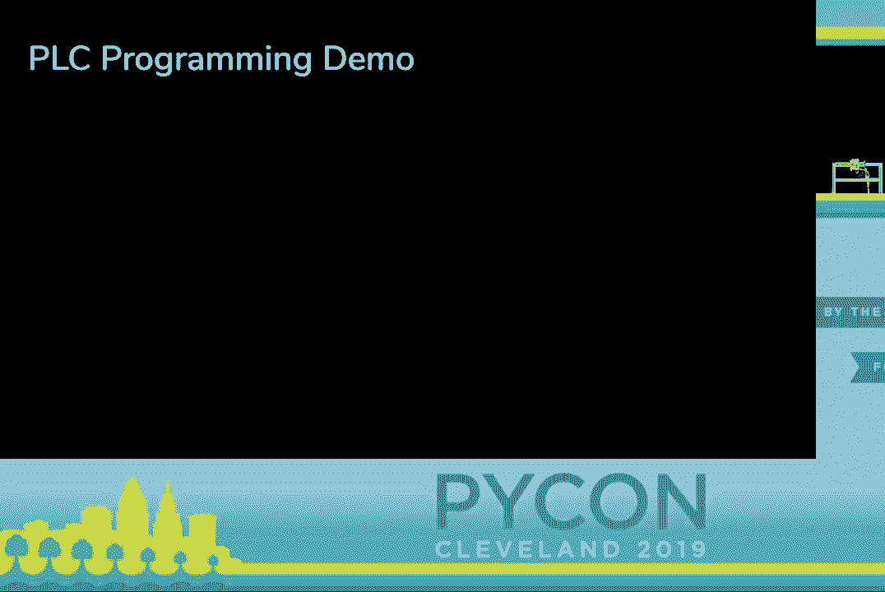

你不能使用普通的文本编辑器（如VSCode或PyCharm）来为PLC编程。相反，你必须使用PLC供应商提供的专用编程软件。PLC领域最古老、最通用的编程语言之一是“梯形逻辑”。

梯形逻辑得名于其程序结构看起来像一个梯子。它源于继电器控制逻辑时代，当时人们通过物理连接继电器来实现控制逻辑。在梯形逻辑中：
*   **左垂直轨** 被视为“带电”的。
*   **右垂直轨** 是“中性”的。
*   **水平线** 代表电流的路径。
*   **触点** 代表条件（如“如果开关按下”），放置在水平线上。
*   **线圈** 代表输出动作（如“打开灯”），放置在水平线的末端。

程序执行时，可以想象电流从左向右流动。如果通过触点形成的路径是导通的，则电流会流到线圈，从而激活输出。

以下是一个简单的梯形逻辑概念示例，用ASCII形式表示：
```
|---[ ]---( )---|
```
其中 `[ ]` 代表一个常开触点（条件），`( )` 代表一个线圈（输出）。这相当于一个简单的逻辑：“如果条件为真，则激活输出”。

这种语言已经存在了约50年，它的一大设计目标是易于调试和维护，因为最终维护系统的往往是工厂的技术人员和电工，而非最初的程序员。

## P17：3：使用Python与PLC通信 🐍

上一节我们了解了PLC的编程方式，本节中我们来看看如何用Python与运行中的PLC交互。

PLC通常需要相互通信或与上位机系统通信，因此发展出了多种工业通信协议。Python可以通过各种库来支持这些协议，从而实现与PLC的数据交换。

一个广泛使用的协议是 **Modbus**。它的工作方式是为PLC内存中的变量分配数字地址，其他设备（包括运行Python的计算机）可以通过网络读写这些地址。

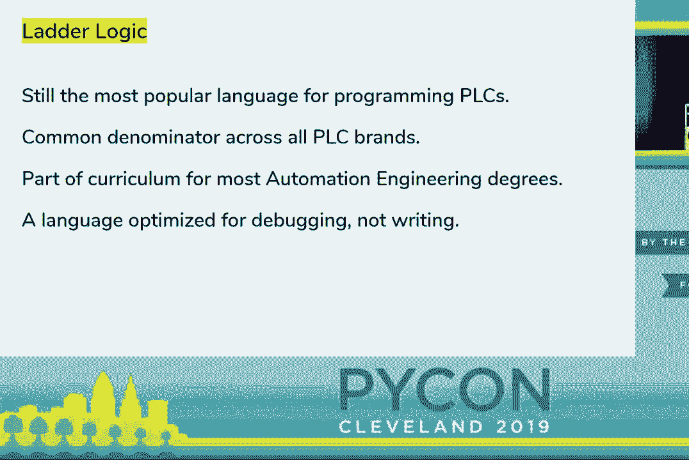

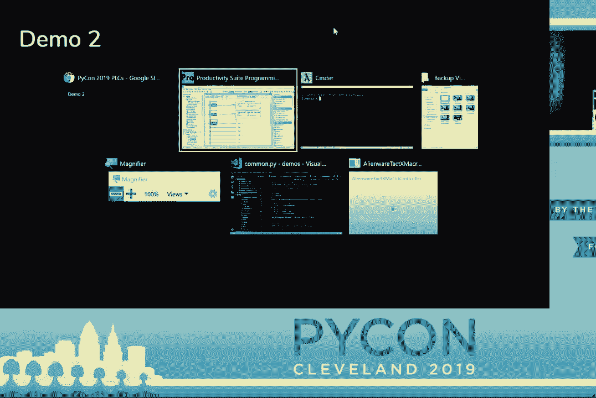

以下是使用Python `pymodbus` 库与PLC通信的一个基本示例：

```python
from pymodbus.client import ModbusTcpClient

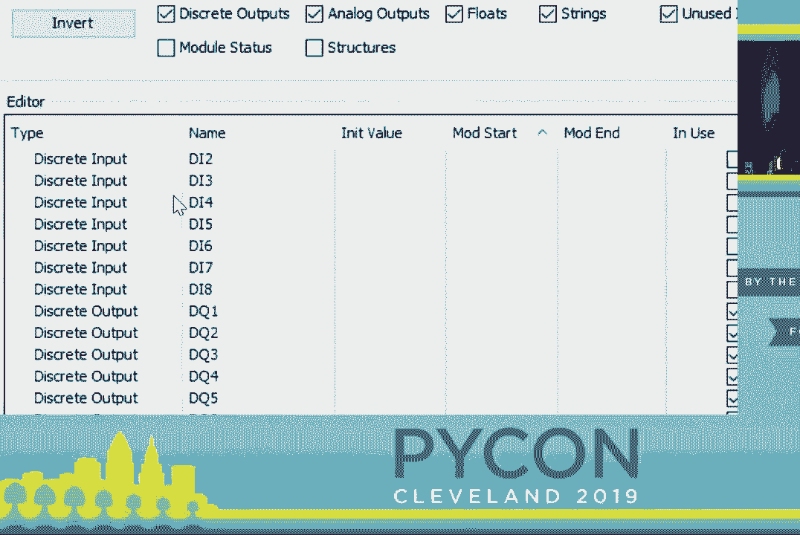

# 1. 连接到PLC
client = ModbusTcpClient('192.168.1.100')  # PLC的IP地址
client.connect()

# 2. 读取保持寄存器（例如，从地址0开始读取5个值）
result = client.read_holding_registers(address=0, count=5)
if not result.isError():
    timer_durations = result.registers  # 这是一个包含数值的列表
    print(f“读取到的计时器时长：{timer_durations}”)

# 3. 写入单个寄存器（例如，将地址0的值改为10）
client.write_register(address=0, value=10)

# 4. 关闭连接
client.close()
```

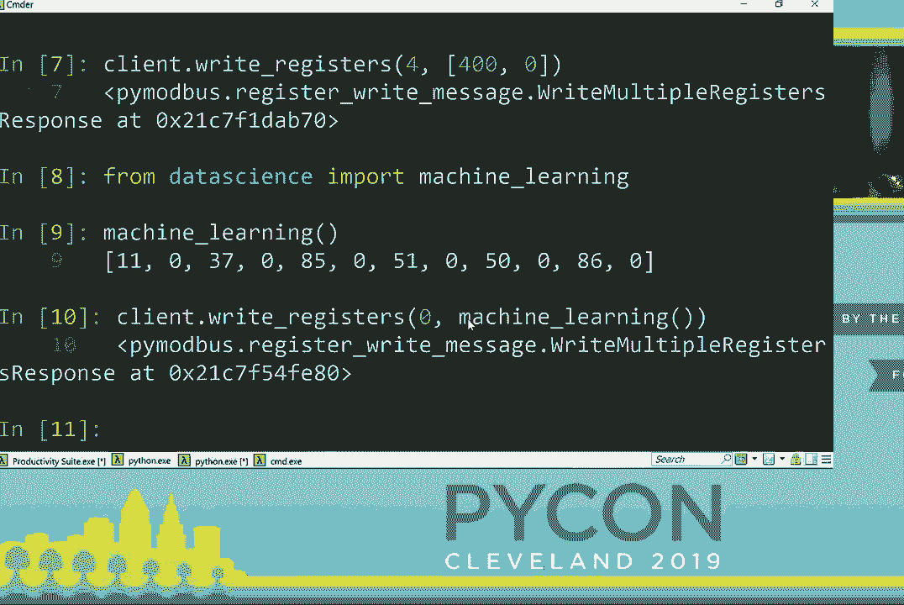

通过这种方式，Python脚本可以监控PLC的状态，或动态修改PLC的运行参数（如调整交通信号灯的计时），从而将实时控制（在PLC内完成）与高级数据分析、优化算法或用户界面（在Python中实现）结合起来。

## P17：4：Python支持的工业协议 📡

上一节我们以Modbus为例介绍了Python与PLC的通信，本节中我们系统性地看看Python生态还支持哪些工业协议。

工业领域存在大量通信协议，以下是部分在PyPI上已有Python包实现的协议：

**特定供应商协议**：
*   `pycomm3` (Allen Bradley)
*   `python-snap7` (Siemens S7)
*   `pyads` (Beckhoff ADS)
*   `melsec` (Mitsubishi Melsec)
*   `omron` (Omron FINS)

**开放标准协议**：
*   **Modbus** (`pymodbus`): 最古老、最通用的协议之一。
*   **OPC UA** (`opcua`, `asyncua`): 现代、强大、支持数据发现和复杂数据类型的协议。
*   **EtherNet/IP** (`pycomm3`, `cpppo`): 常用于罗克韦尔等设备。
*   **MQTT** (`paho-mqtt`): 轻量级的发布/订阅协议，在物联网中广泛应用。
*   **PROFINET** (需通过套接字和`ctypes`实现，或使用网关)。

**选择建议**：
对于初学者，从 **Modbus** 或 **OPC UA** 开始是不错的选择，因为它们文档丰富、库成熟。如果你的设备支持 **OPC UA**，强烈推荐使用，因为它提供了更现代和友好的API。

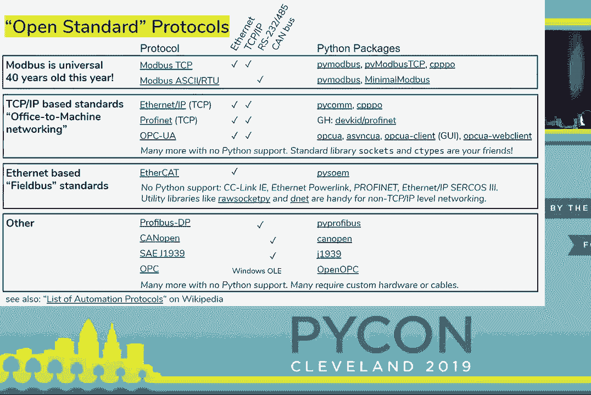

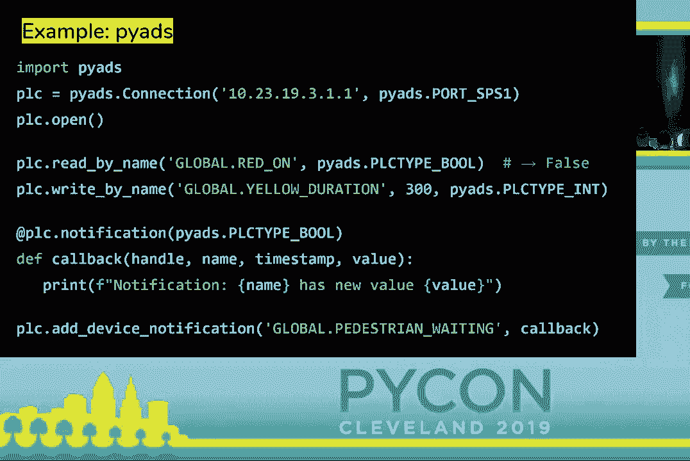

## P17：5：树莓派能当PLC用吗？ 🤔

上一节我们探讨了通信协议，本节中我们来讨论一个常见问题：廉价的树莓派能否替代PLC。

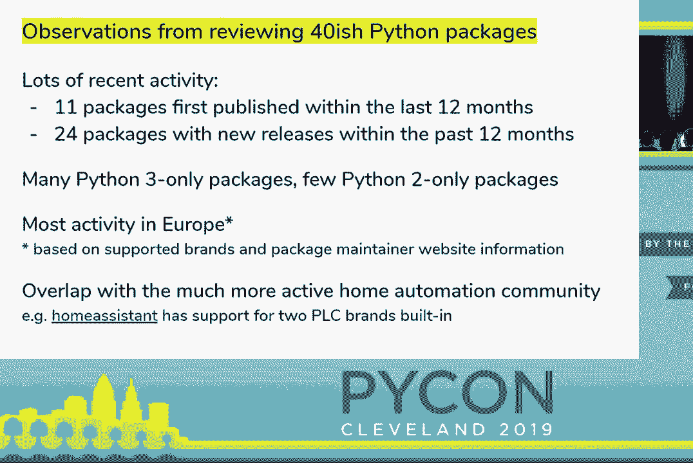

直接回答是：在大多数严肃的工业场合，**不能**。原因如下：
1.  **环境耐受性**：PLC设计用于极端环境（高温、低温、潮湿、振动、电磁干扰），而树莓派没有。
2.  **可靠性保障**：PLC制造商提供长期的供应链保障和可靠性认证，树莓派没有。
3.  **实时性**：PLC运行确定性的实时操作系统，能保证代码在精确的时间内执行。通用操作系统（如Linux）无法提供这种硬实时保证。
4.  **电气特性**：PLC具有隔离的输入/输出电路、ESD保护，并能直接连接工业电源和信号。树莓派需要额外的、可能不可靠的扩展板。


**但是**，存在一些项目和产品，旨在为树莓派赋予PLC的能力：
*   **软件层面**：如 `CODESYS for Raspberry Pi` 和 `OpenPLC`，它们通过实时补丁或协同处理的方式，在树莓派上提供实时运行环境。
*   **硬件层面**：如 `Revolution Pi`，它使用树莓派的计算模块，但重新设计了满足工业要求的周边电路和外壳。

因此，结论是：对于学习、原型开发或非关键的家庭/实验室应用，树莓派配合相关软件可以模拟PLC的功能。但对于要求可靠性、安全性和耐用性的实际工业部署，仍应选择专业的PLC硬件。

## P17：6：下一步与资源 📚

在本节课的最后，我们为你提供一些继续学习的路径和资源。

**如果你想动手尝试**：
1.  **使用模拟器**：搜索“PLC simulator online”找到免费的梯形逻辑在线模拟器进行练习。
2.  **购买学习套件**：一些PLC供应商（如西门子、艾伦布拉德利）提供低成本的学习套件。也可以在eBay上寻找二手PLC设备。
3.  **探索开源项目**：深入研究 `OpenPLC` 或 `opcua` 这样的开源项目。

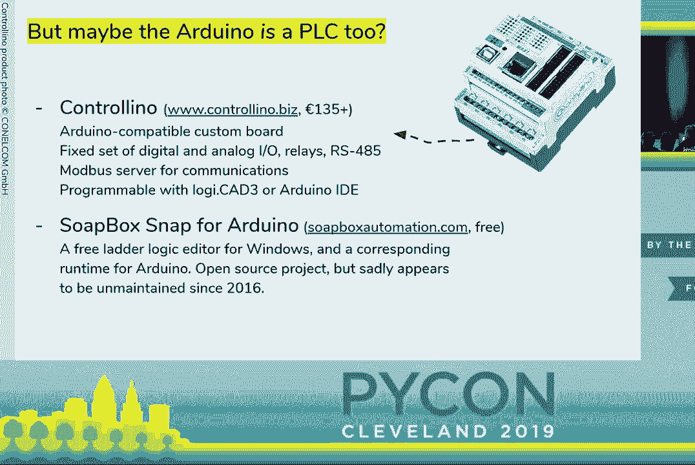


**推荐资源**：
*   **协议库**：从PyPI安装 `pymodbus` 或 `opcua`，阅读其文档和示例。
*   **树莓派PLC**：查看 `CODESYS for Raspberry Pi` 或 `Revolution Pi` 的官网。
*   **社区**：参与工业自动化、物联网相关的论坛和开源社区。

**总结**：
本节课中我们一起学习了：
1.  **PLC** 是工业自动化的核心控制器，连接数字与物理世界。
2.  PLC通常使用**梯形逻辑**等专用语言编程。
3.  我们可以使用**Python**和多种**工业通信协议**（如Modbus, OPC UA）与PLC通信，实现监控、数据采集和高级控制。
4.  虽然**树莓派**在严格意义上不能替代工业PLC，但通过特定项目可以在某些场景下实现类似功能。


希望本教程为你打开了工业自动化与Python结合的大门。记住，关键在于理解PLC的实时控制角色与Python的高级数据处理角色之间的互补关系。