# 021：Python软件基金会社区报告与社区服务奖 🏆

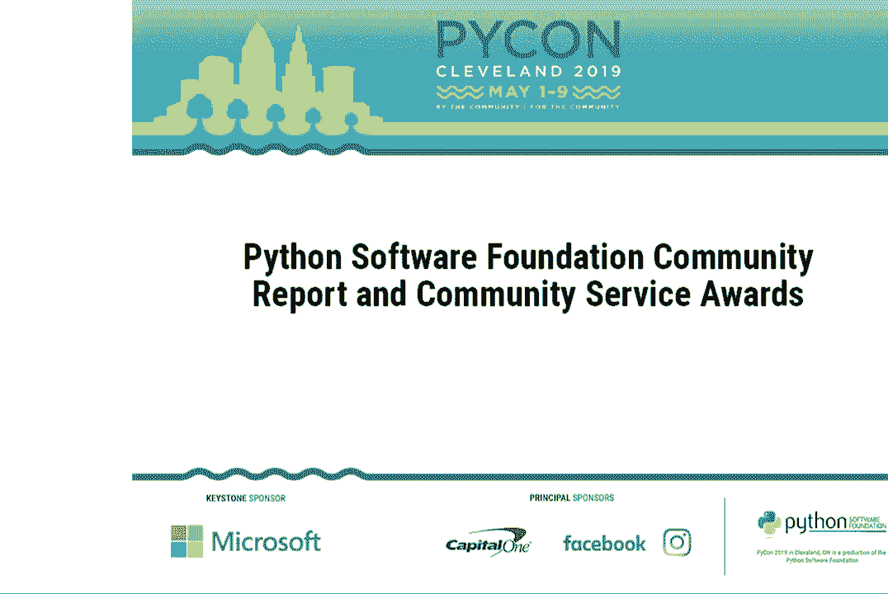

在本节课中，我们将了解Python软件基金会（PSF）的运作、其对社区的回馈方式，以及如何表彰那些为Python生态系统做出卓越贡献的成员。我们将看到PSF如何通过资金、活动和支持来推动Python语言的发展，并认识一些获得社区服务奖的杰出贡献者。

---

## 赞助商致辞与社区支持 💼

大家好。

我是Brent Klimitz，来自Capital One。我是一名开发人员。这是我参加PyCon的第四年。我在PyCon看到许多新面孔，这显示了社区的伟大，以及过去几年它的成长，坦率地说，这门语言的进步。

你可能会理解或不理解为什么Capital One会成为赞助商，为什么我们在这里。坦率地说，我们热爱这门语言。它为我们在Capital One的创新提供了动力，尤其是在我们的开源项目中，如Cloud Custodian，以及我们的客户面对的项目如Eno。我们支持社区，想要看到这门语言的进步。

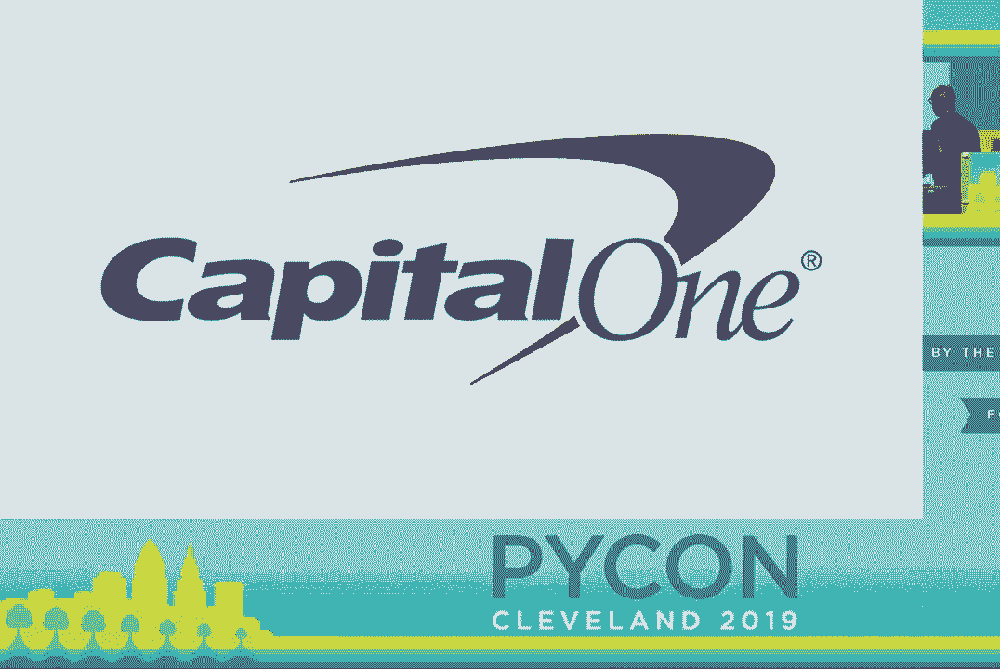

这些也是我来到Capital One的很多原因，因为我们真的非常热爱这个社区，并想要支持它，看到它向前发展。我们非常感谢社区在我们的生态系统项目中给予我们的帮助。我们为成为该社区和PyCon的主要赞助商而感到自豪。

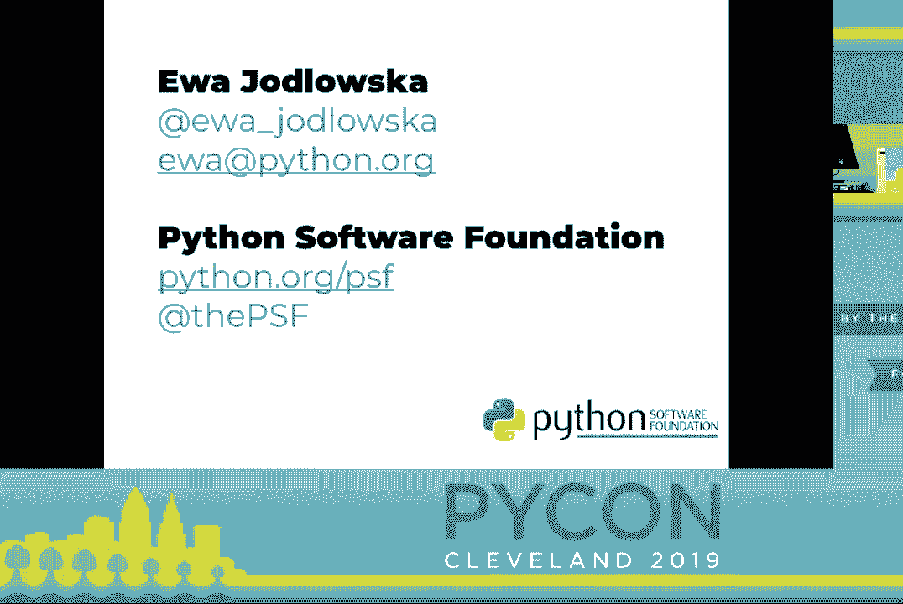

并期待在未来的PyCon上见到你们。

---

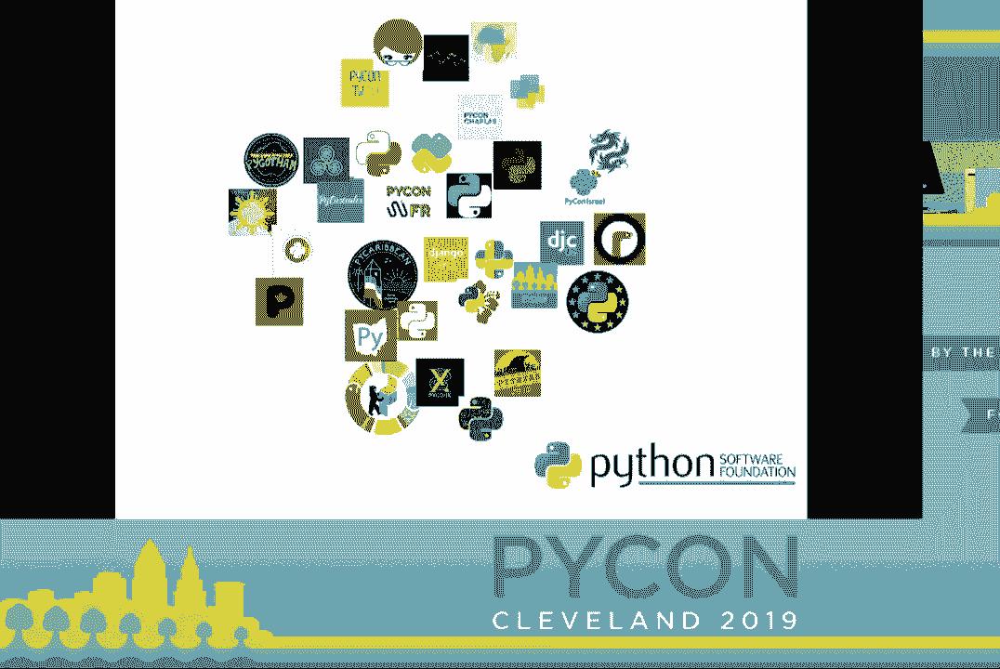

## PSF执行董事致辞与社区回馈 🤝

欢迎Eva，她将更新Python软件基金会的情况，并颁发社区服务奖。

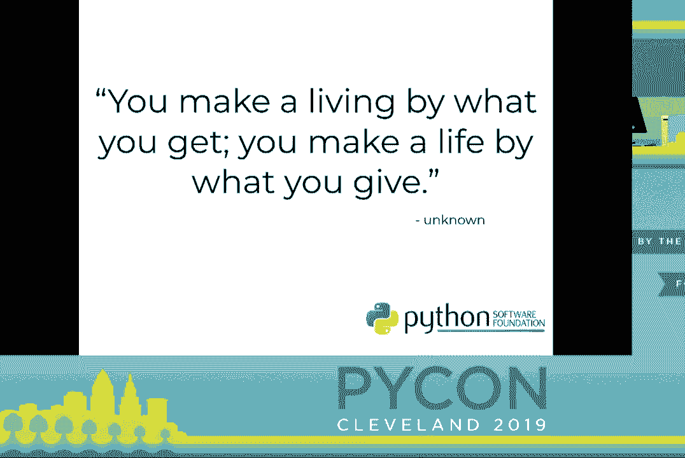

我叫Eva，我是Python软件基金会的执行董事。如果你对Python社区的更新感兴趣，请关注我和PSF的Twitter。

现在让我们谈谈回馈。

我们在PyCon和类似的活动中聚集，是因为机会。这些面对面的活动为我们提供了学习、网络、合作、与朋友见面、交新朋友、教学、指导等众多机会。通过这些机会，我们促进了Python的发展，使我们的社区更强大。

在某种程度上，我们回馈给了Python。

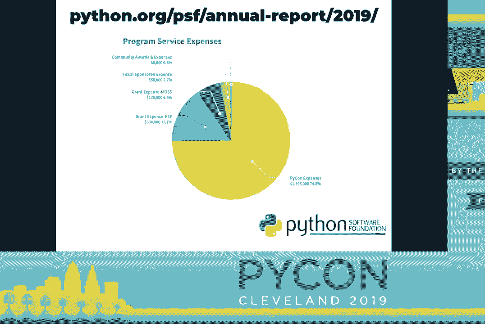

通过注册参加，你在回馈社区，赞助会议，讲授教程，进行主题演讲，这些都在回馈社区。所有这些回馈的形式都帮助我们的社区成长。Python软件基金会是Python及其社区背后的非营利组织。

---

## PSF的年度影响与资金分配 📊

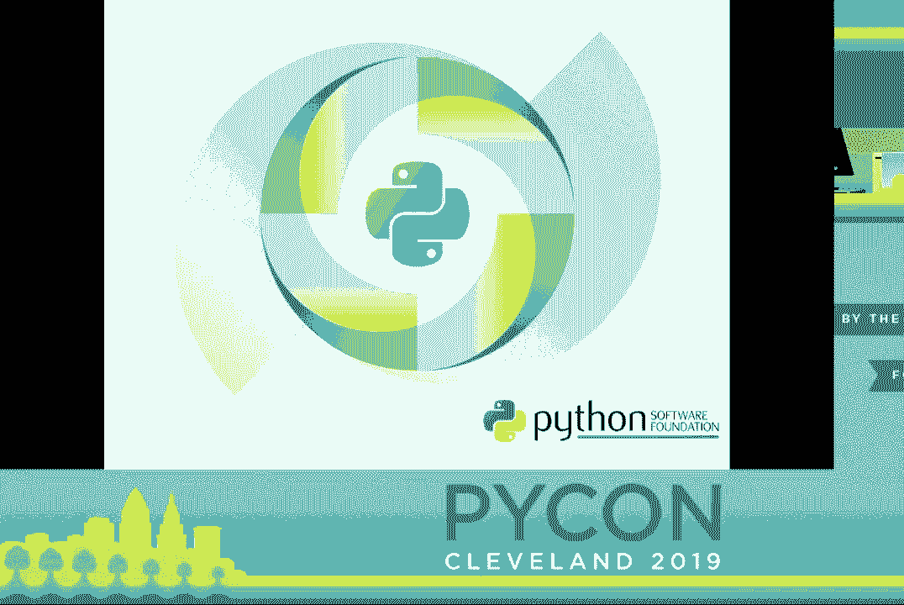

PSF已成长为一个通过其项目回馈社区的组织。

今年，我们发布了第一份年度影响报告。在这里，我们看到报告中的一小部分，显示了2018年的项目服务费用。大约75%的费用用于举办PyCon。我们第二大费用是用于我们的拨款项目，总计占16%。

随着PSF的持续增长，我们也希望我们的资助项目能够增长。我们的资助资金用于支持其活动和全球各地的地区社区。我们希望继续支持这些活动和社区，因为它们提供了我之前提到的那些有影响力的机会，不仅在这里，还有其他地方。

---

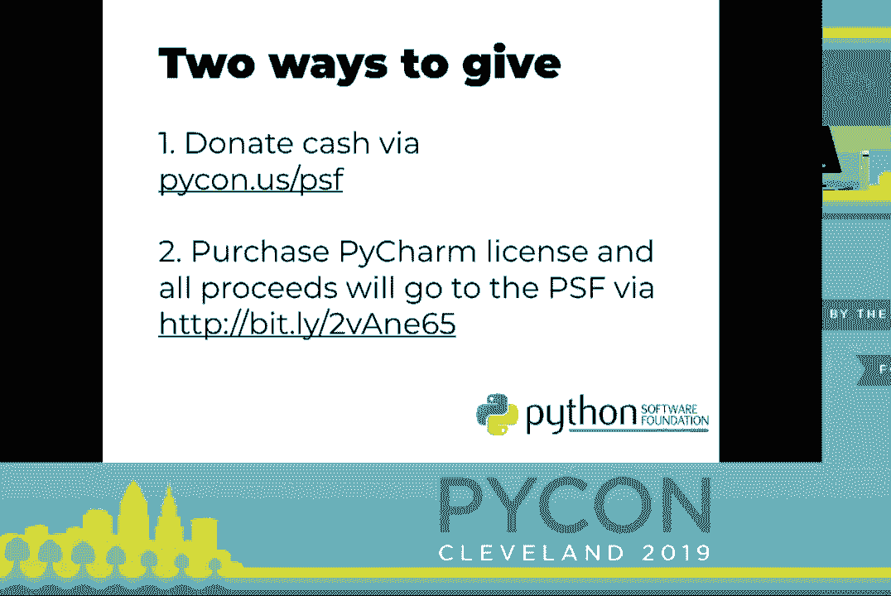

## PSF的未来目标与筹款方式 🎯

除了为我们的社区提供支持外，我们还希望增加PSF的支出预算，以资助Python、教育项目和开发冲刺（DevSprints）等事务。我们希望有足够的资金帮助Python达到下一个水平。拉塞尔周五的主题演讲让我深有感触，因为我觉得他提到了PSF可以支持Python以保持可持续发展的所有方式。

在PSF，我们倾听社区的需求，并希望能够满足其中的很多需求。当然，我们无法满足所有需求，这不是重点。但为了支持核心开发，我们需要更多资金来做到这一点。

捐赠是让我们能够做到这一点的方式。几天前，PSF启动了今年的第一次筹款活动。在这个房间里，大多数人的生活都以某种方式受到了Python的影响。我希望大家现在都能想想Python社区给你们带来的那些机会。

考虑到这一点，我希望大家考虑回馈Python，以便它能继续对世界产生积极影响。

以下是今年支持PSF的两种方式：
*   一种方式是通过捐赠按钮捐款，你可以通过 `pikon.us/psf` 找到它。
*   第二种是通过我们与JetBrains的合作。如果你通过我提供的链接购买PyCharm许可证，这些购买的所有收益将用于PSF。

我们的筹款活动将于5月22日结束。请考虑给予支持。

---

## PSF的团队与可持续发展 👥

PSF的增长部分体现在做出增强我们可持续性的决策，以便我们能够继续支持我们的社区和员工。我们理解多样化收入来源的重要性，这样我们就不再单靠PyCon来维持PSF。

此外，我们决定需要至少保留一年半的运营成本作为财务储备。除了财务责任外，我们还关注了员工的可持续性，以免我们的“公交车因素”降到1。我们最近雇佣了更多人来处理PyCon和我们的会计团队。当我在2011年开始时，只有我们两个人。现在我们有八个人。

我想借此机会把大家请上台，因为在座的每个人都应该看到PSF背后所有工作的团队。看到名字、电子邮件和聊天很不错，但把这些名字与面孔联系起来更好。PSF团队，快上来。

所以，在这几年你们在大会上看到的这个友好的面孔，尤其是在过去几年，不仅是2018年和2019年PyCon的大会主席，而且Ernest还是PSF的基础设施总监。Ernest帮助支持我们的社区满足基础设施需求和问题。此外，Ernest管理所有PSF拥有的基础设施，如pikon.org，帮助维护pikon.org和us.pikon.org以及更多其他网站。

Phyllis Dobbs两年前加入我们，现在正在领导我们的会计团队。Phyllis帮助我们确保在我们非营利组织的财务持续增长时有重要的政策和程序到位。

Jackie Augustin去年9月加入我们，现在是PyCon的经理和首席组织者。我相信你们中的许多人已经与Jackie就注册问题进行了互动，今后你们将看到她参与更多的工作。

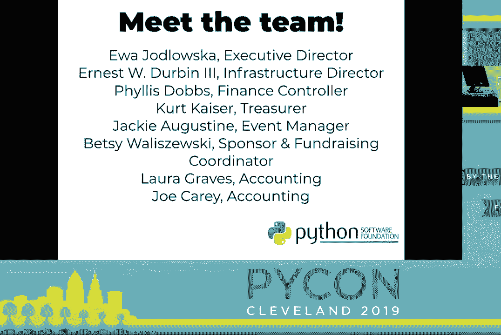

Betsy Walaschowski自2015年以来一直在PSF工作。Betsy在提供赞助和筹款支持方面表现出色。今年，Betsy在PyCon赞助方面做得非常出色，她帮助了所有在展览大厅中与您互动的赞助商，解决他们的后勤和需求。

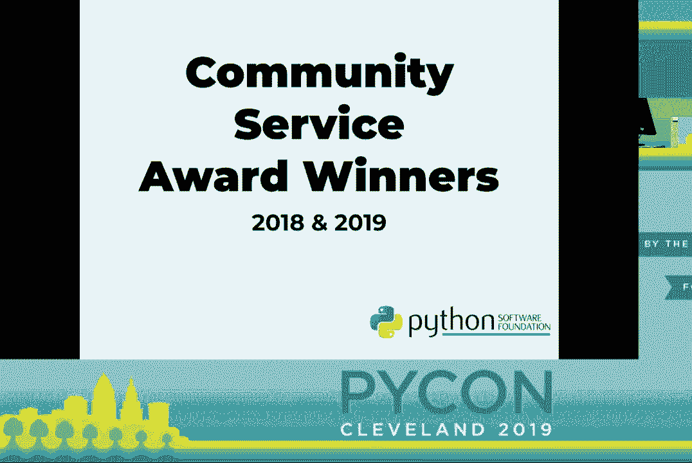

Joe和Laura都在今年早些时候加入了我们。Joe和Laura都加入了我们来帮助会计团队。我们非常感激他们在PyCon和PSF的财务方面提供的帮助，例如财务援助，甚至在今年的飞行员拍卖会上。欢迎加入团队，Joe和Laura。

现在，Herpikizer，请上前。现在我快要哭了。Herpikizer在PSF工作了12年。Herpikizer负责建立PSF的会计系统，并帮助铺就了PSF今天的发展道路。Herpikizer今年将退休，我们都要对他为PSF多年来所做的一切表示衷心的感谢。谢谢你，Herpikizer。

感谢大家与我同台。

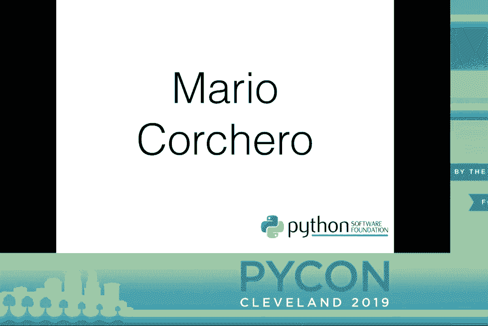

---

## 社区服务奖颁奖环节 🏅

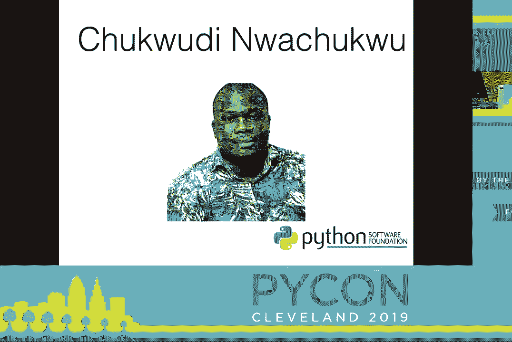

现在让我们给予社区成员一些认可。

社区服务奖每季度颁发，通常同时颁发给两位Python开发者。这些奖项是PSF对那些帮助加强和改善Python生态系统的贡献者的辛勤付出给予认可的一种方式。

让我们欢迎马里奥·克雷西罗上台。马里奥于2018年获得社区服务奖，以表彰他在PyCon ES的领导和组织工作。Pylandenium和PyCon的查理轨道。他的工作在推广Python的使用和促进西班牙、拉丁美洲和英国的Python社区方面发挥了重要作用。

接下来是查克·伍迪·诺赫图库。查克不幸无法参加今年的PyCon，但查克在2019年获得社区服务奖，以表彰他在促进Python在尼日利亚社区的成长和对PSF拨款工作组的贡献与研究的奉献。

接下来，我想欢迎亚历克斯·盖诺尔上台。亚历克斯于2018年获得CSA，以表彰他对Python和Django社区以及Python软件基金会的贡献。亚历克斯曾在2015至2016年担任PSF董事。他是基础设施工作人员，贡献于遗留PIPI和下一代仓库，并通过压缩404图像帮助减少遗留仓库的不安全性和带宽成本。

现在让我们欢迎马里奥上台。2018年第三季度奖项授予玛丽亚，以表彰她对CPython的贡献、提高Python核心团队工作流程的努力，以及在我们社区内增加多样性的工作。此外，她作为Pike Cascades的共同主席和PyCon的指导式速配的共同组织者，帮助传播Python的成长和多样性。

现在让我们欢迎玛雅·桑切斯·米兰达上台。2018年第四季度奖项授予玛雅，以表彰她作为2019年Pike on Charlie的主席和创始成员，以及组织墨西哥Python Day和Puebla Django Girls的工作。

接下来我们欢迎约翰·罗亚。2018年第四季度的第二个奖项授予约翰·罗亚，以表彰他作为哥伦比亚Pike大会的创始人和主席的工作。此外，约翰在哥伦比亚的Python推广方面发挥了重要作用，尤其是在Django Girls研讨会中。

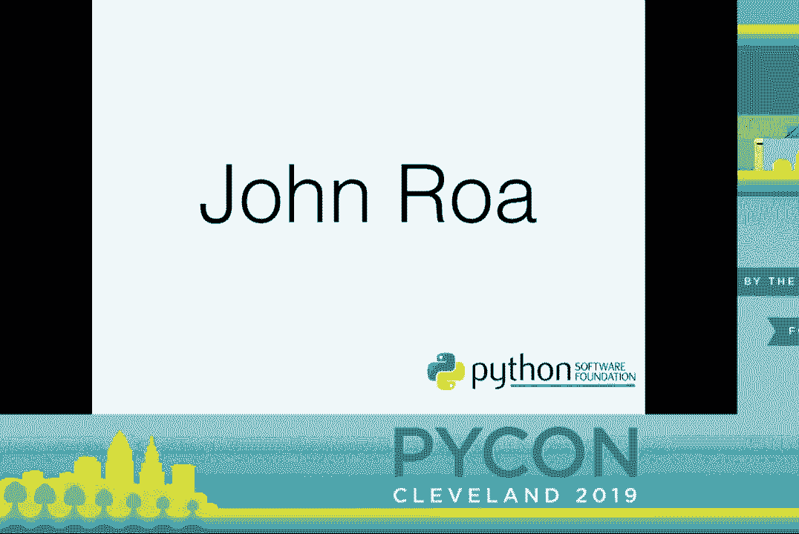

2019年第一季度奖项授予斯特凡·贝克内尔，表彰他作为两个重要Python项目的主要开发者和维护者的工作。`sython`和`lxml`。不幸的是，斯特凡今年无法与我们同在。

现在让我们欢迎Eric Ma上台。2019年第一季度社区服务奖授予Eric，因为他在担任财务援助共同主席和今年的主席期间，始终超越自己的职责。此外，Eric在程序成员方面也表现出色，已经做了好几年。对于那些获得了演讲者资助或财务援助的人来说，见到Eric时一定要感谢他的奉献。

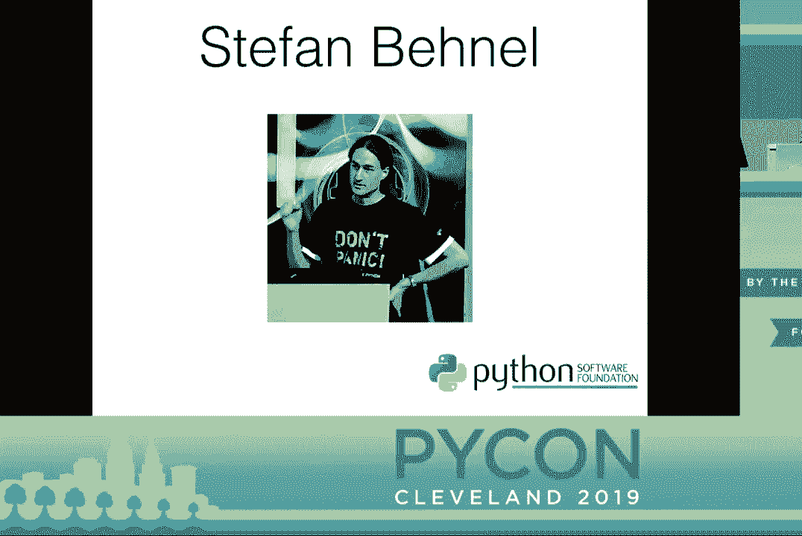

这就是我们今年的颁奖环节。我们社区中有许多优秀的贡献者，这是一种很好的方式来表彰他们的工作。如果你想提名某人参加未来的社区服务奖，请把提名发送给我们。邮箱是 `psf@python.org`。

---

## 总结与致谢 🙏

谢谢你，Eva。也感谢大家的辛勤工作。我们能为获奖者再来一轮掌声吗？

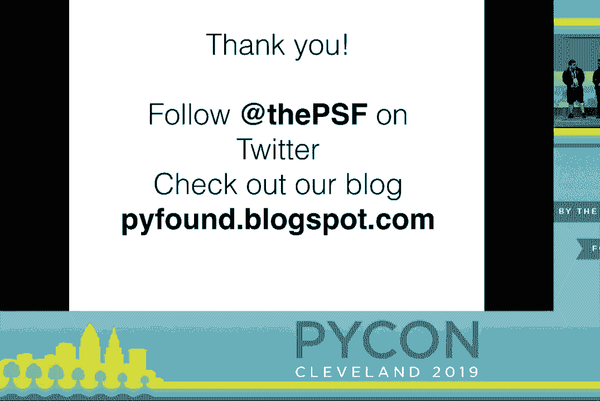

Eva对PSF员工说了很多，但没有太多提及自己。Eva为了确保Python软件基金会和Python的运作所投入的努力和工作是有目共睹的。所以我们来一轮掌声，仅仅为了Eva。

---

本节课中我们一起学习了Python软件基金会（PSF）的核心作用、资金来源与分配、其支持社区发展的具体方式，以及社区服务奖如何表彰杰出贡献者。我们看到了一个健康的开源社区背后，需要资金、组织和无数志愿者的共同努力来维持其活力与可持续发展。