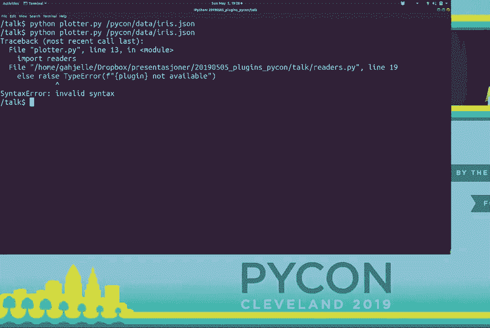

# 027：为应用程序添加灵活性 🧩


在本教程中，我们将学习如何通过插件系统为Python应用程序添加灵活性和模块化。我们将从一个简单的命令行绘图应用开始，逐步将其重构，使其能够支持多种数据格式和图表类型。核心概念将使用**代码**和**公式**进行描述。

---

## 概述

我们将构建一个能够读取数据文件（如CSV、JSON）并绘制图表的命令行应用。最初，应用功能固定。随后，我们将通过引入插件架构，使其能够轻松扩展以支持新的数据格式和图表类型，而无需修改核心代码。

---


## 1：从简单应用开始 📝


首先，我们创建一个基础应用。它使用`click`库处理命令行参数，使用`pandas`读取CSV数据，并使用`matplotlib`绘制简单的折线图。

以下是初始代码：


```python
import click
import pandas as pd
import matplotlib.pyplot as plt
from pathlib import Path


@click.command()
@click.argument("file_path")
def main(file_path):
    """读取CSV文件并绘制折线图。"""
    path = Path(file_path)
    data = read_data(path)
    plot_data(data)

def read_data(filepath):
    """读取CSV文件并返回Pandas DataFrame。"""
    return pd.read_csv(filepath)

def plot_data(data):
    """绘制Pandas DataFrame的折线图并显示。"""
    data.plot()
    plt.show()


if __name__ == "__main__":
    main()
```


这个应用功能完整，但缺乏灵活性。它只能处理CSV格式，并且图表类型固定。

---

## 2：识别扩展需求 🔍

上一节我们创建了一个基础应用。本节中我们来看看当需求变化时会出现什么问题。例如，如果用户有JSON格式的数据文件，当前应用将无法处理。

尝试用JSON文件运行应用会导致错误，因为`read_data`函数只调用了`pd.read_csv`。为了支持新格式，我们必须在`read_data`函数中添加条件判断逻辑。

```python
def read_data(filepath):
    """根据文件后缀读取CSV或JSON文件。"""
    suffix = filepath.suffix.lower()[1:]  # 去掉点号，例如 ‘csv‘
    if suffix == "csv":
        return pd.read_csv(filepath)
    elif suffix == "json":
        import json
        with open(filepath) as f:
            data = json.load(f)
        return pd.DataFrame(data)
    else:
        raise ValueError(f"不支持的格式: {suffix}")
```


这种方法在格式较少时可行，但随着支持格式的增加，`read_data`函数会变得臃肿且难以维护。每个新格式都需要添加新的`if-elif`分支。


---


## 3：引入模块化与插件概念 🧱


上一节我们看到了硬编码格式支持的局限性。本节中我们来看看如何通过模块化来解决这个问题。


核心思想是：**将每种数据格式的读取逻辑分离到独立的函数中**。这样，每个函数只负责一件事，符合单一职责原则。


首先，我们创建一个名为`readers.py`的模块：

```python
# readers.py
import pandas as pd
import json

def read_csv(filepath):
    """读取CSV文件。"""
    return pd.read_csv(filepath)

def read_json(filepath):
    """读取JSON文件。"""
    with open(filepath) as f:
        data = json.load(f)
    return pd.DataFrame(data)
```

然后，在主应用中，我们需要一种方式来根据文件后缀动态调用正确的函数。一种方法是使用字典映射：

```python
# 在主应用中
from pathlib import Path
import readers

READERS = {
    "csv": readers.read_csv,
    "json": readers.read_json,
}

def read_data(filepath):
    suffix = filepath.suffix.lower()[1:]
    reader_func = READERS.get(suffix)
    if reader_func is None:
        raise ValueError(f"不支持的格式: {suffix}")
    return reader_func(filepath)
```

这比之前的`if-elif`链更清晰。但是，我们仍然需要手动维护`READERS`字典。添加新格式时，必须修改这个字典。

---


## 4：使用装饰器自动注册插件 🎀


上一节我们通过字典映射改进了结构，但注册过程仍是手动的。本节中我们来看看如何使用**装饰器**实现插件的自动注册。

装饰器是Python的一个强大功能，它是一个接收函数作为参数并返回函数的函数。我们可以创建一个装饰器，用它来将函数注册到我们的插件系统中。

以下是实现自动注册的步骤：

1.  创建一个全局字典来存储插件。
2.  创建一个装饰器函数，将被装饰的函数注册到字典中。
3.  使用这个装饰器来标记我们的读取器函数。

更新后的`readers.py`模块：

```python
# readers.py
import pandas as pd
import json

# 存储所有已注册的读取器插件
_REGISTRY = {}

def register(func):
    """装饰器：将函数注册为插件。"""
    # 使用函数名作为插件键（例如 ‘read_csv‘）
    _REGISTRY[func.__name__] = func
    return func  # 装饰器返回原函数，不改变其行为




@register
def read_csv(filepath):
    return pd.read_csv(filepath)


@register
def read_json(filepath):
    with open(filepath) as f:
        data = json.load(f)
    return pd.DataFrame(data)


def get_reader(plugin_name):
    """根据名称获取已注册的读取器函数。"""
    reader_func = _REGISTRY.get(plugin_name)
    if reader_func is None:
        raise ValueError(f"插件 ‘{plugin_name}‘ 未找到。")
    return reader_func
```

现在，主应用可以这样调用：


```python
# 在主应用中
from pathlib import Path
import readers


def read_data(filepath):
    suffix = filepath.suffix.lower()[1:]
    # 构建插件函数名，例如 ‘read_csv‘
    plugin_name = f"read_{suffix}"
    reader_func = readers.get_reader(plugin_name)
    return reader_func(filepath)
```

这样，添加一个新的读取器（如`read_excel`）只需要在`readers.py`中定义新函数并用`@register`装饰即可。主应用代码无需任何修改。


---

## 5：推广模式与使用PiPlugs 📦


上一节我们为数据读取器创建了一个插件系统。本节中我们来看看如何将相同的模式应用到图表绘制器（plotters）上，并介绍一个现成的工具来简化这个过程。


我们可以创建另一个模块`plotters.py`，用同样的`@register`装饰器模式来管理不同的图表类型（如折线图、散点图）。


然而，手动管理多个插件模块（readers, plotters, writers等）会带来重复的样板代码。为了解决这个问题，可以使用一个名为 **PiPlugs** 的第三方包。

PiPlugs 提供了一个基于装饰器的轻量级插件架构。它帮助我们：
*   自动发现插件。
*   将插件组织在独立的包/目录中。
*   提供统一的调用接口。

以下是使用PiPlugs重构后，插件目录结构的示例：

```
my_plotting_app/
├── main.py
└── plugins/
    ├── readers/
    │   ├── __init__.py
    │   ├── csv.py
    │   └── json.py
    └── plotters/
        ├── __init__.py
        ├── line.py
        └── scatter.py
```


在每个插件文件中，使用PiPlugs的`@register`装饰器：

```python
# plugins/readers/csv.py
import pandas as pd
import piplugs

@piplugs.register
def read_csv(filepath):
    """PiPlugs插件：读取CSV。"""
    return pd.read_csv(filepath)
```


在主应用中，可以这样调用：

```python
# main.py
import click
from pathlib import Path
import piplugs


@click.command()
@click.argument("file_path")
def main(file_path):
    path = Path(file_path)
    suffix = path.suffix.lower()[1:]

    # 使用PiPlugs调用插件
    data = piplugs.call(f"readers.read_{suffix}", filepath=path)
    piplugs.call("plotters.line", data=data)


if __name__ == "__main__":
    main()
```

PiPlugs 在后台处理了插件的导入、注册和调用，让我们能更专注于业务逻辑。

---

## 6：插件系统的应用场景与最佳实践 💡

上一节我们介绍了使用PiPlugs来管理插件。本节中我们来看看插件系统的典型应用场景和一些需要注意的地方。

插件架构在以下场景中非常有用：
*   **数据读写器**：支持多种文件格式（CSV, JSON, Excel, Parquet）。
*   **计算引擎**：在不同后端（如NumPy, TensorFlow, PyTorch）之间切换。
*   **通知器**：将消息发送到不同平台（Email, Slack, SMS）。
*   **GUI组件**：动态加载不同的界面部件。

使用插件系统时，请遵循以下最佳实践：
1.  **定义清晰的接口**：确保同一类别的所有插件（如所有`readers`）具有相同或兼容的函数签名（参数和返回值）。例如，所有数据读取器都应接收`filepath`参数并返回`DataFrame`。
2.  **处理参数差异**：如果不同插件需要不同的参数，调用方需要知晓并传递正确的参数。PiPlugs允许传递任意`**kwargs`，但调用者需负责匹配。
3.  **错误处理**：始终对插件查找失败的情况进行优雅处理。
4.  **文档化**：为你的插件系统编写文档，说明如何添加新插件。

---

## 总结

在本教程中，我们一起学习了如何为Python应用程序构建一个灵活的插件系统。
1.  我们从一个简单的、功能固定的绘图应用开始。
2.  我们识别出添加新功能（如数据格式）时代码会变得臃肿的问题。
3.  我们通过**模块化**和**字典映射**将不同功能解耦。
4.  我们利用**装饰器**实现了插件的**自动注册**，大大提升了可扩展性。
5.  我们介绍了**PiPlugs**包，它提供了生产就绪的插件基础设施，帮助我们管理更复杂的插件生态。
6.  最后，我们探讨了插件系统的应用场景和最佳实践。


通过插件架构，你可以创建出易于维护、测试和扩展的应用程序，并允许其他开发者甚至用户为其添加功能，从而极大地提升了软件的灵活性和生命力。