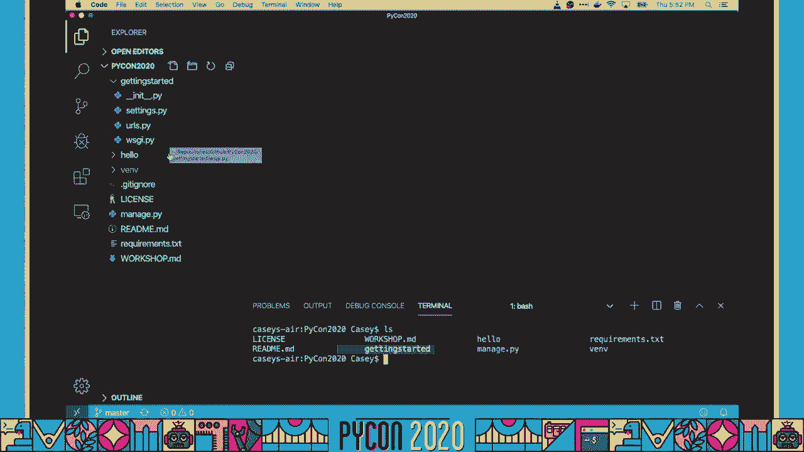
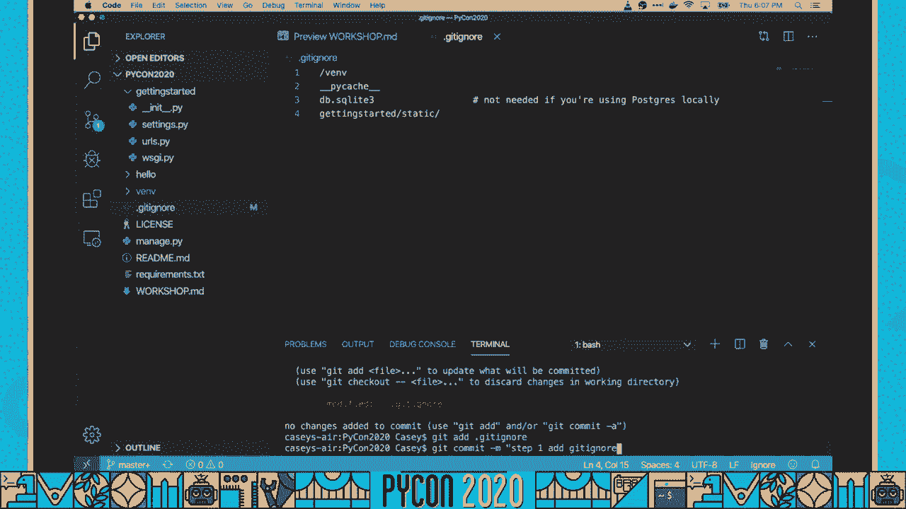
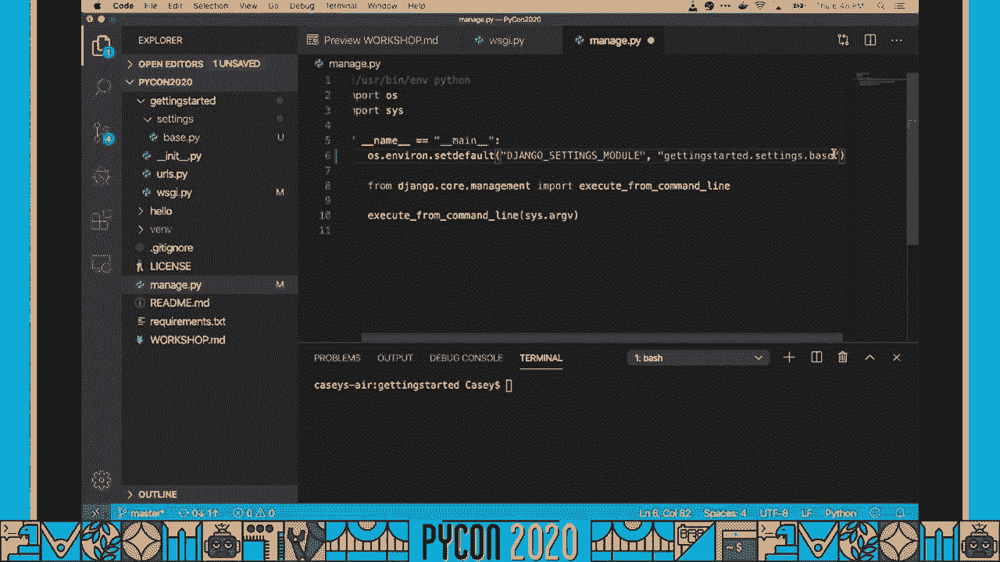
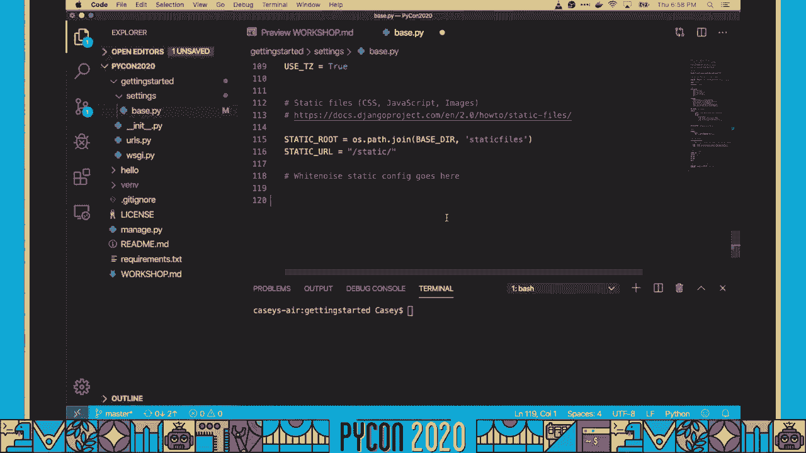
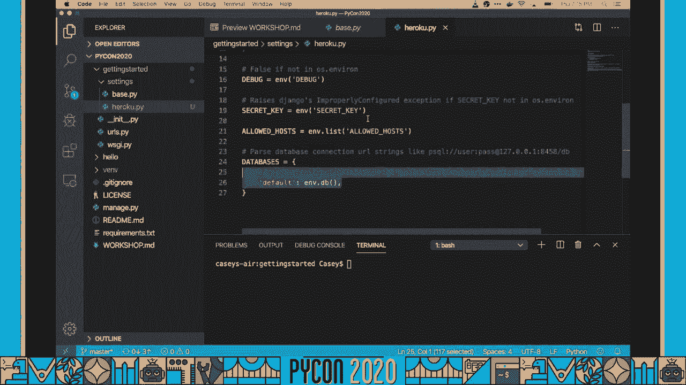
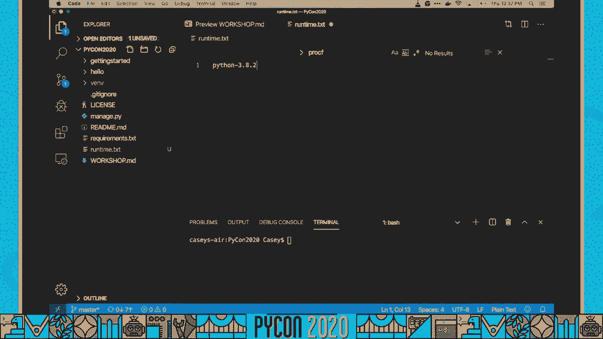
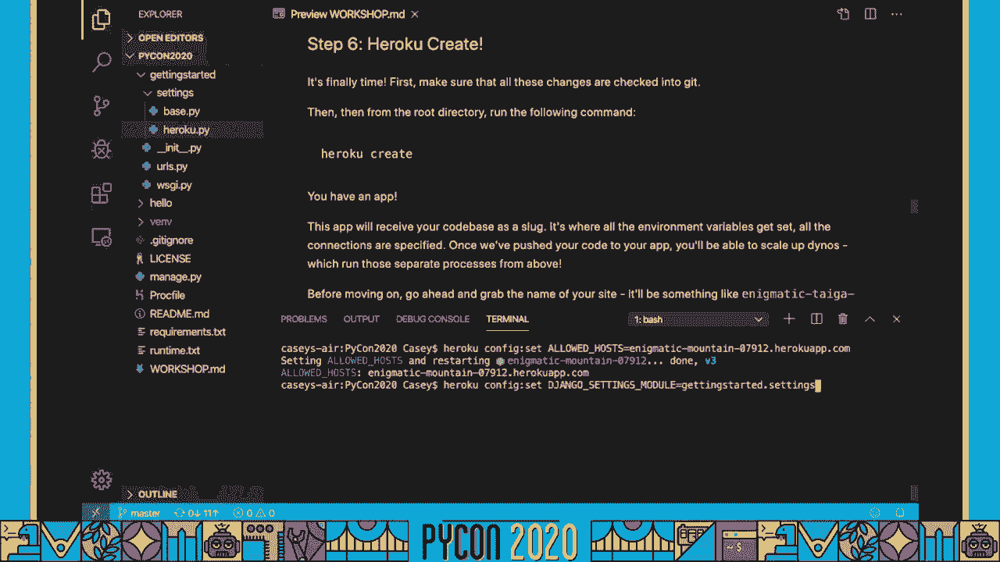
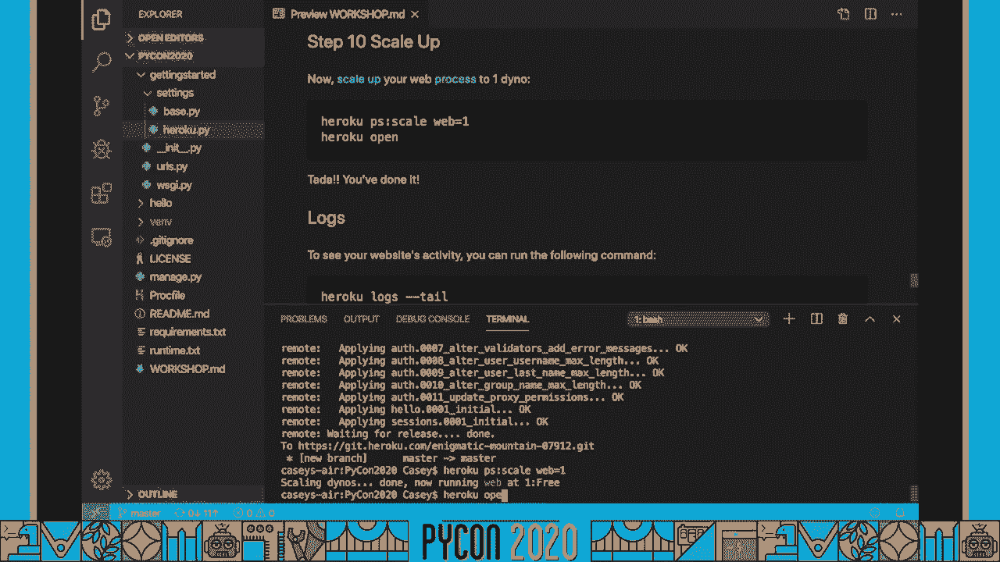
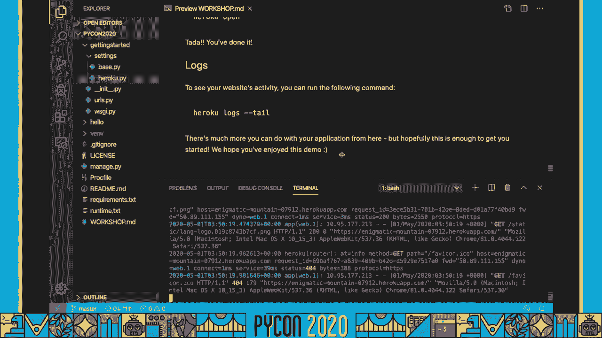
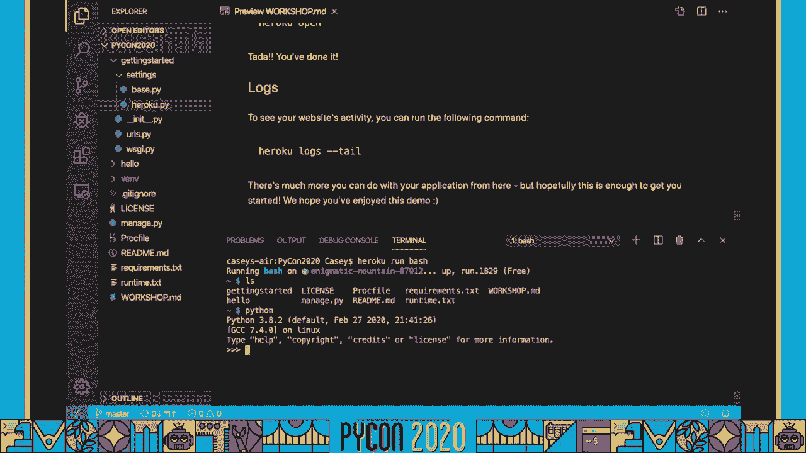

# Django部署到Heroku教程：P12：从项目到生产化部署 🚀


在本教程中，我们将学习如何将一个Django项目部署到Heroku平台，使其从本地开发环境转变为可公开访问的生产级应用。我们将遵循“十二要素应用”原则，并完成从环境配置到最终部署的完整流程。


---

## 准备工作 🛠️

在开始之前，请确保您已满足以下先决条件。这不是一个Django入门教程，我们假设您对Django有基本了解。

以下是完成本教程所需的准备工作：

1.  **注册Heroku账户**：访问Heroku官网注册一个免费账户，无需添加信用卡。
2.  **安装Heroku CLI**：在您的机器上下载并安装Heroku命令行工具。
3.  **获取项目代码**：克隆本教程提供的GitHub仓库，或使用您自己的Django项目。
4.  **准备开发环境**：确保您可以在文本编辑器或IDE中打开项目代码。

准备工作完成后，我们就可以开始了。

---

## 第一步：更新 `.gitignore` 文件 📁

首先，我们需要确保不会将敏感信息或不必要的文件提交到Git仓库。这通过配置 `.gitignore` 文件来实现。

以下是需要添加到项目根目录下 `.gitignore` 文件中的内容：

```
# Python virtual environment
venv/

# SQLite database files
*.sqlite3
*.db




# Django static files collected locally
staticfiles/
```

**操作说明**：
*   将上述文本复制到项目的 `.gitignore` 文件中。
*   注意不要复制额外的引号或换行符。
*   如果您本地使用了其他虚拟环境目录名（如 `.venv`），请相应修改。
*   务必**不要**忽略Django的迁移文件（`migrations/`），它们需要被提交。

完成编辑后，保存文件并提交更改到Git。

```bash
git add .gitignore
git commit -m “Update .gitignore for Heroku deployment”
```

**核心概念**：`.gitignore` 文件列出了Git不应跟踪的文件模式。这对于保护密钥和保持仓库清洁至关重要。

---



## 第二步：模块化Django设置 ⚙️

上一节我们配置了版本控制。本节中，我们将重构Django的设置，使其能适应不同环境（如开发、生产），这是实现持续交付的关键。

我们需要将单一的 `settings.py` 文件拆分为多个文件。


**操作步骤**：

1.  在您的Django项目目录（例如 `start/`）中，创建一个名为 `settings` 的新文件夹。
2.  将原有的 `settings.py` 文件移动到这个新文件夹中，并将其重命名为 `base.py`。这个文件将包含所有环境的通用设置。
3.  修复因移动文件而损坏的引用：
    *   在 `start/wsgi.py` 文件中，将 `‘start.settings’` 修改为 `‘start.settings.base’`。
    *   在 `manage.py` 文件中，进行同样的修改：`os.environ.setdefault(‘DJANGO_SETTINGS_MODULE’, ‘start.settings.base’)`。

完成修改后，保存并提交更改。

**核心概念**：通过将设置模块化，我们可以轻松地为开发、测试、预发布和生产环境创建不同的配置文件（如 `development.py`, `production.py`），只需从 `base.py` 继承并覆盖特定变量即可。

---



## 第三步：配置WhiteNoise处理静态文件 🗂️

Django在生产环境中不直接提供静态文件（如CSS、JavaScript）。我们将使用WhiteNoise中间件来高效地服务这些文件。


首先，安装WhiteNoise。将以下依赖添加到 `requirements.txt` 文件：

```
whitenoise==6.2.0
```

然后，我们需要在Django设置中配置WhiteNoise。

**操作步骤**：

1.  在 `settings/base.py` 文件中，找到 `MIDDLEWARE` 列表。将WhiteNoise的中间件添加到列表的第二个位置（紧接在安全中间件之后）。

    ```python
    MIDDLEWARE = [
        ‘django.middleware.security.SecurityMiddleware’,
        ‘whitenoise.middleware.WhiteNoiseMiddleware’, # 添加这一行
        # ... 其他中间件
    ]
    ```

2.  在 `settings/base.py` 文件的末尾，添加静态文件存储设置。

    ```python
    # Static files (CSS, JavaScript, Images)
    STATIC_URL = ‘static/’
    STATIC_ROOT = BASE_DIR / ‘staticfiles’
    STATICFILES_STORAGE = ‘whitenoise.storage.CompressedManifestStaticFilesStorage’
    ```

完成配置后，保存并提交更改。

**核心概念**：`WhiteNoise` 是一个用于Python Web应用的静态文件服务库，它简单、高效，并且与Heroku的短暂性文件系统兼容。`STATICFILES_STORAGE` 配置项启用了文件压缩和长效缓存，提升性能。

---



## 第四步：创建Heroku专用设置文件 🌍


现在，我们将为Heroku生产环境创建一个特定的设置文件。这个文件将从 `base.py` 继承，并覆盖生产环境所需的配置。

在 `settings/` 文件夹中创建一个新文件，命名为 `heroku.py`。

将以下内容复制到 `heroku.py` 文件中：

```python
import environ
from .base import *




env = environ.Env()

# 从环境变量中读取密钥，确保生产环境密钥安全
SECRET_KEY = env(‘SECRET_KEY’)

# 从环境变量读取允许的主机名
ALLOWED_HOSTS = env.list(‘ALLOWED_HOSTS’, default=[‘.herokuapp.com’])

# 配置数据库，自动解析Heroku的DATABASE_URL环境变量
DATABASES = {
    ‘default’: env.db(‘DATABASE_URL’)
}
```

**核心概念**：我们使用 `django-environ` 库来管理环境变量。`env.db()` 方法能自动将Heroku提供的 `DATABASE_URL` 字符串解析为Django数据库配置字典。这避免了在代码中硬编码敏感信息。

---

## 第五步：准备部署配置文件 📄

我们的应用几乎准备好了。要成功部署到Heroku，还需要三个关键文件：`requirements.txt`, `runtime.txt` 和 `Procfile`。



### 1. 完善 `requirements.txt`
此文件列出了项目的所有Python依赖。确保它包含以下包：


```
Django==4.0
gunicorn==20.1.0
whitenoise==6.2.0
psycopg2-binary==2.9.3
django-environ==0.9.0
```

*   `gunicorn`：是Heroku推荐的Python WSGI HTTP服务器，用于运行Django应用。
*   `psycopg2-binary`：是PostgreSQL数据库的适配器，Heroku使用PostgreSQL作为生产数据库。

**提示**：对于正式项目，建议使用 `pip freeze > requirements.txt` 来锁定所有依赖的确切版本，确保构建的可重复性。

### 2. 创建 `runtime.txt`
此文件指定Heroku使用的Python版本。在项目根目录创建该文件，内容如下：

```
python-3.10.4
```

请根据您的项目需求调整版本号。

### 3. 创建 `Procfile`
`Procfile` 告诉Heroku在启动容器时运行哪些命令。在项目根目录创建名为 `Procfile` 的文件（注意首字母大写），内容如下：

```
release: python manage.py migrate --noinput
web: gunicorn start.wsgi:application --bind 0.0.0.0:$PORT --access-logfile -
```

*   `release`: 在应用部署后、新版本启动前运行的命令。这里用于执行数据库迁移。
*   `web`: 定义主要的Web进程。它使用gunicorn启动Django应用，并绑定到Heroku动态分配的端口（`$PORT`）。

完成以上三个文件的创建和配置后，保存并提交所有更改到Git。

---



## 第六步：创建Heroku应用并配置环境变量 🔧

代码已准备就绪，现在我们需要在Heroku上创建应用实例并设置运行环境。


1.  **创建Heroku应用**：在项目根目录打开终端，运行以下命令。
    ```bash
    heroku create
    ```
    此命令会：
    *   在Heroku上创建一个新的应用（并生成一个唯一名称和URL，如 `https://神秘山-12345.herokuapp.com`）。
    *   为您的本地Git仓库添加一个名为 `heroku` 的远程地址。

2.  **设置环境变量**：我们需要将 `settings/heroku.py` 中使用的环境变量配置到Heroku应用中。
    *   **设置Django配置模块**：告诉Heroku使用我们创建的 `heroku` 设置。
        ```bash
        heroku config:set DJANGO_SETTINGS_MODULE=start.settings.heroku
        ```
    *   **设置允许的主机**：添加您的Heroku应用域名。
        ```bash
        heroku config:set ALLOWED_HOSTS=‘.herokuapp.com’
        ```
    *   **设置安全密钥**：生成一个全新的、复杂的密钥用于生产环境。
        ```bash
        heroku config:set SECRET_KEY=‘您生成的强随机字符串’
        ```
        **切勿**使用开发环境的密钥或将其提交到Git。

3.  **添加PostgreSQL数据库**：Heroku为应用提供托管数据库服务。
    ```bash
    heroku addons:create heroku-postgresql:hobby-dev
    ```
    此命令会创建一个免费层的PostgreSQL数据库，并自动将连接URL设置为 `DATABASE_URL` 环境变量，我们的 `django-environ` 配置会自动识别它。

---

## 第七步：部署到Heroku 🚀

这是最后一步，也是最简单的一步——将代码推送到Heroku。

1.  确保终端位于项目根目录，并且所有更改都已提交到Git。
2.  运行部署命令：
    ```bash
    git push heroku main
    ```
    （如果您的主分支名为 `master`，请使用 `git push heroku master`）

    您将在终端看到详细的构建日志，Heroku会自动安装依赖、执行 `Procfile` 中的 `release` 命令（运行迁移）。

3.  **启动Web Dyno**：免费套餐下，Web进程默认是关闭的。需要手动启动一个。
    ```bash
    heroku ps:scale web=1
    ```




部署完成后，使用以下命令打开您的应用：
```bash
heroku open
```

恭喜！您的Django应用现在已经运行在互联网上了。


---

## 故障排除与日志查看 🔍



如果部署或访问遇到问题，可以按以下步骤排查：


1.  **检查构建日志**：部署时的错误信息会直接显示在终端。仔细阅读。
2.  **查看运行日志**：
    ```bash
    heroku logs --tail
    ```
    此命令会实时显示应用日志，包括所有HTTP请求和错误信息，是调试的主要工具。
3.  **运行一次性管理命令**：您可以在Heroku环境中执行命令，例如检查文件或启动Python Shell。
    ```bash
    heroku run bash  # 启动一个Bash shell
    heroku run python manage.py check  # 执行Django检查命令
    ```
4.  **验证配置**：确保所有环境变量已正确设置。
    ```bash
    heroku config
    ```

---



## 总结 📝

在本教程中，我们一起完成了一个Django应用从本地项目到Heroku生产化部署的全过程。我们主要学习了：

1.  使用 `.gitignore` 保护敏感信息。
2.  模块化Django设置以支持多环境。
3.  集成WhiteNoise来高效处理静态文件。
4.  使用 `django-environ` 安全地管理环境变量。
5.  准备 `requirements.txt`、`runtime.txt` 和 `Procfile` 这三个Heroku部署的关键文件。
6.  通过Heroku CLI创建应用、配置环境变量、附加数据库。
7.  使用 `git push` 完成最终部署，并学习如何查看日志和进行基本故障排除。


遵循“十二要素应用”的方法，不仅让部署到Heroku变得顺畅，也使您的应用更具可移植性、可扩展性和可维护性。祝您编码愉快！