# P13：赞助商研讨会 Jason Lantz - Salesforce Python 如何推动 Salesforce.org 的独特模式 - 程序员百科书 - BV1rW4y1v7YG

大家好，感谢观看。

我是 Jason Lance。我是 Salesforce.org 的高级发布工程总监。我非常兴奋能在 PyCon 的背景下与大家讨论 Python 如何推动 Salesforce.org 独特的开源模式，以及你如何能够使用我们构建的一些 Python 工具来为自己的 Python 网络应用程序项目构建与 Salesforce 的集成。

在我们开始之前，先来个法律免责声明，我们将谈论一些前瞻性的内容。不要根据这些前瞻性内容做出任何投资决策。请仅根据当前市场上的可用信息做出投资决策。好了，废话不多说，让我们快速了解一下议程。

我们将对我自己、Salesforce 和 Salesforce.org 进行一些简单介绍。然后我们将讨论 Salesforce.org 的开源项目。接着，我们将查看我们在 Salesforce.org 建立并作为开源提供的主要 Python 工具框架。之后我们将进入本次会议的主要内容。

我们将进行三个逐步构建的演示。在第一个演示中，我们将展示如何使用 Cumulus 和 CI 创建一个新的 Salesforce 开发项目。然后在第二个演示中，我们将展示在 Cumulus 和 CI 上使用 Python 构建的三个网络应用程序，它们是 Meteko、Metacai 和 Metadploy。最后，在最后一个演示中。

我们将把所有内容结合在一起，展示如何作为 Python 开发者将 Python 网络应用程序与 Salesforce 集成。你为什么想要这样做？Salesforce 有大量用户，能够将你的应用程序与 Salesforce 集成，同时仍然使用 Python 开发应用程序，这将为你的项目增添价值。

用户。这可能为你打开一个全新的用户群，并为那些使用 Salesforce 的用户增加很多价值。让我们从介绍开始。我是谁？我为什么在这里？

除了明显的哲学问题之外，我们直接进入我为什么会出现在 Python 的背景下。我最开始的职业是 Unix 管理员，但很快意识到我并不是一个很好的管理员，因此开始深入开源项目，并真正发现我喜欢构建事物。

我非常喜欢原型设计。大约在 2003 年，我发现了一个刚刚起步的新 Python 项目，叫做 Plone，当时还在第一个版本。我开始在 Plone 中玩耍，真的爱上了这个内容管理系统。这激励我想要学习 Python。作为一个没有计算机科学或编程背景的人，Python 对我来说是一个非常合适的选择。它看起来非常优雅。那些项目似乎写得非常好。我从 Python 中学到了我所知道的编程知识。

非常兴奋有机会在 Python 会议上演讲。大约在 2008 年，我从构建企业网页应用程序转向为非营利组织工作。在那段时间，我为纽约市的两个了不起的非营利组织工作。然后我在 2013 年获得了加入 Salesforce.org 的机会。

这实际上是一个机会，而不是仅仅为单一非营利组织工作，以最大化我在世界上创造影响的能力，通过应用我的技术技能来帮助成千上万的非营利和现在的教育组织，它们正在使用 Salesforce 进行日常工作。我在 Salesforce.org 的工作重点是让 DevOps 对 Salesforce 社区变得更容易。

我认为我在 Python 方面的背景，尤其是在 Python 开源项目和 Python 内容管理系统及网页项目方面，真的帮助我思考 DevOps，并为 Salesforce 社区带来了不同的 DevOps 视角。我认为这实际上让我能够创造出很多我在那段时间所能创造的东西。如果你之前没有听说过 Salesforce。

Salesforce 是一个客户关系管理解决方案，将公司和客户联系在一起。这是一个集成的 CRM 平台，为所有部门，包括市场营销、销售、商务和服务，提供每个客户的单一共享视图。我们将公司和客户结合在一起，以提供客户所期望的个性化体验。

Salesforce 相信什么？这对我来说真的很重要，这也是我在这里的原因。我们的核心价值观帮助我们将 Salesforce 打造为变革的平台。你会在右侧看到我们的核心价值观：信任、客户成功、创新和平等。

这些是我们的核心价值观。这是我们核心价值观的排名顺序。这远不止是张贴在办公室某处的牌匾。在我多年的工作中，我看到公司利用这些核心价值观来指导决策，以便我们能够专注于为客户做正确的事，以及为世界做正确的事。

IWork@Salesforce.org 和 Salesforce.org 是 Salesforce 内部的一个业务单位。我们是 Salesforce 的社会影响中心。因此，我们相信商业的目的应该是改善世界的状态。我们提供强大技术的访问，赋予变革者构建更美好世界的能力。我们是一个独特的业务单位，致力于为非营利和教育领域创造解决方案。

我们与慈善组织合作，使其能够产生更大的影响。我所在的产品开发团队的一个核心部分是为非营利和教育组织提供免费和额外许可的折扣许可证。

我们在全球范围内有非营利和教育组织使用 Salesforce，利用这些补助。例如，在美国，几乎任何 501(c)(3)非营利组织，无论大小，都可以获得 10 个免费的企业版 Salesforce 许可证。对于小型组织来说，这实际上代表了绝大多数非营利组织。

使用我们的组织，他们不需要支付费用。可以在他们拥有的 10 个免费许可证内进行工作。我认为这是我们为这个平台的世界提供的一个惊人福利，平台是为了满足企业及其市场和销售需求而构建的，能够利用所有这些投资和创新来服务这个社区。

我们服务的变革者。截至目前，我们在全球拥有超过 44,000 个非营利和教育组织，正在通过 Salesforce.org 使用 Salesforce。我们在构建能够将 Salesforce 客户 360 适应非营利或教育组织需求的产品上投入了大量资金。因此，我们将客户关系管理转变为利益相关者关系管理。

让我们聊聊 Salesforce.org 的开源。当你想到 Salesforce.org 的开源时，我想谈谈并涵盖三种主要类型的开源。首先，我们有开源产品。我认为这正是我们独特开源模式的所在。

我们拥有开源产品，以为非营利和教育领域提供一个共同的可信平台。Salesforce.org、我们的合作伙伴和客户在这些产品上构建解决方案。我们还开发了工具，以解决我们在 Salesforce 平台开发项目中面临的共同 DevOps 需求和挑战。

我们将这些工具作为开源提供给整个 Salesforce 社区。这些工具都是用 Python 编写的，而基于 Web 的工具则使用 Django，并在 Heroku 上运行。今天我们将会深入探讨这些工具，但这些工具的原因除了支持我们的产品之外。

但我的心真正归属在支持我们的社区上。我们建立了这个惊人的，或者说社区发展成为了一个令人惊叹的开源社区，我们尽可能以各种方式帮助促进。我们最新的做法是 Salesforce.org 的开源公共平台。

我们全年举办社区冲刺活动，将客户、合作伙伴和员工聚集在一起，构建专注于改善世界的开源解决方案，让非营利和教育组织更容易实现其使命。Salesforce.org 的开源公共平台还帮助孵化可持续的开源项目。

利用 Salesforce.org 的专业知识、访问和工具来惠及这些项目。我们会更详细地讨论每一个。让我们深入了解开源产品。当我说我们在 Salesforce.org 有独特的开源模型时，我认为这在某种程度上代表了它。在左侧的金字塔中，左侧的箭头。

你可以看到，对于开发者来说，最初在这个金字塔的底部是更简单的。你编写一些代码，放入 GitHub 库中，没有文档，没有打包。不要考虑任何事情，只需将提交推送到库中。将你的代码推向世界是非常简单的。

但正如你在右侧的第一根箭头所看到的，这对用户来说并不容易。实际上，这对用户来说是最难使用的。因此，如果你想吸引应用程序的用户，必须有比“梦想之田”更多的东西，实际上让人们参与其中，你需要开始真正专注于。

构建文档，创建产品的发行版，创建可安装的产品包，可能创建一些预配置的模板，以便客户可以从中开始，然后构建自己的实现。挑战在于最终用户的整体维护。他们必须不断地升级并将自己的更改与新版本整合。

在这个金字塔的顶端，实际上是我们针对开源模型的目标，提供预配置、完全托管的软件实例，并定期进行自动升级。我们每两周推出所有产品的新版本，并将其升级到所有现有客户。因此，使用我们的组织超过 44,000 个。

我们之所以能够做到这一点，是因为我们拥有独特的开源产品与企业慈善的结合。企业慈善为我们的开源模式提供了基础平台。然后，我们创新并提供这些产品，推向全球。对于那些不支付任何费用的小型非营利组织来说，他们生活在。

在这个三角形的顶端，获得两全其美的托管和开源产品开发，以及围绕它的开源社区。现在最右边的箭头，你可以看到，这使得大规模开发者更容易。随着客户或开源项目用户的增加，支持的扩展是一个挑战。通过这些预配置的托管实例，所有实例都会始终更新，以确保每个人都在使用最新版本。

在最新版本的支持下，我们能够扩展开发工作，为世界创造巨大的影响。据我所知，我认为世界上没有另一个开源项目能够真正做到将企业慈善与企业级托管相结合。

开源项目的类平台。我认为这是一个非常独特的模式，我对此非常兴奋。我们在 Salesforce.org 的开源产品分为两个主要云：非营利云和教育云。在非营利云中，我们有三个开源产品。

非营利成功包（NPSP）为非营利组织的数据追踪需求提供了基础，比如管理与利益相关者、家庭和筹款工作的关系与关联。我们的最新开源项目是刚刚启动的项目管理模块。

大约两周前，项目管理模块提供了一种数据架构，为非营利组织追踪其项目工作提供了通用数据架构。例如，对于食品银行，提供的餐数；对于宠物救助组织，拯救的小狗数。最后，Salesforce 的志愿者是我们另一个开源项目。

非营利云和 Salesforce 的志愿者帮助全球数千个非营利组织追踪和管理他们的志愿者工作。在教育方面，像 NPSP 一样，我们有教育数据架构（EDA），为构建教育应用程序提供了一个通用框架。

有很多不同的应用程序是建立在 EDA 之上的，既有我们的合作伙伴，也有我们自己。EDA 提供了，例如，跟踪学期和课程设置、课程注册的对象。以及构建任何类型解决方案所需的基本数据结构。它是开源的，也是教育领域值得信赖的平台。

特别是那些在 Salesforce 上运行的组织。我们还构建了 K12 架构工具包，扩展了 EDA 并添加了在教育背景下 K12 用例的重要额外架构元素。这是我们提供的五个主要开源托管包产品。

这个独特的开源模型结合了企业慈善。现在让我们谈谈我们的开源工具。我们开源工具的主要部分，如我之前提到的，是 Cumulus CI，这是一个用于 Salesforce 项目的便携式自动化 Python 框架。它旨在解决 Salesforce 开发项目独特的 DevOps 需求。

这是 Salesforce.org 产品开发团队每天使用的工具。我不仅仅指开发人员，我还指我们的质量工程师、文档编写人员、用户体验人员和项目经理，甚至我们的合作伙伴在进行实施或使用这个工具。它在 SFDO tooling/Cumulus CI 的公共 GitHub 仓库中开发。

而且就在三月份，我非常自豪的是，我们花了很长时间尝试整理一个学习模块，以教授 Cumulus CI 及其工作方式。因此，如果你对今天的任何演示内容感兴趣，我强烈建议你去浏览这个学习路径。Trailhead 是 Salesforce 的免费在线学习系统。

所以你可以去学习 Salesforce 平台，但还有大量关于敏捷流程等方面的额外学习内容。而且它确实有很多精彩的内容，全部免费提供。除了 Cumulus CI 这个框架，我们还构建了三个不同的 Web 应用。

这些项目使用 Django 和 Heroku，建立在 Cumulus CI 之上，扩展了自动化。在我们称之为便携式自动化的背景下，我稍后会详细解释。第一个这样的 Web 应用是 MetaCI，它是一个自定义 CI 应用，运行在 Heroku 上，支持使用 Cumulus CI 的 Salesforce 项目的可扩展持续集成。

我们构建自定义 CI 应用的原因是 Salesforce 开发项目的需求与大多数开发项目相比有些独特，在这些项目中，你可以在虚拟机或 Docker 容器中运行代码。我们的构建实际上是更多客户端 API，正在将东西安装到 Salesforce 实例中。

正因为这个差异，我们发现为这种用例专门构建一个量身定制的 CI 系统是合理的。我们仍然使用其他 CI 系统来构建我们的 Python 项目，因为它们很多。但 Salesforce DevOps 领域的独特性使得构建我们自己的 CI 系统是合理的。Meta deploy 是一个面向客户的安装程序和自动化工具，提供自带工具的选项。

通过简单的 Web 界面访问项目的 Cumulus CI 自动化。当我在 Salesforce 世界中提到“组织”时，就是指实例或 Salesforce 平台上的租户。因此，每个客户都有他们的 Salesforce 组织，通常是一个生产组织，此外还有沙箱。

我们今天的演示将讨论其他类型的组织。但 Meta 部署的关键在于客户能够带入自己的 Salesforce 实例，并将我们的产品安装到其中，以及安装和配置所需的所有自动化。然后是最新的工具。

我对此感到非常兴奋，我们已经为此工作了将近一年。因此，我们一直在进行某种试点测试。这个工具被称为 Meteko。Meteko 旨在赋能 Salesforce 管理员通过点击而非代码参与开源项目，而无需了解 Cumulus CI、GitHub 或 Python。

通过简单的网页界面，贡献于 GitHub 上的项目。利用他们通过 Salesforce 网页界面构建的声明性配置的技能，但与基于版本控制的开发相结合，获得最佳的组合。我们将在第二个演示中查看所有这些应用程序。

让我们谈谈我们的开源社区。在非营利和教育领域。如果你曾有机会与任何非营利或教育组织合作，你会发现他们有一种内在的分享欲望。食品银行之间并不竞争。

一个县的食品银行并不与下一个县的食品银行竞争。他们只想让人们得到食物。宠物救助组织之间也不竞争。他们希望宠物能找到好的家庭。但真正的挑战是如何分享这些技术解决方案，这些解决方案对于投资于构建它们的组织具有很大的价值。

但你如何与行业内的其他人分享这些解决方案呢？

我们的解决方案是创建我们称之为 Salesforce.org 开源公共社区。开源公共社区有两个主要组成部分。首先，正如我之前提到的，我们举办这些开源社区冲刺。现在在 Salesforce.org 世界中有开源社区冲刺。

在我们拥有开源社区之前，这背后有着很长的历史。实际上，NPSP，我们最大的开源项目，有成千上万的用户，最初是一个由社区创建的开源项目，我们开始与社区合作，并投入真正的资源来发展和完善该系统。

因此，这些开源社区冲刺是为期两天的面对面活动，现在在 COVID-19 的背景下是虚拟活动。我们刚刚举行了第一次开源社区冲刺。原本计划在四月初在亚特兰大进行面对面活动，但我们不得不取消并转为虚拟活动。

我们的虚拟活动有超过一百名与会者，持续两天，构建了一些非常惊人的解决方案。看到房间里迸发的能量真的很棒，这也证明了我们社区内部存在的热情。项目分为技术性和非技术性，因此人们希望在 Salesforce 平台上构建可以发布的解决方案。

作为一个包，其他人可以在他们的实例下安装。还有一些人创建文档或视频，或者其他方式来帮助人们。所有这些想法其实都是从一种非常非正式的会议配置中开始的，人们进行头脑风暴并宣布他们的想法。

对这些感兴趣的人会在房间周围的不同圆桌上聚集，或在虚拟活动的不同分组房间中。所有这些项目都是通过技术和非技术的方式在 GitHub 上开发的，存在于 SFDO 社区冲刺的 GitHub 组织中。

现在开源共享的第二部分是支持社区运营的可持续开源项目的程序。我们提供过程和基础设施来促进这些社区运营的开源项目，特别是针对非营利和教育领域。这些项目必须满足可持续性要求才能被接受，因此不仅仅是某人构建了一些酷东西。

这里有一组致力于维护项目的人，他们定期会议以创建新特性可用时的版本，审查 GitHub 存储库中的拉取请求。所有被接受的项目随后会被移动到我们的 GitHub 组织 SFDO 社区，这是官方开源共享项目的组织。

org 为这些开源社区项目提供所有工具，包括 meta CI、meta deploy 和 meta go，以便他们能够管理打包和测试，并在规模上以最小的投资或参与。我们真的希望尽可能降低社区项目的门槛。

背后有一个社区，但可能只是不知道如何做所有这些事情，或者有些事情在没有这些工具的情况下确实耗时。因此，我们不希望这成为共享的障碍。最后，我们还促进对这些包进行 Salesforce ISV 安全审核。

来自这些项目并将这些包发布到 Salesforce 社区。我们谈到了这种独特的开源模型，我看到这一切是通过开源共享和潜在利用这一整个创新者社区，我们真的在它之上有了一个新层次。这一层通过赋能社区驱动的开源解决方案实现了指数级的影响。

以及特定领域的挑战。这远远超出了我们团队的工程能力，无论我们将团队发展到多大，都无法与我们的社区在赋能他们时所能做的相匹配。好的，让我们换个话题，稍微谈谈技术方面，让我们讨论 Cumulus CI，因为这是核心框架，我们将持续关注它。

今天的演示。当您想到 Salesforce 的 DevOps 时，我真的认为有一个主要挑战，这是一个常见的 DevOps 挑战，即获取环境。但 Salesforce 中的挑战与大多数其他 DevOps 环境略有不同，因为您无法在虚拟机或 Docker 镜像中运行我们的任何代码。

您的 Salesforce 代码或元数据（在 Salesforce 领域称为元数据）必须部署到运行在云中的 Salesforce 实例或组织中。您知道很久以前 Salesforce 提供了开发者版或开发者组织，任何人都可以填写网页表单以获取开发者版。

组织是一个持久的组织，您可以将元数据部署到其中，可以在其中创建数据，它总是存在。但正如我们从一般的 DevOps 最佳实践中所知，始终存在的测试环境或开发环境并不是一个好主意。更好的做法是能够轻松创建和销毁它们。

几年前，Salesforce DX 或 Salesforce 开发者体验是 Salesforce 启动的一个项目，创建了一个命令行界面 Salesforce CLI，其命令为 SFDX。稍后我们将在这里看到它。它通过引入临时的 scratch orgs 改进了整个过程，这些 scratch org 是您可以通过 API 调用配置和销毁的临时 Salesforce 实例。

关于 scratch orgs 的一点是，它们从一种 org 形状开始，这是一种 JSON 文件，您可以在其中定义 Salesforce 版、功能和您希望在 Salesforce 组织中拥有的设置。但这并没有真正设置任何项目特定的内容，仅仅是定义基础 Salesforce 系统中哪些功能是启用的。Salesforce 还提供了一个用于自定义开发的平台。

我们专注于在 Salesforce 建立的基础上构建自定义解决方案。为了做到这一点，您真的需要能够自动化构建可用于开发和 QA 的 scratch org 环境。这需要安装其他软件包，将元数据部署到您的实例中。

加载数据，这样当测试人员从功能分支获取环境时，他们通过运行自动化得到的环境实际上是完全准备好的，以便开始测试。这正是 Cumulus CI 构建的核心挑战，为每个项目提供一个高度可配置的框架，以协调所有这些变化。

让我们快速看看 Cumulus CI 的结构及其设置。有四个主要部分，Cumulus CI 是我们构建的一个 Python 包。它可以在 PyPy 上获取，你可以通过 `pip install Cumulus CI` 安装。Cumulus CI 的第一个组件是 Cumulus CI.yaml 文件。

Cumulus CI 是一个非常依赖配置的框架，所有配置通过这个 Cumulus CI.yaml 文件进行映射。基础的 Cumulus CI.yaml 文件构成我们所称的全局配置，并包含我们在大多数项目中发现的所有最佳实践默认值。

第二个组件是 Cumulus CI 的钥匙链，即其凭证存储。它存储凭证、持久 Salesforce 组织的 OAuth 连接，并具备与 Salesforce DX 交互的能力，以创建和删除临时组织。

GitHub API 是你在为项目编写自动化时可能需要的。Cumulus CI 的第三部分是任务。任务实际上是 Cumulus CI 所做工作的主要部分。我们有很多不同的任务，你可以在这里看到，涵盖了开发过程中我们认为有用的各种事项。

任务是 Cumulus CI 自动化中的基本工作单位。任务之上是流程。流程是最终简化为任务的序列。流程可以调用其他流程，但最终都会减少为一个顺序的任务列表。Cumulus CI 默认随附许多我们认为有用的流程。

几乎在任何 Salesforce 开发项目中都可以使用。因此，像开发工作流和 QA 组织流这样的流程，分别可以让你获得一个完全配置好的临时组织，准备开始开发工作，或者一个完全配置好的临时组织，准备开始 QA 工作。还有用于测试管理版本的流程。如果你在构建一个管理包，我们稍后会谈到这个。

为构建客户环境的发布侧提供一些流程，类似于 CI 特性，这是一个用于测试功能分支的流程。还有用于自动化发布管理过程的流程，以创建新的测试版本或新版本包。作为一个基于配置的系统。

Cumulus CI 中的所有任务都在 cumulus CI.yaml 文件的全局配置文件中定义。这里是一个关于部署元数据的部署任务的示例。你可以看到，它将任务特定选项路径默认为名为 SRC 的目录。所有这些任务可以定义自己的自定义任务选项。

所以我们努力使其成为一个非常声明式驱动的系统。使用 Cumulus CI 的大多数人对 Python 一无所知。但他们可以通过修改这些 YAML 或 YAML 语法来大量自定义 Cumulus CI 的工作方式。关于这个 YAML 语法中的选项，另一件重要的事情是我们喜欢。

将所有选项整合到项目的配置中。因此，当你运行不同的自动化时，就不必记住一堆命令行标志。同样，流程是在 YAML 中定义的。流程定义非常简单。它只是带有编号插槽的步骤。

流程可以调用其他流程或任务。因此，在这种情况下，为了设置开发工作，我们必须运行依赖流程，运行部署、未管理流程，这将获得我们项目的源代码进行部署，然后运行 config_dev 流程，为我们的开发环境配置。

然后最后调用任务快照更改，以重置源跟踪，以便我们能够跟踪从那时起我们所做的所有事情。显然，每个项目对于什么是开发工作或 QA 工作都有不同的需求。这就是 Cumulus CI 项目配置的作用。

在 GitHub 项目存储库中，还有一个 cumulus CI.yaml 文件。该文件会被解析为一个字典，然后我们在 Cumulus CI 的全局配置上进行字典合并。因此，项目中的 cumulus CI.yaml 文件中唯一包含的是对全局配置的覆盖和扩展。

所以你可能有新编写的自定义任务。你可能有新编写的自定义流程。你可能有需要定义到你项目中的依赖关系。这看起来可能像是，举例来说，这是一个来自非营利组织的示例。

成功包存储库展示了 NPSP 如何修改配置开发流程，正如我们刚刚看到的，从主页呈现时，这是一个很好的流程。这个配置开发流程在 Cumulus CI 的开发工作流第三步中运行。因此，这个配置开发流程在 Cumulus CI 的全局配置中通常只有一个。

它通常只有两个步骤。所以在这种情况下，这个项目在流程的末尾添加了三个额外的步骤。因此，每个开发工作将自动运行这些步骤。因此，项目对 Cumulus CI 默认配置的覆盖实际上是。

当我们谈论 cumulus CI 的可移植自动化时，我们指的是项目中所有自动化需求的抽象定义。在此基础上，我们构建了客户端应用程序，如 CCI，我们的命令行接口，用于访问运行任务、执行流程、创建临时工作。我们的 Web 应用程序也是该框架的客户端。

它们是为每个单独项目定义的可移植自动化的客户端。因此，Metacie 使用 cumulus CIAM 文件中定义的项目可移植自动化来运行流程、构建，这些可以由 GitHub web hooks 触发或由用户手动触发。类似地，Metadploy 只是针对客户组织运行 cumulus CI 任务。

他们通过 OAuth 授予了访问权限。这使我们能够真正为所有潜在的自动化用户提供服务。因此，自动化并不仅仅是为您的 Jenkins 系统而设。它是开发人员需要在本地运行的东西，或 QA 人员需要在本地运行的东西，或文档撰写者、产品经理、实施合作伙伴，最终甚至是。

您的客户。因此，这就是 cumulus CI 的一般介绍。我想花一点时间提到一些我们在 cumulus CI 中使用的 Python 项目。我考虑了很久，思考如何回答“为什么我们构建 cumulus CI 用 Python”这个问题。老实说。

这其中确实有个人偏见的因素。我来自 Python 背景。这是我熟悉的内容，使用它启动这个项目很简单。但除此之外，cumulus CI 还利用了 Python 社区中许多优秀的特性。因此，我们使用像 click 这样的应用程序来构建 CCI，即命令行接口。

我们使用 Faker 来生成测试数据。我们使用 GitHub 3.py 与 GitHub API 进行交互。我们使用 GINDA2 来模板化配置文件。请求框架显然被大量使用，因为我们进行许多不同的 API 调用。我们使用 robot framework 和 robot framework Selenium 库来构建一个真正的。

针对自我开发项目的丰富 Selenium 测试框架。我们为 robot framework 构建了一个附加库，提供了一系列关键词，用于驱动用户界面并与 Salesforce 实例的 API 进行交互。还有与 Salesforce 批量 API 交互的 Salesforce 批量库，用于查询。

插入、更新和删除记录。我们使用 Sarge 进行子进程调用。我们使用 simple Salesforce 与 Salesforce REST API 进行交互，并使用 SQL alchemy 来捕获和加载数据集进出 Salesforce 组织。现在，回馈整个社区，我想简要介绍一下。

我们最新的开源工具叫做 Snowfakery。与我们谈论的其他所有东西不同，Snowfakery 是一个你可以立即使用的工具。你根本不需要使用 Salesforce 就可以使用 Snowfakery。Snowfakery 是一个用于生成虚假关系数据的声明性框架。

它具有对 faker 的插件。你可以在其中编写各种客户例程，随机生成数据等等。你可以用它生成小型数据集。你可以描述一个数据集的形状，然后说，给我一百万条记录。所以你可以生成大量数据，它直接写入关系数据库。

因为在后端它使用 SQLAlchemy。所以它应该与任何 SQLAlchemy 能够处理的东西一起工作。我们已经在内部使用 SQLite 和 PostgreSQL 进行了测试。如果你正在使用 Humilis CI 并进行 Salesforce 开发项目，Snowfakery。

Cumilis CI 的批量 API 任务可以与之连接，以便填充 Salesforce 组织。生成的数据来自这些定义文件。听起来对你很有趣。一定要去查看 SFDO 工具库，Snowfakery。里面有很棒的文档和示例，可以展示所有内容。

这个框架的强大之处。现在让我们进入演示部分。这是我最兴奋的部分，亲自体验这个工具并向你展示你可以做什么。好的，在我们的第一个演示中，我们将展示如何使用 Cumilis CI 开始 Salesforce 开发项目。作为 Python 开发人员，你为什么想这样做呢？

主要有两个原因。首先，我们用 Python 构建了所有这些东西，真是很酷。但是假设你是一名 Python 网络应用程序开发人员，你构建了一个收集用户信息的网络应用程序，而你的用户可能是使用 Salesforce 作为其 CRM 系统的组织或公司。你开始接到请求，将你的应用程序中的数据与 Salesforce 集成。

如果你要从你的应用程序集成数据，可能会有一些特定的架构。我们将在这里详细讨论架构。如果你想将这些数据与 Salesforce 集成，你需要在 Salesforce 中创建架构。所以这前两部分实际上是为了展示这两个演示。

你将如何创建架构，打包并让客户可以安装到他们的 Salesforce 实例中，以便为你的集成建立管道。在第三个演示中，我们将看看实际构建这样的集成作为示例。所以在第一个演示中，我们将开始一个项目，仅仅是为了展示它的内容。

我喜欢与 Kimul C。I。进行开发。

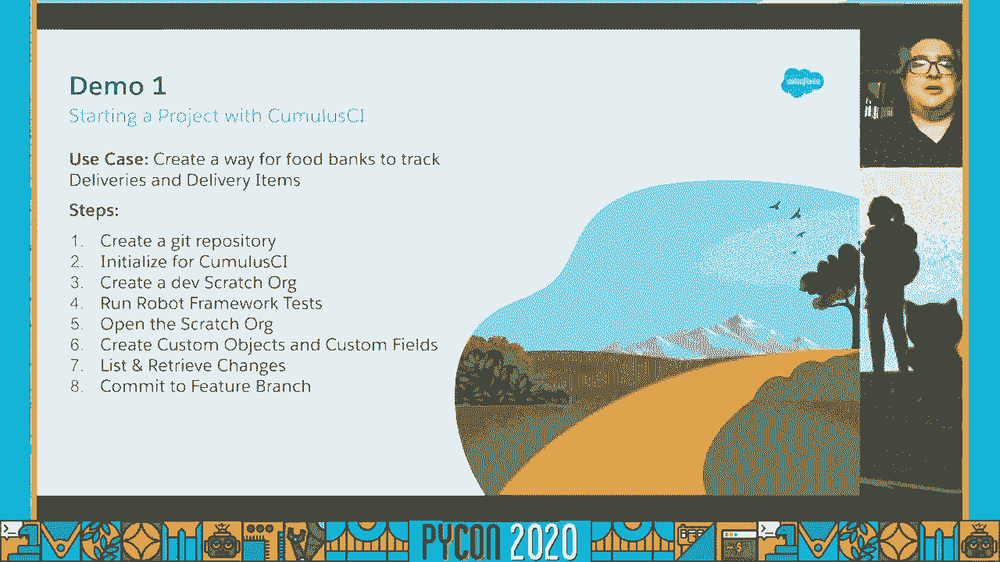

我将跳转到 Visual Studio Code。我已经安装了 Kimul C.I. 的命令行界面。这里还有其他工具的设置，特别是配置了 SFDX，也就是 Salesforce CLI。在我们的 Kimul C.I. Trailhead 课程中。

第二个模块介绍了所有的设置说明，如果你想在自己的电脑上实际执行这些操作。首先，我将创建一个名为 PyCon demo 的目录。我将进入该目录，然后初始化为 Git 仓库。

Kimul C.I. 旨在在 Git 仓库内工作。接下来我要运行这个命令：`CCI project init`，它将初始化我的项目。我将提供一些基本值，比如项目名称和在 Salesforce 组织中显示的包名称。

我将继续表示我希望将这个项目制作成管理包。Salesforce 中的管理包有一个全球唯一的命名空间分配给它们。每个人都可以创建一个 Salesforce 开发者版本的组织并去预留其中一个命名空间。那就是你的命名空间。这个组织本质上成为打包组织，你可以上传打包版本。

无论你构建了什么自定义内容。我将使用最新的 Salesforce API 版本。我们有两种不同的源格式选项。我将使用 SFDX 源格式，这是较新的源格式，更易于使用。在这种情况下，我们正在构建一个独立项目。但我之前提到的，key millisci 项目可以定义依赖关系。

比如说你想在 NPSP 或 EDA 上构建一些东西，我们的教育和非营利开源项目。你可以在这里简单地回答“是”，然后它会给你一个选项菜单，你可以告诉它我希望在所有环境中自动安装 NPSP。在 Python 世界中，使用 PIP 这非常简单。

在 Salesforce 世界中，这更具挑战性，也是 key millisci 希望解决的独特功能之一。我将接受项目的默认分支和标签命名约定。当我完成后，继续将这个项目添加到我的工作区。好的，我在工作区中添加了这个项目，并为我创建了许多骨架。

我们要查看的第一件事是 key millisci yaml。你可以看到它只有 20 行代码或配置，因为它继承了 key millisci 的全局配置的所有内容。所以 key millisci 全局配置中可用的所有任务。

我将输入命令 rate。然后命令行上的 key millisci 任务列表将列出所有可用的不同任务。你可以看到，有很多任务按与 GitHub 的交互、数据操作、与 Salesforce DX 的交互以及一系列 Salesforce 特定的自动化、集成和打包等分组。在这个列表中，有很多已经可用。

此外，我还有所有在 key millisci 的全局配置中的流程，包括 dev org 和 QA org 流程。我可以通过使用 CCI flow info dev 获取 dev org 流程的信息。这将向我展示依赖流程，以及其中包含的任务。所以我们将安装依赖项，然后部署包源代码。

你会注意到这些是 GINDA2 风格的 GINDA2 表达式，用于在流程中创建条件步骤。然后运行配置 dev 流程。现在 key millisci 为我提供的最后一件事是五种不同类型临时组织的默认设置。不同类型组织的配置，在开发过程中我们发现很有帮助。这些是懒惰配置，所以它们被灰显，因为它们还没有被唤醒。

你必须对它们运行某些东西以唤醒它们。所以让我们继续对它们运行一些东西。我们将针对名为 dev 的组织配置运行开发组织流程。

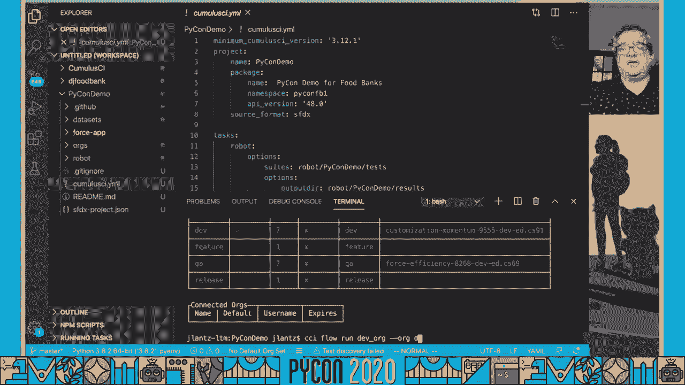

这将启动，当这完成时，我将拥有一个完全配置的项目开发环境。现在这个命令，CCI flow run dev org minus minus org dev。是你在任何 QMLCI 项目中获取 dev org 时运行的完全相同的命令。这个项目的工作是扩展和重写在 QMLCI YAML 中需要的任何内容。

为了将其变成可用的开发环境。但这让跨多个不同项目的用户保持一致性变得非常简单。所以你只需要记住少量命令就能使用 QMLCI 的大部分功能。因此，你会在开始时看到它调用了 Salesforce DX force org create 并传递了。

这是一个配置文件，即该组织的 dev.json 文件。这是定义我们希望生成的组织形状的临时组织定义文件。所以我想开发一个开发者版的 Salesforce 实例。我希望这些不同的设置在组织中默认启用。然后关闭该文件。看起来这个流程现在已经完成。我现在滚动到最底部。

我可以通过运行 CCI org browser 跳入该组织。这将打开为我即时创建的 Salesforce 实例。现在所有这些对你都是免费的。你不必支付任何许可证就能使用这些，如果你想要进入并进行。

在 Salesforce 上进行一些开发。在我们实际开始构建一些东西之前，我想快速展示另一件事，因为我提到我们已经与它建立了集成。好的，我们建立了与 Robot 框架的集成，我想简要展示一下。

这些测试的样子是什么。当我们首次初始化一个 cumulistii 项目时，我们构建你的第一个回归测试用例，目的是确保你所做的任何事情不会破坏创建联系人的能力，这在 Salesforce 中是非常核心的。因此，如果你之前见过 Robot，你会认出其中的一些内容。如果没有，这其实是一个基于 Python 的相当简单的关键字驱动测试框架。

Robot 关键字实际上就是在幕后运行的 Python 方法。在设置部分，我们加载一些来自 cumulistii 的资源库。这个 Salesforce.Robot 资源实际上引入了我们用于通过 Salesforce UI 驱动浏览器的关键字库。这个 API 测试使用 Faker 生成一些假的名字和姓氏，使用我们的 Salesforce。

插入关键字和 Salesforce 获取关键字以去创建并查询一个联系人。然后它在文件后面的测试用例中使用一个自定义定义的关键字来验证联系人。当你通过 UI 进行时，进入 Selenium 方面就会变得更加有趣。你使用我们的页面对象关键字，去页面，联系人的主页，点击对象。

按钮新建，等待新的联系人模态弹出，然后使用出现的表单标签填充表单。使用我们上面生成的假名字和姓氏。点击保存，等等。然后在验证联系人时，我们想要在 UI 和 API 中进行验证。因此，我可以运行这整套自动为我创建的测试。

在 cumulistii 中命名为 robot 的任务。这将运行项目中测试目录下的所有 .robot 文件。它应该会打开一个新的浏览器，并且记住第一个测试将通过 API 进行。因此，它在这里所做的是，它已经通过 API 创建了联系人，现在出于某种原因，它将会在旧的 UI 中出现。因此，它通过 API 创建了联系人，现在测试失败了。

好的，有一些可以查看的内容。因此，这给了你一个关于我们构建的能力的一般想法，以便能够在你在 Salesforce 上工作的过程中构建浏览器测试，这真的非常方便，有这些自动化测试套件。现在我将回到那个 scratch org。切换到 Lightning 体验，新 UI 中的设置，我想开始创建。

架构。我们希望在这里经过的用例是食品银行能够跟踪交付。因此，我将创建一个自定义对象或表，或您可能熟悉的模型，我将创建一个名为交付的对象，选择一些选项。我希望能够对此进行报告和活动。我想启动一个新的自定义标签向导。

标签是 Salesforce 界面顶部的标签，通常与单个模型相关，您可以在该标签内处理该模型的记录。因此，为此，我需要选择一个图标。我将选择卡车图标，因为它是用于交付的，还有很多配置可以在这里进行。我可以选择哪些配置文件可以看到这个标签，以及哪些应用程序只是分组。

主要是标签。您可以进入并配置，但为了演示的目的，我只会通过接受很多默认设置。现在我刚刚创建了一个名为交付的新对象。该交付对象自动具有一些审计相关的字段。

现在我想在这里添加几个字段。我将添加的第一个字段是下拉列表字段。我们希望跟踪交付的状态。我可以在这里输入值，比如预定、已交付和已取消。好的，保存。然后让我们再添加一个，作为 Salesforce 中帐户对象的查找。

是 Salesforce 中用于跟踪公司或组织的标准对象之一。我想称之为供应商。同样，您可以在这些不同字段中进行很多配置，但我们只是想快速创建一些东西。除了交付外，我真的想通过跟踪交付中的单个项目来获得更多价值。

所以我们假设创建一个名为交付项的项目，并给予它复数名称交付项。继续将其更改为自动编号字段。为自动编号提供一个格式。我们确实希望允许报告。让我们跳过这个活动，因为我们不打算为此创建自定义标签，因为我们希望它成为交付本身的相关记录。好的。

然后在字段关系或字段和关系中，让我们创建一个长文本区域或项目的描述。然后我们还需要建立关系。在这种情况下，我们将做一个主详细关系。这相当于外键字段。它是一个必需的关系。

我们希望与交付建立主详细关系。因此，没有交付就无法存在交付项。除了默认设置。接下来，接下来，保存。好的，我们真的很快就创建了这两个对象，实际上只是点击而不是编码，在 Salesforce 实例中。

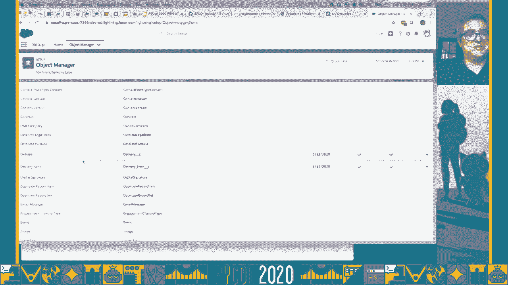

现在让我们回到 Cumulus CI，看看我们如何将其捕捉到版本控制中。请将其折叠。关闭这个机器人测试。这里在命令行上留出一点空间。为此，我们将使用 Cumulus CI 中的一个任务，名为 list_changes。在我这样做之前。

我将继续进行操作，这样我就不必在每个命令后面一直输入 minus minus org dev。我将把 dev org 设为此项目的默认 org。现在我只需运行 list_changes。这将查询 org 并与源跟踪进行交互。

org 用于查找我在 org 中更改的所有元数据。有时你可能想从列表中排除一些项目。这就是自定义任务选项的作用。如果我想找到那些选项，可以执行 CCI task info list_changes。这将给我所有不同任务选项的输出。在这种情况下。

我希望这个排除选项能将组件从列表中排除。这只是一个正则表达式格式。我想排除那些配置文件，因为在 Salesforce 的世界中，配置文件是非常独特且难以打包的。它们更像是个别实现的配置细节。所以我确实希望捕捉到这些对象及其字段和布局。

现在我只需回忆这个命令并改为使用 retrieve_changes 任务，而不是 list_changes。它接受相同的选项，因此你可以准备选项列表。这将通过 Salesforce 元数据 API 实际运行查询并拉取数据。

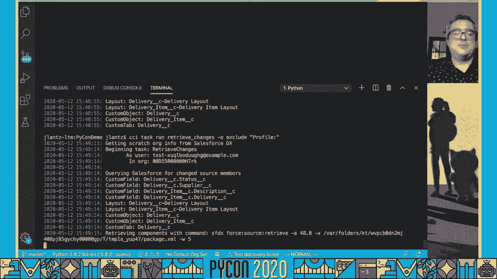

内容的创建。好的，所以如果我现在在我的项目下查看这个 force app 目录，main default 是我的元数据源所在的地方。对于其他对象，我为每个对象都有文件夹，字段的文件夹以及其中的各个字段。所以这很酷。我能够在网络界面中进行这些更改。

捕捉那些更改，将其转换为我可以轻松放入版本控制中的内容。现在让我先执行一个 git add。正如我在演示介绍幻灯片中所说，我们要创建一个功能分支。我忘记在主分支上进行提交。所以我们现在将其作为初始提交进行提交，并在主分支上创建我们的项目的主分支。就这样。

我们已经开始了一个项目。现在我们可以通过功能分支开发这个 Salesforce 开发项目。如果我运行 CCI org scratch delete dev 命令，它将会删除我创建那些更改的 org。现在如果我再次运行 dev 工作流，它将创建一个新的 scratch org，运行所有自动化。

这次它将把我刚刚捕获的所有内容部署到那个单词中，以便我可以逐步开发和构建解决方案。相当酷。好的，接下来的演示中，我想向你展示我们在 cumulus CI 上构建的基于网页的工具，使其更具可扩展性，也让非开发者更易接触。

当你尝试将这些类型扔入命令行时，会有一些混乱。因此我们将看看 Meteco，以便为这个应用程序提供一个新功能。然后我们将查看 Metacii，我们的构建系统，它将构建该功能。接着我们将看看 Metadiply，以及我们如何配置一个新的版本。

为这个项目的基于网页的安装程序创建的。所以让我们开始吧。现在这个我已经在 GitHub 上的项目，我已经将其连接到所有这些工具。所以我们将切换到这个项目并用它进行剩下的演示。但基本上是同样的事情。你可以看到在主默认目录下的应用程序。

我有对象。我有一个交付和一个交付项。我想这些上面有一些额外的字段。所以它们有一个计划日期和一个备注字段。但在这个演示中，我们想要做的是，因为在第三个演示中，我们将进行集成。

一个 Django 应用程序与这个应用程序同步数据，我们想要实际添加一个新字段，用来存储来自 Django 应用程序的外部 ID，作为这个对象的外部 ID。为此，我们可以像以前一样，通过命令行使用 CCI。但我想向你展示我们正在开发的新工具，Metecco，我认为这真的很不错。

非常令人兴奋。所以让我快速注销一下，以便向你展示从头开始的样子。当我来到 Metecco 时，我所需要的和我对 GitHub 的了解是很少的。Metecco 我必须拥有一个 GitHub 账户，这个账户很容易创建。所以我登出，然后登录，我已经接受了这个应用程序。

通常我会看到“你想要授予这个应用程序访问你的 GitHub 个人资料吗？”的 OAuth 验证步骤。它的作用是查看我拥有贡献权的仓库列表，并将其与该实例中配置的仓库进行比较。因此，你可以选择这个实例支持贡献的仓库。

在这种情况下，我在这里有 CCI 食品银行仓库，我也有贡献权。因此我正在展示该应用程序的卡片。如果我点击这里进入应用程序，我可以看到一个我早些时候创建的现有项目。但在这种情况下，我们想为我们的贡献创建一个新项目。

外部应用是我们将在第三个演示中查看的名为 DJ 食品银行的应用。这实际上是为此做准备。我们将创建一个任务，为交付和交付项目创建外部 ID 字段。如果我查看这个具体任务，这实际上是我工作的空间。

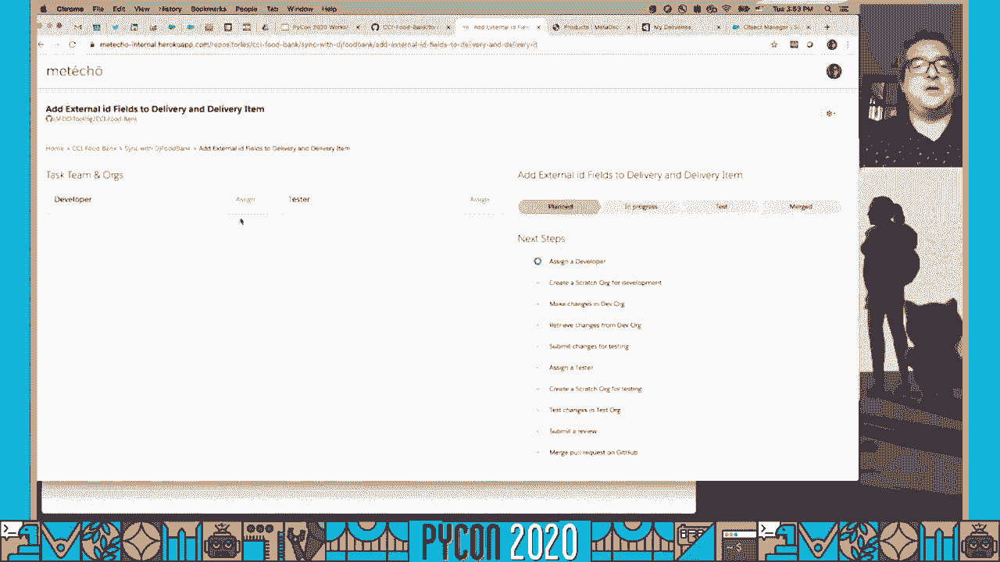

这个任务。我得给某人分配开发者的角色。现在，我是这个项目唯一的活跃成员。

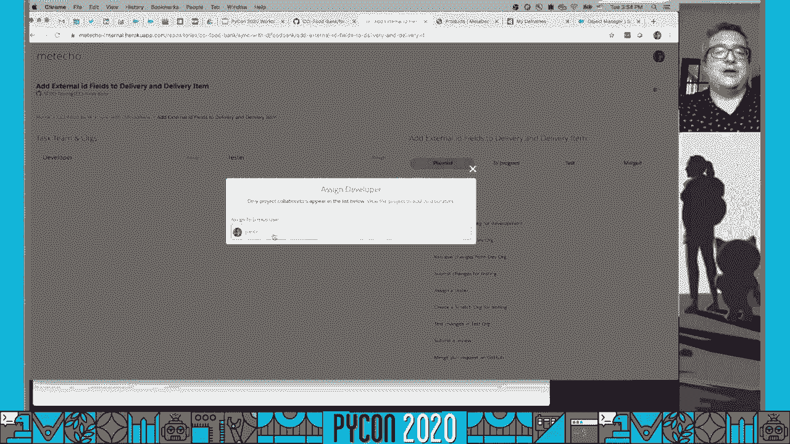

所以我将继续点击创建或。现在，这基本上做的是与命令行上的 CCI 流运行开发组织相同的事情。因此它利用了可移植的自动化，提供了完全不同的用户体验，对于不熟悉命令行的人来说，这要友好得多。

我职业生涯的开始是作为 Unix 管理员。所以命令行是我的拿手好戏。但是，对于许多 Salesforce 世界的人来说，他们很习惯这种可点击的网页界面。我们真的想让这些项目向他们开放，以便能够贡献。

我还将自己分配为这个项目的测试人员，仅此而已。

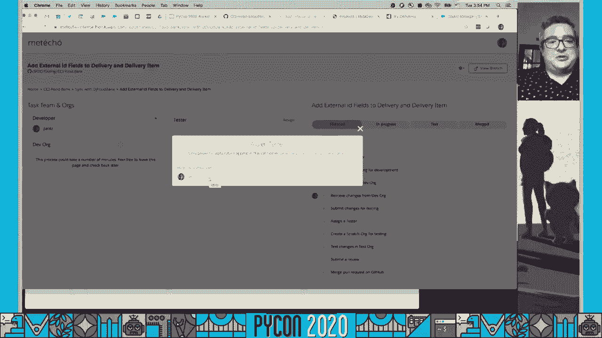

可以看看那是什么样子。开发者的基本思路是开发东西，而他们的临时组织则记录这些。创建提交。然后，测试人员使用来自该分支的自动化创建新的临时组织进行部署。可以看到我的组织已创建。所以我将继续点击查看组织以登录到 Salesforce 组织，临时的。

为我创建的组织。在这里，哦，出于某种原因，它真的像在经典用户界面中启动那些。所以我将切换到新的用户界面，因为这好得多。在这里，我想添加两个新字段，一个在交付对象上，转到字段和关系，选择新建。在这种情况下，我想添加一个整数 ID 的数字字段，表示 Django 中的应用 ID。

我们将其命名为 DJ 食品银行 ID。并告诉它我们希望将其设为外部 ID。这将确保此字段的唯一性，使其可以用作索引。并保存。我还希望在我的交付项目上有类似的字段。所以去交付项目的字段和关系。我将快速完成这个。

如果你想更详细地查看这一切，随时暂停视频并放慢速度。我们将这个称为 DJ 食品银行 ID，同时也将其设为外部 ID 并点击保存。很棒。因此我做了声明性的更改。就像我们之前在命令行上使用列表更改步骤一样，这次我们将使用 Moteco，它利用了来自 QMLSCI 的相同自动化。

去查询组织。然后它会问我想把这个存储在哪里？

我想把它存储在某种后安装 QA 配置中，那是一种可选配置，还是想把它放在主包目录中？在这种情况下。我想把它放在主包中，因为我希望当人们安装时，他们会得到它。所以我将继续点击下一步。它将再次显示我检测到的所有不同的元数据已更改。

在组织中。我将省略配置文件，但我们将选择字段和布局。我会点击下一步，给出一个提交信息，并告诉它去检索所选的更改。所以请注意，我在这里并不需要了解 GitHub 的任何内容。而在幕后，它做的是为项目创建了一个功能分支，然后。

我们称之为子功能分支。所以这个项目是父功能分支。它是功能斜杠父项目名称。现在为我创建的这个新分支包含了这个提交。让我们跳过去看看在 GitHub 上。好的。如果我查看这个提交。

这个分支名称是功能斜杠与 DJ 或 DJ。food bank __，它将父分支与子功能分支分开。为交付和交付项目添加外部 ID 字段。作为分支名称有点长。但是你可以在这里看到，它只是一些，你知道的，拉下了更改。

我在组织中做的这两个自定义字段，然后将这些字段添加到页面布局的 XML 定义中。所以看起来不错。现在我想把这个交给测试人员，因为我觉得我已经捕获了我需要的所有内容。所以我将提交测试任务，并实际上我稍后会在项目上做这个。所以我将继续提交任务，但我可以输入一些信息来使。

它的方式进入拉取请求的正文。这将为我提交一个拉取请求。现在我可以轻松跳转到 GitHub，查看这个已创建的拉取请求。你会注意到，已经在我创建的这个拉取请求上启动了构建。在我们查看这些构建之前。

让我先作为测试人员去创建一个新的组织。这将创建一个新的临时组织，并将这个新提交部署到组织中。这样我就可以在一个干净的环境中测试它。你不想在开发组织中测试，对吧？所以让我们跳过去快速看看 Metacii 以及 Metacii 为我做了什么。

这里。所以这是在 Heroku 上运行的 Metacii，它运行了这个代码库的功能测试计划。针对这个提交的我的子功能分支。它再次重用了 cumulusii 的便携式自动化，所以它正在下载提交。它调用 Salesforce DX 来创建一个新的临时组织，然后运行这个流程。CI_FETURE，我之前提到过的，作为进行功能分支测试的内置流程之一。

如果我去到流选项卡，你会注意到这里的输出与我们在命令行上运行 CCI 时得到的完全相同。因此，我们以不同的方式和不同的用户体验运行这项自动化，但最终以相同的方式运行相同的自动化。如果这个流失败了，我想调试它，我可以使用 CCI 在本地运行。

- - 调试标志，流失败时会进入 PDB 提示符。而且由于这是一个特定于 Salesforce 的系统，我获得了一些关于目标环境的信息，这些信息是特定于 Salesforce 的。除此之外，它还启动并为我运行机器人测试。由于这个测试仍在进行中。

我来给你展示一下这些请求的样子。我认为这是一个非常酷的功能，因为这是一个用于构建 cumulusii 项目的系统，我们使用机器人框架进行项目开发。我可以查看，我们与机器人框架集成了这个系统。因此，如果我想通过 UI 查看测试，如果你之前工作过机器人框架，你就会见过这个日志格式。

我们实际上将这些直接集成到浏览器中，所以我可以确切地看到发生了什么。如果缺少定位器或定位器未能找到正确的内容，它甚至会捕获屏幕截图。好的，所有检查都通过了。一切看起来不错。让我们回到这里，作为测试人员，我将登录测试环境以展示。

显示这个环境已经创建，我可以登录。

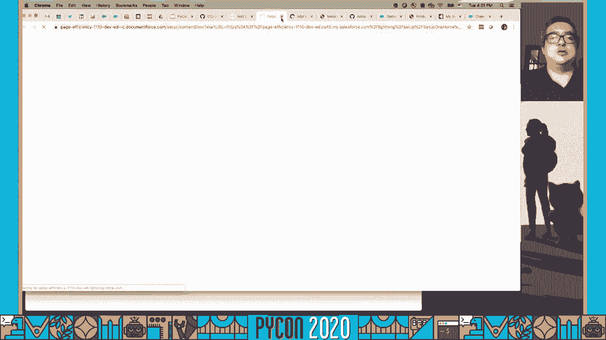

通常在非演示的情况下，我会在这个环境中进行实际测试。我们继续前进并提交审核，表示批准，看起来不错。

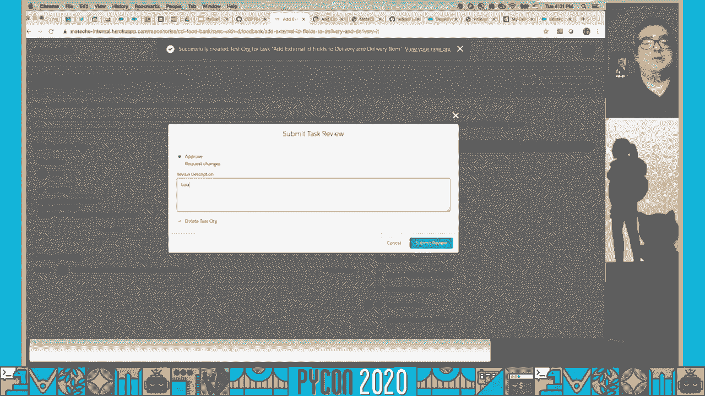

我将继续添加项目审核。现在如果我查看拉取请求，这会显示为我留下的评论。它还会显示为一个提交状态。因此，你可以设置受保护的分支，要求在允许合并之前进行此检查。我将继续合并这个拉取请求，并注意这个拉取请求刚刚。

合并到父功能分支。因此现在这个任务完成了。如果我回到项目层级，我可以提交项目以进行合并。在这里，我将提供一些发布说明。好了，因此现在为我创建了另一个拉取请求。

此次拉取请求请求将该分支合并到主分支。通常情况下，我们在这个分支上设置了受保护分支，我通常不允许管理员覆盖。但为了演示，我通常会等这些构建完成后再进行合并。但在这种情况下。

我将使用我的管理员权限将这个拉取请求合并到主分支，这样我们就可以继续进行 meta-CI 的下一步。 好的。 所以回到 meta-CI，我们的构建系统，你会看到合并到主分支已经排队在上传 beta 分支上构建。 触发的方式是通过计划设置的。

如果你熟悉 Jenkins，这些就像 Jenkins 中的作业。 但与 Jenkins 中的作业不同，计划实际上非常简单，并且由于其简单性，可以适用于多个不同的代码库。 因为 cumulc.i 在项目间创建了这种通用接口。 举个例子，上传 beta 流程的角色是创建一个 beta 发布。

它是通过使用与主分支匹配的正则表达式触发的。 有三个代码库使用这个基本配置。 它在名为 packaging 的组织中运行，并且运行两个流程，CI master，将代码部署到我的打包组织中，然后 release beta 将上传这个发布。

在 GitHub 中创建发布。 所以让我们回过头来检查一下。 这个系统实际上会自动扩展你的 Heroku 工作者 dinos。 它监控 Redis 中的构建队列，并会自动扩展到你可以在 Heroku 应用的配置中设置的某个限制。

它正在动态创建工作者 dinos，当队列回到零时，它会将所有内容缩减到零并关闭它们。 你还可以设置预留容量，以便始终保留一两个在线。 但好的一点是，Heroku 仅按秒计费你的使用。 好的。

所以这些已经启动并开始运行。 如果我查看流程，你会再次看到。 这就像命令行或输出，如果我从命令行运行 CCI。 它几乎完成了对打包组织的部署。 然后它将运行发布 beta 流程以切割包的发布。

现在在运行过程中，我将继续排队一个新的生产发布构建。 通常，我会等待 beta 构建完成并且 beta 测试通过。 但为了演示的目的，我们将加快进度。 所以我选择了 CCI 食品银行代码库中的上传发布计划。

我正在针对主分支运行这个。 我点击提交。 你会注意到这实际上在等待另一个构建完成。 因为我们不在虚拟机中工作，所以我们遇到的一个挑战是，很多基于云的 CI 系统假设如果你需要更多的并发。

他们会给您更多的虚拟机。这对我们来说并不太有效，因为我们的打包环境。我们有一个单一的打包组织，包在其中上传。因此，它应该在一分钟内解锁，但我可以提前强制执行。去解锁那个组织。您会注意到，在这个上传 beta 构建结束时的另一个事情。

只是，为了向您展示我们在发布自动化中所做的事情，它会上传一个新版本的包，这就是它现在所做的，然后我们在 GitHub 中创建一个发布，我们通过解析拉取请求主体自动生成发布说明，并将其放入发布中。最后，我们运行一个名为 GitHub master 到 feature 的任务，获取这个新的。

在主分支中测试过的提交并将其合并到所有开放的功能分支中。因此，这实际上触发了所有这些其他功能分支的构建，因为它们现在自动集成了新代码。好的，接下来启动一次重建，加速这个过程。来吧。

所以现在这个上传发布构建正在运行，并正在部署到打包组织中。但这次，不是包的 beta 版本，而是将创建一个生产版本的包。在 GitHub 仓库中，这在发布下创建了一个包的 beta 发布。

这是我输入的发布说明，以及一个链接，指向那些发布说明来源的拉取请求。因此，我们的发布说明生成器会找到自上一个发布标签以来，所有从主分支出现的 PR，并根据拉取请求主体的内容，将发布说明串联在一起，我们将其纳入新功能的代码审查中。

过一会儿，当构建完成时，完成了。现在我得到了这个产品的新版本 1.4。现在让我们谈谈元部署。您可以看到我们的生产实例，这是成千上万用户使用的。

我们的非营利和教育客户都可以安装我们所有主要产品。因此，例如，如果我想安装 NPSP 或非营利成功包。我会来这里。这些步骤最终都是在我连接的组织上可用的 key millisci 中的任务。

然后我只需点击一个按钮，它就会自动执行整个过程。现在我已经将这个项目设置到我们的暂存网站上。所以，哦，我要部署 STG。然后我有 CCI 食品银行。您可以看到，现在这是设置为版本 1.3。由于我创建了新版本，我实际上需要将这个新版本发布到这个网站上。

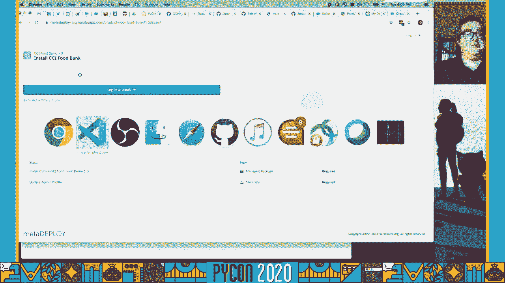

现在我们将回到命令行。我将进入 CCI 食品银行的本地克隆，拉取最新的主分支。这次我将运行一个名为 meta deploy underscore publish 的任务，并需要给它一个标签。这是版本 forward slash one 或者 one dot four。

我还将指示它继续发布将要为安装这个新版本创建的计划。所以它出去下载标签，解析标签的配置。现在标签的配置来自于 key millisci yaml。让我给你展示一下这个项目的 key millisci yaml 的底部长什么样。

我有计划安装。请注意，安装步骤只是使用流程和任务。所以这只是项目的可移植自动化的另一种配置。这些计划可能会稍微复杂一些，涉及多个不同的任务，具体取决于你想要提供的自动化的复杂程度。

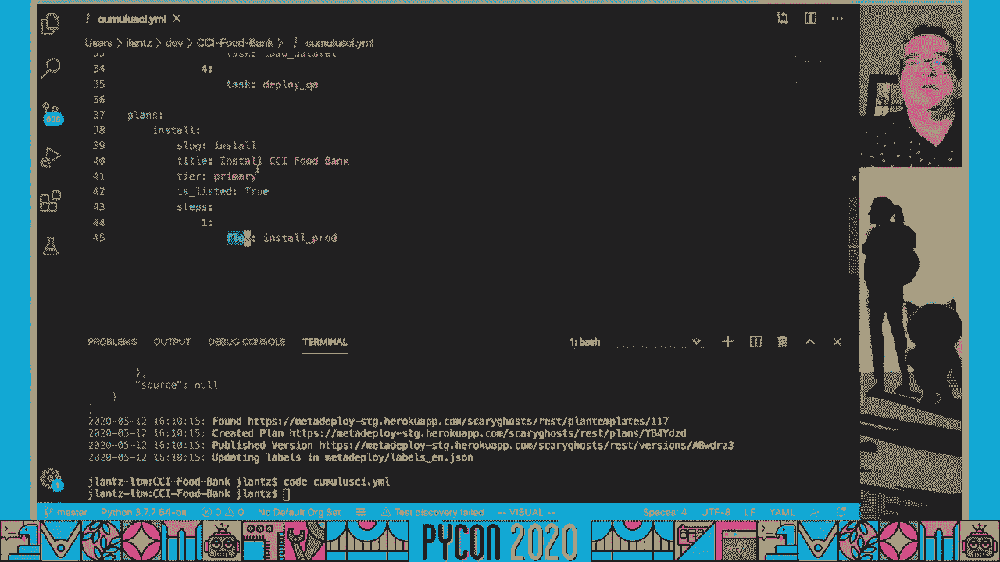

对最终用户而言。在这种情况下，我们只是做一些非常简单的事情。所以它将其发布上去。现在如果我回到 meta deploy 的主页，并进入 CCI 食品银行。你会看到，我有版本 1。4。但是点击这里，它将安装演示 1。5。让我们来看看。每天在演示中发现一些新东西。所以就这样。

我们通过网络进行了更改，将其放入了代码库，合并了拉取请求，并获得了新的发布。你可以看到，当拥有这些网络工具和云层 CI 框架相互配合时，这个过程相当简单。对于一个开源项目来说，能够管理这些内容真的是一个相当无痛的过程。

像在 Salesforce 平台上构建自定义功能并使其可用于成千上万的用户一样复杂。那么现在我们来谈谈将整个集成与 Python Web 应用程序结合在一起。在这个第三个演示中，我构建了一个示例 Django 应用程序，帮助食品银行跟踪交付和交付物品。这是我们在前两个演示中经历的一个非常常见的场景。

我已经完成了集成。我们将逐步演示，我会向你展示我如何为这个 Django 应用程序构建集成，并利用一些云层 CI 来帮助我的用户配置应用程序，然后我们会展示集成实际上是如何工作的。

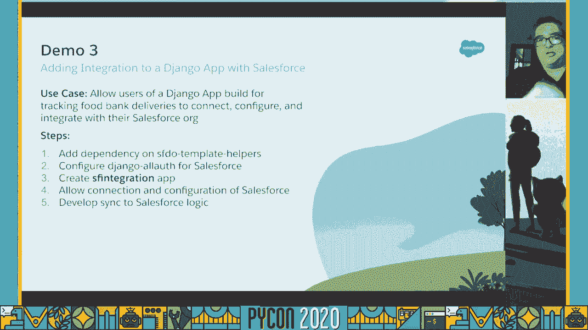

好的。那么我们回到 VS Code。

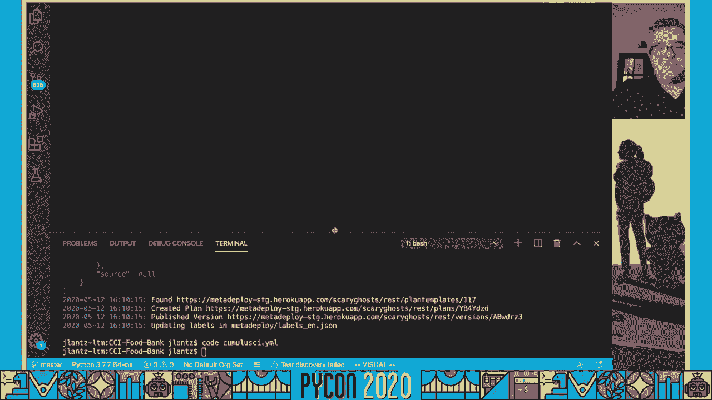

我们将从代码的角度开始讨论这个，实际上，你知道吗，撤回一下。我们要去浏览器，看看这个应用程序。所以请先退出这个应用程序，然后再回来登录。我在这个应用程序中为自己创建了一个用户。

这只是使用 PiDanny 的 cookie cutter 模板进行 Django，并在 Django 3 上运行。这有助于我正确输入密码。现在它将让我登录并带我到我的账户。所以我们稍后再回到我的账户页面。我只想向你展示交付是如何工作的。所以我有一个基本的交付结构。

我可以在每个交付上添加字段。我可以创建额外的交付项目。例如，这个是土豆。好吧，我创建了我的不同项目。这样，任何人都可以使用它。他们不必是 Salesforce 用户。但如果你为食品银行构建了这样的应用，你可能会开始。

从不同的食品银行获取请求，因为有很多食品银行实际上在使用 Salesforce 作为它们的后端系统。所以你可能会问，如何将这些数据导入我的 Salesforce 实例？

这确实让我能够报告它，将其与我所有其他记录关联，并更好地跟踪很多信息。所以这就是我们要进行的内容。我将向你展示我如何构建这个应用程序的集成，以便能够与 Salesforce 实例进行交互。

所以第一部分是你必须允许用户连接到 Salesforce 实例。我们使用一些开源 Python 代码，这段代码写在一个叫做 SFDO 模板助手的包里。虽然它没有在 PyPy 上，但在一个公共的 GitHub 仓库中可以找到，这就是我们在这个项目中安装它的方法。

SFDO 模板助手有一个功能，扩展了 OAuth 配置，以便能够与 Salesforce 中进行 OAuth 的一些独特方面进行交互。其中一个独特的方面是需要几个不同的独立按钮。所以如果你想连接到一个生产或开发版的 Salesforce 组织，你需要。

注意，当我点击这里时，它会把我带到 login.salesforce.com。如果我想连接到一个沙箱或临时组织，当我点击这里时，它会把我带到 test.salesforce.com。所以这是我们为 Salesforce 项目的 OAuth 扩展所做的主要事情之一，便于支持这两种不同的用例。

OAuth 中的提供者并没有执行。其次，它实际上是在将令牌使用 fernet 加密后再写入数据库。

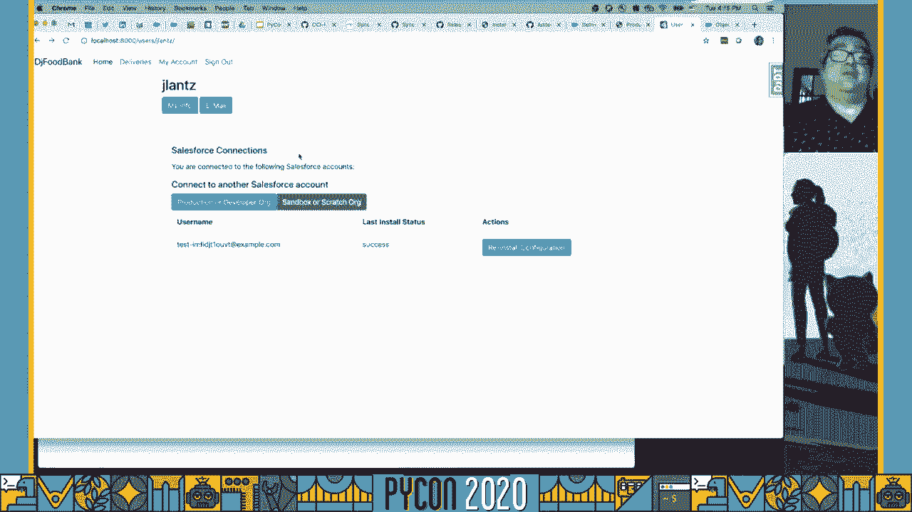

让我们先看看我们如何连接 OAuth。好的，我在我的工作区中拉起了这个示例。为了展示它是如何结构化的，我在配置设置下有它。同时我还有需求文件。

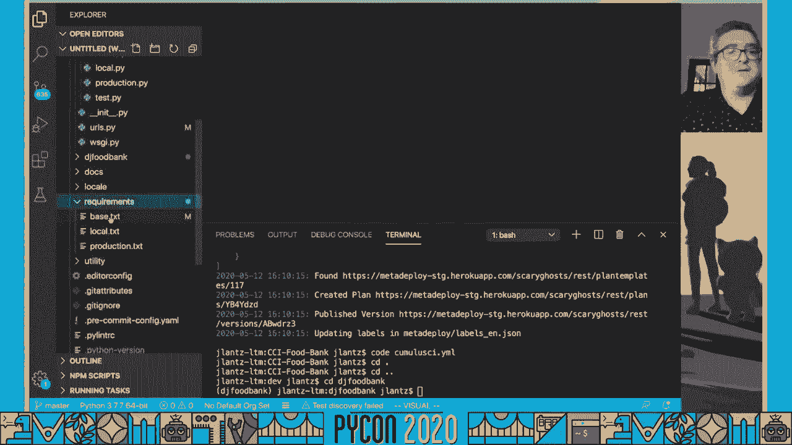

所以对于基本需求，我只是添加了一个指向我们的 GitHub 仓库、SFDO、工具的链接。我把 SFDO 模板助手固定在那个助手仓库的特定发布版本上。所以当我从这个文件中执行 `pip install` 时，我就会将其安装到我的本地环境中。然后在配置中，有一些我添加到我的默认配置中的内容。

配置文件在这里。我设置了一个默认数据库，以便在本地开发中使用相同的数据库名称作为默认值。然后所有的——哦。我还添加了一些——找到我的第三方。在这里，我添加了——我原本有一个 deliveries 应用，在这里创建了另一个叫 SF 的集成应用，其中包含与 Salesforce 集成的所有逻辑。

我们稍后会看看那段代码，但我现在想专注于 OAuth 方面。然后在底部，我必须创建一个 Salesforce 连接的应用程序。我马上就会给你展示它的样子。在开发者版组织或任何其他持久的组织中创建它们真的很简单。

Salesforce 组织。但这只是应用程序，就像你创建一个 GitHub 应用来构建与 GitHub 的 OAuth 集成。一样。我们使用环境变量，以便在 Heroku 上运行这个，并通过应用程序的配置设置这些。我们还使用环境变量来获取用于数据库加密的加密密钥。你需要一个 GitHub 个人访问令牌，以便代表进行与 GitHub API 的交互。

应用程序的。所以我们从环境变量中获取这个。然后在这里，我们只是将 SFDO 模板助手帐户适配器和帐户提供者连接起来，并为这个单独的应用程序设置适当的作用域，并将连接的应用程序详细信息连接到环境中，而不是存储它们。

所以让我们看看这个连接的应用程序。让我们再登录一次。这是我创建的 Salesforce 开发者版组织。所以它是一个持久组织，这对于做一些事情非常好——如果我想进入应用管理器。在应用管理器中，我可以创建一个新的连接对象。

你只需给它一个名称、API 名称、联系电子邮件，选择启用 OAuth 设置，给它一个回调。在这种情况下，我希望能够同时获取完整和刷新令牌的访问权限，以便获得刷新令牌。像某些 OAuth 提供者一样，访问令牌不是一个持久令牌。它会过期，你需要刷新令牌来重新创建它。

因此，拥有这样的访问权限对于像这样的应用程序非常重要。在这种情况下，我已经创建了一个这样的令牌。所以这是我在应用中使用的那个。为了展示它完全创建后的样子，你会得到消费者密钥或客户端 ID。你可以点击这里查看密钥，然后是应用程序的回调 URL。

在 Salesforce 中，这些的一个好处是，如果是本地主机，你可以使用 HTTP。否则需要 HTTPS。但这对构建开发环境的连接应用程序非常不错。好的。就这样，我基本上让 Django 处理我的 OAuth 登录到 Salesforce。接下来我想做的事情是，我们来创建一个新的 Scratch 组织。

所以让我唤醒 QA 组织配置。这将创建一个新的 Scratch 组织，我们连接到应用程序并展示一下它是如何工作的。好的。我们查看了添加该项目的要求，配置中所做的更改。接下来我们将查看在实际 Django 应用程序代码中所做的更改，以便实现这一点。但首先。

让我们继续将这个组织连接上。所以我将回到我的应用程序。我想连接一个新的沙盒或 Scratch 组织。我可以从 CCI org info 的输出中获取这个 Scratch 组织的用户名和密码，以便登录。好的。再试一次。

我不知道为什么那不工作。当然，我是在演示。好的。再试试。也许是那个字符。我将快速为我重新生成那个密码。好的。那么我们就继续使用我为这个连接的现有连接，它是连接到我之前创建的另一个 Salesforce 组织或另一个 Scratch 组织。

我们再试一次快速重建那个 Scratch 组织。再试一次，看看我们能否让它工作。

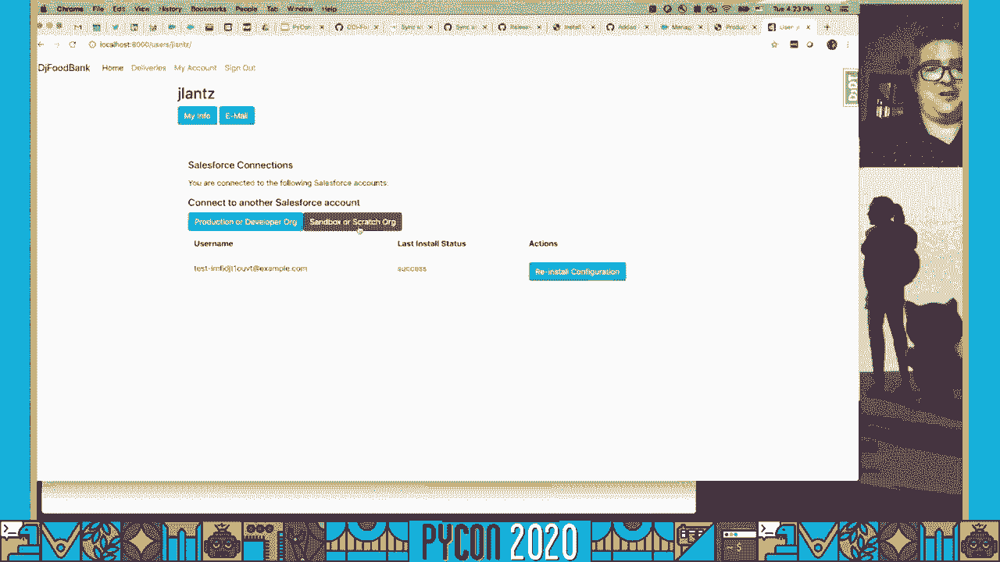

如果不行，我们就会重用我已经连接的现有组织。但只是为了给你展示。我想能够向你展示连接一个组织的整个过程。好的。它已经创建了我的组织并为其设置了密码。看看我们能否让这个现在工作。Scratch 组织的一个好处是，当某些事情出现问题时，可以轻松从头开始。

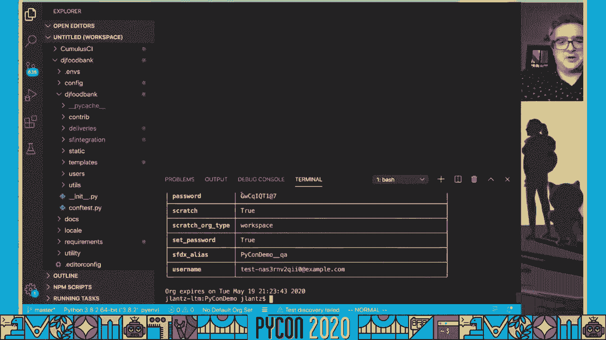

出错了。看起来好多了。好的。现在它会让我授权访问。这里的名称是你在连接的应用中设置的名称。所以我将继续允许。现在在我的演示项目中，有一件事我没有做，就是让这个重定向回一个比这个更友好的页面。所以我要回到这个账户页面。

你会注意到对于这个组织，最后的安装状态是空的，并且它显示了我安装配置。所以我需要做的实际上是将我刚刚创建的那个包的新版本安装到我的 Salesforce 组织中。我可以通过点击这里安装来做到这一点。在这个演示中，我只是直接在网络进程中运行它。在生产环境中。

你会想使用一些队列机制，我们使用 Django RQ 或其他东西。

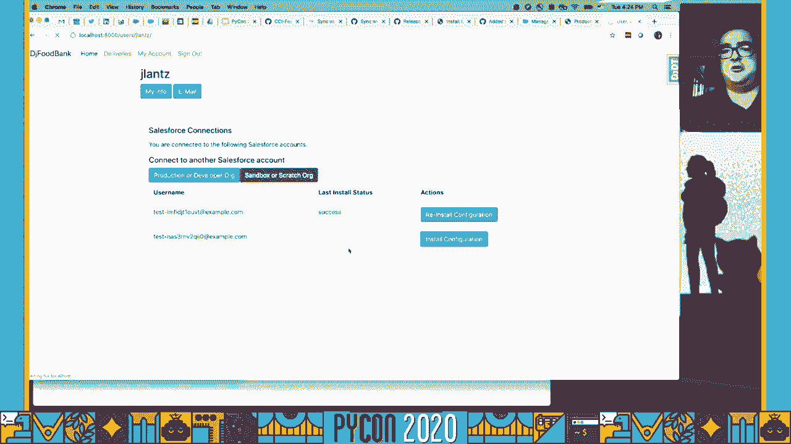

像**Celery**这样在后台工作进程中运行这个。但我会给你展示在后台运行的开发服务器上这看起来像什么。你可以看到它确实已经启动。这里有点难以看清。这是什么呢？

所以它已启动并已执行。我在 Cumulus CI 中运行的是更新依赖任务，并将其指向这个项目的**GitHub**仓库。它会检查 Cumulus CI 在他们项目中的配置。它查看仓库中的最新版本。然后找到最新的发布并安装该最新发布。

自动为我完成。

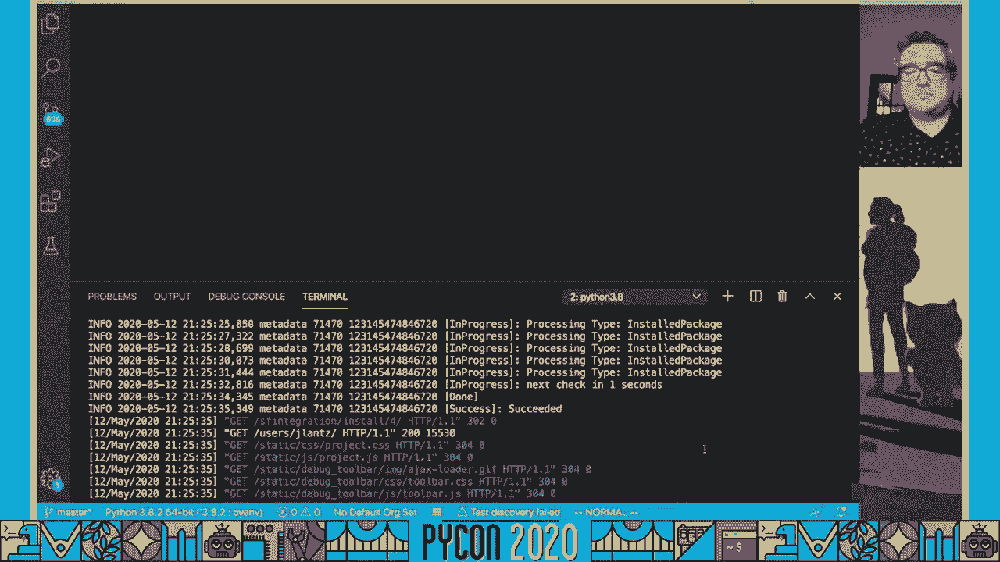

所以看起来现在完成了。我们创建的这个包现在通过这个网络应用程序安装到了我作为该应用程序用户的 Salesforce 组织中，使用我在工作中的权限。所以现在让我们来创建一个交付。假设这次的供应商是一个本地农场。暂时我会跳过设定计划日期。但从备注的角度来看。

下个月跟进以设定一个计划日期。我在这里添加了一个选项，让我可以选择想要集成哪个 Salesforce 实例来处理这个特定的交付。所以我可能会有一个测试环境，或几个不同的测试环境在我的生产环境中。

这将让我选择其中一个。这边显示的是我用来登录 Salesforce 的**用户名**。所以我将选择第二个，这是我刚刚连接的新组织，并点击保存。当然。哦，好吧。这里有个快速代码修正。这正是一个好机会，可以查看一下集成的代码。

所以在集成中，我有一个模型，或者说我有两个模型，一个是交付模型，另一个是交付项目模型，这些模型包含了适当的对象。我在这里重写了保存方法，支持一个自定义关键字用于 SF 同步，该关键字可以设置为**false**。如果没有设置为**false**，那么它将调用我已有的同步交付作业。

在这个作业文件中指定的。而同步交付作业将接收一个交付 ID，并确认其是否已被创建。它将尝试根据 ID 查找该交付。如果该交付上没有 Salesforce 用户，它将直接退出，因为没有 Salesforce 可以进行同步。然后我构建了这个工具方法。

获取简单的 Salesforce 连接，这将使用从 Salesforce 的 OAuth 连接获取的凭据来初始化一个简单的 Salesforce 实例。然后我们在 Salesforce 中按名称查询供应商。这个查询的格式称为**Sockl**，它与**SQL**非常相似，但这就是你如何在 Salesforce 实例中查询数据。

在这种情况下，SF 是简单 Salesforce 的实例。所以 SF.query 允许我运行查询。我得到了一个结果集，包含总大小和记录的键。看起来错误来自第 23 行。这是一个字典。在这个演示之前，我测试了更新的其他路径，但相对简单。

要进行更改以创建账户。它将检索或获取我 Salesforce 实例中具有该名称的现有账户，或者会创建一个新账户。这就是在简单 Salesforce 中创建记录实例的方法。你给出对象名称，类似于实时创建的虚拟类。

通过简单 Salesforce。调用它的创建方法。你将值的字典传递给它。然后我获取同步的 Salesforce ID 并将其保存到这个单独的记录中。我将返回并重新运行保存。很好。我现在已经创建了我的对象，并且有一个链接可以查看 Salesforce 中的内容。

如果我点击查看，这将带我进入 Salesforce，在我们创建的架构中查看该记录。所以我可以看到它链接到一个供应商，一个本地农场。在相关项下，我可以看到现在没有任何交付项目。

我实际上必须暂停这个视频并回来，因为我有一个会议要参加，但在这之后我会完成剩下的部分并剪辑进去。所以稍等一下。好了，我们将从我们在 Django 中走过的地方继续。

我们现在与 Salesforce 集成的应用程序。我们刚刚走过了交付的集成。让我们检查交付项目。让我们创建一些交付项目。假设我们有胡萝卜。保存一下。我们有些冷冻豌豆，这些需要存储为冷冻状态。

我们还得到了些土豆。由于我在保存这些时没有收到任何错误，我推测这些项目实际上在保存过程中同步到了 Salesforce。让我们去 Salesforce 查看那条交付记录。这次我们将查看相关内容，我可以看到那些值现在已经输入。

Salesforce 应用程序。现在，这对这个非营利组织来说非常酷，因为他们现在有一个本地农场作为供应商。在我们的应用中，我们仅有供应交付的名称。但现在在 Salesforce 中，他们有完整的能力来维护来自该组织的联系人列表。

不同的捐赠机会，他们可能会从该组织中获得价值。拥有关于组织的所有信息。而且所有这些都是完全可定制的，以便他们能够构建这个客户关系管理环境，满足他们作为组织的需求，以便跟踪他们不同的供应商及其与供应商的关系。

他们还可以访问聊天功能，因此他们可以在这里进行与特定供应商相关的讨论的线程式动态。因此，您的应用程序获得了很多功能，而您无需将其构建到应用程序中。您只需将数据与 Salesforce 同步，就可以使用我们用 Python 编写的所有开源工具来实现。

现在让我们深入了解这个集成的代码，以便我们能够大致了解。

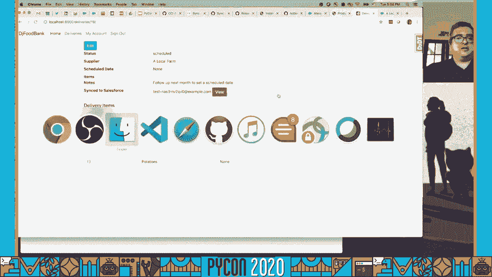

这就是它所做的。所以我们开始查看这个包含同步交付功能的作业文件。我们正在根据 ID 查询交付。然后我们获取一个简单的 Salesforce 连接。稍后我们将查看该功能。但为了继续浏览这个文件。

我们正在对 Salesforce 运行查询，以查询供应商名称为交付名称的帐户。然后我们要么创建一个新帐户，要么使用找到的第一个记录，如果 created 为 true，即如果这是一个刚刚创建的新记录，我们将继续在 Salesforce 实例中创建该记录，获取 Salesforce。

记录的 ID，这就是我们如何构建链接以链接到 Salesforce 中的记录。然后保存该记录，并告诉它不要担心将其同步到 Salesforce，因为我们只是更新 Salesforce ID。如果这是对记录的更新，我们几乎做同样的事情。在这种情况下，我们将根据我们拥有的 ID 查询 Salesforce 中的记录。

在 Salesforce ID 字段中。如果我们没有找到任何内容，可能是记录已从 Salesforce 中删除，并且您想要重新创建该记录。因此我们将再次调用 Sync Delivery，但这次告诉它我们已创建，值为 true。这样它将继续创建一个新记录。否则。

它将通过我们的对象调用简单 Salesforce 并调用 update 方法。您可能会注意到这里的 CCIFB1_ 是应用于所有管理包中架构的命名空间前缀。因此，当您在 Salesforce 中保留一个命名空间时，它是针对您的管理包全球唯一的。

您的所有对象都会应用此前缀。您创建的所有字段也会应用此前缀。这有助于避免冲突。因此，如果您有一个常见字段，如 SAGUTATION 或类似的东西，它可以避免多个不同的包之间的冲突。然后，对于交付项目的同步。

非常类似的过程，我们将查询交付项目。检查确保它的交付有一个 Salesforce 用户，并获取一个简单 Salesforce API 的实例，检查它是否已创建。因此，如果这是一个新记录，我们将继续在 Salesforce 中创建它，并记录回 ID。

如果这是对记录的更新，我们将继续查询以确保该记录在 Salesforce 中仍然存在，如果不存在则重新创建它。如果存在，则仅用描述和存储要求更新该记录。因此，集成非常简单。一旦建立与 Salesforce 的连接，并且将架构安装到。

另一端的包。所以这就是我们实际同步数据的方式。接下来我想向您展示的是，这个包是如何处理获取包的。

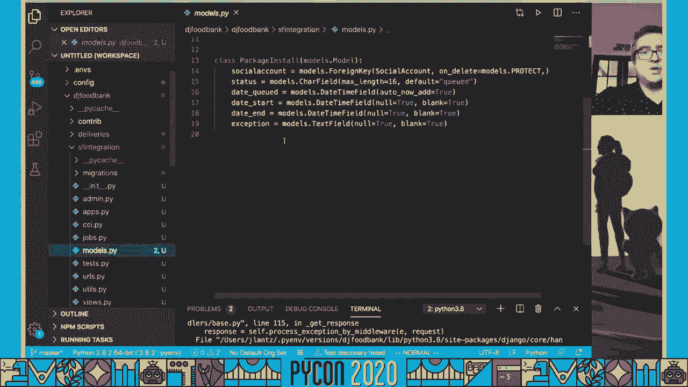

为用户安装。因为我认为这正是您真正利用 Cumul C。I。作为框架的价值所在。您只需利用 Cumul C。I。作为可移植的自动化来运行安装。因此，我在这里为包安装创建了一个基本模型。

它链接到所有认证社交账户，这是您的 Salesforce OAuth 连接。然后它有一个状态字段和状态信息。它有字段来跟踪何时排队，何时开始，何时结束，以及一个字段来跟踪异常。现在，您可以在元部署中扩展这个。

我们将完整日志捕获到数据库中的一个字段，以便在个别安装中如果出现故障时容易查看。我们将其集成到 Django 管理面板中。让我给您展示一下那是什么样子。如果我进入包安装，我实际上可以看到每一个安装。

这是我包的运行情况。这样您就可以随时关注，如果您的客户开始遇到安装错误，您可能想在自动化和它的工作方式中做一些更改。

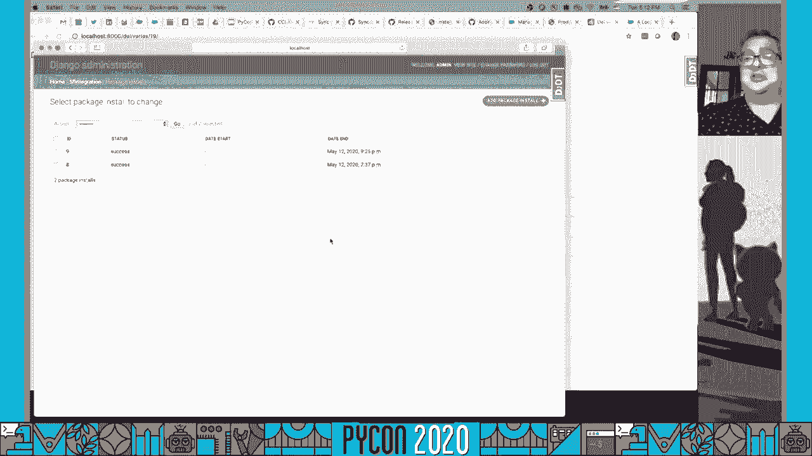

来解决这些问题。

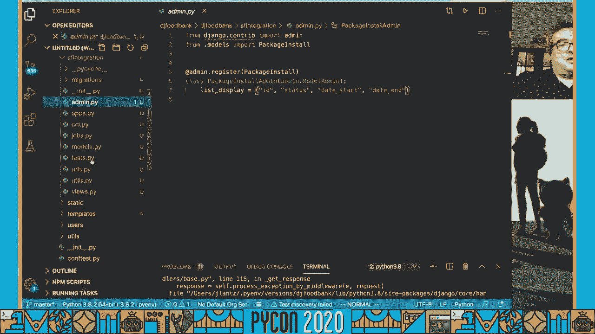

然后我们有几个我构建的实用函数。第一个实用函数是转义单引号。这在 Sockl 查询中非常重要。REST API 不支持参数化或参数化查询。但注入的最大风险在于，您不能使用分号来进行另一个。

查询或之后的另一个命令。因此，最大的风险是值内部的单引号。因此，在这种情况下，我们会转义该值。然后这个简单的函数用于获取社交账户并解析出 Salesforce 凭证。这将使用解密。

可通过 SFDO 模板助手获得的解密助手。它将解密存储在数据库中加密的值，为您获取令牌和密钥，并返回一个快速的字典。现在要建立一个简单的 Salesforce 连接，您只需传递一个社交账户。

它执行了几项操作。这是一段我们用于修改请求以自动重试 API 调用的常见代码。你可以调用我们刚刚查看的获取凭证函数，以解析社交账户中的凭证。然后你只需初始化一个简单的 Salesforce 实例。你需要传递 Salesforce 实例的实例 URL。

额外数据和 key 实例 URL。它需要凭证中的令牌。我们还将告诉它一个 Salesforce API 版本号。Salesforce 中的 API 是有版本的。因此，通过将其指定为固定值，你就能确保在 Salesforce 持续更新时与同一 API 进行交互。

更新发布版本。然后，我们将为调用设置一些头，以便处理身份验证。接下来，将我们的适配器挂载到会话上以进行重试，然后返回配置好的 API 实例。现在安装该包的实际步骤。为了回顾一下在用户界面中的位置，如果我回到我的账户。

如果我点击重新安装配置，它将调用我们接下来要查看的这段代码。这段代码实际上将初始化一个 key millisci 运行时的实例，然后配置一个默认的 key millisci 任务，更新依赖关系，并传递一个选项，告诉它去安装你 key millisci 项目的其他 GitHub 存储库。

CCI 食品银行存储库，去将该存储库安装到这个组织中。

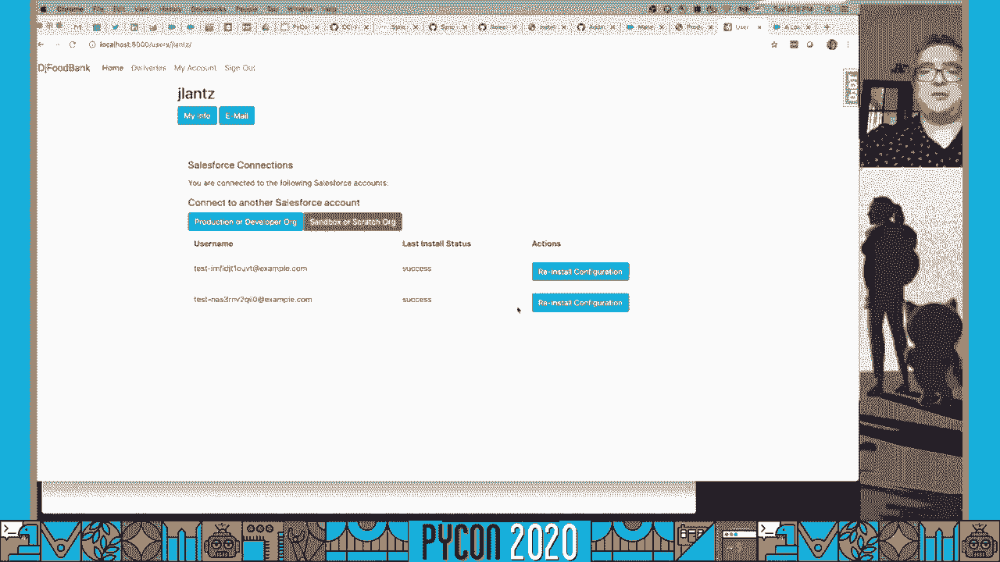

为此，我们需要为某些事物做一些样板式的接线。但这将在 deploy repo 方法中完成。在这里，我们需要一个社交账户，了解我们想要运行的目标 Salesforce 环境。我们需要知道我们在存储什么。

我们存储结果的类。你可以直接传递包安装，但假设你还有其他操作要做。这稍微抽象了一下。因此在这种情况下，我们将查询结果类，以获取我们想要存储状态和更新时间的结果对象。

操作的开始日期和结束日期。接下来，我们将准备一个 key millisci 的组织配置或 org config。我们需要获取社交账户，将调用获取 Salesforce 凭证的助手函数，之前在 utils 文件中查看过，并获取该凭证。然后，我们将通过传递相关配置的字典来构建一个组织配置。

我们需要它具备。它需要一个实例 URL，一个访问令牌和一个刷新令牌。然后我们将给这个组织命名。在这种情况下，它不是一个持久的钥匙串，所以我们将把这个组织称为连接的，接下来进行操作。我们需要做的下一件事是准备 OAuth 连接的应用服务。

实际上，这将向提供者的社交应用程序进行查询，以获取 OAuth 的客户端 ID 和客户端密钥，并为 key millisci 钥匙串配置一个服务配置，连接的应用程序允许我们通过 OAuth 获取 home 或 Salesforce。然后，我们还需要在 key millisci 钥匙串中配置 GitHub 服务。

我们可以在这个任务中针对 GitHub API 运行自动化。为此，我们初始化另一个服务配置。在这种情况下，我们只会将密码作为配置值，并传递它。来自设置的 GitHub 令牌。实际上，这里应该进行修改。

这是有效的，因为我的数据库中有旧记录，但这实际上应该是连接的应用客户端 ID。这应该是设置的连接应用客户端密钥。好的，保存这个。所以我们已经创建了我们的组织配置，并将其存储为变量 org。我们创建了一个连接的应用服务配置，一个 GitHub 服务配置。

现在我们需要初始化 key millisci 运行时。因此，我构建了一个 key millisci 运行时的小扩展，以便去掉一些假设，即它运行在一个 Git 项目中，且我们不需要下载 GitHub 仓库。

我们只希望能够将这个任务作为 Python 代码运行。因此，我们将接下来看看这个。但现在，我们只是将 key millisci 运行时初始化为 CCI。它将有一个用于钥匙串的属性。我们调用钥匙串上的设置服务方法，告诉它这是连接的应用服务。

这是 GitHub 服务。这里的最后一个选项是你想要将服务设置为全局级别还是按项目级别。因此，设置为 true 则是全局级别。接下来，我们将准备一个任务配置，包含我们想要传递给更新依赖项任务的选项。在这种情况下，更新依赖项接受一个名为依赖项的选项。

你传递一个字典或一个字典列表作为依赖项。如果你的依赖项有一个键 GitHub，你可以直接指向一个 GitHub 仓库 URL。它会访问并检查那个 GitHub 仓库 URL，并为你写出所有内容，并处理将该 URL 安装为一个 cumulaci 项目。

接下来，我们将从 cumulaci 任务 Salesforce 导入更新依赖类。然后我们将初始化该类，传入来自运行时的项目配置，从这里的任务配置，以及我们上面创建的组织配置。这是初始化任何 cumulaci 任务实例所需的。

然后我们将继续构建这些任务类的实例。然后实例本身是可运行的。所以我们将在这里运行任务。然后我们将记录或将状态字段设置为成功，除非出现异常。然后我们将把状态设置为失败，并将异常记录为对象上的异常字段。

在这两种情况下，我们将设置结束日期并执行结果。保存。所以有一点代码来逐步走过，但我的意思是，实际上在 73 行代码中，你已经实现了包的自动安装。实际上，如果你想利用这一点，你可以进行更多的自动化。

cumulaci 中所有不同的自动化和任何 cumulaci 任务或流程。现在最后一件要展示的事情是在 CCI 文件中，我创建了一个 base 的扩展。cumulaci 运行时，从 cumulaci 核心运行时导入。创建这个扩展的唯一原因是为了我可以指定一个不同的项目。

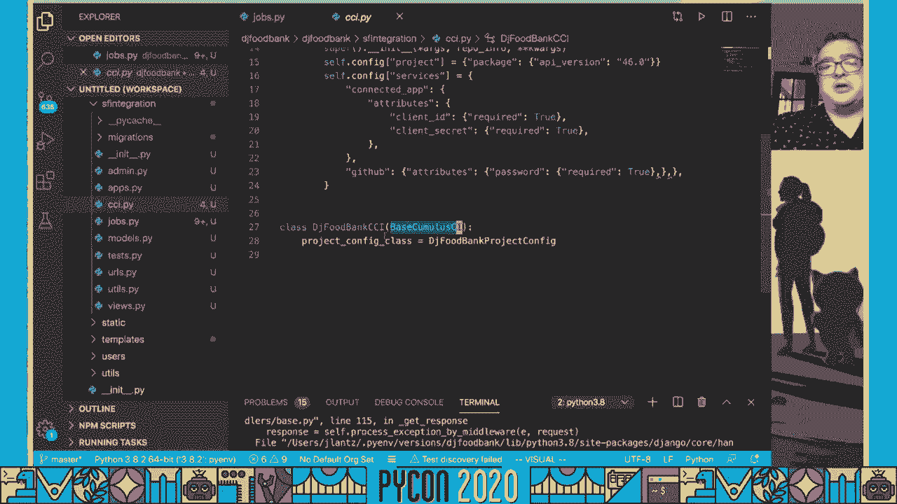

类。现在一个项目假定它将在 GitHub repo 内部运行。因此，在这种情况下。我想将 repo 信息作为字典提供。并且在这种情况下。我也只是选择了一个空的 cumulaci 配置。解析 yaml 的配置是 base project config 的子类。

它称为 yaml 项目配置，实际上会解析 yaml 文件。但在这种情况下。我们没有正在处理的仓库。我们想通过 API 指向一个仓库。因此，我只提供了项目所需的配置。

要运行我需要它运行的内容。所以它需要知道我们想要针对的 API 版本。它需要知道我想要连接的服务的描述。应用服务需要有属性客户端 ID 和客户端密钥。GitHub 服务需要有一个密码属性。就这些。

所以并没有太多对 cumulaci 的覆盖，但只是在子类中做的非常简单。结合这些内容，OAuth 集成。这种 cumulaci 的集成，使得能够运行 cumulaci 任务，针对用户的组织进行自动化。并且在这个作业部分的代码中实际进行数据同步。

一旦目标组织已被配置，你就拥有了一个相当完整的规模集成。现在再强调一下，所有这些实际上都是在过程中运行的集成。你不想在生产环境中这样做。应该将其放入后台工作队列，以异步方式处理，并进行重试。

以及错误监控等事情。你需要在前端用户体验上进行调整，以便在过程运行时向用户显示更新等。但是所有这些都是构建 Python Web 应用程序的标准部分。

这样你可以在此基础上发挥你的创造力和用户体验的方法。但 cumulaci 提供了构建这种集成所需的很多基础设施。因此，演示环节到此结束，我会为你提供一些额外信息的资源，首先。

如果你对 cumulaci 感兴趣，我真的建议你通过 Trailhead 学习。作为 Python 开发者，诚实地说，这可能需要你一天的时间，甚至更少。但这个 cumulaci 学习路线将让你实现我们在演示第一部分所做的很多事情，甚至更多，教你如何同步数据集。

它还将指导你上传托管包的过程，甚至构建一个扩展该项目的另一个仓库，具有客户特定的实施细节。此外，cumulaci 的文档可以在 cumulaci.readthedocs.io 找到。那是我们正在重做的文档，但有很多好的参考。

关于我们如何管理数据集的材料，关于我们与机器人框架的集成，以及一些你可以研究的 cumulaci 的单独功能。最后，有三个 GitHub 组织是深入探索的好地方。首先是 Salesforce Foundation，这是我们所有开源产品所在的地方。

因此，你可以找到 NPSP 的仓库。如果你真的想了解 cumulaci 及其所有不同功能，我强烈建议你访问这些开源项目的仓库，并查看其中的 cumulaci.yml 文件，以了解我们为项目实现的各种自动化方式。SFDO 工具是我团队的 GitHub 组织。

所有我们讨论过的开源工具都在这里。你可以看到所有这些工具的开发过程。最后，SFDO 社区是开放源代码公共项目的 GitHub 组织，这些项目由社区驱动，我们帮助支持和促进所有这些工具。

非常感谢你能够参加这次相当长的会议。我非常兴奋能够与 Python 社区分享这些。我对 Python 社区所建立的一切深表感激，这使得我或者我们能够创造出这个对一切至关重要的工具。

我们团队所做的确实帮助我们最大化在世界上创造的影响力。所以谢谢你。[BLANK_AUDIO]。

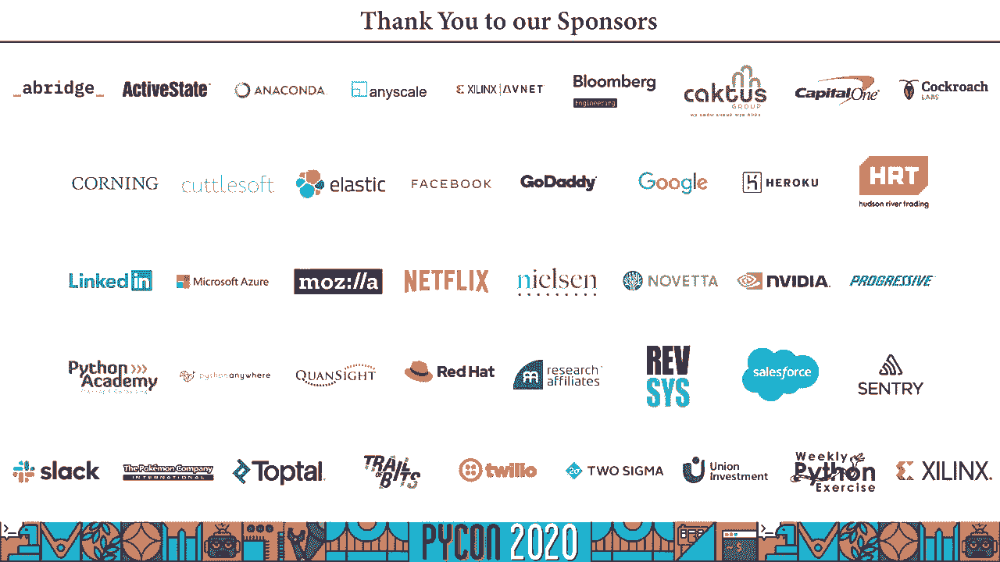
