# NVIDIA GPU加速数据科学：P14：RAPIDS生态系统全解析 🚀


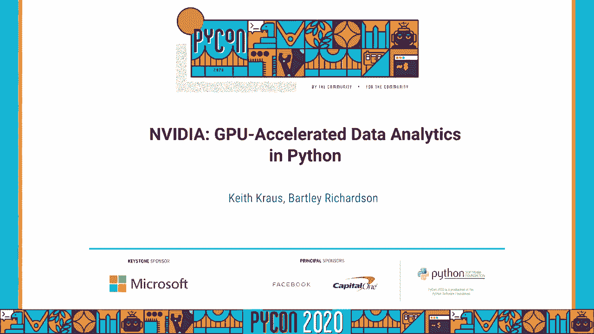

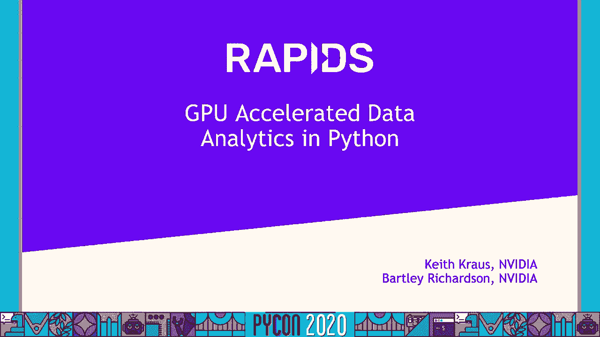

在本教程中，我们将全面学习NVIDIA的RAPIDS开源数据科学生态系统。RAPIDS旨在利用GPU的强大算力，加速从数据准备、特征工程到模型训练和可视化的整个数据科学工作流程。我们将逐一解析其核心组件，并通过代码示例展示其易用性和高性能。

## 概述：为什么需要RAPIDS？ 📈

传统的数据处理流程，尤其是在CPU集群上，涉及大量的数据读写和移动（例如，从磁盘到内存，从CPU到GPU），这成为性能瓶颈。RAPIDS的核心思想是**最小化数据移动**，让数据尽可能驻留在GPU内存中，从而获得高达50倍至100倍的端到端性能提升。这种速度优势使得数据科学家能够快速迭代，尝试不同的特征工程和模型，极大地提升了工作效率。

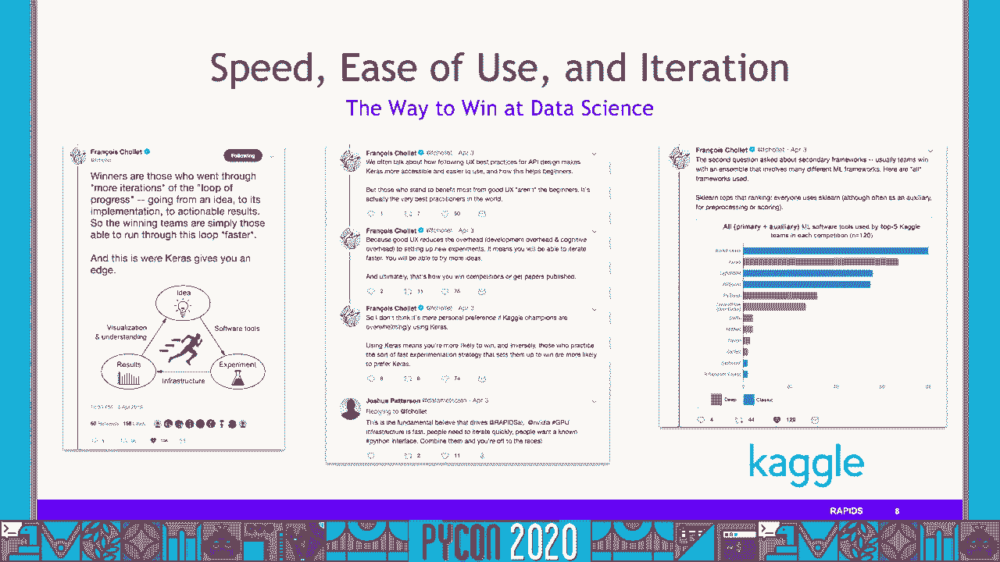

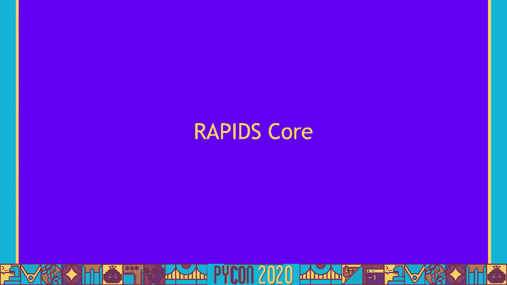

## 1：RAPIDS核心架构与设计理念 🏗️

上一节我们概述了RAPIDS的目标，本节中我们来看看其整体架构和设计理念。

RAPIDS并非一个单一工具，而是一个封装了整个数据科学管道的生态系统。它建立在CUDA和C++之上，但为数据科学家提供了熟悉的Python API，实现了高性能与易用性的结合。

其核心设计理念包括：
*   **GPU内存驻留**：减少CPU与GPU之间的数据拷贝。
*   **Pythonic API**：提供与Pandas、Scikit-learn等库相似的接口，降低学习成本。
*   **端到端加速**：覆盖ETL、分析、机器学习和可视化。

## 2：cuDF - GPU加速的数据帧处理 📊

数据准备和特征工程（ETL）占据了数据科学家大量时间。RAPIDS中的`cuDF`库正是为此而生，它提供了类似Pandas的GPU数据帧操作。

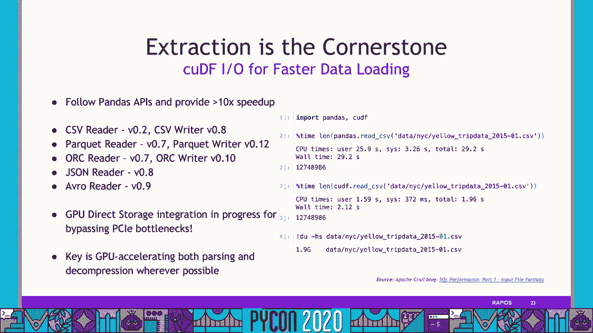

`cuDF`的技术栈底层是`libcudf` C++库，它使用优化的CUDA内核处理字符串、时间戳、数值类型等。上层的Python `cudf`库则提供了我们熟悉的API。


以下是使用`cuDF`读取CSV文件并进行简单操作的示例：

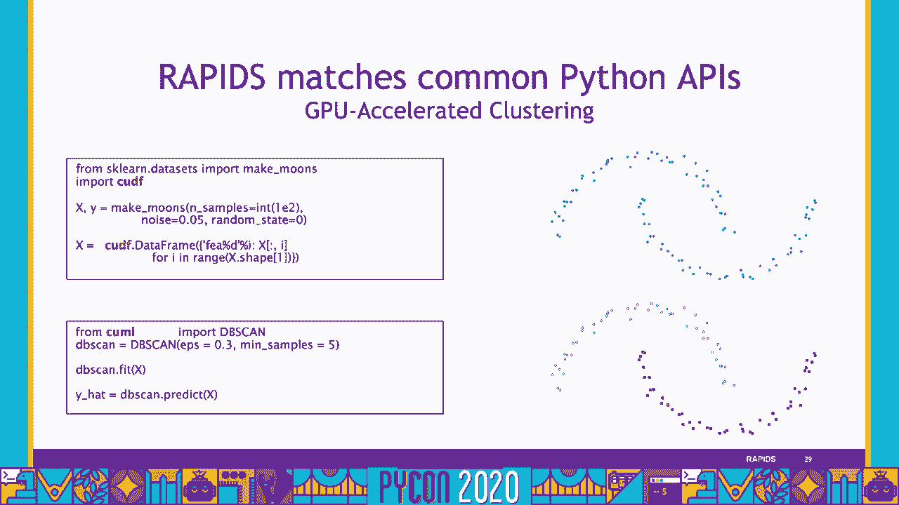

```python
import cudf

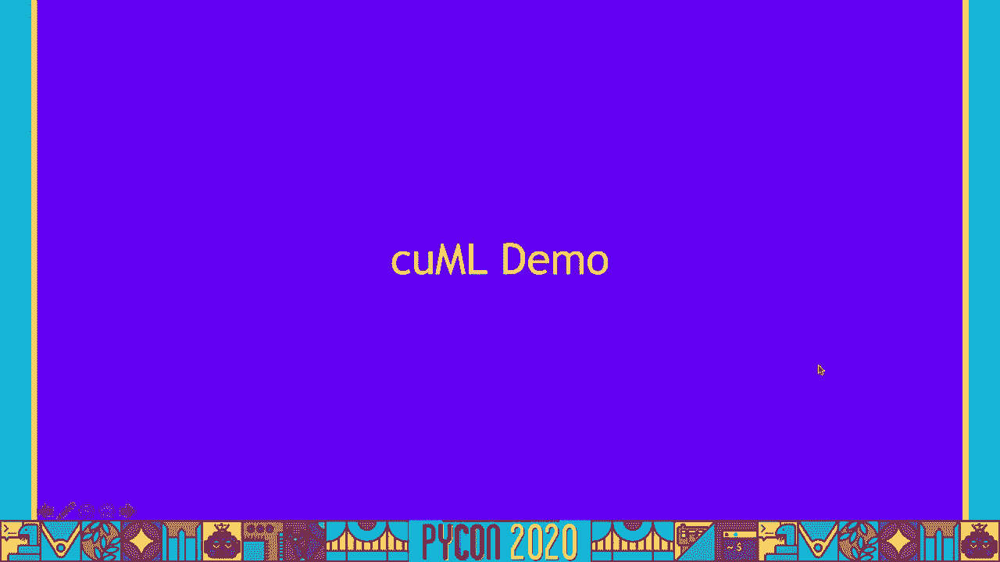

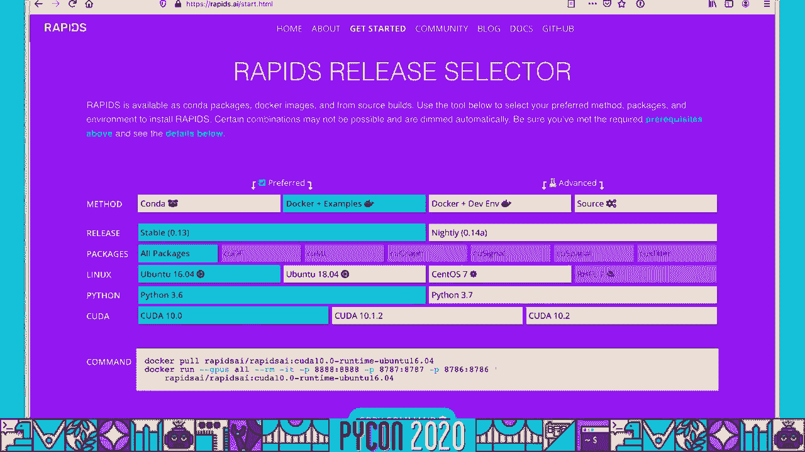

# 从CSV文件创建GPU数据帧，速度远超CPU读取
gdf = cudf.read_csv(‘my_data.csv’)

# 操作与Pandas高度相似
gdf[‘new_column’] = gdf[‘old_column’] * 2
filtered_gdf = gdf[gdf[‘value’] > 100]
grouped_gdf = gdf.groupby(‘category’).mean()
```

关键优势：
*   **高性能I/O**：支持快速读写CSV、Parquet、ORC、JSON、Avro等格式。
*   **强大的字符串操作**：完全在GPU上支持正则表达式、拆分、连接、排序等。
*   **无缝扩展**：可与Dask结合，进行多GPU或多节点分布式数据处理。

## 3：cuML - GPU加速的机器学习算法 🤖

在高效完成数据准备后，下一步就是模型训练。`cuML`库提供了与Scikit-learn兼容的GPU加速机器学习算法。

`cuML`同样构建在CUDA加速的C++原语之上，并通过Python绑定提供易用接口。其算法覆盖广泛，从0.2版本仅有的几个算法，发展到如今包含：
*   **分类与回归**：随机森林、梯度提升树、逻辑回归、支持向量机（SVM）、k-最近邻（KNN）。
*   **聚类**：K-Means、DBSCAN。
*   **降维**：主成分分析（PCA）、均匀流形近似与投影（UMAP）、t-SNE。
*   **时间序列、模型评估与超参数调优**等。

使用`cuML`与使用Scikit-learn的代码差异极小：

```python
# Scikit-learn (CPU) 版本
from sklearn.cluster import DBSCAN
cpu_dbscan = DBSCAN(eps=0.3, min_samples=10)
cpu_labels = cpu_dbscan.fit_predict(cpu_data)

# cuML (GPU) 版本
from cuml.cluster import DBSCAN
gpu_dbscan = DBSCAN(eps=0.3, min_samples=10)
gpu_labels = gpu_dbscan.fit_predict(gpu_data) # gpu_data 是一个 cuDF DataFrame 或数组
```

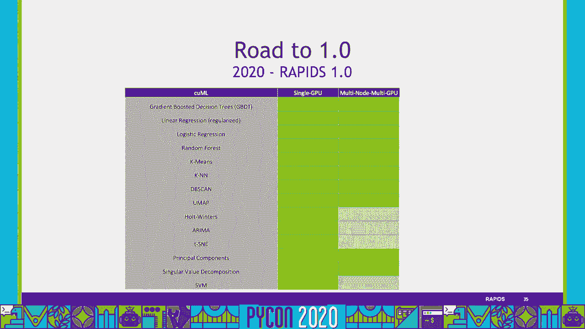


**演示：DBSCAN聚类加速**
在一个随机生成的数据集上，`cuML`的DBSCAN仅需约3毫秒，而Scikit-learn的CPU版本需要约30毫秒，实现了近10倍的加速。这使得数据科学家能够以“思考的速度”进行模型迭代。

## 4：cuGraph - GPU加速的图分析 🕸️

对于图数据（如社交网络、网络安全日志、推荐系统），`cuGraph`提供了高效的GPU加速图分析能力。

`cuGraph`将`cuDF`数据帧解释为图结构，并在此之上执行算法。它支持存储和分析数亿甚至数十亿条边。

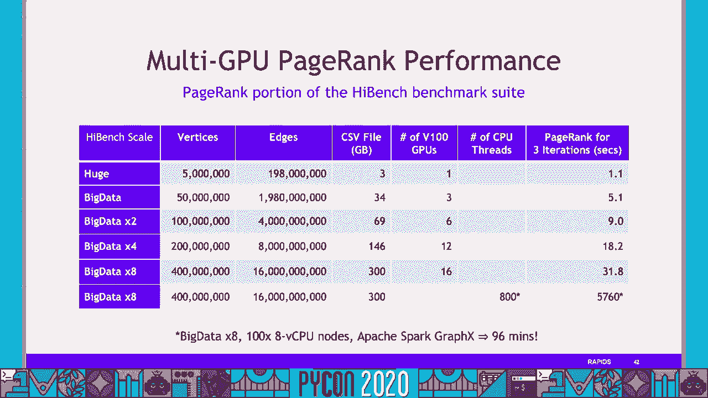

可用的算法包括：
*   **社区检测**：Louvain、K-Truss。
*   **链接分析**：PageRank、个性化PageRank。
*   **遍历与路径查找**：广度优先搜索（BFS）、单源最短路径（SSSP）。
*   **中心性度量**：度中心性、接近中心性、介数中心性。
*   **连通分量**：弱连通分量、强连通分量。

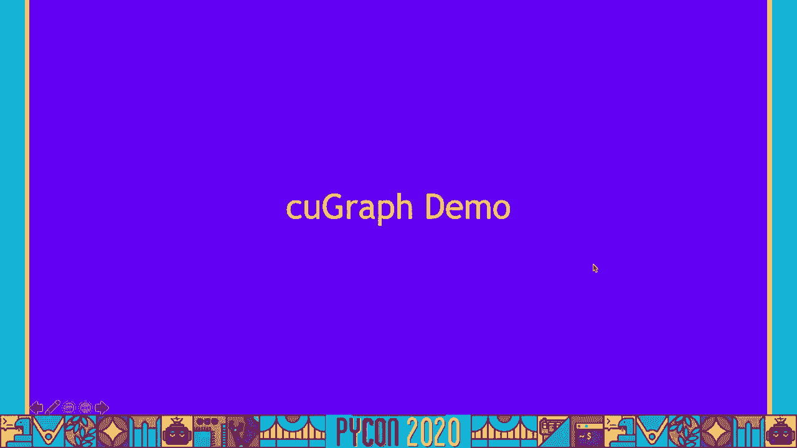

使用示例极其简单：

```python
import cugraph

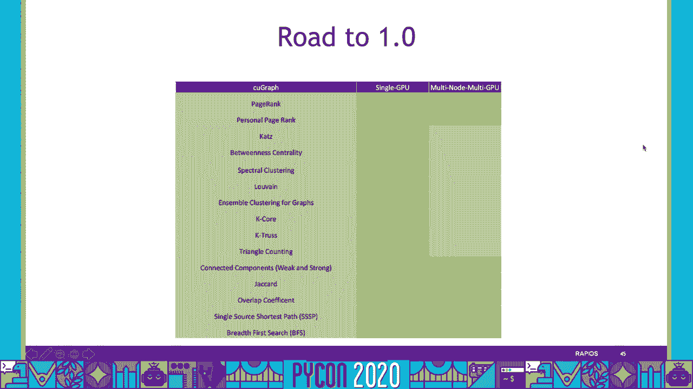

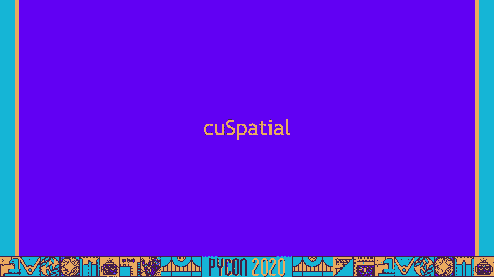

# 从边列表创建图
G = cugraph.Graph()
G.from_cudf_edgelist(edges_df, source=‘src’, destination=‘dst’)

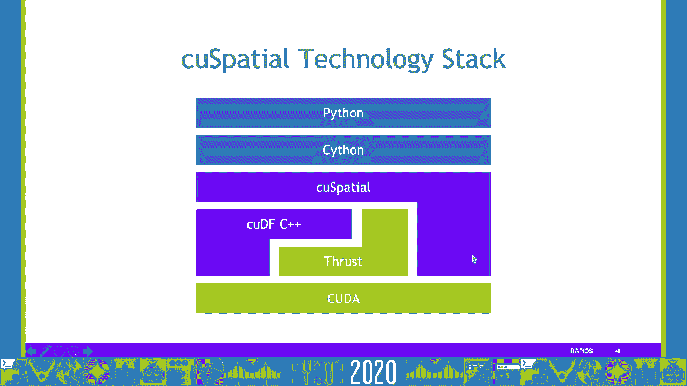

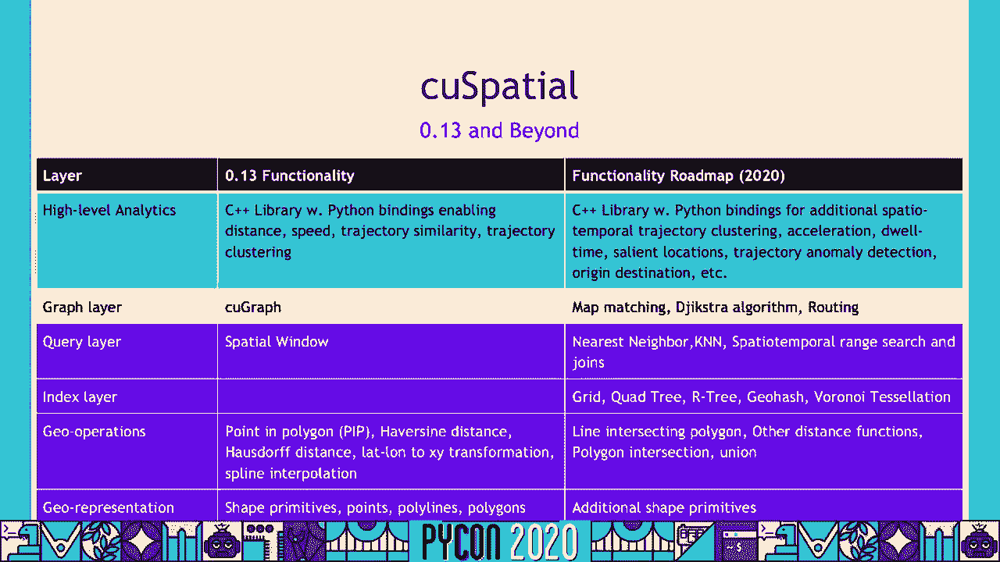

# 执行PageRank算法
pagerank_df = cugraph.pagerank(G)

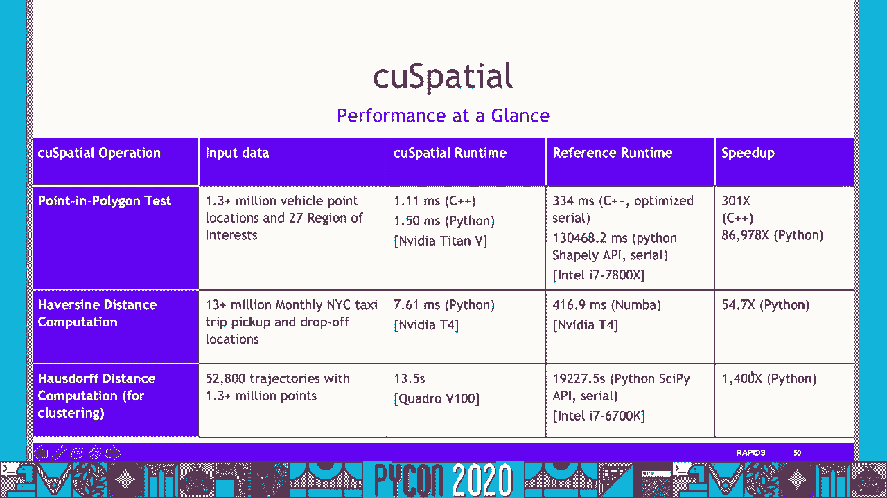


# 查找弱连通分量
components_df = cugraph.weakly_connected_components(G)
```

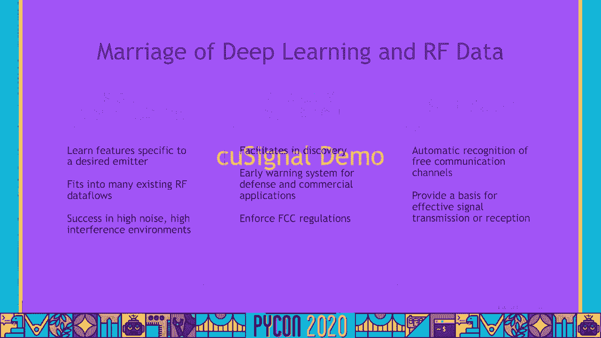

**性能基准**：在一个拥有1.6亿顶点和160亿边的巨型图上，使用16个V100 GPU进行3次PageRank迭代仅需318秒，而使用108个CPU节点（800个vCPU）的Apache Spark GraphX则需要约96分钟（5760秒），性能提升超过18倍。

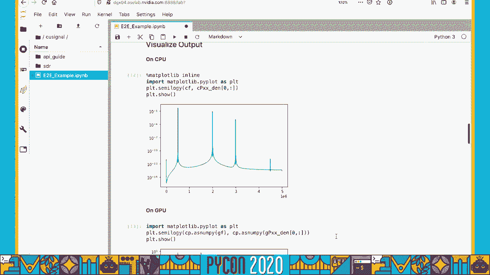

## 5：其他核心组件与生态系统 🌐

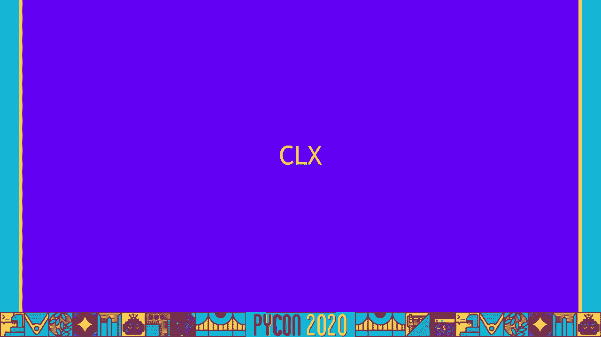

除了上述三大核心库，RAPIDS生态系统还包括其他专注于特定领域的库：

*   **cuSpatial**：用于GPU加速的地理空间数据处理，如距离计算、范围查询、轨迹分析，相比CPU库可提升数千倍性能。
*   **cuSignal**：用于GPU加速的信号处理，提供卷积、滤波、重采样、频谱分析（如周期图、谱图）等功能，完全在Python中利用CUDA内核开发。
*   **CLX (Cybersecurity Learning eXchange)**：面向网络安全工作流程的库和示例集合，集成了RAPIDS、PyTorch等，用于日志解析、动态网络映射、威胁警报分析等任务。

## 6：如何开始与社区参与 🚪

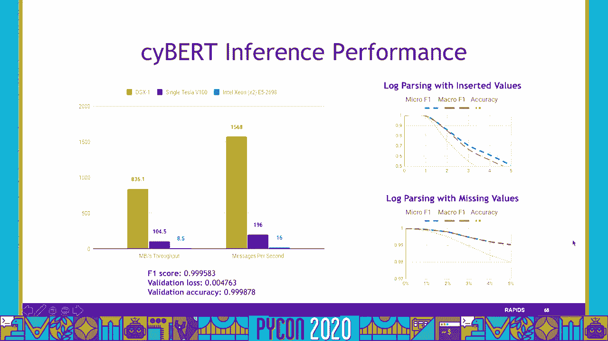


RAPIDS是开源项目，拥有活跃的社区。你可以通过以下方式快速开始并参与其中：

1.  **快速安装**：访问 [RAPIDS官网](https://rapids.ai)，使用“RAPIDS Release Selector”选择适合你环境（Docker、Conda、Google Colab）的安装命令。对于新手，推荐使用Docker镜像，它包含了所有示例。
    ```bash
    # 示例：拉取带有示例的Docker镜像
    docker pull rapidsai/rapidsai-core:latest
    ```
2.  **运行示例**：所有演示教程（Jupyter Notebook）都包含在安装包或Docker镜像中，你可以边学边练。
3.  **获取帮助与贡献**：
    *   **GitHub**：提交问题（Issue）或功能请求（Feature Request）。
    *   **社区**：加入RAPIDS的Slack频道或Google Groups参与讨论。
    *   **Stack Overflow**：使用`[rapids]`标签提问。
    *   **贡献**：欢迎提交代码（Pull Request）、撰写博客分享使用经验。

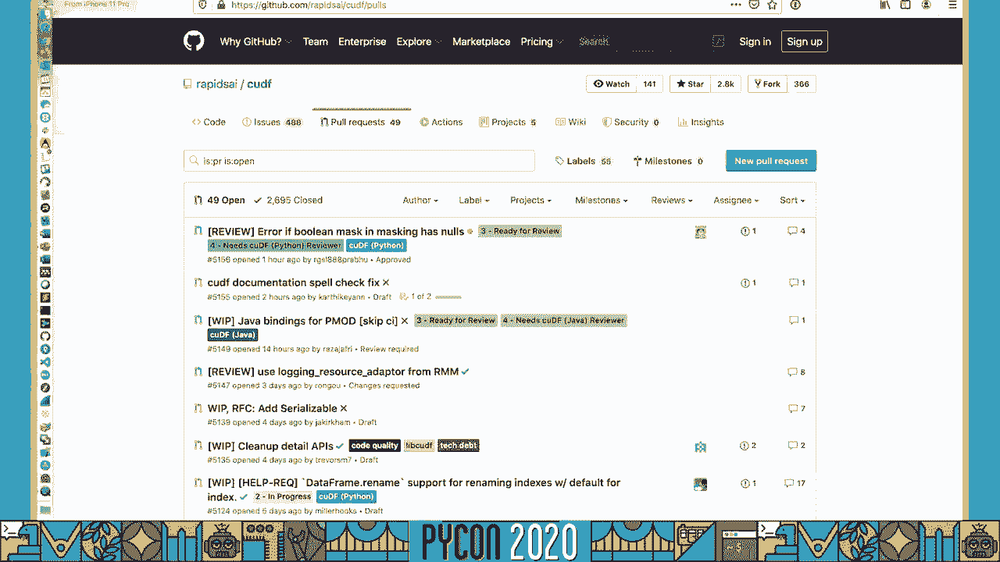

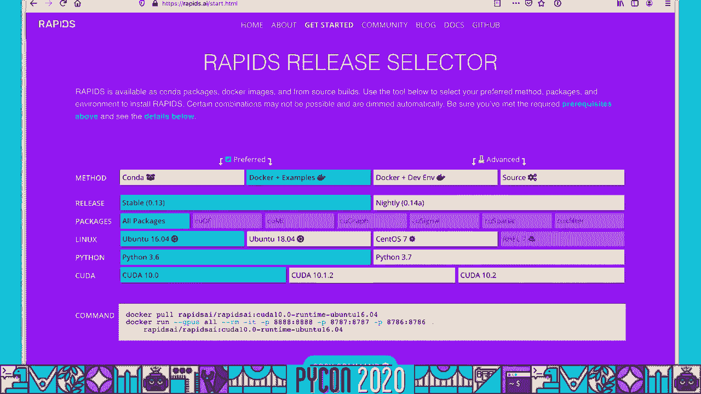

## 总结 🎯


本节课中我们一起学习了NVIDIA RAPIDS生态系统。我们从其**减少数据移动、提升迭代速度**的设计理念出发，深入探讨了其四大核心组件：
*   **`cuDF`** 用于GPU加速的数据准备与ETL。
*   **`cuML`** 提供了与Scikit-learn兼容的GPU加速机器学习算法。
*   **`cuGraph`** 专为大规模图分析设计。
*   **`cuSpatial`、`cuSignal`、`CLX`** 等库则服务于更专业的领域。

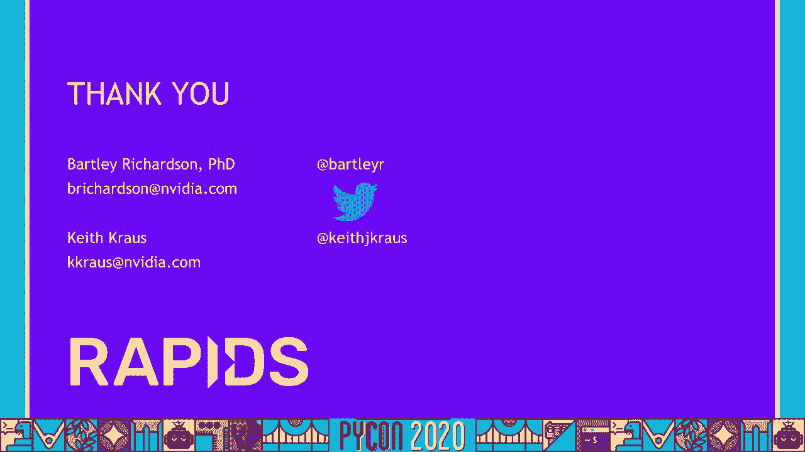

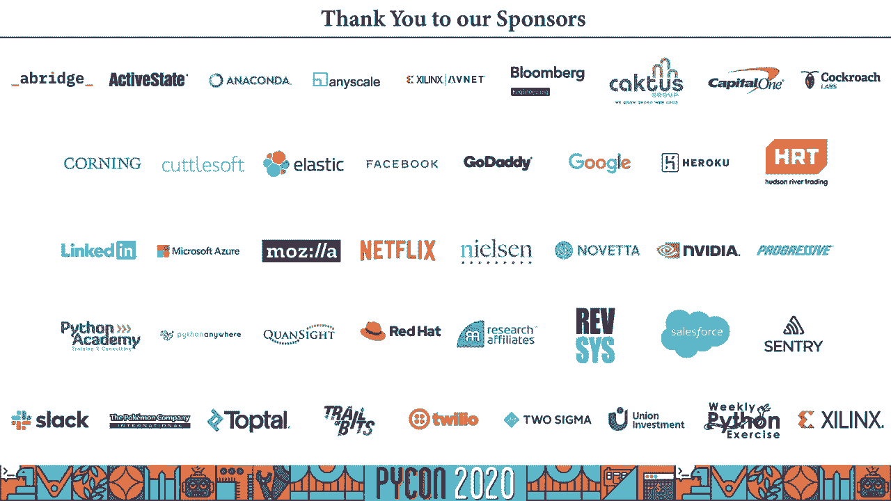

RAPIDS通过提供熟悉的Python API，将GPU的强大计算能力无缝融入现有数据科学工作流，使数据科学家无需深入CUDA编程即可获得巨大性能提升。无论是单GPU开发还是通过Dask进行多GPU/多节点扩展，RAPIDS都旨在让数据科学工作更快、更高效。现在，你可以访问其官网和GitHub仓库，开始你的GPU加速数据科学之旅。