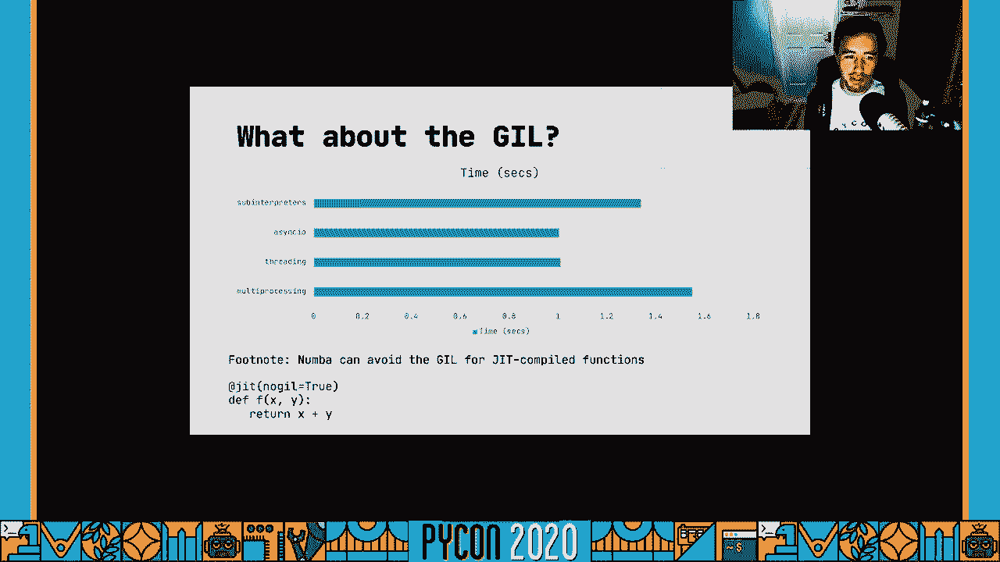

# Python性能剖析：P22：为什么Python慢


在本节课中，我们将深入探讨一个经典话题：为什么Python（特指CPython）在某些场景下运行速度较慢。我们将从编译原理、解释器架构、即时编译（JIT）技术、内存管理等多个角度，科学地分析其性能瓶颈，并了解现有的优化方案和替代选择。

---

## 1. 🚀 性能对比：一个直观的例子

上一节我们提出了核心问题，本节中我们来看看一个具体的性能对比案例。

当我们谈论“Python慢”时，通常指的是官方的CPython解释器。让我们通过一个CPU密集型基准测试——模拟木星、土星、天王星和海王星轨道的N体问题——来直观感受一下。

*   **C语言实现**：执行时间约为 **7秒**。
*   **CPython实现**：执行相同算法需要 **14分钟**。

这个差距是数量级的。虽然C是强类型编译语言，而Python是动态类型解释语言，直接比较可能不公平。但同为动态类型语言的Node.js（使用V8 JavaScript引擎）在该基准测试中也比CPython快得多。这引出了我们的核心疑问：为什么？

---

## 2. ⚙️ CPython如何运行代码

要理解性能差异，我们需要先了解CPython执行代码的流程。上一节我们看到了性能差距，本节我们来剖析CPython的内部工作机制。

Python代码是跨平台的。当执行一个`.py`文件时，解释器会按以下步骤工作：

1.  **解析**：将源代码解析成**抽象语法树**。
2.  **编译**：编译器遍历AST，生成**控制流图**，然后将其转换为连续的**字节码**指令。
3.  **执行**：**求值循环**（一个巨大的`switch`语句）逐条获取并执行字节码指令。每个函数调用会创建一个**栈帧**，用于管理局部变量、返回地址等信息。

为了提升效率，编译后的字节码会被缓存（存储在`__pycache__`目录中），下次运行相同代码时可直接加载。

**关键点**：CPython是一个**提前编译器**。代码在执行前已被完全编译为字节码。执行时，解释器循环（`ceval.c`中的主循环）负责解释这些字节码，而许多字节码操作最终会调用已编译的C函数。

---

## 3. 🔁 性能瓶颈：紧密循环问题

既然很多工作由高效的C代码完成，为什么CPython还是慢？线索就在那个“求值循环”里。上一节我们了解了执行流程，本节我们来看看其中的开销。

这个循环的每次迭代都不是免费的。对于每个简单的字节码操作（例如加法），解释器都需要：
*   取指（获取下一条字节码）。
*   解码（通过`switch`判断执行哪个分支）。
*   执行操作。

在N体测试这类**紧密循环**中，代码包含数百万次简单的算术运算。CPython解释器将大量时间花费在循环开销上，而不是实际计算上。

**公式表示**：
```
总执行时间 ≈ (实际计算时间) + (循环迭代次数 × 单次循环开销)
```
当循环迭代次数极大且单次操作很简单时，循环开销就占据了主导地位。

---

## 4. ⚡ JIT编译器的威力

那么，如何解决紧密循环的开销问题？答案是**即时编译器**。上一节我们看到了AOT编译的瓶颈，本节中我们来看看JIT如何优化。

与CPython的AOT编译不同，JIT编译器在程序运行时进行编译。它能监控代码执行，识别“热点”（被频繁执行的代码段，如循环），并将其动态编译成更高效的机器码。

**PyPy**是一个用Python编写的Python解释器，它内置了JIT编译器。在N体测试中，**PyPy比CPython快约650%**。这证明了JIT在优化重复性任务上的巨大潜力。

**核心概念**：`JIT`编译器能够分析数据流，在运行时改变代码的编译和执行方式，将多个操作“融合”在一起，极大减少了循环开销。

另一个例子是**Numba**，它是一个针对数值计算的JIT编译器，可以作为CPython的扩展使用。通过一个简单的装饰器，就能让函数运行速度大幅提升。

```python
from numba import jit

@jit(nopython=True)
def fast_function(x):
    # 你的数值计算代码
    return result
```

---

## 5. 🧠 中间表示与优化

为什么V8（Node.js）和PyPy的JIT如此高效？关键在于它们使用的**中间表示**。上一节我们介绍了JIT的概念，本节我们深入其优化原理。

CPython的中间表示是线性的**字节码序列**，执行顺序是固定的。

而现代JIT编译器（如V8的Turbofan、PyPy）使用**静态单赋值**形式的中间表示。在这种表示中，所有变量和操作都成为一张巨大数据流图的节点，边表示数据依赖关系。

**优势**：
*   编译器可以清晰地看到数据如何流动。
*   能够轻松识别并消除**死代码**（不影响结果的代码）。
*   可以更智能地调度指令，让CPU以最高效的方式执行。

这种基于数据流的优化能力，是V8和PyPy在动态语言上也能实现高性能的重要原因。

---

## 6. 🚫 为什么CPython没有内置JIT？

既然JIT这么好，为什么CPython不加入一个呢？这主要有几个原因：

1.  **与C扩展的兼容性**：CPython生态的核心优势之一是能无缝调用C扩展模块。JIT编译器需要分析代码结构和数据流来进行优化，但编译好的C扩展模块对JIT来说是一个“黑盒”，无法优化。这会导致性能收益大打折扣。
2.  **设计哲学与复杂度**：CPython编译器的设计强调**简单**和**通用**。引入JIT会极大增加复杂性，违背其设计原则。JIT本身也有内存开销和启动时间成本。
3.  **开发资源**：开发并维护一个高质量的JIT编译器需要巨大的、持续的工程投入（参考由大型公司支持的V8团队）。CPython主要由志愿者在业余时间维护，资源有限。

---

## 7. 🗃️ 内存管理与垃圾回收

性能不仅仅是CPU速度，内存管理也至关重要。上一节讨论了执行优化，本节我们看看内存方面的表现。

CPython使用**引用计数**作为主要内存管理机制。每个对象都有一个计数器，记录引用它的变量数量。当计数归零时，对象立即被销毁。

但是，**循环引用**（例如，两个对象互相引用）会导致引用计数无法归零。为此，CPython配备了**分代垃圾回收器**，它会定期扫描并清理存在循环引用的对象。

**问题**：CPython的GC是“停止世界”的。在GC运行时，所有其他操作都会暂停。虽然停顿时间很短，但在某些场景下仍可能产生影响。

相比之下，V8等引擎的GC使用了更复杂的策略（如并行标记），可以进一步减少主线程的暂停时间。但这同样意味着更高的实现复杂度。


---

## 8. 🧵 并行计算：GIL与解决方案

**全局解释器锁**是CPython中另一个著名的“性能杀手”。它确保同一时刻只有一个线程执行Python字节码，这限制了多核CPU的利用。

对于CPU密集型并行任务，有以下解决方案：
*   **`multiprocessing` 模块**：创建多个进程，每个进程有独立的解释器和内存空间，绕过GIL。适用于任务可拆分且进程启动开销相对较小的场景。
*   **使用替代解释器**：如PyPy（也有GIL）或Jython/IronPython（无GIL）。
*   **将关键部分移至C扩展**：在C扩展中释放GIL。
*   **异步I/O**：对于I/O密集型并发任务，`asyncio`是更轻量、高效的方案。
*   **子解释器**：Python 3.9+引入了实验性的子解释器功能，允许在同一个进程内运行多个隔离的解释器，比多进程更轻量，是未来解决并行问题的一个有潜力的方向。



---

## 9. ✅ 总结与选择

本节课中，我们一起深入探讨了“为什么Python慢”这个问题。

**核心总结**：
1.  **紧密循环开销**：CPython的解释器循环在大量简单操作上开销显著，这是其处理数值计算时慢的主要原因。
2.  **JIT的缺失**：由于兼容性、复杂度和资源限制，CPython没有内置JIT编译器，而JIT正是V8、PyPy等实现高性能的关键。
3.  **通用性设计**：CPython的设计目标是简单和通用，而非针对特定场景（如数值计算）进行极致优化。
4.  **优化有代价**：所有优化（JIT、高级GC、无GIL）都伴随着复杂性、内存开销或开发成本的增加。

**给开发者的建议**：“Python慢”这个说法需要细化。**CPython在它设计的目标场景（如脚本、文本处理、胶水逻辑）中是非常有效的**。当你遇到性能瓶颈时，应首先分析问题类型：
*   **CPU密集型/紧密循环**：考虑使用**PyPy**、**Numba**或将核心部分用C/C++编写。
*   **并行计算**：使用`multiprocessing`、`concurrent.futures`或关注**子解释器**的未来发展。
*   **I/O密集型**：使用`asyncio`进行异步编程。


Python生态系统提供了多种解释器和工具，**选择最适合你问题领域的工具，而不是期望一个通用解释器在所有场景下都表现最佳**。理解这些底层原理，能帮助我们做出更明智的技术选型和优化决策。