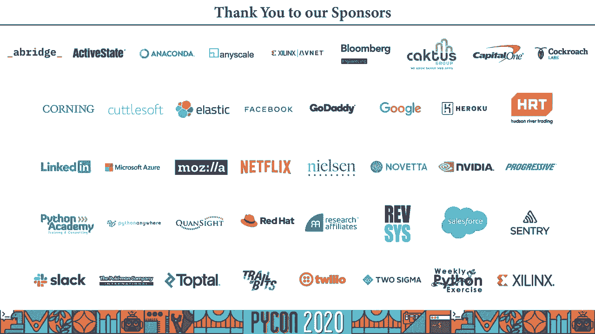

# P25：与卡罗尔·J·史密斯对话 - 实施伦理 发展可信赖的人工智能 - 程序员百科书 - BV1rW4y1v7YG

我是卡罗尔·史密斯，欢迎来到我的虚拟会议，讨论实施道德发展可信赖的人工智能，让我们深入探讨。因此，您的目标是建立一个安全且可信赖的人工智能系统，今天我将讨论一些工具，它们可以帮助您实现这个目标，并在您的工作中取得成功，这是早期有目的的工作，所以这不仅仅是算法的问题，我也会提到，相互作用，您希望注入到系统中的工作，您想带入的价值观，以及如何达到成功的标准。第一步是拥有一个多样化的团队。我所说的多样性不仅包括种族、性别和文化，还包括教育背景、团队参与过的项目、思维过程、残疾统计数据等更多差异。这些多样性因素可以使团队更强大，而不是降低标准，我们讨论的是扩展空间，为这种多样性腾出空间，这些不同个体当然需要才华，同时也是多学科的，因此，这与上下文密切相关。

您可能需要更多的数据科学家和程序员，另一个方面是吸引好奇心专家、UX 设计师、互动专家，甚至数字人类学家，他们会真正专注于了解使用系统的人的能力及系统的使用方式。他们将帮助您回答有关人们如何、为什么使用系统的问题，伦理学家和更多角色，但同时保持这些团队的规模，这不是一个容易解决的问题，但重要的是要弄清楚这一点，为您所打造的产品的质量。正如我提到的，在不同团队中有很高的价值，哈佛商业评论提到的一点是，他们更注重事实，更仔细地处理事实。他们变得更有创意，因为他们的桥梁作用，汇聚了不同的思维方式。作为个体，他们可能更意识到自己的潜在偏见，因此在处理这些事实时更加小心，所以这个多元化的团队汇聚在一起。

由于团队成员的不同，他们思考问题的方式可能与非常相似的团队不同，他们更容易注意到有着相似教育或经历的团队，可能不会意识到优秀头脑思维的不同之处，这是一个重要的价值观，我们希望继续推进。因为我们正在开发人工智能系统，如果没有这种多样性，记忆力可能会受到影响。您可能注意到，您可能去过的工作场所，有个人被雇佣，他们与其他人截然不同，但却未能留下。这是因为他们没有看到那里的领导，支持他们的人，或至少是与他们不同的人，个体差异需要被认可和接受。因此，让我们全身心投入工作，现在大家都在家办公，至少我希望你是。嗯。这实际上有助于展示我们生活中的多样性，人们带着他们的，嗯，宠物和婴儿，以及他们生活中的其他人进入我们的屏幕，这有助于创造一个更受欢迎的社区环境，让人们感到有价值和归属。

这一切都将有助于建立一个更好的系统，下一步是采纳技术伦理，您会看到许多不同版本的伦理学，其中一些是由诸如 ACM 计算机协会等组织创建的，其他则来自企业组织如微软、谷歌，还有些来自蒙特利尔宣言等组织。这些帮助您协调不同的文化，因此当您将一个非常多样化的团队聚集在一起时，您需要一些东西将他们绑定在一起，弥合他们思维方式的变化或差异，这能帮助您做到这一点，并加快变化的步伐。行业压力可能会推动您越来越快地行动，但技术伦理可以帮助您联系到真正重要的东西，帮助您知道团队正在努力做什么，专注于目标。它还明确允许团队中的所有个人考虑和质疑系统影响的广度，因此这真的帮助他们感受到在质疑中扮演着重要角色，了解发生了什么，为什么要做决定，这正是您希望重视的内容。

在您的团队中鼓励成员足够舒适，尽早提出担忧，因此您可以处理这些问题，减轻和防止问题的发生，因此当这个团队在共享的技术伦理上结合在一起时，我实际上推荐的是蒙特利尔宣言。这篇文章包含一长串广泛的想法、主题，因此它几乎涵盖了您在组织中遇到的所有技术，这很好，因为您可以从这一套开始，决定如何使用它，什么是有效的，什么是无效的。您可以开始定制您的技术伦理，使其与您的组织最协调，围绕这些技术伦理的团结只是建立团队的一部分，因此您有一个多样化的多学科团队，有一套共享的技术伦理，每个人都可以聚集在一起。利用这一点来帮助指导他们制造这些伟大的人工智能系统，因此要真正完成这项工作，您需要一个框架将所有内容联系在一起，这就是我今天要介绍的，可信赖的人工智能，这将帮助您到达目标。

您要制造值得信赖的道德人工智能，因此使用这一套技术伦理，并将其与框架联系在一起，我们将找到可靠的道德人工智能，这涉及大量对话，以帮助人们相互理解，明确系统的目的，制定这些主题的框架。这样，您可以讨论您的价值观，谁可能会受到制度伤害，我们的人工智能不会跨越什么界限，我们如何转移权力，如何跟踪我们的进展，这些都是需要尽早考虑的重要问题，还有许多更多，通过框架进行对话。如果您鼓励这些对话，它们就会发生，对许多人来说，这可能是一个新且不舒服的工作，不幸的是，这项工作几乎每个人都感到不适，伦理设计并非肤浅，劳拉·哈尔伯格在讲话中提到过。这项工作可能会很不舒服，但至关重要，因为能够保护我们应该帮助的人是重要的，因此我们必须这样做，您可以使用清单提示这些对话，因此这是一个检查表，我研究过，那里有一个二维码，您可以扫描下载。

你要做的就是将清单与您的技术伦理结合起来，这样你就有了一套道德规范，您需要弥合陈述之间的差距，比如不会造成伤害和您希望用系统做什么，这将帮助您减少系统中的风险和不必要的偏见，并进行减灾规划。这样也能支持检查，让你了解自己在检查什么，为什么需要这样做，从而使您的系统尽可能合乎道德，因此，检查表中的提示将有助于揭示隐藏的任务。这些是我建议的清单中的一些例子，我们努力推测所有的风险和收益，因此如果你没有做过这些不同的项目，可能会有一些隐藏的任务需要您识别并放入您的积压工作中，并实际将责任交给团队中的某个人来解决这个问题，可能意味着您需要完成许多任务。也许您只需再做一件事，以确保一切如您所愿，这将帮助您确定自己是否做对了工作，这四个人对人类负责，认识到投机风险和收益，尊重、安全、诚实、可用，我会逐一检查。

我将使用一个场景来帮助你把它联系在一起，这是正确的员工情况，右员工是人工智能排班系统，用户是快餐店的店长，因此，正确的员工的目标是改善人员配置的决策和改善日程安排，也是为了减少轮班调度和轮班选择的偏见。在餐馆里发生的事情是，经理的朋友得到了更好的轮班和更多的轮班，而其他人没有，因此，这里有很多偏见和不公平。因此，这个系统的建立是为了减少这些方面的不公平，对人类如此负责，这是框架的第一个方面。它说要确保人类有最终的控制权，我们能够监控和控制整个系统和整个生命周期的风险。人类有责任对一个人的生命做出最终决定，他们的生活质量，他们的健康和名誉，这实际上是为了确保人类可以拔掉机器的插头。格雷迪·布奇在他的 TED 演讲中这样说，这是我今天要讲的大部分工作的核心。我们想确保人类永远处于控制之中，在整个系统的生命周期中，人类都在循环中，这绝不是一个你设定了它就忘记了它的情况。

而是人类持续不断地监控和管理这些系统，系统可能作出的重大决定需要加以解释，它们需要能够被覆盖，对人类来说是可逆的，对正确的工作人员来说也是如此。当我们想到这种情况时，经理应该能够根据需要重新安排人员。所以人工智能系统可能会做员工的初始调度，但是经理需要能够进来并根据需要做出改变，这就是这个框架如何影响特定系统的一个例子。人工智能系统和人类之间的责任需要明确界定，所以有了合适的工作人员。有人工智能系统，正确的工作人员，他们是经理，所以我们需要决定谁来挑选员工，我们如何定义轮班，谁做这项工作，如何整合新信息，例如，如果一些合适的员工因 COVID 而生病，不幸的是，我们如何管理这个系统。我们该怎么处理这种情况，是人工智能系统还是经理在真正处理这个问题，辞职怎么样，如有必要，我们怎样换班？我们如何处理那个人的缺席，是系统还是经理在做这项工作？另一个例子是，如果正确的员工注意到有问题。

我们会希望他们能够关闭自己吗，如果系统里有问题，如果它真的关闭了，有什么影响，我们如何向员工传达这一点，如有必要，这对他们的日程安排有什么影响，当它重新打开时会发生什么，这对他们的日程安排有什么影响。因此，尽早思考这些影响将有助于我们建立一个稳健和可信的系统，因为需要使用它的人类。第二个方面是认识投机风险和收益，所以这是关于识别所有有害和恶意使用的范围，以及系统的良好和有益的使用，思考盲点。不必要和意外的后果，会有很多意想不到的事情发生，但我们对该系统的潜在结果的猜测就越多，我们对付他们的准备就越充分，激活团队内部的好奇心，我们可以推测所有类型的滥用和滥用，但我们真的只需要考虑最坏的情况。你可以通过一个叫做黑镜的活动来做到这一点，如果你熟悉电视节目，你可以想象黑镜事件对你的系统会是什么样子，这让你能够识别潜在的严重滥用或误用以及这些潜在的后果。

在匹兹堡的一个研讨会中，已经成功地进行了多次，我强烈推荐你们组织开展这种活动，以便权利工作人员的潜在可用性。如果我们回顾它的目标，这是为了更快的人员决策和日程安排，减少轮班选择的偏见。因此，考虑合适的员工以及它如何可能被滥用，假设该系统开始优先考虑调度更容易的人，调度系统中冲突较少的人，如果经理们继续批准那些可能会加剧偏见的时间表，这在过去已经是一个问题。因此，系统可能无意中再次开始强化同样的问题，因此，我们需要对这种情况进行猜测，并尽早识别它，然后考虑我们将如何创建沟通和缓解计划，处理这种情况，因此要做好万全的准备。把这看作是一个潜在的问题，然后我们如何处理，谁可以报告，我们应该把系统关掉给谁？如果我们把它关掉，我们需要通知谁，那么关闭系统或改变系统的后果是什么，或者嗯，取消日程安排，仔细考虑一下。

这将有助于你做好准备，如果出现这种情况，或防止这种情况，理想的尊重和安全，是这个框架的第三个方面，这是关于重视人性，道德操守，公平，无障碍，它需要评估在这些类型的环境中重要的东西。增强系统的鲁棒性，有效可靠，提供可理解的安全保障，所有这些都是人类信任这些系统所必需的方面。所以为了正义，工作人员，尊重和安全，可能是关于谁有能见度，由于更改时间表的原因。人们可能会和经理们分享一些非常私人的原因，但他们不想在系统中被其他经理看到。如果这些信息被输入到系统中，它是如何使用的，这些信息会发生什么，雇员的个人身份信息是如何得到保护的？

我们在做什么来确保圆周率远离其他人的手，并在系统中得到安全和保护，诚实和可用是框架的第四个方面，这是关于重视透明度，以产生信任为目标。我们需要明确地说明作为人工智能系统的身份，如果这有可能让人困惑。比如在聊天系统里，我们需要确保我们提醒人类，在这种情况下，他们正在与人工智能系统交谈。公平也是其中的重要一环，最初消除数据中不必要的偏差是一种理想的情况，但这并不总是可能的，因此。我们至少需要表现出对已知和可取的偏见的认识，所以经常会有一个系统偏向一个特定的方向，因为这是该组织的目标，以确保人们意识到一种特定类型的信息，而不是因为任何原因而意识到另一种类型的信息。但我们需要承认这个问题，并就此进行过度沟通，让人们真正了解这个系统及其对合适员工的限制，该系统的建立是为了在理想的情况下减少现有数据中已知的偏差，但如果偏见是一个潜在的问题。

我们也需要让报告偏见变得容易，或者在理想的情况下预防它。所以如果我们能建立一个系统来减少这种偏见，那就太好了。如果我们不能，我们需要减轻这个问题，我们需要有意识地围绕这四个方面来保护人们的安全。围绕这四个方面，我们可以让道德人工智能系统开花结果，对人类如此负责，认识到投机风险和收益，尊重和安全，诚实有用。我们并不完美，所以我们建造的人工智能也不会是完美的，在我们所做的工作中。我们需要采用技术伦理才能将彼此团结在一起，让我们团结在一起，我们可以分享的东西，我们需要通过使用清单和其他类型的提示来鼓励深入的对话，我们需要激发好奇心。因此，他们的团队对该系统的使用和滥用方式进行了猜测和想象，另一个想法是奖励发现伦理漏洞的团队成员，这来自艾安娜·霍华德博士，她最近与莱克斯·弗里德曼在人工智能播客上发表了讲话，这是一个很好的方式来支持你的团队。

引诱他们去做正确的工作有助于建立一个伟大的、可信任的人工智能系统，所以我鼓励你邀请，为人类价值观传福音，使道德透明和公平的人工智能系统。如果你想继续谈，您可以在卡内基梅隆大学的软件工程研究所网站了解更多信息，还有二维码供你参考，向我伸出援手，我很乐意考虑和你继续谈话。

