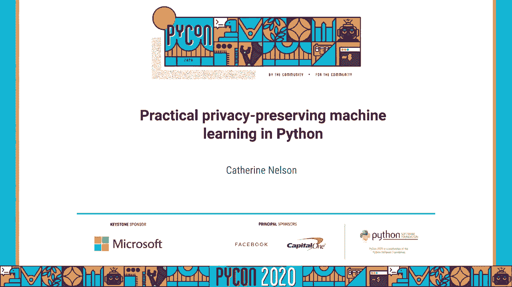
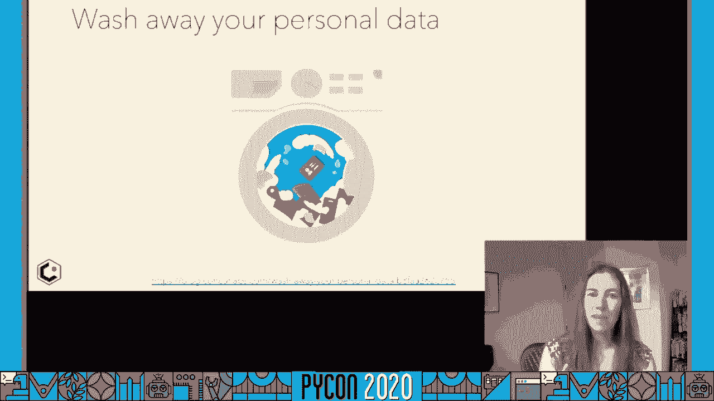
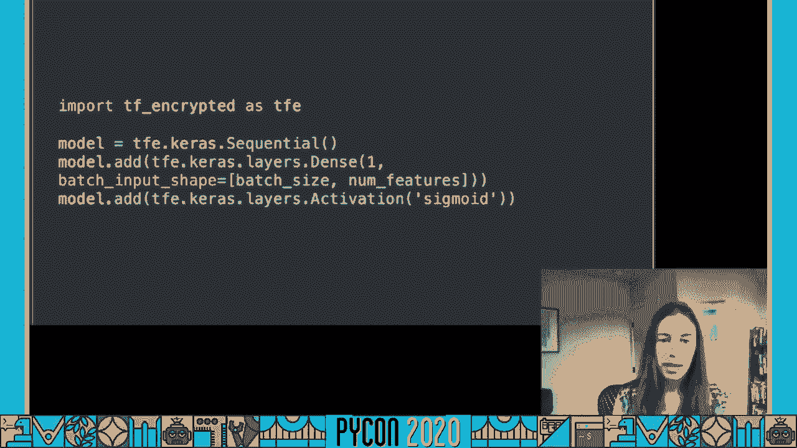
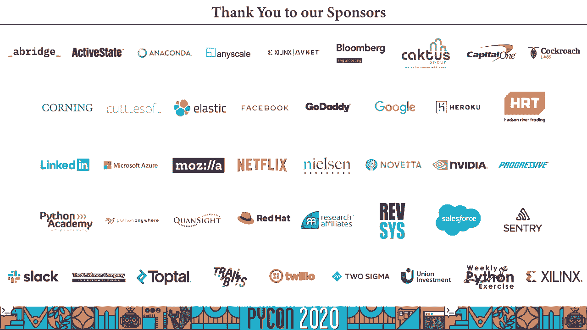

# 隐私保护机器学习：P26：在Python中进行实用的隐私保护机器学习




## 概述
在本教程中，我们将学习如何在Python中实现实用的隐私保护机器学习。我们将探讨三种核心技术：差分隐私、加密机器学习和联邦学习。这些技术旨在帮助我们在构建准确模型的同时，保护用户的个人和敏感数据。

---

## 自我介绍与背景
我是Catherine Nelson，是SAP Concur旗下Concur Labs的高级数据科学家。我的团队专注于评估和推荐机器学习工具与技术。同时，我也是西雅图PyLadies的共同组织者，合著了《构建机器学习管道》一书，并且是机器学习领域的Google开发者专家。

今天，我想分享一个我深感兴趣的主题：隐私保护机器学习。这个话题在数据隐私法规日益严格的今天显得尤为重要。

---

## 数据隐私与机器学习的挑战
机器学习通常遵循“数据越多越好”的原则，但这与数据隐私的目标——减少对个人的了解——似乎存在矛盾。然而，两者的深层目标可以是一致的：我们希望了解群体模式，而非个体细节。

我们需要保护的数据主要分为两类：
*   **私人数据**：可直接识别个人的信息，如姓名、地址、电子邮件。
*   **敏感数据**：泄露后可能产生后果的信息，如健康记录或公司专有数据。

处理这类数据最直接的方法是“不收集”。例如，我们使用“数据洗衣机”项目，通过机器学习模型识别并移除文本中的个人可识别信息。



然而，有时我们必须收集敏感数据来确保模型的公平性。因此，我们需要找到既能利用数据又能保护隐私的方法。

---

## 隐私保护机器学习技术概览
上一节我们讨论了隐私与机器学习的潜在冲突。本节中，我们来看看如何通过技术手段调和这一矛盾。我们将分析一个简化的机器学习系统，涉及数据从用户收集、存储、训练到预测的全过程，并探讨在何处可以引入隐私保护。

关键在于回答一个问题：**你信任谁处理你的个人数据？** 根据答案的不同，我们可以采用以下三种主要技术：

1.  **差分隐私**：适用于信任模型所有者，但希望确保预测不泄露个人数据。
2.  **加密机器学习**：适用于不完全信任模型所有者，或希望保护推理过程。
3.  **联邦学习**：适用于完全不希望原始数据离开用户设备的情况。

---

## 技术一：差分隐私 🛡️
差分隐私的核心思想是：模型的输出结果不应揭示任何单个个体是否存在于训练数据集中。它通过向计算过程（如梯度）中添加随机噪声来实现，为个人提供“否认性”。

### 在TensorFlow中实现差分隐私
我们可以使用 `TensorFlow Privacy` 库轻松地将差分隐私集成到现有的Keras模型中。

以下是将一个标准Keras模型转换为差分隐私模型的步骤：

1.  **定义标准模型**：
    ```python
    model = tf.keras.Sequential([
        tf.keras.layers.Dense(512, activation='relu'),
        tf.keras.layers.Dense(256, activation='relu'),
        tf.keras.layers.Dense(1, activation='sigmoid')
    ])
    ```

2.  **引入差分隐私优化器和损失函数**：
    我们需要使用 `tensorflow_privacy` 提供的优化器来替代标准优化器。关键步骤是梯度裁剪和添加噪声。
    ```python
    import tensorflow_privacy as tfp

    # 定义差分隐私优化器
    optimizer = tfp.DPKerasSGDOptimizer(
        l2_norm_clip=1.0,      # 梯度裁剪阈值
        noise_multiplier=0.5,  # 控制噪声量
        num_microbatches=1,    # 将批次划分为更小的微批次
        learning_rate=0.01
    )

    # 使用对应的差分隐私损失函数
    loss = tf.keras.losses.BinaryCrossentropy(
        from_logits=False, reduction=tf.losses.Reduction.NONE
    )
    ```

3.  **编译并训练模型**：
    ```python
    model.compile(optimizer=optimizer, loss=loss, metrics=['accuracy'])
    model.fit(train_data, train_labels, epochs=10, batch_size=256)
    ```

### 衡量隐私损失：Epsilon (ε)
差分隐私的强度用 **ε** 来衡量。ε 值越小，意味着添加的噪声越多，隐私保护越强，但可能以模型准确性为代价。

我们可以使用库中的工具来计算训练后的 ε 值：
```python
# 计算隐私预算epsilon
# N: 训练样本总数
# batch_size: 批次大小
# noise_multiplier: 噪声乘数
# epochs: 训练轮数
# delta: 通常设置为远小于 1/N 的值，例如 1e-5
epsilon = tfp.compute_dp_sgd_privacy(
    n=N,
    batch_size=batch_size,
    noise_multiplier=noise_multiplier,
    epochs=epochs,
    delta=delta
)[0]  # 函数返回 (epsilon, delta)
print(f‘Epsilon: {epsilon}’)
```

**何时使用差分隐私**：当你信任模型所有者可以访问原始数据，但需要确保模型预测（或模型本身）不会记忆或泄露特定个体的信息时。

---

## 技术二：加密机器学习 🔐
加密机器学习允许我们在数据或模型处于加密状态时进行计算。这适用于我们不完全信任中央服务器的情况。

### 使用TF Encrypted进行加密训练
`TF Encrypted` 库扩展了TensorFlow，允许在加密数据上执行计算。它保持了熟悉的Keras API风格。

以下是加密训练数据的基本流程：

1.  **在本地加密数据**：
    数据在离开用户设备前就被加密。
    ```python
    import tf_encrypted as tfe

    # 假设有一个提供本地数据的函数
    def provide_training_data():
        # ... 加载和预处理本地数据
        return batch_data, batch_labels

    # 将数据转换为加密张量
    encrypted_train_data = tfe.define_local_computation(provide_training_data)()
    ```

2.  **在加密数据上构建和训练模型**：
    ```python
    # 使用Keras API定义模型（这些层将在加密状态下运行）
    encrypted_model = tfe.keras.Sequential([
        tfe.keras.layers.Dense(512, activation='relu'),
        tfe.keras.layers.Dense(256, activation='relu'),
        tfe.keras.layers.Dense(1, activation='sigmoid')
    ])

    encrypted_model.compile(optimizer='adam', loss='binary_crossentropy')
    encrypted_model.fit(encrypted_train_data, epochs=10)
    ```

### 对已训练模型进行加密推理
我们也可以只加密已经训练好的模型，以便对用户输入的加密数据进行预测并返回加密结果，整个过程服务器无法解密。

```python
# 克隆一个已有的Keras模型为加密版本
plaintext_model = ... # 你的已训练好的标准Keras模型
encrypted_model = tfe.keras.models.clone_model(plaintext_model)



# 现在可以使用 encrypted_model 对加密输入进行预测
```

**何时使用加密机器学习**：
*   **加密数据**：当训练数据敏感且不信任模型所有者时。
*   **加密模型**：当模型是公开的，但用户的输入数据和预测结果是私密时（例如，医疗诊断应用）。

---

## 技术三：联邦学习 📱
联邦学习让模型训练直接在用户设备（如手机）上进行，原始数据永不离开设备。只有模型的更新（权重变化）被加密后发送到中央服务器进行聚合。谷歌的Gboard输入法就使用了这项技术。

### 联邦学习的基本步骤（概念性）
虽然具体实现（如使用 `PySyft` 或 `TensorFlow Federated`）涉及复杂的基础设施，但其核心流程可以概括如下：

1.  **中央服务器初始化**一个全局模型。
2.  **选择一批用户设备**，将当前全局模型权重分发下去。
3.  **每台设备**在本地用自己的数据训练模型，生成**模型权重更新**。
4.  设备将**加密后的权重更新**（而非原始数据）发送回中央服务器。
5.  中央服务器使用**安全聚合**技术，将所有更新聚合起来，改进全局模型。
6.  重复步骤2-5。

**何时使用联邦学习**：
*   数据天然分散在大量边缘设备上（如手机、浏览器）。
*   数据包含高度敏感或个人化信息。
*   数据已经带有标签（因为服务器无法查看数据后进行标注）。

---

## 技术选择与注意事项
我们已经介绍了三种主要的隐私保护技术。选择哪种技术取决于你的信任模型和具体应用场景。

以下是简单的决策参考：
*   信任模型所有者，只需保护预测结果 -> **差分隐私**
*   不完全信任模型所有者，需保护数据或推理过程 -> **加密机器学习**
*   完全不希望原始数据离开用户设备 -> **联邦学习**

### 重要注意事项
1.  **性能成本**：隐私保护通常会带来模型准确性下降、训练时间增加或系统复杂性提高。
2.  **非万能药**：采用这些技术并不意味着解决了所有伦理问题。如果产品设计本身存在伦理缺陷，技术无法弥补。
3.  **组合使用**：在实际系统中，这些技术经常被组合使用以提供多层保护（例如，在联邦学习中加入差分隐私）。

---

## 总结与资源
本节课中，我们一起学习了在Python中实现隐私保护机器学习的三种实用技术：**差分隐私**、**加密机器学习**和**联邦学习**。每种技术针对不同的信任假设和应用场景，为在利用数据价值的同时保护用户隐私提供了可行的工具。

如果你想深入了解：
*   **书籍**：可以阅读我合著的《Building Machine Learning Pipelines》。
*   **开源项目**：支持并尝试使用 `TensorFlow Privacy`、`TF Encrypted` 和 `PySyft`/`TensorFlow Federated` 这些优秀的开源库。
*   **保持联系**：欢迎通过Twitter等渠道交流问题。



隐私保护机器学习是一个快速发展的领域，希望本教程能帮助你迈出实践的第一步。