# 美丽的Python重构：P29：从网络爬虫到优雅代码的蜕变 🐍


在本教程中，我们将跟随Conor Hoekstra的演讲，学习如何将一个从博客中获取的、用于爬取HTML表格的Python脚本，通过一系列重构步骤，从60多行代码精简至不到10行。我们将重点关注如何识别并消除常见的“反模式”，利用Python的内置函数和特性（如`enumerate`、列表推导式、`zip`等）来编写更简洁、高效且易于维护的代码。

---

## 1：项目背景与目标 🎯

上一节我们介绍了本教程的背景和目标。本节中，我们来看看项目的具体动机和步骤。

我（Conor Hoekstra）在加入NVIDIA的RAPIDS团队后，决定进行一个玩具项目：分析Codeforces编程竞赛网站上提交代码所使用的语言流行度。这需要两个主要步骤：
1.  从Codeforces网站爬取包含提交数据的HTML表格。
2.  处理数据并分析语言使用频率。

本教程90%的内容将集中在第一步的代码重构上。

---

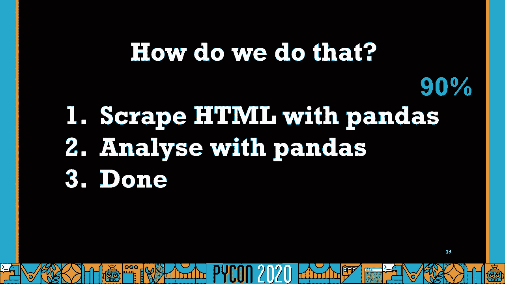

## 2：初始代码分析 🔍

上一节我们明确了项目目标。本节中，我们来看看从博客中找到的初始爬虫代码。

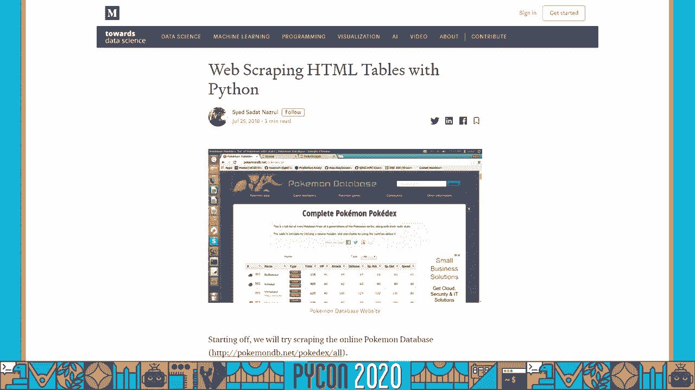

我通过搜索引擎找到了一个博客，它提供了使用Python的`requests`和`lxml`库爬取HTML表格并转换为`pandas` DataFrame的教程代码。初始代码结构如下：

```python
import requests
import pandas as pd
from lxml import html

url = ‘https://codeforces.com/contest/74/status‘
page = requests.get(url)
tree = html.fromstring(page.content)
tr_elements = tree.xpath(‘//tr‘)
```

这段代码负责导入必要的库并获取网页内容。接下来是提取表格标题和数据的循环。

---

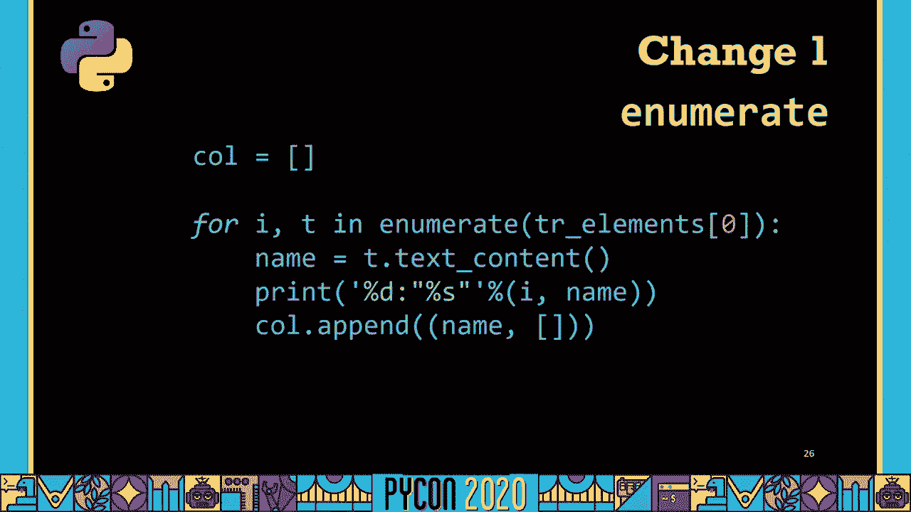

## 3：重构循环一：提取表格标题 🔄

上一节我们导入了库并获取了HTML内容。本节中，我们来看看第一个用于提取表格列标题的循环，并进行重构。

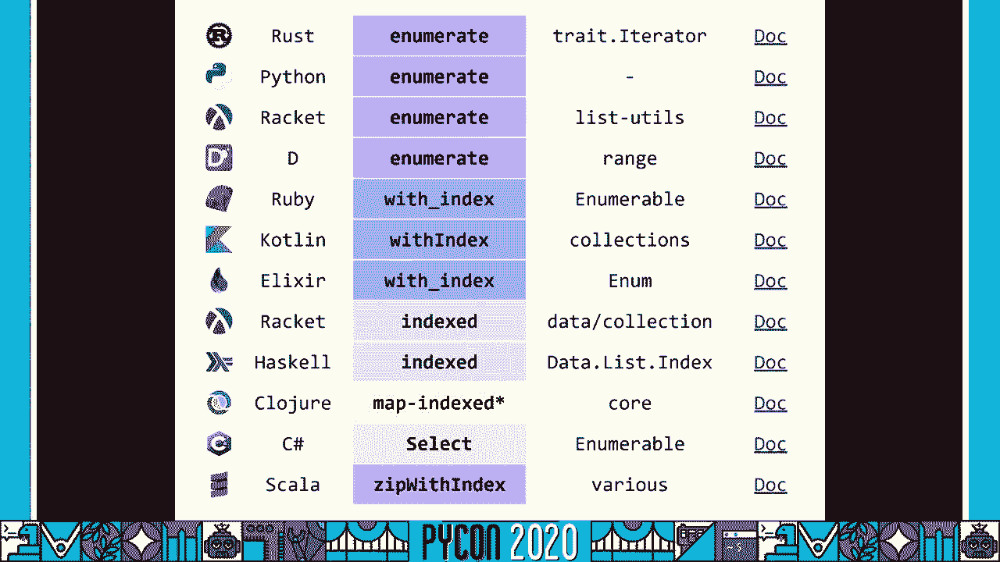

以下是提取表格标题的初始代码：

```python
col = []
i = 0
for t in tr_elements[0]:
    i += 1
    name = t.text_content()
    print (‘%d:“%s”‘ % (i, name))
    col.append((name, []))
```

我们注意到这里存在一个模式：在循环外初始化索引`i`，然后在循环内递增它。Python提供了`enumerate`函数来处理这种模式。

**重构1：使用`enumerate`**
`enumerate`可以同时获取迭代的索引和值。
```python
col = []
for i, t in enumerate(tr_elements[0], 1):
    name = t.text_content()
    print(‘%d:“%s”‘ % (i, name))
    col.append((name, []))
```

**重构2：删除调试打印语句**
打印语句可能仅用于调试，可以移除。
```python
col = []
for i, t in enumerate(tr_elements[0], 1):
    name = t.text_content()
    col.append((name, []))
```

**重构3：转换为列表推导式**
我们初始化一个空列表，然后在循环中不断修改（追加）它。这可以转换为更简洁的列表推导式。
```python
col = [(t.text_content(), []) for t in tr_elements[0]]
```

通过这三步，我们消除了“初始化-修改”反模式，使代码更清晰。

---

## 4：重构循环二：提取表格数据 📊

上一节我们优化了标题提取。本节中，我们处理更复杂的嵌套循环，它用于提取表格每一行的数据。

初始的嵌套循环代码如下：

```python
for j in range(1, len(tr_elements)):
    T = tr_elements[j]
    if len(T) != 10:
        break
    i = 0
    for t in T.iterchildren():
        data = t.text_content()
        if i > 0:
            try:
                data = int(data)
            except:
                pass
        i += 1
        col[i][1].append(data)
```

我们将逐步分析并重构它。

**重构4：移除不必要的`if`语句**
第一个`if len(T) != 10`是针对原博客示例数据的检查，对我们的数据源不必要，可以删除。

**重构5：使用切片替代`range`和索引**
前两行用于跳过表头，遍历`tr_elements`的其余部分。我们可以用切片更直观地实现。
```python
for T in tr_elements[1:]: # 从第二个元素开始遍历
    i = 0
    ...
```

**重构6：再次使用`enumerate`**
循环内部又出现了初始化索引`i`并在循环内递增的模式，用`enumerate`替换。
```python
for T in tr_elements[1:]:
    for i, t in enumerate(T.iterchildren()):
        ...
```

**重构7：用条件表达式替换`try-except`**
代码尝试将文本转换为整数，失败则保持原样。可以用条件表达式（三元运算符）更清晰地表达。
```python
data = t.text_content()
data = int(data) if data.isdigit() else data
```

**重构8：删除冗余注释并内联操作**
删除循环上方“迭代每个元素”等不言自明的注释。同时，将数据直接追加到`col`中，避免中间变量。
```python
for T in tr_elements[1:]:
    for i, t in enumerate(T.iterchildren()):
        data = t.text_content()
        val = int(data) if data.isdigit() else data
        col[i][1].append(val)
```

此时，代码已从60多行大幅缩减。

---

## 5：洞察数据结构与终极重构 💡

上一节我们简化了数据提取循环。本节中，我们退一步审视整体数据结构，进行更深层次的重构。

观察发现，`col`是一个列表，其中每个元素是一个元组`(列标题, 列数据列表)`。随后，这个结构被转换成字典以创建DataFrame：
```python
Dict = {title:column for (title,column) in col}
df = pd.DataFrame(Dict)
```

这引发一个思考：我们真的需要将标题和数据捆绑在元组里吗？我们可以用两个独立的列表。

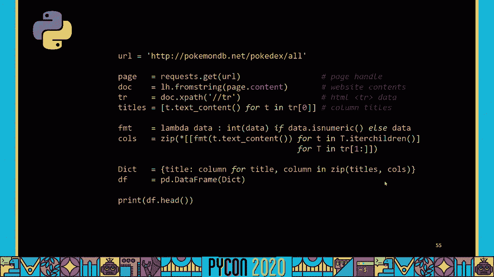

**重构9：拆分数据与标题，并使用`zip`进行转置**
1.  将标题和数据存储到两个独立的列表中。
2.  使用`zip(*...)`技巧来转置数据（将“按行存储”转换为“按列存储”），这是将行数据分配到各列的关键。

以下是重构后的核心代码：
```python
# 提取标题
headers = [t.text_content() for t in tr_elements[0]]

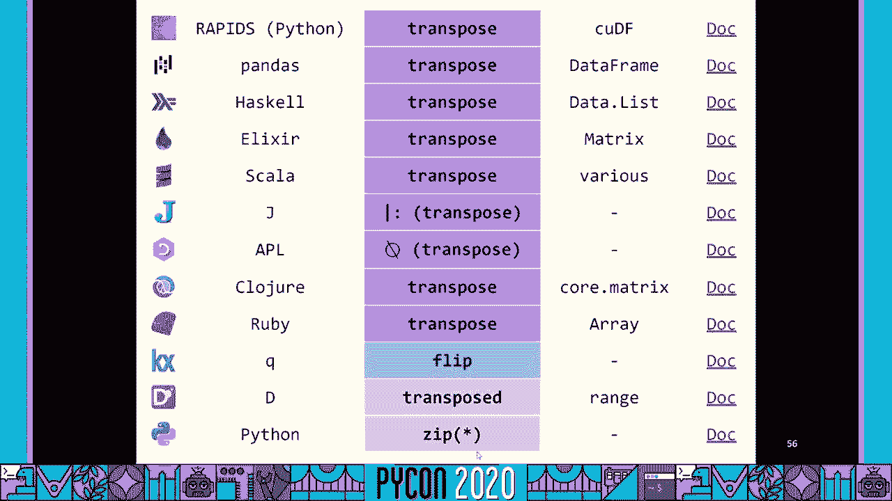

# 提取并转置数据：列表推导式嵌套，内部推导式处理一行，外部推导式处理所有行
# zip(*...) 负责将“行的列表”转置为“列的列表”
data_rows = [[int(td) if td.isdigit() else td for td in tr.xpath(‘./td/text()‘)] for tr in tr_elements[1:]]
columns = list(zip(*data_rows))


# 创建字典，用于构建DataFrame
Dict = {header: column for header, column in zip(headers, columns)}
df = pd.DataFrame(Dict)
```


这个版本极其紧凑，利用了列表推导式和`zip`的强大功能。

---

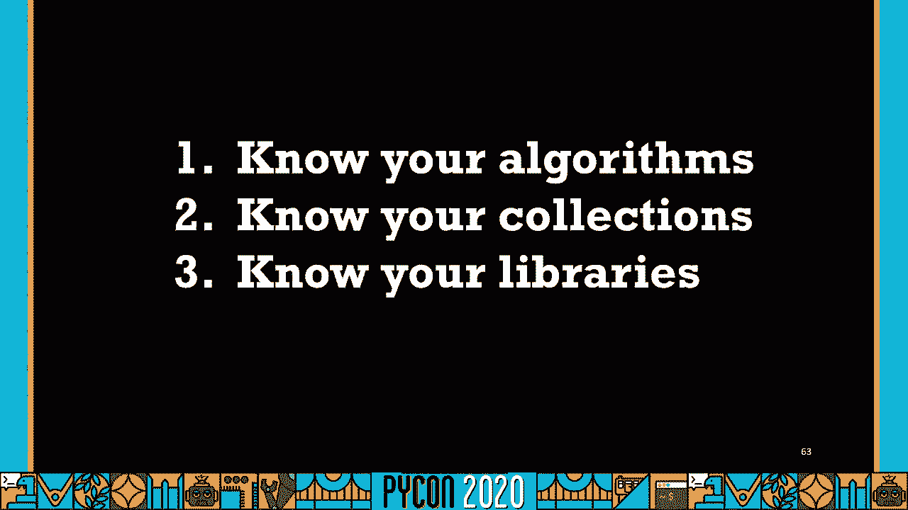

## 6：反思与最佳实践 🧠

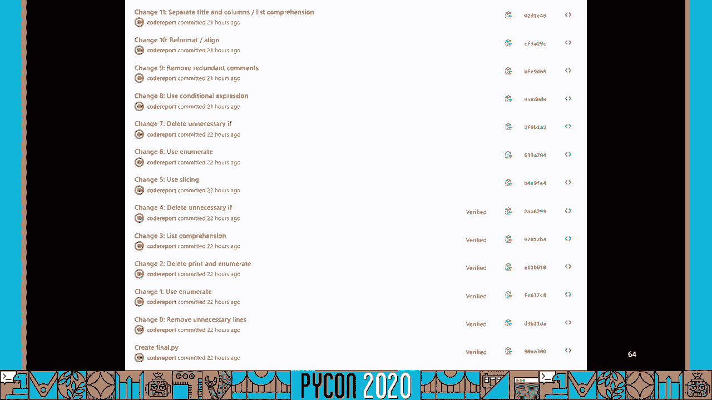

上一节我们完成了代码的终极精简。本节中，我们进行关键反思：有时最好的重构是根本不需要写代码。

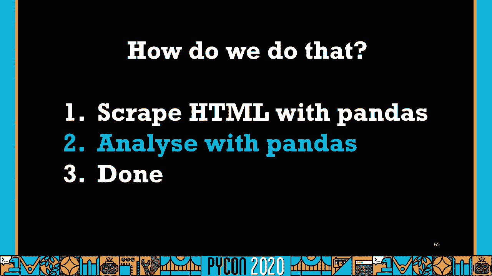

在完成所有重构后，我意识到一个“重大错误”：`pandas`库本身有一个直接读取HTML表格的函数`pd.read_html()`。

```python
# 最终极的解决方案
df_list = pd.read_html(url)
df = df_list[0] # 假设第一个表格是我们需要的
```

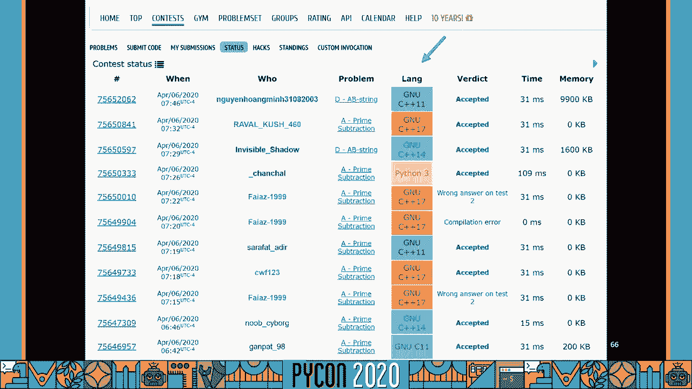

**核心启示**：在动手编写代码前，应充分了解你所使用的库和工具。许多常见任务已有现成、优化过的解决方案。熟悉你的“算法”、“集合”和“库”是写出优秀代码的关键。

---

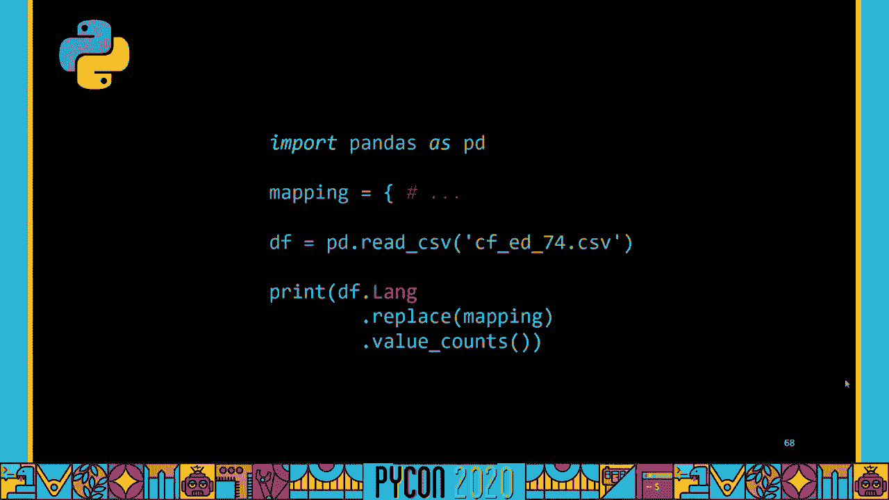

## 7：数据分析与可视化 📈

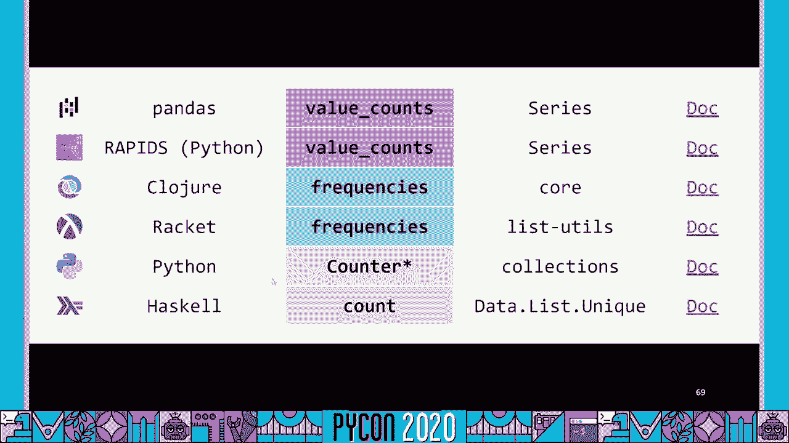

上一节我们深刻反思了重构的意义。本节中，我们快速完成项目的第二步：数据分析。

使用爬取并清理好的数据（包含“语言”列），我们进行如下分析：

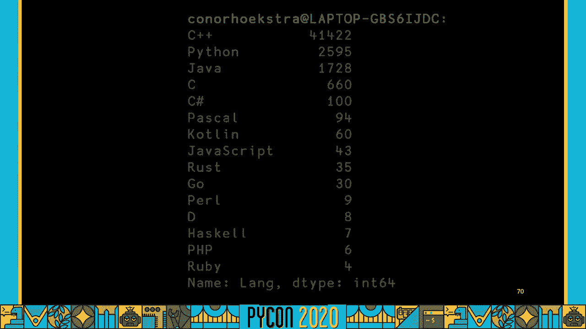

```python
# 1. 创建一个映射字典，将不同的提交选项（如‘GNU C++11‘）归一化为语言名（如‘C++‘）
language_map = {
    ‘GNU C++11‘: ‘C++‘,
    ‘GNU C++14‘: ‘C++‘,
    ‘Python 2‘: ‘Python‘,
    ‘Python 3‘: ‘Python‘,
    # ... 其他映射
}

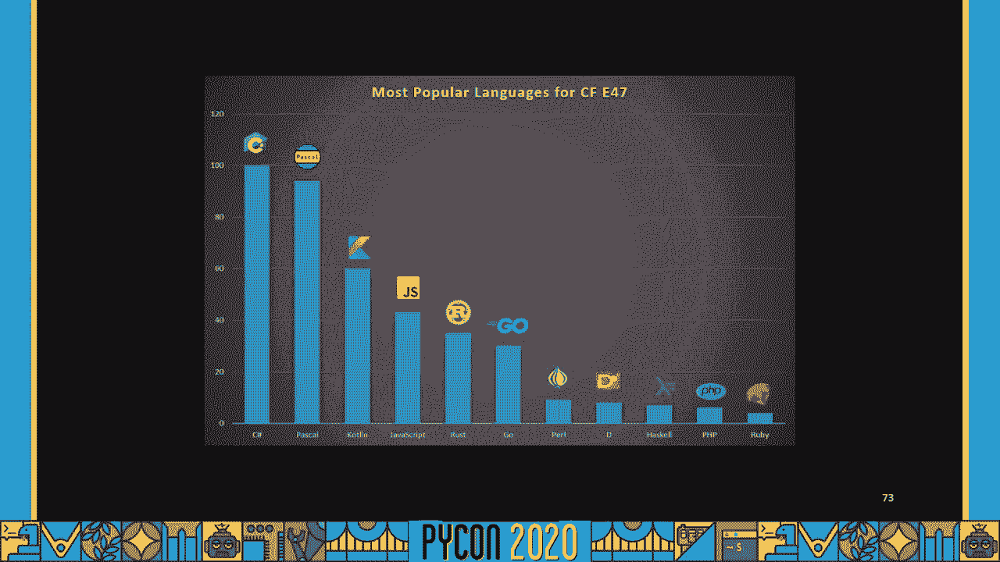

# 2. 应用映射并计算每种语言的出现频率
df[‘Language‘] = df[‘Language‘].replace(language_map)
language_counts = df[‘Language‘].value_counts()

print(language_counts.head())
```

结果显示，在该比赛中，C++是绝对主流，其次是Python和Java。

---

## 8：总结与延伸 🏁

本节课中，我们一起学习了如何将一个冗长的Python爬虫脚本通过多步重构变得简洁优雅。

**我们学习的关键重构技巧包括**：
*   使用 **`enumerate`** 避免手动管理索引。
*   使用 **列表推导式** 替代“初始化-修改”模式。
*   使用 **切片** 和 **条件表达式** 使逻辑更清晰。
*   利用 **`zip(*...)`** 进行数据转置。
*   最重要的：**优先寻找并使用库的内置功能**（如`pd.read_html`）。


此外，我们还简要介绍了数据分析的基本步骤：数据清洗（映射替换）和聚合统计（`value_counts`）。编写代码时，应始终追求简洁、可读和高效，并充分利用语言特性和现有库。