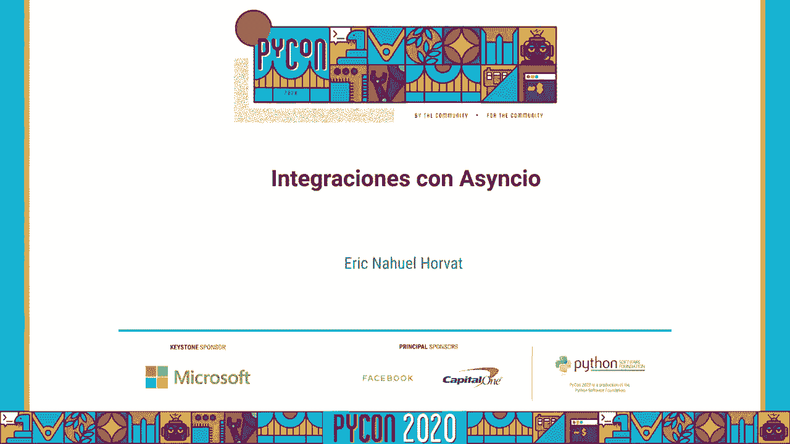
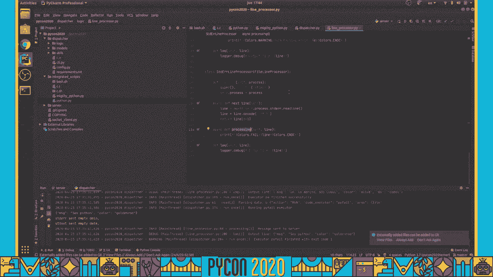

# Python异步编程：P3：Asyncio集成实践 🚀





在本节课中，我们将学习如何在实际项目中集成和使用Python的`asyncio`库。我们将探讨异步编程的核心概念，并通过具体的场景理解如何避免常见问题，特别是与服务器通信和资源管理相关的挑战。

---

## 概述

`asyncio`是Python用于编写并发代码的库，使用`async/await`语法。它特别适合处理I/O密集型任务，如网络请求。然而，在集成到复杂系统（如微服务架构）时，需要特别注意资源管理和错误处理，否则可能导致性能问题或安全漏洞。

上一节我们介绍了`asyncio`的基础，本节中我们来看看如何将其安全、有效地集成到实际服务中。

---

## 核心挑战：资源与通信管理

在微服务或服务器环境中集成异步代码时，主要挑战来自于**通信环境**和**资源安全性**。由于多个异步任务可能同时访问共享资源（如网络连接、内存），不当管理会导致数据竞争、内存泄漏或服务不可用。

以下是一个简单的异步服务器示例，展示了如何启动一个基础服务：

```python
import asyncio

async def handle_client(reader, writer):
    data = await reader.read(100)
    message = data.decode()
    addr = writer.get_extra_info('peername')
    print(f"Received {message} from {addr}")
    writer.close()

async def main():
    server = await asyncio.start_server(handle_client, '127.0.0.1', 8888)
    async with server:
        await server.serve_forever()


asyncio.run(main())
```

---

## 关键实践原则

在集成`asyncio`时，必须遵循一些核心原则以确保系统的稳定和安全。以下是需要重点关注的事项列表：

*   **明确资源生命周期**：每一个由服务器创建的资源（如连接、任务、客户端会话）都必须有明确的创建和销毁点。避免任务无限期挂起或资源未被释放。
*   **隔离任务上下文**：确保异步任务之间不共享可变状态，或通过锁（`asyncio.Lock`）等机制安全地共享。这可以防止数据竞争。
*   **优雅处理取消**：使用`asyncio.CancelledError`来妥善处理任务取消，确保取消时能清理占用的资源。
*   **限制并发度**：使用信号量（`asyncio.Semaphore`）或池来限制同时运行的并发任务数量，防止系统过载。

---

## 避免常见陷阱

集成过程中，许多问题源于对异步操作生命周期的误解。我们必须确保代码的每一处都考虑到并发环境下的行为。

具体来说，在编写异步函数时，必须反复检查关键区域：

*   我必须确保这不是一个可能引发竞态条件的地方。
*   我必须确保这是一个可以安全执行I/O操作的地方。
*   我必须确保在异常发生时，资源能被正确释放。
*   我必须确保任务的取消信号能被正确传播和处理。
*   我必须确保不会在未等待的情况下创建大量任务，导致内存耗尽。



这个检查清单需要应用于每一个异步交互点，从数据库连接到外部API调用。

---

## 总结

本节课中我们一起学习了`asyncio`集成到实际项目中的关键要点。我们了解到，成功集成异步编程不仅需要理解`async/await`语法，更需要严格管理**任务生命周期**和**共享资源**，并时刻警惕在并发环境下可能出现的陷阱。通过遵循明确的实践原则和细致的代码审查，可以构建出既高效又可靠的异步应用。


记住，在异步世界里，**“我必须确保这不是一个可以使用的地方”** 这种严谨的思维模式，是保障代码质量与系统稳定性的基石。