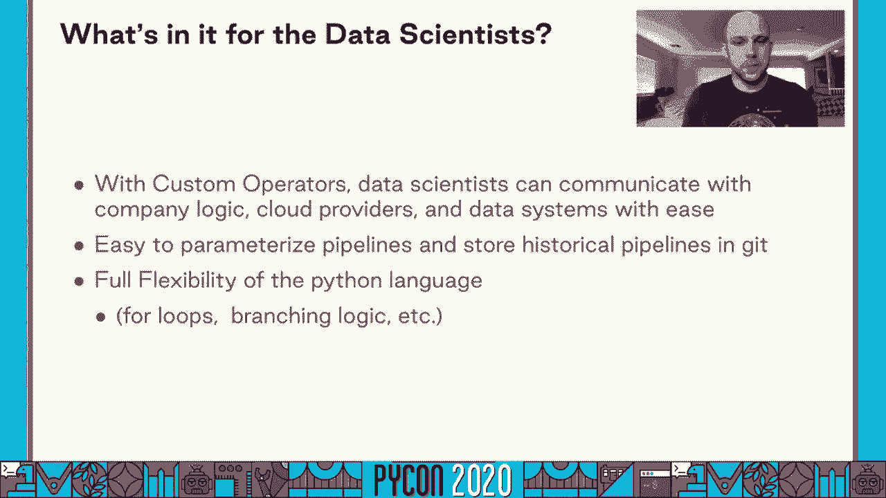
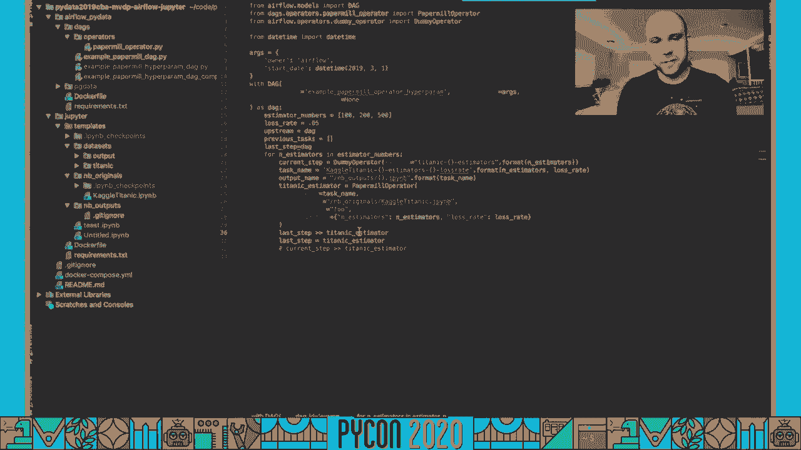
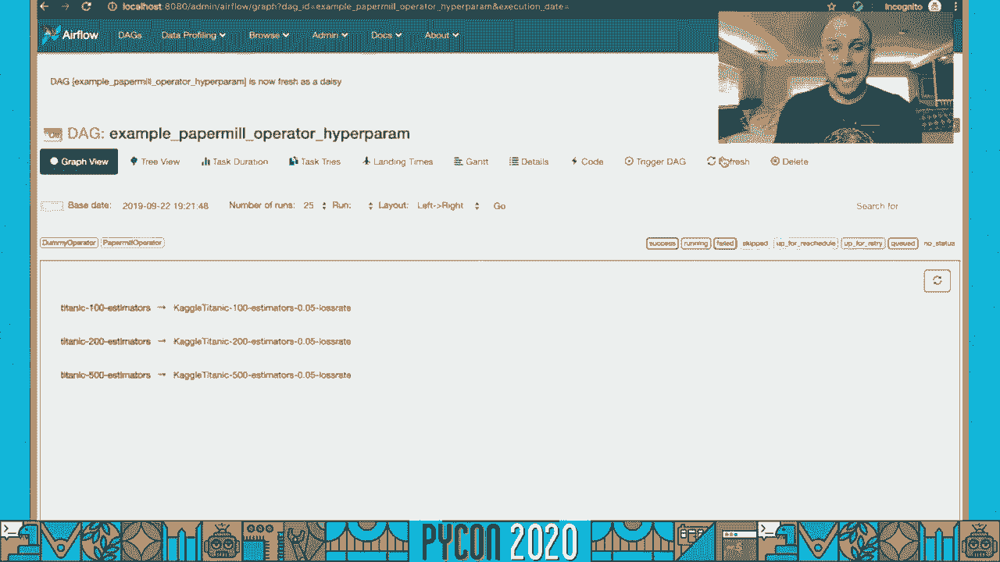
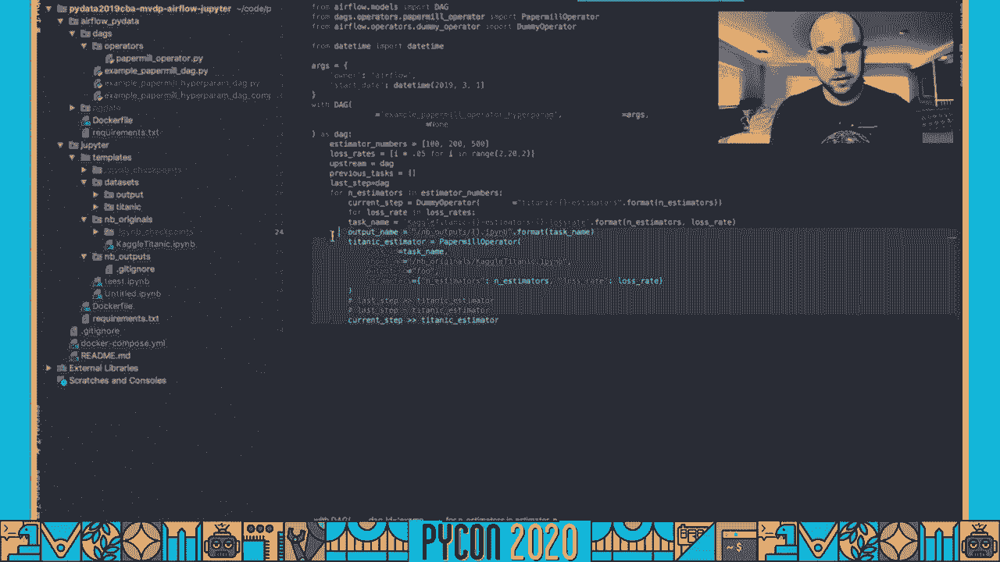
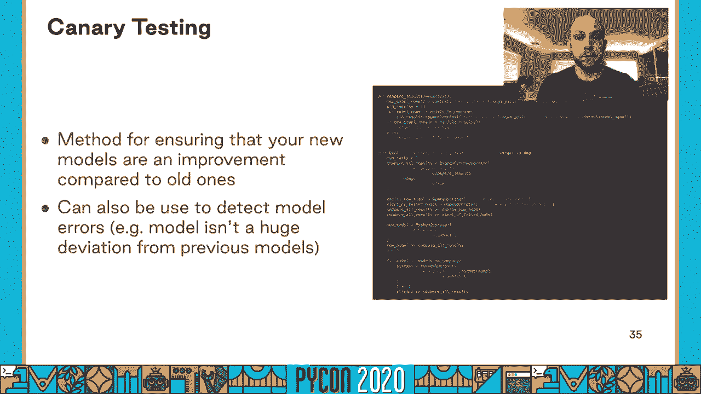
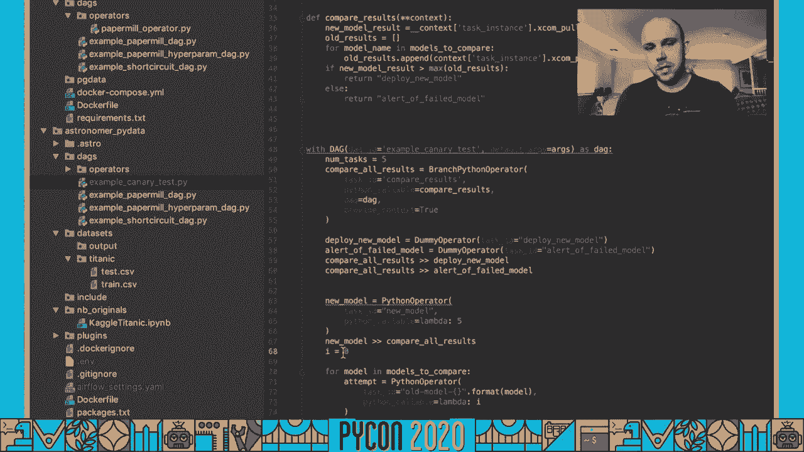
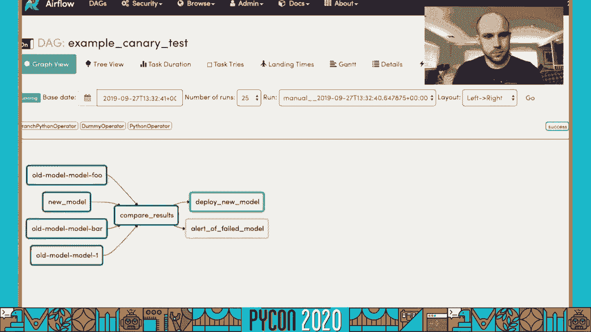
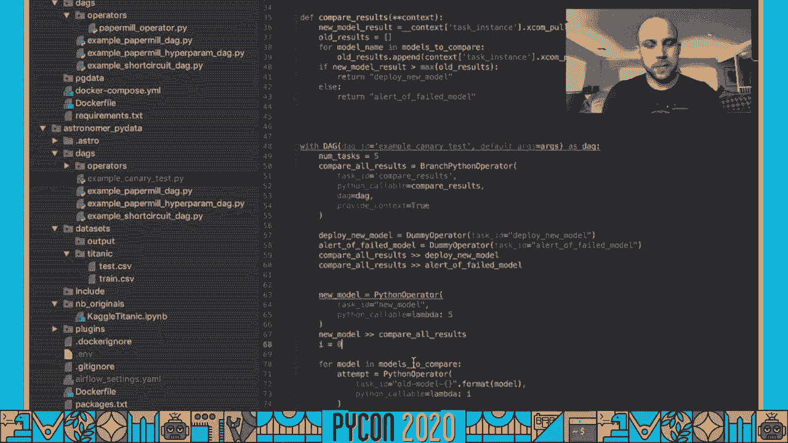

# 数据科学平台构建：P30：使用Apache Airflow连接数据科学与数据工程 🚀

在本教程中，我们将学习如何利用 **Apache Airflow** 构建一个统一的数据科学平台，以弥合数据科学家、数据工程师和产品分析师之间的协作鸿沟。我们将探讨Airflow的核心概念、其如何标准化工作流，并通过具体示例展示其实用性。


---

## 概述：数据科学生态系统的挑战


一个典型的数据科学生态系统包含三个主要角色：
*   **数据科学家**：负责构建预测模型，需要高性能计算资源（如CPU、内存、GPU），但希望避免复杂的系统配置。
*   **数据工程师**：负责维护数据基础设施，关注系统的运行时稳定性与性能，需要在提供灵活性与确保系统健康之间找到平衡。
*   **产品分析师**：需要便捷地访问数据（通常通过SQL），以创建仪表板和报告，为业务提供可操作的见解。

这些团队目标一致，但需求不同。数据基础设施团队常试图构建一个“保险杠轨道”模型，即在定义明确的沙箱内为用户提供灵活性，并在用户超出范围时及时提醒。

---

## 解决方案：以Apache Airflow为核心

与其从零开始构建一个复杂的数据科学平台，不如使用 **Apache Airflow** 作为核心。Apache Airflow是一个由**Airbnb**开发的、基于Python的工作流调度器。它提供了简单的Python SDK来构建执行图（DAG），使得构建、部署和监控数据管道变得非常容易。

### 什么是DAG？

DAG（有向无环图）是Airflow的核心概念。用户通过创建Python对象（称为**Operator**）来定义任务，每个Operator可以是一个Bash命令、一个Spark作业请求等。然后，使用 `set_upstream` 或 `>>` 运算符来建立任务间的依赖关系，无需复杂的YAML或JSON配置。

```python
# 示例：定义三个独立任务
task1 = BashOperator(task_id=‘print_date‘, bash_command=‘date‘)
task2 = BashOperator(task_id=‘sleep‘, bash_command=‘sleep 5‘)
task3 = BashOperator(task_id=‘echo‘, bash_command=‘echo hello‘)

# 设置任务并行执行（无依赖）
task1 >> task2
task1 >> task3
```

Airflow还提供了一个强大的监控仪表板，用户可以在此查看所有管道的健康状况、历史运行记录，并实时观察管道执行。

---

## 数据工程师的视角：标准化与扩展

对于数据工程师而言，Airflow是实施标准化、监控和保持一致性的强大工具。

### 核心优势
1.  **自定义Operator**：数据工程师可以扩展现有Operator或创建新的Operator，在给予数据科学家最大灵活性的同时，强制执行公司标准。
2.  **简易集成**：Airflow轻松集成Elasticsearch和Prometheus，简化日志捕获和系统监控。
3.  **久经考验**：Airflow已在**Airbnb**、**Lyft**等顶级科技公司中经受每天数百万任务的考验，系统稳定可靠。

### 实践示例：抽象Kubernetes配置

假设数据工程师管理着一个包含GPU节点的Kubernetes集群，并希望数据科学家能方便地使用这些GPU，而无需了解Kubernetes的内部细节。

数据工程师可以创建一个自定义的Kubernetes Pod Operator，自动注入访问GPU所需的节点选择器标签。

```python
from airflow.providers.cncf.kubernetes.operators.kubernetes_pod import KubernetesPodOperator

class GpuKubernetesPodOperator(KubernetesPodOperator):
    """
    自定义Operator，自动将任务调度到带GPU的节点上。
    """
    def __init__(self, *args, **kwargs):
        # 注入节点选择器，对数据科学家透明
        kwargs[‘node_selector‘] = {‘accelerator‘: ‘nvidia-tesla-k80‘}
        super().__init__(*args, **kwargs)

# 数据科学家可以像使用普通Operator一样使用它，无需关心底层配置
train_task = GpuKubernetesPodOperator(
    task_id=‘train_model‘,
    name=‘train-on-gpu‘,
    cmds=[‘python‘, ‘train.py‘],
    ...
)
```

通过这种方式，数据工程师构建了针对业务用例的核心组件，而底层基础设施则由活跃的Apache Airflow社区维护和更新。

---

## 数据科学家的视角：抽象与灵活性

一旦数据基础设施团队构建了核心自定义Operator，数据科学团队便获得了完全的抽象，无需关心连接Spark集群或AWS实例等复杂细节。

### 核心优势
1.  **构建块**：数据科学家可以在基础设施团队提供的自定义Operator之上，进一步创建自己的Operator，从而简化和抽象他们的工作流。
2.  **Python的灵活性**：利用Python语言特性（如循环、条件分支），可以动态生成复杂的工作流。
3.  **参数化与版本控制**：Airflow易于参数化管道，并与**Git**集成，便于存储历史版本。

### 实践示例：动态任务生成与超参数调优

假设我们有一个训练任务，希望测试不同的学习率（超参数）。

```python
learning_rates = [0.001, 0.01, 0.1, 0.5]

# 使用循环动态创建多个并行训练任务
train_tasks = []
for lr in learning_rates:
    task = PythonOperator(
        task_id=f‘train_model_lr_{lr}‘,
        python_callable=train_model,
        op_kwargs={‘learning_rate‘: lr}  # 将超参数传入任务
    )
    train_tasks.append(task)

# 假设所有训练任务都依赖于同一个数据准备任务
data_prep_task >> train_tasks
```

只需几行代码，我们就能将一个单一任务转换为一个并行的超参数调优实验。

---



## 产品分析师的视角：数据可访问性与一致性



对于产品分析师团队，基于Airflow的平台带来了两大好处：



1.  **团队凝聚力**：数据科学和数据工程团队之间更紧密的协作，意味着更快的交付速度和更少的沟通失误。
2.  **可靠的数据更新**：Airflow提供了大量基于SQL的Operator，可以在预定时间运行参数化查询，确保分析数据库始终充满新鲜、一致的数据，供BI和产品团队使用。

---



## 完整工作流示例：从实验到生产

一个健壮的数据科学流程通常遵循“曲奇切割机”模型，分为三个阶段：**实验**、**参数化**和**生产**。

### 1. 实验阶段：使用Jupyter Notebook

数据科学家在Jupyter Notebook中进行快速迭代和原型设计。Airflow可以无缝集成，将本地实验扩展到大规模运行。

**推荐做法**：将Notebook分解为一系列具有明确职责的小型任务（例如，数据清洗、特征工程、模型训练），每个任务对应一个Notebook或Python脚本。这便于故障排查和测试。

### 2. 参数化阶段：使用Papermill

当需要对Notebook进行参数化（例如，超参数调优或在不同数据集上运行）时，**Papermill** 是理想工具。

Papermill允许用户标记Notebook中的单元格，并在执行时覆盖其中的变量。

**操作步骤**：
1.  在Notebook单元格的元数据中，将需要参数化的变量标记为“parameters”。
2.  使用Airflow的 `PapermillOperator` 来执行Notebook，并传入特定参数。

```python
from airflow.providers.papermill.operators.papermill import PapermillOperator

parameterize_task = PapermillOperator(
    task_id=‘run_parameterized_notebook‘,
    input_nb=‘/path/to/input_notebook.ipynb‘,
    output_nb=‘/path/to/output_notebook_{{ ds }}.ipynb‘,
    parameters={‘learning_rate‘: 0.01, ‘dataset‘: ‘2023-01-01‘}  # 覆盖参数
)
```

### 3. 生产阶段：金丝雀测试

将模型部署到生产环境前，进行**金丝雀测试**是一种稳健的方法。它通过将新模型与当前生产模型在少量流量上进行比较，来验证新模型的性能。

**Airflow实现**：使用 `BranchPythonOperator` 根据模型比较结果决定执行路径。

```python
from airflow.operators.python import BranchPythonOperator
from airflow.operators.dummy import DummyOperator



def compare_models(**context):
    """
    比较新旧模型性能。
    假设从XCom或外部存储获取评估指标。
    """
    new_model_score = 0.92
    old_model_score = 0.90
    if new_model_score > old_model_score:
        return ‘deploy_new_model‘  # 返回下一个要执行的任务ID
    else:
        return ‘alert_failure‘

compare_task = BranchPythonOperator(
    task_id=‘compare_models‘,
    python_callable=compare_models,
    provide_context=True
)



deploy_task = DummyOperator(task_id=‘deploy_new_model‘)
alert_task = DummyOperator(task_id=‘alert_failure‘)

# 设置依赖：比较后分支执行
compare_task >> [deploy_task, alert_task]
```





如果新模型性能更优，则执行部署任务；否则，触发告警。

---

## 总结

在本节课中，我们一起学习了如何利用 **Apache Airflow** 构建一个统一、高效的数据科学平台。

*   **对数据工程师**：Airflow提供了通过自定义Operator实施标准化和抽象的强大能力，无需从零搭建平台。
*   **对数据科学家**：Airflow提供了基于Python的灵活性和对复杂基础设施的透明抽象，使其能专注于模型本身。
*   **对产品分析师**：Airflow确保了数据管道的可靠运行和数据的新鲜度，为分析工作提供了坚实基础。


通过将工作流划分为实验、参数化和生产三个阶段，并利用Airflow与Jupyter、Papermill等工具的集成，团队可以实现从模型原型到生产部署的平滑过渡。Apache Airflow作为一个久经考验、社区活跃的平台，是连接数据科学、数据工程和产品需求的强大桥梁。