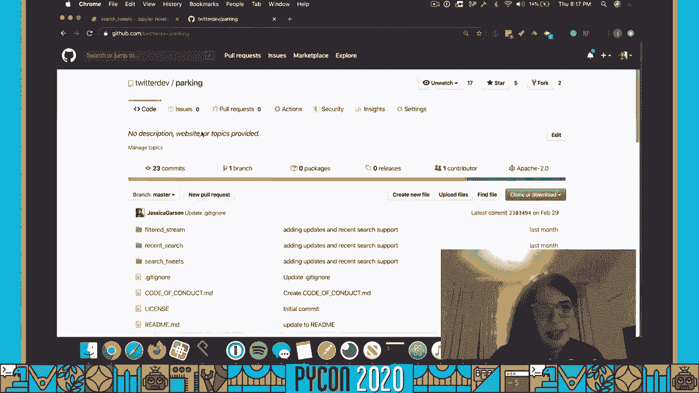
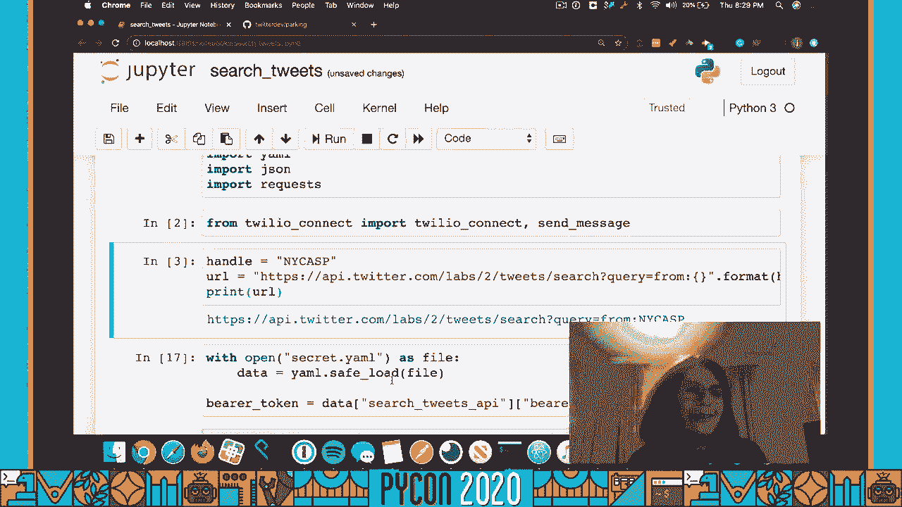

# Python自动化教程：P47：用Python解决纽约停车问题 🚗💻


在本节课中，我们将学习如何利用Python、Twitter API和Twilio服务，构建一个自动化系统来解决日常生活中的实际问题——纽约市的街道清洁停车限制问题。我们将通过获取特定Twitter账户的推文，分析内容，并在特定条件下自动发送短信通知。


---

## 概述



本教程将引导你构建一个自动化脚本。该脚本会每天检查纽约市官方停车信息Twitter账户的推文。如果推文中包含“暂停”和“明天”等关键词，意味着第二天没有街道清洁限制，脚本就会通过Twilio服务向你发送一条“今晚无需挪车”的短信。这样，你就不必每晚都进行挪车的例行公事。

---

## 准备工作 🛠️

在开始编写代码之前，你需要准备一些必要的账户和工具。以下是构建此解决方案所需的步骤：

1.  **创建Twitter开发者账户和应用**：访问 [developer.twitter.com](https://developer.twitter.com) 申请API访问权限。你需要创建一个应用来获取API密钥和访问令牌。
2.  **加入Twitter开发者实验室**：为了使用“最近搜索”端点获取过去7天的推文，你需要注册Twitter开发者实验室的预览功能。
3.  **注册Twilio账户**：访问 [Twilio官网](https://www.twilio.com) 注册并获取一个电话号码以及账户SID和认证令牌。
4.  **安装必要的Python库**：在终端中运行以下命令来安装所需的库。
    ```bash
    pip install twilio pandas requests
    ```

---

## 第一步：连接Twilio API

上一节我们介绍了项目所需的准备工作，本节中我们来看看如何与Twilio API建立连接，以便后续发送短信。


我们将创建一个名为 `twilio_connect_demo.py` 的脚本。这个脚本的核心功能是安全地连接到Twilio服务。

```python
import os
from twilio.rest import Client


def twilio_connect():
    """
    此函数用于安全地连接到Twilio API。
    它从环境变量中读取敏感信息，避免在代码中硬编码。
    """
    account_sid = os.environ.get('TWILIO_ACCOUNT_SID')
    auth_token = os.environ.get('TWILIO_AUTH_TOKEN')
    client = Client(account_sid, auth_token)
    return client


def send_message(client):
    """
    此函数使用已连接的Twilio客户端发送一条短信。
    """
    message = client.messages.create(
        from_=os.environ.get('TWILIO_PHONE_NUMBER'),
        to=os.environ.get('MY_PHONE_NUMBER'),
        body="你今晚不用移动你的车。好好享受你的夜晚！"
    )
    print(f"消息已发送，SID: {message.sid}")
```

**关键点说明**：
*   **环境变量**：我们使用 `os.environ.get()` 来获取 `TWILIO_ACCOUNT_SID`、`TWILIO_AUTH_TOKEN`、`TWILIO_PHONE_NUMBER` 和 `MY_PHONE_NUMBER`。你需要在运行脚本前在终端中设置这些变量，例如：
    ```bash
    export TWILIO_ACCOUNT_SID='你的账户SID'
    export TWILIO_AUTH_TOKEN='你的认证令牌'
    ```
*   **Client对象**：`twilio.rest.Client` 是Twilio库的核心，所有API调用都通过它进行。

---

## 第二步：获取并分析Twitter数据


现在我们已经能够发送短信了，接下来需要获取数据源。本节我们将学习如何从Twitter API获取推文并进行内容分析。


我们将在Jupyter Notebook中完成这部分工作，以便于交互式地查看和处理数据。

```python
import pandas as pd
import yaml
import json
import requests
from twilio_connect_demo import twilio_connect, send_message

# 1. 定义目标Twitter账号的API端点
handle = ‘nycasp’
url = f‘https://api.twitter.com/2/tweets/search/recent?query=from:{handle}’
print(f‘目标URL: {url}’)

# 2. 加载包含Twitter API密钥的配置文件 (务必将其加入.gitignore)
with open(‘config.yaml’, ‘r’) as file:
    data = yaml.safe_load(file)

# 从配置中提取Bearer Token
bearer_token = data[‘search_tweets_api’][‘bearer_token’]

# 3. 设置API请求的认证头
headers = {“Authorization”: f“Bearer {bearer_token}”}

# 4. 向Twitter API发送请求
response = requests.get(url, headers=headers)


# 5. 检查请求是否成功，并解析返回的JSON数据
if response.status_code == 200:
    json_data = response.json()
    print(“成功获取推文数据。”)
    # 提取‘data’部分，其中包含实际的推文列表
    tweets_data = json_data.get(‘data’, [])
else:
    print(f“请求失败，状态码: {response.status_code}”)

# 6. 将推文数据转换为Pandas DataFrame以便于查看和分析
df = pd.DataFrame(tweets_data)
print(df[[‘id’, ‘text’]].head()) # 查看前几条推文的ID和内容
```

**关键点说明**：
*   **API端点**：我们使用Twitter API v2的 `recent search` 端点，并通过 `query=from:{handle}` 参数指定只获取来自 `@nycasp` 账号的推文。
*   **Bearer Token认证**：这是一种简单的认证方式，只需在请求头中附带令牌即可。
*   **数据处理**：使用Pandas将JSON数据转换为表格形式的DataFrame，使得数据浏览和分析更加直观。

---

## 第三步：整合逻辑与发送通知



我们已经能够获取推文并连接短信服务，本节我们将把这两部分结合起来，实现核心的业务逻辑：分析推文内容并决定是否发送通知。

以下是整合后的核心逻辑代码块：

```python
# 连接到Twilio服务
client = twilio_connect()


# 假设我们从DataFrame中获取最新一条推文的文本
latest_tweet_text = df.iloc[0][‘text’] # 获取第一条（最新）推文的文本

# 核心逻辑：检查推文中是否同时包含“暂停”和“明天”这两个关键词
if ‘暂停’ in latest_tweet_text and ‘明天’ in latest_tweet_text:
    print(“条件符合！准备发送短信...”)
    send_message(client) # 调用之前定义的函数发送短信
    print(“短信已发送：今晚无需挪车。”)
else:
    print(“条件不符合。今天没有‘暂停’通知。”)
    print(“推文内容为：”, latest_tweet_text)
```

**逻辑流程**：
1.  脚本首先调用 `twilio_connect()` 函数建立与Twilio服务的连接。
2.  然后，它检查从Twitter获取的最新一条推文。
3.  使用一个简单的条件语句判断推文文本中是否**同时存在**“暂停”和“明天”这两个词。
4.  如果条件满足，则调用 `send_message(client)` 函数，你会收到一条告知无需挪车的短信。
5.  如果条件不满足，则只在控制台输出提示信息。

---

## 第四步：部署与自动化运行

一个本地运行的脚本还不够，我们需要让它每天自动执行。上一节我们完成了核心逻辑，本节我们来探讨如何让这个脚本持续自动运行。

你可以选择多种部署方式：

*   **云服务器（如DigitalOcean）**：在服务器上设置一个Cron任务，让脚本在特定时间（例如每天下午5点）自动运行。
    ```bash
    # 示例Cron任务，每天下午5点运行你的Python脚本
    0 17 * * * /usr/bin/python3 /path/to/your/parking_script.py
    ```
*   **无服务器函数（如AWS Lambda）**：将代码部署到Lambda，并配置CloudWatch Events定时触发，这样你无需管理服务器。
*   **其他云平台**：Heroku、Google Cloud Functions等也提供类似的定时任务功能。

选择哪种方式取决于你的熟悉程度和项目需求。无服务器方案通常更简单且成本更低。

---

## 总结与启发

本节课中我们一起学习了如何利用Python构建一个实用的自动化解决方案。我们从定义问题（避免不必要的挪车）开始，逐步完成了获取数据（Twitter API）、处理数据（关键词分析）、执行动作（Twilio发送短信）以及部署自动化的全过程。

这个项目的核心价值在于它展示了编程如何直接解决个人生活中的痛点。它不复杂，但非常实用。现在，轮到你了：

**请思考你日常生活中是否有可以通过类似自动化思路解决的问题？** 也许是追踪快递信息、监控商品价格、自动备份文件，或者收集感兴趣的新闻。动手尝试构建你自己的解决方案吧！

如果你在构建过程中有任何问题，或者基于此项目做出了有趣的东西，欢迎通过Twitter [@jessicagarson] 与我分享。


---
**注**：本教程所有代码均可在GitHub仓库中找到：`github.com/twitterdev/parking`。相关博客文章和更多资源也链接在该仓库中。