# Python 开发：P48：使用 Doctest 进行开发与测试 🐍


在本教程中，我们将学习什么是 Doctest，为什么它很有用，以及如何使用 `xdoctest` 模块来更轻松地编写和运行 Doctest。我们将从基本概念开始，逐步深入到实际应用和高级技巧。

---

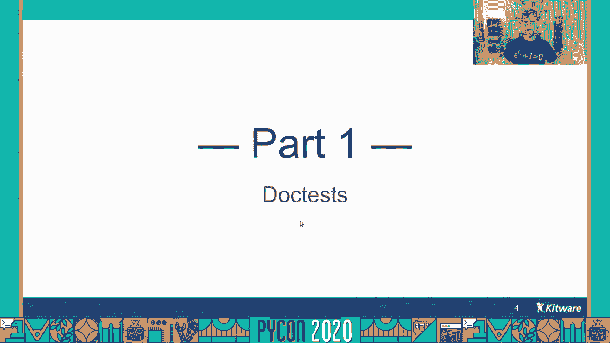

## 什么是 Doctest？ 🤔

如果你熟悉 Python，你可能知道如何编写一个函数。如果你将一个字符串直接放在函数定义之后，这就是一个文档字符串（docstring）。在文档字符串中，你可以放置任何你想要的文档。一个非常有用的做法是，在其中演示如何使用你编写的函数。

你可以在文档字符串中输入一些代码。如果在代码前加上三个大于号 `>>>`，那么这段代码就成为了一个 **Doctest**。例如，我们创建一个演示输入，展示如何将这些输入传递给函数本身，并断言输出看起来是合理的。

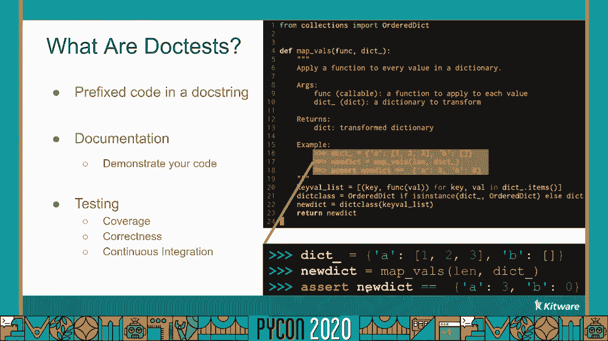

**核心概念**：Doctest 是嵌入在文档字符串中的可执行代码示例，用于验证代码行为。

```python
def example_function(x):
    """
    这是一个示例函数。
    >>> example_function(2)
    4
    """
    return x * 2
```

如果能提取此代码并在持续集成（CI）套件中进行测试，不仅可以增加测试覆盖率，还能更有信心地确保你写的代码是正确的。

---

## 如何将 Doctest 作为开发示例？ 🔧

每当我开始编写一个新类时，在编写任何功能之前，我喜欢创建一个名为 `demo` 的类方法。基本想法是创建一个输入示例，执行感兴趣的操作。我会在 Python 交互式环境（如 IPython）中创建这些输入的实例，并开始与它们交互，最终聚焦在我感兴趣的功能上。

但这并不是我在交互式环境中做的唯一事情。我也会编写检查，确保事情按我期望的那样进行。与其退出 IPython 让所有的检查白白浪费，为什么不把这些也复制到源文件中呢？有什么比把它们放在 Doctest 里更好的地方呢？

这意味着，作为开发周期的自然副产品，你不仅编写了感兴趣的功能，还编写了它的测试。这个关键的测试是与代码紧密耦合的。如果你必须重构模块，测试总是伴随着它。

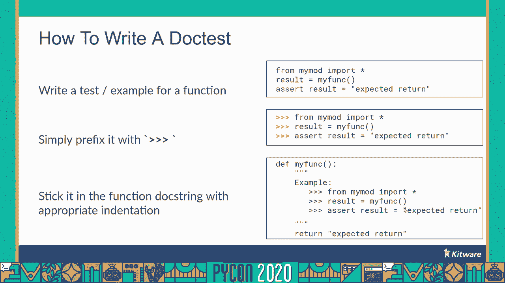

此外，当你开发 Doctest 时，你在任何地方都有入口点。Doctest 总是允许你创建所需的输入，因此可以逐行地遍历一段代码，而无需任何其他先决条件。如果有一个长时间运行的代码堆栈可能会出错，那么这是非常有用的。你可以在具有 Doctest 的函数中重现该错误，并可能修复它，而不必重新运行那个长时间运行的堆栈太多次。

现在我们已经了解了什么是 Doctest 以及如何开发 Doctest，让我们具体谈谈如何编写 Doctest，以及最重要的是，如何首先运行它们。

---

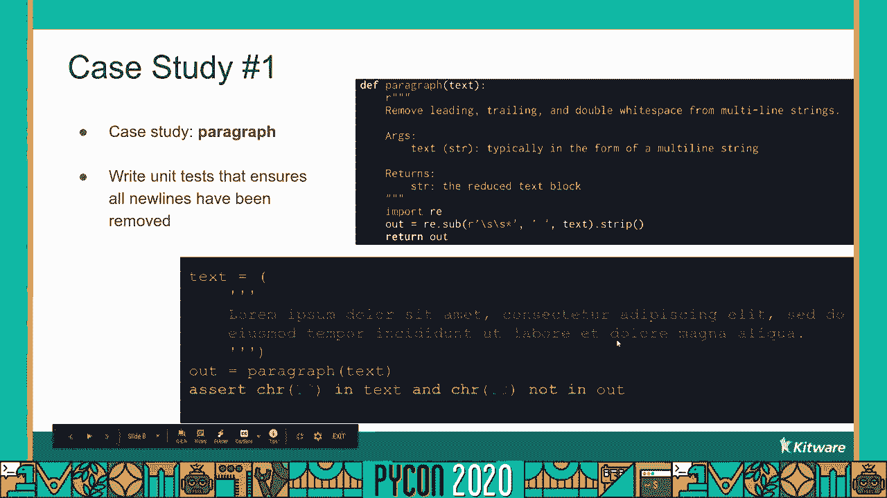

## 如何编写和运行 Doctest？ ✍️

要编写一个 Doctest，你只需要有一个函数。在函数的文档字符串中，在测试代码前加上三个大于号 `>>>` 和一个空格，然后将这个文本块插入到函数文档字符串中。除了小的例外，这基本上就是编写 Doctest 所需要做的一切。

然而，要运行一个 Doctest，这有点棘手。让我们通过几个案例研究来了解为什么会这样。

### 案例研究 1：段落处理函数

这个函数的概念是接收一段文字，去掉所有多余的空行和空格，然后返回输出。

为了测试这个，我们创建一些输入文本，用三个引号包围。这意味着文本将充满额外的换行符和空格。我们通过函数处理这篇文章，得到输出，然后断言在原始文本中有一个换行符，但输出文本中没有换行符。这似乎是一个合理的测试。

让我们把它创建为一个 Doctest。我们创建一个文件 `talk.py`，把函数放进去，然后把 Doctest 插入到文档字符串中，以适当的三个大于号作为前缀。

```python
def paragraph(text):
    """
    处理段落文本，移除多余空行和首尾空格。
    >>> input_text = \"\"\"
    ...     这是一段
    ...     有很多空行
    ...     和空格的文本。
    ... \"\"\"
    >>> output = paragraph(input_text)
    >>> '\\n' in input_text
    True
    >>> '\\n' in output
    False
    """
    # 函数实现...
    lines = [line.strip() for line in text.strip().splitlines() if line.strip()]
    return ' '.join(lines)
```

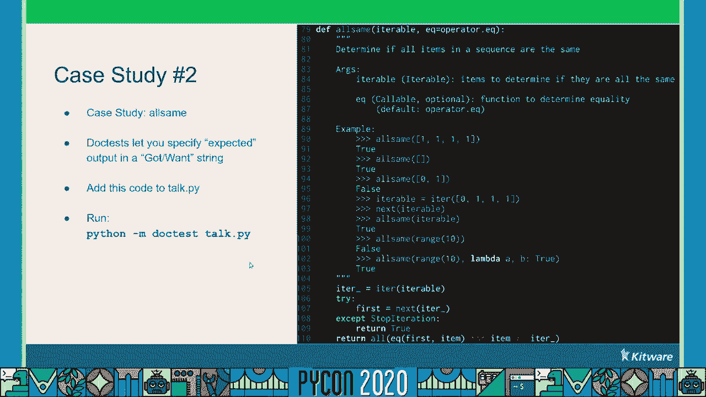

让我们使用 Python 内置的 `doctest` 模块来运行这个测试。我们可以用 `python -m doctest` 命令，后面跟上文件名。

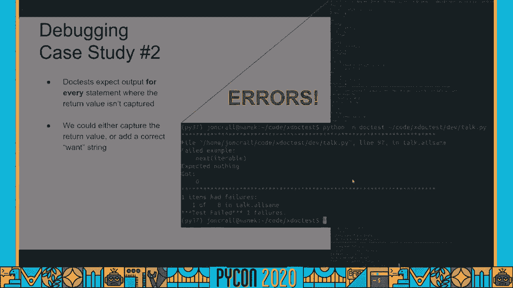

```bash
python -m doctest talk.py
```

我们可能会得到一个错误：`SyntaxError: unexpected EOF while parsing`。实际上，内置的 `doctest` 模块无法优雅地处理多行字符串语句。我们可以通过在多行语句之后取所有额外的行，并将前三个单引号替换为 `...` 来解决这个问题。

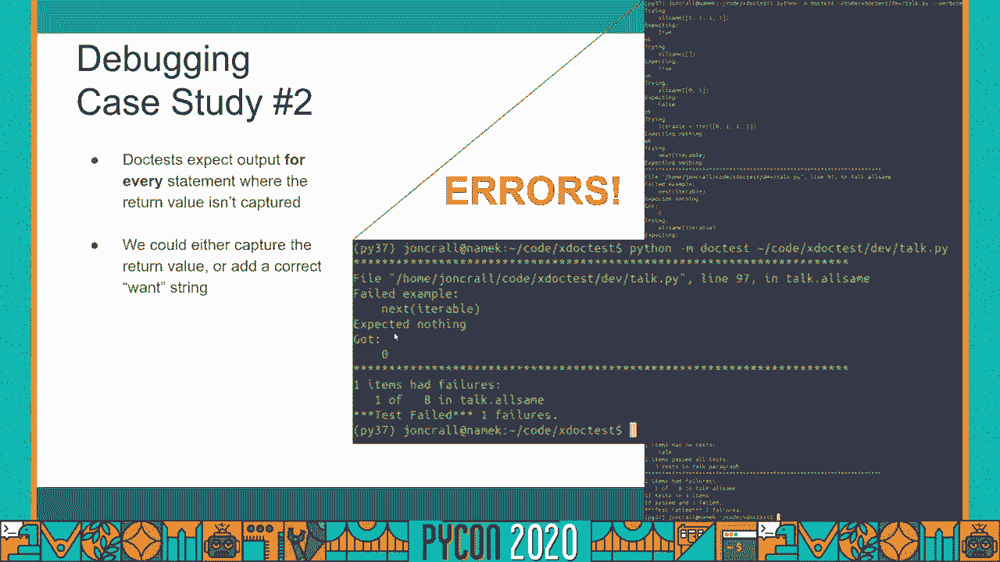

如果我们用这个新编辑的测试重新运行 Doctest，我们看到它起作用了。我们必须告诉 Python 如何解析自己的代码，这有点烦人，但我们做到了。

### 案例研究 2：检查可迭代对象元素是否相同

这个函数的想法是接收一个可迭代对象，确定迭代中的所有项是否相同。

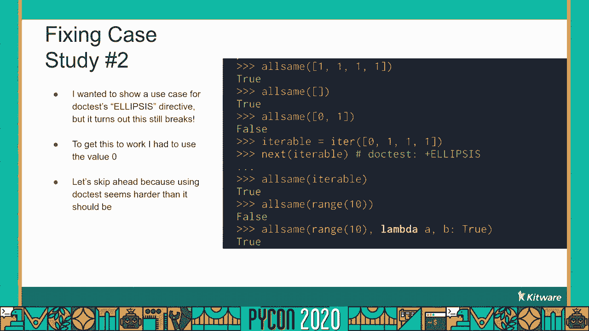

我们将使用 Doctest 的一个功能：如果执行一个函数，它返回一个值，你可以在下一行给出期望得到的值的字符串表示形式。这叫做“欲擒故纵”（原文为“want”）：你通过调用函数得到了一些东西，想要的东西在这里传递一个字符串。

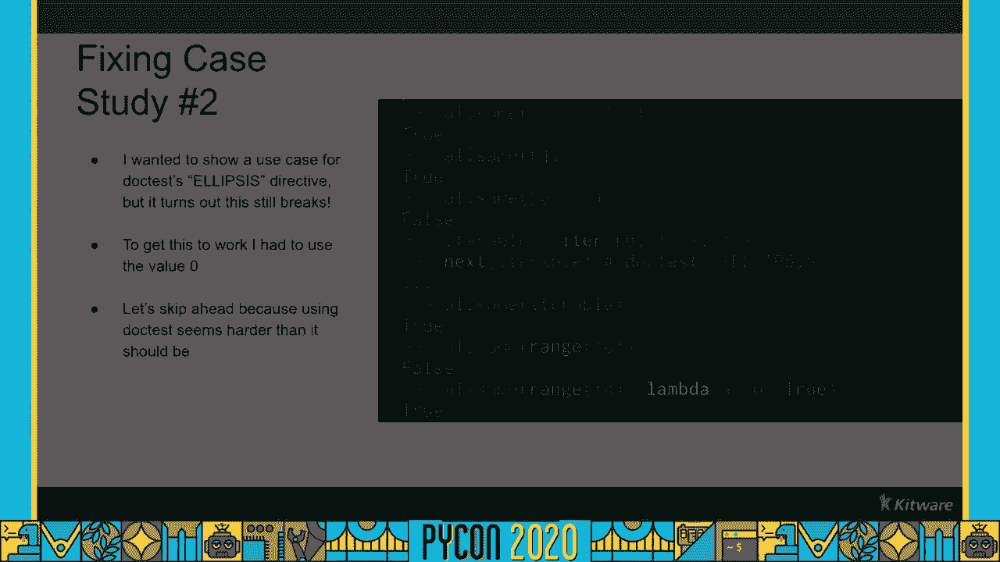

```python
def all_equal(iterable):
    """
    检查可迭代对象中所有元素是否相同。
    >>> all_equal([1, 1, 1])
    True
    >>> all_equal([])
    True
    >>> all_equal([1, 2, 3])
    False
    >>> items = [1, 2, 3]
    >>> first = items.pop(0)
    >>> all_equal(items)  # 现在 items 是 [2, 3]
    False
    """
    it = iter(iterable)
    try:
        first = next(it)
    except StopIteration:
        return True
    return all(first == x for x in it)
```

让我们做这个 Doctest，把它放在 `talk.py` 文件中，使用内置的 Python `doctest` 模块运行。

```bash
python -m doctest talk.py
```

没有多行语句，所以这似乎又是正确的。但我们可能会在 `next(iterable)` 这一行失败。我们没有期待什么，但一无所获。如果你还记得，我们弹出那个可迭代的第一个元素，因为我们想测试迭代。我们没有给它期望的东西，因为没有给它任何值。

我们发现，内置的 `doctest` 模块会出错，因为它迫使你为任何输出输入期望值。我们可以通过在这一行的末尾添加带有 `doctest: +ELLIPSIS` 的注释来指示省略号，启用 `doctest` 的省略号特性。这意味着如果我们给它 `...`，它将与语句中的任何内容匹配，从而避免我们需要关心这里发生了什么。

如果我们再重播一次，这将很好地工作。但让我们跳过前面，因为运行 Doctest 似乎比它需要的更难。

---

## 为什么 Doctest 没有无处不在？ 🤨

它们看起来真的很有用，但正如我们所见，它们运行起来有点棘手。你确实经常在野外看到它们，但问题是很多时候，应该提供的代码示例已经不管用了，因为代码写出来后就变了。因为人们不在他们的持续集成服务器上运行他们的文档测试，他们没有捕捉到这些错误。这是有道理的，因为运行 Doctest 是棘手的。

所以，如果有办法减少运行文档测试的麻烦，这就引出了我今天要讲的内容：`xdoctest`。

---

## 介绍 Xdoctest 🚀

`xdoctest` 基本上是一个向后兼容的模块，关键特点是它更宽容，有更长的字符串，它使用静态解析（解析你的 Doctest），与内置的动态解析不同。它有一个增强的运行器，输出消息稍微好一点，它有一个干净的 CLI。但到目前为止，`xdoctest` 最重要的特点是，它有更简单的 Doctest 语法。

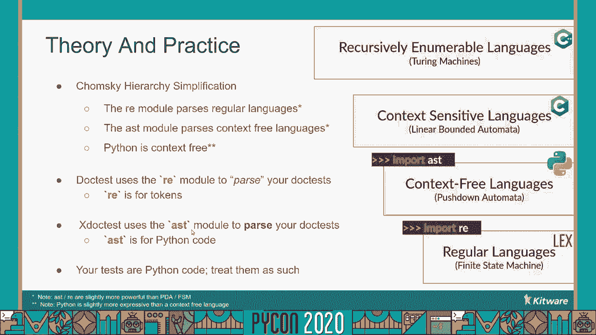

你不用在代码前面加上大于号或点，取决于它是否是多行语句。`xdoctest` 有一个规则：在所有东西前面放三个大于号，然后就完成了。

这怎么可能？为什么内置的 Python `doctest` 模块有这样的语法限制，但是 `xdoctest` 没有？要很好地理解这一点，我们需要快速了解一下形式语言理论。

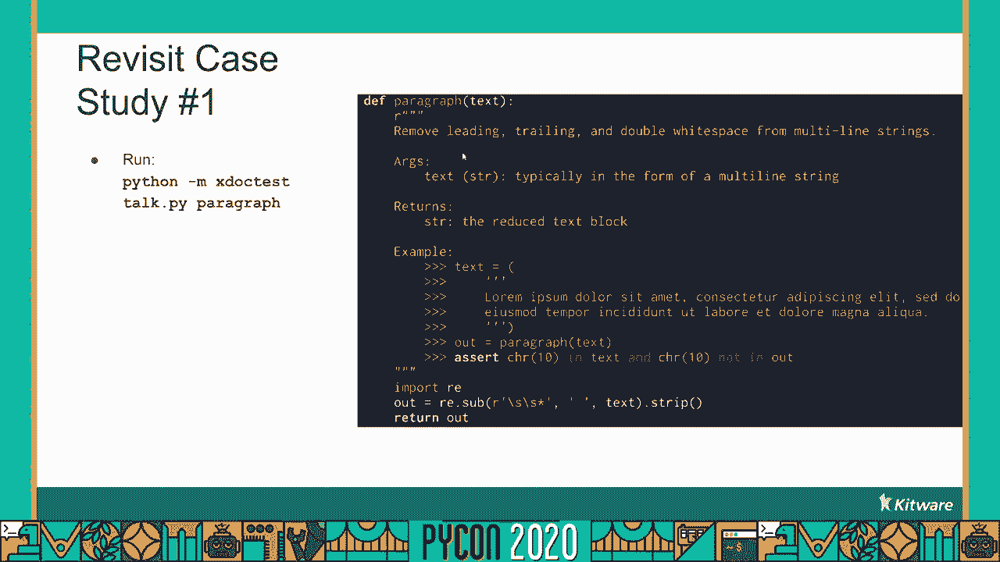

### 乔姆斯基层级与 Python 解析

我有一套叫做乔姆斯基层级的东西，它描述了语言的复杂性和表现力。在最底层我们有**正则语言**，它是最没有表现力的，但最容易解析。往上一层，我们有**上下文无关语言**，再往上是**上下文相关语言**，最上面是**递归可枚举语言**，相当于图灵机。

Python 在乔姆斯基层级中处于什么位置？我们可以把 Python 归类为上下文无关语言。如果你上网查，你很快就会发现 Python 并不是完全上下文无关的，但这主要是由于缩进和作用域。如果你把这个抽象出来，你就会得到一种上下文无关的语言，所以它现在已经足够接近我们的目的了。

Python 有两个我感兴趣的模块：`re`（正则表达式）模块，它解析正则语言；`ast`（抽象语法树）模块，它解析 Python 的上下文无关语言。

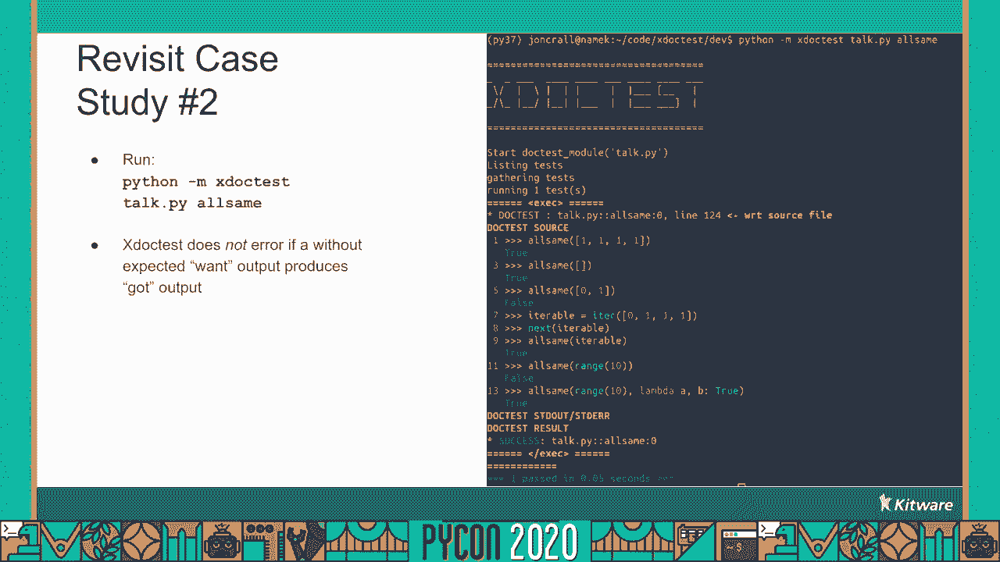

因此，`doctest` 模块的问题在于，它试图使用正则表达式来划分 Doctest。现在 Doctest 只是 Python 代码，所以 Python 太复杂了，不能用正则表达式来解析。你不能从数学上做到这一点。

在 `xdoctest` 中，我使用了 `ast` 模块（抽象语法树）而不是正则表达式模块。这就是我如何提取哪些行属于 `xdoctest` 中的哪些语句。本质上，Doctest 是 Python 代码，我们需要这样对待它们。

---

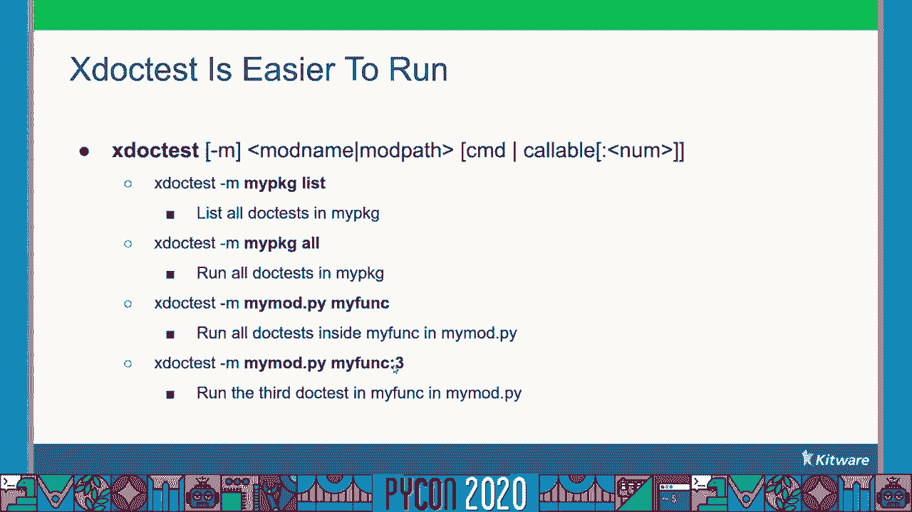

## 使用 Xdoctest 重温案例研究 🔄

现在我们对 `xdoctest` 有点熟悉了，让我们回顾一下我们的案例研究。

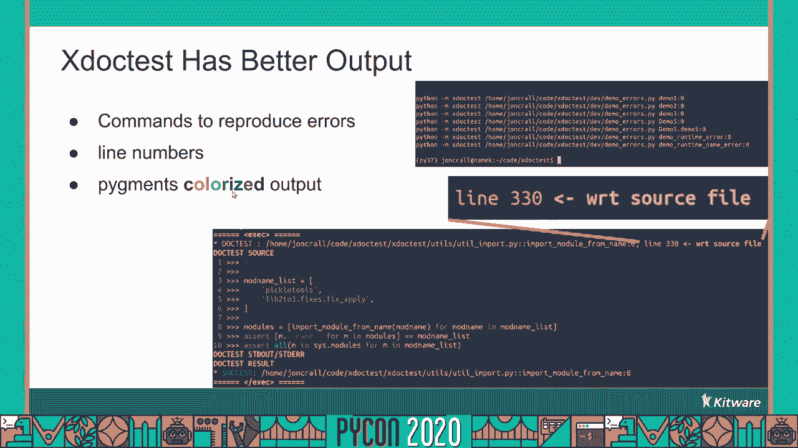

### 重新运行段落 Doctest

与其使用 `doctest` 模块，我们将使用 `python -m xdoctest`。

```bash
python -m xdoctest talk.py paragraph
```

`xdoctest` 允许你指定要运行的 Doctest 的函数名称。我们运行这个，它正常工作，没问题。`xdoctest` 能够处理缩进和前缀，不管语句是多行还是单行。多行字符串有时有那些大于号前缀是有点烦人的，你可以根据需要把课文写出来，`xdoctest` 也可以处理这种情况。因为它像解析代码一样解析 Doctest，它不需要知道哪一行属于哪个语句。所以你可以省略多行语句中的大于号，但你不必。

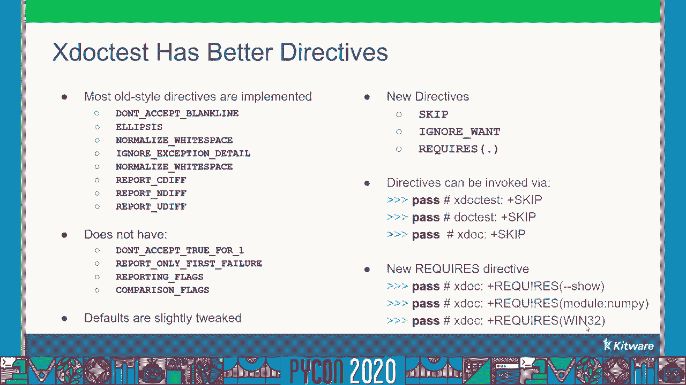

### 重新运行“检查相同元素” Doctest

如果你还记得，上次 `next(iterable)` 这一行给我们带来了问题，因为它返回的东西，我们没有告诉它我们期待着什么。让我们在 `talk.py` 文件上运行 `python -m xdoctest`，再次测试这个函数。

```bash
python -m xdoctest talk.py all_equal
```

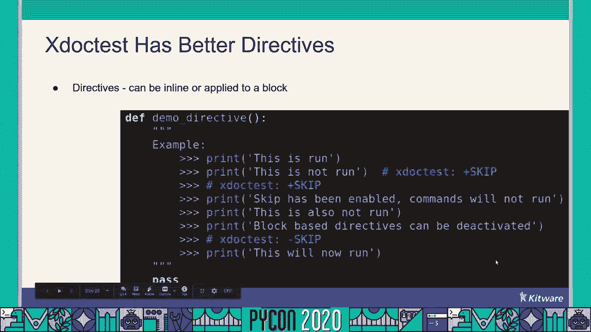

这个也行。`xdoctest` 默认情况下，如果你不提供任何检查，它假设你不关心检查该值。如果你提供一个期望值，它仍然会检查。但如果你不在乎，它也不在乎了。`xdoctest` 更灵活。

---

## Xdoctest 的优势与使用 🎯

使用原始的、内置的 `doctest` 模块运行 Doctest，你只能给它一个文件路径，它将运行它能在文件中找到的所有文档测试。另一方面，`xdoctest` 你可以向它传递模块名称、模块路径，或者一个特定的函数或类来运行。更确切地说，如果函数或类中有多个 Doctest，你可以使用冒号索引语法来指定要运行的 Doctest。

任何失败的文档测试都将列在底部。它们不仅会被列出，而且会以这样一种方式列出，它给你一个命令，你可以用它来重新执行失败的 Doctest 并进行可能的调试。`xdoctest` 不仅提供与 Doctest 本身有关的故障发生的行号，还提供文件里的 Doctest 行号。最后，它用颜色给输出上色，让所有的东西都更容易阅读。

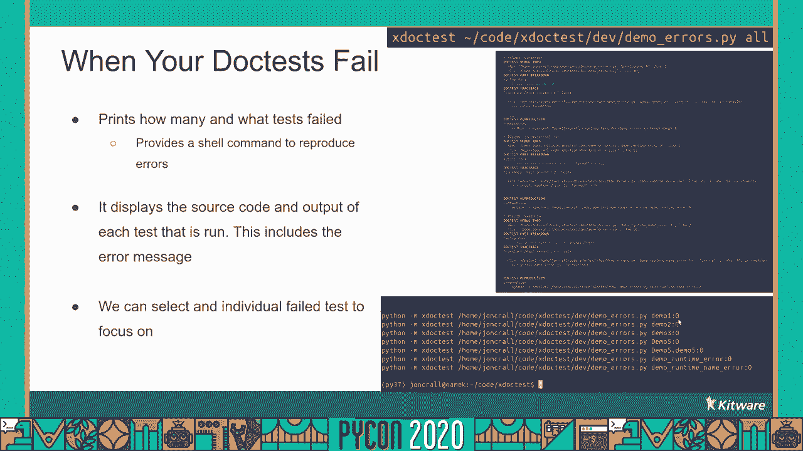

`xdoctest` 有更好的指令。我们讨论了一些存在于内置 `doctest` 模块中的指令，尤其是 `ELLIPSIS` 指令。但 `xdoctest` 也有一些新的指令，例如 `SKIP`，它的作用是本质上跳过你所需要的行，基于命令行参数有条件地跳过正在执行的行。在这种情况下，这一行将不会运行，除非命令行上存在 `--show` 参数。


你还可以检查一个模块是否存在并且是可导入的。在本例中，我们检查 `numpy` 模块是否存在。或者你可以根据操作系统条件执行。你可以查看文档以了解更多可能使用条件的示例。

---

## 与 Pytest 集成 🧪

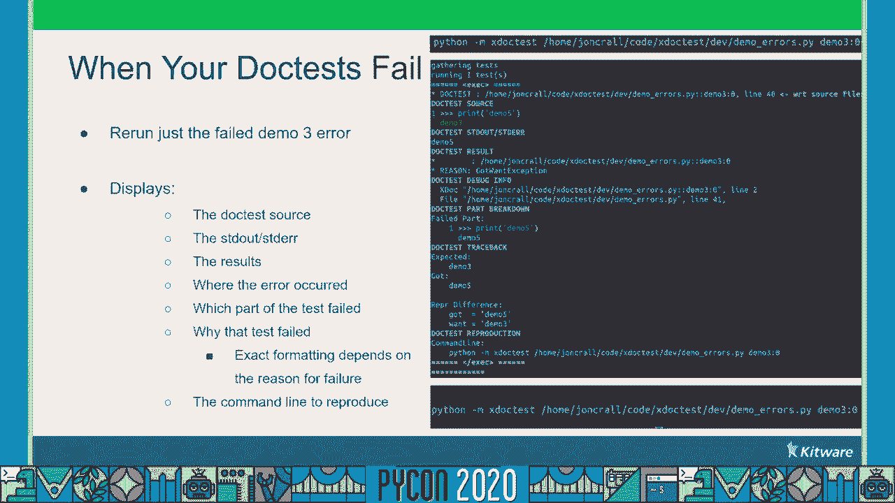

`xdoctest` 附带一个默认内置的 Pytest 插件。如果你使用 Pytest 并安装了 `xdoctest`，你可以通过配置告诉 Pytest 禁用其内置的 Doctest 插件，并启用 `xdoctest` 插件。这将把你所有的 Doctest 添加到你的测试套件中。

当你的 Doctest 有效时，Pytest 会告诉你它找到了多少个测试，以及有多少个测试将运行。然后向你展示将要运行的测试的源代码，然后显示输出，最后它会告诉你通过了多少测试。

当 Doctest 失败时，`xdoctest` 会打印出要运行多少个测试，打印源代码和输出以及结果是什么。最后它会告诉你哪些测试失败了，并提供一个命令行，你可以将它放入你的 shell 中以重现该测试。

---

## Xdoctest 的局限性与总结 📝

`xdoctest` 并不完美，有一些局限性。一是它比原始的 `doctest` 模块稍微慢一点，但那主要是因为使用了抽象语法树而不是正则表达式，这很难避免。但即使这样，它可能还有一些事情可以做得更有效率一点。它并不慢，但是它比内置的测试模块要慢。

另一个限制是，它不是百分之百向后兼容的。大部分都在那里，但有一些指令没有实现。同时我对这些指令的一些默认值进行了调整，使其本质上更加宽容，使文档测试更有可能在没有给程序员带来太多麻烦的情况下运行。

### 总结

在本节课中，我们一起学习了：

1.  **什么是 Doctest**：嵌入在文档字符串中的可执行示例，用于验证代码。
2.  **Doctest 的优势**：作为开发副产品自然产生测试，与代码紧密耦合，提供随时可用的入口点。
3.  **内置 `doctest` 模块的局限性**：使用正则表达式解析 Python 代码导致语法限制和运行困难。
4.  **`xdoctest` 的解决方案**：使用抽象语法树正确解析代码，提供更简单、更宽容的语法，更好的输出和更强的灵活性。
5.  **核心理论**：正则表达式用于标记（Token），抽象语法树用于 Python 代码。不要使用正则表达式试图解析 Python 代码，从数学上讲这是不可能的。

原始的 `doctest` 模块内置到标准库中，它使用正则表达式解析 Python 代码，有一个限制性的语法，输出简洁但难阅读，一次只能运行一个文件。但它背后有巨大的惯性，因为它是标准库的一部分。

另一方面，`xdoctest` 是一个外部 pip 可安装模块，使用抽象语法树来正确解析 Python 代码，它有一个更宽松的语法，有更好的指令，颜色和更可读的输出，它基本上是向后兼容的。它可以运行单个函数或整个模块。

如果你想为 `xdoctest` 做贡献，你可以在 GitHub 上找到它。如果你想开始使用，只需运行：

```bash
pip install xdoctest
```


记住：使用正确的工具做正确的事。对于复杂的 Python 代码解析，抽象语法树是你的朋友。