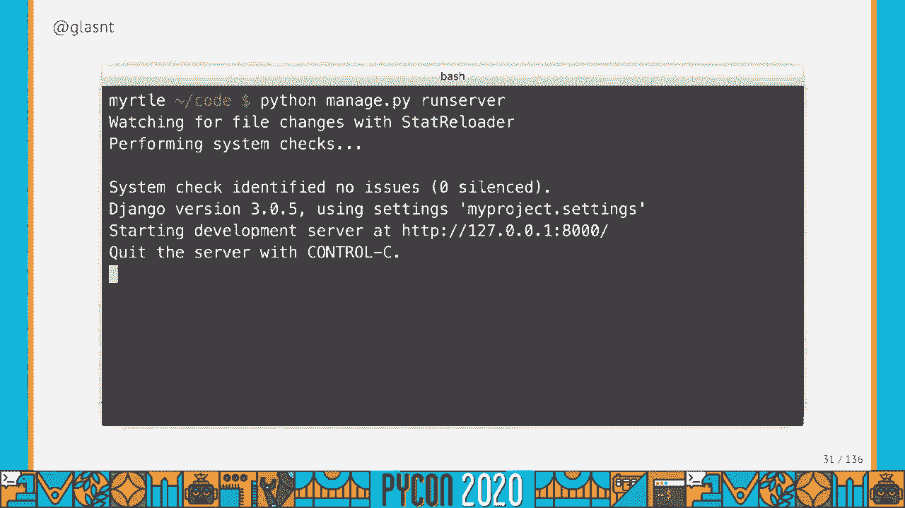
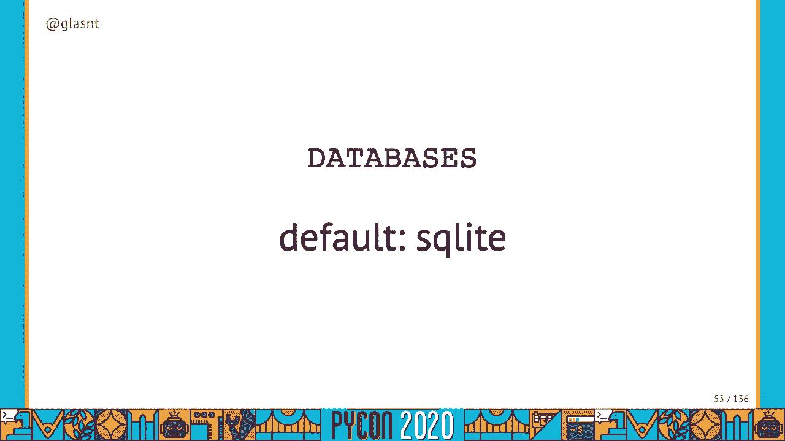
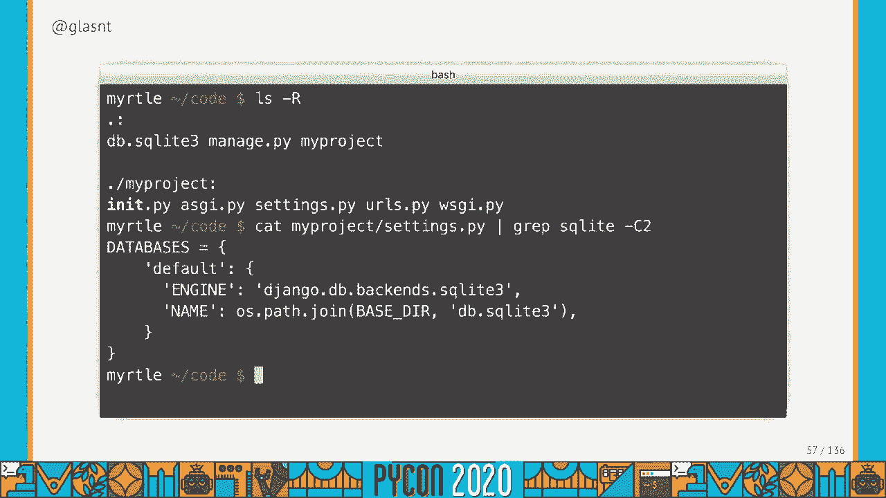
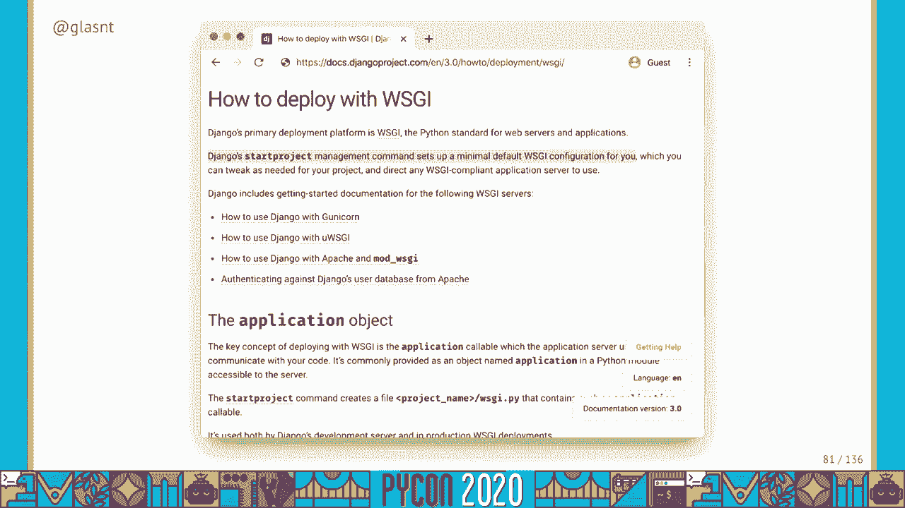
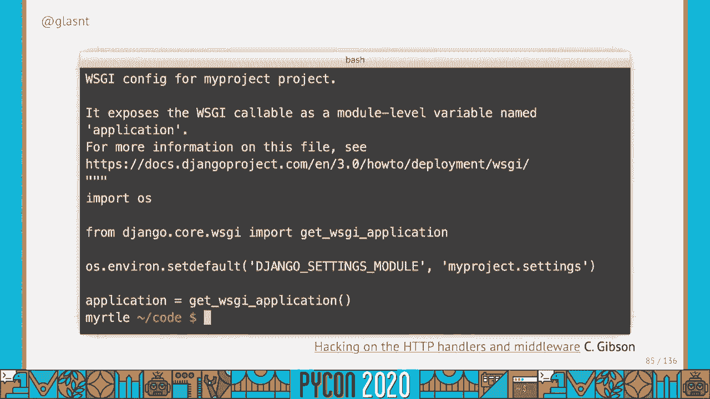
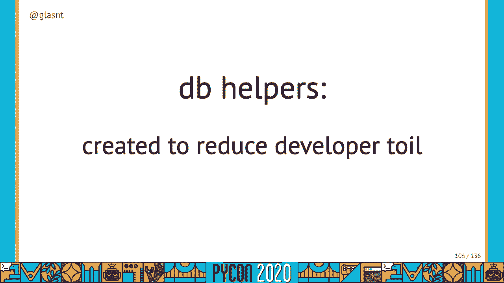
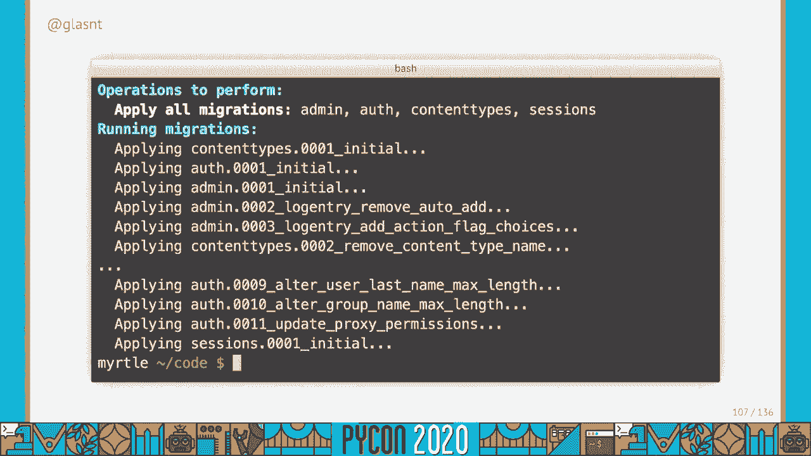

# Django部署详解：P50：部署到底是什么？🚀


在本教程中，我们将跟随 Katie McLaughlin 的演讲，系统地探讨“部署”这一概念，特别是针对 Django 应用程序。我们将了解从本地开发到生产环境所需的核心组件、面临的挑战以及可选的解决方案。目标是让初学者清晰地理解部署 Django 应用需要做什么。

---


## 1. 从本地开发开始 🛠️

上一节我们概述了课程内容，本节中我们来看看 Django 项目在本地是如何运行的。

Django 为本地开发提供了极大的便利。通过几个简单的命令，我们就可以启动一个项目。



以下是创建一个新 Django 项目并启动本地开发服务器的步骤：

1.  **安装 Django**：在终端中运行 `pip install Django`。
2.  **创建项目**：运行 `django-admin startproject myproject .` 在当前目录创建名为 `myproject` 的项目。
3.  **应用数据库迁移**：进入项目目录，运行 `python manage.py migrate`。这会根据默认设置创建一个 SQLite 数据库文件（`db.sqlite3`）。
4.  **启动开发服务器**：运行 `python manage.py runserver`。访问控制台输出的地址（通常是 `http://127.0.0.1:8000/`），你将看到 Django 的默认成功页面。

`python manage.py runserver` 命令启动了一个轻量级的开发 Web 服务器，它非常适合本地开发和调试。

---

## 2. 理解生产环境的差异 🏭

上一节我们让 Django 在本地运行了起来，本节中我们来看看为什么不能直接将这个“开发服务器”用于生产环境。

Django 官方文档明确指出：**切勿在生产环境中使用 `runserver`**。这个开发服务器没有经过安全审计或性能测试。Django 的核心是一个 Web 框架，而不是一个 Web 服务器。





要将应用部署到生产环境，我们需要替换或补充三个在开发中由 Django 简易提供的部分：

1.  **Web 服务器**：需要一个生产级的服务器（如 Nginx, Apache）来处理 HTTP 请求。
2.  **数据库**：需要将轻量的 SQLite 替换为更健壮的生产级数据库（如 PostgreSQL, MySQL）。
3.  **静态文件服务**：需要专门的服务器或服务来处理图片、CSS、JavaScript 等静态文件。

生产环境是一个“活”的、面向真实用户的环境，它要求稳定性、安全性和性能。Django 本身是生产就绪的框架，但它依赖的外部服务需要我们自己配置。

---

## 3. 核心：WSGI 与 Web 服务器 🔌

上一节我们明确了生产环境的需求，本节中我们来看看如何让 Django 与生产级 Web 服务器通信。

Django 与 Web 服务器之间通过 **WSGI** 标准进行通信。WSGI 是 Python 的 Web 服务器网关接口，它定义了 Web 服务器如何与 Python Web 应用程序交互。

当你创建 Django 项目时，会自动生成一个 `wsgi.py` 文件，它提供了 WSGI 的可调用应用对象。这个文件是连接 Django 和任何兼容 WSGI 的 Web 服务器的桥梁。

**代码示例：`wsgi.py` 的核心作用**
```python
# myproject/wsgi.py
import os
from django.core.wsgi import get_wsgi_application

os.environ.setdefault('DJANGO_SETTINGS_MODULE', 'myproject.settings')
application = get_wsgi_application() # 这就是 WSGI 应用对象
```





常见的生产级 WSGI 服务器包括 **Gunicorn** 和 **uWSGI**。你需要选择一个 WSGI 服务器来运行你的 Django 应用，然后通常在其前方放置一个像 Nginx 这样的 Web 服务器作为反向代理，处理静态文件和负载均衡。

---

## 4. 选择部署策略：托管服务 🤔

上一节我们介绍了 WSGI，本节中我们来看看如何选择部署应用的基础设施。关键在于：**你希望自己管理多少底层基础设施？**

主要有两类托管服务提供商：

1.  **平台即服务**：你主要关心应用代码和数据。提供商负责操作系统、Web 服务器、运行时环境等。例如：Heroku, PythonAnywhere, Google App Engine。
    *   **优点**：简单快捷，无需系统管理。
    *   **缺点**：灵活性和控制度较低。

2.  **基础设施即服务**：你拥有虚拟机或容器，需要自己安装和配置操作系统、Web 服务器、数据库等。例如：AWS EC2, Google Compute Engine, DigitalOcean Droplets。
    *   **优点**：控制度高，灵活性大。
    *   **缺点**：需要系统管理知识，维护负担重。

**建议**：如果你没有特殊需求，只是想快速部署应用，**平台即服务** 是更好的起点。如果你想深入学习或有特定的定制需求，可以选择 **基础设施即服务**。

---



## 5. 处理数据库与静态文件 💾



上一节我们讨论了部署环境，本节中我们来看看两个关键的有状态组件：数据库和静态文件。

### 数据库选择与托管
Django 支持多种数据库。对于生产环境，**PostgreSQL** 是一个强烈推荐的选择，因为它功能丰富且与 Django 社区集成度最高。

你可以选择自己搭建和管理数据库服务器，但更推荐使用 **托管数据库服务**。云提供商都提供此类服务。这样做的好处是：
*   提供商负责备份、复制、软件更新和硬件扩展。
*   确保数据安全性和高可用性。
*   让你专注于 Django 模型设计，而非数据库运维。

### 静态文件服务
Django 的 `python manage.py collectstatic` 命令用于收集所有静态文件到一个目录。在生产中，你需要通过其他方式提供这些文件：

1.  **使用云存储**：如 AWS S3, Google Cloud Storage。这是最常用和推荐的方式，可扩展性好。
2.  **使用 Web 服务器**：配置 Nginx 等服务器直接提供静态文件目录。
3.  **使用 CDN**：将静态文件托管在内容分发网络上，加速全球访问。

**核心公式：部署 Django ≈ 复制代码 + 配置数据库 + 设置静态文件服务 + 运行 WSGI 服务器**

---

## 6. 总结与回顾 🎯

在本节课中，我们一起学习了 Django 部署的核心概念。

我们首先从本地开发服务器入手，理解了它与生产环境的区别。然后，我们明确了生产部署必需的三个组件：**生产级 Web 服务器**、**生产级数据库** 和 **静态文件服务方案**。

接着，我们深入了解了 **WSGI** 作为连接 Django 与 Web 服务器的标准接口。面对部署，我们分析了 **平台即服务** 和 **基础设施即服务** 两种主要策略，帮助你根据自身情况做出选择。

最后，我们探讨了如何为生产环境选择合适的**数据库**以及如何有效地处理**静态文件**。


记住，**每个生产环境都略有不同**，没有唯一的“正确”答案。最佳的部署方式取决于你的具体需求、技术栈和维护能力。希望本教程为你提供了清晰的路线图，帮助你自信地迈出部署 Django 应用的第一步。