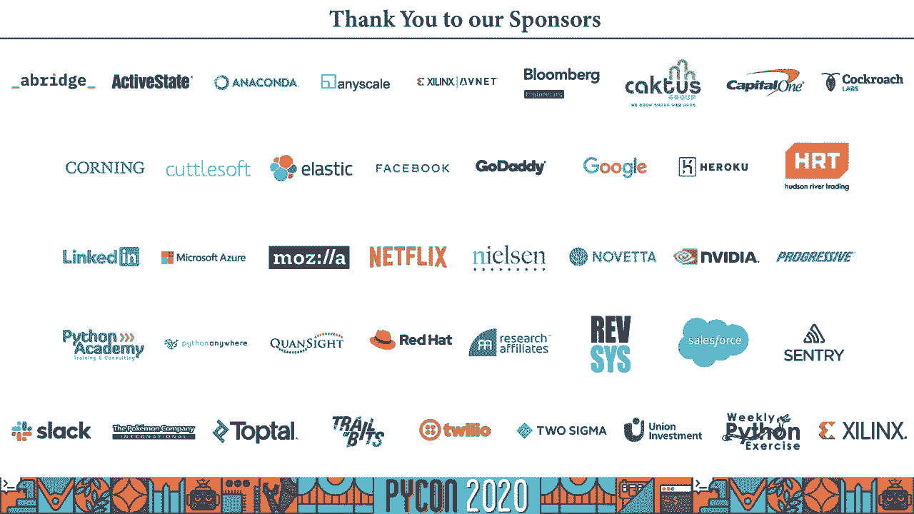

# Python 与游戏数据分析：1：解码竞技视频游戏中的偏见与叙事 🎮📊


在本教程中，我们将学习如何利用 Python 构建一个视频分析系统，来解码竞技视频游戏（以《守望先锋》为例）直播中可能存在的偏见和叙事倾向。我们将从动机出发，逐步讲解系统架构、技术选型、数据处理，并最终验证一些关于观众观看偏好的初始假设。

## 概述

本次课程将引导你完成一个完整的项目：分析《守望先锋》职业联赛（OWL）的比赛录像，量化不同英雄和战队在直播画面中的“屏幕时间”。我们将通过假设驱动的方法，探究直播制作方可能存在的叙事偏好，例如是否更偏爱展示明星选手、特定角色或领先的队伍。

---

## 动机与背景 🤔

上一节我们概述了课程目标，本节中我们来看看项目背后的动机和相关背景知识。

我负责 VS Code 的 Python 扩展开发，但主要进行前端开发，更常使用 JavaScript 或 TypeScript。我决定开展一个副业项目来更好地学习 Python，并且这个项目应该围绕我喜欢的事物展开。

我喜欢玩《守望先锋》，也喜欢观看职业选手的比赛。挑战媒体所呈现的内容是很有意义的，这促使我跳出固有思维，使用假设驱动的方法进行验证：先提出假设，再收集数据，最后用数据来验证或否定这些假设。

在开始之前，需要简要了解电子竞技和《守望先锋》。

**电子竞技**是一种以电子游戏为媒介的体育竞赛形式。据统计，最受欢迎的电竞赛事观看时长可达数十亿小时。这些内容在 Twitch、YouTube Gaming 等流媒体平台，甚至 ESPN 等传统电视频道播出。电子竞技产业已经形成了包括联盟特许经营、传统体育俱乐部投资在内的成熟生态。

**《守望先锋》** 是一款团队基础的第一人称射击游戏。玩家分为两支六人队伍，在地图上争夺目标。队伍角色构成通常为：2 名坦克、2 名输出、2 名支援。游戏拥有众多英雄，各自拥有独特能力和外观设计。

**《守望先锋联赛》（OWL）** 是一个以城市为基础的特许经营联赛。比赛在 YouTube 上直播，采用多地图赛制，先赢得三张地图的队伍获胜。

---

## 核心问题与假设 ❓

了解了背景后，我们面临的核心问题是：在团队游戏中，直播镜头会跟随谁？谁来决定镜头中的“行动”？

为了回答这个问题，我提出了以下假设：
1.  **角色偏见假设**：即使这是团队游戏，观众也更想看“明星”选手，而输出英雄通常更容易打出精彩操作，因此镜头可能会更偏向于展示输出英雄。
2.  **战队偏好假设**：观众是更愿意为处于劣势的“underdog”战队加油，还是更愿意观看胜率更高的战队？直播镜头是否会更多地给到比赛中领先的队伍？

这些假设涉及多个层面：观众的真实喜好、制作方认为的观众喜好、以及制作方希望引导的观众喜好。

---

## 系统架构与工作流程 ⚙️

上一节我们提出了待验证的假设，本节中我们来看看如何构建分析系统来获取数据。

系统的工作流程如下：
1.  **提取帧**：从比赛直播视频中提取出每一帧图像。
2.  **裁剪区域**：将每一帧图像裁剪，只保留屏幕底部显示玩家游戏内ID的区域。
3.  **文字识别**：将裁剪后的图像发送到光学字符识别（OCR）服务，识别出玩家ID。
4.  **数据存储**：将识别出的玩家ID、时间戳等信息存储到数据库中。
5.  **统计分析**：从数据库中查询数据，计算各英雄、各战队的屏幕时间占比，并进行可视化。

以下是该流程的架构示意图：
```
视频流 -> 提取帧 (FFmpeg) -> 裁剪图像 (Pillow) -> OCR识别 (Azure CV) -> 数据存储 (TinyDB) -> 统计分析 & 可视化 (Plotly/Dash)
```

---

## 技术选型与实现细节 🛠️

本节将详细介绍构建系统时所做的技术选型及其原因。我的原则是：选择设置简单、文档完善、较为流行的工具。

### 1. 视频处理与帧提取
我选择了 **FFmpeg**，这是一个功能强大的命令行音视频处理工具。它拥有 Python 绑定库 `ffmpeg-python`，允许在代码中直接调用，无需创建子进程。
```python
# 示例：使用 ffmpeg-python 提取帧
import ffmpeg
stream = ffmpeg.input('match_video.mp4')
stream = ffmpeg.output(stream, 'frame_%04d.png')
ffmpeg.run(stream)
```

### 2. 图像裁剪
我使用 **Pillow**（PIL Fork）库进行图像处理。为了最小化发送到 OCR 服务的数据量和干扰信息，我只裁剪包含玩家ID的固定矩形区域。
```python
from PIL import Image
def crop_player_area(image_path, crop_box):
    img = Image.open(image_path)
    cropped_img = img.crop(crop_box) # crop_box = (left, top, right, bottom)
    return cropped_img
```
**挑战**：游戏内UI会随玩家移动而跳动，导致裁剪区域可能不总是精确包含完整ID。

### 3. 光学字符识别
我首先尝试了本地的 **Tesseract OCR**，但它对游戏特殊字体和颜色处理效果不佳。随后我转向了 **Azure 计算机视觉服务**。它提供异步的“Read API”，能更好地处理这类图像。
```python
# 示例：使用 Azure CV Read API (异步)
import azure.cognitiveservices.vision.computervision as cv
computervision_client = cv.ComputerVisionClient(endpoint, credentials)

with open(image_path, "rb") as image_stream:
    read_operation = computervision_client.read_in_stream(image_stream, raw=True)
    # ... 等待并获取结果
```
**注意**：视频分辨率需至少为 720p，以保证文本清晰度。免费层有调用次数限制。

### 4. 数据存储
基于“最小设置”原则，我选择了 **TinyDB**。它是一个轻量级、面向文档的数据库，无需外部服务器，直接存储 Python 字典（类似 JSON）。
```python
from tinydb import TinyDB, Query
db = TinyDB('match_data.json')
table = db.table('map_1')
table.insert({'frame': 1001, 'player_name': 'PlayerA', 'team': 'Team1'})
```
数据结构设计：一个数据库文件对应一场比赛，其中每张地图是一个表，每帧图像是一条记录。

### 5. 数据可视化与展示
我使用 **Plotly** 生成交互式图表，并用 **Dash** 构建了一个简单的 Web 仪表板来整合图表和说明文字。Dash 结合了 Plotly、React 组件和 Flask 服务器。
```python
import dash
import dash_core_components as dcc
import dash_html_components as html
import plotly.express as px

app = dash.Dash(__name__)
app.layout = html.Div([
    html.H1("屏幕时间分析"),
    dcc.Graph(figure=px.bar(data, x='role', y='screen_time_percent'))
])
```
生成的图表可以展示角色（输出/坦克/支援）的屏幕时间分布，以及不同战队之间的屏幕时间对比。

---

## 遇到的挑战与改进空间 🔧

在构建系统的过程中，遇到了一些挑战，也发现了可以优化的地方：

以下是几个主要的改进方向：
1.  **动态区域裁剪**：由于游戏UI跳动，固定裁剪区域不可靠。未来可以尝试使用目标检测模型动态定位玩家ID区域，或裁剪更大的区域再进行二次分析。
2.  **OCR 精度提升**：可以结合图像预处理（如二值化、颜色过滤）来提高OCR的准确率。
3.  **技术选型反思**：TinyDB 适合原型开发，若处理大规模数据需考虑更强大的数据库（如 PostgreSQL）。性能并非本项目首要考虑因素。
4.  **数据源的扩展**：目前仅分析了第一人称视角画面。直播中还有第三视角、队伍Logo、目标点进度等可视信息，以及解说音频（强调某位选手），这些都可作为分析数据源。
5.  **可视化优化**：图表的美观度和信息呈现方式有较大提升空间，可以深入研究 Plotly 文档或选用其他可视化库。

---

## 数据分析与假设验证 📈

系统搭建完成后，我们使用第10周的10场OWL比赛数据进行了分析。

**数据集**：共10场比赛，记录了每场比赛前各战队的胜负记录以计算胜率。

现在，让我们回顾并验证最初的假设：
1.  **角色偏见假设**：**得到支持**。平均屏幕时间分布严重偏向输出英雄，占比远高于坦克和支援。
2.  **战队偏好假设**：结果混合。
    *   在10场比赛中的8场，**最终获胜的队伍**获得了更高的总屏幕时间百分比。
    *   但只有一半的比赛中，**赛前胜率更高**的队伍获得了更高的屏幕时间。

**结论**：数据显示，直播制作方确实倾向于展示输出英雄和比赛中领先（最终获胜）的队伍。然而，“观众是否更爱看强队”这一点，数据给出的信号并不绝对明确。

**分析局限性**：
*   **样本量小**：仅10场比赛。
*   **数据维度单一**：仅分析了玩家ID的屏幕时间，未计入其他镜头语言（如特写、队伍标识）和解说评论。
*   **因果关系**：数据呈现相关性，但无法断定是制作方刻意引导，还是因为领先队伍/输出英雄本身就处于镜头焦点位置。

---

## 总结与收获 🎯

本节课中，我们一起学习并实践了一个完整的 Python 数据分析项目。

我们从对游戏直播的观察中提出假设，然后运用 Python 生态系统中的工具（FFmpeg, Pillow, Azure Cognitive Services, TinyDB, Plotly/Dash）构建了一个视频分析流水线，从原始视频中提取、处理、存储并可视化数据。最后，我们用数据对最初的假设进行了验证和讨论。

这个项目的核心收获在于：
*   **假设驱动开发**：有了想法（假设），就用技术和数据去探索和验证。
*   **Python 的广泛应用**：Python 在多媒体处理、云服务调用、数据分析和可视化方面都有强大的库支持。
*   **数据的诠释**：数据能揭示模式，但解读需要谨慎。同样的数据可能支持不同的观点。

本项目仅仅触及了从游戏视频中提取信息的表面。你可以扩展它，分析更多类型的数据，甚至应用于其他游戏或领域。希望这个教程能激发你利用 Python 去做一些有趣的分析项目！

**项目资源**：
*   代码仓库：[GitHub Repo](https://github.com)
*   作者推特：可通过推特联系作者进行交流。



