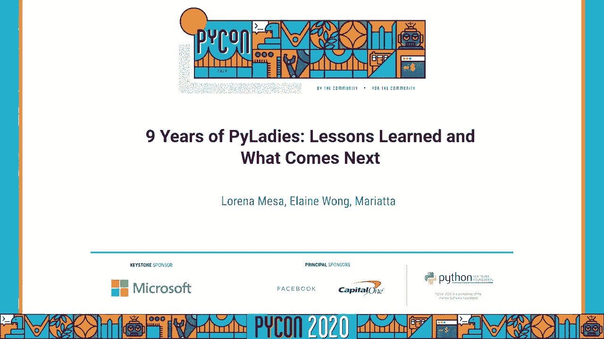
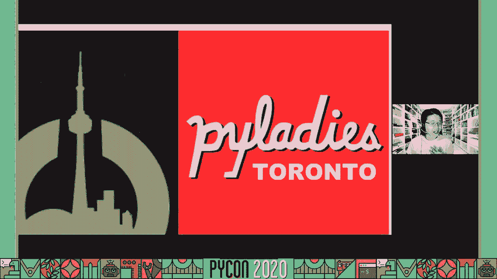
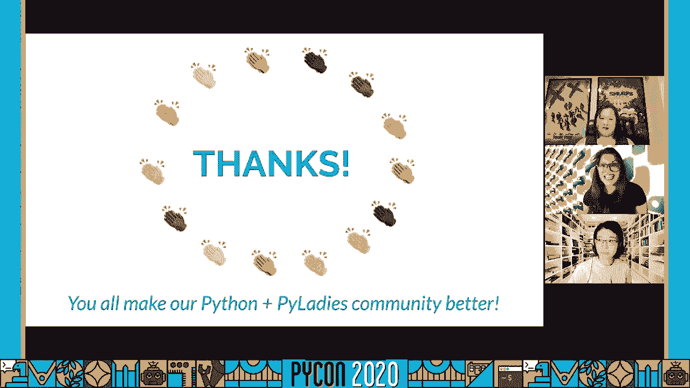
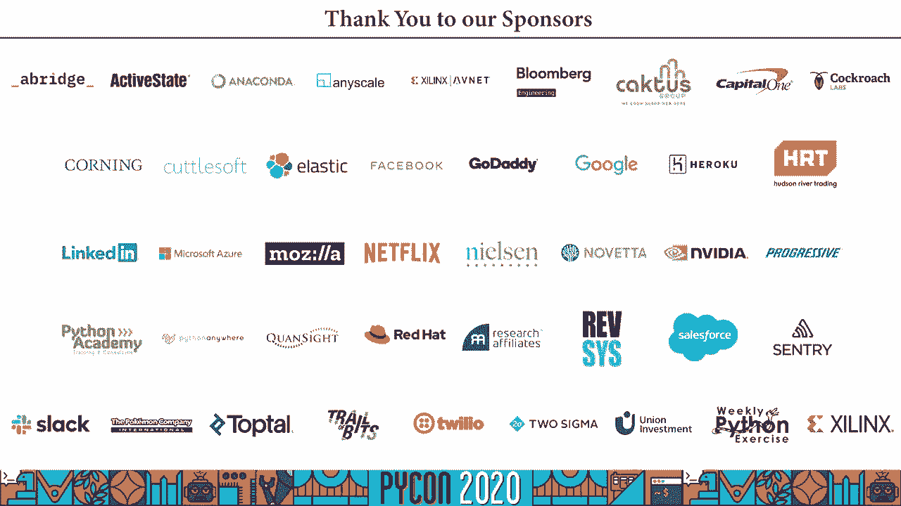

# PyLadies 经验分享：P52：九年的成长与变革之路

在本教程中，我们将跟随 Lorena Mesa、Elaine Wong 和 Mariatta 的分享，回顾 PyLadies 社区九年的发展历程。我们将了解其起源、使命、取得的成就、面临的挑战以及未来的发展方向。内容将涵盖社区建设、多样性倡议和组织结构演变等核心主题。

## 起源故事：一个共同的需求

一切始于个人寻找归属感的旅程。分享者德拉梅在2010年毕业后，作为一名记者，希望提升技能并发现了Python语言。她发现Python在数据解析方面非常强大，有助于她的调查工作。

然而，当她尝试加入本地Python用户组时，感到非常不适应。在一个主要由经验丰富的男性开发者组成的80人房间里，作为一名编程新手和科技界新人，她很难找到归属感。即使人们很友好，她也常常不确定对方是真心帮助还是别有意图。这促使她开始寻找像自己一样的女性Python爱好者。

## 全球运动的诞生：从洛杉矶到世界

这种寻找同伴的需求并非个例。早在2011年，亚特兰大PyCon的一群女性（包括Christine Cheung、Jessica Stanton等）也有相似的感受。她们希望聚集一群对Python充满热情的女性。

奥黛丽为此撰写了一份资助提案，聚焦于**教育、会议和社区拓展**三个领域。Python软件基金会（PSF）批准了这份提案，因为他们看到了解决社区性别代表性问题的必要性。PSF后来成为PyLadies的财务赞助方，使其成为基金会内的一个实体。

**第一章节在洛杉矶成立**。随后，社区开始成长：墨尔本成立了第二章，接着是华盛顿特区和旧金山。从2011年开始，PyLadies证明了其存在的必要性，并开始在全球范围内扩展。

## 使命与早期建设：奠定基础

早期志愿者团队为社区奠定了坚实基础。他们制定了一份清晰的使命声明：

> PyLadies是一个国际会员组织，致力于帮助更多女性成为Python开源社区的参与者和领导者。我们的使命是通过拓展、教育、会议、活动和社交聚会，促进多元化的Python社区发展。PyLadies旨在为女性提供一个友好的支持网络，并搭建通往更广阔Python世界的桥梁。任何对Python感兴趣的人都受到鼓励参与。

这份使命声明由最初的九人团队通过PSF资助的项目推动，发起了一场全球运动。如今，PyLadies已发展成为一个国际导师组织，专注于帮助女性在Python社区中变得更加活跃并成为领导者。

## 庆祝成就：走过的漫长道路

在过去的九年里，PyLadies取得了显著成长。目前，我们在全球拥有**90多个分会**，遍布许多国家。每个分会都在本地运行，为女性提供了一个发展事业和技能的社区。

我们的社区帮助培养了新一代的女性演讲者和开源贡献者。如果我们回顾9年前Python大会演讲者的性别多样性历史，只有**1%的演讲者是女性**。如今，这个数字已经提升到**约40%**，并且保持相对稳定。

社区成员分享了他们的感受：
*   来自迈阿密的Madeline Cambos提到：“支持与知识共享。”
*   Fishao Hanman说：“PyLadies是唯一让我感到可以舒适地提出编程问题的地方。克服因身为女性而被严厉评判的恐惧非常困难，这个社区在很大程度上帮助我跨越了这个障碍。”

## 面临的挑战与持续努力

尽管取得了进展，我们仍面临挑战。五年前的Python语言峰会上，没有女性核心开发者，甚至没有女性与会者。这激励了分享者开始为Python做贡献，并最终成为核心开发者。

今年的语言峰会有**7名女性参与**，其中3人发表了演讲，这比以前好多了。然而，我们仍然面临让女性进入积极领导角色的挑战。

一个核心问题是**草根运动中的资源差异**，这影响了不同地区的分会。例如，芝加哥和巴西的分会情况截然不同，反映了各自社区的独特需求。

维持成员活跃度和留存率是一个瓶颈，尤其是在获取资金方面。强大的地方分会有助于更好地控制内容创作和传播。我们希望建立一种**全球社区感**，而不仅仅是基于地理位置的连接。

## 展望未来：新的组织结构

在思考未来时，我们面临一个复杂的问题：如何在本地自主性和全球统一性之间找到平衡？我们如何让人们以更有意义的方式参与？

我们举办了一次研讨会，旨在汇集全球观点，讨论下一步该做什么。我们知道，空谈大问题而无具体行动是无法取得进展的。我们需要切实可行的步骤。

我们受到了“Django Girls”等组织的启发，它们拥有强大的地方分会，是一个由许多志愿者管理的基层组织。这为我们提供了一个很好的起点。

## 请求评论模型：全球领导团队与项目小组

我们提出了一个“请求评论”模型。核心是建立一个**全球领导团队**（后称全球理事会）。这个团队将成为Python软件基金会的代言人，负责处理如“我的芝加哥分会如何获得资金”这类问题，并着眼于更大的全局性项目。

同时，我们设立了**项目小组**，涵盖金融资源、技术、营销、行为准则等领域。这些小组像开源项目一样管理，允许人们根据自己的热情参与具体工作，而不必成为活动组织者或演讲者。这回归了志愿服务的本质：**让人们能够从事他们热爱的事情**。

这个全球领导模式旨在让一群人引领方向，同时为PyLadies成员创造更多有意义的参与机会。

## 实施与推广：确保全球代表性

我们为2019年的研讨会做了大量工作，并与社区进行了对话。我们非常强调**全球代表性**，思考如何让世界各地的PyLadies成员参与进来。

我们做的一件事是将相关材料翻译成多种语言。在Python翻译社区和Pillow项目的帮助下，我们迅速完成了翻译工作。最终，我们提供了**阿拉伯语、中文（普通话）、法语、葡萄牙语、俄语和西班牙语**版本，加上英语共七种语言。这是为了用人们感到舒适的语言与他们沟通。

对于全球理事会，我们制定了区域要求：**不超过三分之一的理事会成员可以来自同一个国家**。例如，如果总共有9个席位，那么来自美国的最多只能有3人。这是为了确保我们获得真正想要的全球品牌和视角。

此外，我们还考虑了多样性，确保职业生涯不同阶段的人都有机会参与，而不仅仅是那些知名度高的人。

## 当前进展与加入方式

我们已经开通了专门的网站，用于**提名和申请成为全球理事会成员**。同时，我们也开放了试点会员注册，注册会员将拥有投票权。网站支持多种语言。

对理事会成员的公开招募于5月6日开始，时间线与整体工作安排保持一致。

我们衷心感谢所有帮助过我们的人，无论是参与月度会议、回复信息，还是协助翻译。正是大家共同努力，让Python和PyLadies社区变得更好。

如果你想保持联系，我们有几个渠道：
*   可以访问我们的网站获取所有资源。
*   我们有一个Slack群组（需遵守行为准则）。
*   可以加入我们的Github组织。
*   我们有一个临时的全球小组每月开会一次，任何人都可以在Github仓库的议题中添加讨论内容。
*   请在Twitter上关注我们，并随时注册成为PyLadies会员。

---

**本节课总结**：我们一起回顾了PyLadies社区九年的发展历程。从个人寻找归属感开始，到发展成为一个拥有90多个分会的全球性组织，PyLadies始终致力于通过教育、支持和社区建设，提升女性在Python开源领域的参与度和领导力。我们探讨了其明确的使命、庆祝了在提升演讲者多样性等方面取得的成就，也坦诚面对了资源分配和全球代表性等持续挑战。最后，我们了解了社区为适应未来发展而提出的新组织结构——全球理事会与项目小组模型，以及如何参与其中。PyLadies的故事证明了社区力量在推动技术领域多元化中的重要性。