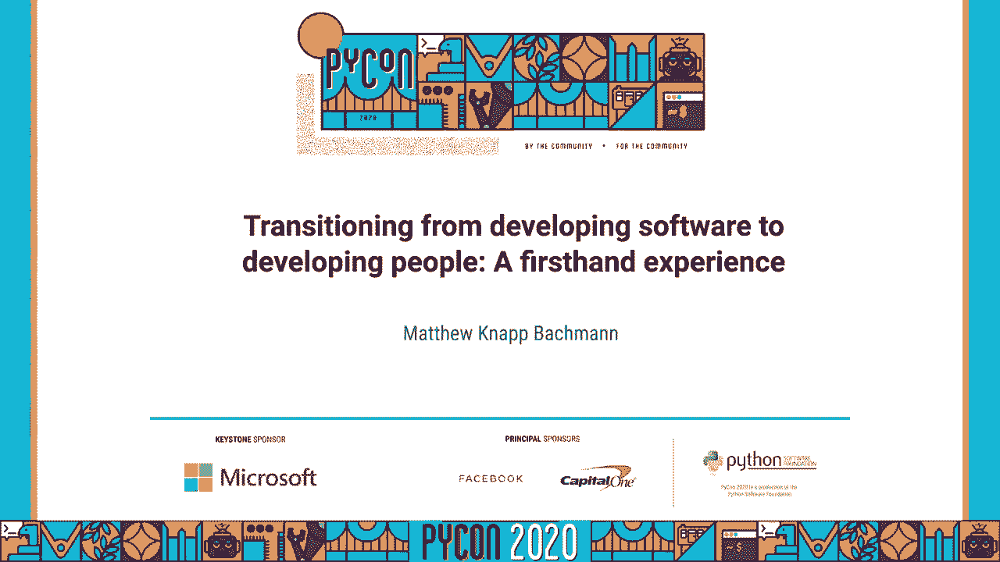
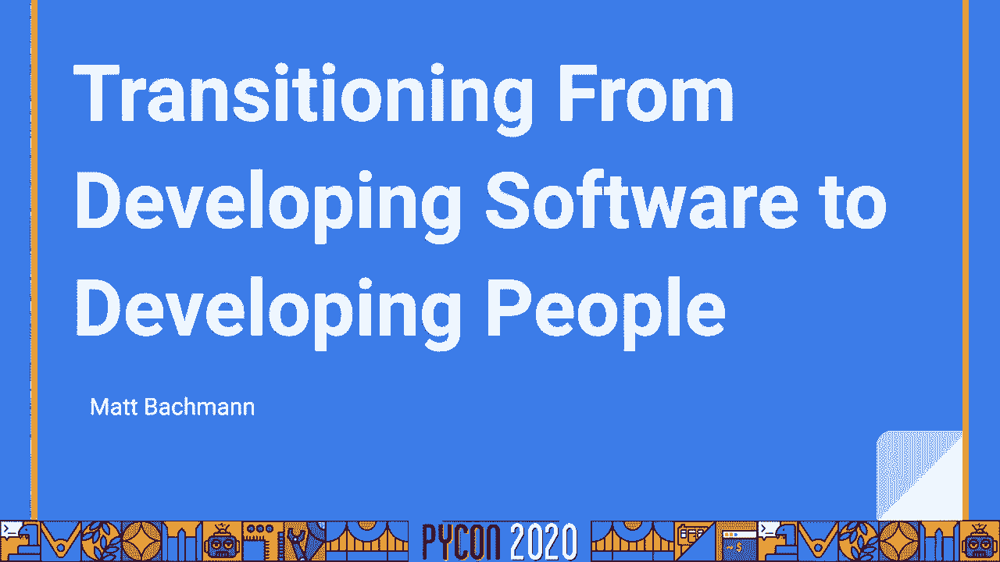
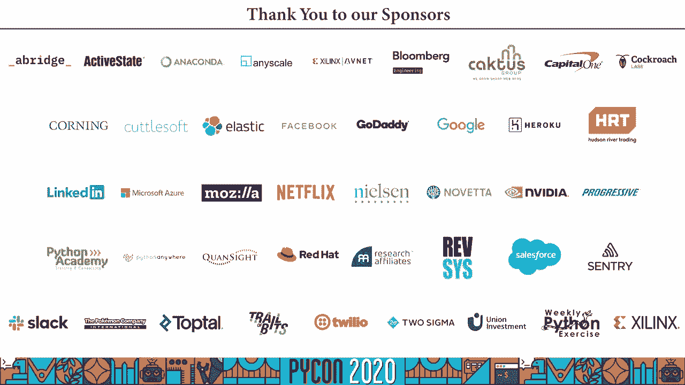

# 从开发软件到开发人：P58：从个人贡献者到管理者的转变

在本节课中，我们将学习如何从一名专注于编写代码的软件开发者，成功转型为一名专注于团队和人员发展的管理者。我们将探讨管理的本质、转型的动机、角色变化以及所需的技能和心态。

## 什么是管理？👥

上一节我们介绍了课程概述，本节中我们来看看管理的核心定义。

管理是关于人的工作。你整天都在与人打交道，包括你的团队成员、其他团队的经理、不同部门的同事，以确保业务目标的执行。如果你不喜欢与人一起工作，你将在管理岗位上举步维艰。这并不意味着内向的人不能成为管理者，关键在于你是否享受与人互动。

作为管理者，你是团队的主要接口。当外界对团队工作有疑问或需求时，他们首先会联系你。因此，你需要具备一种近乎客户服务的态度。如果人们与你交谈后感觉不佳，他们就会停止沟通，你的团队可能会因此错失机会或重要信息。你需要成为一个让人乐于接触的人。

本质上，管理者是团队的缓冲器。工程师是宝贵的资源，他们专注于重要的目标。你的职责是保护他们免受干扰，确保不成熟的想法在到达团队前已被充分完善，识别并提前清除障碍，让他们能集中精力实现目标。这并不意味着你永远不让团队接触外部信息，但你需要尽量减少不必要的干扰。

此外，管理者也是团队成员的职业教练。你的目标是帮助个人贡献者成长，让他们变得更有价值。这不仅对组织有利，也能让团队成员感到充实和有收获。如果他们觉得没有成长，可能会选择离开。因此，一对一沟通的主要目的就是指导他们的职业发展，并将他们与符合其个人目标的项目联系起来。

## 为什么管理可能不适合你？🚧

现在我们讨论了什么是管理，接下来我们谈谈哪些原因可能意味着管理岗位并不适合你。

如果你将晋升为管理者视为职业阶梯上的必然一步，你需要停下来思考。晋升意味着角色本质的改变。你需要确认这是你真正想做的事情，因为留在当前岗位并没有错。管理并非传统意义上的“晋升”，它是一次彻底的**角色转变**。

另一个不适合进入管理层的原因是：如果你对组织现状感到沮丧，并认为成为管理者是改变组织的方式。这种想法并非全错，因为管理者确实被赋予了一些权力。但管理者真正的核心技能是**影响力**。如果你在作为个人贡献者时都难以影响组织，那么作为管理者，这个问题可能会被放大。因为管理者不能单靠命令行事，更需要通过影响力来驱动团队和协调外部资源。

## 为什么你应该考虑管理？✅

现在我们已经讨论了一些你可能不想考虑管理的原因，让我们谈谈一些积极的、适合转向管理的理由。

首先，你需要从他人的成功中获得动力。作为管理者，你的角色是让他人完成工作。你必须能从团队成员的成功和整个团队的成功中获得满足感。

其次，你需要具备高度的同理心和换位思考能力。管理者整天与人打交道，并会面临许多目标冲突和意见分歧。如果你能理解他人的立场，就更有可能找到双赢的解决方案或妥协。虽然不能让每个人都满意，但理解他人是解决问题的关键。

第三，你需要享受思考团队和组织动态，并乐于规划如何将想法转化为可执行的项目。这包括与团队分解项目、创建工单、协调其他团队、管理依赖关系，并确保个人需求与组织目标保持一致。这又回到了同理心：你需要协调组织需求、团队需求和个人贡献者的需求，在可能的情况下实现多赢。

## 成为管理者后，什么会改变？🔄

上一节我们探讨了转向管理的动机，本节中我们来看看角色转变带来的具体变化。

第一，**代码不再是你的主要产出**。管理是关于人的工作。你的主要职责是协调、沟通和清除障碍，确保工作能顺畅地交付给团队。你可能几天都不会写代码。但这并不意味着你应该完全脱离技术。在职业生涯早期，你仍需对团队工作的系统有技术上的理解。保持技术敏锐度的方法包括：主动承担一些非关键路径的项目、处理功能或缺陷、协助调试生产问题。但关键是，你选择的工作必须是**可以随时放下**的，绝不能因为你的参与而阻塞团队进度。

第二，**成功变得模糊**。你不能再轻易地指着某个具体功能说“这是我做的”。衡量你成功的标准变成了团队的成功，而这通常难以量化。你需要适应这一点，并认识到自己工作的价值，即使它不那么显而易见。行业内的工程师都能分辨出好经理与坏经理的区别，这就是你价值的体现。

第三，**你的日程表将变得异常繁忙**。作为管理者，你的大部分时间将被会议占据。你需要更有策略地管理日历。请记住：**忙碌不等于高效**。你需要有自我意识，区分“看起来很忙”和“真正创造价值”。

以下是应对繁忙日程的几个建议：

*   **开发一个任务管理系统**。无论是使用待办清单、看板还是Jira，关键是将想法从大脑中移出，进行组织。你的大脑是用来思考的，不是用来记忆的。
*   **学会主导和参与高效会议**。会议应有明确目标、产出行动项，并且规模宜小。如果发现会议低效，应提供反馈并推动改进。
*   **接受不确定性**。当团队或他人向你寻求答案时，你可能并不总是知道。你需要习惯这种状态，并能够在不确定中推动团队前进。诚实地说“我不知道”是可以的，但同时要准备好引导团队寻找解决方案。

## 理解组织与政治 🏛️

现在我要谈论一个可能有些争议的话题：**办公室政治**。在工程组织中，常有一种观点认为工程师应超越政治，只关注“正确的代码”。我认为这是一种相当天真的想法。

政治在这里的定义是：**一群人如何协作并做出决策**。任何组织都存在决策系统，无论是正式的层级结构还是非正式的关系网络。如果你想推动想法落地，就必须理解并与这个系统合作。

作为管理者，尤其不能忽视政治。拥有正确的想法并不够，你还需要知道如何让想法在组织中获得通过。请记住，管理者的权力很大程度上是“虚构的”，真正的力量来自于**影响力**和对组织运作方式的理解。

人际关系至关重要。你需要与你的团队、其他管理者以及组织内其他成员（如产品经理、设计师）建立牢固的关系。没有这些关系，你将寸步难行。

以下是处理组织关系时需要注意的几点：

*   **为团队辩护，但保持合作**。你的职责之一是维护团队的利益，但要记住大家同属一个更大的组织。在发生争执时，应寻求合作与妥协，力求双赢，避免“焦土政策”。
*   **建立团队品牌**。确保组织中的每个人都清楚你的团队**做什么**以及**不做什么**。明确的团队愿景和边界可以防止其他团队主导你的工作路线图或将你随意列为依赖项。团队品牌有助于建立这种认知。

## 项目管理与流程 📊

现在我们谈论了政治和在组织中定位团队，让我们来谈谈如何选择和执行项目。

管理者对团队做什么、何时做，并没有绝对的话语权。高管常常会直接指派项目。作为工程经理，你需要做的是**影响这个过程**，并确保你的团队为成功做好准备。

实现这一点的关键是**建立一个强大的工作流程**。一个良好的流程能为你提供与业务部门有效对话的工具。每个团队都有流程，即使它是“随心所欲”。但一个可预测、可衡量的流程（如Scrum或看板）能让你清晰地了解团队的能力。

作为管理者，你需要寻找既受业务重视，又能拓展团队技能的项目。这两者有时会冲突。例如，一个对业务极具价值的移动项目，如果你的团队没有移动开发经验，风险就会很高。但如果团队中有人对此感兴趣，这可能是拓展团队能力的好机会，前提是不能让团队无法有效执行。

关于流程，最后要记住：**人比流程更重要**。流程应该服务于团队，而不是反过来。你需要让流程适应你的团队。

## 促进团队成长 🌱

作为管理者，你有强烈的动机推动团队不断成长和扩大影响力。这不仅对企业有利（团队成员更有价值），也与你个人的成功息息相关（你的价值通过团队体现）。同时，关注工程师的个人成长也是一种道义责任，确保他们在职期间有所收获。

促进工程成长意味着平衡业务需求和工程师的个人发展需求。这并非总能完美协调。有时业务需求优先，有时你需要给工程师提供成长机会，即使短期内对业务并非最优。通常，如果你相信他们，给他们机会，他们就能解决问题。

此外，避免过度依赖某一位明星工程师。将所有重要项目都交给同一个人，不仅会限制其他人的成长，也会在该成员离开时让团队陷入困境。应努力将责任和机会分配给你负责的每一个人。

职业发展是一种**伙伴关系**。最终，每个工程师都要为自己的职业发展负责。管理者的角色是提供指导和支持，但无法替代个人的主动性。

## 推荐资源 📚

最后，我想分享一些我认为有价值的资源：

*   **《Help， I have a manager》 by Julia Evans**：这是一本简短的杂志，从个人贡献者的角度解释经理是做什么的，以及应该如何与经理相处。无论对个人贡献者还是新经理都很有价值。
*   **《The Manager‘s Path》 by Camille Fournier**：这可能是我读过的最好的管理书籍。它清晰地描绘了从技术骨干到经理，再到管理经理的成长路径，即使你从未进入管理层，读来也很有趣。
*   **Marco Rogers 在 Twitter 上的一个长推文**：这个推文系列深入探讨了企业需求与关怀型领导者需求之间的张力，非常发人深省。
*   **《Ask a Manager》博客**：这是一个关于一般性管理建议的有趣博客，里面有很多好建议和故事。

## 总结

在本节课中，我们一起学习了从软件开发者向管理者转型的核心要点。我们探讨了管理的本质是与人打交道，分析了适合与不适合转向管理的原因，并详细说明了角色转变带来的变化，包括工作重心从代码转向人、成功标准的模糊化以及日程的巨变。我们还深入讨论了理解组织政治、建立高效流程以及促进团队成长的重要性。记住，管理是一次深刻的角色转变，其核心在于通过影响力和对人的关注，来驱动团队和组织的成功。