# 使用 Azure Functions 轻松处理数据：P6：从零构建数据管道 📊

在本教程中，我们将学习如何使用 Microsoft Azure Functions 这一无服务器计算平台，构建一个自动化的数据管道。我们将创建一个定时触发的函数，从 Stack Exchange API 收集数据，处理后存储到云存储，并最终通过电子邮件发送每日数据摘要。

## 概述：什么是无服务器计算？ ☁️

首先，我们来理解核心概念。无服务器计算并不意味着没有服务器，而是指开发者无需管理底层服务器、硬件或软件。云提供商（如 Microsoft Azure）负责所有基础设施的维护、配置和扩展。

**主要优势**：
*   **托管服务**：开发者专注于编写业务逻辑代码。
*   **按需付费**：只为函数执行时消耗的资源付费，而非 `24/7` 运行的服务器。
*   **自动扩展**：可根据负载自动横向扩展或收缩。

在本教程中，我们将使用的 **Azure Functions** 正是微软提供的无服务器平台。

## Azure Functions 核心概念 ⚙️

上一节我们介绍了无服务器计算的优势，本节中我们来看看 Azure Functions 的具体特性。

Azure Functions 的核心是 **函数**，即一小段为特定任务编写的自包含代码。它也被称为 **函数即服务**。

以下是函数的重要特性：

*   **事件触发**：函数在特定事件发生时执行，例如 HTTP 请求、文件上传或定时器触发。
*   **服务集成**：函数可以轻松与数据库、存储、机器学习服务等其他 Azure 服务集成。
*   **无状态与短生命周期**：函数执行通常是短暂且无状态的。如需持久化输出，必须连接到外部存储。
*   **异步执行**：函数被触发后即执行，通常不等待外部响应。

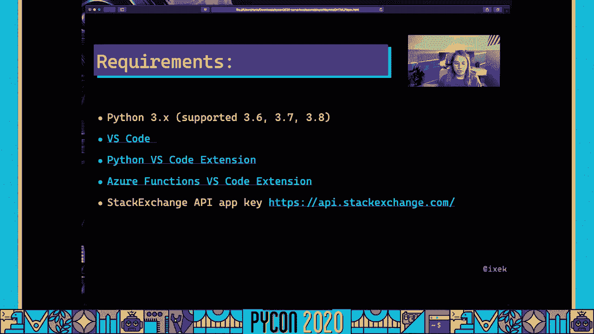

鉴于这些特点，函数非常适合处理 **图像/视频处理**、**物联网数据流** 和 **数据管道** 等场景。接下来，我们将构建一个数据管道。

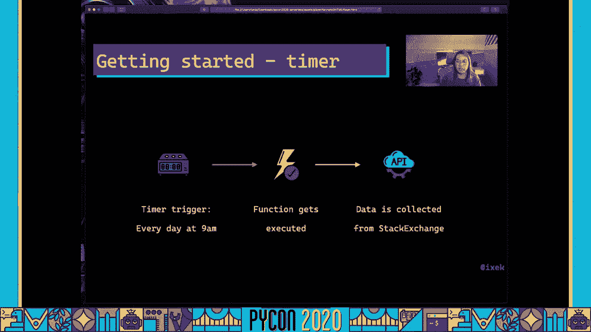

## 准备工作 🛠️

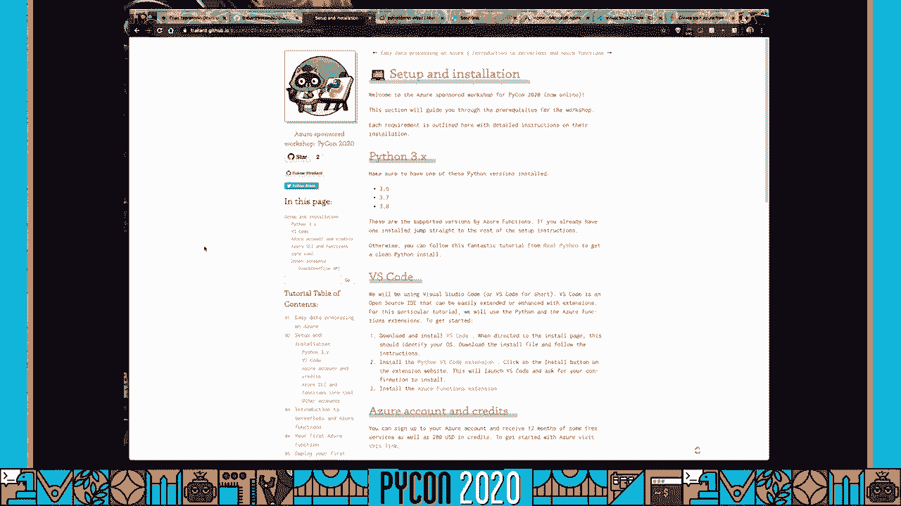

在开始编码之前，我们需要准备好开发环境。以下是所需的工具和资源：

*   **Python 3.6+**：确保安装 Python 3.6、3.7 或 3.8 版本。
*   **Visual Studio Code**：一个开源的集成开发环境。
*   **VS Code 扩展**：安装 `Python` 扩展和 `Azure Functions` 扩展以优化工作流程。
*   **Stack Exchange API 密钥**：用于从 Stack Exchange 网站获取数据。
*   **Azure 账户**：可以注册获得免费额度和信用。

所有详细的安装步骤和资源链接都可以在配套教程网站找到。

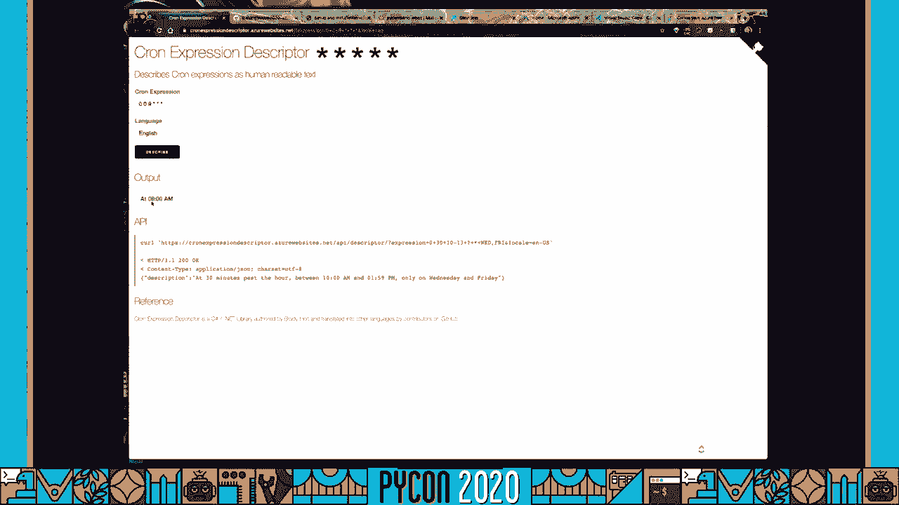

## 第一步：创建定时触发函数 ⏰

我们将从创建一个由定时器触发的 Azure Function 开始。这个函数将作为我们数据管道的起点，定期从 API 拉取数据。

首先，在 VS Code 中打开 Azure Functions 扩展，点击“创建新项目”。选择项目目录、Python 语言和解释器版本（例如 3.7）。选择“Timer trigger”作为触发器类型，并为函数命名。

创建时，需要提供一个 **CRON 表达式** 来定义执行计划。例如，表达式 `0 0 9 * * *` 表示每天上午 9 点运行。如果不熟悉 CRON 表达式，可以使用在线工具生成和解释。

项目创建后，你会看到一些核心文件：
*   `function.json`：定义了函数的触发器和绑定配置。
*   `__init__.py`：包含函数的主逻辑代码。
*   `local.settings.json`：用于本地调试的环境变量（切勿提交到版本控制）。

现在，你可以按 `F5` 键在本地运行和调试这个基础函数。首次运行可能需要创建一个本地存储账户来模拟 Azure 环境。

## 第二步：部署你的第一个函数 🚀

上一节我们在本地创建并测试了函数，本节中我们将其部署到 Azure 云平台。

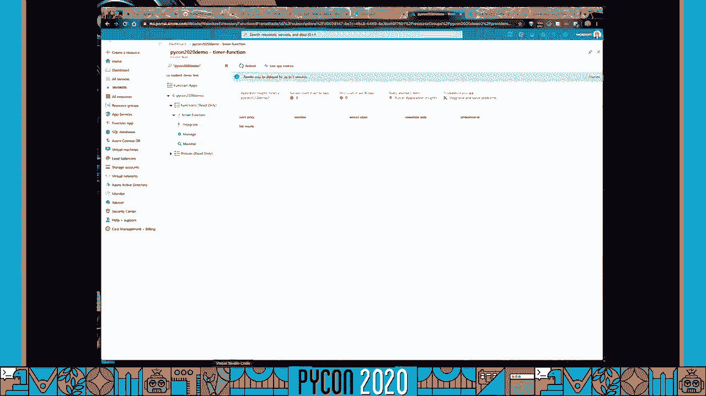

在 VS Code 的 Azure Functions 扩展中，点击“部署到函数应用”。你可以选择创建一个新的函数应用，并为其命名、选择 Python 版本和区域。

部署过程将在状态栏显示进度。完成后，你可以访问 Azure 门户，在“函数应用”下找到你刚部署的应用。在这里，你可以监控函数的执行、查看日志、管理配置（如环境变量）以及手动触发函数。

首次调用已部署的函数时，可能会遇到“冷启动”延迟，这是初始化新实例的正常现象。

## 第三步：连接 API 并处理数据 🔌

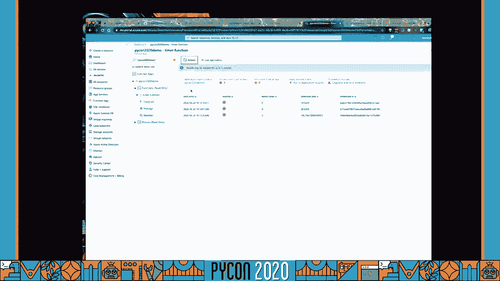

目前我们的函数只是记录日志。现在，我们将修改代码，使其能够从 Stack Exchange API 获取数据。

我们需要：
1.  在函数目录下创建一个 `utils` 文件夹，用于存放辅助脚本。
2.  在 `utils` 中创建 `stack.py`，编写从 API 获取问题数据的方法。
3.  修改主函数文件 `__init__.py`，调用 `utils` 中的方法，并传入搜索词（例如 “python azure functions”）来收集相关问题。
4.  在项目根目录创建 `.env` 文件，安全地存储你的 API 密钥等机密信息，并在代码中通过 `os.environ` 读取。

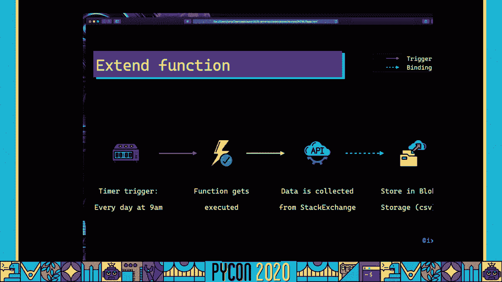

修改完成后，再次在本地按 `F5` 运行并调试。通过 VS Code 扩展手动执行函数，你应该能在输出中看到收集到的新问题数量。

代码测试无误后，使用扩展的“部署”功能将更新后的函数重新部署到 Azure。别忘了在 Azure 门户中，为你的函数应用添加在 `.env` 文件中定义的环境变量。

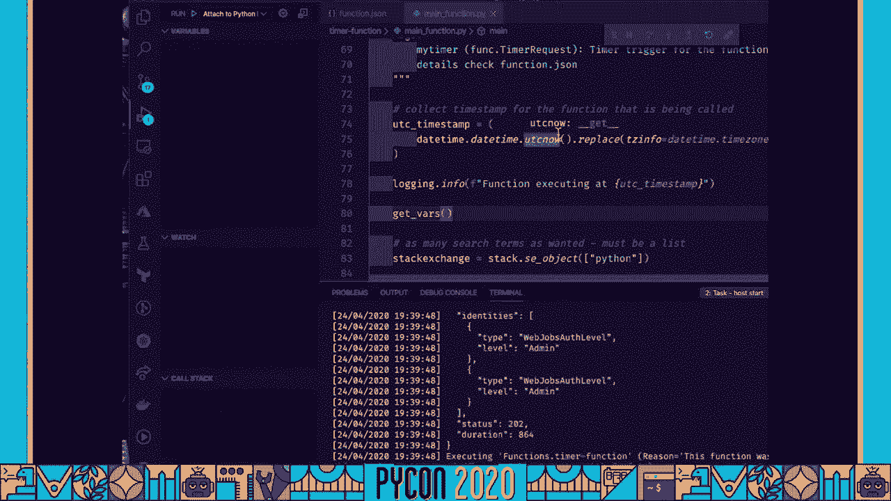

## 第四步：添加输出绑定以存储数据 💾

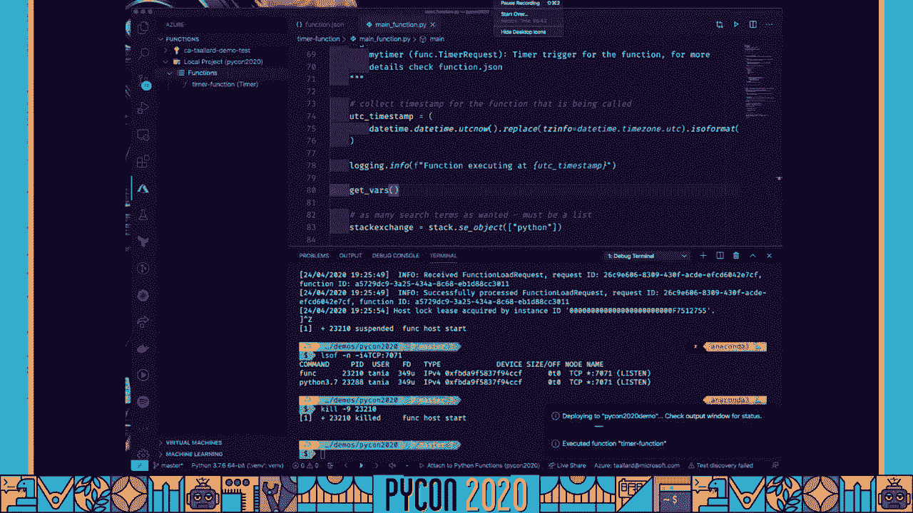

我们已经能收集数据，但需要将其保存下来。这里我们将引入 **绑定** 的概念。绑定是一种声明式连接，使函数能够轻松地与输入/输出数据交互。

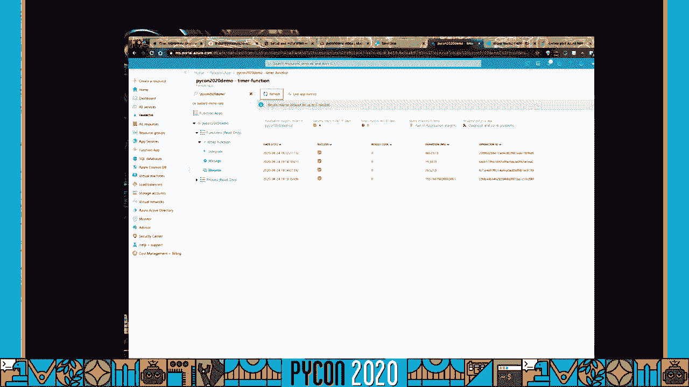

我们将添加一个 **输出绑定**，将数据保存到 Azure Blob Storage（一种云对象存储）。

在 VS Code 的 Azure Functions 扩展中，右键点击你的函数，选择“添加绑定”。选择“Azure Blob Storage”作为绑定类型，方向为“out”。你需要指定 Blob 的路径，例如 `function-blob/{DateTime}.csv`，这会将 CSV 文件以时间戳命名并存入 `function-blob` 容器。

添加绑定后，`function.json` 文件会自动更新。接着，修改 `__init__.py` 中的主函数，将收集到的数据转换为 CSV 格式，并通过输出绑定参数（例如 `outputBlob`）写入。

再次在本地运行测试。成功后，重新部署函数。现在，当你触发函数时，不仅会收集数据，还会在指定的 Azure Blob Storage 容器中生成一个 CSV 文件。你可以通过 Azure 门户查看这个存储账户和生成的文件。

## 第五步：构建完整管道：触发、处理与通知 📧

我们的管道已过半程。现在，我们希望每当新的 CSV 文件被添加到 Blob Storage 时，就触发另一个函数来处理它并发送摘要邮件。

我们将创建第二个函数，由 **Blob 触发器** 激活。
1.  在同一个项目中，使用 Azure Functions 扩展添加新函数，选择“Azure Blob Storage trigger”。
2.  配置它监视我们第一个函数输出 CSV 文件的路径（例如 `function-blob/*.csv`）。
3.  这个新函数将读取 CSV 文件，分析数据（例如，统计最常用的标签、有答案/无答案的问题比例），并生成一个图表。

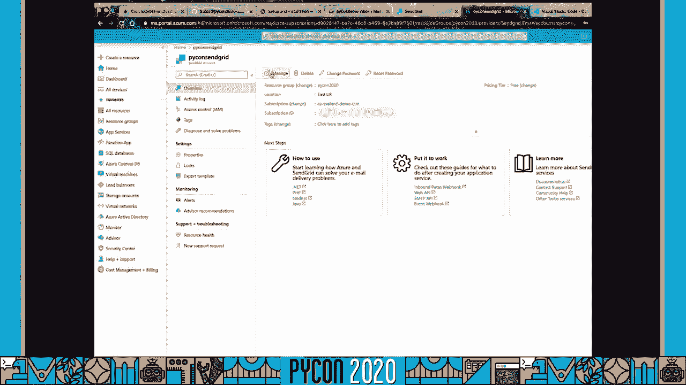

为了发送结果，我们需要为这个函数添加两个输出绑定：
*   **SendGrid 绑定**：用于发送包含分析摘要和图表的 HTML 电子邮件。
*   **另一个 Blob 输出绑定**：用于将生成的图表图片保存到存储中。

在 Azure 门户中，你需要创建一个 **SendGrid** 资源来获取 API 密钥，并将其作为环境变量添加到函数应用中。

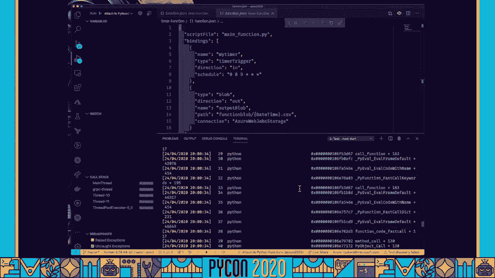

在本地更新代码、测试成功后，将整个项目重新部署。现在，你的数据管道就完整了：
1.  **定时器函数** 每天运行，从 API 拉取数据并保存为 CSV。
2.  新的 CSV 文件触发 **Blob 处理函数**。
3.  **Blob 处理函数** 分析数据，保存图表，并发送摘要邮件到你的收件箱。

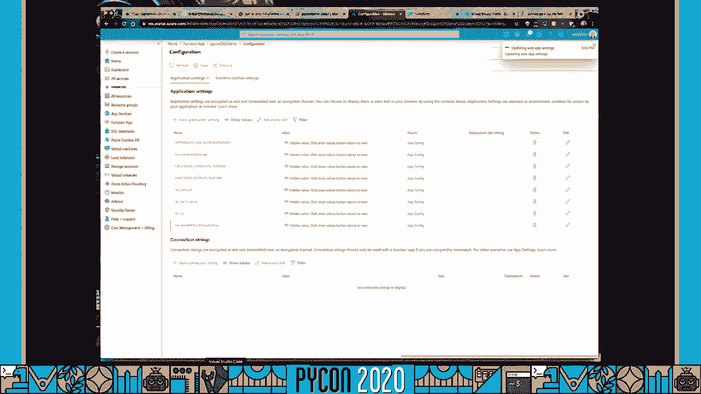

## 总结 🎉

在本教程中，我们一起学习了：
1.  **无服务器计算** 和 **Azure Functions** 的基本概念与优势。
2.  如何使用 **VS Code** 和 **Azure Functions 扩展** 本地开发、调试和部署函数。
3.  如何利用 **定时器触发器** 和 **Blob 触发器** 来编排任务。
4.  如何通过 **输入/输出绑定** 轻松集成 Azure Blob Storage 和 SendGrid 等服务，构建一个完整的数据处理管道。

你已成功构建了一个自动化的数据管道，它能够定期收集、处理数据并发送报告。你可以在此基础上扩展，例如连接数据库、添加更复杂的分析或集成其他服务。无服务器架构为你提供了强大的灵活性和可扩展性，同时让你能专注于代码逻辑本身。