# 生成艺术入门：P60：用代码创造艺术的乐趣


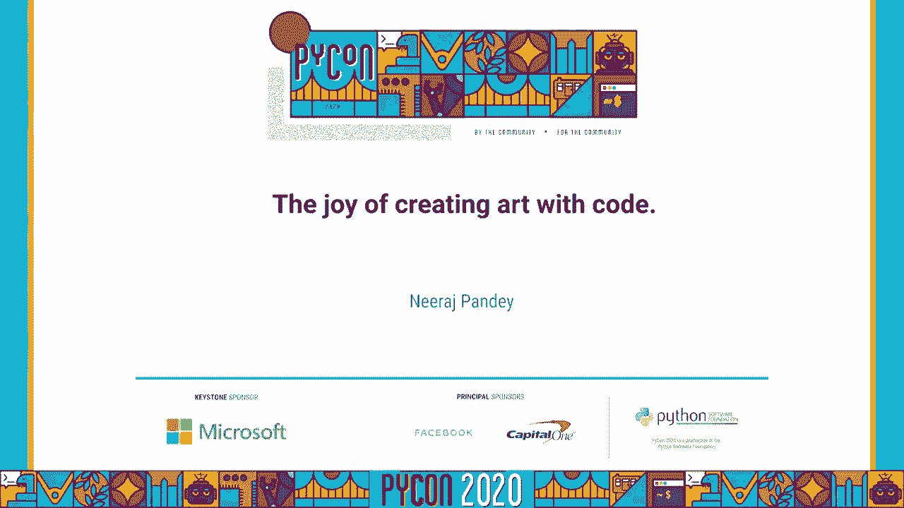

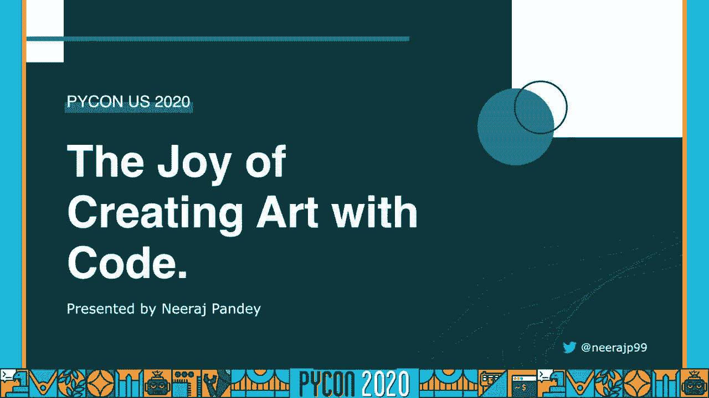

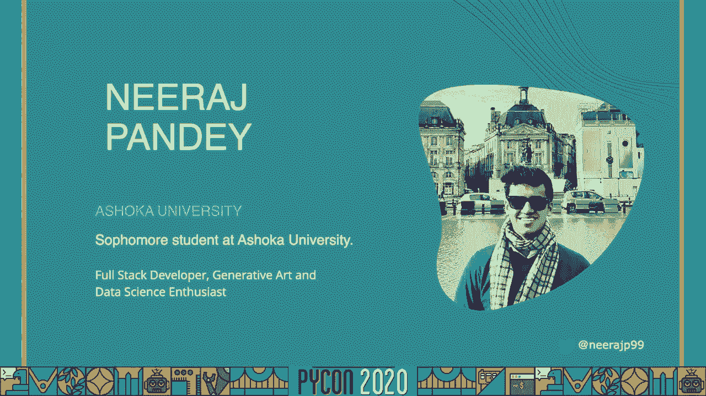

在本课程中，我们将学习生成艺术的基本概念、历史、核心算法以及如何利用编程（特别是Processing和Python）来创作独特的数字艺术作品。课程将从基础的艺术元素和原则讲起，逐步深入到随机性、几何算法、分形、混沌理论，乃至遗传算法和生成对抗网络等高级主题。

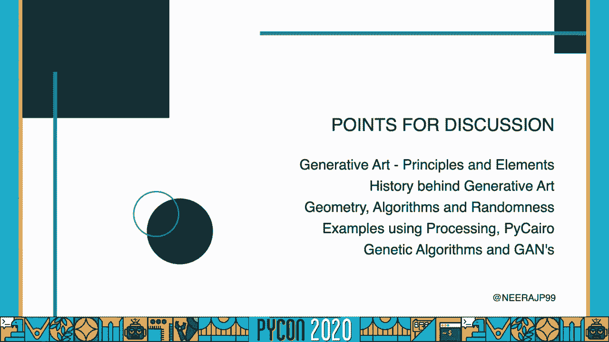

## 概述

生成艺术是通过自主系统（如算法和代码）创造的艺术形式。艺术家设计一个包含随机性或规则的过程，由系统执行并产生艺术作品。本节课将系统性地介绍生成艺术的各个方面，帮助你理解其原理并开始自己的创作。

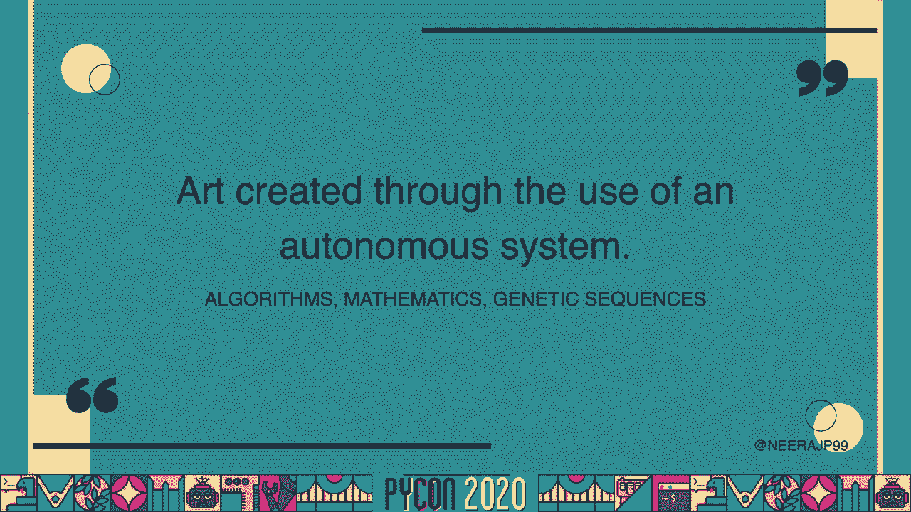

---

## 生成艺术：1：什么是生成艺术？

生成艺术是通过使用自主系统创造的艺术。Processing等工具使用迭代命令在屏幕上绘制基于矢量的形状。大多数生成艺术作品受到现代艺术，尤其是大量使用几何图案的波普艺术的启发。创作过程始终需要一个自主系统。

如果没有自主系统，作品就更偏向于数字艺术。随机性是一种常见的自主系统，它确保每次创建的设计都是独特的。艺术家的角色是设计一个包含某种自主性的过程，艺术家控制艺术中的随机性和顺序。因此，艺术的元素和原则是由系统提供的。

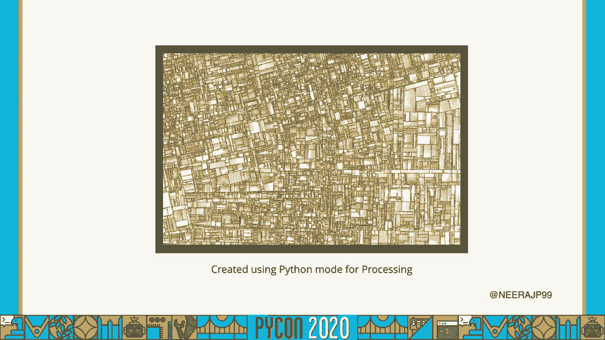

---

## 艺术基础：2：艺术的元素与原则

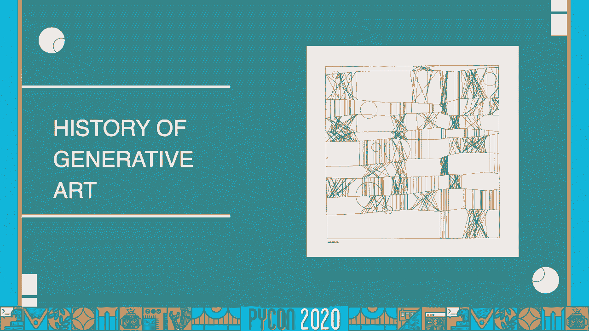

在创作艺术作品时，必须理解并应用艺术的基础构件，即元素和原则。艺术元素是用来创作艺术作品的构件，可以单独或组合使用。

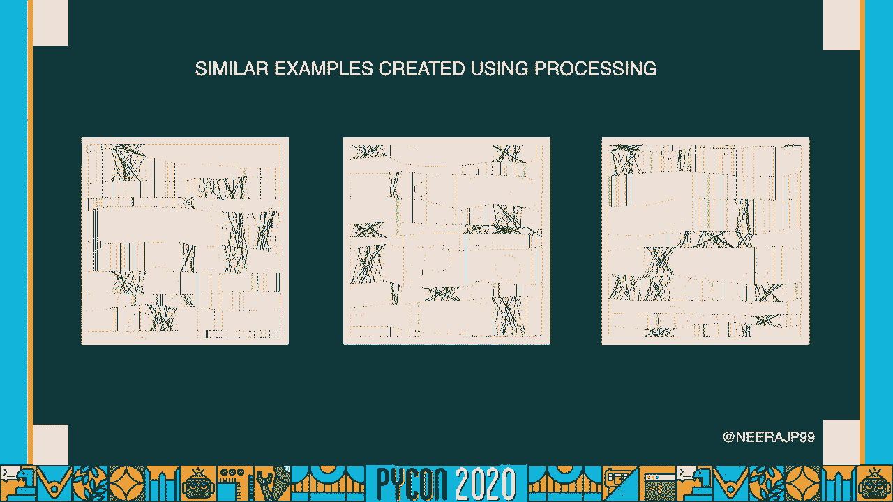

以下是主要的视觉艺术元素：
*   **颜色**：由色调、明度（亮度或暗度）和饱和度（强度）组成。
*   **形状**：将三维形式转换为二维的艺术元素，可以是几何形状或有机形状。
*   **线条**：定义形状和轮廓的基本元素。
*   **空间**：物体之间及其周围的区域。
*   **质感**：艺术作品表面的视觉或触觉质量。

艺术原则指导如何组合这些元素：
*   **节奏**：艺术作品中的视觉运动感。
*   **对比**：元素之间的差异，如颜色、明度、质感或大小。
*   **运动**：引导观众视线在作品中移动的方式。
*   **比例**：作品中各元素之间的大小关系。
*   **和谐**：所有元素和原则结合形成的整体统一感。

上一节我们介绍了艺术的元素与原则，本节中我们来看看如何将这些理论应用于一个具体的生成艺术示例。

---

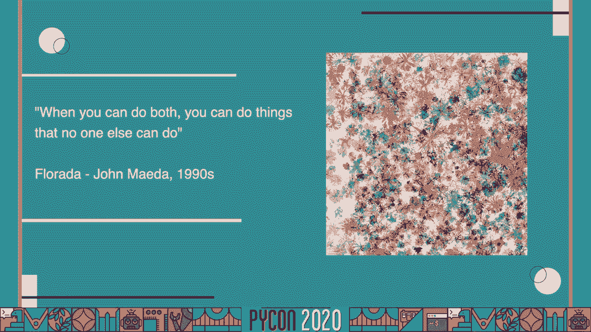

## 实践示例：3：从原则到生成作品

这个想法相当简单。我们将从画布上的一些随机点开始，然后开始画线。线条朝随机方向延伸，但一旦这些线条相互碰撞，它们就会开始以90度的角度创建新线条。这一点令人兴奋，因为最终呈现的艺术效果每次都真的非常不同。

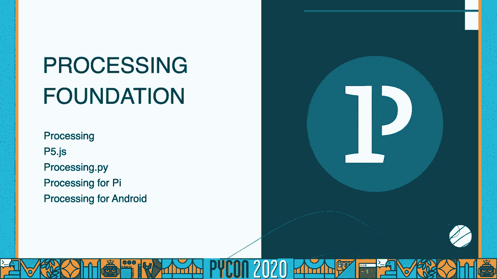

这个程序很有趣，你可以看到这个作品是使用Python和Processing创建的。

---

## 历史背景：4：生成艺术简史

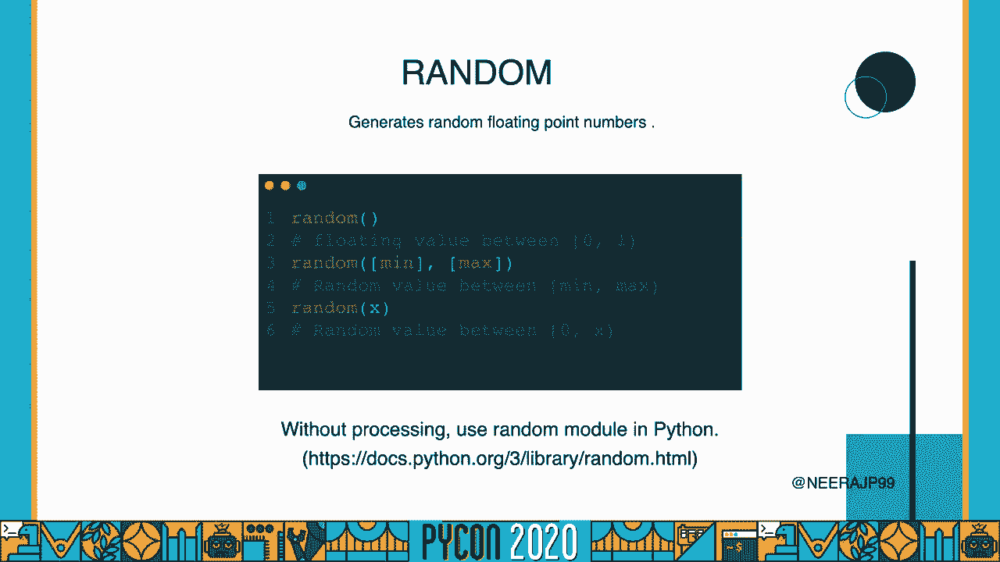

在模拟艺术（即手工艺术）中，复杂性和规模需要成倍增加的时间和精力。而计算机擅长于几乎无止境地重复过程而不感到疲惫。计算机生成复杂图像的便利性极大地推动了生成艺术的发展。

早期生成艺术家面临的一大挑战是输出设备的限制。当时主要的输出来源是绘图仪，一种由计算机指令控制握笔运动的机械设备。绘图作品通常是黑白的，因此大多数早期作品也都是黑白的。

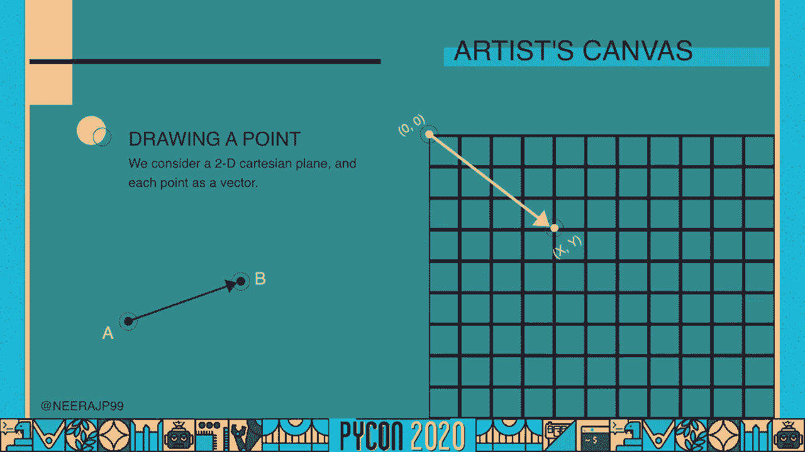

最早制作彩色绘图的艺术家之一是弗里德·纳克，他们的艺术作品《致敬》创作于1965年，通常基于保罗·克莱的画作《高路与小路》。弗里德·纳克将克莱对水平与垂直线条及椭圆之间比例和关系的探索作为作品的基础。他在大小、比例以及线条和椭圆的部分上引入了随机性。

最早且最著名的生成艺术作品之一是乔治·尼斯于1968年创作的《Schotter》。Schotter从一排12个正方形开始，随着向下移动，旋转和位置的随机性逐渐增加。

计算机是创造这种艺术作品的最佳工具之一。想象一下，手工绘制上述图像可能需要一个小时。而通过向计算机提供一些简单的命令，我们可以在几分钟内创建数千件这样的作品，而且每次都有独特的风格。

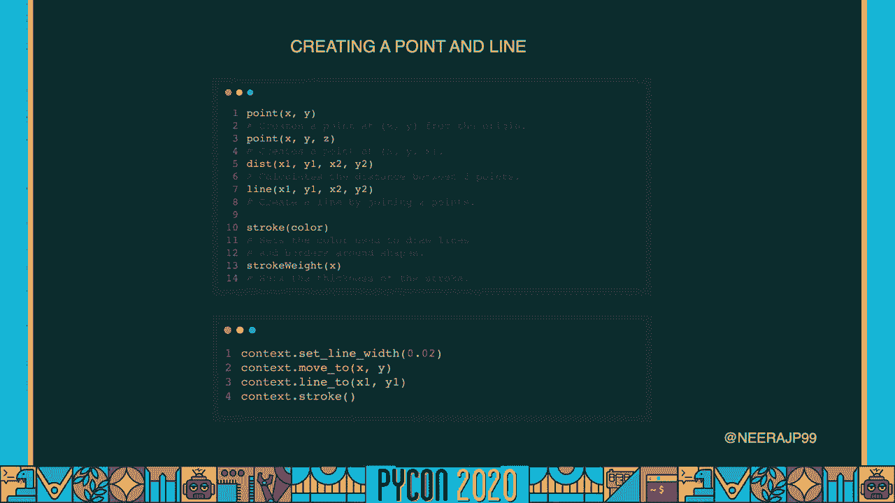

---

## 关键工具：5：Processing 简介

用代码进行素描的需求催生了Processing语言。本·弗莱和凯西·瑞斯是该语言的创始人，并在过去的19年中一直致力于其发展，使其成为最知名的生成艺术家的首选平台。

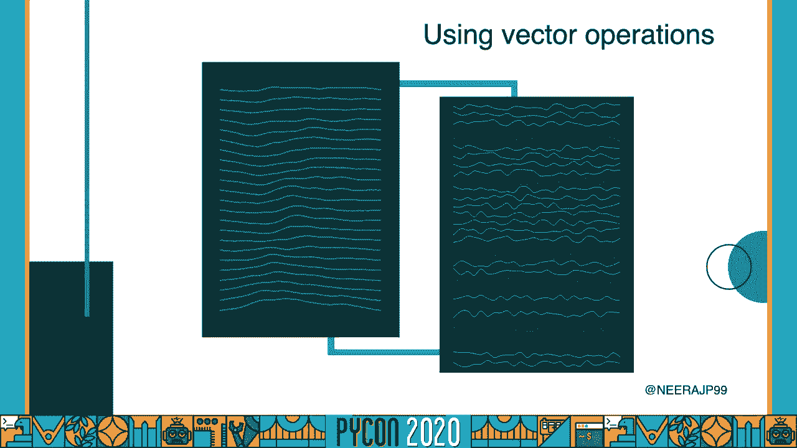

Processing是为媒体艺术社区构建的编程语言和环境。它的目的是在媒体艺术背景下教授计算机编程的基础知识，并作为软件草图本。目前，Processing支持Java模式、JavaScript、Python、树莓派和Android模式。

在本教程中，我们将看到许多使用Processing和Python的示例。

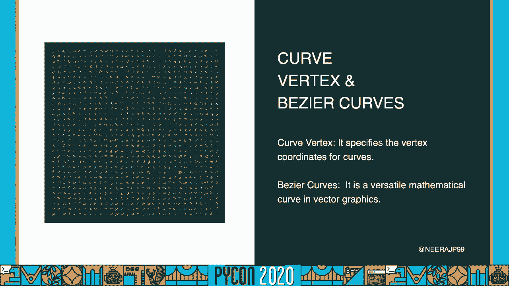

---

## 核心概念：6：随机性与画布

在生成艺术中，随机性是一个主要因素。我们需要一种方法来生成随机数。`random()`函数在不同的编程语言中有所不同，但主要目标是提供一个介于0和1之间的随机浮点数。

在Processing中生成随机数：
```processing
float r = random(1); // 返回一个0到1之间（不包括1）的浮点数
float r2 = random(50, 100); // 返回一个50到100之间（不包括100）的浮点数
```
在Python中生成随机数：
```python
import random
r = random.random() # 返回一个0到1之间（不包括1）的浮点数
```

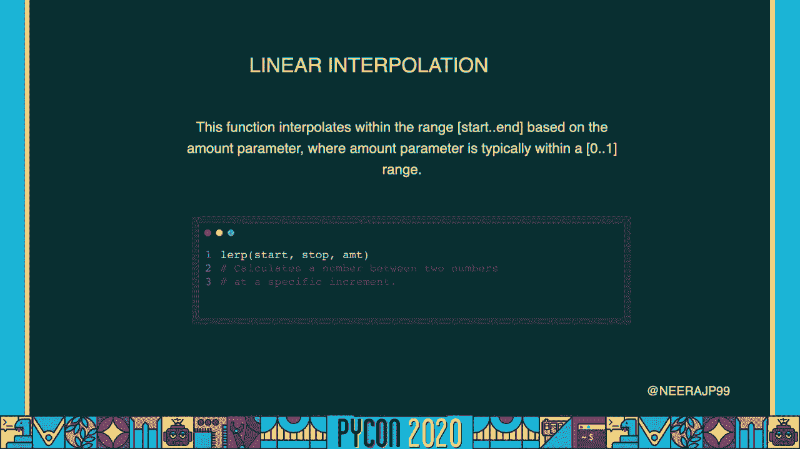

在我们继续探索使用向量和形状创作艺术作品之前，需要了解画布的坐标系。画布就像一个2D笛卡尔平面，每个点可以被视为一个向量。一个二维向量 `v` 可以表示为：
`v = (x, y)`
其中 `x` 和 `y` 是从原点到该点的坐标。我们可以对向量执行缩放、线性变换、旋转等操作。

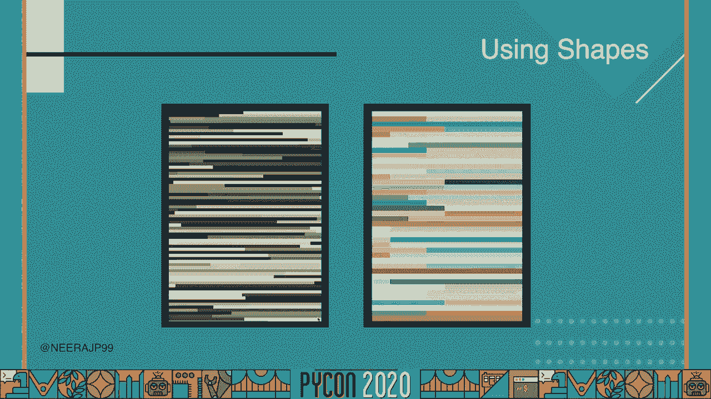

---

## 基础绘图：7：点、线与向量

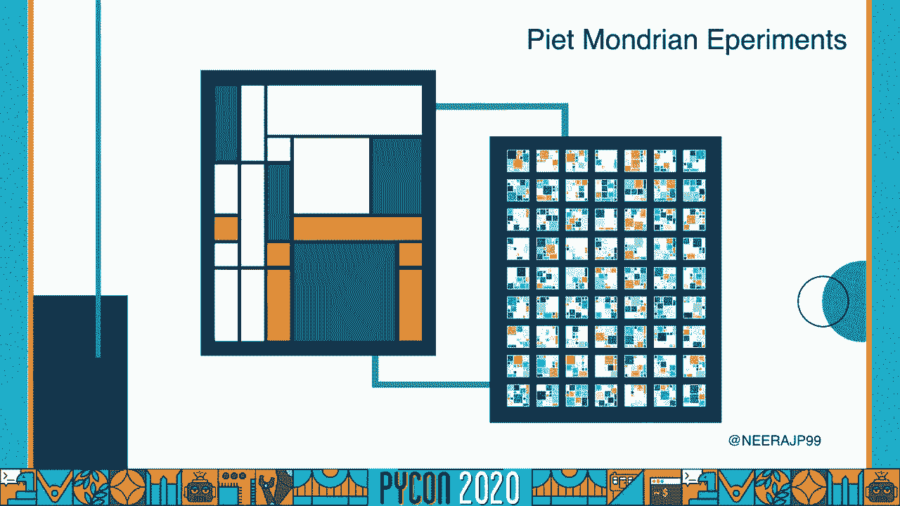

在Processing中创建点和线非常简单。

创建点：
```processing
point(x, y); // 在坐标(x, y)处画一个点
```
创建线并设置样式：
```processing
stroke(255, 0, 0); // 设置线条颜色为红色 (RGB)
strokeWeight(3); // 设置线条粗细为3像素
line(x1, y1, x2, y2); // 从点(x1,y1)到点(x2,y2)画一条线
```

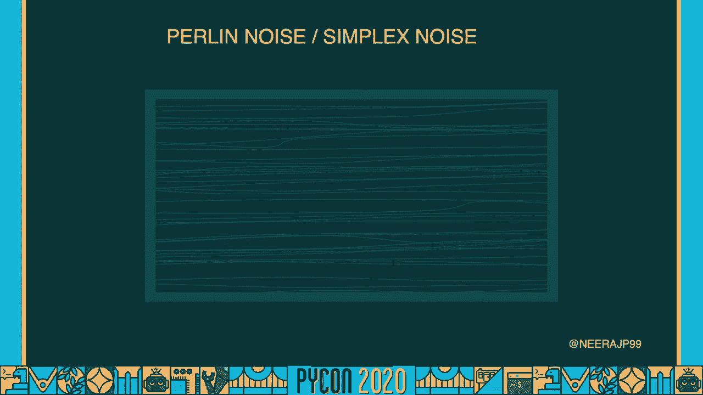

我们也可以使用向量运算来创造动态效果。可以定义一个位置向量 `P`，以及速度向量 `v` 和加速度向量 `a`。它们的关系是：
`v = v + a`
`P = P + v`
通过改变加速度 `a` 中的小值，可以模拟物理效果（如风），使点产生运动。

---

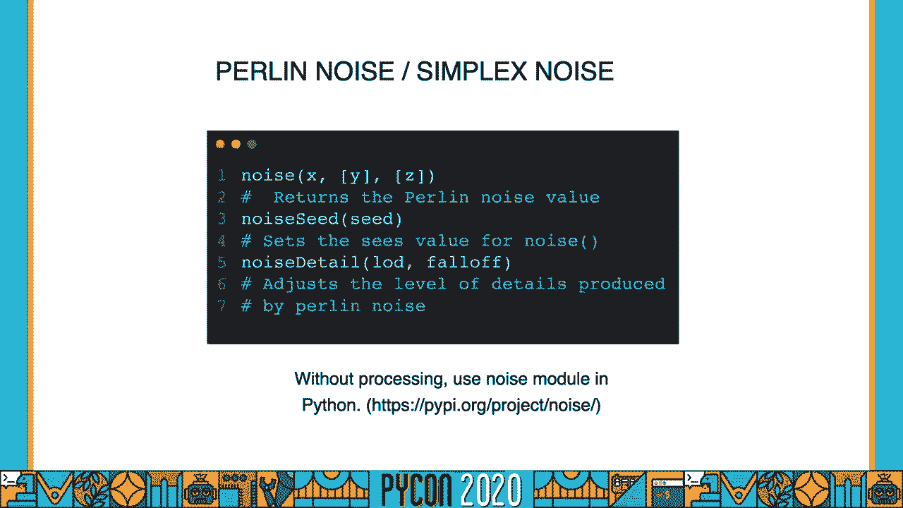

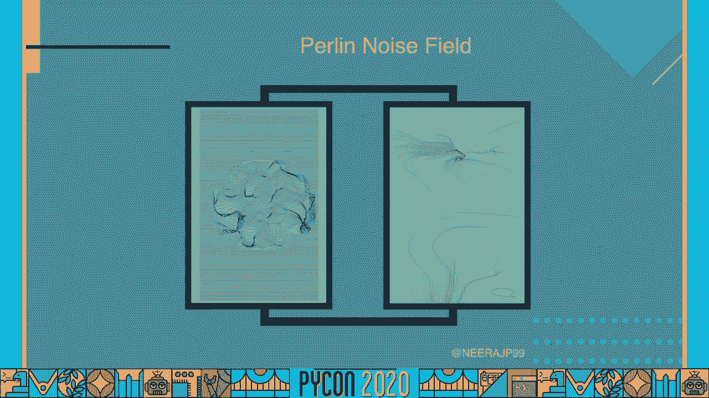

## 形状与插值：8：创建基本形状

以下是使用Processing创建基本形状的方法。

创建椭圆和矩形：
```processing
ellipse(a, b, c, d); // (a,b)是中心点，c是宽度，d是高度
rect(a, b, c, d); // (a,b)是左上角坐标，c是宽度，d是高度
rect(a, b, c, d, radius); // 带圆角的矩形
rect(a, b, c, d, tl, tr, br, bl); // 每个角有不同半径
```

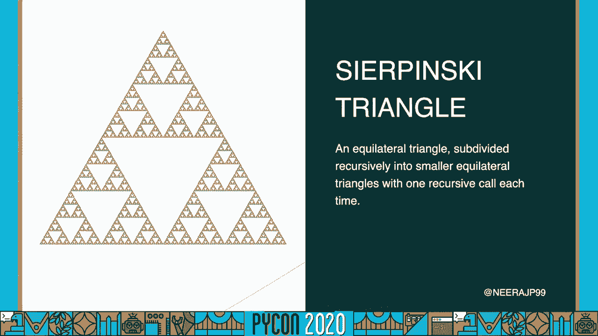

线性插值（`lerp()`）在进行创意编码时是一个非常重要的函数，它在两个值之间进行平滑过渡。
公式为：
`lerp(start, stop, amount) = start + (stop - start) * amount`
其中 `amount` 通常介于0和1之间。
在Processing中使用：
```processing
float x = lerp(10, 20, 0.5); // x 等于 15
```

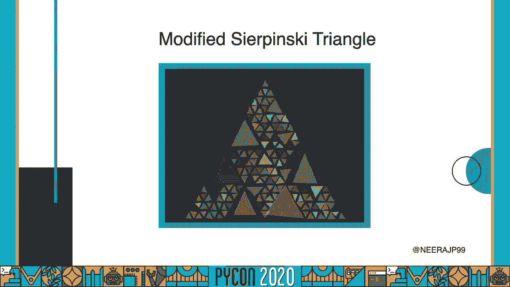

---

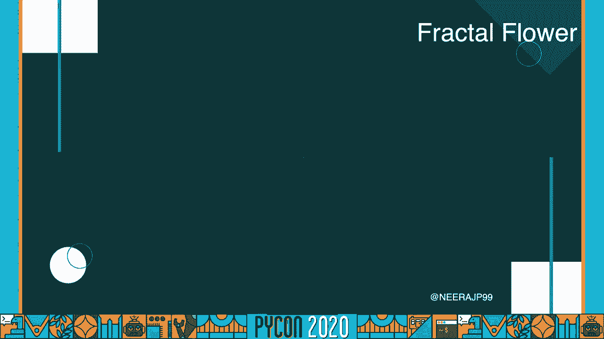

## 高级噪声：9：Perlin 噪声

Perlin噪声由肯·佩林在1980年代开发，用于创建更自然的程序化纹理。与完全随机的噪声不同，Perlin噪声生成的数字序列是平滑且有机的。

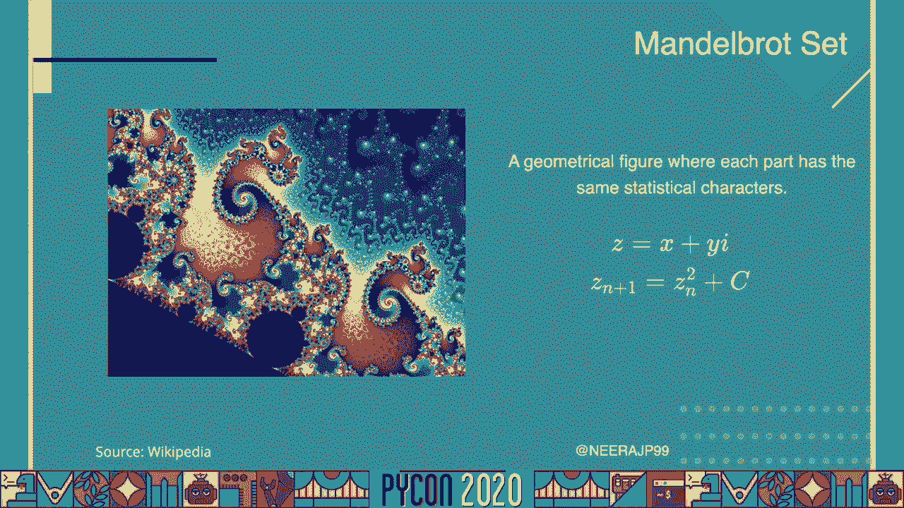

在Processing中使用Perlin噪声：
```processing
float n = noise(x); // 一维噪声，x是输入坐标
float n2 = noise(x, y); // 二维噪声
noiseSeed(seed); // 设置噪声种子，使结果可复现
noiseDetail(octaves, falloff); // 调整噪声细节水平
```
利用Perlin噪声，我们可以创建出复杂的向量场、地形或有机运动效果。

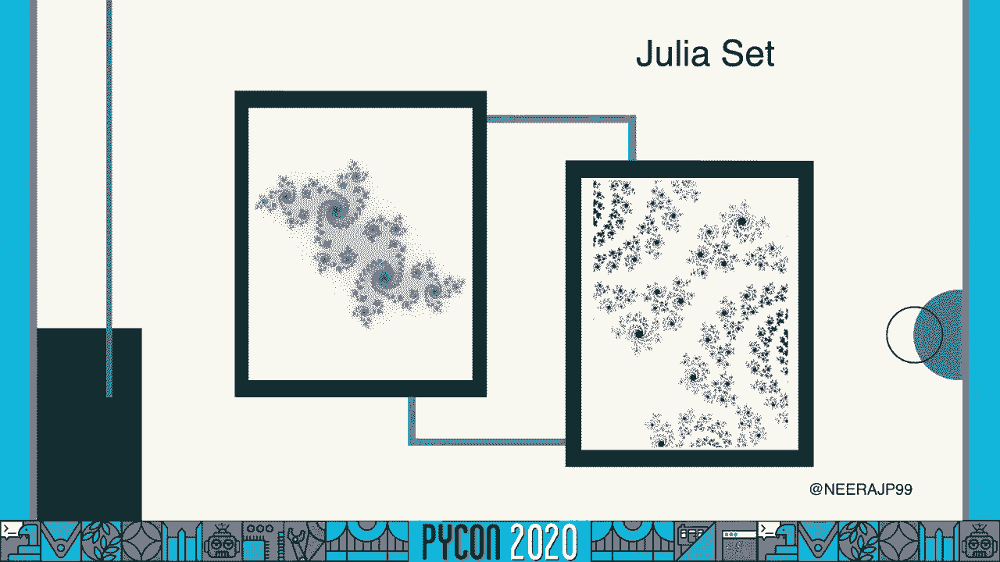

---

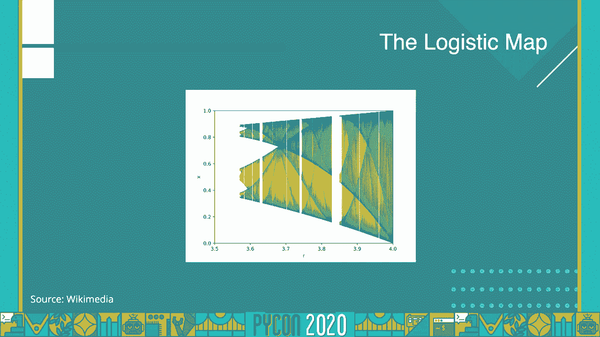

## 几何与分形：10：从模式到混沌

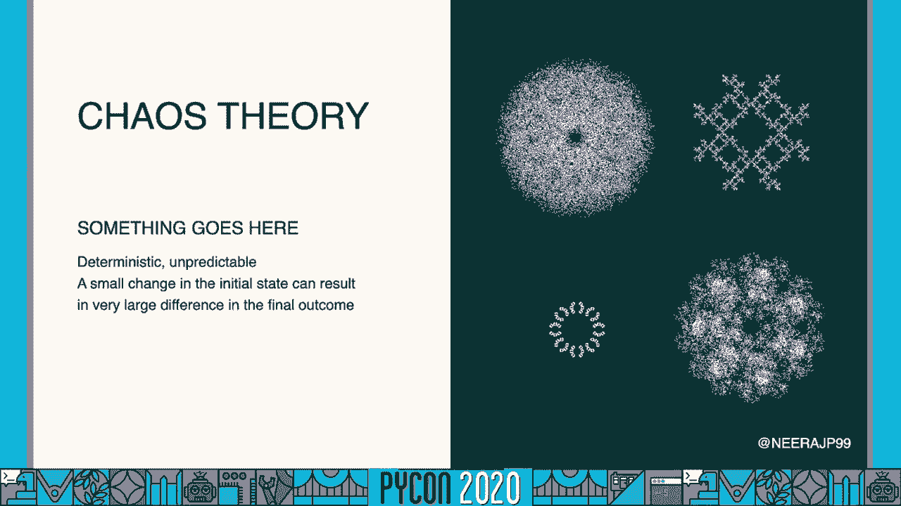

几何图案是生成艺术的常见主题。一个著名的例子是谢尔宾斯基三角形，它是一个递归分形：将一个等边三角形递归地细分为更小的等边三角形。

当我们谈论分形时，曼德博集是最著名的例子之一。它在复平面上定义，迭代公式为：
`z_{n+1} = z_n^2 + c`
其中 `z` 和 `c` 都是复数。通过迭代计算平面上各点的发散速度，并赋予颜色，就能得到曼德博集分形图。

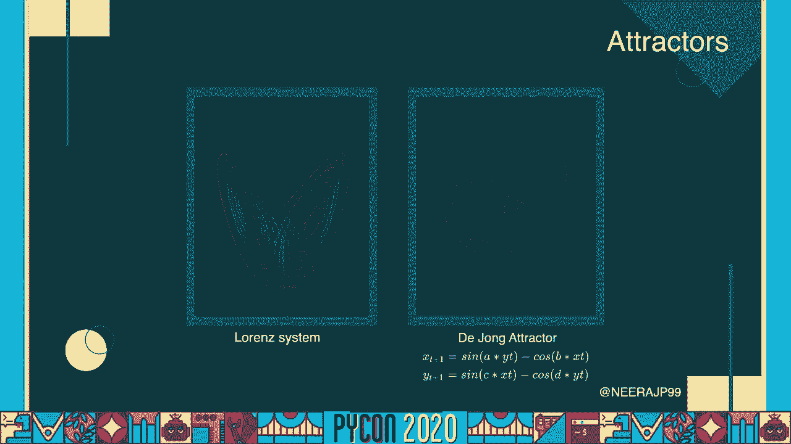

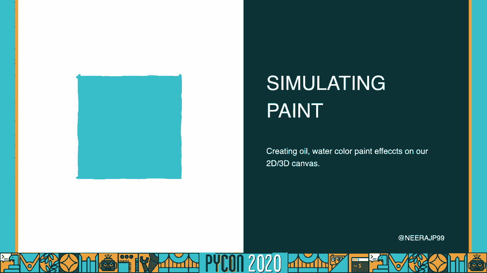

混沌理论意味着初始状态的微小变化会导致最终结果的巨大差异。吸引子（如洛伦兹吸引子）是混沌系统的数学可视化，其坐标演化遵循特定的微分方程。

---

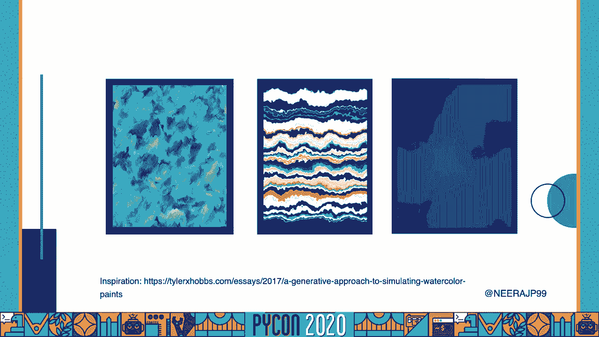

## 图像处理技法：11：模拟绘画与像素排序

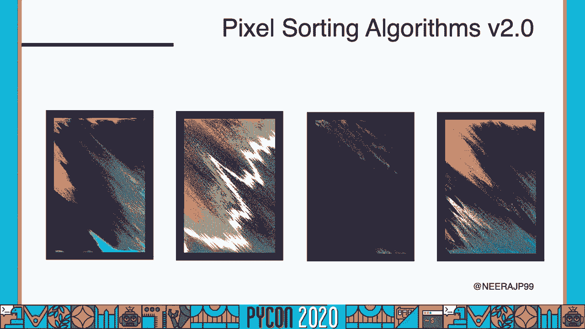

我们可以用代码模拟绘画或水彩效果。一种技术是“变形”，先创建基本形状（如多边形），然后通过算法将其向外扩展，形成细腻的边缘和纹理。

像素排序是一种图像处理技术，它根据亮度等标准，对图像中特定区域的像素进行排序和重排。基本步骤是：
1.  加载图像并获取像素数组。
2.  选择一行或一列像素。
3.  根据像素的亮度值对该行/列进行排序。
4.  将排序后的像素放回图像中。
这个过程可以创造出独特的、条纹状的艺术效果。

---

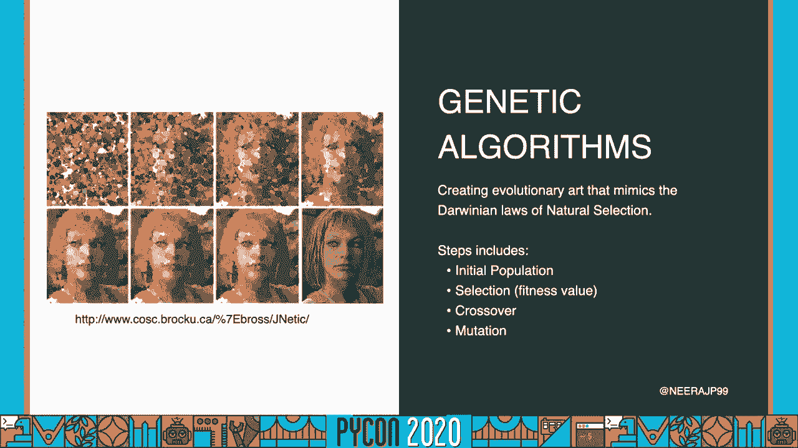

## 进化与智能：12：遗传算法与GAN

遗传算法是一种模拟自然选择过程的优化技术。在生成艺术中，它可以用来“进化”出一组能近似复制目标图像的形状。
基本步骤包括：
1.  **初始化**：创建包含随机形状（基因）的初始种群。
2.  **评估**：计算每个个体（一组形状）与目标图像的差异（适应度）。
3.  **选择**：选择适应度高的个体作为父代。
4.  **交叉**：组合父代的基因创建后代。
5.  **变异**：对后代的基因进行随机微小改变。
6.  **迭代**：重复步骤2-5，直到得到满意的结果。

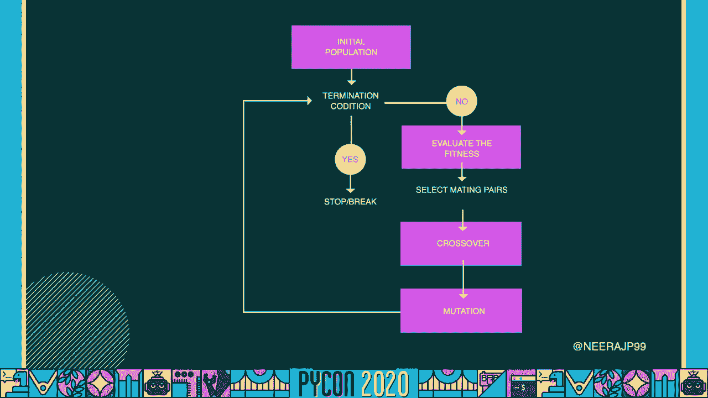

生成对抗网络是另一种强大的工具。它包含两个神经网络：
*   **生成器**：尝试生成新的、逼真的图像。
*   **判别器**：尝试判断图像是真实的还是生成器生成的。
两者在对抗中共同进步，最终生成器能创造出以假乱真的艺术作品。

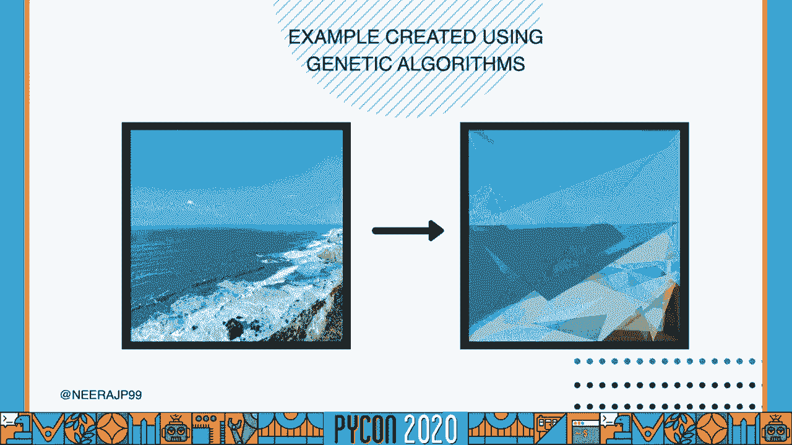

---

## 总结

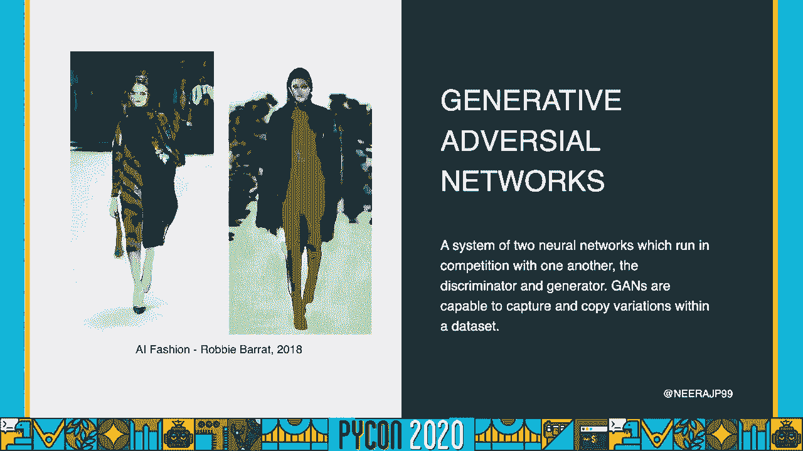

本节课我们一起探索了生成艺术的广阔世界。我们从定义和艺术基础开始，了解了其历史和发展。我们学习了如何使用Processing和Python，通过随机性、向量、基本形状和Perlin噪声来创作。进而，我们探讨了更复杂的主题，如几何分形、混沌理论，并接触了高级技术如像素排序、遗传算法和生成对抗网络。

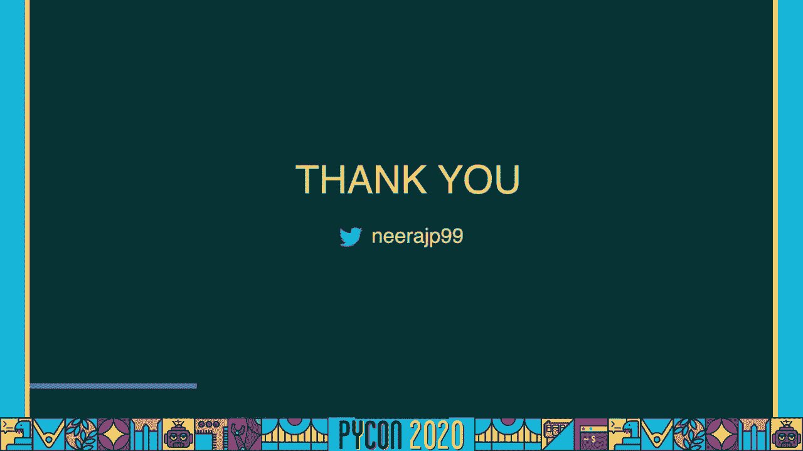

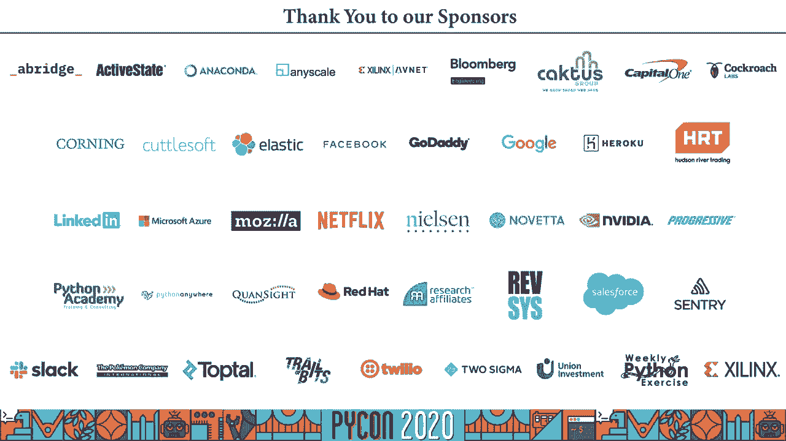

生成艺术的核心在于将艺术家的创意构思转化为算法和规则，并拥抱自主系统带来的意外之美。希望本教程能为你打开一扇门，鼓励你开始用代码探索和创造属于自己的独特艺术。