# Python调试教程：P61：告别Print，拥抱调试器 🐛


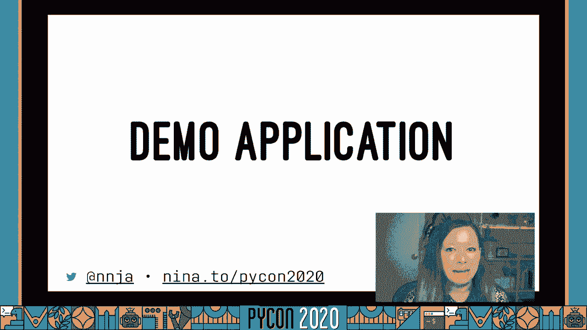

在本教程中，我们将学习如何在Python中进行高效调试。我们将探讨使用调试器相比传统`print`语句的优势，介绍不同类型的调试器（如`pdb`、`ipdb`和IDE集成调试器），并分享一些实用的技巧和最佳实践。无论你是初学者还是有经验的开发者，都能从中获得新的启发。

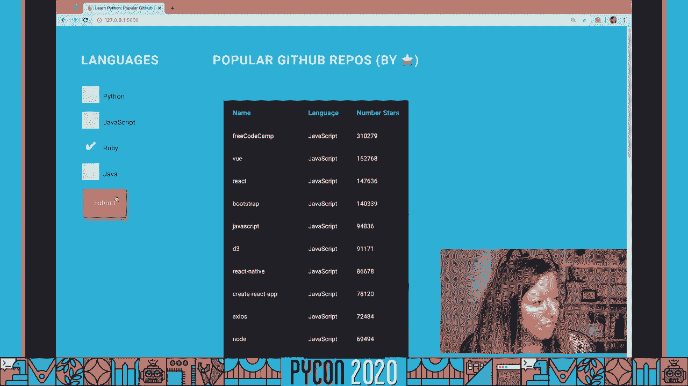

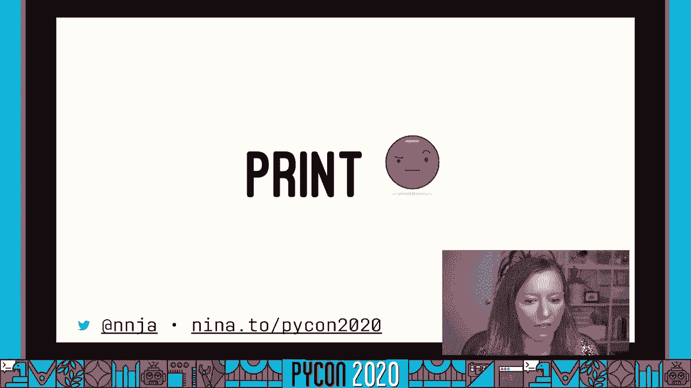

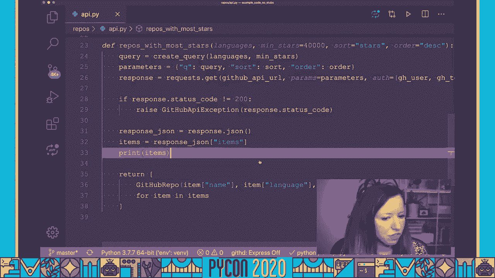

---

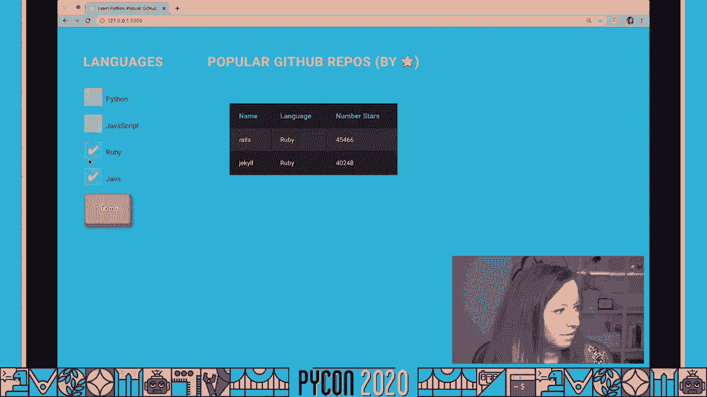


## 调试器基础：为何告别Print？ 🚫

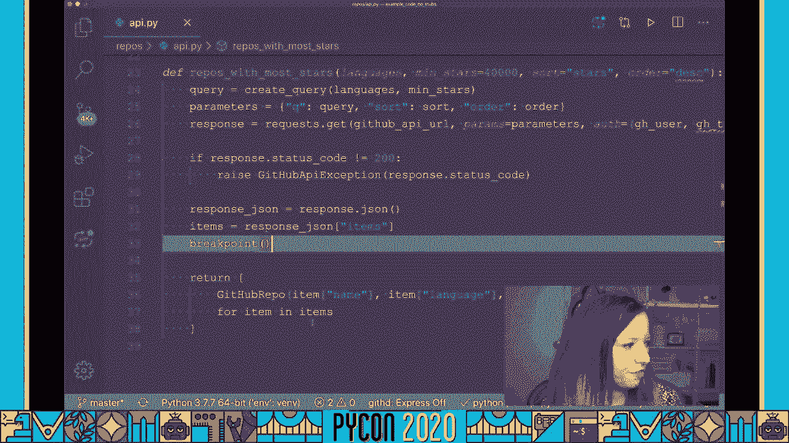

上一节我们概述了本教程的内容，本节中我们来看看为何应该使用调试器。

使用`print`语句进行调试存在几个问题。它无法提供足够的上下文信息。当你需要调整打印内容时，过程可能非常繁琐，尤其是在处理大型嵌套数据结构时。有时，错误甚至可能隐藏在`print`语句本身中。

调试器则允许我们轻松探索运行程序的状态。我们可以交互式地编写新代码片段并进行实验，甚至可以将有用的片段保存并添加回代码库。调试器将你置于代码执行点，不仅能查看对象的字符串表示，还能检查函数参数、作用域内的变量等。

**核心概念：设置断点**
在Python 3.7+中，设置断点非常简单：
```python
breakpoint()  # 程序执行到此会暂停
```
对于更早的Python版本，可以使用：
```python
import pdb; pdb.set_trace()
```

---

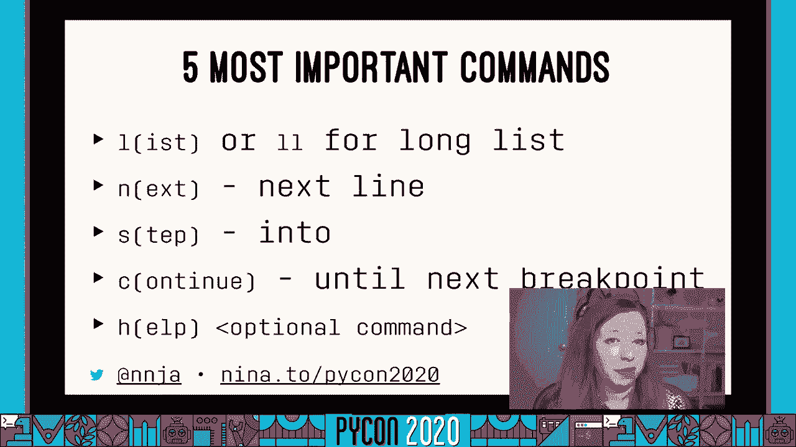

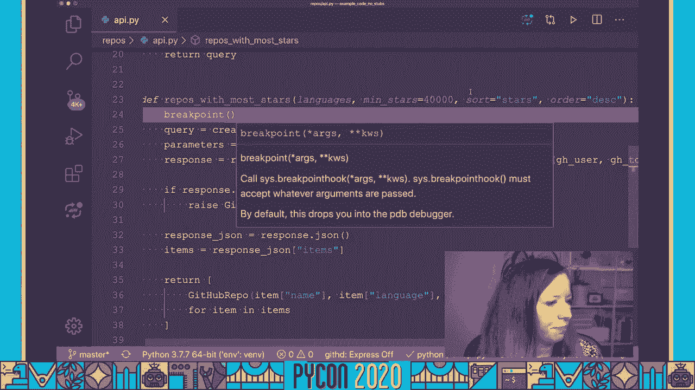

## 调试器实战：从CLI到IDE 🛠️

上一节我们介绍了调试器的基本概念，本节中我们来看看具体的工具和工作流程。

有多种调试工具可供选择。命令行调试器（如`pdb`）便携且无需额外配置。我个人更喜欢`ipdb`，它提供语法高亮和更好的自动补全。对于Python 3.7+，内置的`breakpoint()`函数非常方便，并且可以通过环境变量`PYTHONBREAKPOINT`来指定使用的调试器。

**核心概念：常用调试命令**
以下是`pdb`/`ipdb`的一些基本命令：
*   `l(list)`: 列出当前断点附近的代码。
*   `n(next)`: 执行下一行代码（不进入函数内部）。
*   `s(step)`: 进入函数调用内部。
*   `c(continue)`: 继续执行，直到下一个断点或程序结束。
*   `interact`: 启动一个交互式Python shell，可以使用当前作用域的所有变量。

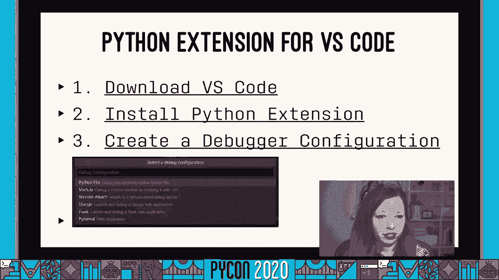

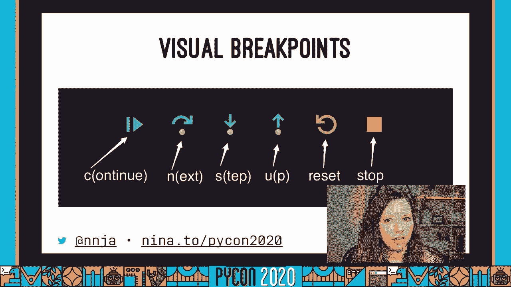


如果你更喜欢图形界面，集成开发环境（IDE）如VS Code提供了强大的调试功能。你可以直观地设置断点、悬停查看变量值、添加监视表达式以及使用条件断点。

**核心概念：条件断点**
在VS Code中，你可以设置断点仅在特定条件为真时触发。例如，只当`language == "python"`时才暂停：
```python
# 在VS Code断点条件框中输入
language == "python"
```

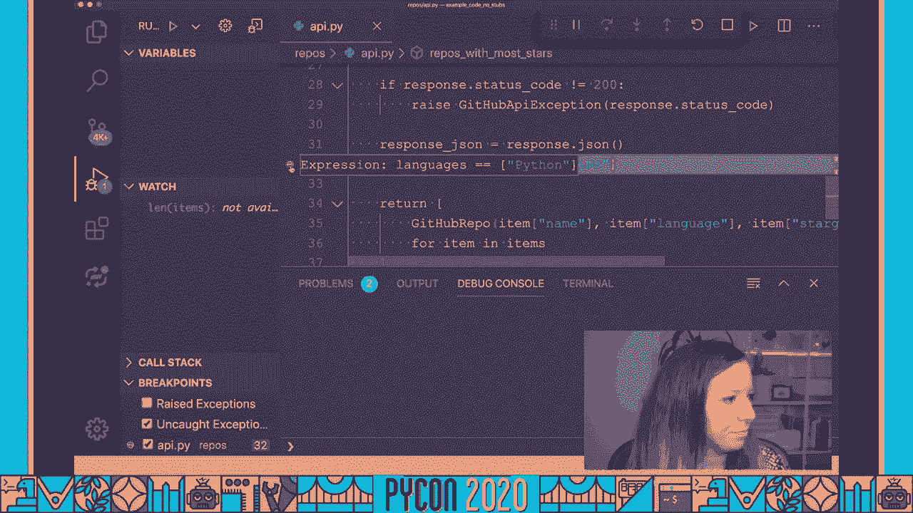

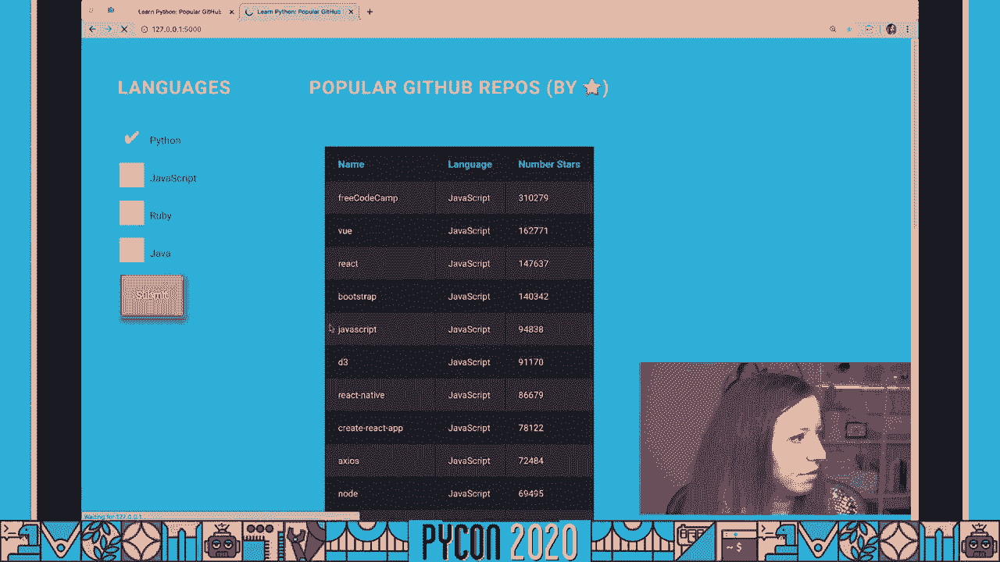

---

## 高级技巧与最佳实践 ✨

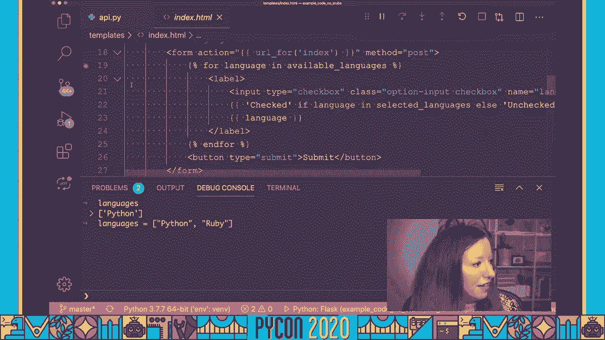

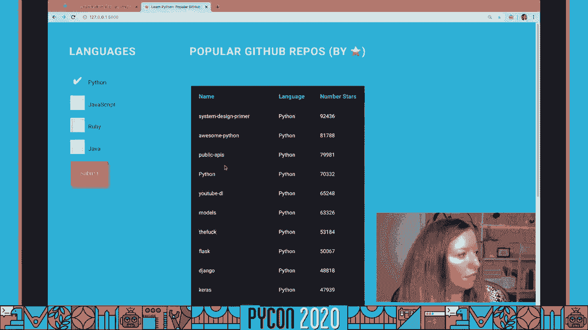

上一节我们比较了不同调试工具，本节中我们来看看一些能提升效率的高级技巧和需要注意的事项。

以下是几个有用的技巧：
1.  **重复命令**：在`pdb`提示符下，直接按`Enter`键会重复执行上一个命令。
2.  **跳出循环**：使用`until`命令可以继续运行，直到行号超过当前行，这有助于快速跳出循环。
3.  **调试测试**：在失败的单元测试中设置断点，是理解测试失败原因的绝佳方式。
4.  **增强交互体验**：通过创建`~/.pdbrc`文件，可以配置`pdb`使用`IPython`作为交互shell，从而获得语法高亮、自动补全等强大功能。

**重要提醒：生产环境注意事项**
切勿将包含`breakpoint()`的代码提交到生产环境！这可能导致程序意外暂停。对于Python 3.7+，可以通过设置环境变量`PYTHONBREAKPOINT=0`来全局禁用断点。更好的做法是使用`pre-commit`这样的Git钩子工具，在提交代码前自动检查并阻止包含调试语句的提交。


---

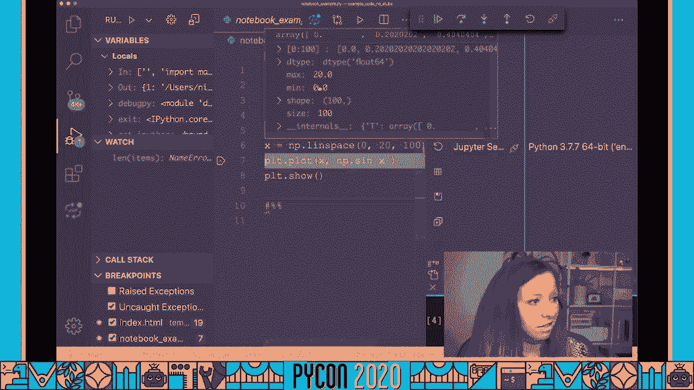

## 总结 📝

本节课中我们一起学习了Python调试的核心知识。我们了解了调试器相比`print`语句的强大之处，实践了从命令行`pdb`/`ipdb`到VS Code图形化调试器的使用，并掌握了一些提升调试效率的高级技巧。

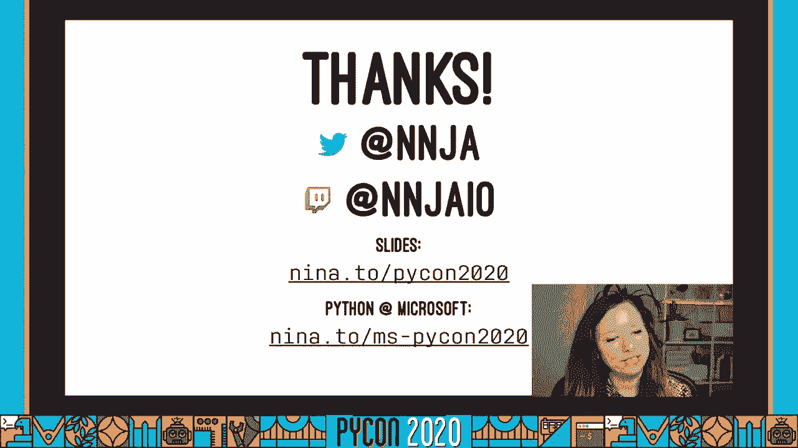


记住，使用调试器是提升开发效率、系统性地定位和修复Bug的关键技能。它帮助你验证关于代码行为的假设，并快速找到问题根源。希望本教程能给你足够的信心，告别低效的`print`调试，拥抱更强大的调试器工具。