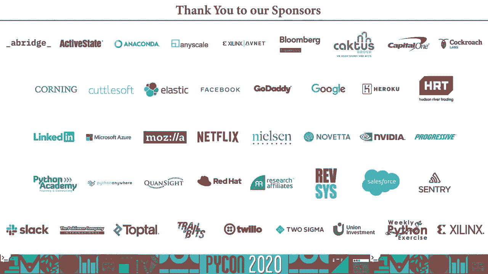

# Python在高能物理中的应用：P62：演讲者Pratyush Das

## 概述

在本教程中，我们将跟随Pratyush Das的演讲，系统性地学习Python在高能物理（HEP）这一前沿科学领域中的应用与发展。我们将探讨高能物理的计算挑战、Python如何成为解决这些挑战的关键工具，以及相关的核心软件库和生态系统。

## 高能物理简介与计算起源

高能物理，也称为粒子物理，研究构成世界的基本粒子及其相互作用。高能物理学家试图回答宇宙的构成和支配力量等根本性问题。

一个令人惊讶的事实是，计算机的早期发展与物理学研究密不可分。第一台电子、非编程数字计算设备——阿塔纳索夫-贝瑞计算机（ABC）——由物理学家约翰·文森特·阿塔纳索夫和克利福德·贝瑞于1937年创造。随后，ENIAC计算机由物理学家约翰·莫奇利和J. Presper Eckert为弹道计算而开发。蒙特卡洛方法由尼古拉斯·梅特罗波利斯在洛斯阿拉莫斯国家实验室为物理问题而发明。奠定现代计算机基础的冯·诺依曼架构也由物理学家约翰·冯·诺依曼提出。甚至全球互联网也是由Tim Berners-Lee在欧洲核子研究中心（CERN）发明的。

## 高能物理的计算挑战

在探讨Python的应用之前，我们需要理解高能物理面临的核心计算挑战。高能物理实验会产生海量数据。基本粒子运动速度极快，它们之间频繁的相互作用需要被记录和分析。

这不仅仅是数据规模的问题，数据的复杂性同样构成挑战。粒子、轨迹和碰撞的表示本身就非常复杂。实验内置的触发系统会直接过滤掉大部分数据，但即便如此，需要存储和分析的数据量依然巨大。例如，CERN在2017年的数据存储量就突破了200 PB。随着大型强子对撞机（LHC）升级到高亮度阶段（HL-LHC），数据量将呈指数级增长。

为应对这一挑战，高能物理界建立了全球LHC计算网格（WLCG），这是一个分布在世界各地研究机构的计算机网络，用于分担数据存储和计算任务。然而，WLCG仍不足以满足所有需求。行业标准基准SPEC CPU 2006显示，通用CPU性能提升了近5倍，但针对高能物理应用优化的HS06基准显示性能仅提升约2倍。这表明通用CPU性能的提升并未完全惠及高能物理的特定计算模式。

## 解决方案：GPU与专用库

既然CPU性能提升有限，高能物理界开始转向GPU。许多高能物理计算是高度并行的，非常适合GPU架构。使用GPU可以显著提升特定物理问题的计算性能。

为了高效处理复杂的高能物理数据，专用的软件库被开发出来。例如，**Awkward Array**库就是为了处理复杂、不规则的高能物理数据而构建的。它的设计包含不同抽象层级，允许未来集成GPU后端，并通过Python接口提供易用性。

## Python为何适合高能物理？

那么，是什么让一种编程语言在高能物理中变得理想？

1.  **易于使用**：研究人员不希望花费大量时间学习新语言。Python以其简洁的语法和较低的学习曲线而闻名。
2.  **速度**：处理海量数据需要语言足够快。虽然原生Python可能较慢，但与NumPy等库结合时，其性能可以媲美甚至超越C++。
3.  **主流与生态**：主流语言拥有丰富的学习资源、社区支持和成熟的库生态系统。根据TIOBE指数，Python是世界上最流行的编程语言之一。

因此，尽管Python不是高能物理中最早使用的语言，但它凭借这些优势逐渐被广泛采纳。

## Python在高能物理中的历史演进

物理学家很早就开始尝试使用Python。
*   1994年，Jeff Templon等物理学家开始编写小脚本。
*   1997年，美国费米实验室发表了关于将Python用作D0实验扩展语言的论文。
*   1998年，Jeff Templon发表了题为《Python作为集成语言》的论文。
*   2000年起，Python在CHEP（计算高能物理国际会议）上的相关演讲逐渐增多。
*   2003年，Python开始被集成到一些实验的分析框架中，标志着物理学家开始认真使用Python进行分析。

根据J. Pivarski绘制的图表，Python在高能物理中的使用率在2019年首次超过了C++。这预示着未来的发展趋势。

## 核心工具：ROOT与Python接口

几乎所有高能物理研究者都使用**ROOT**。ROOT是一个用C++编写的综合性科学软件工具包，提供了处理大数据所需的一切功能：统计分析、可视化、存储、机器学习等。它几乎成为了高能物理计算的代名词，2012年希格斯玻色子的发现就是使用ROOT进行数据分析的。

然而，社区对Python接口的需求日益增长。ROOT提供了名为**PyROOT**的Python绑定。由于ROOT代码库极其庞大（数百万行代码），它没有为每个C++类手动创建绑定，而是采用了**CPyCppyy**技术。CPyCppyy能动态创建Python到C++的绑定，最初为ROOT开发，现在也作为独立项目存在。

尽管PyROOT在不断改进，但它仍存在一些问题，例如C++与Python对象间的所有权问题、风格不够“Pythonic”、处理某些数据时速度较慢。

## 替代方案：uproot

为了解决PyROOT的某些问题，**uproot**被开发出来。uproot是ROOT文件I/O在Python中的纯替代实现，完全用Python编写。它由Jim Pivarski及其团队创建，旨在提供更快速、更符合Python习惯的ROOT文件读写体验。

uproot虽然相对较新（始于2017年底），但已成为高能物理中最广泛使用的Python包之一。使用统计显示，它在科学Linux系统上的使用率与NumPy、SciPy等行业标准工具相当。

## 性能：Python不一定慢

与流行观点相反，Python在与高性能库结合时速度并不慢。在一个计算分形的基准测试中：
*   使用NumPy的向量化操作，速度几乎与C++相当。
*   使用uproot处理ROOT数据，速度比ROOT的C++实现快30倍。
*   使用NumPy编译的特定代码，速度比C++ ROOT快90倍。

当然，这只是一个特例，但它证明了通过合适的库（如NumPy、Numba），Python代码可以获得极高的性能。

## 技术桥梁：PyBind11

**PyBind11**是一个用于在Python中创建C++绑定的流行工具。在高能物理中，它被用于将现有的C++代码暴露给Python。例如，Awkward Array库的最新版本就用C++和PyBind11进行了重写，以解决原有纯Python版本在扩展性和维护性上的挑战，同时满足物理学家对命令式接口的需求。其他库如直方图库**pyhf**和**GoOFit**也使用了PyBind11。

## 生态系统：Scikit-HEP项目

**Scikit-HEP项目**旨在汇集高能物理研究所需的所有Python工具。它将许多活跃开发的高能物理Python库组织在一起，为物理学家提供了一个可互操作的工具箱。物理学家可以根据当前任务选择所需库，并在需要时轻松切换到项目内的其他工具。

Scikit-HEP包含各种功能的包，如粒子跟踪、衰变模拟、直方图处理、拟合、模拟等，并且仍在不断增长。该项目拥有活跃的社区，方便开发者与用户交流。

## 机器学习与未来趋势

机器学习和深度学习的最新进展也加速了Python在高能物理中的采用。虽然ROOT有自己的机器学习库TMVA，但行业标准框架如PyTorch和TensorFlow更强大、更流行。高能物理界对此持开放态度，甚至邀请PyTorch的联合创始人在学术会议上介绍其应用。

从物理学家的视角看，Python的优势在于开发效率。一位物理学家（Chris Burr）指出，他90%的代码可能只使用一次，因此编写和执行代码的时间至关重要。虽然C++运行快，但Python编写更快、更易读，总体而言可能更节省研究时间。

## Python在其他物理领域的应用

Python在天文学领域的应用甚至更为广泛和成熟。**Astropy**库与Scikit-HEP类似，但采用度更高。统计显示，在天文学出版物提及的软件中，用Python编写的比例呈指数增长，已完全主导了其他语言。

## 推广Python采用的策略

对于如何在高能物理中进一步推广Python，主要有三种策略：
1.  **使用CPyCppyy创建绑定**：对于已有的大型C++代码库（如ROOT），这是最简单的方法，但该技术可能尚未准备好用于普遍推广。
2.  **使用PyBind11封装**：这是更通用的方法，但可能需要编写大量额外的封装代码。
3.  **用Python重写**：对于新项目或小型库，这是最可取的，因为它对不熟悉C++的研究者更友好。但若对性能要求极高，开发者需要熟悉NumPy、Numba等优化库。

## 总结

通过本教程的学习，我们可以清晰地看到：
*   Python因其易用性、强大的库生态系统和与高性能计算结合的能力，在高能物理这类对性能有严苛要求的科学领域日益受到欢迎。
*   与C++相比，Python具有更高的可读性和开发效率，这对主要兴趣在于物理而非编程的研究者至关重要。
*   Python是连接机器学习等现代数据科学工具与高能物理研究的自然桥梁。
*   随着uproot、Awkward Array、Scikit-HEP等专门工具的发展，以及PyROOT的持续改进，Python在高能物理社区的地位已经确立并将长期存在。

对于希望进入高能物理领域的新人，熟悉Python及其科学计算栈（如pandas, TensorFlow）将比学习ROOT的特定替代品（如RooFit, FAMOS, TMVA）更具优势。

---
**致谢与资源**（根据原文整理）：
本演讲内容得到了Jim Pivarski、Jeff Templon、Henry Schreiner、Eduardo Rodríguez等人的帮助和启发。相关项目链接可在原演讲幻灯片中找到。
*   演讲者联系方式：`ricktas@gmail.com`
*   演讲者GitHub：`ricktas`