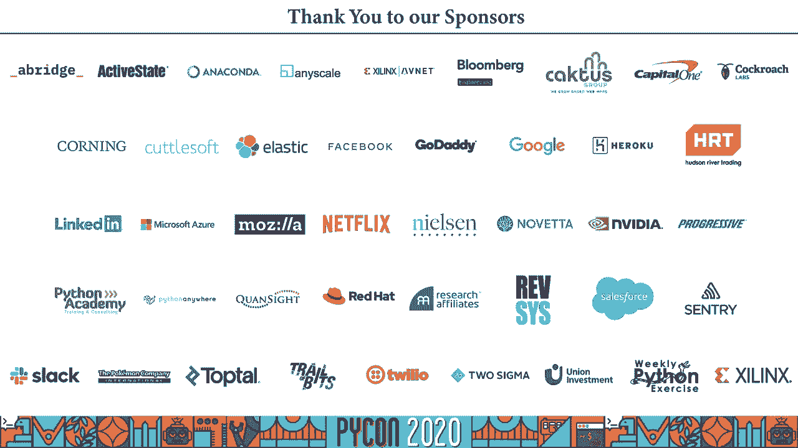

# 程序员百科书：P63：隐私保护方法 - 构建安全项目 🔒

在本节课中，我们将学习如何在构建项目时保护用户隐私。我们将探讨几种核心的隐私保护技术，理解它们如何工作，以及在不同场景下如何应用它们来确保数据安全。

---

## 概述

大家好，我是丽贝卡。我来自巴西，是一名计算机工程师。今天我将讲解隐私保护方法，特别是如何构建安全项目。许多大公司经常测试他们能用我们的数据做什么。我将通过一些滥用隐私的案例，说明保护用户隐私的重要性，并介绍几种实用的技术方法。

---

## 1：为什么隐私保护至关重要？⚠️

上一节我们介绍了课程主题，本节中我们来看看为什么隐私保护是一个不容忽视的问题。

政府试图通过法规来确保人们在应用程序和系统中的隐私。然而，效果存疑。例如，有人仅因使用骑行追踪应用程序，就被错误地列为抢劫案嫌疑人。另一个例子是，政府使用手机数据监控社交隔离。这些案例引发了关于社会需要进行的辩论及其后果。

科学家们缺乏足够数据来建立新模型，因为最重要的数据往往掌握在大公司手中。最糟糕的是，人们普遍感到缺乏安全感，觉得一直被监视。但我们可以采取行动来保护隐私。

---

## 2：从简单案例开始 - 收集敏感数据 📊

上一节我们讨论了隐私的重要性，本节中我们来看看一个简单的数据收集案例。

假设你是一名研究人员，想调查运动员是否使用过违禁药物。你有两个选项：“是”（使用过）或“否”（未使用）。如果人们诚实回答，你会得到一个数据集，并可以从中获取统计数据。

但这里存在一个问题：即使数据集匿名（不包含姓名），仅通过统计数据也可能泄露个人隐私。攻击者可以通过提出不同的问题（例如，结合其他已知信息）来识别个体，这种攻击被称为“关联攻击”。

---

## 3：如何保护受访者？引入随机化回答 🎲

上一节我们看到简单的匿名统计并不安全，本节中我们来看看如何通过技术保护受访者。

我们仍然想收集数据，但要保护受访者。方法如下：我们给用户一枚硬币，并制定规则。
*   如果硬币正面朝上，用户必须回答“是”。
*   如果硬币反面朝上，用户则诚实回答真实情况。

这样，任何“是”的答案都可能是由抛硬币决定的，为受访者提供了“合理的否认”。这项技术被称为**随机化回答**。它通过引入随机性（偏见）来保护个人答案，同时当样本量足够大时，仍能计算出总体的统计比例（例如，使用违禁药物的用户百分比）。

**核心思想**：人们无需完全诚实地回答问题，系统引入的随机性保护了个人。

---

## 4：发布数据集时的风险与对策 🛡️

上一节我们介绍了保护数据收集过程的方法，本节中我们来看看发布数据集时面临的挑战。

有时，你需要与合作伙伴分享或公开发布数据集。通常的做法是删除姓名、身份证号等直接标识符。然而，一些被称为“准标识符”的属性（如邮编、性别、出生日期），当组合在一起时，很可能唯一地识别出一个人。例如，87%的美国人口可以通过这三条信息被唯一识别。

更危险的是“链接攻击”：当你的匿名数据集与其他公开信息源结合时，可能重新识别出个人。例如，Netflix和巴西电信公司Vivo都发生过此类事件。

一种防御技术是 **k-匿名化**。
*   **做法**：将准标识符泛化（例如，将具体年龄变为年龄段）或抑制（删除某些记录），使得任何一组准标识符都至少对应`k`个人。
*   **目标**：你无法从表中直接指向任何一个体。

但k-匿名化并非完美，未来出现的新数据仍可能发起链接攻击。这里存在一个根本性的权衡：**数据隐私**与**数据可用性**。你无法在极度限制数据的同时保持其高度有用。

---

## 5：差分隐私 - 强大的隐私定义与技术 🧮

上一节我们讨论了发布静态数据的保护方法，本节中我们来看看一种更强大的、适用于交互式查询的隐私技术。

如果我们不想发布原始数据集，但允许外界对数据集进行查询（例如，统计查询），该如何保护隐私？这引出了**差分隐私**的定义。

**差分隐私**的核心是：数据持有者与数据主体之间的协议，确保数据主体的隐私不会因为其数据被使用而受到影响。关键在于，无论攻击者拥有多少外部辅助信息，都无法推断出特定个体是否在数据集中。

在数据库上下文中，这意味着：**从数据集中添加或删除任何一个人的记录，对查询结果的影响微乎其微**。这为个人提供了“合理的否认”。

**技术实现**：通过在查询结果中添加精心设计的随机噪声来防止推理攻击。噪声的添加是随机的，这是该机制的关键。

**差分隐私的数学定义（简化）**：
对于两个仅相差一条记录的相邻数据集 `D` 和 `D‘`，以及任何查询输出 `S`，满足：
`Pr[M(D) ∈ S] ≤ e^ε * Pr[M(D’) ∈ S]`
其中 `M` 是随机化算法，`ε` 是隐私预算参数。`ε` 越小，隐私保护越强，但数据可用性可能越低。

差分隐私有很多优秀的开源实现（如Google的DP库、IBM的Diffprivlib），是构建隐私保护应用的强大工具。

---

## 6：联邦学习 - 协作训练，数据不离本地 📱

上一节我们学习了保护数据分析过程的差分隐私，本节中我们来看看如何在训练机器学习模型时保护隐私。

假设你想建立一个预测模型（如手机键盘的下一个词预测），但训练数据（用户输入）包含敏感信息。传统方法需要将数据集中到云端，存在隐私风险。

**联邦学习**提供了解决方案：
1.  服务器将初始模型发送给各用户设备。
2.  设备在本地用自己的数据训练模型，生成模型更新。
3.  设备将模型更新（而非原始数据）发送回服务器。
4.  服务器聚合所有更新，改进全局模型，再下发。

**优点**：训练数据始终保留在用户设备上，从未上传。这降低了延迟，并有助于建立更通用的模型。

**注意**：联邦学习本身不能完全保证隐私。通过分析发送的模型更新，仍可能推断出部分用户信息。因此，它常需与差分隐私等技术结合使用。

---

## 7：安全多方计算与同态加密 🔐

上一节我们介绍了联邦学习，本节中我们来看看另外两种在多方协作或数据外包场景下的高级隐私技术。

**场景一：多方共同计算，互不泄露输入**
假设六个人想知道平均工资，但谁也不愿透露自己的具体数额。可以使用**安全多方计算**。
*   **过程**：第一人生成一个随机大数，加密后加上自己的工资，传给下一人。每人依次加上自己的工资。最后一人传回给第一人，第一人减去最初的随机数，得到工资总和，再计算平均值公布。
*   **核心**：所有人都知道结果，但无人知道其他人的具体输入。适用于多方协作建模，无需可信第三方。

**场景二：委托处理加密数据**
如果你因合规或安全原因，不能将数据下载到本地，但又需要云服务进行处理，可以使用**同态加密**。
*   **过程**：你将加密的数据发送给第三方。第三方在不解密的情况下，直接对密文进行计算，并将加密的结果返回给你。只有你拥有密钥，可以解密最终结果。
*   **优点**：保护了你的数据（即使对处理方也不可见），也保护了第三方的算法模型（模型内部逻辑不被你窥见）。它被认为是后量子安全的，但目前计算开销较大，适用于较小规模的数据或计算。

---

## 总结

本节课中我们一起学习了构建安全项目时保护隐私的多种方法：
1.  **发布数据集**：需警惕准标识符和链接攻击，可采用**k-匿名化**，但需权衡隐私与可用性。
2.  **进行聚合分析**：**差分隐私**提供了强大的隐私保证，通过在查询结果中添加噪声来实现。
3.  **训练机器学习模型**：**联邦学习**允许在数据不离本地的情况下协作训练模型。
4.  **多方协作或数据外包**：**安全多方计算**使多方能在不公开输入的情况下共同计算；**同态加密**允许对加密数据进行操作，结果解密后仍有效。

请记住关键原则：数据很难在完全匿名的同时保持高度有用；大数据集和统计查询并不自动意味着安全；务必警惕链接攻击。如果你处理欧洲公民数据，请务必寻求法律咨询以确保合规。隐私保护是一个持续的过程，需要结合业务需求、技术手段和法律法规来综合考量。