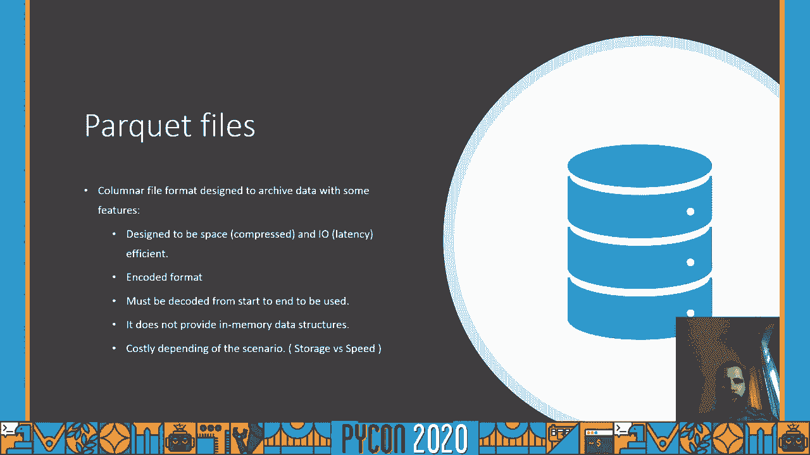
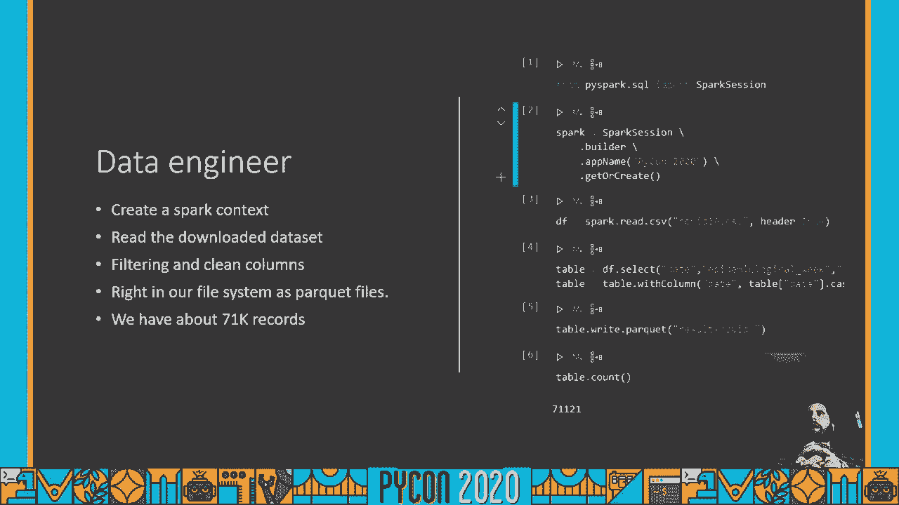
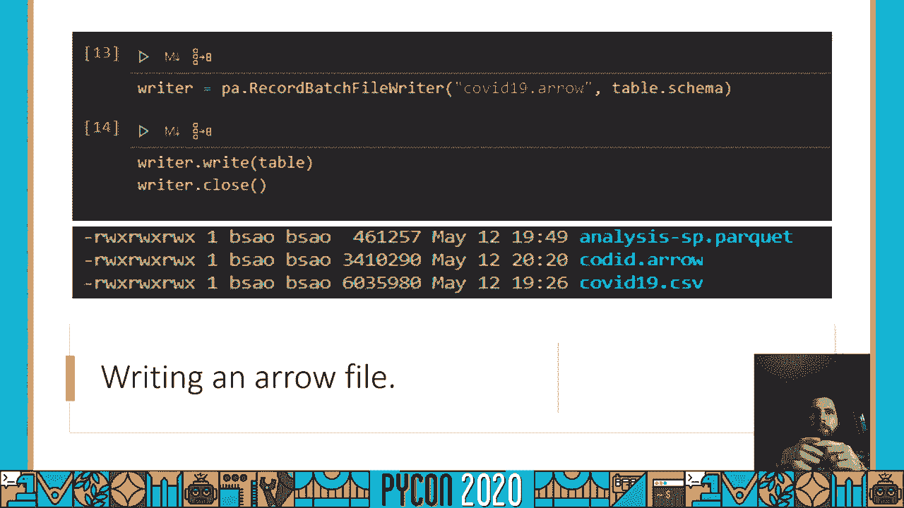

# 数据处理与交换：P65：用 Apache Arrow 实现高效多语言数据交换


## 概述 📋

在本教程中，我们将学习如何使用 Apache Arrow 来解决不同团队和系统之间交换和处理数据时遇到的常见问题。我们将探讨传统数据格式（如 CSV、Parquet）的局限性，并了解 Arrow 如何通过其内存中的列式数据结构，提供一种高性能、语言无关的解决方案，从而简化数据共享和分析流程。

---

## 数据交换的常见挑战与现有方案 🔄

在数据驱动的团队协作中，一个核心问题是数据交换。当不同角色（如数据工程师、数据科学家、业务分析师）需要基于同一份数据进行协作时，通常会面临一系列挑战。

以下是数据交换中常见的几个问题：

*   **数据格式不一致**：不同团队可能使用不同的专有数据格式。
*   **存储成本高昂**：存储大量数据，尤其是为了协作而存储多份副本，成本很高。
*   **协作执行困难**：在共享数据上执行分析或修改操作流程复杂。
*   **性能瓶颈**：使用通用文件格式（如 CSV）处理大规模数据时，性能往往不佳。

上一节我们介绍了数据交换的普遍难题，本节中我们来看看业界通常如何解决这些问题。

一般来说，解决团队间的数据交换问题有两个主要方向：

*   **ETL与数据管道**：使用专门的工具进行数据提取、转换和加载。例如，在 JVM 生态中有 Spark、Flink、Hive 等；在 Python 生态中可以使用 PySpark、Dask 等。这些工具擅长处理大规模数据的摄入、修改和写出。
*   **共享存储与分析**：将数据推送到一个共享存储（如数据湖、数据库），然后不同团队使用 SQL 或分析工具（如 Tableau）直接访问。常见做法是将数据导出为 CSV 或 Parquet 文件供下游分析。

然而，这些方案仍有痛点。例如，当需要分析一个 10GB 的数据集时，下载文件可能受限于本地磁盘空间、内存或网络带宽。


---

## Parquet 格式：优势与局限 📦


面对上述挑战，社区和公司广泛采用的一种方案是使用 **Parquet 文件**。

Parquet 是一种为大规模数据分析设计的列式存储格式，它拥有以下主要优点：

*   **为分布式系统设计**：非常适合 Hadoop 等分布式文件系统。
*   **高效的压缩**：显著节省存储空间，减少网络传输流量。
*   **编码优化**：数据经过专门编码，读取效率高。

但是，Parquet 也存在一些局限：

*   **需要完整解码**：读取 Parquet 文件时，通常需要将整个文件或相关列解码到内存中，才能转换为程序可用的数据结构（如 Pandas DataFrame 或 Spark DataFrame）。
*   **序列化开销**：在不同技术栈（如 Python 和 Spark）间传递数据时，可能涉及额外的序列化和反序列化过程。
*   **更新成本高**：Parquet 文件本身不适合频繁的写操作。任何修改都可能需要重写整个文件，虽然像 Delta Lake 这样的项目旨在解决此问题，但可能引入额外的复杂性或成本。

---


## Apache Arrow：内存中的列式数据协议 🏹

与 Parquet 侧重于持久化存储不同，**Apache Arrow** 的核心是定义一个内存中的数据结构，用于高效计算。

Arrow 的核心是一个**语言无关的二进制列式内存协议**。它定义了数据在内存中的布局方式，使得不同编程语言和系统可以**零拷贝**地访问相同的数据。

以下是 Arrow 的关键特性：

*   **列式内存布局**：数据按列连续存储在内存中，这与 Parquet 在磁盘上的列式存储理念一致，但发生在内存层面。
*   **语言无关性**：任何语言（如 Python、R、Java、C++）只要实现了 Arrow 规范，就能以相同的方式理解和操作这些内存数据，无需序列化/反序列化。
*   **进程间通信**：这种标准化的内存格式非常适合作为进程间通信（IPC）的载体，例如在 Spark 和 Python 用户自定义函数（UDF）之间快速交换数据块。
*   **恒定时间访问**：由于其数组结构，访问任何元素的时间复杂度是 O(1)，性能极高。

为了更直观地理解，请看以下对比：

*   **传统行式存储**：数据在内存中按行分组。第一行所有字段紧挨着，然后是第二行所有字段，依此类推。
*   **Arrow 列式存储**：数据在内存中按列分组。所有行的“session_id”值构成一个连续数组，所有行的“timestamp”构成另一个连续数组，等等。

这种布局使得基于列的分析操作（如对某一列求和、求平均值）速度极快，因为相关数据在内存中是连续存放的。

---



## Arrow 与 Parquet 的协同工作 🤝

上一节我们介绍了 Arrow 的内存协议，本节中我们来看看它如何与 Parquet 等持久化格式协同工作。

Arrow 和 Parquet 并非替代关系，而是互补关系，它们共同构成了现代数据栈的高效链路：

*   **Parquet 用于长期存储**：Parquet 设计用于持久化存储，适合构建数据湖，保存数年甚至十年的历史数据。它压缩率高，节省存储成本。
*   **Arrow 用于高速计算**：当需要读取和分析 Parquet 数据时，可以利用 Arrow 将其快速加载到内存中。许多工具（如 Pandas、Spark）已经支持直接从 Parquet 文件读取到 Arrow 格式的内存数据，避免了中间转换。
*   **数据交换的“中间件”**：Arrow 可以作为不同团队和工具之间数据交换的“中间件”。数据工程师可以将数据以 Arrow 格式共享在内存或共享文件系统（如 S3）上，数据科学家可以直接用 Python 读取并进行分析，实现无缝协作。

简而言之，可以理解为：**Parquet 是磁盘上的高效列式存储，而 Arrow 是内存中的高效列式计算**。两者结合，实现了从存储到计算的全流程优化。

---

## 实践示例：使用 Python 操作 Arrow 数据 🐍

理论介绍完毕，现在让我们通过一些简单的 Python 代码示例来看如何实际操作 Arrow 数据。

首先，你需要安装必要的库。我们将使用 `pyarrow` 库。

```bash
pip install pyarrow pandas
```

假设我们作为一名数据工程师，从一个数据源（例如一个 CSV 文件）获取数据，进行转换，然后将其保存为 Parquet 格式，同时利用 Arrow 进行高效处理。

**示例1：读取 CSV，转换并保存为 Parquet**

```python
import pandas as pd
import pyarrow as pa
import pyarrow.parquet as pq

# 1. 模拟从巴西COVID数据网站下载数据集（这里我们假设已有一个CSV）
# 假设 df 是从 `brazil_io` 等数据源读取的 Pandas DataFrame
# df = pd.read_csv('covid_data.csv')


# 为了示例，我们创建一个模拟的 DataFrame
data = {
    'date': ['2023-01-01', '2023-01-02', '2023-01-03'],
    'state': ['SP', 'RJ', 'MG'],
    'cases': [100, 150, 80],
    'deaths': [5, 8, 3]
}
df = pd.DataFrame(data)

# 2. 将日期列转换为正确的日期类型
df['date'] = pd.to_datetime(df['date'])

# 3. 将 Pandas DataFrame 转换为 Arrow Table
table = pa.Table.from_pandas(df)

# 4. 将 Arrow Table 写入 Parquet 文件
pq.write_table(table, 'covid_data.parquet')
print("数据已保存为 Parquet 文件。")
```

**示例2：读取 Parquet 文件，使用 Arrow 进行过滤和子集选择**

```python
# 1. 从 Parquet 文件读取数据到 Arrow Table
table_from_parquet = pq.read_table('covid_data.parquet')


# 2. 使用 PyArrow 的计算功能进行过滤（例如，选择州为 'SP' 的数据）
# 注意：PyArrow 有自己的一套表达式 API，这里使用简单的 Pandas 风格过滤进行演示
# 更高效的方式是使用 pyarrow.compute 模块
df_filtered = table_from_parquet.to_pandas()  # 转换为 Pandas DataFrame 进行过滤（小数据演示）
df_sp = df_filtered[df_filtered['state'] == 'SP']

# 3. 将过滤后的数据转换回 Arrow Table 并保存为新的 Arrow 文件（.arrow 或 .feather）
table_sp = pa.Table.from_pandas(df_sp)
# 使用 Feather 格式（基于 Arrow 的二进制文件格式，用于存储 Arrow 数据）
pa.feather.write_feather(table_sp, 'covid_data_sp.arrow')
print("SP 州的数据已保存为 Arrow 文件。")


# 你也可以直接保存为 Parquet
pq.write_table(table_sp, 'covid_data_sp.parquet')
```

**示例3：直接操作 Arrow 数据结构**

```python
# 创建一个原生的 Arrow Table
arrays = [
    pa.array([1, 2, 3, 4]),
    pa.array(['foo', 'bar', 'baz', None]),
    pa.array([True, False, True, True])
]
schema = pa.schema([
    pa.field('id', pa.int64()),
    pa.field('value', pa.string()),
    pa.field('flag', pa.bool_())
])
native_table = pa.Table.from_arrays(arrays, schema=schema)
print(native_table)
print(native_table.schema)
```



在这些示例中，`pyarrow` 库使得在 Pandas DataFrame、Arrow Table 和 Parquet 文件之间的转换变得非常流畅和透明。`feather` 格式则是专门为存储 Arrow 内存数据而设计的，读写速度极快。

---


## 总结 🎯


本节课中我们一起学习了如何利用 Apache Arrow 来应对多语言环境下的数据交换挑战。

我们首先分析了在团队协作中数据交换面临的格式、存储、协作和性能问题。接着，探讨了 Parquet 格式作为持久化存储方案的优点与不足，特别是其在读取和更新时的开销。



然后，我们深入介绍了 **Apache Arrow** 的核心价值：它是一个**语言无关的列式内存数据结构协议**。它通过定义数据在内存中的标准布局，实现了：
*   **零拷贝共享**：不同系统间无需序列化即可访问数据。
*   **高性能计算**：列式内存布局非常适合现代分析型查询。
*   **生态互通**：作为 Spark、Pandas、R 等多种工具之间的高速数据桥梁。

最后，我们通过 Python 代码示例演示了如何将 Pandas 数据转换为 Arrow 格式，如何与 Parquet 文件交互，以及如何直接操作 Arrow 数据结构。

Arrow 并非要取代 Parquet，而是与它协同工作，共同构建从高效存储（Parquet）到高效计算（Arrow）的完整数据链路。对于需要在 Python 及其他语言生态中进行高性能数据交换和处理的开发者来说，理解和应用 Apache Arrow 是一项非常有价值的技能。


---


**资源链接**：
*   Apache Arrow 官网：https://arrow.apache.org/
*   PyArrow 文档：https://arrow.apache.org/docs/python/
*   （示例中提到的）演讲者 Github 可能包含相关代码示例。


希望本教程能帮助你入门 Apache Arrow，并在你的数据项目中实现更高效的处理和交换。