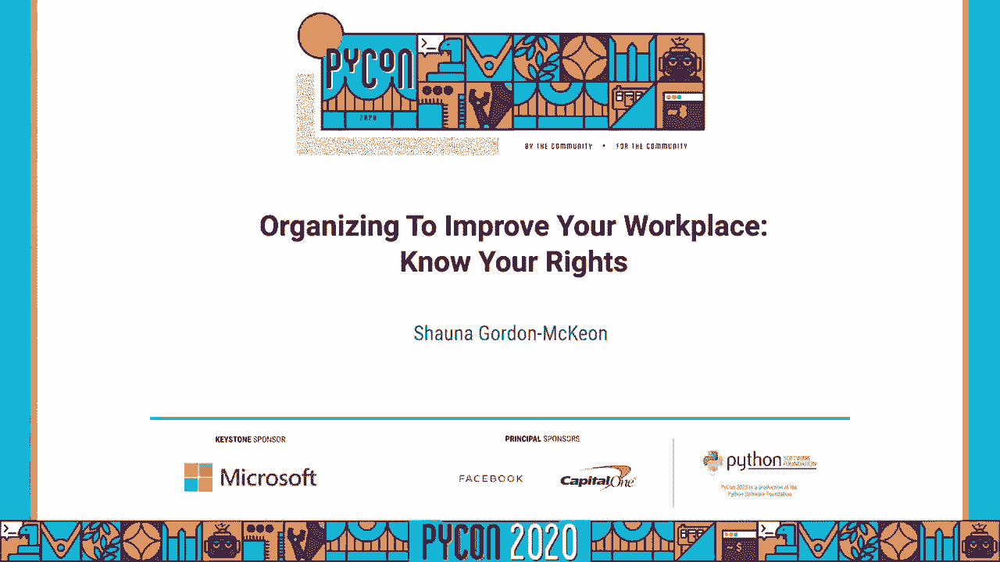
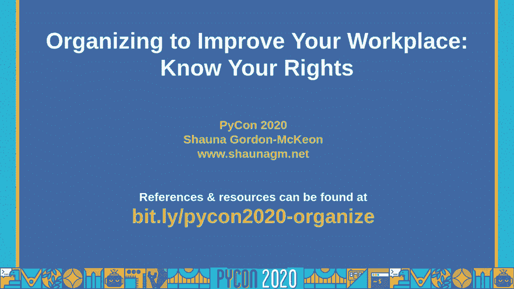
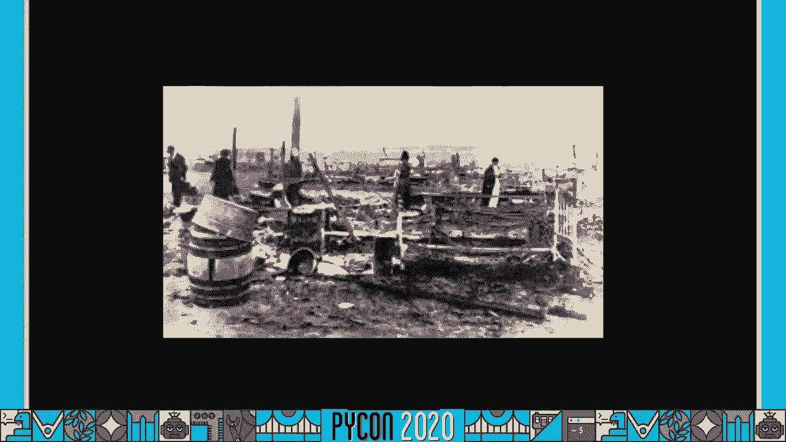
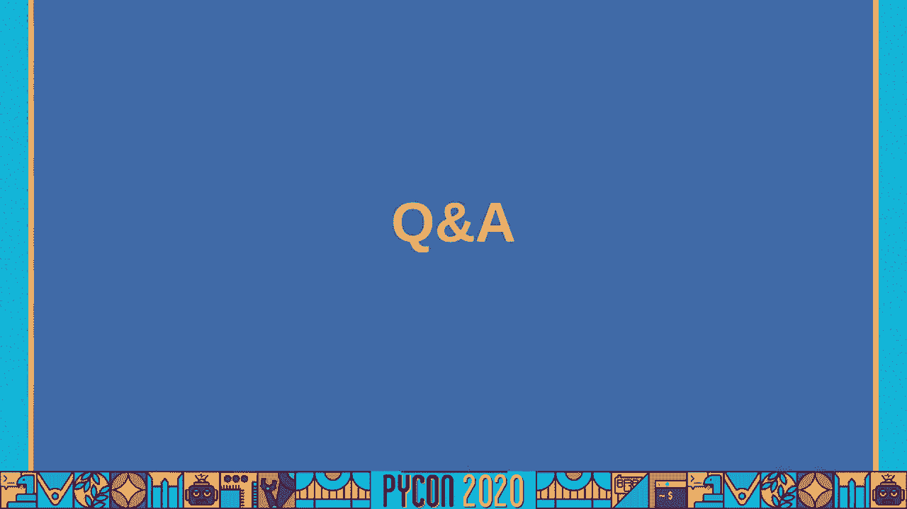
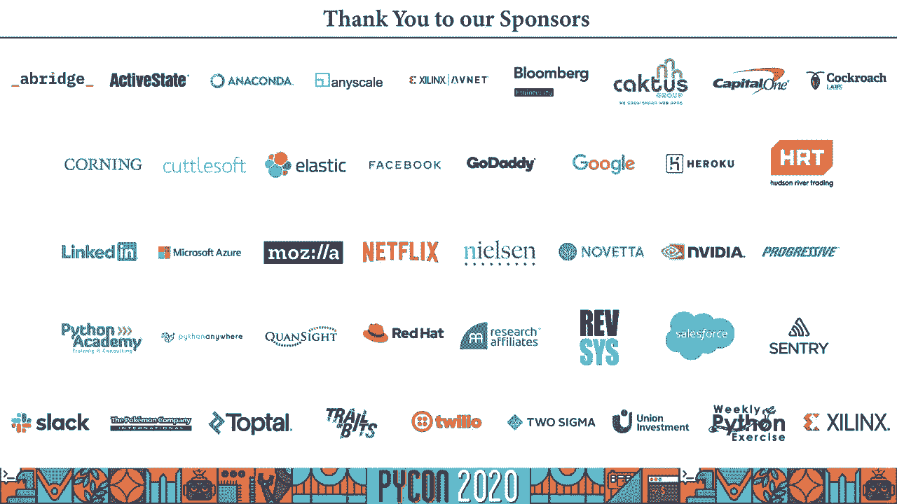

# 程序员百科书：P67：组织以改善你的工作场所，了解你的权利 🛠️

## 概述
在本节课中，我们将学习科技工作者为何以及如何组织起来，以改善工作场所并了解自身权利。我们将探讨组织的原因、可用的法律工具、具体步骤，以及一些成功的案例。

---

## 为什么科技工作者需要组织？🤔

上一节我们介绍了课程概述，本节中我们来看看科技工作者组织起来的根本原因。

许多人认为科技行业待遇优厚，无需组织。然而，科技工作场所存在诸多问题。例如，薪酬不平等普遍存在，报告显示，在60%的情况下，从事相同工作的女性薪酬低于男性同事。此外，硅谷60%的科技行业女性曾遭遇性骚扰，其中三分之二的骚扰来自上级。

有色人种在科技领域的代表性严重不足，且常面临歧视和不被信任的处境。超时工作也是常见问题，超过一半的科技工作者每周工作超过40小时。

科技工作者常被要求签署保密协议（NDA），其中15%的人表示这些协议阻止了他们对外讨论公司问题。许多公司还强制要求员工签署仲裁协议，这剥夺了员工在法庭起诉的权利。

工作场所的虐待不仅限于薪酬和技术问题。例如，Facebook的内容审核员因长期接触有害内容而缺乏支持，导致创伤后应激障碍（PTSD）。简而言之，雇主会做他们认为可以逃脱惩罚的事情。

科技行业并非永远供不应求。当需求下降时，现有问题可能会恶化。组织起来不仅是为了改善自身处境，也是对我们所创造的技术对社会产生的影响负责。

---

## 组织的权利与法律保护 ⚖️

上一节我们讨论了组织的原因，本节中我们来了解法律赋予我们的权利和保护。

你们组织的权利不仅限于成立工会。任何两名或以上员工为改善雇佣条款和条件而进行的活动，都称为“受保护的协同活动”。这是所有员工都拥有的权利，无论州法律如何规定，也无论你签署了什么合同。

如果你的老板因你参与此类活动而解雇你，这是非法的。当然，他们可能借口其他理由。例如，亚马逊解雇了要求COVID-19防护的克里斯·斯莫斯，并声称是因为他违反了社交距离规定。

需要注意的是，个人举报（告密）并不总是协同活动，但它受到其他法律的单独保护。任何有合理理由相信存在违法违规或公共安全危险的个人，在披露信息时都应免受报复。

---

## 如何组建工会：分步指南 📝

上一节我们了解了法律基础，本节中我们来看看组建工会的具体步骤。

以下是组建工会的关键步骤：

**第一步：与同事交谈**
如果你想组织起来，首先应与同事交流，了解共同的关切和不满。在此阶段，通常需要对雇主保密。

**第二步：建立组织委员会**
在交流过程中，一些同事可能对组建工会感兴趣。你们可以一起创建一个组织委员会，这有助于更好地代表所有工人。

**第三步：争取多数支持**
一旦有了强大的组委会，就需要争取大多数同事的支持。此时，雇主可能会开始反对，例如举行强制性的反工会会议。

**第四步：签署工会授权卡**
在争取支持时，需要分发“工会授权卡”。员工在卡上签名，表示他们希望由工会代表。这些卡应保密，不交给雇主。

**第五步：卡片核查与工会承认**
当足够多的卡片被提交给政府机构后，会进行“查卡”以验证签名真实性。如果大多数工人的卡片通过认证，工会即被承认。

**第六步：谈判合同**
工会被承认后，下一步是与雇主谈判合同。合同必须通过工会成员的无记名投票，并获得多数批准才能生效。

---

## 应对雇主报复与建立力量 💪

上一节我们介绍了组建工会的流程，本节中我们探讨如何应对可能出现的雇主报复。

工人组织时最大的担忧之一是雇主的报复。法律上，雇主不得因员工参与受保护的协同活动而进行报复。然而，现实中报复仍会发生，例如Kickstarter和谷歌都曾解雇过组织者。

我们可以采取一些措施来防止和应对报复：
*   **建立互助基金**：为遭受经济困难的同事提供财务支持。
*   **构建支持网络**：帮助被报复的员工寻找新工作，维护其声誉。
*   **提供全面支持**：包括情感、社会、法律和后勤支持。
*   **依靠集体力量**：最有效的方法是团结多数人。当许多人站在一起时，雇主很难针对个人进行报复。

科技工作者的高薪源于市场对我们的需求，而非老板的善意。这意味着我们拥有议价能力。通过团结，我们可以将这种能力转化为改变工作场所的力量。

---

## 科技工作者的组织文化 💻

上一节我们讨论了应对报复，本节中我们来反思科技行业特有的文化如何影响组织。

许多科技工作者将自己视为“高管”而非“工人”，或希望工作与“政治”分离。这类似于编程中的“单一责任原则”，即希望每个部分只关注自身功能。

然而，这种抽象是“漏洞百出”的。我们编写的代码可能侵犯隐私，我们构建的工具可能用于监视。忽视这些影响，就像认为我们只对写代码负责一样，是不现实的。我们有责任共同解决我们创造的技术所带来的问题。

---

## 成功案例与资源 🌟

上一节我们探讨了行业文化，本节中我们来看看一些成功的组织案例以及可用的资源。

**成功案例**
*   **Kickstarter工会**：尽管管理层反对并解雇组织者，员工最终投票成立了工会。
*   **Glitch工会**：超过90%的员工表示支持后，公司自愿承认了工会。
*   **HCL科技公司工会**：员工成功组建了工会。
*   **Amazonians United**：通过组织压力，为所有亚马逊员工赢得了带薪病假。
*   **谷歌结束强制仲裁**：在“谷歌人”组织的持续压力下，谷歌停止了对新员工强制要求仲裁协议。

**资源与组织**
以下是一些可以帮助你开始的组织和资源：
*   **工会**：
    *   **美国通讯工人协会**：旗下有“CODE倡议”，专门组织数字雇员。
    *   **钢铁工人联合会**：曾帮助HCL员工组织工会。
    *   **专业雇员办公室**：曾帮助Glitch成立工会。
*   **组织平台**：
    *   **Coworker.org**：数字平台，帮助员工联系并配有训练有素的组织者提供指导。
*   **科技工作者团体**：
    *   **技术工人联盟**：全球性的非正式组织，在许多地区有分会。
    *   **游戏工人团结会**：针对游戏行业工人的组织。
    *   许多大型科技公司内部也有特定的员工组织。

---

## 来自组织者的心声：Kickstarter案例 🎤

上一节我们列举了外部资源，本节中我们通过一位亲历者的讲述，深入了解组织过程中的挑战与收获。

克拉丽莎是Kickstarter工会的早期组织者之一。她参与组织的契机是与同事泰勒的一次通话，他们讨论了管理层对提出异议的员工进行报复的情况，并意识到需要一个工会来防止此类行为。

**组织过程中的挑战：**
*   **建立信任**：需要与同事深入交流，了解他们的关切，同时确保信息不会提前泄露给管理层。
*   **解释工会价值**：有些同事与经理关系良好，难以理解工会的必要性。组织者需要解释，工会是关于建立更健康的权力结构，而不仅仅是对抗管理层。
*   **应对恐惧**：员工普遍害怕报复、组织失败或需要漫长等待。
*   **管理层的意外反对**：即使公司标榜进步价值观，管理层仍可能强烈反对工会，这是组织者始料未及的。

**经验与建议：**
*   **为自己而战**：组织不仅是为他人，也是为自己。克拉丽莎在组织过程中才发现自己的薪酬低于男性同行。
*   **提前准备法律保护**：如果可能，应更早地了解如何合法地保护自己，例如详细记录工作表现和管理层的对待方式。
*   **识别管理层的策略**：管理层可能在发现组织活动后突然改善某些条件，这可能是破坏工会努力的一部分策略，而非真诚的改变。

**投票时刻**：投票日令人激动，同事们集体前往办公室投票，展现了团结的力量。目前，工会正在等待与公司谈判合同。

---

## 总结

本节课中，我们一起学习了科技工作者组织起来的原因、法律赋予的权利、组建工会的具体步骤，以及如何应对挑战。我们看到，组织不仅是改善薪酬和工作条件的手段，也是对我们创造的技术负责的表现。通过团结一致，科技工作者可以赢得更好的合同、结束不公正的做法，并共同塑造一个更公平、更有影响力的行业。记住，健康的社区始于健康的工作场所。