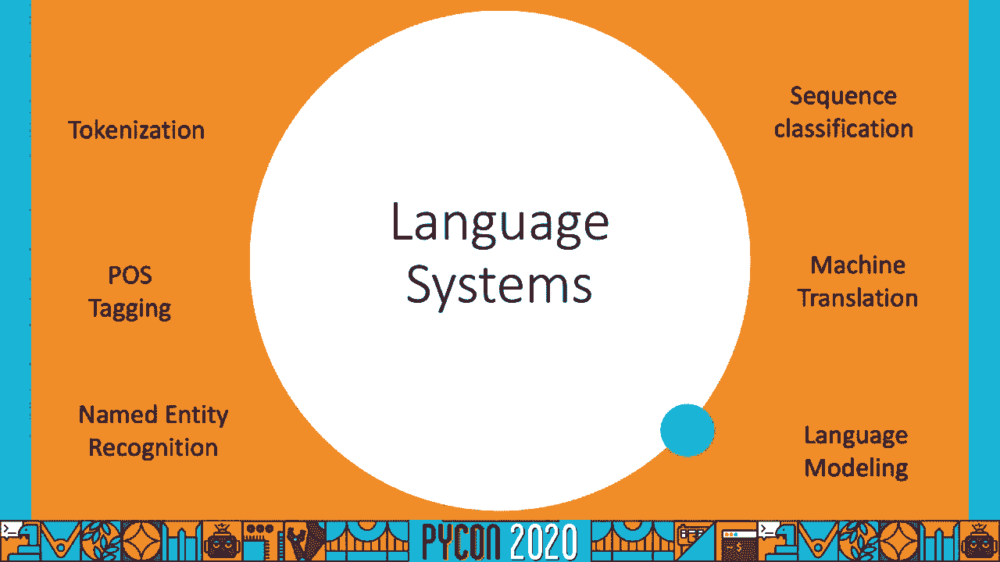

# P68：谈论 Shreya Khurana - 你的 NLP 模型多语言能力如何 - 程序员百科书 - BV1rW4y1v7YG

大家好，欢迎来到 PyCon 2020。这是我关于你的多语言能力的演讲。

NLP 模型。首先，我想说，我很希望能在匹兹堡与大家见面，不仅是因为我会更享受，更因为你们将是比我的洗衣袋更好的观众，而且你们清晰地就在我面前。好了，先说说我自己。我是一名数据科学家。

在 GoDaddy，我自去年七月以来一直在这里工作。在此之前，我在伊利诺伊大学香槟分校完成了我的硕士学位，主修统计学。我处理非结构化语言数据和深度学习模型。在此之前，我还从事过患者层次建模。如果你有兴趣，可以随时联系我。我会分享。

我的 LinkedIn 联系方式和我的 GitHub 链接在最后。这个演示包含几个笔记本，如果你想跟随它们，可以直接访问我的 GitHub 链接，你可以找到所有需要安装和运行这些笔记本的内容。好的，那么这次演讲将如何进行。我将介绍什么是多语言数据。

我们在代码切换数据和音译方面所面临的挑战。我们有什么框架可用于语言识别，以及我们如何应对这些挑战。接下来我们将转向深度学习模型 BERT，看看 BERT 多语言在代码切换音译数据上的表现示例。

我们将研究如何评估 BERT 多语言模型。那么我们为什么在乎多语言数据呢？目前地球上大约有 70 亿人说 6800 种语言，遍布 93 个国家。这是一个巨大的统计数据。大约 16 亿人说普通话，5 亿人分别说英语、西班牙语和印地语，而印地语也是我的母语。

由此可见，这个巨大的统计数字显示我们需要进化我们的自然语言系统，以便能整合所有客户和全世界的人，消除语言障碍。好吧，每当我们处理语言系统时，我们都有一些相关任务。

首先最基本的是标记化，我们尝试做的是，假设我们有一个输入句子，试图将其分解成已经存在于我们词汇中的单词。词性标注意味着你必须给这些单词分配某种标签，比如名词、形容词、副词等等。命名实体识别是你所要做的事情。

要做的是找出输入序列中哪些词是命名实体，比如地点、人物名字等。语言建模。在我看来，这是语言系统中最有趣的工作。因此，你要做的是输入一个句子，基本上尝试预测该句子的概率，即该句子的概率。

在该语料库中，给定前几个单词，接下来这个词出现的概率是多少。机器翻译顾名思义，就是从一种语言翻译成另一种语言，而现在随着神经网络在自然语言处理（NLP）中的蓬勃发展，这一领域正在进行大量研究。序列分类可能与情感分析有关。

分析，你要做的是输入一个序列，然后尝试将其分配给一个或另一个类别。现在让我们看看一些这种新方法的例子。

我们所看到的这种语言数据意味着你正在尝试将一种语言的句法或语法与另一种语言混合，这种情况通常发生在我们有多语言使用者的时候，他们有时会将多种语言的元素混合在一起，因此你会看到不同的音位和句法混合在一起。在右侧，你可以看到这个例子。

其中前两个单词是英语，其余句子是马来语，你经常可以在对话中看到它们。这是一个西班牙英语的例子，因此它是英语和西班牙语的混合，前几个单词是英语，其余部分是西班牙语。好吧，实际上是利用我的 Facebook 时间线去寻找代码切换的例子。

翻译的数据。第一个例子是代码切换，因为在第一个例子中的前几个单词是翻译文本，这意味着它是印地语，但实际上是转换为英语字母，最后三个单词“让我庆祝”是英语。这个例子是独特的，因为前几个单词是。

在印地语中，他们没有很好的书写方式，这意味着它使用的是本土书写系统。最后几个单词是英语，还有几个词是转写的英语文本。这是一个推文的例子，你可以识别出前四个单词“当你妈妈说”是英语，但其余的单词是转写的。

英语。这些例子在观看 YouTube 评论或亚马逊推文，或在 Facebook 上时是相当常见的，这是因为每当多语言者说话时，他们往往会混合不同类型的语言和语法。因此，作为 Facebook 这一倡议的一部分，实际上是打破障碍，允许每个人以自己的方式进行互动。

在自己的语言中，他们开始使用转写文本，并将其翻译成本地文字或英语文字。因此，转写的官方定义是将用一种字母书写的词转换为另一种字母，这通常发生在你没有对不同文字的支持时。

在你的键盘上或者如果你在手机上工作，基本上用一个字母集工作会更简单。因此，在屏幕截图的左侧，你可以识别出不同的文字，有些英语单词你可能无法识别，可能还有西班牙语单词，而 Facebook 所做的就是他们。

基本上将所有内容翻译成英语，因此如果你是一个不会说西班牙语或其他文本中展示的语言的说话者，那么你将能够识别右侧的屏幕截图，并以英语阅读内容。好了，现在我们转到语言识别。语言识别是一个非常困难的问题，因为存在某些。

在许多语言中共享的词汇，而我们现在要覆盖的第一个框架是 CLD3。CLD3 是谷歌发布的一个 Chrome 扩展，如果你使用过 Chrome，你就知道它可以检测语言。那么它是如何构建的呢？是使用 N-grams。所以他们做的是假设你有一个输入序列。

他们会提取单元，并计算每个 Instagram 的概率，因此在这种情况下，单元仅仅是一个简单的字符。然后他们会转向双元，查看字符对以及它们在输入序列中出现的概率，对于三元也是如此。然后基本上。

他们会将所有这些单元概率嵌入到一个嵌入层，然后将其输入到某些神经元的隐藏层，基本上再送到一个 softmax 层。在推理过程中，他们会提取输入文本中的这些 N-grams，计算概率，然后只需通过整个神经网络进行一次前向传递。

所以让我们看看 CLD3 的实际应用。它支持这里展示的一组语言，也支持圈出的那些转写语言。因此你可以看到，它支持中文、转写的俄语、保加利亚语、希腊语（EL）、日语（JA）、印地语（H.I），而拉丁前缀和后缀则表示它是转写的。

CLD3 有一个叫做 get language 的功能，如果你输入一句话或一串字符，它会识别出是什么语言。因此，它会给出预测该语言的概率，并且还会提供它认为文本中属于该语言的比例。在这里，第一个例子中我们看到。

我给它混合了法语的几句话，前面三个单词是 Jürburgr，然后我们给了它一个网址，但它无法识别出句子中的法语部分，这是因为它对网址产生了困惑，网址是英语。现在 CLD3 还有另一个功能，即你可以获取多种语言的预测，这只是获取频繁的语言。

我尝试这样做。我尝试给它相同的输入序列，而我所期望的是，它能够识别出其中有一定比例是法语，有一定比例是英语，但它无法做到这一点。好吧，让我们看看其他一些例子。现在这个输入文本在这个例子中是俄语音译。正如你所看到的。

你可以看到它能够定期很好地识别，并且具有很高的概率。它说这是可靠的，而文本中拉丁语的比例为 1，这是完全正确的，因为这些是支持的语言。通常情况下，你会发现你需要进行实验，以找出它的准确性。

这是为了你自己的语言。现在我给它一段用其本土文字书写的俄语，它能够以相当高的概率识别出来。让我们看看它在音译数据上的表现。这是一段音译的印地语，正如你所看到的，有一些比例是通过大写字母表示的。

我想看看它是否能够进行预测，因为它似乎确实是基于印地语音译数据进行训练的，但在这里它预测为芬兰语，这是因为它可能与芬兰语言有一些共同词汇。我在这里给了另一个例子，就是印地语的“你好吗？我很好”，这是一句非常常见的短语，再次这是。

正如你所看到的，这里是音译的，但它并没有预测出印地语音译，它预测为盖尔语。让我们看看它在代码切换数据上的表现，对吧？代码切换数据，如果你记得，就是在单一序列中混合两种语言。所以这是西班牙语和英语，正如现在的酷孩子们所称之的，这就像西班牙英语混合体，但当你把它喂给。

CLD3 并没有预测它是西班牙语或英语，而是预测它是毛利语。我还给了它其他一些短语，这又是西班牙英语混合，这是法语和英语的结合。它不能很好地预测，确实是，它预测出一些像加泰罗尼亚语这样的结果，这是一种源自拉丁语的西方罗曼语言，比例为 1。

在最后几张幻灯片中，你看到 CLD3 有自己的挑战，它无法以很高的概率预测所有语言。我们转向另一个框架，即 LANGID。LANGID 是一个独立的语言识别工具，它预训练了 97 种语言，可以作为网络服务进行部署，但基本上在其基础上，它只是一个。

朴素贝叶斯分类器和多项事件模型的组合，它只查看字节和 n-gram 的混合物。现在我们来看看实践中如何运作，所以我所做的是加载模型，您在这里标准化概率，这意味着您有评分，并将为所有不同语言标准化概率。

我将语言设置为特定语言集，这里是使用该模块的一个非常有用的优点，您可以将其实际设置为特定语言集。因此，如果您确定训练集只有四种语言，您可以将其提供给识别器，它将预测这四种语言之一。现在让我们看看我们所说的语言，包括俄语、英语、意大利语和斯洛伐克语。

我们看到这是之前在 CLD3 中给出的转写俄语，它预测为慢瓦基安语，概率为 0.67。另一个例子是这个印地语转写，我给了一组印地语和英语文本，但由于它根本不支持转写文本，因此只预测为英语。

因为它在这里看到的是英语字符。我们还有另一个识别框架 Langdetect。然而，您应该知道 Langdetect 有一个特点，即它是不可确定的，这意味着如果您在文本过短或过于模糊的情况下运行它，可能每次都会得到不同的结果。

分类器基于字符的 n-gram 工作。然而，它仅支持大约 49 种语言，并且精确度约为 99.8%。不过，它不支持任何转写语言，其工作原理基本上是根据语言计算特征。如果您查看带重音的 E，您只能在西班牙语和意大利语中看到，而在其他语言中则不太常见。

它是基于英语的，并会查看像 Z 开头的单词在德语中使用的频率与在英语中使用的频率的差异，然后计算给定输入序列的这些特征的概率。在 Python 中，您可以将其导入为 Langdetect，它有一个检测函数。

您可以根据自己的节奏浏览笔记本，进行尝试，给它更多例子，感受它在您偏好的语言上的表现。正如您在这里所见，由于它不支持转写数据，它只预测为慢瓦基安语。如果您再次运行它，由于其非确定性，它会给您不同的结果。

四种不同语言和四种不同概率的预测，如这里所示。慢瓦基安语、阿尔巴尼亚语、赫尔语、匈牙利语、加里语，但其中没有俄语。在之前的几张幻灯片中，我们看到所有这些框架都有自己的局限性。

识别它们。如果你的文本长度非常小，那意味着你只是在给模型或这些框架中训练的任何模型提供非常少的信息。不同语言中的借用词通常可以在任何语言的词汇中看到，这也是某些框架在预测时相互混淆的原因。

有非常不同的音译方案，比如我在印地语中的音译写法与我在印度不同地区的朋友的写法非常不同，而他使用的是不同的英语脚本。不同语言中有重叠的词汇项，某些语言的词汇有相同的词但有不同的含义，这常常会让这些模型感到困惑。

而且你会看到，有限的数据意味着所有这些代码切换语言的示例和这些翻译的示例，实际上很少的数据来训练你自己的模型。所以如果你希望你的模型能够识别这一点，你必须有一些东西来给你一个非常高的概率，表明它实际上是一段。

音译文本，或者如果它实际上是一段代码切换文本，但这些框架没有给出的原因是因为它们在这些特定特殊案例上训练的数据非常少。那么我们该如何解决这个问题呢？

一种方法是你实际增强你的数据集，使用你自己构建的数据集。因此你会发现，你的语言中没有足够的数据。例如在 ISO 中，在音译文本中，我没有一个特定的平行语料库可以使用。所以如果我想检测某些内容。

如果它是音译过来的或者如果是英语，那么没有任何模型是在非常大数据集上训练的，实际上给我这个结果的概率非常高。你经常会看到这些现成的模型，它们也在多种语言上进行训练，但如果它们是在多种语言上训练的，就像我们会看到的 BERT，你会发现它们的词汇是广泛的。

还有许多其他语言，你希望处理的语言，这只会给你的模型带来来自其他语言的噪音。那么我们该怎么做呢？第一件事是你必须识别一个数据源或多个数据源，这些语言可以通过规则或机器翻译转换为你的语言。然后，你使用这些机器生成的数据来。

例如，现在假设我正在处理印地语，我想获取更多的数据和音译形式。所以我有这批印地语维基百科文章的转储，这些文章在线上可以轻松获取，我构建了自己的音译器，这个音译器是基于规则的，因此我定义了一些规则。我把它们给我的音译器类。

它基本上将这些印地语维基百科文章的所有内容转换为一个新数据集。一旦我拥有这个新数据集，我基本上可以用我已有的非常小的数据集进行增强。因此，这个数据集是我们提供给基础数据集的附加内容，实际上有助于提高它的可信度。

要认识到它实际上是音译的。好的，那么让我们看看如何解决这个小例子。现在这是一个非常简单的音译器，我做的只是定义了我的印地语字母与英语字母的映射，并基本上在一段可能是印地语的文本中查看它。

所以如果我有一篇文章或维基百科文章，基本上我会读取所有句子。我使用这些映射将它们转换为英语字母。我定义了一些其他非常简单的规则，例如什么字符可以在其他字符之前出现，然后我将其转换为英语字母。因此，就像这里我转换了这一句来自于某处的单句。

一个关于 Python 的印地语维基百科页面，它将其转换为英语字母。如果你熟悉印地语字母，你会看到这并不是一个很好的音译，因为我们在这里处理的是一个非常简单的例子，我只是想展示你实际上可以基于自己的自定义任务构建更复杂的音译案例。

现在我们可以构建自己的音译系统，或者我们可以查看文献中可能已经存在的其他示例。例如，我在处理印地语时发现了 Sealycrate 库，它是 CS 和 LI，它的功能是已经有一个预训练的神经机器翻译模型，将罗马字母转换为印地语。

基本上，它会给你这样的结果。所以如果你给它一段文本，它会将其转换为印地语脚本，如果该转换的概率非常高，它会分配给它一个印地语标签。所以我得到的是语言识别，不仅是句子级别的，而是词元级别的。因此，这在可能的例子中非常有帮助。

有代码切换数据。现在这仅适用于印地语，但还有许多其他开源库可用于其他语言。好的，现在我们看过所有这些语言识别框架及其相关挑战后，我们该如何解决它们呢？让我们继续看看一些现成的模型，这些模型是现成可用的。

所以我们有这个非常先进的模型叫做 transformer，而 transformer 之所以出名并不是因为它当时所带来的前沿技术，而是因为它促使了神经语言学社区进行大量研究，这意味着在此之后有许多模型和研究论文被发表。

transformer 是在《Attention is All You Need》中引入的。这是 Waspani 等人所写的论文，基本上它有一堆编码器。所以这里就是一个编码器。每个编码器有两层，分别是多头注意力和普通前馈层。我们将在接下来的幻灯片中讨论多头注意力，它有六个编码器堆叠。

类似地，有 60 个编码器堆叠，每个解码器大约有三层。所以再次强调，一个是多头注意力，另一个是前馈神经网络层。好吧，我们一直在谈论多头注意力，对吧？多头注意力是这个概念，是由这篇论文引入的，这也是它变得非常著名的原因。

实际上，注意力并不是在这篇论文中引入的。注意力早在 2014 年就被引入了，注意力是当你试图弄清楚在给定的序列中，哪个词对其他词的关注程度有多高，这基本上意味着你需要计算多少权重或多少关注。

你在这个序列中的每个词上给了多少权重。现在，多头注意力意味着你不仅仅看一种权重，而是查看两种或三种不同的权重集。在论文中，他们使用了八个不同的矩阵。

这意味着他们在查看八个不同的注意力头。因此，随着句子的复杂性增加，它需要弄清楚给定词与序列中其他词之间的不同关系。所以现在如果在没有其他上下文的情况下看到这些词，我可能只是想弄清楚它指的是什么。假设我。

在没有提供任何信息的情况下，我只有这一句，它太累了。我的问题可能是：它指的是谁？它是指谁对吧？谁不太累？是街道吗？还是动物？

基本上，回答这个问题需要关注点。所以这只是我在回答的一个问题，但如果我回答的另一个问题是，为什么动物没有过马路，那么答案就是因为它太累了。因此，这会对不同的词赋予不同的权重，基本上就是这样。

这个模型试图解决的问题基本上是如何回答不同的问题，以及如何根据一个给定的单词给不同的子句分配不同的权重。现在，bird 是什么？再次说，鸟是最先进的 soda。在这个 NLP 社区中你将看到一切都是超越 soda 的，对吧？但 bird。

它的基础是变换器，当它被构建时，实际上所有其他模型都是基于鸟类的。例如，我们有罗伯特，我们有 Disturb，还有两种鸟类，我们有 Senti，bird。我的意思是，我们现在看到的大多数模型，或者说大多数自然语言社区，都是在使用鸟类，研究它的表示，试图去改进。

改进它，试图使其更快等等。那么这是什么？它有什么特别之处？

鸟类之所以特别，是因为它使用预训练和微调的方式。现在在鸟类的预训练阶段，它使用了所有这些语料库，并基本上在这些未标记的数据上进行了训练。它设置了两个任务。第一个任务是下一个句子预测，因此如果你有一个语料库，它会创建一个任务，判断一句话是否是前一句的下一个句子。

50%的时间，然后他们会在另一句话之后创建一个随机句子，这会被标记为错误。他们使用的另一个任务是**掩码语言模型**，将在接下来的幻灯片中介绍。在微调阶段，它的做法是，一旦你有了在这两个任务上训练好的所有权重，你基本上就。

微调这个神经网络以适应你的特定任务，比如序列分类、问答等，这在阅读理解中可以看到。你可以判断一句话是否是另一句话的同义句，等等。因此，鸟类多语言实际上有这种预处理技术，即词片处理，这也是它被证明有效的原因。

对于多语言系统来说，**共享词汇**是非常有用的。因此，这个多语言模型的鸟类词汇大约有 120,000 个，它是基于我们字符序列共同出现的可能性进行标记的。在这一预处理过程中，我们基本上是从字符层面开始，适用于我们所有的语言。

104 种语言是鸟类训练的语言，我们查看哪些字符更有可能一起出现，而这就是我们形成这些子词的方式。所以子词是介于字符和单词之间的一种东西。在这个例子中，我使用的是 Hugging Face 的变换器和标记器库。如果你曾经与自然语言处理(NLP)打过交道，你一定对这个有所了解，但如果你没有。

如果你是第一次听说这个，**一定要去看看**。这个库实际上使我们训练和评估变换器变得非常简单，对于初学者来说是一个非常好的库。所以我只需加载鸟类多语言模型和相应的标记器。然后在第 5 行，我基本上对西班牙语查询进行标记，如果你查看我们返回的部分。

我们所获得的结果是，你会看到分隔的词并不是同样的词，因为它们是由空格分隔的，这就是因为那些是子板块，都是词片段。所以如果你看到子板块开头有一个哈希值，那是因为它意味着它应该附加到前一个词上。所以你可以看到 Ola 被分成了两个子板块。

Kiara 被划分为两个子板块，依此类推。在第 6 行的下一个示例中，我对一个印地语查询进行了标记，你会看到第一个词被分为三个部分，在最后一个示例中，如果你是办公室的粉丝，这就是 B。这是《太空堡垒卡拉迪加》。所以如果你查看节拍，它再次被划分为两个子板块，即 B 和 TS，而哈希值则在它们之间。

这仅意味着该词必须附加到前一个词上。所以让我们看一下语言的统计数据，以及鸟是如何在一个单一词汇中利用这么多语言的，对吧？所以我们先看右侧的图。右侧的图实际上给你提供了繁殖力，而繁殖力是从统计机器翻译中借用的一个术语。

这意味着对应于一个单一的真实标记，鸟的词片段的平均数量是多少。在最后一个示例中，我们看到 Ola 实际上被分成了两个词片段，对吧？所以如果你在看那个词的繁殖力，它的意思就是它有两个。但对于某种特定语言，我们会计算每个词在该语言中被分成的词片段的平均数量。

在这个图的左侧，你可以看到繁殖力与语言的关系，某些语言，如葡萄牙语、希伯来语和英语，繁殖力大约为 1，这意味着它们保留了自己的原始词汇。所以这意味着英语中的大多数单词实际上被分成了仅一个词片段。

这意味着它只是原始的一个。在这些图的右侧，你可以看到泰米尔语、泰卢固语、亚美尼亚语、希腊语等，这些语言的词被分为两个以上的词片段。所以在这些语言中，如果你取一个平均词，它更可能被分成更多的词片段。

在图的左侧，如果你看到你正在绘制与字符长度有关的频率。这意味着我们看到多少个词片段以及它们的长度。因此，这又是一个非常常见的图，因为随着字符数量的增加，你会看到频率下降，这是非常常见的，因为你可能会将其分解为越来越小的词片段。

实际上，这些词被看到的可能性更高。因此，我们在这里讨论的是 PERT 被遮罩语言模型。这个模型的特别之处在于它是双向的，这意味着在预测一个词时，你基本上会从左到右和从右到左看上下文。因此，在 PERT 中，作者对所有词的 15%进行了遮罩。

随机选择部分标记，并以 15%的概率替换其中每个词，80%的概率会遮罩，10%的概率会变为随机标记，以及 10%的概率会保持原始标记不变。而评估这个语言模型的方法是通过预测被遮罩词的准确性。

所以在这里我们定义了一个函数，用于在给定序列中预测特定词汇。在这里我再次使用 transformers 库，加载的是用于被遮罩语言模型的 PERT 模型，并加载多语言模型，因为我们将查看某些多语言示例。在这个函数中，我们取一段文本，进行标记化。

第二个参数是你想预测的词，你基本上只需在这里给一个遮罩，然后将其输入模型，模型会进行预测，你取概率的最大值，然后查看哪个词是模型最可能预测的。你还会查看某些其他预测，以便确认你期望的预测是否在前 K 个中。

好吧，现在我们已经定义了预测被遮罩词的函数，接下来我们来做几个例子。在第一个例子中，我给了一段切换语言的文本，前几个词是英文，最后几个词是西班牙文，意思就是“活着，让活着”。所以基本上，我想要预测的是这个被遮罩的词“Tejar”。

现在模型实际上能够预测出很多有意义的词，所以如果你查看其中几个，"solo" 意为“只是”，而“live” 则意味着“活”，而“Tambian”也有“也活着”的意思。因此，所有的词都有意义，模型能够识别我们讨论的上下文，尽管语言混合。

在另一个例子中，我给出了相同的文本，但我想要预测“we will know”。这里需要注意的是，如果你查看预测的词汇列表，你会看到“Viva”，意味着“活”，并且模型能够识别上下文，我认为这主要是因为句子中还有另一个“VV”。

我还尝试用印地语进行这个实验，因为我对印地语更熟悉。基本上，我看到的是，当你给一段非常小的文本时，模型能够预测出实际的词，其准确度非常高，但其他的句子预测在给定的输入序列中根本没有意义。

现在让我们来看另一个代码切换的例子，这个例子稍微长一些，其中包含印地语和夹杂的英语。所以你可以看到前几个单词和框内的单词是印地语，剩下的单词是英语，你看到这些短语经常一起出现，比如。

印地语博客、印地语博主、流行的印地语博客等等。所以我做了这个。我给它这段文本，并要求它预测单词“博客”。现在在预测的标记列表中，你可以看到它实际上把这个词识别为第一个候选，这很好。在其他预测中，你可以看到它给出了一些。

大写的“博客”、“出版商”、“论坛”意味着它实际上能够识别给定词的上下文，因为它在多个短语中出现。所以你可以看到它在不同短语中出现，比如“最佳印地语博客”、“流行的印地语博主”、“再次流行的印地语博客”。所以它能识别“出版商”。

“博客”或“论坛”的原因是它一次又一次地读取所有这些内容，而且因为它是双向的。所以你会经常看到这个。因此，如果你给它一段非常长的文本，里面有太多上下文信息，它会很不错地识别出这个词，无论你中间是否切换语言。

另一个看到大量翻译文本的地方是歌词。所以我非常喜欢宝莱坞，每当我不知道一首宝莱坞歌曲的歌词时，我都会去谷歌搜索。结果通常是用英文字母写的，这就是我们获得大量翻译的原因。所以现在我给它这段很大的文本，正好是歌词。

或者流行的宝莱坞歌曲，我要求它预测这个词“MEIN”。现在如果你注意到“MEIN”旁边的下一个词是 HAI，它在另一个上下文中再次出现，下一个词也是 HAI。现在如果你查看预测的标记列表，你会看到它能够识别目标词是 MEIN，如果你查看一些。

那里的标记大多数只是附加词，如果你看一个标记是 HAI。这个词在文本中出现得很频繁，实际上这是我们主词的下一个词。它之所以能给出这个预测，是因为它看到这个词在相同的上下文中出现得很多。所以如果你提供大量信息，它会查看。

右侧上下文，它会查看左侧上下文，并能够识别出主词，因为同一个词出现了多次。好的，现在我们看过主语言模型如何表现后，让我们看看如何评估我们用它进行的某些任务。假设你有这段多语言文本，你正在尝试为每个单词部分提供 POS 标签。

首先你需要做的是组织它，因为这就是出生的运作方式，你必须将其组织成词片。你可以通过给相关词的第一个词片打标签来为它们分配标签。这意味着如果你在看这句话，"Jim"是一个词片，而"and"是另一个。词片"and"被分为"hen"和"son"，你基本上会给这个词片打标签。

第一个词片是"hen"，你会省略最后一个词片。同样在这里，如果你给一个词片"puppet"和"ear"，你也会省略最后一个词片，然后只给第一个词片打标签。现在，有多种方法可以做到这一点，你可以将**BERT**表示作为另一个神经网络的输入，或者完全微调**BERT**。

生成或评估度量实际上与正常的神经机器翻译模型所做的非常相似。如果你查看**大规模语言模型**，你想要了解的是，**BERT**模型的预测准确性有多高。所以你可以查看前 10 的准确性、前 3 的准确性或前 5 的准确性，这取决于你。

你的机器翻译中的度量标准，比如**蓝色分数**，对于多语言生成非常有用。这是因为多语言生成和**BERT**是基于词片的。在词片中，我们有一个跨语言的共同词汇，这意味着如果你有一个多语言数据片段，你实际上不需要每次都切换并找出。

针对不同语言的语言模型。你基本上有这些词片，你将观察哪个词片在另一个词片之后被预测。因此，在束搜索中，我们在每个时间步中查看，并评估在该点上出现的最佳候选者。假设在时间步一，我们找出了这 30 个最佳候选者，我们将评估。

在每个时间步中为所有候选者选出 30 个最佳候选者，最后我们计算出最佳的翻译候选者。你可以为音译做这件事，也可以为代码切换的数据片段做这件事。现在，还有另一种评估生成质量的方法，就是通过**蓝色分数**，如果你曾经使用过，它的使用相当广泛。

你了解机器翻译的内容，但**蓝色分数**的主要思想是，你查看候选序列中的 n-gram，直到 1-gram、2-gram、3-gram 和 4-gram，并将其与参考序列进行比较，找出它们的相似程度。现在，总结一下到目前为止我们所做的，如果你想让你的 NLP 模型。

关于多语言，你需要决定是否真的需要，您所面对的任务是否需要多种语言，这些语言具体是哪些？你是否有足够的数据？如果没有，你需要添加数据，你可以通过像我提到的规则基础的音译工具进行转换，或者如果你有任何已训练好的神经机器模型。

你选择你想要利用的多语言预训练模型，然后你根据任务进行调整。假设你想做分类任务，你需要在顶部加一个 softmax 层。如果你想进行生成任务，你则相应地进行自定义，瞧，这就是你的多语言模型。至此，我们结束了本次演示，在这次讲座中我们看到了。

音译和代码切换数据，以及它们与单语语料库或我们看到的普通语言之间的极大差异，因为它们混合了多种语言。我们看到了一些与这些情况相关的语言识别挑战，我们还看到了如何通过构建自己的数据集来增强数据集，我们可以通过使用基于规则的系统或从特定数据源使用机器翻译来实现。

我们看到了多语言模型在音译数据和代码切换数据上的表现，只要长度足够且上下文充足，最后我们看到可以在没有词云的情况下进行直观演示。好了，我们的演示到此结束。

如果您有任何问题，请随时在下方评论区留言，或者在 LinkedIn 上找到我，使用这个关键词代码，我也可以在 GitHub 上找到，或者随意查看笔记本并询问您有的任何问题，感谢 bycon 和 Python 软件基金会组织此次活动，谢谢，谢谢，[BLANK_AUDIO]。

你。
